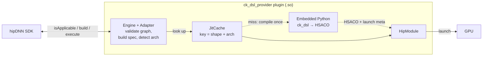
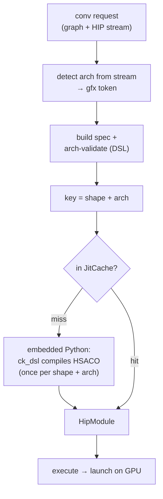
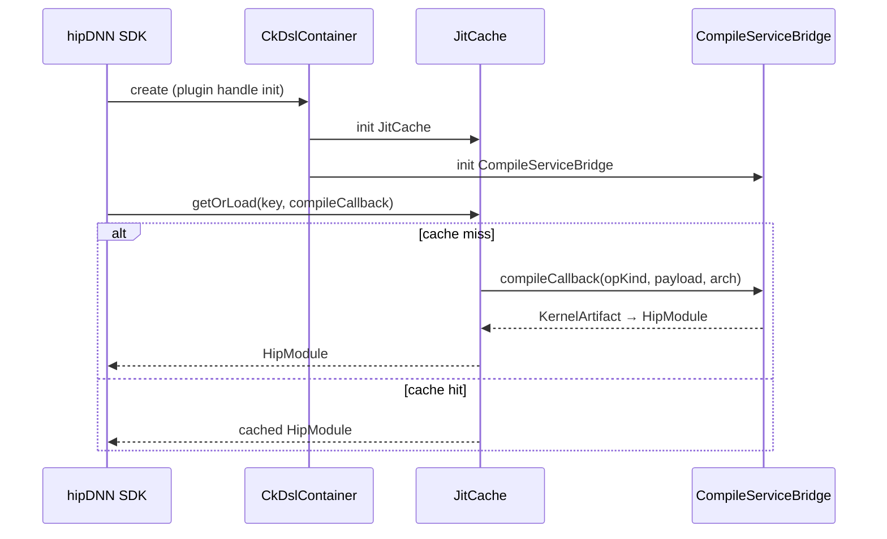

# ck-dsl-provider

hipDNN engine plugin that exposes kernels produced by the Composable
Kernel Python DSL (`ck_dsl`).

## What it does

The provider links against `libpython3` and pybind11 and embeds a
CPython interpreter inside the plugin `.so`. A thin Python compile
service (`ck_dsl_provider/compile_service.py`) is invoked from C++
through a `CompileServiceBridge`, which dispatches on `op_kind`,
builds a `ck_dsl` dataclass from a typed payload dict, calls
`ck_dsl.helpers.compile.compile_kernel`, and returns HSACO bytes
plus the launch metadata the C++ side needs.

A graph-key JIT cache (`JitCache`) memoises the compile result per
process. Subsequent calls with the same logical shape return the
cached `HipModule` rather than re-running the DSL.

The provider currently ships one engine: `CkDslConvImplicitGemmEngine`,
which serves forward 2D implicit-GEMM convolution at FP16 / NHWC. The
adapter accepts the hipDNN `ConvolutionFwdAttributes` graph shape and
rejects asymmetric padding, true-convolution mode, non-FP16 dtypes,
and 3D conv.

## Architecture

### At a glance

The plugin embeds a CPython interpreter and turns a hipDNN conv graph
into a launchable GPU kernel by calling the `ck_dsl` Python DSL. The
expensive compile happens **once per (shape, arch)**; a process-wide
`JitCache` short-circuits every repeat request to a ready `HipModule`.

The request lifecycle, abstracted to the one decision that matters —
cache hit vs. miss:

### Cache and callback setup

`CkDslContainer` (created once per plugin handle) initialises the
`JitCache` and the `CompileServiceBridge`. The bridge is the compile
callback: `JitCache::getOrLoad` accepts a key and a loader callback,
and calls that callback only on a cache miss.

## Trust boundary

The Python source tree that this plugin loads from is part of the
plugin's trust boundary. The CMake-baked `sys.path` entries
(`CK_DSL_PYTHON_PACKAGE_PATH`, `CK_DSL_PROVIDER_PYTHON_PACKAGE_PATH`)
must have the same permissions as the `.so` itself: world-readable,
not user-writable. Anyone able to write to those directories can
substitute the Python source that runs inside `compile()` and
therefore the HSACO bytes that reach `hipModuleLoadData`.

The embedded interpreter is brought up with
`PyConfig_InitIsolatedConfig` so the host process's `PYTHONPATH`,
`PYTHONHOME`, `PYTHONSTARTUP`, and `PYTHONUSERBASE` environment
variables do not influence import resolution. If a sibling embedder
has already initialised CPython when the plugin loads, the existing
interpreter is reused (the isolated-config hardening only applies if
this plugin is the first embedder).

## Tests

- `ninja ck-dsl-provider-unit-check` — host-only + GPU-gated unit
  suite covering the interpreter, bridge, adapter, payload
  round-trip, signature, cache, plan-builder, launch ABI, and
  perf-measurement helpers.
- `ninja ck-dsl-provider-integration-check` — end-to-end conv-fwd
  across a set of shapes on whatever DSL-supported device is present
  (gfx942 / gfx950 / gfx1151), comparing against
  `CpuFpReferenceConvolution::fprop` (via the `computeTensorDiff` test
  helper) and logging kernel time + TFLOPS via the `PerfMeasurement`
  helper. The production plan builder detects the device arch and the
  adapter's `applyArchCodegenConfig` selects a valid per-arch codegen
  config, so the same graph runs on each supported arch.

GPU-gated tests skip cleanly on hosts without a HIP-visible device or
on an arch outside the DSL-supported set.

## Design plan

The provider's architecture, milestone scope, and resolved design
questions are recorded in the implementation plan:

- [CK DSL hipDNN Provider — Plan](../../projects/composablekernel/python/ck_dsl/dsl_docs/hipdnn_provider/plan.md)

This document is the source of truth for the Milestone 1 goal and
non-goals, the runtime embedded-Python architecture, and the rationale
behind decisions such as the embedded interpreter, pybind11 binding,
and provider-local compile service that are summarised above.
