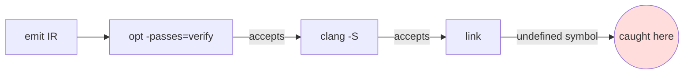

# PR description

Two audiences, two sections, one file. Written in English regardless of the
language of the conversation.

## Before writing

Read the branch, do not reconstruct it from memory.

```bash
git log --oneline <base>..<branch>          # which commits are this branch's own
git log <base>..<branch> --format='%n=== %h %s%n%b' --reverse
git diff --stat <base-branch>...<branch>    # net change surface, stacked-branch safe
```

If the branch is stacked on another, `<base>` is the branch below it, not
`develop`. A commit inherited from the branch below is not this PR's content —
attributing it here is a factual error in the description.

Every claim in the description must trace to a commit message, the diff, or a
verification run. Do not invent numbers, and do not carry over a figure from an
earlier draft without re-checking it.

## Structure

```markdown
# <Sentence-form title: what the branch does, in plain words>

Branch: `<full branch name>`

---

# Summary — For human reviewers

...

---

# Summary — For AI reviewers

...
```

The heading `# Summary — For human reviewers` is fixed, em dash included. Same
for the AI heading.

## Part 1 — For human reviewers

Plain language. Simple words. A reviewer who has never seen this subsystem
should understand *why* the change exists before they see any code.

Sections that have worked, in this order:

- **The short version** — the gap in two or three sentences, then the one
  sentence saying what this PR does about it.
- **Why this matters** / **Why this has to be X rather than Y** — the
  counterintuitive part. Most changes worth a PR description have one thing that
  looks like it should work and does not. Lead with that; it is what makes the
  rest of the design legible instead of arbitrary.
- **How it works** — the design decisions, each with the reason it is not
  optional. Bold the decision, explain the consequence of the alternative.
- **What it found** / **What changes** — concrete outcomes.
- **How this was tested** — what ran, and explicitly what did *not* run and why
  (missing toolchain, no GPU, other host needed).
- **Reviewing this** — commit count, change surface in one line, what is
  untouched.

### Diagrams

A Mermaid diagram is welcome in part 1 when it carries something prose carries
badly. Good candidates:

- a pipeline where the *stage at which something is caught* is the whole point
  (`flowchart LR`);
- existing checks vs. the gap between them, where coverage is the argument;
- a decision or classification with more than three outcomes (`flowchart TD`);
- an ordering constraint — X must happen before Y or the answer is wrong.

Place it right after the paragraph it illustrates, not in a section of its own.
One diagram is usually enough; three means the prose is doing too little.

```markdown

```

Constraints on diagrams:

- Nothing load-bearing may exist *only* in the diagram. A reviewer reading on a
  renderer that does not support Mermaid must still get the full argument.
- Label the edges with the outcome, not with the tool. The interesting content
  is usually "accepts it anyway", not "next step".
- Keep nodes short enough to read without horizontal scrolling — roughly six
  nodes, three words each.
- Do not diagram a linear two-step process or the repository layout. If the
  diagram is a list with boxes drawn around it, write the list.
- The same compliance rules apply inside the diagram: no unreleased version
  numbers, no internal hostnames, no measured performance figures in node labels.

Part 2 does not need diagrams. It is read by something that parses the code.

Rules:

- If the branch is one part of a larger effort, say so in one short paragraph:
  what the whole effort is for, what this PR contributes, and what is
  deliberately left to later changes. **Do not list the other branches.**
- Prefer "this is not hypothetical" with the concrete case over an abstract
  claim.
- State limitations here, not only in part 2. A limitation disclosed by the
  author reads as scope; one discovered by the reviewer reads as an oversight.

## Part 2 — For AI reviewers

Dense, checkable, no persuasion. The goal is to point an automated reviewer at
what is load-bearing and away from what is intentional.

- **Change surface** — file list with line counts in a fenced block, plus one
  sentence on what is *not* touched and why that bounds the blast radius.
- **The gap being closed** — a table of existing checks and what each proves and
  is blind to, or the equivalent one-line model of the problem.
- **Properties to verify** — a numbered list. Each item states a load-bearing
  claim and how to falsify it against the code. Bold the claim, then give the
  mechanism, then what to confirm. This is the core of part 2; everything else
  is support.
- **Repo rules that apply** — the project's hard invariants that this diff must
  satisfy, including ones it trivially satisfies ("no emitter file is touched —
  confirm that remains true").
- **Known-weak points, stated so review can focus** — the real soft spots.
- **Scope calibration** — one sentence of the form "a finding that this PR does
  not do X is out of scope and expected", with the reason X is a later change.
  Without this, automated review reliably reports the deliberate omission as a
  defect.
- **What review cannot establish from the diff** — what needs a run, a host, or
  hardware to confirm.

## Compliance

Binding, and it overrides any instruction to the contrary:

- No confidential or restricted material, no NPI, no unreleased product or
  version numbers, no internal links (ticket trackers, wikis, internal source
  hosts).
- No software-achieved performance numbers. Methodology and levers are fine.
- Prefer "an older vintage" / "one LLVM version" over naming an unreleased one.
  Released versions are fine when they are load-bearing.
- When unsure, treat it as confidential and leave it out.

A bare ticket ID is not an internal link. The PR bot policy in
[`platform/AGENTS.md`](../../../platform/AGENTS.md) *requires* a standalone issue
reference line — `ISSUE ID : AICK-1470`, `JIRA ID : TESTAUTO-6039`, `Fixes #123`
— so keep that line. What the compliance rule forbids is the URL, the ticket
title, and any confidential content quoted out of it.

## Repository requirements

These come from `platform/AGENTS.md` and gate the PR regardless of how well the
description reads:

- **Conventional Commits title with a scope**, e.g.
  `feat(hip-kernel-provider): wire rocKE smoke tests into provider CI`.
- **The standalone issue reference line**, immediately after the title block and
  before `# Summary — For human reviewers`.
- **A Test plan checklist**, kept current, with every deferred lane named
  explicitly rather than silently omitted. This is where "byte-identity could not
  run on this host" belongs.
- If any source file changes, a matching `test_<name>.py` / `test_<name>.cpp` /
  `<name>_test.*` must change with it.
- Before opening or updating the PR, from the repository root:
  `pre-commit run --from-ref origin/develop --to-ref HEAD`.

## Output

Save to `~/<branch-basename>-PR.md` unless told otherwise. Report the path and
anything the user still needs to resolve before opening the PR — in particular
any repository requirement above that the branch does not yet satisfy.
