# Adding A New gfx Target

The end-to-end map for enabling a new AMDGPU device architecture (`gfxNNNN`) in
rocKE: which files a new target touches, in what order, and which gates prove it
landed.

This page is a **route map**, not new policy. The design it routes through is
[`multi_arch_data_layout.md`](multi_arch_data_layout.md) — read its
"Code Organization (Hybrid Layout)", "Review Rules", and "Success Criteria"
sections for the *why*. Dispatch registration is specified in
[`../../python/rocke/dispatch/ARCHITECTURE.md`](../../python/rocke/dispatch/ARCHITECTURE.md)
§8.1; the family-specific attention variant is in
[`../../../library/dispatch/AGENTS.md`](../../../library/dispatch/AGENTS.md).
Hard invariants (byte-identity, one-way dependency, builder signature) are owned
by [`../../AGENTS.md`](../../AGENTS.md) and win on any conflict.

Path notation matches [`authoring_model.md`](authoring_model.md):

```text
<project_root>  = the rocKE component root containing platform/ and library/
<platform_root> = <project_root>/platform
<library_root>  = <project_root>/library
```

## The shape of the work

Architecture enters the *lower* stack only as **data** (`ArchTarget`) plus
**pluggable behaviour** (`ISABackend`). So layers 1 and 2 below are the only
mandatory edits, and they are small: a metadata row and a registry row, each
mirrored in the C++ engine. Everything above them is conditional — a kernel whose
algorithm is portable needs no code at all, because `instances/common/` builders
select from the target through predicates they already compose.

```mermaid
flowchart TD
    START(["New target: gfxNNNN"]) --> L1

    subgraph L1["1 · Arch data — the SSOT, mirrored in both engines"]
        direction LR
        D1["python/rocke/core/arch/data/arch_specs.json<br/>one row: family · target_family · wave_size ·<br/>lds_capacity_bytes · memory · limits · mma[]"]
        D2["cpp/core/arch/data.cpp<br/>static rocke_arch_target_t + k_mma_gfxNNNN[]<br/>faithful mirror of the JSON row"]
        D1 -.->|"must match"| D2
    end

    L1 --> Q1{"Does the target expose<br/>MMA/WMMA op_ids that<br/>no arch lists yet?"}
    Q1 -->|"yes"| A1["_MMA_FRAGMENT_INFO row in core/arch/target.py<br/>frag lens + lane-coord maps for A/B/C<br/>+ the same layout maps in cpp/core/arch/data.cpp<br/>+ emission in cpp/core/lower_llvm/mma.cpp"]
    Q1 -->|"no"| L2
    A1 --> L2

    subgraph L2["2 · ISA backend — code, per gfx family"]
        direction LR
        B1["core/isa/backend.py<br/>BACKEND_REGISTRY['gfxNNNN'] = Gfx…Backend<br/>reuse a class; subclass only if codegen diverges"]
        B2["cpp/core/isa/backend.cpp REGISTRY row<br/>+ cpp/core/lower_llvm/core.cpp rocke_ll_backend_for"]
        B1 -.->|"both C++ rows required"| B2
    end

    L2 --> Q2{"Does the kernel algorithm<br/>itself diverge on this target?"}
    Q2 -->|"no — portable"| K1["instances/common/ builders pick it up<br/>through ArchTarget predicates.<br/>NO edit to a shared builder, a *_policy.py, or _Lowerer"]
    Q2 -->|"yes — divergent"| K2["instances/gfxNNNN/&lt;module&gt;.py + cpp/instances mirror<br/>library attention: library/kernels/gfxNNNN/<br/>spec + build_*(spec, arch) + is_valid_spec"]

    K1 --> L3
    K2 --> V1["Harness + evidence:<br/>library/builders/gfxNNNN/&lt;family&gt;/*_verify.py<br/>examples/gfxNNNN/&lt;workload&gt;/ replayable case study"]
    V1 --> L3

    subgraph L3["3 · Dispatch — declared coverage, additive"]
        direction TB
        Q3{"Does a family need a builder<br/>it does not already have?"}
        Q3 -->|"no"| R0["Extend the existing candidate's<br/>Capability arches tuple. Stop."]
        Q3 -->|"yes"| R1["&lt;tree&gt;/dispatch/&lt;family&gt;/gfxNNNN.py<br/>with register(registry)"]
        R1 --> R2["Capability(arches=('gfxNNNN',), dtypes, ShapeRange,<br/>supports_features) — explicit gfx list, never a<br/>cdna/rdna family label"]
        R2 --> R3["build → the real builder<br/>select_spec → the builder's spec type"]
        R3 --> R4["one line in the family __init__ assembly loop"]
        R4 --> R5["Keep it opt-in: extend a generic unified_* candidate's<br/>arches ONLY after it has actually run on the target"]
    end

    L3 --> L4

    subgraph L4["4 · Docs"]
        direction LR
        C1["dsl_docs/optimization/arch/gfxNNNN.md<br/>the 10-subsection 21.x skeleton"]
        C2["+ row in arch/README.md index<br/>+ entry in the runbook §21 hub"]
        C1 --> C2
    end

    L4 --> G

    subgraph G["5 · Gates — 'done' means all green"]
        direction TB
        G1["tools/check_byte_identity.py at EVERY flavor<br/>llvm20 · llvm22 · llvm23"]
        G2["test_cpp_engine_lowers_every_arch_python_wires<br/>a Python row without the two C++ rows FAILS here"]
        G3["arch-gate dispatch test: new candidates reject every other arch<br/>+ additive-registration + declared-coverage invariants"]
        G4["tools/run_checks.py · platform/tests/run_all.py"]
        G5["On-GPU numeric parity on real gfxNNNN hardware<br/>no perf claim without correctness"]
        G1 --> G2 --> G3 --> G4 --> G5
    end

    G --> DONE(["Target enabled"])
```



## 1 · Arch data

[`<platform_root>/python/rocke/core/arch/data/arch_specs.json`](../../python/rocke/core/arch/data/arch_specs.json)
is the single rocKE-owned description of what a gfx target supports. One row adds
the target: `family`, `target_family`, `wave_size`, `lds_capacity_bytes`, the
`memory` capability bits, the `limits` block, and the `mma` catalog. It carries
**hardware facts only** — no pipeline or scheduler vocabulary (that is
instance-side policy) and no LLVM intrinsic text (that is the `ISABackend`).

`ArchTarget.from_gfx()` fails with `unknown gfx target 'gfxNNNN'; known: [...]. Add
a row to arch_specs.json.` until the row exists, and the C++ engine reproduces
that message verbatim from several `cpp/instances/common/` spec validators.

Mirror the same facts into the C++ SSOT,
[`<platform_root>/cpp/core/arch/data.cpp`](../../cpp/core/arch/data.cpp), as a
static `rocke_arch_target_t` plus its `k_mma_gfxNNNN[]` catalog. The two SSOTs
are compared by the byte-identity gate, not by review alone.

### New matrix atoms

An `op_id` that no existing arch lists needs a row in `_MMA_FRAGMENT_INFO`
([`core/arch/target.py`](../../python/rocke/core/arch/target.py)): per-lane
fragment lengths for A/B/C plus the lane-coordinate maps that place each fragment
element in the logical M/N/K tile. This is the cross-arch data-layout contract
that lets one kernel body drive both wave64 MFMA and wave32 WMMA.

A JSON-only `op_id` with no such row still loads — it carries zero frag lengths
and no maps — and then raises `NotImplementedError: no verified 'a' layout map for
MMA op_id ...` the first time a kernel asks for it. Emission for a genuinely new
atom shape also lands in [`cpp/core/lower_llvm/mma.cpp`](../../cpp/core/lower_llvm/mma.cpp).

## 2 · ISA backend

Add one row to `BACKEND_REGISTRY` in
[`core/isa/backend.py`](../../python/rocke/core/isa/backend.py). Reuse an existing
class (`Gfx9MfmaBackend`, `Gfx950Backend`, the RDNA/WMMA backends); write a
subclass only when the target's codegen actually diverges. Adding a gfx is
explicitly *not* "edit `_Lowerer`".

The C++ side needs **two** rows: the `REGISTRY` table in
[`cpp/core/isa/backend.cpp`](../../cpp/core/isa/backend.cpp) and the resolver
`rocke_ll_backend_for` in
[`cpp/core/lower_llvm/core.cpp`](../../cpp/core/lower_llvm/core.cpp).

A backend row may legitimately land **before** the arch metadata — `gfx908` and
`gfx90a` are such forward declarations today. `backend_for()` resolves the
`ArchTarget` first, so that case reports "forward-declared but has no
arch_specs.json metadata yet" instead of leaking a raw `KeyError`, and
`wired_arches()` returns only the rows that can actually build a backend.

## 3 · Kernels

Where a kernel lives is decided by the algorithm, not by the target:

- **Portable** — IR construction is the same modulo values selected from the
  target (`MmaOp` op-id, waitcnt encoding, datalayout, `arch.wave.*`). It stays in
  `instances/common/` and needs **no edit**: existing builders and
  `common/<family>_policy.py` pick the new arch up through the hardware predicates
  they already compose. A `common/` builder must contain no `if arch == ...:`
  around structural control flow.
- **Divergent** — the staging strategy, K-loop shape, memory path, or set of fused
  phases differs. Add a module under `instances/gfxNNNN/` (plus its `cpp/instances`
  mirror). This is expected and allowed; it must not edit another arch's files, a
  shared `common/` builder, or `core/`.
- **Library attention** lands in `<library_root>/kernels/gfxNNNN/` with the standard
  shape: a frozen spec dataclass with `kernel_name()`, a `build_*(spec, arch)`, and
  a validity predicate. Builders take exactly `(spec, *, arch)` — an arch-specific
  knob is a field on the spec, never a third parameter — and every new spec field
  is defaulted.

Divergent work also owes evidence: a verify/tune harness under
`<library_root>/builders/gfxNNNN/<family>/` and a replayable case study under
`examples/gfxNNNN/<workload>/`.

## 4 · Dispatch

Registration is explicit and additive; see
[`../../python/rocke/dispatch/ARCHITECTURE.md`](../../python/rocke/dispatch/ARCHITECTURE.md)
§8.1 for the authoritative seven steps.

First decide whether a family has earned a lane at all: if this target needs no
builder the family lacks, extend the existing candidate's `Capability` arch tuple
and stop. If it does, add `<tree>/dispatch/<family>/gfxNNNN.py` exporting
`register(registry)`, where `<tree>` is whichever of `<library_root>` or
`<platform_root>/python/rocke` owns the kernel, then add one line to the family's
`__init__` assembly loop. A platform lane registers a platform builder — it does
not move kernels into `<library_root>`, and library dispatch never reaches into
`platform/instances/`.

Each candidate declares a mandatory `Capability` with an **explicit** gfx list.
`register()` rejects a capability of `None`, because an undeclared candidate is
invisible to `for_arch()` and `coverage()` and would make both answer by omission.

Two decisions stay deliberate rather than automatic:

- **Generic multi-arch candidates do not inherit the target.** There is no family
  wildcard; extend a `unified_*` candidate's `arches` only once that generic kernel
  has actually been run there. Silence is the correct default.
- **Registration is not promotion.** Making the new arch's specialized kernel win
  under `algorithm="auto"` is a separate decision that wants benchmark evidence.
  Land it opt-in.

## Three traps

**The C++ mirror is not deferrable.** `CPP_UNPORTED_ARCHES` in
[`core/backend.py`](../../python/rocke/core/backend.py) is empty, and its emptiness
is itself asserted. Wiring an arch in Python without the two C++ backend rows
fails `test_cpp_engine_lowers_every_arch_python_wires` rather than silently
reintroducing a skip. Do not add an arch to that tuple to quiet a divergence on one
the engine already supports — that is a regression, not a gap.

**Never gate on a `cdna`/`rdna` family label.** Family does not imply wave size:
`arch_specs.json` records `gfx1250` as `family="cdna"` with `wave_size=32`, so a
family gate admits a wave32 target into genuinely wave64 MFMA kernels. That misfired
in the conv family until it was replaced by explicit gfx lists. The right list is
per candidate, not per family.

**Wave size is a compile-time capability of the exact target, not a flag flip.**
`wave_size: int = 64` is a default in many instance dataclasses, in `WarpGrid`, and
in `helpers/loads.py`, and is structurally baked into the 4-stage XOR-butterfly
reductions attention uses. A new wave32 target meets real work there, not a
parameter change.

## 5 · Gates

Byte-identity is the definition of done for emission, at every LLVM flavor:

```bash
cd <platform_root> && export ROCKE=$(pwd) PYTHONPATH=$ROCKE/python
python tools/check_byte_identity.py                            # llvm20
ROCKE_LLVM_FLAVOR=llvm22 python tools/check_byte_identity.py   # llvm22
ROCKE_LLVM_FLAVOR=llvm23 python tools/check_byte_identity.py   # llvm23
```

Then the suites:

```bash
python <project_root>/tools/run_checks.py           # the whole gate
python tests/run_all.py                             # guard + gate + pytest
python -m pytest tests/test_rocke.py -k every_arch  # the Python/C++ wiring invariant
python -m pytest tests/instances/test_rocke_multiarch.py   # fast CPU-only multi-arch
```

Dispatch coverage is CPU-only and needs no GPU. Add an arch-gate test asserting the
new candidates reject every other arch; the family-wide invariants in
`tests/dispatch/dispatch_tests/core/test_declared_coverage.py` (platform),
`tests/dispatch/dispatch_tests/gemm/test_arch_family_gate.py`, and
`<library_root>/tests/dispatch/attention/test_declared_coverage.py` then apply to it
automatically. `test_additive_registration.py` proves the new candidate changed no
existing candidate's verdict.

Numeric verification needs real `gfxNNNN` hardware with a working ROCm runtime — do
not fake the lane or substitute CPU torch. When the workstation has no such device,
use the remote path in `python/rocke/benchmark/remote_test/README.md`. Per the
optimization runbook, never report speed without correctness.

## See also

- [`multi_arch_data_layout.md`](multi_arch_data_layout.md) — the design, review
  rules, and success criteria this page routes through.
- [`../optimization/arch/README.md`](../optimization/arch/README.md) — the per-arch
  reference template and its own "How to add a new architecture" steps.
- [`kernel_taxonomy.md`](kernel_taxonomy.md) — which builders are exact-target and
  which are catalog-driven.
- [`../../../KERNEL_AUTHORING.md`](../../../KERNEL_AUTHORING.md) — the Definition of
  Done by change type.
