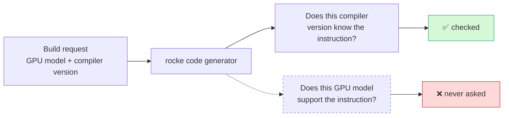
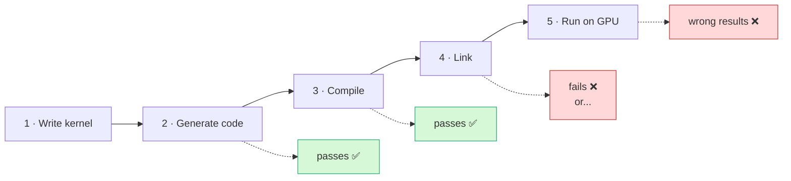
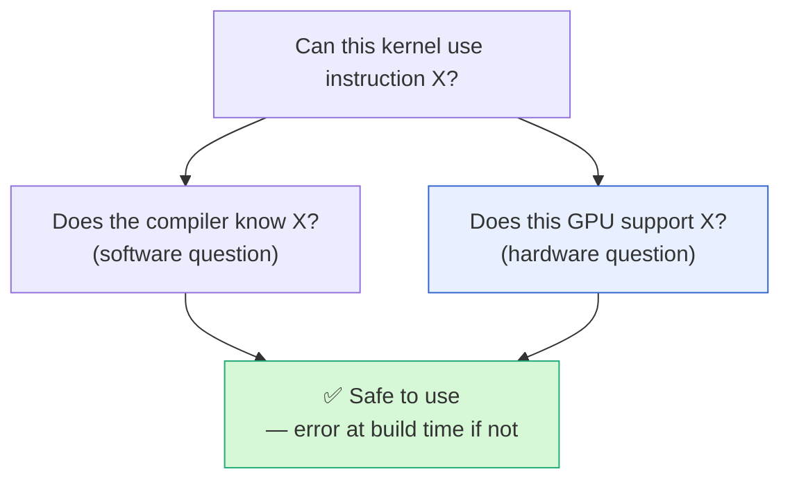

# Brief: rocke does not check which GPU an instruction runs on

**Audience:** management / non-specialist. One page.
**Engineering detail:** [`arch_axis_proposal.md`](arch_axis_proposal.md).
**Ask:** approval for ~1–2 engineer-weeks of work. No product behaviour changes.

---

## The problem in one sentence

When rocke generates GPU code, it checks that an instruction exists in the
**compiler version** we are building with — but never checks that it exists on
the **GPU model** we are building for.

An analogy: we verify a part number against the current parts catalogue, but
never check that the part fits the machine we are installing it in.

We support **7 GPU models** across 3 hardware generations. They do not all
support the same instructions.

## Why it has not been caught automatically

The standard code-checking tools do not flag it. An unknown GPU instruction
looks, to the compiler, like an ordinary call to some other piece of software —
so the error only appears at the very last step, or not until the GPU runs.

**Today these are found by an engineer reading the code, or by a kernel
misbehaving.** Four such defects are already on record. One of them referenced an
instruction that **does not exist on any GPU or in any compiler version** — it
went unnoticed because the feature using it happened to be switched off by
default. Another caused requests for one GPU model to silently build code for a
different one.

Each new GPU model we add multiplies the opportunities for this class of mistake.

## The fix

Ask the second question too. Two independent checks, both cheap:

The useful discovery that makes this cheap: **the compiler already tells us the
two answers separately** — it reports a different error for "this instruction
does not exist" than for "this GPU cannot run it". So we do not need to build and
maintain a large hand-written compatibility matrix. We can measure the answers
automatically from the installed compiler, save the results as a data file, and
have the build check against it — the same way we already guard against
unintended code changes elsewhere in the project.

Four steps, in order:

| # | Step | Effect |
|---|---|---|
| 1 | Stop defaulting to one GPU model when the caller does not say which | A forgotten setting becomes an error instead of silently wrong output |
| 2 | Auto-generate the compatibility data from the installed compiler | Immediately exposes the known defects |
| 3 | Make the code generator check it — **warnings first** | No disruption; we see the real scope before enforcing |
| 4 | Apply the same check in the second code generator | Keeps our two engines in agreement, a core project guarantee |

## Cost, risk, and timing

| | |
|---|---|
| **Effort** | ~1–2 engineer-weeks |
| **Product behaviour** | **No change.** Generated code is byte-for-byte identical. |
| **Performance** | No impact on kernel performance. Adds seconds to a build. |
| **Risk** | Low. Step 3 ships as warnings only, so nothing can break; we switch to hard errors once the warnings are clear. |
| **Rollback** | Each step is independent and revertible. |

## Why do it now rather than later

- The defect rate scales with the number of GPU models supported, and that number
  is growing.
- The cost of the fix is roughly flat, so it only gets less attractive to defer.
- It converts a class of bug that currently surfaces **at run time on customer
  hardware** into an error message at build time naming the exact instruction and
  GPU model.

## Recommendation

Approve steps 1–4. Steps 1 and 2 are self-contained and can start immediately
with no coordination cost; they alone resolve the known defects.
