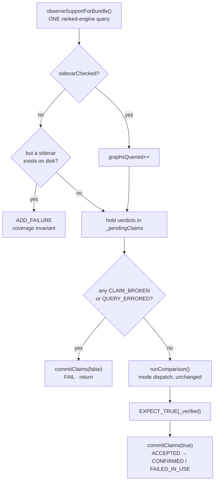

# Support Claim Enforcement

A **support claim** is a promise, checked into git next to a bundle, that a named
engine supports that graph on a given arch and platform. `--enforce-support-claims`
turns a broken promise into a test failure instead of a silent skip.

This document covers what a claim asserts, how one graph's claims are adjudicated,
and the lifecycle inside `TestBody()` that decides when a claim is checked and when
it is published.

> Enforcement is **off** by default and requires `--test-engine`. A run with
> `--enforce-support-claims` and no engine named exits 1 rather than degrading to
> "enforced nothing, exit 0".

---

## What a claim asserts

**That the engine accepts the graph — not that the graph produces correct output.**

Correctness is the job of the ordinary comparison against golden data or a
reference executor (see [Verification modes](../README.md#verification-modes)).
Claims are a separate axis: they catch an engine *dropping* support for a graph it
previously advertised, which otherwise shows up as a skip nobody notices.

The two axes meet in exactly one place — a claim that was accepted and then failed
in use is reported as such, and never published as working support. See
[Phase 2](#phase-2--commit-with-the-outcome).

## Sidecar layout

`.support.json` files live beside the bundle they describe and are excluded from
graph discovery, so they can never register as a test.

| Bundle kind | Sidecar path | Shape |
|---|---|---|
| Single graph `dir/Small.json` | `dir/Small.support.json` | `claims: {engine: {arch: [platforms]}}` |
| Template sweep `dir/sweep.json` | `dir/support.json` (one file, whole sweep) | `claims: {engine: [{cases: [ids], support: {arch: [platforms]}}]}` |

```json
{
  "version": 1,
  "claims": {
    "MIOPEN_ENGINE": { "gfx942": ["linux", "windows"], "gfx1151": ["windows"] }
  }
}
```

A sweep sidecar keys each claim group by `cases[].id`, so one file covers every
case in the sweep and a case named in no group is simply unclaimed.

**Arch and platform come from the running machine, not the bundle.** The sidecar is
a matrix; a run picks one cell. `arch` is the base token — `gfx90a:sramecc+:xnack-`
matches a `gfx90a` claim. `platform` is `linux` or `windows`.

## One lane, one engine

Enforcement adjudicates the claim for **the single engine named by `--test-engine`**,
and nothing else. A sidecar claiming some other engine is that engine's lane's
business: this run cannot execute it, so it has no basis to pass or fail it, and
an engine with no lane at all is the static inventory's problem, not the harness's.

That makes the verdict a two-bit decision:

- **claimed** — does the sidecar name this engine for the running (arch, platform[, case])?
- **accepted** — is this engine's id in the list `get_ranked_engine_ids()` returned?

| | accepted | declined |
|---|---|---|
| **claimed** | `CLAIM_ACCEPTED` | `CLAIM_BROKEN` **fails the test** |
| **unclaimed** | `UNCLAIMED_SUPPORT` | *(nothing emitted)* |

The fourth quadrant — neither claimed nor accepted — carries no information and is
never recorded, which keeps the verdict count proportional to what was actually
promised.

### All verdicts

| Verdict | Meaning | Fails the test |
|---|---|---|
| `CLAIM_BROKEN` | claimed, but absent from the ranked list | **yes** |
| `QUERY_ERRORED` | claimed, but the query did not resolve, so acceptance is unknown | **yes** |
| `CLAIM_ACCEPTED` | claimed and in the ranked list; not exercised by this test | no |
| `CLAIM_CONFIRMED` | accepted, **and** the engine ran the graph green | no |
| `CLAIM_FAILED_IN_USE` | accepted, but the engine failed the graph | no |
| `UNCLAIMED_SUPPORT` | in the ranked list with no claim — positive drift | no |

There is no `ENGINE_NOT_LOADED`: `main()` exits non-zero at startup if
`--test-engine` names an engine that is not loaded, so by the time a test runs the
engine under test is always present.

`isFailure()` is a whitelist of the non-failures, so a verdict added later without
being classified is fatal by default.

Two notes on the non-obvious ones:

- **`QUERY_ERRORED` is not `CLAIM_BROKEN`.** Only `OK` and `GRAPH_NOT_SUPPORTED`
  mean the ranked list can be trusted. Anything else makes **A** unknown, and
  reporting a decline would state a fact nobody read.
- **`CLAIM_FAILED_IN_USE` is not a claim failure.** The claim held — the engine did
  accept the graph — and the run is already red from whatever actually broke.
  Failing it again would double-report one defect and bury the real diagnostic.

---

## Lifecycle in `TestBody()`



### Phase 1 — query, above everything

`observeSupportForBundle()` builds the graph, makes one `get_ranked_engine_ids()`
call, and hands the result to `observeSupport()` for the set comparison. It returns
`{sidecarChecked, results}`.

It sits **above `runComparison()` on purpose.** The query needs only `from_binary`
plus the ranked list — no inputs, no outputs, no golden data, no execution — so
nothing in the comparison path is a prerequisite for it. Every early return inside
`runComparison()` (no output tensors, inputs unavailable, non-`FULL` routing)
would otherwise leave that graph's claims unqueried while the run still exited 0.

It returns an empty observation, touching nothing, when no engine was injected, no
sidecar exists, or enforcement is off. That guard order is what lets the deviceless
unit harnesses run `TestBody()` without ever reaching `getSharedHandle()`.

### Coverage accounting

Two facts, deliberately not derived from each other:

- **`sidecarChecked` → `graphsQueried++`.** A bool, *not* `results.empty()`. A
  sidecar that claims another arch, another platform, another sweep case, or only
  other engines produces zero verdicts but was still read in full, and must count
  as covered.
- **Per-graph invariant.** If a sidecar exists on disk and enforcement is on but the
  query did not happen, the test fails. The run-level guard only fires when *no*
  graph anywhere was queried, so a partial gap slips past it; this makes any future
  short-circuit above the query loud immediately instead of surviving behind one
  healthy bundle.

### Verdicts are held, not published

Every verdict goes into `_pendingClaims`. Nothing reaches the report until
`commitClaims()`, which is called from exactly two places — the terminal-failure
path and the normal path. This is what lets a verdict taken *before* execution be
corrected by what execution proved.

### A broken claim is terminal

`CLAIM_BROKEN` means the engine declined the graph. Running the comparison anyway
would execute nothing, leave the NaN sentinel output buffers untouched, and print a
full tensor diff on top of the real diagnostic. So the body commits what it knows,
fails once with the aggregated message, and returns.

### Phase 2 — commit with the outcome

`CLAIM_ACCEPTED` is an observation about the ranked list, taken before the graph was
built or run. Only the engine this test actually drove can be promoted:

```cpp
const bool exercised = outcomeKnown && !IsSkipped();
const bool passed    = !HasFailure();
record.verdict = promoteAcceptedClaim(exercised, passed);   // for the engine under test only
```

| Outcome | Verdict |
|---|---|
| ran, green | `CLAIM_CONFIRMED` |
| ran, red | `CLAIM_FAILED_IN_USE` |
| skipped / never ran | stays `CLAIM_ACCEPTED` |

Other engines' verdicts pass through untouched — this test never ran them, so the
run has no evidence either way about their claims.

---

## Reading the summary

```text
==== SUPPORT CLAIM SUMMARY ====
  graphs: 3 found, 3 with claims, 3 queried (3 verdicts)
  confirmed: 0  accepted: 1  failed-in-use: 0  broken: 1  errored: 0  unclaimed: 1
  (accepted = engine advertises support; only confirmed was executed and verified)
```

- **`queried`** counts graphs whose sidecar was read; **`verdicts`** counts the
  verdicts they produced. A graph yields at most one verdict — the engine under
  test's — and zero when the sidecar says nothing about this cell, so
  `verdicts ≤ queried`.
- **`found ⊇ with claims ⊇ queried`** is the nesting invariant.
- **`accepted` is weaker than `confirmed`.** Only `confirmed` was executed and
  verified. A published support matrix should carry `confirmed`.

A shortfall between `with claims` and `queried` is attributed explicitly:

```text
  2 claim-bearing graph(s) were discovered but not selected to run (--gtest_filter);
  their claims are unenforced by this run.
```

Discovery counts every claim-bearing bundle; only selected tests run. Because a
*selected* graph can no longer go unqueried, the whole remainder is the filter's
doing — so the summary names it rather than leaving a mismatch to be misread as an
enforcement gap. **Filtered lanes do not enforce the claims they filtered out.**

Two detail sections follow the counters when non-empty:

- **`CLAIM FAILURES`** — every `isFailure()` verdict, with bundle, engine, cell, and
  the backend's own message for an errored query.
- **`ACCEPTED BUT UNCONFIRMED`** — cells where the engine accepted the graph and the
  test then failed. Not a claim failure, but the one signal that says *do not
  publish this cell as working support*.
- **`UNCLAIMED SUPPORT`** — cells that work but are not written down. This is the
  positive-drift signal: add them to the sidecar.

## Run-level guard

After `RUN_ALL_TESTS()`, a run with enforcement on where claim-bearing graphs were
discovered but **not one** was ever queried exits 1. Enforcement that passes having
verified nothing is a lie, not a pass.

The per-graph invariant above covers the finer-grained case the run-level guard
cannot see.

---

## Running it

```bash
# Validate checked-in golden data against the CPU reference — no engine, no claims
./bin/hipdnn_integration_tests \
    --validate-golden-data cpu \
    --gtest_filter='quick_*'

# Enforce claims for one engine over the quick tier
./bin/hipdnn_integration_tests \
    --test-article /path/to/libmiopen_plugin.so \
    --test-engine MIOPEN_ENGINE \
    --enforce-support-claims \
    --gtest_filter='quick_*'
```

| Symptom | Cause |
|---|---|
| `--enforce-support-claims requires --test-engine` | No engine named; there is nothing to adjudicate claims against |
| `support claims exist for X but were never queried` | A code path short-circuited above the query — a harness bug, not a data problem |
| `FATAL: … not one of them was ever queried` | Claim-bearing graphs were discovered but none ran; usually the filter selected only graphs without claims |
| `CLAIM_BROKEN … not in ranked list` | The engine dropped support for a graph the sidecar promises. Fix the engine, or update the sidecar |
| `Engine 'X' is not loaded` | `--test-engine` named an engine this build does not have; startup exits 1 before any test runs |
| `verification-mode 'golden-check' has been replaced` | Use `--validate-golden-data cpu\|gpu`, which runs the separate reference-validation suite |

## Scope: two harnesses, never both

A run either verifies an engine or validates our own golden data. They are separate
harnesses because they are separate jobs with different failure meanings, and
folding the second into the first is what produced a "verification mode" that
structurally never reached an engine — and therefore never enforced the claims the
engine harness exists to enforce.

| | `IntegrationBundleVerificationHarness` | `BundleReferenceValidationHarness` |
|---|---|---|
| selected by | default | `--validate-golden-data cpu\|gpu` |
| verifies | the engine under test | our checked-in golden `.bin` data |
| engine involved | yes | **no** |
| support claims | queried and enforced | **not linked in** |
| verification modes | `auto` / `golden` / `gpu` / `cpu` | n/a |
| skip path | yes (no oracle, engine declines, TOML skip) | **none** |
| suite name | `{tier}_{Op}_{Topology}` | `…_CpuRef` / `…_GpuRef` |

The reference harness has no skip path because registration is the gate: a test is
created only when the bundle has golden data **and** every node type in its graph
is inside that reference's required-op set (`ReferenceOpCoverage.hpp`). Given both,
a reference that cannot run the graph is a gap in the reference, so it fails.

Bundles outside a reference's op set are simply absent from its suite, and the
counts are printed at registration so the gap is visible rather than silent:

```text
Golden-data validation (CpuRef): 12 bundle(s) registered, 40 without golden data,
    7 outside this reference's supported-op set
```

Adding an op to a reference's set is a commitment: every bundle using it becomes a
test that must pass.

Claims apply to **bundle tests only**. The C++ graph tests under
`src/integration-tests/` carry no sidecars and are not enforced; wiring that up is
tracked separately (ALMIOPEN-2480).

## See Also

- [`README.md`](../README.md) — the integration test suite, bundle formats, tiers,
  and provider wiring.
- [`integration-test-bundles/README.md`](../integration-test-bundles/README.md) —
  on-disk bundle layout and the DVC workflow.
