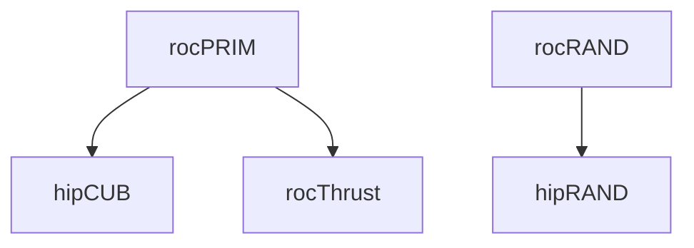

# Continuous Integration

> [!IMPORTANT]
> This document is currently in **draft** and may be subject to change.

This document is to detail the various continuous integration (CI) systems that are run on the rocm-libraries monorepo.

## Table of Contents
1. [Azure Pipelines](#azure-pipelines)

## Azure Pipelines

The Azure Pipelines CI is a public-facing CI system that builds and tests against latest public source code. It encompasses a majority of the ROCm stack, typically pulling source from the `develop`/`amd-staging` branch on a component's GitHub repository. Its main source is publically available at [ROCm/ROCm/.azuredevops](https://github.com/ROCm/ROCm/tree/develop/.azuredevops).

### Overview

Each component in the monorepo has a corresponding pipeline, see the [Azure monorepo dashboard](https://dev.azure.com/ROCm-CI/ROCm-CI/_build?definitionScope=%5Cmonorepo) for a full list. These pipelines are set to run for PRs and commits that make changes to a component's subfolder, and the conditions for each component are defined in the trigger files under [/.azuredevops](https://github.com/ROCm/rocm-libraries/tree/develop/.azuredevops).

When running a job, Azure CI will dynamically pull the latest passing build from each individual ROCm component's pipeline. The result is that each run will have a ROCm stack that represents the current state of public source code.

### PR Workflow

1. PR is submitted
2. Azure scans the PR contents to decide which pipelines to run
    1. If a pipeline matches, a job will be kicked off
    2. If a pipeline does not match, the check will be skipped and reported as neutral
3. The PR is built and tested against latest public source
4. The final success/failure status is posted on the PR's checks
5. To see details on a specific check, click into the check, then click `View more details on Azure Pipelines`

### Build and Test Coverage

Azure CI builds and tests primarily on Ubuntu 22.04 LTS and for `gfx942` and `gfx90a` architectures, and adding build support for more architectures and operating systems is in progress. Each architecture and OS combination will have its own build and test jobs, all of which will appear as separate checks.

For example, a hipCUB PR may see the following checks, and the naming scheme is hopefully self-explanatory:
- `hipCUB_build_ubuntu2204_gfx942`
- `hipCUB_build_ubuntu2204_gfx90a`
- `hipCUB_test_ubuntu2204_gfx942`
- `hipCUB_test_ubuntu2204_gfx90a`

Component-specific details such as build flags and test configurations can be viewed in the main pipeline files in [ROCm/ROCm/.azuredevops](https://github.com/ROCm/ROCm/tree/develop/.azuredevops).

### Downstream Job Triggers

Azure CI runs for a component will trigger runs for downstream components (provided that they are fully migrated onto the monorepo). The end goal is to catch upstream breaking changes before they are merged and to ensure the monorepo is always in a valid state.

For example, a rocPRIM PR will trigger an initial rocPRIM job. If it succeeds, it will then trigger hipCUB and rocThrust jobs. The two downstream jobs will pull the build from the initial rocPRIM job to ensure that the rocPRIM changes do not break their own functionality.

Currently, the following downstream trigger paths are enabled:

