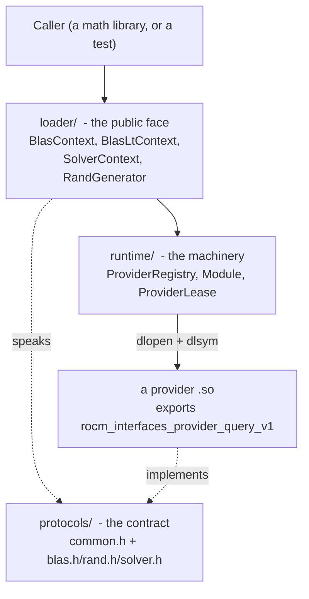
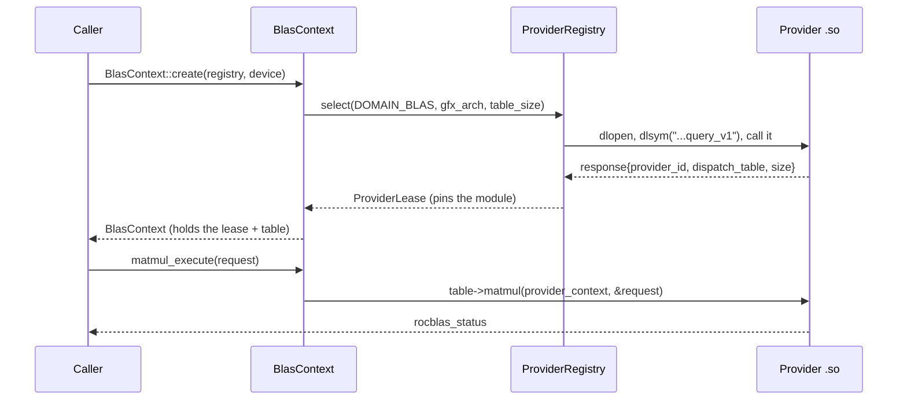

# How the interfaces layer works

Status: proposed design with a working noncanonical rocBLAS implementation. It builds
standalone (`cmake -S interfaces`) or through the default-off root option
`ROCM_LIBS_ENABLE_INTERFACES`. Everything below is real code in this tree, proven by the
tests named at the end.

## The problem this solves

Say you ship rocBLAS. A caller links `librocblas.so` and calls `rocblas_sgemm`. That works
until the day you want to change how `sgemm` is implemented - route it through hipBLASLt,
try a new heuristic, split it across two libraries. The exported C symbol freezes the call
ABI, not the internals, so you can already reimplement `sgemm` behind it - rocBLAS in fact
routes some paths through hipBLASLt and falls back to its legacy solutions (see
[audit-findings.md](audit-findings.md)). What a bare exported symbol does not give you is a
way to replace the whole implementation cleanly: the caller is bound to rocBLAS as the sole
provider of that symbol, so you cannot drop in a different provider without relinking, and a
provider that build-depends on another (rocBLAS on hipBLASLt) cannot be swapped for it
independently. Every symbol you exported is now a promise you have to keep.

There is a second, quieter failure. When you build a provider `.so` from C++, the linker
exports more than you asked for. Pull in `std::filesystem` and roughly 174 libstdc++
symbols leak into your dynamic table with default visibility. Now two libraries in the same
process export the same `std::` symbols, the dynamic loader picks one, and the other
library silently calls code it never compiled against.

The interfaces layer fixes both by putting a thin, versioned boundary between the caller
and the implementation. The caller talks to a stable loader. The implementation lives
behind a provider protocol. Neither can see the other's symbols by accident.

## The one rule that makes it work

A provider is normally a shared object that exports exactly one symbol:

```
rocm_interfaces_provider_query_v1
```

That is the whole public surface of a provider. You call it once. It hands you back a
dispatch table - a C struct full of function pointers - and everything else stays hidden.
The usual case is a `.so` loaded with `add_module`; a provider can also be registered
in-process with `add_builtin` (no `.so`, no `dlopen`; see
[How a provider gets picked](#how-a-provider-gets-picked)). Either way its whole public
surface is that one query function.

You can see it in `protocols/include/rocm/interfaces/common.h`:

```c
#define ROCM_INTERFACES_PROVIDER_QUERY_SYMBOL "rocm_interfaces_provider_query_v1"

typedef rocm_interfaces_status (*rocm_interfaces_provider_query_fn)(
    const rocm_interfaces_provider_request*  request,
    rocm_interfaces_provider_response*       response);
```

And you can see it enforced. Look at `providers/provider.map`:

```
ROCM_INTERFACES_PROVIDER_1 {
  global:
    rocm_interfaces_provider_query_v1;
  local:
    *;
};
```

`global:` lists the one symbol callers may see. `local: *` hides everything else - your
helpers, your C++ runtime, the `std::filesystem` symbols from the leak above. Build a
provider DSO with that map and its only defined, non-absolute export is that one query
symbol. Not 176. One. (Raw `nm -D` also lists undefined imports and the absolute
version-node entry; the `exports` check runs `nm -D --defined-only --with-symbol-versions`
and ignores the absolute node, so it asserts that single callable export.)

## The three parts

The tree has three layers. Read them in this order.



**protocols/** is the contract, and nothing else. It is pure C headers. `common.h` defines
the query function, the ABI header every table starts with, the domain list, and the
host-services callbacks. `blas.h`, `rand.h`, and `solver.h` define the per-domain dispatch
tables. There is no code here - a contract you can compile against but not run.

**runtime/** is the machinery that turns a `.so` on disk into a live dispatch table.
`Module` (`runtime/include/rocm/interfaces/runtime/module.h`) is a thin `dlopen`/`dlsym`
wrapper. `ProviderRegistry` (`.../provider_registry.h`) holds the set of known providers and
picks one. `ProviderLease` is what you get back when it picks - a handle that keeps the
module loaded for as long as you hold it.

**loader/** is the public face callers actually touch. `BlasContext`, `BlasLtContext`,
`SolverContext`, and `RandGenerator` (`loader/include/rocm/interfaces/loader.h`) are C++
objects that own a lease and forward your calls into the provider's table. This is where a
caller lives.

## How one call flows

Here is a BLAS matmul, start to finish. Nothing here is hand-waved - follow the types in
`loader/include/rocm/interfaces/loader.h` and `provider_registry.h`.



The important beat is the third line. `select` is where a provider is chosen, and it
happens once, at context creation. After that, the context holds a `ProviderLease` and a
raw `const rocm_blas_provider_v1*` table pointer. Every later `matmul_execute` is a
straight indirect call through that table. An operation cannot pick a different provider
mid-flight - the choice is made at the boundary and frozen.

## Why tables can grow but never break

Every table and every extensible record starts with the same three fields
(`common.h`, `rocm_interfaces_abi_header`):

| Field | Meaning |
| --- | --- |
| `struct_size` | how many bytes this table actually is |
| `abi_major` | incompatible-change counter |
| `abi_minor` | compatible-addition counter |

The rule that falls out of this: a consumer accepts a table whose major matches and whose
size is at least what it needs. If the provider hands back a bigger table - a newer build
with extra function pointers on the end - the consumer uses the prefix it understands and
ignores the tail. If a required entry sits past the size the provider reported, that
provider is incompatible and gets rejected, not called into garbage.

So you add capability by appending to the end of a table and bumping `abi_minor`. You never
reorder, never insert in the middle, never change a field's meaning. Old callers keep
working because the prefix they read is byte-for-byte the same.

The prototype enforces this contract at selection through the provider response: the major
must match, the provider minor must meet the runtime floor, and `dispatch_table_size` must
cover the prefix requested by the loader. `rocm_interfaces.table_abi_negotiation` proves
exact/exact and newer/larger acceptance plus old-minor and short-prefix rejection. Domain
loaders still request their full current table, and no consumer reads the dispatch-table
header, so per-domain optional tails are not yet consumed. See the implementation-status
note in
[03-abi-and-versioning-contract.md](03-abi-and-versioning-contract.md#implementation-status-prototype).

## How a provider gets picked

`ProviderRegistry::select` takes a domain, a `gfx_arch`, a required table size, and an
optional cohort id. It walks its entries and applies two tie-breakers, in this order:

1. An exact `gfx_arch` match beats a wildcard entry (`gfx_arch == 0` is the wildcard).
2. Among equal gfx specificity, higher `priority` wins.

During selection the registry rejects a candidate and falls through to the next only when
the provider's query returns a non-success status, or when its response fails one of these
checks: ABI major mismatch, response struct too small, null dispatch table, a reported
dispatch-table size smaller than what was asked, a missing provider id, or a provider id
that does not match the one the entry was registered under. The response carries no domain
field. Domain agreement is enforced two other ways: select only queries entries whose
registered domain matches the request, and each provider compares request->domain against
its own compiled domain and returns an error status on mismatch, which the registry treats
as a skip. The individual required function pointers inside the dispatch table are NOT
inspected during selection - only the table size is. The domain loader (for example
BlasContext::create) validates those pointers after select returns and throws if one is
null. So a malformed highest-priority provider that passes the size and id checks but leaves
a required entry null produces a loader exception; it does not fall through to a
lower-priority provider.

Providers can come from two places: `add_module` loads them from a `.so` on disk (optionally
described by a JSON manifest), and `add_builtin` registers an in-process query function
directly, no `dlopen`. Both land in the same entry list and compete by the same rules.

The noncanonical rocBLAS path installs `rocblas-system.json` beside
`librocblas-provider-system.so`. The shadow loader reads that manifest, and the provider then
opens canonical `librocblas.so.5` with local binding, adding ELF deep binding in ordinary
builds, and resolves every table slot by that handle. Sanitizer runtimes reject
`RTLD_DEEPBIND`, so instrumented builds deliberately omit that flag and retain handle-scoped
lookup. This second lookup is important: it prevents facade dispatch from using an accidental
global lookup of the same-named symbol on `librocblas-loader.so.5`. A missing symbol rejects
the provider, except for the six grouped-GEMM spellings introduced after older rocBLAS 5
builds; those are explicitly adapted to repeated ordinary GEMM calls. The public variadic
device-memory helpers cross the table boundary as size arrays and are expanded back into
canonical calls for counts from zero through 32; larger counts currently return
`rocblas_status_invalid_size` and remain migration work.

## Why the module stays loaded

When `select` succeeds it returns a `std::shared_ptr<const ProviderLease>`. The lease owns
a `std::shared_ptr<Module>` (see `ProviderLease` in `provider_registry.h`). As long as any
context holds that lease, the module cannot be `dlclose`d. That matters because the
dispatch table, the provider context, and any token the provider handed out all point into
that module's address space. Reference-counted unload-on-last-lease is the intended
contract, but note the current status: the registry keeps its own owning shared_ptr<Module>
in each entry and an owning copy of every issued lease in an internal list, so today a
module stays pinned for the lifetime of the registry. Dropping the caller's lease does not
unload it; the module is released only when the registry is destroyed.

Modules are opened with local symbol scope. A provider's internals never join the global
symbol namespace, so loading a second provider cannot accidentally rebind the first one's
calls. This is the runtime half of the same promise the version script makes at link time.

## Host services: how a provider talks back

A provider does not log with `printf`; it routes every diagnostic through the host `trace`
callback in `rocm_interfaces_host_services` (`common.h`). The host also supplies `allocate`
and `deallocate` callbacks; use them for any memory that crosses the ABI boundary or that
the caller must own or free. A provider's own private context -- created in `create_context`
and released in `destroy_context`, and never handed to the host -- may use its internal
allocator; the recording providers do exactly this with `new`/`delete`. The recording
providers in `providers/recording/` are built almost entirely
out of `trace` calls - every operation records what it was asked to do and returns success.
That is what makes them useful as a test and reference implementation.

One hard rule: a provider must not keep pointers to your request record after the call
returns. Device pointers and async workspace live as long as the public operation's stream
semantics say they do, not merely until the C call returns.

## Where the hardening plugs in

The boundary above is only real if the symbols actually behave. That is what the rest of
this tree proves:

- The version script that exports one symbol and hides the leak
  (`providers/provider.map`) is proven by the `exports` test.
- Named ELF version nodes give each major a distinct symbol, so co-resident majors resolve
  their own definition. What the tests lock today: `abi03_coresidency` asserts each handle's
  `dlvsym`/`dlsym` resolves to its own version node with cross-version lookups nil;
  `abi03_interpose_hazard` shows that with the node removed a bare global lookup reproduces
  the interposition hazard; and `abi03_linked_consumer_versioned_binds` proves the causal
  case - a linked consumer whose relocation is version-pinned to `ROCBLAS_ABI_7` binds to
  that major even with an `ABI_6` provider `NEEDED` first, while its one-directive control
  `abi03_linked_consumer_plain_interposed` is interposed to `ABI_6`. That boundary is itself
  locked by a test rather than left to prose: `abi03_versioned_bare_lookup_uncovered` shows
  that with the same noded providers a bare unversioned `dlsym(RTLD_DEFAULT, ...)` still takes
  the first-loaded major even though `dlvsym` reaches the newer one - so the node defense is
  scoped to versioned relocations and `dlvsym`, not bare global lookups.
- That those version nodes survive real linkers, an ASan build, data objects, and C++
  mangled names with RTTI is proven by the `abi04_*`, `abi05_*`, and `abi06_*` tests.
- The loader/registry survive concurrent use under ThreadSanitizer: `ops04_concurrency`.

Each of those is a `ctest` you can run. `tests/CMakeLists.txt` defines the named suite; the
exact set that registers depends on which optional linkers and sanitizers your toolchain
offers. If you want to know *why* each one exists and what breaks without it, read
[04-hardening.md](04-hardening.md).

## The tree, at a glance

| Path | What lives here |
| --- | --- |
| `protocols/include/rocm/interfaces/` | the C contract: `common.h`, `blas.h`, `rand.h`, `solver.h` |
| `runtime/` | `Module`, `ProviderRegistry`, `ProviderLease` - dlopen + selection |
| `loader/` | the public C++ contexts callers use; `rocblas_loader.map` |
| `providers/recording/` | the recording provider set + shared single-export map |
| `providers/rocblas/` | exhaustive canonical-rocBLAS forwarder, installed manifests, and real narrow-v2 vector-transform provider |
| `tests/` | the ctest suite, including the ABI proof drivers |
| `tools/` | API extraction and snapshot/policy tooling |
| `api/` | the categorization ledger and per-header API snapshots |
