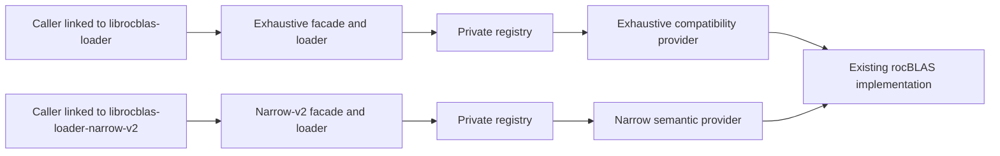

# ROCm math-library interfaces: design and delivery plan

Status: draft for leadership review. The functional baseline exists on
`users/davidd-amd/mathlibs-interfaces-impl` at `41a23c747a6`. The local working tree also
contains the production CMake integration, decomposed tests, compatibility qualification,
API policy, package relocation checks, provider-table validation, and complete
vector-transform routing described below. Neither is merged into `develop`. This document did
not create or modify a pull request (PR). Existing draft PR #11198 remains unchanged and is
not the proposed stack.

Last updated: 2026-08-25.

## Executive summary

ROCm applications link to public math-library binaries such as `librocblas.so.5`. That
boundary gives callers stable function names, but it does not provide a controlled way to
replace the implementation behind the whole library. The problem becomes harder when one
library depends on another library's handle representation, public types, or fallback policy.
For example, a dense solver call can cross hipSOLVER, rocSOLVER, and rocBLAS before it reaches
a function that runs on the GPU.

This proposal separates the stable application-facing library from the implementation that
performs the work. A loader owns the public handle and selects a provider when the handle is
created. The provider exports one query function, returns a table of function pointers, and
keeps its implementation symbols private. Selection is fixed for the life of the context.

The current branch implements one working rocBLAS path under the separate, nonshipping
(noncanonical) library name `librocblas-loader.so.5`. It is disabled by default in the
repository root build and does not replace `librocblas.so.5`. The branch
contains an exhaustive compatibility path for all 1,219 parser-visible C callables in the
checked rocBLAS header snapshot and a real provider that forwards to the installed rocBLAS
library. The committed baseline also contains the first smaller semantic path for 32-bit
floating-point (FP32) AXPY, SCAL, COPY, and SWAP. The local working tree expands that path to
all 126 public vector-transform spellings, all 252 vector-reduction and vector-rotation
spellings, all 460 matrix-vector and rank-update spellings, and all 258 structured-matrix,
triangular-matrix, and matrix-transform spellings across public datatype, index-width, and
batching forms. A workflow on the AMD
gfx90a graphics processing unit (GPU) architecture compares both new paths with existing
rocBLAS. The committed baseline passed that comparison in one executable. The local working
tree now separates the exhaustive, narrow-v2 transform, narrow-v2 reduction/rotation,
narrow-v2 matrix-vector/rank-update, and remaining narrow-v2 matrix-operation comparisons into
independent jobs, but those new jobs still need a real gfx90a run.

The recommended decision is to land this work as an experimental development facility in a
16-PR stack. The installed headers and CMake targets make the experimental provider protocol
visible to developers, but the first landing does not promise compatibility or third-party
support for it. It also does not enable the feature by default or authorize a change to a
shipping library name. Those actions require separate gates for behavior, performance,
packaging, platform support, and cross-library adoption.

## Decision requested

Leadership is asked to approve four points:

1. Use a loader/provider boundary as the development direction for implementation choice
   across ROCm math libraries.
2. Land the current rocBLAS vertical slice on `develop` only as the non-default
   `ROCM_LIBS_ENABLE_COMPONENTS=interfaces` component and under noncanonical library names.
3. Authorize the technical owners to reconstruct the work locally using the 16-PR dependency
   order in this document as the baseline. Final boundaries require an independent build and
   test check before any PR is opened.
4. Defer any stable provider-interface commitment or canonical `librocblas.so.5` cutover
   until the adoption gates in this document pass and leadership reviews a separate cutover
   proposal.

The project also needs named owners for the provider interface, rocBLAS and hipBLASLt behavior,
solver integration, packaging, and automated test capacity. Before review begins, one master
work-tracking item must name those owners and acceptance criteria. Every stack PR must link
that tracker, this specification, and its immediate predecessor and successor when they exist.

## Scope of the first landing

| Included in the first landing | Explicitly not included |
| --- | --- |
| Installed experimental provider headers, CMake targets, and runtime selection | A stable or third-party-supported provider interface |
| A noncanonical `librocblas-loader.so.5` | Default-on build or runtime behavior |
| A complete 1,219-callable compatibility bridge | A claim that 1,219 provider entries are the desired long-term interface |
| A real provider for an installed `librocblas.so.5` | A second independent numerical implementation |
| A vector-transform semantic path, with 126 spellings qualified for host-side routing | Reductions, rotations, matrix operations, or real-device proof of the expanded matrix |
| Linux Executable and Linkable Format (ELF) export and symbol-version proofs | Windows Portable Executable (PE) or macOS Mach-O compatibility |
| Host, sanitizer, install/CMake-package, and a gfx90a baseline | Distribution-package integration, performance equivalence, or coverage of every supported GPU |

The first landing creates a place to develop and measure the design without changing an
existing application or package unless a developer explicitly opts in.

## Terms used in this document

| Term | Meaning here |
| --- | --- |
| Application binary interface (ABI) | The compiled agreement between a caller and a library: exported names, calling convention, argument types, enum values, and caller-visible data layout. |
| Application programming interface (API) | The source declarations and behavior that application code calls. The ABI is the compiled form of part of this interface. |
| SONAME | The shared-library identity recorded by an ELF consumer, such as `librocblas.so.5`. A matching function name in a differently named library does not satisfy that dependency. |
| Loader | The application-facing library that owns public handles, selects a provider, validates its response, and forwards operations. |
| Provider | An implementation module selected by the loader. A provider shared object exports only `rocm_interfaces_provider_query_v1`. |
| Dispatch table | A C struct containing function pointers. The provider query returns this table after the loader validates its version and reported size. |
| Version node | A Linux/ELF label attached to an exported symbol, such as `ROCBLAS_ABI_5`. It lets consumers bind the same C name to different ABI generations. |
| Cohort | A host-assigned identity for providers built and tested to cooperate. It coordinates selection without allowing one provider to inspect another provider's private context. |
| Narrow semantic interface | A provider interface that expresses an operation through typed fields, such as datatype, index width, batching, and scalar location, instead of adding one provider entry for every public function spelling. |
| Basic Linear Algebra Subprograms (BLAS) | Standard vector and matrix operation families. rocBLAS and hipBLASLt are ROCm implementations with different public entry points and policy roles. |
| General matrix multiplication (GEMM) | A BLAS operation that multiplies matrices, with variants for datatype, batching, and other execution choices. |
| CTest | CMake's test runner. Names beginning with `rocm_interfaces.` below are registered tests, not broad quality claims. |
| Toolchain variants | Clang with the LLVM linker (`lld`) and the GNU Compiler Collection (GCC) with the Binary File Descriptor (`bfd`) linker are separate configurations. Link-time optimization (LTO) lets a linker process compiler intermediate code and requires compatible tools. |
| Canonical and noncanonical | Canonical means the shipping ROCm library or package name. Noncanonical means a separate experimental name that an application must choose explicitly. |
| Domain | One operation family selected through its own provider table, such as BLAS, solver, or random-number generation. |
| Manifest | A JSON file that names provider modules and their selection attributes. |
| Lease | A loader-owned object that retains a selected provider response and keeps its module loaded. |
| Vertical slice | One narrow path implemented across public call, loader, provider, backend, installation, and tests. |

## The problem and its practical consequence

The public rocBLAS ABI already allows rocBLAS to change the code behind `rocblas_sgemm`.
rocBLAS does not expose a supported per-handle mechanism for selecting another provider for
the domain while retaining the same library boundary. A caller records both the function
reference and the rocBLAS SONAME. Renaming another implementation to impersonate rocBLAS
obscures ownership and can drop dependency relationships that the real rocBLAS package
carried.

Compatibility also extends beyond C function names. The interface audit and notebook identify
five additional forms of coupling:

- hipSOLVER stores a rocBLAS handle behind its public `void*` handle and casts it back for
  destroy, stream, and math operations.
- rocSOLVER exposes rocBLAS handle and status types in its public declarations.
- hipRAND and rocRAND use two public names for one pointer representation.
- hipSOLVER duplicates public enum values that must remain numerically equal to hipBLAS.
- hipBLASLt has caller-owned records whose size and layout are part of compatibility.

These relationships force coordinated releases even when a public type looks opaque. They
also mean that counting exported C functions is not a complete ABI inventory. Data objects,
C++ names, runtime type information, enum values, and caller-owned layouts require explicit
review.

## Proposed architecture

The public loader and the private provider solve different compatibility problems. The
loader may expose every established public function because applications depend on those
names. A provider needs only one exported query function because its operation functions are
reached through the returned dispatch table. The single provider export creates a controlled
bootstrap and contains implementation symbols; reducing the public loader's symbol count is
not a goal by itself.

The design uses two provider paths during migration:

| Path | Purpose | Current status |
| --- | --- | --- |
| Exhaustive compatibility bridge | Give every callable in the checked rocBLAS snapshot a typed provider-table entry, so forwarding behavior can be compared before operations are narrowed. | Implemented for all 1,219 parser-visible C callables. It is migration machinery, not the proposed provider software development kit. |
| Narrow semantic protocol | Represent related public spellings with a smaller typed request that carries semantic differences as fields. | Maps 1,156 of 1,162 compute callables and routes every mapped spelling through the real provider. Dedicated numerical GPU evidence remains pending. |

"Exhaustive" means that generation and backend resolution account for every snapshot
function. It does not mean that all 1,219 functions have numerical or error-behavior parity
tests. The existing gfx90a result covers only the earlier single-batch FP32 vector subset;
the expanded device matrix is implemented but has not run on real hardware.

The two paths are separate noncanonical loader libraries today. Current tests link or load
separate callers against them; they do not prove that one unchanged application can switch
between the exhaustive and narrow paths. An older 11-symbol narrow scaffold also remains in
the tree for focused tests and is not a complete rocBLAS facade.

In the target design, provider selection occurs once for each public context. The generic C++
`BlasContext` follows that model: the registry filters candidates by domain and cohort,
prefers an exact canonical GPU base architecture such as `gfx90a` over `*`, then uses
priority and deterministic identity/path tie-breakers. Both public rocBLAS facades now follow
the same context-bound rule. Handle creation queries the calling thread's current HIP device,
splits `gcnArchName` into a canonical base architecture and explicit known/enabled feature
bits, and stores the device identity, registry, lease, and dispatch table in that handle. A
second handle can therefore select a different architecture-specific provider without
changing the first handle. The direct-module environment setting remains an explicit
host-test/developer seam; manifest-backed handle creation has no no-device fallback.

The exhaustive facade also has public calls without a handle. Those select for the current
device; without one, they use the reserved request-only `gfx000` identity, which can match
only a wildcard provider. Their configuration/device bindings remain pinned because several
such calls return provider-owned pointers. Host tests inject HIP device results with a
non-installed preload library rather than compiling a test override into production loaders.

An accepted lease keeps the module and its returned table alive. Registry entries retain
only a weak module reference, so releasing the last lease releases the runtime's loader
reference; later selection reopens the module and resolves its query symbol again.

Cross-provider calls return through loader-owned callbacks. A solver provider, for example,
receives BLAS client services rather than a rocBLAS provider's private context pointer. This
preserves the loader as the owner of cross-library coordination.

## Compatibility and versioning model

The design has three independent compatibility layers. They must not be treated as one
version number.

| Layer | Question answered | Current rule | Remaining work |
| --- | --- | --- | --- |
| Public library ABI | Which library major and exported definition does a compiled caller require? | Keep canonical names unchanged. The experimental loader uses `librocblas-loader.so.5`. Linux exports carry named ELF version nodes. | Decide the supported public migration set and canonical cutover policy. Prove other platforms if required. |
| Provider bootstrap | Can this runtime accept the provider response safely? | Require the same ABI major, a provider minor at least as new as the runtime floor, a non-null table, a nonempty identity that matches the configured identity when present, and enough reported bytes. | Define a release process for provider ABI majors and build identities. |
| Domain operation table | Can a loader read the required function pointers and request fields? | Before typed access, the registry copies and validates the embedded size/major/minor header, requires it to agree with the response, and checks the caller's required prefix. It accepts a larger table from a newer provider. Existing domain loaders request their full compiled table and check required entries. | Define the release rules for table majors and minors. For entries that must be optional to newer consumers, request only the stable prefix, check the reported tail size before each read, and supply a fallback. |

On Linux, the provider map exports only
`rocm_interfaces_provider_query_v1@@ROCM_INTERFACES_PROVIDER_1`. Loader maps attach a named
node to public definitions. The proof suite includes a negative control that removes the node
and reproduces load-order interposition. This evidence applies to versioned relocations and
explicit versioned lookup; a bare `dlsym(RTLD_DEFAULT, ...)` remains load-order dependent.

Manifests are strict JSON documents. The current parser rejects unknown keys, missing or
invalid identities, absolute paths, paths that escape the manifest directory, missing module
files, invalid priorities, noncanonical GPU strings, duplicate domain/id/GPU tuples, and empty
provider lists. Parsing completes into a temporary collection before one locked insertion, so
one bad entry leaves the registry unchanged. Selection order is independent of manifest or
registration order. Linux validates effective-UID/filesystem-root-owner identity and write permissions for
the manifest, module, and both original and resolved path chains, then reads or loads the
checked descriptor with a post-open inode comparison.

The current system-provider manifests use `*`, the architecture wildcard, because they forward to
the installed rocBLAS implementation rather than carrying architecture-specific kernels. A
future provider package that contains architecture-specific artifacts must encode the base
target, such as `gfx90a`, in its manifest and install identity so files for two architectures
cannot overwrite or masquerade as each other. Optional target features remain separate from
that base architecture identity. This is a proposed packaging rule, not current provider
behavior.

## Alternatives considered

| Alternative | Why it is not the first-landing design |
| --- | --- |
| Keep only the current direct-library model | A library can change its own implementation, but a caller still cannot select another provider for the domain without relinking or impersonating the original SONAME. |
| Publish the 1,219-entry exhaustive table as the provider interface | It gives mechanical migration coverage but would preserve every historical spelling and accidental edge as a new implementation obligation. |
| Select a provider for every operation | Tokens, workspace, handle state, fallback policy, and pointer identity could change during one context's lifetime. No product requirement currently justifies that complexity. |
| Share provider-private context pointers across libraries | This would reproduce the representation coupling already present between hipSOLVER and rocBLAS. Cohorts and loader-owned callbacks coordinate providers without equating their private types. |
| Replace `librocblas.so.5` immediately | The branch has one partial semantic cluster, Linux-only binary proofs, and one GPU architecture result. That evidence is not sufficient for a public package cutover. |

## Implementation completed on the working branch

"Implementation present" in this section means that code exists at `41a23c747a6`, or is
identified as a later local working-tree change, and the named evidence exercises it to the
stated extent. It does not mean that every behavior is qualified, that the code is on
`develop`, that the root build enables it by default, or that it is ready for a canonical
package name.

| Implemented capability | Observable result | Evidence and qualification boundary |
| --- | --- | --- |
| Non-default root integration | A normal root build does not add interface targets. Selecting `ROCM_LIBS_ENABLE_COMPONENTS=interfaces` adds the experimental component through the standard root component mechanism. | Local working tree: `CMakeLists.txt`; `rocm_interfaces.root_opt_in_build` |
| Target-based build dependencies | Product targets consume header-only CMake targets owned by rocBLAS, rocRAND, hipBLAS, hipBLASLt, hipSOLVER, rocSOLVER, and hipRAND. Compatibility targets read include usage requirements from older installed packages without linking their implementation libraries. The API audit reads source headers directly and receives generated-header locations from CMake targets. | Local working tree: `interfaces/CMakeLists.txt` and the seven owner component CMake files; `rocm_interfaces.exports` checks that no canonical math library enters `DT_NEEDED`; `rocm_interfaces.api_snapshot_drift` checks the source inventory. |
| Noncanonical public loader | `librocblas-loader.so.5` is distinct from `librocblas.so.5`; the existing rocBLAS target is not replaced. | [Interfaces CMake at the implemented revision][impl-interfaces-cmake], `rocm_interfaces.install_consumer` |
| Closed rocBLAS inventory | The checked ledger contains 1,219 parser-visible C callables; generation fails on an unknown spelling or inconsistent count. | [rocBLAS ledger at the implemented revision][impl-ledger], `rocm_interfaces.api_snapshot_drift` |
| Exhaustive loader/provider path | The generated loader and provider table account for all 1,219 callables with typed signatures. | [Bridge generator at the implemented revision][impl-bridge-generator], `rocm_interfaces.rocblas_all_symbols`, `rocm_interfaces.rocblas_shadow` |
| Real rocBLAS provider | `librocblas-provider-system.so` opens the configured `librocblas.so.5` by handle and fills the table. Unexpected missing symbols reject provider negotiation. | `rocm_interfaces.rocblas_real_provider_differential`, `rocm_interfaces.real_provider_missing_backend`, `rocm_interfaces.real_provider_incomplete_backend` |
| Real RAND provider and hipRAND facade | `librocrand-provider-system.so` opens canonical `librocrand.so.1` by handle; `libhiprand-loader.so.1` exports the complete 30-function hipRAND C surface without linking a canonical math DSO. Generator kind, algorithm, seed forms, offset, ordering, dimensions, stream, represented distributions, static tables, and version calls remain distinct. | `rocm_interfaces.hiprand_facade`, `rocm_interfaces.rand_prefix_compatibility`, `rocm_interfaces.rocrand_real_provider_failure_retry`, `rocm_interfaces.exports`, and `rocm_interfaces.install_consumer` pass on the host. The gfx90a differential target compiles but still needs a real device run. |
| Compatibility adapters | Six grouped-GEMM functions use repeated ordinary GEMM when an older rocBLAS 5 backend lacks those names. The host fixture omits all six symbols, then checks nonempty groups, per-group metadata, host and unreadable device-scalar addresses, C/D output routing, and stop-on-first-failure behavior for 32-bit and 64-bit forms. The two C-varargs helpers cross the provider boundary as arrays through an appended private backend-ABI tail and accept counts beyond the former limit of 32. | Local working tree: bridge generator, private rocBLAS backend API, and `rocm_interfaces.rocblas_legacy_compatibility_adapters`; the focused test passed through count 257. |
| Complete rocBLAS edge surface | All 57 non-compute callables have real loader-owned behavior: synchronized handle policy, HIP transfer helpers, workspace query state, build/status diagnostics, and validated opaque allocator tokens. Provider operations receive one coherent state snapshot and native workspace queries suppress execution. | `rocm_interfaces.rocblas_narrow_v2_edge` executes the exact 57-symbol inventory; the dedicated edge concurrency test passes with its TSan control. The gfx90a differential compiles but still needs a real device run. |
| Strict provider manifests | Parsing is all-or-nothing and restricts modules to the manifest directory. Installed manifests select the exhaustive and narrow system providers. | [Registry at the implemented revision][impl-registry], `rocm_interfaces.runtime`, `rocm_interfaces.install_consumer` |
| Provider-table validation | Before any typed table access, the registry validates the response size, copies the embedded ABI header without assuming alignment, requires size and version agreement, and accepts a larger newer-minor tail while consumers read only their required prefix. | `rocm_interfaces.table_abi_negotiation`, `rocm_interfaces.provider_abi_conformance`; the focused 3/3 runtime/table/conformance set passed across BLAS, BLASLt, solver, RAND, exhaustive rocBLAS, and narrow-v2 fixtures. |
| Single provider export | Each provider exposes the versioned query function and no implementation helper. | [Provider map at the implemented revision][impl-provider-map], `rocm_interfaces.exports`, `rocm_interfaces.exports_provider_list_complete` |
| Linux/ELF coexistence proofs | Tests distinguish named from unnamed symbols, versioned from bare lookup, bfd from lld, and supported from rejected LTO/linker combinations. | [Compatibility proof inventory at the implemented revision][impl-hardening], the `abi03_*`, `abi04_*`, `abi05_*`, and `abi06_*` tests |
| Domain-specific host tests | Runtime/common, BLAS/hipBLASLt, solver, and RAND behavior now live in independent executables, so an early stack layer no longer needs every later domain. | `rocm_interfaces.runtime`, `rocm_interfaces.blas`, `rocm_interfaces.solver`, `rocm_interfaces.rand`; all were included in the 49/49 post-split host run. |
| Real concurrency checks | The registry, loader initialization, and real provider path run under ThreadSanitizer; the real provider also has a concurrent dispatch test. A new known-racy executable must make ThreadSanitizer report a race and return 66 before the clean tests run. | `rocm_interfaces.tsan_known_race_control`, `rocm_interfaces.ops04_concurrency`, `rocm_interfaces.rocblas_real_provider_concurrency`; the control is implemented, but the current tree still needs a fresh ThreadSanitizer run. |
| API declaration and enum policy | Ten proposed, rule-generated declaration policies and ten saved enum baselines are wired to regenerated source snapshots. One negative declaration case and one negative enum case require rejection. | Direct checks of all ten saved snapshots and both controls passed locally. The integrated regenerated-snapshot CTests remain part of the pending aggregate run, and domain-owner review of the generated rules remains a PR 16 merge gate. |
| Relocatable installed package and local upgrade model | The installed package reports known components, rejects an unknown required component, preserves dependency-owned headers, and finds providers relative to a copied install tree. The staged installed binaries are audited for exact exports, version nodes, forbidden dependencies, and runpaths. Release-shaped ELF fixtures exercise same-major activation/rollback and old/new-major coexistence without redirecting already-linked consumers across SONAMEs. | `rocm_interfaces.install_consumer`, `rocm_interfaces.root_opt_in_build`, and `rocm_interfaces.distribution_upgrade_rollback` pass locally. These are local Linux/ELF mechanism tests, not package-manager, signed-artifact, or Windows loader evidence. |
| Shared host workflow | `interfaces-host-ci.yml` builds a provider-ready rocBLAS with the private backend API, configures Clang/lld with API tooling enabled, builds the full host tree against that DSO, and runs CTest with `--no-tests=error` when interface or owner-header inputs change. | Workflow source exists in the local working tree. No shared run covers the current unpushed changes yet. |
| Vector-transform execution slice | One `vector_transform` callback routes all 126 public classic and EX AXPY/SCAL/COPY/SWAP spellings. The set covers the public half, bfloat16, FP32, FP64, complex, and mixed-scalar tuples; 32/64-bit indices; and single, pointer-array, and strided batches. | `rocm_interfaces.rocblas_narrow_v2_real_vector_transform` checks every symbol's request routing through a recording backend. The focused host test and structural/link checks passed. The expanded GPU target compiles, but its real gfx90a run is pending. |
| Vector-reduction and vector-rotation execution slice | `vector_reduce` routes all 162 DOT/DOTC/DOTU, NRM2, ASUM, IAMAX, and IAMIN spellings. `vector_rotate` routes all 90 ROT, ROTG, ROTM, and ROTMG spellings, including independently batched scalar operands and five-element parameter blocks. Both callbacks preserve classic/EX datatypes, 32/64-bit width, every batch representation, stream, scalar/result location, and pointer aliases. | `rocm_interfaces.rocblas_narrow_v2_reductions_and_rotations` verifies all 252 symbols and 408 supported datatype routes plus representative validation cases against a deterministic canonical-symbol recorder. `rocm_interfaces.rocblas_narrow_v2_reduce_rotate_gpu_differential` compiles for gfx90a and adds broader numerical and validation comparisons, but its real device run remains pending. |
| Matrix-vector and rank-update execution slice | `matrix_vector` routes all 292 GEMV/GBMV, symmetric/Hermitian, dense/banded/packed, and triangular multiply/solve spellings. `rank_update` routes all 168 GER/SYR/HER/SPR rank-one/rank-two spellings. The requests preserve transpose, fill, diagonal, lower/upper bandwidth, dimensions, leading dimensions, strides, scalar location, and writable outputs. | `rocm_interfaces.rocblas_narrow_v2_matrix_vector_and_rank_update` verifies all 460 public symbols against a deterministic canonical-symbol recorder. `rocm_interfaces.rocblas_narrow_v2_matrix_vector_rank_gpu_differential` compiles 96 FP32 numerical cases plus validation matrices for gfx90a; real device execution remains pending. |
| Remaining matrix execution slice | `structured_matrix`, `triangular_matrix`, and `matrix_transform` route all 258 SYMM/HEMM, rank-k/rank-2k/kx, TRMM/TRSM/TRTRI, GEAM/GEAM_EX, and DGMM spellings. Requests preserve side, transpose, fill, diagonal, dimensions, leading dimensions, strides, EX metadata, inverse-A inputs, and distinct or aliased outputs. | `rocm_interfaces.rocblas_narrow_v2_remaining_matrix_operations` verifies all 258 public symbols and 17 additional supported EX datatype routes against the canonical-symbol recorder. `rocm_interfaces.rocblas_narrow_v2_matrix_ops_gpu_differential` compiles representative classic/EX numerical cases for gfx90a; real device execution remains pending. |
| Narrow request validation | Every implemented narrow callback validates the request and all nested ABI records before reading them. Rotation uses operation-specific size requirements so the appended batched-parameter tail does not break the older ROT/ROTG prefix. | `rocm_interfaces.rocblas_narrow_v2_request_abi` exercises truncated, wrong-major, and old-minor top-level and nested records; focused host run passed. |
| gfx90a differential baseline | Existing rocBLAS, the exhaustive path, and narrow-v2 returned matching results and statuses for the covered matrix in the committed combined harness. | [GPU workflow at the implemented revision][impl-gpu-workflow], [run 32755022513](https://github.com/ROCm/rocm-libraries/actions/runs/32755022513). The local working tree has separate exhaustive and narrow-v2 executables/jobs; neither new job has real-device evidence yet. |

Earlier developer validation includes 41 of 41 applicable Clang/lld tests, 35 of 35
applicable GCC/bfd tests, 4 of 4 AddressSanitizer (ASan) real-provider tests, 2 of 2
ThreadSanitizer (TSan) concurrency tests, repository pre-commit checks, and the linked gfx90a
workflow. Those results apply to the source state that produced them, not every later local
edit.

The last complete run after the domain-test split passed 49 of 49 registered host tests. It
predates the adapter, relocation, API-policy, and embedded-table additions. Focused later
runs passed `rocm_interfaces.rocblas_legacy_compatibility_adapters`, both
`rocm_interfaces.install_consumer` and `rocm_interfaces.root_opt_in_build`, and the 3-test
runtime/table/provider-ABI set. All ten direct API-policy profile checks and both negative
controls also passed against the saved snapshots. A fresh aggregate result, including policy
checks against regenerated snapshots, remains pending, so these focused results are not
presented as one full-suite total.

The expanded narrow-v2 host checks also passed in a fresh container build. The
`rocblas_narrow_v2_real_vector_transform` recorder covers all 126 public vector-transform
spellings. The reduction/rotation recorder covers all 252 public spellings and 408 datatype
routes. The matrix-vector/rank-update recorder covers all 460 corresponding public spellings,
and the remaining-matrix recorder covers all 258 remaining matrix spellings plus 17 additional
EX datatype routes. Together they check streams, result/scalar location, every batch
representation, matrix layout fields, parameter blocks, inverse-A inputs, representative
validation forwarding, and aliases. The request-ABI negative controls, structural narrow-v2
test, all-symbol link test, and categorization check passed with them. These are routing checks,
not numerical device evidence; the focused gfx90a targets compile but have not run on a device.

The host workflow exists but has not run on the current local tree. Real rocBLAS and rocRAND
build/install/header-target consumers pass in the AMD/Linux host environment. Synthetic CMake
probes covered selected NVIDIA-shaped configurations and Windows-shaped hipBLAS and hipSOLVER
configuration. The host workflow now also defines a real Windows ROCm Clang build/install
consumer for rocBLAS and rocRAND and a real-CUDA, `sm_80`, compile-only rocRAND package job.
Those two workflow jobs have not executed, so they are implemented coverage rather than
qualification evidence. No NVIDIA device execution is claimed. The current split GPU jobs also
remain unqualified on a real gfx90a device. Each reconstructed PR must publish its exact command,
platform, and result rather than inheriting a broader claim from these earlier runs.

The gfx90a run found an actual compatibility defect: existing rocBLAS permits a zero AXPY
input increment, while the first narrow provider rejected it. The current branch includes the
correction, and run 32755022513 verifies AXPY zero-`incx` status parity. This is why device
differential testing is a merge condition for each semantic migration.

Two real provider modules are rocBLAS-backed: one fills the exhaustive bridge, and one
implements all 1,156 narrow-v2 homogeneous compute spellings. A third real provider opens
canonical hipBLASLt by handle and participates in the same rocBLAS cohort for eligible matmul
requests. Classic BLAS v1 still has only a recording provider; solver and random-number
generation now have their own real providers described below.

## Known limitations and unresolved decisions

| Area | Current limitation | Decision or work required |
| --- | --- | --- |
| Adoption | The path is experimental, disabled by default in the repository root build, and uses noncanonical names. A standalone `cmake -S interfaces` build enables its own experimental targets. | Keep the root-build containment through the first landing; make canonical adoption a separate decision. |
| Platform | The provider runtime is explicitly Linux/ELF-only and fails configuration on other systems. Owner rocBLAS and rocRAND packages retain independent Windows and NVIDIA support. | Run the defined Windows owner-package and CUDA compile-only workflows. Design PE or Mach-O provider security, exports, coexistence, and relocation only if product scope later expands. |
| Semantic coverage | Host-side routing covers all 1,156 homogeneous vector and matrix spellings, including GEMM/GEMMT/GEMM_EX and same-cohort hipBLASLt coordination. The expanded numerical and asynchronous matrices have not run on a GPU. | Run all expanded differentials, including the independent GEMM/LT target, on gfx90a before treating these families as qualified. |
| Grouped GEMM | Six public callables use ordinary-GEMM adapters in the exhaustive provider. The host fixture qualifies their nonempty-group forwarding behavior; the narrow facade explicitly returns `not_implemented` because its homogeneous request cannot carry per-group shapes and scalars. | Retain the typed, versioned compatibility bridge unless a separately reviewed lossless grouped descriptor is introduced. Device parity for grouped operations remains unproven. |
| Variadic helpers | Both public varargs paths are normalized to `(count, const size_t*)` before crossing either provider boundary. The private rocBLAS backend ABI minor-1 tail consumes the array directly; tests cover counts 0, 1, 2, 32, 33, and 257 plus allocation/overflow failure. | Preserve the ABI-minor-0 resolver prefix for consumers that do not require the new tail and require the tail only for the exhaustive adapter. |
| Table growth | The registry validates the embedded ABI header and accepts larger newer-minor tables while protecting an older consumer's required prefix. Current domain loaders still require their full compiled table. | Define provider major/minor release rules. For entries that must be optional to a newer consumer, request a stable prefix, guard every tail read by reported size, and provide fallback behavior. |
| Module lifetime | A lease pins its module; the last lease releases the runtime loader reference, and later selection reloads and re-resolves the query. The checked Linux descriptor spans load validation and then closes. Failed candidates are not cached. | Add concurrent teardown stress if provider contexts gain background work. |
| Provider discovery | Installed manifests are loader-relative. Ordering is deterministic; Linux verifies owner/mode/path components and the opened inode; rejected candidates produce per-candidate trace and aggregate diagnostics. | Qualify native ACL/signing equivalents before enabling provider discovery on non-Linux platforms. |
| API audit scope | Product targets and API tooling no longer create or install a merged dependency-header tree. The hipBLAS snapshot no longer includes six hipBLAS-common declarations that entered the old snapshot through a prefix-matching error. | Keep each profile rooted in its owning source directory and review transitive declarations under their owning component's policy. |
| Selection scope | Both public rocBLAS facades select by canonical base architecture at handle creation and retain the registry, lease, and table per handle. Host tests prove two exact providers in one process, exact-over-wildcard ordering, feature parsing, and no cross-handle contamination. | Run the same behavior on real distinct devices; current evidence uses an ELF-only, non-installed HIP interposer and does not establish multi-GPU behavior. |
| Candidate failure | A malformed highest-priority table with sufficient reported size but a null required entry reaches the domain loader and throws; selection does not try the next provider. | Decide whether malformed candidates cause a hard failure or provider fallback, then test that policy. |
| Backend lookup | Both providers require the uniquely named, versioned `rocblas_internal_backend_query_v1` table and never fall back to same-name public lookup. Participating ELF rocBLAS builds bind their own function relocations locally. Paired plain/local-binding controls prove the interposition hazard and the fix. | Rebuild canonical rocBLAS with `ROCBLAS_BUILD_PROVIDER_BACKEND_API=ON` and rerun the host and split gfx90a differential jobs; older installed DSOs are intentionally rejected. Local binding means calls originating inside that rocBLAS DSO are no longer preload-interposable. |
| Automated host checks | The local workflow runs the host suite, snapshot drift, ten API policies, and both negative policy controls. It has not run on the current unpushed tree and is not yet a required repository check. | Run the workflow on every reconstructed stack layer, establish ownership and expected duration, then decide the required-check policy before merge. |
| Cross-library state | The noncanonical hipSOLVER facade uses loader-owned handle tokens, and the real GETRF/GETRS/GEQRF provider receives only typed BLAS services from its selected cohort. It has no rocBLAS or rocSOLVER link dependency. The existing canonical hipSOLVER/rocSOLVER surface remains unchanged as the compatibility baseline. | Run the solver differential on gfx90a, then expand the protocol beyond the inventoried 59/536 hipSOLVER and 24/1,029 rocSOLVER functions before considering canonical cutover. |
| Performance | A default-off harness records median direct-provider, exhaustive-facade, and narrow-v2 setup, dispatch, and process-startup costs; installed bytes by artifact class; and interleaved real-GPU FP32 GEMM through direct, exhaustive, narrow-classic, and narrow-LT routes. No product limit is approved. | Run `rocm-interfaces-operational-benchmark` on gfx90a, repeat it on release artifacts, and obtain owner-approved limits before any default-on or canonical decision. |
| Hardware coverage | The committed combined harness has one historical gfx90a result. Current split device jobs have not run. The interface-owned solver kernels produce inspected gfx90a, gfx942, and gfx1100 code objects, but compilation is not device qualification. Windows and real-CUDA owner-package jobs are defined but unrun. | Run every current differential on gfx90a. Add real-device lanes for other architectures only when their runtime support is proposed, and run the Windows/CUDA package jobs before merging their owner-target changes. |

## Initial landing stack for `develop`

The current branch contains 47 interface commits. Its original proof-of-concept commit mixes
generated inventories, runtime code, loaders, providers, tests, and documentation. The
review stack must therefore be rebuilt by architectural dependency instead of preserving
the current commit boundaries.

Every PR below targets its immediate predecessor. The dependency column names the functional
prerequisites in addition to that inherited branch ancestry. "Implemented" means the change
exists on the working branch and must still be isolated, rebased, and revalidated. No
implementation PR should defer the tests that establish its main behavior to a later PR.
PR 2 introduces the shared host workflow, and each later PR extends it before merge. PR 13
introduces the gfx90a workflow with the exhaustive provider; PR 14 adds the narrow path to
that same device gate. The local tree already splits the runtime/common, BLAS/hipBLASLt,
solver, and RAND tests into independent executables and splits the two GPU paths into
independently buildable targets. Stack reconstruction must preserve that separation at the
first layer that owns each test.

| Position | Proposed PR | Status now | Depends on | Risk |
| ---: | --- | --- | --- | ---: |
| 1 | Design decision and evidence-led documentation | Drafted locally; technical source exists | None | 1/5 |
| 2 | Production CMake component and dependency graph | CMake graph and shared host workflow implemented locally; shared execution remains | 1 | 4/5 |
| 3 | API extraction engine and component-owned header inputs | Implemented in the local working tree; stack extraction remains | 2 | 3/5 |
| 4 | Generated API baselines and closed rocBLAS classification | Implemented on branch | 3 | 3/5 |
| 5 | Common provider ABI, module loader, and strict registry | Implemented; runtime test isolated; stack extraction remains | 2 | 4/5 |
| 6 | BLAS and hipBLASLt protocols and recording providers | Implemented; domain test isolated; stack extraction remains | 5 | 3/5 |
| 7 | Solver protocol and recording provider | Implemented structurally; domain test isolated; stack extraction remains | 5, 6 | 3/5 |
| 8 | Random-number protocol and recording provider | Implemented structurally; domain test isolated; stack extraction remains | 5 | 3/5 |
| 9 | Exhaustive noncanonical rocBLAS compatibility bridge | Implemented on branch | 4-6 | 4/5 |
| 10 | Experimental narrow-v2 protocol and structural facade | Implemented on branch | 4-6, 9 | 4/5 |
| 11 | Linux/ELF export containment and versioned coexistence | Implemented on branch | 5, 6, 9, 10 | 4/5 |
| 12 | Registry and loader concurrency proof | Known-racy detector control implemented; fresh TSan run and stack extraction remain | 5, 6, 9-11 | 3/5 |
| 13 | Real exhaustive rocBLAS provider and gfx90a differential | Provider, adapter qualification, and isolated GPU target implemented; real split-job run and stack extraction remain | 9, 11, 12 | 4/5 |
| 14 | Complete narrow-v2 vector transforms and gfx90a extension | All 126 routes and isolated GPU target implemented; real split-job run and stack extraction remain | 10-13 | 5/5 |
| 15 | Provider manifests and install/CMake package | Components, relocation, header ownership, and RUNPATH tests implemented; stack extraction remains | 13, 14 | 4/5 |
| 16 | API-policy baseline and presubmit extension | Ten policies, enum baselines, negative controls, and host-workflow integration implemented; shared run and stack extraction remain | 2-15 | 3/5 |

### PR 1: design decision and interface specification

- Scope: this document plus the architecture, threat model, ABI rules, compatibility proofs,
  extension guide, provider specification, audit findings, status ledger, and ownership
  assignments.
- User-visible behavior: none.
- Verification: source links, test names, counts, and status labels are checked against the
  branch and the pinned notebook evidence. Proposed behavior is labeled, and obsolete commit
  references are replaced with stack references. No device is required.
- Merge condition: owners agree that the first landing is experimental, Linux/ELF,
  default-off, and noncanonical. The provider ABI is not declared stable.
- Rollback: revert the documentation only.

### PR 2: production CMake component and dependency graph

- Scope: register `interfaces` in `ROCM_LIBS_ENABLE_COMPONENTS` without adding it to the
  default set. Add domain-level protocol targets, owner-provided header targets for rocBLAS,
  rocRAND, hipBLAS, hipBLASLt, hipSOLVER, rocSOLVER, and hipRAND; target-or-package dependency
  resolution; and the foundational host workflow.
- User-visible behavior: the repository root can select `interfaces` through the same
  component mechanism as other projects. Product targets consume declared CMake usage
  requirements and do not compile against copied dependency headers.
- Verification: configure with and without the component; build the ordinary root target set;
  build with in-tree rocRAND headers; compile consumers of each exported protocol target; and
  assert that no shadow loader or provider links a canonical math-library implementation.
- Device coverage: host build-system checks only.
- Main risk: exported dependency metadata can silently add a canonical implementation to the
  replacement loader's link closure.
- Merge and rollback: the root build must omit developer fixtures and tools by default, the
  dependency version guards must reject unreviewed header series, and the target/export checks
  must reject canonical implementation dependencies.

### PR 3: API extraction engine and component-owned header inputs

- Scope: Clang LibTooling extraction, ten C and C++ profiles, snapshot generation, and
  comparison tools under `interfaces/tools` and `interfaces/api/profiles.json`. Read primary
  declarations from their owning source trees and obtain generated-header include directories
  from component-owned header targets for all ten profiles.
- User-visible behavior: none; this PR creates the measurement tool used by later code
  generation and policy checks.
- Verification: run the extractor twice from the same inputs and require byte-identical
  results. Cover the C interfaces and separate hipBLASLt extension, rocRAND, and hipRAND C++
  profiles.
- Device coverage: host/compiler only.
- Main risk: compiler-version drift or a profile that silently excludes a public declaration.
- Merge and rollback: merge only when missing inputs and extraction failures stop the build,
  no fabricated component headers remain, and the host workflow from PR 2 runs on changes
  under `interfaces/`. Revert dependents before reverting this PR.

### PR 4: generated API baselines and closed rocBLAS classification

- Scope: ten generated snapshots, the 1,219-row rocBLAS categorization ledger, deterministic
  categorization, and the default-on CTest drift check.
- User-visible behavior: none. The baselines describe the prototype input set; they do not
  declare a launched ABI.
- Verification: `rocm_interfaces.api_snapshot_drift`, byte-identical regeneration, exact
  callable and cluster totals, and failure on an unknown spelling.
- Device coverage: host only.
- Main risk: almost all of this PR is generated data, which can hide a generator or profile
  error during review.
- Merge and rollback: reviewers inspect the generator, inputs, totals, and representative
  output rather than reading every generated row. Revert dependents before reverting this PR.

### PR 5: common provider ABI, module loader, and strict registry

- Scope: the single query function, ABI headers, host callbacks, local module loading,
  provider leases, GPU-architecture/priority/cohort selection, and strict atomic manifest
  parsing.
- User-visible behavior: internal provider selection becomes executable; no public math
  library changes.
- Verification: isolated registry tests for malformed and escaping manifests, selection
  ordering, identity and cohort checks, `rocm_interfaces.table_abi_negotiation`, and
  `rocm_interfaces.provider_abi_conformance`. The latter loads the six real recording-module
  shapes and checks exact tables, larger appended tails, and malformed embedded headers.
- Device coverage: host only.
- Main risk: a lifetime or validation defect affects every later domain.
- Merge and rollback: merge only when exact major, minor floor, response/embedded-table
  agreement, required-prefix size, all-or-nothing parsing, and module retention are tested.
  Revert before a domain PR that consumes it.

### PR 6: BLAS and hipBLASLt protocols and recording providers

- Scope: classic BLAS and hipBLASLt tables, loader-owned contexts, C header checks, same-cohort
  selection, and separate and combined recording-provider layouts.
- User-visible behavior: test callers can select providers and exercise BLAS and hipBLASLt
  control flow without claiming numerical implementation.
- Verification: `rocm_interfaces.blas`, a C compile test for the non-v2 headers, and checks
  for required entries and same-cohort selection. The BLAS/hipBLASLt executable is already
  independent from the runtime, solver, and RAND tests in the local tree.
- Device coverage: host only.
- Main risk: experimental table layouts could be mistaken for a frozen external provider
  software development kit.
- Merge and rollback: keep proposed/experimental labeling in headers and docs. Revert the
  BLAS tables and recording providers together.

### PR 7: solver protocol, loader-owned services, and represented real provider

- Scope: the solver table, opaque service tokens, cohort-constrained BLAS-v2 selection, the
  recording provider, the GPU-native GETRF/GETRS/GEQRF provider, and the corresponding
  noncanonical hipSOLVER facade.
- User-visible behavior: represented regular, Dn, and DnX calls use a loader-owned handle;
  no rocBLAS or rocSOLVER private handle crosses the provider boundary.
- Verification: solver selection, required-entry, callback, reentrancy, concurrent teardown,
  stale/foreign-token, cross-cohort, nested-header, facade-export, request-recording, and
  zero-size real-provider cases. The numerical differential target is compiled but still
  needs a gfx90a run.
- Device coverage: host structural coverage; gfx90a execution pending.
- Main risk: the deliberately serial LU and QR kernels establish semantics, not competitive
  performance, and the remaining public solver surface is not yet represented.
- Merge and rollback: retain explicit structural-only status. Revert the solver table, loader,
  and recording provider together without affecting the BLAS path.

### PR 8: random-number protocol and recording provider

- Scope: the random-number table, `RandGenerator`, generator policy state, and the recording
  provider.
- User-visible behavior: tests can create a structural generator and record a generation
  request. No real random-number implementation provider is included.
- Verification: generator creation, deferred selection, state, required-entry, and request
  cases in `rocm_interfaces.rand`.
- Device coverage: host only.
- Main risk: the existing C++ header and export gaps are not solved by this structural table.
- Merge and rollback: retain explicit structural-only status. Revert this domain independently
  of the BLAS and solver protocol PRs.

### PR 9: exhaustive noncanonical rocBLAS compatibility bridge

- Scope: generated typed table slots, public facade bodies, export map, link test, and
  recording provider for all 1,219 parser-visible C callables in the checked snapshot.
- User-visible behavior: a caller that explicitly links `librocblas-loader.so.5` sees the
  current rocBLAS function signatures. Canonical rocBLAS is unchanged.
- Verification: `rocm_interfaces.rocblas_shadow`,
  `rocm_interfaces.rocblas_all_symbols`, deterministic generation, and exact export/table
  reconciliation.
- Device coverage: host/link only; this PR makes no numerical claim.
- Main risk: a generated signature mismatch or pressure to treat the exhaustive table as the
  long-term provider software development kit.
- Merge and rollback: generation must fail for unclassified declarations, and all names must
  link. Removing the noncanonical targets leaves canonical rocBLAS untouched.

### PR 10: experimental narrow-v2 protocol and structural facade

- Scope: typed semantic requests, the generated narrow facade, and a recording provider.
  The facade maps 1,156 compute callables to semantic callbacks and reports
  `rocblas_status_not_implemented` for six grouped-GEMM callables.
- User-visible behavior: representative public calls reach typed requests, but this PR does
  not supply a numerical provider.
- Verification: `rocm_interfaces.rocblas_narrow_v2`,
  `rocm_interfaces.rocblas_narrow_v2_all_symbols`,
  `rocm_interfaces.blas_narrow_c_header`, representative cluster calls, and an explicit
  grouped-GEMM unsupported case.
- Device coverage: host only.
- Main risk: request layouts could be frozen before parity work reveals missing semantics.
- Merge and rollback: names and headers remain experimental, and every known gap is listed.
  Revert this path without removing the exhaustive bridge.

### PR 11: Linux/ELF export containment and versioned coexistence

- Scope: provider and loader version maps, export allowlists, bfd/lld proof variants, named
  version-node coexistence, and the GCC-LTO-plus-lld configure guard.
- User-visible behavior: provider helpers remain private, and version-aware consumers can
  distinguish ABI generations in the tested Linux loader model.
- Verification: `rocm_interfaces.exports`, `rocm_interfaces.exports_provider_list_complete`,
  all applicable `abi03_*` through `abi06_*` tests, ASan node checks, and the four linker/LTO
  guard cases. The versioning and linker fixtures include controls that remove or alter the
  expected mechanism and require the corresponding check to fail.
- Device coverage: Linux host toolchains only.
- Main risk: applying ELF conclusions to an untested platform or linker configuration.
- Merge and rollback: require the Clang/lld and applicable GCC/bfd matrices. Disable the
  experimental build if a supported toolchain cannot preserve the invariant.

### PR 12: registry and loader concurrency proof

- Scope: ThreadSanitizer instrumentation for the real registry, one-time facade
  initialization, per-context state, and concurrent dispatch through recording providers.
- User-visible behavior: none; this PR tests concurrent use of the infrastructure from PRs
  5, 6, 9, and 10.
- Verification: `rocm_interfaces.ops04_concurrency`, proof that the test binary contains
  ThreadSanitizer instrumentation, a clean run, and a known-racy control that the detector
  reports.
- Device coverage: host only.
- Main risk: an unavailable or misconfigured sanitizer can produce a false sense of safety.
- Merge and rollback: merge only when both the clean and known-racy controls behave as
  expected. The current tree registers `rocm_interfaces.tsan_known_race_control` and makes
  the clean tests depend on it. The known-race control and narrow-v2 edge concurrency test
  passed in a fresh local TSan build when the container permitted ASLR disabling; the full
  sanitizer suite remains an aggregate gate. A platform that cannot start ThreadSanitizer is
  unqualified, not passing.

### PR 13: real exhaustive rocBLAS provider and gfx90a differential

- Scope: `librocblas-provider-system.so`, strict manifest content, handle-scoped lookup for
  all 1,219 snapshot functions, six grouped-GEMM compatibility adapters, two variadic
  unbounded normalized size-array adapters, and the first gfx90a comparison between direct
  rocBLAS and the exhaustive path. The local tree has an independently buildable exhaustive
  differential executable; its new workflow job still needs a real gfx90a run.
- User-visible behavior: the shadow loader can execute through the installed rocBLAS
  implementation without using global symbol lookup. "Exhaustive" here describes
  symbol/table resolution; the expanded device test samples the vector-transform family
  rather than all 1,219 functions, and its real-device run remains pending.
- Verification: direct-versus-provider host behavior, missing and incomplete backend
  rejection, export checks, concurrent initialization, ASan, TSan, and a direct-versus-
  exhaustive gfx90a run. `rocm_interfaces.rocblas_legacy_compatibility_adapters` uses a
  controlled older-backend fixture to execute nonempty grouped GEMM and check per-group
  metadata, scalar addresses, pointer modes, outputs, and partial failure. It also tests both
  variadic forwarding APIs at counts 0, 1, 2, 32, 33, and 257 through the normalized backend
  tail. The focused host test passed;
  the split gfx90a job remains pending.
- Device coverage: gfx90a for the operations in the differential harness.
- Main risk: the provider now requires a rebuilt rocBLAS containing the private backend query;
  older DSOs fail closed. Participating rocBLAS builds locally bind rocBLAS-owned function
  calls, so preload interposition of those internal calls is intentionally unavailable. The
  grouped and variadic adapters remain transitional behavior.
- Merge and rollback: unexpected missing symbols must reject the provider with a host trace,
  the compatibility-adapter matrix must pass, and the provider must export only its query.
  If behavior diverges, revert or disable the provider while retaining the differential case
  as a regression gate.

### PR 14: complete narrow-v2 vector transforms and gfx90a extension

- Scope: a system provider for all 126 public classic and EX AXPY, SCAL, COPY, and SWAP
  spellings; their public datatype tuples; both index widths; single, pointer-array, and
  strided batches; loader-owned stream state; host/device scalar modes; and extension of the
  gfx90a differential to the narrow path. The local tree has an independently buildable
  narrow-v2 differential executable, so the PR 13 and PR 14 device evidence can be separated.
- User-visible behavior: the 126 named calls execute through one typed `vector_transform`
  callback. At this stack layer, reductions, rotations, and matrix operations remain
  unsupported; the current working tree contains the later reduction/rotation slice described
  under post-landing work.
- Verification: `rocm_interfaces.rocblas_narrow_v2_real_vector_transform` against the
  deterministic recording backend for every symbol, EX datatype tuple, batch form, index
  width, stream, pointer mode, argument route, and edge-status propagation. The expanded
  gfx90a matrix adds numerical results, two streams, host/device scalars, positive and
  negative increments, aliases, quick returns, invalid inputs, and event-observed completion.
  The host checks pass and the GPU target compiles. Run 32755022513 covers only the earlier
  single-batch FP32 subset; the expanded job still needs a real gfx90a run.
- Device coverage: gfx90a only.
- Main risk: 126 public spellings share one request layout, so a datatype, pointer-array, or
  batch-field error can affect a large compatibility set. The earlier zero-`incx` mismatch
  demonstrates why host routing alone is insufficient.
- Merge and rollback: merge only with the narrow comparison green. If parity fails later,
  revert or disable the narrow provider and retain the failing case as a regression gate for
  re-enablement.

### PR 15: provider manifests and install/CMake package

- Scope: install the noncanonical libraries, strict same-directory manifests,
  interface-owned experimental headers, and `ROCmInterfacesShadow` CMake targets. Consumers
  obtain dependency headers from their owning packages; no dependency-owned header is copied
  into the install prefix.
- User-visible behavior: an explicit build and CMake package choice expose the experiment;
  ordinary builds and canonical names remain unchanged. Installed headers remain
  experimental and carry no compatibility promise in this phase.
- Verification: `rocm_interfaces.root_opt_in_build`,
  `rocm_interfaces.install_consumer`, installed-manifest selection relative to a copied
  prefix, a hidden-manifest negative control, known and unknown package-component checks, a
  check that the default root build creates no interface target, and an install into a prefix
  prepopulated with the real dependency headers. Record hashes before and after and require
  them to remain unchanged. Reject any installed interface DSO that contains `DT_RPATH` or
  `DT_RUNPATH`.
- Device coverage: host/package only.
- Main risk: an incomplete package refactor could reintroduce dependency-header collisions;
  users can also mistake the installed protocol for a stable interface.
- Merge and rollback: the stack cannot merge with the header collision. Installed binaries
  and CMake targets must retain experimental names, and dependency headers must remain owned
  by their canonical packages. The operational rollback is to leave the option off and stop
  installing the shadow component.

### PR 16: API-policy baseline and presubmit extension

- Scope: a proposed, rule-generated declaration/enum policy baseline for
  `check_api_policy.py`, required domain-owner review of that baseline, integration
  of that check into the host lane introduced in PR 2, and the final compiler/linker,
  package-consumer, export, and sanitizer matrix. Retain the dedicated gfx90a lane for device
  behavior.
- User-visible behavior: none; changes that violate the inventory or provider rules fail
  before merge.
- Verification: run the Clang/lld suite, applicable GCC/bfd checks, snapshot drift, API
  policy, package consumer, exports, and sanitizer jobs supported by the lane. The local tree
  contains policies and enum baselines for all ten profiles plus separate controls that
  mutate a protected declaration and enum and require rejection. Direct checks against the
  saved snapshots pass; the integrated regenerated-snapshot and full shared workflow runs
  remain pending.
- Device coverage: host lane plus the separate exhaustive and narrow-v2 gfx90a jobs; all
  require shared execution for the reconstructed stack.
- Main risk: toolchain availability and test duration can make an unowned lane unreliable.
- Merge and rollback: assign an owner, publish expected runtime, and make required checks
  deterministic. If shared infrastructure fails, use a tracked, time-boxed quarantine with
  an owner; do not remove or weaken a regression test to make the lane pass.

## Work after the first landing

The following work is not part of the initial 16-PR stack. Each item is a candidate review
unit, and each semantic operation PR must carry its own differential tests. The sequence is
ordered so that one behavior set reaches parity before the provider interface expands again.

1. Land the implemented deterministic multi-manifest ordering, Linux filesystem trust policy,
   complete rejection diagnostics, retry behavior, and lease-scoped unload; qualify the
   corresponding native trust policy on any additional supported platform.
2. Qualify the implemented per-handle, device-aware rocBLAS selection on a real multi-GPU
   system. The host proof covers two architecture-specific providers and handles in one
   process, exact-over-wildcard ordering, and stable selection after the current device
   changes; it does not replace device evidence.
3. Land the documented provider ABI-major/minor release rules and extend guarded optional-tail
   consumption beyond the generic RAND prefix. Lease-scoped unload is implemented; add
   concurrent teardown stress if providers introduce background work.
4. Run the updated host and gfx90a workflows, which now build one provider-ready canonical
   rocBLAS DSO and use it for the provider tests. The provider-side fallback, interposition,
   relocation, inventory-boundary, and rebuilt-canonical controls are local and green; no
   shared workflow run yet supplies device evidence for this revision.
5. Land and qualify the implemented vector-reduction slice, including DOT/DOTC/DOTU, NRM2,
   ASUM, IAMAX, and IAMIN, with real-device result-location, determinism, and workspace
   evidence.
6. Land and qualify the implemented ROT/ROTG/ROTM/ROTMG slice, including real-device scalar
   location, independently batched parameter operands, and parameter-block behavior.
7. Land and qualify the implemented matrix-vector operations, including dense, banded, packed,
   symmetric, Hermitian, and triangular storage rules.
8. Land and qualify the implemented rank-update operations, including general, symmetric,
   Hermitian, dense, and packed rank-one/rank-two forms.
9. Run the implemented classic GEMM/GEMMT/GEMM_EX and hipBLASLt coordination differential on
   gfx90a; host routing, real-provider translation, tokens, cohorts, fallback, workspace, and
   policy controls are implemented.
10. Preserve the explicit versioned grouped-GEMM bridge decision and add device parity evidence.
11. Land and qualify the implemented structured-matrix operations.
12. Land and qualify the implemented triangular-matrix operations, including TRSM_EX inverse-A
    behavior.
13. Land and qualify the implemented GEAM/GEAM_EX and DGMM matrix-transform operations.
14. Run the implemented 57-callable edge surface on gfx90a and retain the checked
    allocator/transfer/status contract during review.
15. Run the implemented solver differential on gfx90a, optimize the serial reference kernels,
    and extend the inventoried provider/facade surface beyond GETRF, GETRS, and GEQRF.
16. Land and qualify the implemented RAND provider and hipRAND facade, run its differential
    on gfx90a, and retain the shipped hipRAND/rocRAND opaque-type alias until an explicit
    major-version migration can remove that representation coupling.
17. Turn the current draft-v1 provider conformance test into a versioned suite for every
    provider ABI major that the project supports, with a named release owner.
18. Record dispatch overhead, startup, installed size, and representative workload baselines;
    agree on limits for any default-on proposal.
19. Run the implemented installed-package, old/new-major coexistence, upgrade, downgrade, and
    rollback controls against the signed artifacts intended for distribution and their package
    repositories.
20. Audit actual release binaries and implement Windows/PE or macOS/Mach-O support if those
    platforms remain in product scope.
21. Prepare a separate canonical-package and SONAME cutover proposal after all adoption gates
    pass.

The order may split further when one item affects several datatypes or GPU kernels. It must
not collapse several unrelated clusters into one review merely to reduce PR count.

## Verification strategy

The test plan has three levels because each level answers a different question.

| Level | What it proves | Required evidence |
| --- | --- | --- |
| Host structure and policy | Headers parse, inventories close, generated output is deterministic, manifests reject invalid input, exports and version nodes match policy, installed CMake targets configure and build a consumer, and failure paths return the expected status. | Named CTests on Clang/lld and the applicable GCC/bfd configuration. |
| Instrumented concurrency and lifetime | Real registry, loader, and provider paths do not report the exercised memory or data-race defects. | ASan and TSan binaries with instrumentation checks and a known-bad control for detector operation. |
| Device behavior | The provider path matches the current library for numerical results, status values, scalar location, streams, increments, quick returns, invalid inputs, and results observed after a stream event. | Independent canonical-versus-exhaustive and canonical-versus-narrow-v2 runs on gfx90a, followed by architectures required by each operation's kernel impact. The earlier combined gfx90a run is supporting evidence, not a substitute for the split runs. |

The multi-architecture packaging notebook reinforces the same separation: structural naming
and routing checks can run without a GPU, but only device execution establishes runtime
architecture support. A green host suite cannot substitute for the gfx90a differential lane.

## Adoption gates

The first landing may merge while the repository root build leaves the feature disabled by
default and the artifacts use noncanonical names. A canonical or default-on proposal requires
all of the following:

1. The public ABI inventory includes functions, data objects, enum values, caller-visible
   layouts, C++ names, runtime type information, and actual release-binary exports.
2. Every migrated operation cluster has canonical-versus-provider tests for numerical output,
   status values, pointer modes, streams, aliasing, quick returns, workspace, and asynchronous
   lifetime.
3. Required GPU architectures are identified from the affected kernels and pass their device
   lanes. The existing combined gfx90a result is one historical lane, not a qualification of
   the current split jobs or a general compatibility claim.
4. Dispatch overhead, package size, startup, and representative workload performance have
   recorded baselines and agreed limits.
5. Provider discovery, ordering, filesystem trust, failure reporting, retry, and module
   lifetime policies are specified and tested.
6. Package-config behavior, dependency metadata, old/new-major coexistence, upgrade,
   downgrade, and rollback are demonstrated from installed artifacts.
7. Platform scope is explicit. Linux-only release scope is documented, or the equivalent
   Windows/PE and macOS/Mach-O mechanisms pass.
8. hipSOLVER/rocSOLVER handle coupling and rocBLAS/hipBLASLt fallback ownership have migration
   plans with named owners.
9. The provider protocol has a release owner, compatibility policy, conformance suite, and
   decision on whether it is private or supported for third-party implementations.

## Rollout and rollback

| Stage | Exposure | Entry condition | Rollback |
| --- | --- | --- | --- |
| Development landing | Source on `develop`; omitted from the default root component set; noncanonical names | PRs 1-16 pass their stated gates | Do not select `interfaces`; stop building or installing the shadow component. |
| Internal opt-in | Selected builds explicitly enable the component | Stable host and gfx90a lanes; owners assigned | Remove the option from those builds; canonical ROCm remains present. |
| Multi-library trial | Selected BLAS, hipBLASLt, solver, or random-number cohorts use the boundary | Relevant cluster parity, discovery policy, and additional device coverage | Return the trial build to canonical direct linkage while preserving collected evidence. |
| Canonical proposal | Public package or SONAME change is reviewed | Every adoption gate above passes | Preserve any published ABI. Roll forward or retain the old major; do not erase a shipped contract with a simple revert. |

## Immediate next milestone

The next milestone is an evidence-complete production foundation that can be decomposed into
the first local stack layers. The code remains local; no GitHub PR is required or authorized
for this milestone.

This is a gate-based plan, not a calendar estimate. Dates can be assigned after leadership
names owners and the owners size the review and automated-test capacity for each gate.

The exit criteria are:

- one fresh aggregate host run covers the current CMake, decomposed tests, adapter fixture,
  API policy, package relocation, and provider-table validation;
- the known-racy ThreadSanitizer control reports the intended race before both clean
  concurrency tests pass;
- the exhaustive and narrow-v2 jobs each pass on a real gfx90a runner;
- the defined Windows owner-package and NVIDIA/CUDA compile-only jobs pass, while the provider
  runtime remains an explicit Linux/ELF-only first-landing scope;
- the 16 PR boundaries and dependencies have named reviewers, and the first local layers each
  build and test independently; and
- a tracker records unresolved product decisions, ownership, and follow-on work.

## Evidence and sources

This plan distinguishes source observations, executable evidence, and proposed behavior.

- Committed baseline: branch `users/davidd-amd/mathlibs-interfaces-impl`, commit
  `41a23c747a66dd51befb79ed33a072d87403a04f`. The production CMake, decomposed tests,
  adapter, API-policy, relocation, provider-table, and expanded vector-transform changes
  described as local are later uncommitted working-tree work.
- Current code and test index: [interfaces README][impl-readme],
  [status and roadmap][impl-status], and [test registration][impl-tests].
- Provider and narrowing specifications: [provider protocol][impl-provider-spec] and
  [rocBLAS narrowing map][impl-clusters].
- ABI audit: [initial audit findings][impl-audit].
- Primary notebook: `mathlibs-interfaces/notebook/mathlibs-interfaces.ipynb` in the notebooks
  repository at commit `590f482522adfd48eacb277d993e05c1ed08ddff`. Relevant sections are
  "Follow one call across a binary boundary" (cells 4-10), "Provider query and dispatch"
  (cells 61-64), "Reconciling the generated rocBLAS surface" (cells 68-74), and "What has
  the prototype demonstrated?" (cells 97-100).
- Packaging-test rationale: `kpack-multiarch/notebook/kpack-multiarch-builds.ipynb` at the same
  notebooks commit, especially "architecture identity is part of the install contract" and
  "structural checks and loadability checks are different layers."
- Device evidence: [ROCm workflow run 32755022513](https://github.com/ROCm/rocm-libraries/actions/runs/32755022513),
  executed on the `linux-gfx90a-gpu-rocm` runner.

The primary notebook is pinned to an older rocm-libraries source commit,
`462ef9cd893f3e165d7a12dc044e034e89b8c7e7`, and reports 1,213 rocBLAS functions. This
document uses that notebook for architectural rationale, terminology, and qualification
logic. Current implementation counts and completion claims come from the newer branch and
local working tree. The checked snapshot contains 1,219 parser-visible C callables. The code
adds the non-default root component, strict manifests, real provider, sanitizer tests, and
gfx90a test that the notebook correctly reported as missing at its pinned source version.

[impl-interfaces-cmake]: https://github.com/ROCm/rocm-libraries/blob/41a23c747a66dd51befb79ed33a072d87403a04f/interfaces/CMakeLists.txt
[impl-ledger]: https://github.com/ROCm/rocm-libraries/blob/41a23c747a66dd51befb79ed33a072d87403a04f/interfaces/api/rocblas-categorization.json
[impl-bridge-generator]: https://github.com/ROCm/rocm-libraries/blob/41a23c747a66dd51befb79ed33a072d87403a04f/interfaces/tools/generate_rocblas_bridge.py
[impl-registry]: https://github.com/ROCm/rocm-libraries/blob/41a23c747a66dd51befb79ed33a072d87403a04f/interfaces/runtime/src/provider_registry.cpp
[impl-provider-map]: https://github.com/ROCm/rocm-libraries/blob/41a23c747a66dd51befb79ed33a072d87403a04f/interfaces/providers/provider.map
[impl-hardening]: https://github.com/ROCm/rocm-libraries/blob/41a23c747a66dd51befb79ed33a072d87403a04f/interfaces/docs/04-hardening.md
[impl-narrow-provider]: https://github.com/ROCm/rocm-libraries/blob/41a23c747a66dd51befb79ed33a072d87403a04f/interfaces/providers/rocblas/rocblas_narrow_v2_provider.cpp
[impl-gpu-workflow]: https://github.com/ROCm/rocm-libraries/blob/41a23c747a66dd51befb79ed33a072d87403a04f/.github/workflows/interfaces-gpu-ci.yml
[impl-tests]: https://github.com/ROCm/rocm-libraries/blob/41a23c747a66dd51befb79ed33a072d87403a04f/interfaces/tests/CMakeLists.txt
[impl-readme]: https://github.com/ROCm/rocm-libraries/blob/41a23c747a66dd51befb79ed33a072d87403a04f/interfaces/README.md
[impl-status]: https://github.com/ROCm/rocm-libraries/blob/41a23c747a66dd51befb79ed33a072d87403a04f/interfaces/docs/07-status-and-roadmap.md
[impl-provider-spec]: https://github.com/ROCm/rocm-libraries/blob/41a23c747a66dd51befb79ed33a072d87403a04f/interfaces/docs/provider-protocols.md
[impl-clusters]: https://github.com/ROCm/rocm-libraries/blob/41a23c747a66dd51befb79ed33a072d87403a04f/interfaces/docs/rocblas-provider-clusters.md
[impl-audit]: https://github.com/ROCm/rocm-libraries/blob/41a23c747a66dd51befb79ed33a072d87403a04f/interfaces/docs/audit-findings.md
