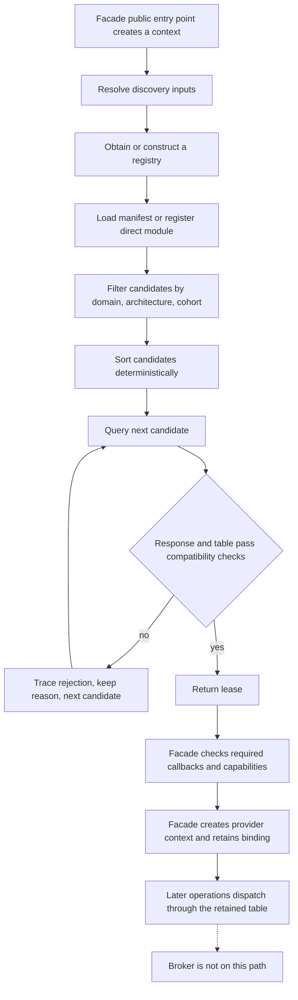

# Broker specification

Status: proposed specification. Non-normative evidence for every requirement here includes current
implementation status, source citations, named test coverage, and prototype measurements. Where an
obligation is not yet decided it is marked TBD rather than written as a requirement.

## Scope

This document specifies the broker: the distribution-private component that turns a request for a
domain on a device into a validated, retained provider binding when a public context is
established.

In scope: discovery inputs; manifest validation invocation; candidate ordering; the
compatibility-check sequence; cohort-selection invocation; what the broker hands a facade; failure
behavior; rejection diagnostics; concurrency and scope; module lifetime as a consequence of lease
ownership.

## Non-goals

This document does not specify:

- the manifest schema, its fields, or its trust rules — Provider manifest specification,
- the protocol wire format, table layout, or status taxonomy — Provider protocol specification,
- the binding object a facade builds — Provider binding specification,
- what a facade does after selection — Facade specification,
- what a cohort asserts — Cohort specification,
- module load mechanics and export surface — Provider module specification,
- provider-side obligations — Provider and Provider adapter specifications.

The broker has no public surface. No symbol named in this document is part of a public library
contract.

## Terms

- **Broker** — the distribution-private component that selects a provider lease during public
  context establishment. It does not run during ordinary operation dispatch.
- **Public context** — the client-visible stateful object whose creation requests provider
  selection. Its facade retains the returned lease.
- **Discovery input** — one source of candidates: a resolved manifest path, direct-module
  registration, or builtin registration.
- **Manifest validation** — the all-or-nothing check that validates every manifest entry before
  any entry becomes selectable.
- **Candidate** — one registry entry, a `(domain, architecture, id)` triple from a discovery
  input that survives filtering for the requested domain, architecture, and cohort.
- **Candidate ordering** — the total, content-derived ordering applied after filtering. It never
  depends on registration order, JSON key order, or manifest load order.
- **Compatibility check** — the fail-closed validation of a candidate's query response and
  dispatch-table header before the broker returns a lease.
- **Cohort selection** — filtering or constraining candidates by cohort identity so a caller can
  establish a compatible multi-domain set.
- **ProviderLease** — the immutable C++ object containing the selected module reference,
  validated table, selected identity, cohort identity, and advertised capabilities.
- **Lease** — `std::shared_ptr<const ProviderLease>`, the broker's returned ownership handle.
- **Provider binding** — facade-private state built from a lease and a provider context. User code
  never receives it directly.
- **Provider context** — opaque provider-owned state created by the facade through the selected
  table and retained with the lease.
- **Rejection diagnostic** — one traceable reason explaining why a candidate was not selected.
- **Broker scope** — process-wide registry state and per-public-context lease state. These scopes
  have different ownership and lifetime rules.
- **Module lifetime** — the selected provider module remains resident while at least one lease
  retains its strong module reference.

## Position in the architecture

The broker participates in context establishment. It MUST NOT participate in ordinary operation
dispatch.

A facade MUST call the broker at most once per public context, MUST retain the returned lease and
the provider context for the lifetime of that public object, and MUST reach the provider on every
later operation through the retained dispatch-table pointer without re-entering the broker. An
established context MUST NOT be rebound to a different provider.

Each domain MUST define one establishment moment. Deferring selection past construction to the
first operation is permitted only if selection remains once-only for the lifetime of the context;
which domains may do so is TBD-14.



## Discovery inputs

The broker's inputs MUST be limited to: a manifest path, direct-module registrations, builtin
registrations, the requested domain, the requested base architecture string, the required table
prefix size, the required protocol minor, and an optional required cohort. The broker MUST NOT
consult the caller's arguments to a math operation.

### Manifest path resolution

Each facade MUST carry a compiled-in default manifest path, expressed relative to the facade
module's own installed directory, and MUST resolve it against that module rather than against the
process working directory or a search path. Resolution MUST yield an empty path - never a guess -
for an empty input, an absolute input, or an undeterminable module path.

The broker MUST accept a per-facade environment override of the manifest path.

Discovery is single-file: the broker MUST load exactly the one resolved manifest. Directory
enumeration and multi-vendor `manifest.d` conventions do not exist; see TBD-6.

### Direct-module override

The broker MUST support registering a module directly, bypassing the manifest, for development and
test configurations. Where both a direct-module override and a manifest path are set, the
direct-module override MUST be consulted first.

A direct-module registration carries no configured provider identity. The broker MUST therefore
skip the identity-equality check for it and MUST use the normalized module path as that entry's
ordering identity.

### Device key

The requested architecture MUST be a canonical base `gfx` name with no target-ID feature suffix.
Deriving it from the device MUST split the reported architecture name at the first `:`, validate
the base, and fold only `xnack+`, `xnack-`, `sramecc+`, `sramecc-` into a feature mask; a repeated
or contradictory feature token MUST invalidate the whole string.

Selection MUST reject the wildcard `*` as a requested architecture, and MUST accept the reserved
`ROCM_INTERFACES_ARCHITECTURE_UNKNOWN` ("gfx000") only as a request, never as a registration.

Feature bits are carried to the provider but MUST NOT participate in candidate filtering; only the
base architecture string is matched.

## Manifest processing

The Provider manifest specification defines schema, field rules, path trust, load atomicity,
symlink and TOCTOU handling, and the platform scope of trust checks. The broker's obligations are:

- The broker MUST run that validation procedure in full, and MUST NOT let any entry of a manifest
  become visible to selection unless the whole manifest validated.
- The broker MUST NOT claim the trusted-path property on a platform where that specification says
  the checks are unavailable. See TBD-7.
- Registry entries are append-only. There is no unload, remove, or replace. Duplicate detection
  spans one load only; whether cross-manifest duplication is legal is TBD-5, and whether a
  repeated load of the same path must be idempotent is TBD-13.

## Candidate ordering

Candidate order MUST be total, content-derived, and independent of registration order, JSON key
order, and manifest load order. Every tie MUST be broken by content; no ordering tier may fall back
on insertion sequence. The comparison, in order:

1. exact architecture before wildcard `*`,
2. higher `priority` first,
3. provider identity ascending, where identity is the configured `id` or, when empty, the
   normalized generic-form module path,
4. `cohort` ascending,
5. normalized module path ascending,
6. module entries before builtin registrations,
7. `query_symbol` ascending.

Priority MUST remain strictly subordinate to architecture exactness: an exact-architecture entry
outranks a wildcard entry of any higher priority.

Cohort enumeration MUST use the same order minus tiers 5 through 7, and MUST return the
deduplicated nonempty cohort identifiers only.

## Compatibility checks

The broker MUST fail closed. A candidate is accepted only when every check below passes; the first
candidate that passes wins and no further candidate is queried.

### Preconditions on the request

Selection MUST reject a required table size smaller than `sizeof(rocm_interfaces_abi_header)`, and
MUST reject a required protocol minor greater than the minor the broker was built from, without
querying any candidate. The broker MUST NOT ask a provider for semantics newer than its own
headers.

### The query call

The broker MUST stamp the request header itself: it MUST set the requested protocol minor, carry
the requested prefix as the required table size, set the domain, and pass its own host services
pointer. It MUST resolve the entry's query symbol - the well-known
`ROCM_INTERFACES_PROVIDER_QUERY_SYMBOL` unless the manifest overrode it - from the module handle.
Symbol resolution MUST fail closed: a query symbol absent from the module MUST reject that
candidate with a diagnostic naming the symbol, never fall back to another symbol. Whether an
overridden query symbol is supported at all is TBD-4.

### Response checks

The broker MUST apply these in order:

1. a non-success return rejects the candidate,
2. the response header `struct_size` MUST be at least `sizeof(rocm_interfaces_provider_response)`,
3. the response `abi_major` MUST equal the broker's `ROCM_INTERFACES_ABI_MAJOR`,
4. the response `abi_minor` MUST be at least the requested minor,
5. the dispatch table MUST pass the table checks below,
6. the returned provider identity MUST be non-null and nonempty,
7. when the entry has a configured identity, the returned identity MUST equal it.

### Dispatch-table checks

The Provider protocol specification defines table shape and layout. The broker MUST reject a
candidate whose table is null, whose advertised table size is below
`sizeof(rocm_interfaces_abi_header)` or below the requested prefix, whose table header
`struct_size` disagrees with the advertised table size or is below the requested prefix, whose
table `abi_major` differs from the broker's, whose table `abi_minor` is below the requested minor,
or whose response header and table header disagree on the version pair.

The broker MUST read the table header with a byte copy after the size boundary check, so that a
malformed provider cannot force an unaligned typed load.

### Checks the broker does NOT perform

The broker inspects neither individual function pointers nor capability bits. Both are the caller's
responsibility after selection returns:

- **Required callbacks.** A null mandatory callback discovered after a successful negotiation MUST
  be a fail-closed configuration error. It MUST NOT trigger a fallback to another candidate.
- **Capability bits.** The broker forwards the provider-advertised mask unchecked; the facade
  decides whether the advertised capabilities meet its needs.
- **Build identity.** The build identity declared in the response is not a compatibility
  constraint. See TBD-2.

Whether required-callback and capability checking SHOULD move into the broker, so that a deficient
candidate falls through to the next one instead of aborting the whole selection, is TBD-8.

## Cohort selection

The Cohort specification defines what a cohort identity asserts and how it is matched. The broker
adds no cohort-matching rules of its own. Its obligations are:

- The broker MUST apply the Cohort specification's matching rule when filtering
  candidates, and MUST NOT introduce any additional or relaxed matching of its own.
- The broker MUST support enumerating candidate cohorts for a `(domain, architecture)` pair before
  committing to any domain, so a caller needing several domains can pick a bundle rather than
  selecting one domain and discovering afterwards that its dependency is absent.
- The broker MUST support constraining a selection to a named cohort, so a caller can thread the
  cohort of a first selection into a second.

The atomic complete-set rule is enforced by the caller, not by a single selection call: an
incomplete set MUST be rejected before a public context is returned. A caller MAY satisfy it either
by iterating enumerated cohorts and committing only to a complete one, or by threading the first
selection's cohort into every later selection.

Not every domain is cohort-constrained today. Whether the cohort-unconstrained domains are
intentionally exempt is TBD-9.

Cohort identity remains a manifest assertion. The broker MUST NOT treat a matching cohort string as
proof of distribution compatibility.

## What the broker hands a facade

`ProviderRegistry::select` is the broker entry point a facade calls during context establishment.
On success it returns `std::shared_ptr<const ProviderLease>`. The facade retains that lease while
it uses the selected provider.

```cpp
namespace rocm::interfaces {

class ProviderLease;

class ProviderRegistry {
public:
std::shared_ptr<const ProviderLease> select(
    rocm_interfaces_domain domain,
    std::string_view architecture,
    uint32_t required_table_size,
    const std::string& required_cohort = {},
    uint16_t required_abi_minor = ROCM_INTERFACES_ABI_MINOR);
};

class ProviderLease {
public:
const std::string& provider_id() const noexcept;
const std::string& cohort_id() const noexcept;
const void* table() const noexcept;
uint32_t table_size() const noexcept;
uint64_t capability_mask() const noexcept;
};

} // namespace rocm::interfaces
```

The facade may use only these accessors. ProviderLease implementation storage remains private.
The broker's private candidate-query helper creates ProviderLease only after validation succeeds.

Normative properties:

- `provider_id()` is the identity the provider returned, already checked against the configured
  identity when one exists.
- `cohort_id()` is the identity configured for the selected entry, not a value the provider
  returned. A facade MUST NOT read it as a provider assertion.
- `table()` is the validated dispatch-table pointer. Its dynamic type is the domain's table type
  and the facade MUST cast it; the broker returns an untyped pointer because it is domain-agnostic.
- `table_size()` is the provider-advertised size, already checked against the requested prefix and
  the table header.
- `capability_mask()` is the provider-advertised mask, unchecked by the broker.
- The lease privately owns the module reference. Holding the lease keeps the module resident; this
  is the whole of the module-pinning mechanism.

The lease is the broker's entire output. The broker MUST NOT create a provider context. The facade
MUST retain the lease for at least as long as the provider context it created through that table.

## Failure behavior

- Selection failure MUST be reported by throwing `std::runtime_error` carrying the domain name and
  numeric value, the requested architecture, the required cohort when one was given, and either
  "no registered candidate matched the request" or the accumulated per-candidate rejection reasons.
  Callers translate that into a domain status; the broker does not know the domain's status type.
- Argument-precondition failures and manifest-validation failures MUST throw
  `std::invalid_argument`.
- An exception escaping a provider query MUST be caught per candidate and turned into that
  candidate's rejection reason, including the non-standard-exception case. It MUST NOT abort the
  search.
- Failures MUST NOT be cached. A rejected candidate MUST store nothing, so a transiently failing
  provider and a module that failed to open are both retried on the next selection.
- Backend absence and backend incompleteness at the provider MUST surface as ordinary candidate
  rejections rather than crashes.
- There is no fallback provider after a successful negotiation.

Whether process abort is ever the required failure behavior for a provider create or destroy
failure is TBD-10; the broker itself MUST NOT abort.

## Diagnostics

Every rejected candidate MUST produce exactly one diagnostic line. The label MUST be
`provider '<id>' (builtin)`, `provider '<id>' (module '<path>')`, or `module '<path>'` depending on
what was registered, followed by the reason, with "rejected without a reason" as the fallback text.

The broker MUST deliver diagnostics through the host trace callback with domain `"runtime"` and
operation `"provider_candidate_rejected"`, and MUST wrap the callback so that a misbehaving or
throwing host diagnostic cannot alter selection semantics.

The same rejection strings MUST also be accumulated into the final selection error, so a caller
with no trace callback still gets the full picture.

Diagnostics MUST NOT be load-bearing: no code path may change its decision based on whether a trace
callback exists, or on anything the callback does.

## Concurrency

- The registry entry set MUST be guarded by a lock held during manifest splice, direct
  registration, builtin registration, and the candidate-filter snapshot, and released before any
  provider is queried.
- Per-entry module opening and querying MUST be serialized by a per-entry recursive lock, so that a
  provider whose query path re-enters the broker is legal rather than a deadlock.
- Every dynamic-loader call the broker makes MUST be serialized process-wide through the single
  shared dynamic-loader lock, so that independently loaded facades share one lock. The Provider
  module specification defines the module-side loading rules.
- Because the filter snapshot is taken under the lock and providers are queried outside it, a
  concurrent manifest load MAY add entries a concurrent selection does not see. That is intentional
  and MUST NOT be relied upon in either direction.

## Process and context scope

The broker's state has two scopes and they MUST NOT be confused.

**Process scope.** A registry instance is process-wide and shared by every context that uses the
same configuration; a registry MUST be keyed by its full configuration, not by manifest path alone.
Retention today is unbounded: registry and binding caches never evict. Whether unbounded retention
is accepted policy is TBD-11.

**Context scope.** The lease and provider context returned for one public object belong to that
object, and the binding MUST NOT outlive or migrate away from it.

There is presently no single broker instance for the process as a whole; each facade builds its own
registry. Ownership is TBD-1.

## Module lifetime interaction

The Provider module specification defines load mechanics, export surface, and unload rules. The
broker MUST NOT pin provider modules by itself: the registry holds only a weak module reference,
and the lease holds the strong one. The following consequences MUST hold:

- a module stays resident exactly as long as at least one lease references it,
- a module is unloaded when the last lease drops,
- the same module can be reloaded afterwards.

Whether a facade may defeat this by retaining leases for the process lifetime is undecided in
Provider protocol specification TBD-7; this specification states no rule either way until that
decision closes.

## Open decisions (TBD)

| ID | Open question | What it blocks | What would close it |
| --- | --- | --- | --- |
| TBD-1 | Who owns the broker in the production layout: one shared service, or a private registry per facade as today? | The ownership and coordination model; whether process scope describes one instance or N | An architecture decision naming the owning component and its packaging unit, plus a check that two facades in one process observe one broker |
| TBD-2 | Does build identity ever become a selection or compatibility constraint? | Treating a cohort identity as proof of distribution compatibility | A manifest key for build identity, a rule for what a mismatch does, and a named check |
| TBD-3 | Is "one global `(abi_major, abi_minor)` release tuple across all domains" normative, or a description of the current single-release state? | Whether a mixed-domain deployment is legal; nothing compares tuples across domains | Either a cross-domain check, or demotion of the Provider protocol statement to a non-normative note |
| TBD-4 | Is a manifest `query_symbol` override supported, or vestigial? | The manifest allowed-key set and the provider export allowlist, which contradict each other | Either an export-allowlist rule for alternate names, or removal of the key |
| TBD-5 | Is cross-manifest duplication of `(domain, architecture, id)` legal? | Whether "last loaded wins by tie-break" is a contract or a defect | A decision plus, if illegal, a registry-wide identity set and a rejection test |
| TBD-6 | Can multiple vendors ship providers for one domain and be discovered together? | Third-party or out-of-tree providers; no directory scan exists | A discovery-model decision and, if adopted, an ordering and trust rule for multi-file discovery |
| TBD-7 | Is the trusted-path requirement Linux-only by design, or must a native owner/ACL equivalent exist before the contract says MUST? | Enabling discovery on non-Linux platforms at all | A native trust and signing policy plus a platform-equivalent check |
| TBD-8 | Should required-callback and capability checking move into the broker so a failing candidate falls through to the next? | Whether one deficient provider can fail selection while a good one is registered behind it | A decision; the cohort-iterating caller already falls through per cohort while single-domain callers do not |
| TBD-9 | Are the cohort-unconstrained domains intentionally exempt from the atomic complete-set rule? | Whether the cohort rule is architecture-wide or specific to the coordinated paths | A per-domain statement of which domains require a cohort, plus tests for those that do |
| TBD-10 | Is process abort on provider create or destroy failure adopted behavior or inherited placeholder behavior? | The failure contract a facade can rely on | A decision recorded in the failure contract, and if abort is kept, a named check |
| TBD-11 | Is process-lifetime retention (never-evicting caches, never-shrinking lease pins) accepted policy? | Memory behavior under many devices or configurations; module unload semantics, which lease pinning defeats | A retention policy decision plus a measurement |
| TBD-12 | Is `schema_version` forward compatibility reject-only, or accept-and-ignore-new-optional-fields? | Shipping a newer-schema manifest to an older runtime | A versioning-contract entry and a single source of truth for the schema literal |
| TBD-13 | Should a repeated load of the same manifest path be idempotent, given an append-only registry with no unload API? | Any caller that may load the same manifest twice | Either an idempotence rule or an explicit "callers MUST load once" requirement |
| TBD-14 | Which establishment moment does each domain use, and may any domain defer selection past context construction? | Whether "the broker runs at context establishment" has one sanctioned exception or an unbounded number; whether a context may be created and never bound | A per-domain statement of the establishment moment, and either a rationale for each deferral or a change that binds at construction |

## Related specifications

- **Architecture component model** — where the broker sits.
- **Facade** — the caller that establishes a context and retains the binding.
- **Provider binding** — what the facade builds on the returned lease.
- **Cohort** — what a cohort identity asserts and what it does not.
- **Provider manifest** — the schema and trust rules this document consumes.
- **Provider protocol** — the query envelope, table layout, and status taxonomy.
- **Provider**, **Provider adapter**, and **Provider module** — the private side of the boundary
  the broker queries.
