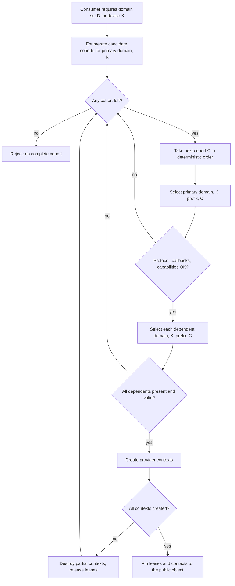

# Cohort specification

Status: specification. The cohort concept, exact-name matching, per-domain validation, and
the atomic complete-set rule in [../draft-plan-reboot.md](../draft-plan-reboot.md) are
ADOPTED as the target design; the implementing mechanisms are partial. Implementation
status, source citations, test inventories, and prototype evidence for every rule below live
in [ledger/cohort.md](ledger/cohort.md), which is non-normative.

## Scope

This document owns cohort identity, cohort membership, the consistency rules that govern
co-selecting a set of providers, and cohort upgrade and rollback.

## Non-goals

Discovery, candidate ordering, and selection mechanics belong to [broker.md](broker.md).
The manifest file, its schema, and its device/architecture representation belong to
[manifest.md](manifest.md). Protocol identity, versioning, status taxonomy, argument
ownership, object lifetime, and concurrency belong to
[provider-protocol.md](provider-protocol.md). Lease and binding validity belong to
[provider-binding.md](provider-binding.md). The public API/ABI belongs to
[facade.md](facade.md). Module loading belongs to [provider-module.md](provider-module.md).

This document does not define numerical or behavioral equivalence between cohorts. Selecting
a complete cohort is a compatibility statement, not a correctness statement. It does not
specify packaging tooling or distribution policy beyond the constraints a cohort places on
them.

## Terminology

Terms not defined here are used as defined in
[../draft-plan-reboot.md](../draft-plan-reboot.md).

**Cohort.** A set of providers qualified to work together for a defined device, capability
profile, protocol version, and distribution build. Members may be separate binaries with
separate private contexts. Membership permits coordinated selection only.

**Cohort identity.** The string value that names a cohort, declared per provider entry in a
manifest and carried onto the broker-issued lease.

**Complete set.** The leases, one per domain a consumer requires, that all carry the same
cohort identity and all pass their per-domain validation.

**Distribution build identity.** A value identifying the coordinated build a set of
artifacts was produced from. Distinct from cohort identity: see section 4.

---

# 1. Cohort identity

## 1.1 What the identity asserts

A cohort identity is an assertion by the party that produced the manifest that every provider
entry bearing that identity was built, packaged, and qualified as one set for the device
profiles those entries declare. Nothing in the runtime verifies the assertion; it is trusted
because the manifest is trusted (see [manifest.md](manifest.md)).

## 1.2 Matching

- An implementation MUST match cohort identity by exact string equality and by nothing else:
  no normalization, no case folding, no prefix matching, no wildcard.
- An empty requested identity MUST match every entry, including entries that declare no
  cohort.
- A declared identity of the empty string MUST be read as "this provider declares no cohort",
  never as a cohort named "".

## 1.3 Naming

- A cohort identity MUST be a string.
- A cohort identity MUST be nonempty for any provider that participates in a multi-domain
  consumer path.
- A cohort identity MUST be stable for the life of a distribution build. Two artifacts that
  are not interchangeable MUST NOT share an identity.
- A cohort identity MUST NOT be reused across an incompatible rebuild (see section 6).
- A cohort identity SHOULD be scoped by producer so that two vendors shipping into one
  provider directory cannot collide.

## 1.4 Cohort identity is not provider identity

Cohort identity and provider identity are independent axes and MUST NOT be conflated. One
provider identity MAY appear in more than one cohort, and one cohort routinely contains
several provider identities.

- A consumer that needs a specific implementation MUST constrain provider identity.
- A consumer that needs a coordinated set MUST constrain cohort identity.
- Constraining one MUST NOT be treated as constraining the other.

## 1.5 What a cohort identity is not

| Concept | Relationship to cohort identity |
| --- | --- |
| Provider identity | Names one implementation; a cohort contains many. Section 1.4. |
| Package version | No runtime relationship. Per package, so it says nothing about cross-package qualification. |
| Public ABI version | Orthogonal. A cohort is a private-side grouping. A cohort change MUST NOT change the public ABI version, and a public ABI bump does not by itself imply a new cohort. See [facade.md](facade.md). |
| Protocol version | Negotiated per candidate, independently of cohort. Both MUST hold; neither implies the other. See [provider-protocol.md](provider-protocol.md). |
| ELF build ID | Identifies exactly one binary and cannot express that several binaries belong together. It MAY support provenance checks; it MUST NOT be used as a cohort identity. |
| Distribution build identity | The intended carrier for "produced by the same coordinated build". Section 4. |

A cohort identity MUST NOT be read as evidence of protocol compatibility, capability
presence, device support, or build provenance.

---

# 2. Membership

## 2.1 The required domain set is consumer-specified

A cohort declares no domain inventory. The required domain set is a property of the consumer
path.

- A consumer that requires more than one domain MUST declare its required domain set before
  selecting any of them, and MUST require one cohort identity across the whole set.
- A consumer that requires exactly one domain MAY leave cohort unconstrained.

## 2.2 Device bounding

Device identity and architecture matching are specified in [broker.md](broker.md) and
[manifest.md](manifest.md). The cohort-level obligations are:

- Every member of a cohort that a consumer requires for a given device MUST match that
  device's architecture. A cohort whose one member matches the device and whose another does
  not is an incomplete cohort for that device and MUST be rejected as a set, never partially
  accepted.
- A cohort MAY declare different architecture lists for different member domains. The
  consumer's effective device coverage is the intersection.
- Whether a member may advertise a wildcard architecture, and the rule binding a
  kernel-bearing member's advertised list to its compile targets, are specified in
  [manifest.md](manifest.md).

## 2.3 Protocol bounding

Cohort membership and protocol compatibility are independent gates and both MUST pass. The
negotiation itself is specified in [provider-protocol.md](provider-protocol.md).

- Every member of a required cohort MUST independently satisfy protocol negotiation. A cohort
  identity MUST NOT waive, weaken, or substitute for any negotiation check.
- All members of one cohort SHOULD stamp the same protocol version tuple. Whether this is a
  requirement is TBD-4.

## 2.4 Capability bounding

Capability advertisement is specified in [provider-protocol.md](provider-protocol.md). The
cohort-level obligations are:

- A capability profile MUST be evaluated per domain, per candidate, before that candidate is
  committed to.
- A capability satisfied by one member of a cohort MUST NOT be credited to another member.
- A cohort identity MUST NOT be read as evidence of a capability.

---

# 3. Co-selection

## 3.1 Atomicity

A consumer that requires N domains under one cohort MUST acquire all N or none. It MUST NOT
create any provider context, and MUST NOT return a public object to the caller, until every
required domain in the same cohort has been selected and validated.

The failure this prevents is silent. If one domain is committed before its sibling is
checked, a missing sibling degrades into a partially initialized public object whose behavior
differs from the qualified configuration, and the divergence surfaces later as a numerical or
performance anomaly rather than as a startup error.

## 3.2 Requirements

- A multi-domain consumer MUST enumerate cohorts and evaluate each as a whole, in the
  deterministic candidate order defined by [broker.md](broker.md). It MUST NOT commit to the
  first primary-domain candidate and then hope its dependents exist.
- Failure to complete a cohort MUST advance to the next candidate cohort, not fail the whole
  selection, until candidates are exhausted.
- Exhaustion MUST be an error that names the requested domain set, the device, and the reason
  each candidate cohort was rejected (section 3.4).
- Partial construction MUST unwind. Any provider context created while assembling a cohort
  that then fails MUST be destroyed before the next cohort is tried.
- A consumer MUST NOT relax to a single-domain path because the multi-domain path was
  incomplete, unless that relaxation is an explicitly declared policy of that consumer,
  decided before selection rather than as recovery from a failed selection.
- Cohort enumeration order and the rank cohort identity holds within it are specified in
  [broker.md](broker.md). A distribution that wants one cohort preferred MUST express that
  with entry priority, never by relying on lexical cohort order.

## 3.3 The selection is final for the object

Lease validity and retention are specified in
[provider-binding.md](provider-binding.md). The cohort-level obligations are:

- A public object MUST retain every lease of its cohort for its whole lifetime, not only the
  primary domain's lease. It MUST NOT silently move to a different cohort, provider, or
  module.
- Cohort identity MUST be observable from an established public object for diagnostic
  purposes.
- Release MUST run in dependency order: a provider context MUST be destroyed before any
  service binding it borrowed from a cohort sibling.
- Whether deferred selection is permitted at all is an open question owned by
  [architecture-component-model.md](architecture-component-model.md) X24. This document MUST
  NOT be read as granting that permission.

## 3.4 Cohort-level diagnostics

The failure this prevents is a cohort selection that fails with a single unhelpful line,
leaving an operator unable to tell whether the cause is a missing package, a wrong
architecture, an old protocol, or a missing capability bit. Per-candidate rejection
diagnostics are owned by [broker.md](broker.md); the cohort-level obligations are:

- A cohort-level failure MUST report the requested domain set, the device architecture and
  ordinal, the cohorts enumerated, and for each cohort the domain that failed and why.
- The four rejection classes MUST be distinguishable in the message: no cohort candidate at
  all; cohort present but a required domain missing; domain present but protocol
  incompatible; domain and protocol fine but a required capability bit absent.
- Diagnostics MUST NOT change selection.

## 3.5 Co-selection is not object interchange

This is the rule most likely to be misread. Cohort membership permits coordinated
**selection**. It does not make provider objects interchangeable.

- An opaque provider context obtained from one provider MUST NOT be passed to another
  provider, even a cohort sibling. Every domain protocol represents its context as an untyped
  pointer, so nothing in the type system prevents the mistake.
- A cohort key carried in a cross-provider service reference is broker-defined opaque identity.
  A provider MAY compare or copy it and MUST NOT use it to infer provider state. It MUST NOT be
  treated as an authenticator.
- How a cross-provider service reference is represented, authenticated, validated, and revoked is
  specified in [provider-binding.md](provider-binding.md); this document states no rules of its
  own about it.

---

# 4. Distribution build identity

Cohort identity says "qualified together". Distribution build identity says "produced by one
coordinated build". A cohort needs both, because an identity reused across a rebuild pairs
mismatched binaries under exact-name matching without any check noticing.

- Each provider MUST report a distribution build identity that is equal across all members of
  one coordinated build and different across any two builds that are not interchangeable.
- The broker MUST reject a cohort whose members do not agree on that identity, and MUST do so
  before returning a public context.
- The mismatch MUST be a rejection with a diagnostic, not a silent downgrade to a
  single-domain path.
- A distribution build identity MUST NOT be derived from an ELF build ID, because a build ID
  is per binary and cannot express set membership.
- The manifest schema MUST gain a place to declare or cross-check the expected identity, or
  the rule MUST be defined as response-only.

The whole of this section is blocked on TBD-1 and TBD-2.

---

# 5. Packaging constraints a cohort imposes

Packaging policy is out of scope; these are the constraints cohort membership places on it.

- A package MUST NOT ship a partial cohort. If any entry declares cohort C and any consumer
  path requires domains D1 and D2 under one cohort, the installed set MUST contain a
  C-labelled entry for both, matching on architecture.
- Package dependency metadata MUST make the members of a cohort co-installable and
  co-upgradable as a unit.
- Two cohorts MUST be able to coexist in one provider directory without interfering.
- Cross-manifest duplicate provider-identity detection MUST exist before multiple cohorts are
  shipped into one directory (TBD-10).

---

# 6. Upgrade

- Upgrading a cohort MUST be atomic from the perspective of a process that starts after the
  upgrade: the installed set MUST never present a mixture of old and new cohort members under
  one identity.
- A rebuild that changes any member's private behavior in a way that is not compatible with
  the other members MUST take a new cohort identity.
- A rebuild that preserves semantics for every member MAY retain the cohort identity; the
  distribution build identity (section 4) is what then distinguishes the two builds.
- An in-flight process MUST NOT be affected by an on-disk upgrade. A cohort selection pinned
  under section 3.3 stays pinned.
- Two cohort generations MAY be installed simultaneously only if selection can distinguish
  them.

---

# 7. Rollback

- Rolling back a cohort MUST restore a complete set. A rollback that removes one new member
  while leaving another is an incomplete cohort and MUST fail selection loudly rather than
  degrade.
- Rollback MUST NOT depend on cohort identities being ordered. Nothing may assume that a
  newer cohort sorts after an older one.
- After a rollback, a newly started process MUST select the rolled-back cohort. Processes
  already running keep their pinned selection, which is correct and MUST NOT be treated as a
  rollback failure.
- A rollback that reintroduces a previously used cohort identity with different binaries is
  the identity-reuse hazard of section 6 and MUST be prevented by the same rule.

---

# 8. Conformance obligations

An implementation claiming conformance with this document MUST:

1. Match cohort identity by exact string equality and by nothing else.
2. Evaluate every required domain of a cohort before creating any provider context.
3. Destroy any partially created context before evaluating the next cohort.
4. Enumerate cohorts in the deterministic candidate order defined by
   [broker.md](broker.md).
5. Report, per rejected cohort, which domain failed and in which of the four classes of
   section 3.4.
6. Pin every lease of the accepted cohort to the public object for that object's lifetime.
7. Refuse to pass an opaque object from one provider to another.
8. Never treat cohort identity as evidence of protocol compatibility, capability presence,
   device support, or build provenance.

---

# 9. Open decisions

| ID | Question | What is blocked |
| --- | --- | --- |
| TBD-1 | Does distribution build identity become a selection constraint, and what does a mismatch do? | Section 4 in full |
| TBD-2 | What value is a distribution build identity: release stamp, source revision, or package version? | TBD-1; the identity-reuse rule of section 6 |
| TBD-3 | Is there a grammar for cohort identity strings (charset, length, required producer prefix), and is it validated the way architecture values are? | Section 1.3; multi-vendor coexistence |
| TBD-4 | Is one protocol version tuple across all members of a cohort a requirement or a description of the current single-release state? | The SHOULD in section 2.3; whether a mixed-minor cohort is legal |
| TBD-5 | Should the required domain set be declarative and checkable at package time rather than implicit in consumer code? | Section 2.1; the partial-cohort packaging rule of section 5, which is unenforceable without a declaration |
| TBD-6 | Should single-domain consumer paths that are in practice paired become cohort-constrained? | Whether section 3.1 is universal or applies only to declared multi-domain paths |
| TBD-7 | Must a multi-domain consumer enumerate cohorts, or may it propagate the cohort of an unconstrained first selection? | Fallback behavior when the top-ranked primary candidate's cohort has no member for a dependent domain |
| TBD-10 | Is cross-manifest duplicate provider identity legal, or a defect to be rejected? | The coexistence rule of section 5 |
| TBD-13 | Should the package artifact check read cohort identity and reject a partial cohort? | The packaging rule of section 5 |
| TBD-14 | Is there a cohort rollback test obligation? | Section 7 |

One obligation in this document may not be cohort-owned and is kept here pending an owner
decision: the observability of cohort identity from an established object in section 3.3
(candidate owner [facade.md](facade.md)). Open decisions raised by the
prior revision of this file that are not cohort contracts (capability bit allocation, public
handle validation, lease retention lifetime, multi-vendor discovery, feature-mask matching,
alternate query symbols, recording-provider scope, test-plan questions) are recorded in
[ledger/cohort.md](ledger/cohort.md) for reassignment to their owning specs.

---

# 10. Cross-links

- [../draft-plan-reboot.md](../draft-plan-reboot.md) - parent concepts document.
- [architecture-component-model.md](architecture-component-model.md) - where the cohort sits.
- [broker.md](broker.md) - enumeration, ordering, validation, selection.
- [manifest.md](manifest.md) - where the cohort key is declared.
- [provider-protocol.md](provider-protocol.md) - negotiation, capabilities, object lifetime.
- [provider-binding.md](provider-binding.md) - lease validity and retention.
- [facade.md](facade.md) - the public identity a selection is made on behalf of.
- [provider.md](provider.md) - provider identity, distinguished in section 1.4.
- [provider-module.md](provider-module.md) - the loading unit; one cohort spans several.
- [ledger/cohort.md](ledger/cohort.md) - non-normative evidence, status, and citations.
