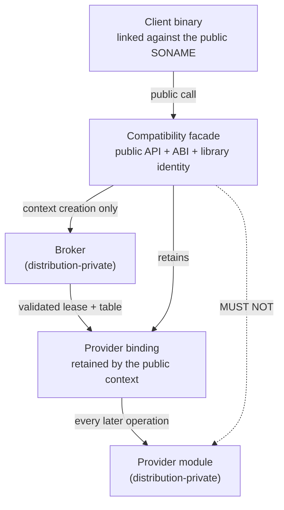

# Facade specification

Status: normative specification. It states what a compatibility facade MUST do, not what the tree
does today; implementation status, source citations, test inventories, and prototype evidence are
non-normative and live in [ledger/facade.md](ledger/facade.md). No facade in the tree owns a
canonical public library identity today; every one is a shadow. That gap is TBD-1 and does not
weaken any requirement below.

## Scope

This document specifies the compatibility facade: the component that owns an established public
API, ABI, and library identity while delegating implementation work across a distribution-private
boundary. In scope: what a facade exposes and hides; library identity and naming; the public ABI
surface; client-visible state, context establishment, and teardown; validation, error translation,
and behavioral compatibility; dispatch through a retained binding; prohibited provider-specific
dependencies; the shadow overlay and the legacy-to-facade transition; versioning, platforms, and
packaging obligations that fall on the facade artifact.

## Non-goals

Nothing here specifies candidate discovery and ordering ([broker.md](broker.md)), the manifest
([manifest.md](manifest.md)), the private wire format, dispatch-table layout, or the status
taxonomy ([provider-protocol.md](provider-protocol.md)), provider composition
([provider.md](provider.md), [provider-adapter.md](provider-adapter.md),
[provider-module.md](provider-module.md)), the binding object's internals
([provider-binding.md](provider-binding.md)), or cohort identity ([cohort.md](cohort.md)). A facade
also does not define the public contract of any math library; it inherits it, and `rocblas.h`
remains owned by rocBLAS.

## Terminology

Architecture-wide terms (broker, provider, provider binding, provider protocol, cohort) are defined
in [../draft-plan-reboot.md](../draft-plan-reboot.md) and used here unchanged. Two are local:

- **Public context** - the client-visible stateful object whose creation triggers selection and
  whose lifetime pins the binding. `rocblas_handle`, `hiprandGenerator_t`, and `hipsolverHandle_t`
  are public contexts.
- **Shadow facade** - a facade built and installed under a deliberately distinct library identity
  so it can coexist with the canonical library during qualification. Shadow is a stage, not a
  product.

## 1. What a facade is

A facade is the only component with a public surface; everything below it is private.

The dotted edge is a prohibition: a facade MUST NOT reach a provider except through a binding it
obtained from the broker.

- A facade MUST expose exactly the public API of the library whose identity it owns, and nothing
  else.
- A facade MUST NOT expose the provider protocol, the broker, manifest contents, provider
  identities, cohort identities, or dispatch-table pointers through any public declaration.
- A facade MUST resolve provider selection at public-context creation and MUST NOT reselect on the
  operation path.
- Selection MUST happen at most once per public context. Whether a facade MAY defer selection to
  the first operation that supplies the device is TBD-16, tracked as
  [architecture-component-model.md](architecture-component-model.md) TBD-24. This document MUST NOT be
  read as granting that permission.
- A facade MUST NOT be a thin symbol forwarder to a single implementation library. If it links the
  implementation it shadows, it is not a facade; see section 5.

## 2. Library identity and naming

### 2.1 Target state

- A facade MUST own the SONAME of the library whose contract it presents.
- A facade MUST NOT introduce a new public SONAME for a contract that already has one. Owning the
  contract means inheriting the identity, not adding one beside it.
- Exactly one installed DSO MUST provide a given public SONAME in a distribution. Two DSOs both
  claiming `librocblas.so.5` in one install tree is a packaging defect, not a fallback.

### 2.2 Shadow qualification identity

- A shadow facade MUST use a distinct SONAME so it can be installed alongside the canonical
  library, and that SONAME SHOULD be formed as `lib<library>-loader.so.<soversion>`.
- A shadow facade MUST carry the same SOVERSION as the canonical library whose contract it
  presents, because a client that switches to it by `LD_PRELOAD` or by relinking must still see a
  compatible version discipline. Nothing derives or checks that agreement today; see TBD-3.
- Experimental or staging facades that are never installed MUST NOT be packaged.
- A facade CMake target name SHOULD be `<library>_loader_shadow` while it is a shadow, and its
  `EXPORT_NAME` SHOULD be `<library>_loader`.
- The shadow export set MUST be namespaced away from the production namespace so a consumer cannot
  pick up a shadow by accident.
- The shadow package config MUST fail to be found, rather than silently mismatch, when the headers
  it was built against are not the headers now present.

The four contracts in scope: `librocblas.so.5` (shadowed as `librocblas-loader.so.5` and
`librocblas-loader-narrow-v2.so.5`, version node `ROCBLAS_ABI_5`), `libhiprand.so.1`
(`libhiprand-loader.so.1`, `HIPRAND_ABI_1`), `libhipblaslt.so.1`
(`libhipblaslt-loader.so.1`, `HIPBLASLT_ABI_1`), and `libhipsolver.so.1`
(`libhipsolver-loader.so.1`, `HIPSOLVER_ABI_1`).

## 3. Public API

- The facade's public headers MUST be the imitated library's own headers. A facade MUST NOT ship a
  parallel header describing the same functions.
- The facade MUST compile against those headers with the imitated library's export macro defined,
  so declarations carry their normal default visibility.
- A facade MUST NOT add, remove, or re-type any declaration in those headers.
- Where the public API is a C++ surface, the facade MUST preserve mangled-name compatibility, not
  merely source compatibility.
- A facade MUST define every public entry point of the contract it owns, including entry points it
  cannot service. An undefined symbol is a link failure for an existing client and is therefore a
  public ABI break even when the function would have failed at runtime.
- An entry point with no provider backing MUST return the contract's own "not supported" status
  rather than abort or crash.

## 4. Public ABI

### 4.1 Exports are an allowlist, not a consequence of visibility

The threat: a facade compiled from ordinary C++ sources exports far more than the contract - inline
helpers, typeinfo, and any symbol whose visibility was inherited from a header. A client or another
DSO then binds to a symbol the facade never promised, and removing it later breaks that client.

- Every facade MUST be built with hidden default visibility, including hidden inlines.
- Every facade MUST be linked with a version script on ELF platforms, and that script MUST list the
  public contract explicitly with `local: *;` catching everything else.
- The installed export set MUST equal a checked-in or generated baseline exactly. Extra exports are
  a failure; missing exports are a failure.
- Every exported symbol MUST carry the contract's named version node. A bare (unversioned)
  definition is a failure.
- The export baseline SHOULD be cross-checked against the generated API snapshot of the imitated
  header, so the allowlist cannot drift away from the contract.

### 4.2 Symbol versioning

- On ELF platforms every public export MUST be bound to a named version node whose name encodes the
  contract's major line (the nodes named at the end of section 2.2).
- A facade MUST NOT define the same symbol at two default-visibility versions in one DSO.
- A facade MUST NOT rely on `-Bsymbolic` to make its own internal references safe against
  interposition of its public names; `-Bsymbolic` is inert for the versioned public path.

### 4.3 Dynamic dependencies

- A facade's `DT_NEEDED` list MUST NOT name any canonical math implementation library.
- A facade MUST depend on the package-private dynamic-loader lock DSO, so that module loading is
  serialized process-wide across facades (section 11).
- A facade MUST carry no installed RPATH. Provider modules are located by the manifest and its
  containment rules, not by a search path baked into the facade.
- Any check of the above MUST have a positive control that fails, so a green result cannot mean the
  check inspected nothing.

## 5. Prohibited provider-specific dependencies

The threat: a facade that links the library it is supposed to replace cannot be swapped for a
different provider, cannot be installed without that library, and will resolve the implementation's
symbols against itself once it owns the public identity.

- A facade MUST NOT link any canonical math implementation target. This MUST be rejected at
  configure time, not only at test time.
- A facade MUST NOT `dlopen` an implementation library. Backend loading belongs to the provider.
- A facade MUST NOT include an implementation-private header.
- A facade MUST NOT branch on a provider identity, cohort identity, or module path to change public
  behavior. Behavior differences belong in capability bits negotiated through the protocol, not in
  string comparisons against provider names.
- A facade MAY depend on the imitated library's header-only CMake target, and MUST NOT depend on
  anything else from that library.

## 6. Client-visible state

A public context carries two kinds of state: state the public contract says the client owns and can
read back, and state that exists only to reach a provider. The second kind MUST NOT be observable.

- The facade MUST own every client-visible setting of the public context and MUST be able to answer
  every public getter from its own state without calling the provider.
- A setter the contract defines as taking effect on subsequent operations MUST be recorded by the
  facade and applied at the next operation, not eagerly forwarded in a way that changes the
  observable ordering.
- Every public operation MUST observe a single coherent snapshot of the public context's settings.
  A concurrent setter MUST NOT be able to split a call across two configurations. Whether this
  binds every facade or only contracts that permit concurrent use of one context is TBD-12.
- Provider-owned state (the opaque provider context, the dispatch-table pointer, the lease, the
  registry reference) MUST be unreachable from any public declaration.
- The facade MUST NOT expose the provider's own handle type. Runtime handles such as streams and
  events cross the private boundary as opaque pointers, cast on the adapter side.
- The facade MUST supply the host-services pointer used by the provider and MUST NOT honour a
  caller-supplied one.
- The facade MUST stamp the protocol ABI header on every record it forwards, and MUST NOT trust a
  header value that reached it from public API data.

## 7. Broker and the retained binding

- The facade MUST call the broker exactly at public-context creation, and MUST NOT call it again
  for that context. The first-operation shape is the open deferral question of section 1 (TBD-16),
  not a sanctioned alternative.
- The facade MUST retain the binding for the lifetime of the public context: the lease, the
  validated dispatch-table pointer, and the opaque provider context. The object itself is specified
  in [provider-binding.md](provider-binding.md).
- The facade MUST NOT allow an established public context to move to a different provider.
- When the public contract requires several domains to work together, the facade MUST acquire the
  complete set before it returns a public context, and MUST return failure rather than a partially
  bound context. Cohort consistency itself is specified in [cohort.md](cohort.md).
- Capability requirements are the facade's to state: it declares the capability bits its public
  contract needs and MUST reject a lease that lacks them. Whether that gating belongs to the facade
  or the broker is TBD-14.
- The facade MUST NOT cache a selection failure. Retry on the next context creation is required so
  a transient condition does not poison the process.

## 8. Validation

Validation splits across three layers - facade, protocol boundary
([provider-protocol.md](provider-protocol.md)), and provider adapter
([provider-adapter.md](provider-adapter.md)) - and the split MUST be explicit or the same argument
gets checked twice with two different answers. The facade layer owns exactly these checks, each
failing with the public contract's own status: public handle non-null, required public pointer
arguments, public enum validity, and contract-level shape rules the contract documents.

- The facade MUST reject a null public handle before dereferencing it, with the contract's
  invalid-handle status.
- The facade MUST validate that a public context it was handed is one of its own. A pointer from a
  different facade, a different process-local table, or a destroyed context MUST be rejected, not
  dereferenced.
- The facade MUST NOT duplicate provider-side semantic validation. Where the provider is the
  authority - index-width range, feature support, backend availability - the facade MUST forward
  and translate rather than pre-judge.
- The facade MUST NOT skip validation on the grounds that the provider will catch it. A null
  dereference in the facade is a crash in the client's process attributed to the public library.
  Where the facade/adapter split actually falls is TBD-11.

## 9. Error translation

The threat: the private layers signal failure in three vocabularies at once - a C++ exception, a
protocol transport code, and a domain status - and every one of them is invisible to the client. If
any of them escapes, the client sees a crash or a status its contract does not define.

- Every public entry point of a facade MUST be `noexcept` in effect. No C++ exception may cross the
  public ABI, regardless of the client's language or its own exception configuration.
- Every public entry point MUST return a value drawn from the public contract's own status
  enumeration. The private status taxonomy defined in
  [provider-protocol.md](provider-protocol.md) MUST NOT be returned to a client.
- The translation MUST be total. Every private status value and every exception type MUST map to
  exactly one public status, including a catch-all arm.
- An allocation failure MUST map to the contract's allocation-failure status, not to a generic
  internal error, because a client can act on out-of-memory and cannot act on "internal error".
- A protocol-boundary transport failure MUST be distinguishable in diagnostics from a semantic
  failure, even where the public status collapses them.
- Where the same underlying condition must produce different public statuses on two different
  public contracts, the divergence MUST be deliberate and documented at the translation site.
- A facade MUST NOT call `std::abort()` to report a failure that the public contract can express.
  Aborting is a process-level outcome the client cannot handle. See TBD-6.

## 10. Behavioral compatibility

Structural compatibility is not sufficient: a facade that exports the right symbols at the right
versions and computes different answers has broken the public API.

- A facade MUST preserve documented semantics of the contract it owns, including default values,
  ownership rules, error precedence, and the meaning of edge-case inputs. Zero-increment vectors,
  zero-size early returns, and alias rules are contract, not implementation detail.
- A facade MUST preserve the observable status for a given input, not merely "some failure". Two
  distinct failures that the contract distinguishes MUST remain distinguished.
- A facade MUST preserve asynchronous semantics: which stream work is enqueued on, whether a call
  synchronizes, and when a completion is observable.
- A facade MUST NOT change numerical results outside what the contract already permits. Where the
  contract does not promise bitwise reproducibility, a facade MUST still be qualified against the
  canonical implementation by differential test rather than by inspection.
- A facade MUST preserve the destruction contract, including the order in which dependent
  provider-side objects are released.
- A public destroy entry point MUST release the public object. Returning a failure status MUST NOT
  leave the object allocated, because the client has no second chance to free it. See TBD-7.

## 11. Concurrency

- A facade MUST be safe for concurrent use of distinct public contexts from distinct threads
  without external synchronization.
- Concurrent use of a single public context MUST behave as the contract specifies. Where the
  contract permits it, the facade MUST provide the coherent snapshot required by section 6.
- A facade MUST NOT hold a lock across a provider call that can block indefinitely unless the
  public contract already serializes that call.
- Module loading MUST be serialized process-wide across all facades in the process, through the
  shared dynamic-loader lock DSO required in section 4.3.

## 12. Legacy-to-facade transition

The transition has four states, and a distribution MUST be in exactly one of them for a given
contract at a given time: State 0, the legacy library owns `librocblas.so.5`; State 1, a shadow
facade is installed beside it; State 2, the facade owns `librocblas.so.5` and the legacy library
becomes a provider backend; State 3, the legacy backend is retired or kept as one provider among
several. State 2 rolls back to State 0.

- The transition MUST be reversible at State 2. A distribution MUST be able to reinstall the legacy
  library and have existing compiled clients keep working, without relinking.
- A client compiled against the legacy library MUST NOT need to be recompiled or relinked to run
  against the facade. That is the whole compatibility claim; if it fails, the facade is a new
  library.
- In State 2 the legacy implementation MUST be reachable only as a provider backend behind the
  private boundary, and MUST NOT retain the public identity.
- The private path by which a provider reaches the legacy implementation MUST be declared private
  and MUST guarantee that references originating inside the legacy DSO bind to that DSO's own
  implementation, even when a facade exporting the same public names was loaded first.
- Package upgrade and rollback MUST be tested as a sequence, not as two independent installs.
- `ldconfig` behavior MUST be preserved across the swap: a stub or symlink the distribution relies
  on MUST survive.

## 13. Shadow qualification

Shadow qualification proves a facade against the canonical library while both are installed. It
exists because the alternative - swapping the identity and finding out in production - has no
rollback faster than a package rebuild.

- A shadow facade MUST be installable alongside the canonical library with no file conflict and no
  SONAME conflict.
- A test application MUST be able to select the shadow explicitly, and MUST NOT select it by
  accident. Selection is by linking against the shadow SONAME or by preload; a shadow MUST NOT
  interpose itself by default.
- The shadow MUST be subject to every ABI check the production facade will be subject to: export
  allowlist, version node, no canonical dependency, dynamic-loader dependency, no RPATH.
- A shadow MUST be qualified by compiled-consumer tests from an installed tree, not only from the
  build tree, because install-time properties (RPATH removal, namelink placement, config package
  contents) differ from build-time ones.
- Exit criteria for leaving shadow qualification MUST be written down before the identity transfer.
  See TBD-2.

## 14. Versioning

Three version lines meet at a facade and MUST NOT be conflated: the public library version and
SONAME, owned by the contract owner and constraining client binary compatibility; the provider
protocol ABI, owned by [provider-protocol.md](provider-protocol.md) and constraining
facade-to-provider compatibility; and the header build version, owned by the distribution and
recording which headers the facade was compiled against.

- A change to the provider protocol MUST NOT change the public SONAME or version node. The private
  ABI is private precisely so it can move.
- A facade MUST request the lowest protocol minor it can actually work with, not the current one,
  so an older conforming provider remains selectable. A facade that needs only a prefix of a
  dispatch table MUST derive its required table size from that prefix, not from the current size.
- A facade MUST NOT stamp a protocol minor it did not negotiate.
- A facade MUST be rejected at configure time when the headers present do not match the headers it
  was built against.
- A distribution MUST express the facade-to-provider compatibility window as a package dependency
  constraint, not only as a runtime check.

## 15. Supported platforms

- On Linux ELF targets, everything in section 4 is required: version script, named version node,
  export allowlist, dependency assertions, no RPATH.
- A facade MUST NOT be built on a platform where its provider-discovery trust model has not been
  defined. Manifest trust is specified in [manifest.md](manifest.md) and is Linux-only today.
- Windows and macOS are out of scope: TBD-4. Nothing here claims a facade works on them.

## 16. Build and packaging obligations

- A facade MUST be installed with its runtime library in the runtime component and its namelink in
  the devel component, so a runtime-only install does not ship a development symlink.
- A facade MUST carry a compiled-in default provider-manifest path. How that path is resolved is
  specified in [broker.md](broker.md).
- Environment overrides of provider or manifest selection MUST be treated as a development and test
  facility, not a supported client interface, and MUST NOT be documented in the public library's
  documentation. Whether they ship at all is TBD-5.

## Open decisions (TBD)

| ID | Open question | What would close it |
| --- | --- | --- |
| TBD-1 | How is the public identity transferred - renamed artifact, packaging swap, or symlink? No facade owns a canonical SONAME today. | A packaging decision naming the mechanism, plus an upgrade/rollback test installing a real facade under the canonical SONAME with a legacy-compiled consumer |
| TBD-2 | What are the exit criteria for shadow qualification (section 13)? | A written gate listing required test families, device matrix, and operation coverage per contract |
| TBD-3 | Is `lib<library>-loader.so.<soversion>` normative, and must SOVERSION be derived from the canonical library rather than written as a literal? | A rule plus a configure-time or ctest check comparing each facade SOVERSION against the canonical SONAME |
| TBD-4 | Are non-Linux platforms in scope, given there is no version-script equivalent and no native manifest trust model? | A platform decision plus, if in scope, an adopted export-control and trust mechanism per platform |
| TBD-5 | Do provider and manifest environment overrides ship in a production facade? | A decision, and if they ship, a trust rule for the override path equal to the manifest trust rule |
| TBD-6 | Is `std::abort()` on provider create failure the adopted contract, justified as canonical rocBLAS behavior, or inherited placeholder behavior? | Confirming canonical rocBLAS behavior for the equivalent failure, then documenting the abort or replacing it with a status |
| TBD-7 | Must a failing destroy still release the public object, or does the upstream contract leak too? | Comparing against the upstream rocBLAS destroy contract |
| TBD-8 | Is link-completeness (section 3) required per contract, or is the export allowlist sufficient for hipRAND, hipBLASLt, and hipSOLVER? | A decision, and if link tests are required, a generated link-test source per contract |
| TBD-9 | Is the internal C++ context layer part of the facade pattern or an artifact? Facades link it inconsistently. | An architecture decision on whether the context classes are the required facade implementation layer |
| TBD-10 | Is the never-installed narrow shadow a permanent test fixture or migration staging to delete? | A decision to keep it as a fixture or remove it once narrow-v2 is complete |
| TBD-11 | Where must argument validation live (section 8)? Today the facade row of that table is effectively empty. | A decision on the split, plus a negative test per contract asserting the facade rejects a null handle without reaching a provider |
| TBD-12 | Is the coherent-snapshot rule (section 6) universal, or only for contracts that permit concurrent use of one context? | A decision plus a concurrency test per facade that a setter cannot split a call |
| TBD-13 | Is there a required minimum registered test set? Whole families silently do not register when a provider target is absent. | A configure-time check that fails when the minimum set cannot be registered |
| TBD-14 | Does the facade or the broker own required-capability and required-callback gating? Facade-side gating fails selection instead of falling through to the next candidate. | A decision; see the parallel TBD in [broker.md](broker.md) |
| TBD-15 | Is the three-part `VERSION` of a shadow, as distinct from its SOVERSION, constrained against the canonical library? | Reading the canonical package SONAME and VERSION and recording the rule |
| TBD-16 | MAY a facade defer selection past construction to the first operation that supplies the device? | Resolving TBD-24 in [architecture-component-model.md](architecture-component-model.md) |

## Cross-links

- Parent concepts: [../draft-plan-reboot.md](../draft-plan-reboot.md);
  [architecture-component-model.md](architecture-component-model.md) for where the facade sits.
- [broker.md](broker.md) - what the facade calls at context creation;
  [provider-binding.md](provider-binding.md) - the object it retains; [cohort.md](cohort.md) - what
  a cohort identity asserts.
- [provider-protocol.md](provider-protocol.md) - private ABI, status taxonomy, versioning line;
  [manifest.md](manifest.md) - the discovery input whose default path the facade supplies.
- [provider.md](provider.md), [provider-adapter.md](provider-adapter.md),
  [provider-module.md](provider-module.md) - the other side of the boundary.
- Non-normative evidence for this spec: [ledger/facade.md](ledger/facade.md)
