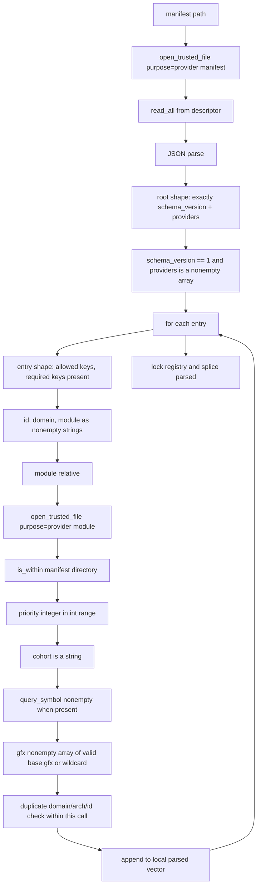

# Provider manifest specification

This is a specification, not a description of finished work. Implementation status, source
citations, test inventories, and the evidence behind every claim live in
[ledger/manifest.md](ledger/manifest.md). Example documents live in
[manifest-examples.md](manifest-examples.md).

The manifest format is project policy. Nothing in ELF, in the dynamic loader, or in any platform
packaging standard defines it. JSON, the file name, the key names, the `gfx` vocabulary, the
priority tie-break, and the trusted-path rules are decisions this project made and can change.
Only the things the manifest points at - a shared object, an exported symbol name, a version node -
are constrained by ELF, and those rules belong to [Provider module](provider-module.md).

## 1. Scope

This document specifies where a provider manifest lives and what it is called; the JSON document a
broker MUST accept and the documents it MUST reject; the meaning of every field; the filesystem
trust applied before a byte is read; the order in which validation runs and what a partially valid
document does to registry state; the diagnostics a rejection MUST produce; and how a packaged
manifest is checked.

## 2. Non-goals

- The provider protocol, dispatch tables, status taxonomy, and ABI negotiation. See
  [Provider protocol](provider-protocol.md).
- What a provider module exports, its version node, its visibility rules. See
  [Provider module](provider-module.md).
- Candidate ordering beyond the manifest-supplied inputs, cohort selection, lease lifetime. See
  [Broker](broker.md) and [Cohort](cohort.md).
- How a facade obtains a registry or a device key. See [Facade](facade.md).
- Non-Linux trust policy; section 12 states what is compiled out and TBD-5 keeps it open.

## 3. Terminology

Terms are used as defined in [../draft-plan-reboot.md](../draft-plan-reboot.md). Local to this
document:

- **Manifest** - distribution-private metadata describing provider candidates to the broker. A
  manifest is a file; it is not the provider and not the module.
- **Entry** - one object in the `providers` array. One entry with N architectures expands to N
  registry entries.
- **Manifest directory** - the parent directory of the canonicalized manifest path. All module
  paths resolve against it and MUST stay inside it.
- **Trusted path** - a path whose every component passes the owner and mode checks of section 12.

## 4. File name

- A manifest file name MUST end in `.json`. Runtime does not enforce this; the packaging check
  discovers manifests by extension, so a manifest named otherwise is installed and silently
  skipped rather than rejected.
- A new provider family SHOULD follow the observed `<family>-<distribution>.json` pattern. This is
  convention, not an enforced rule.
- A manifest file name MUST NOT be relied on for discovery by pattern. No directory glob exists;
  see section 6.

## 5. Installation location

Every provider family installs its module and its manifest into
`${CMAKE_INSTALL_LIBDIR}/rocm/interfaces/providers` under CPack component `providers`.

- A manifest and every module it names MUST install into the same directory. Section 8 forbids a
  module path from leaving the manifest directory, and the package-artifact check fails a package
  in which a named module is absent from the manifest's directory.
- Because module and manifest are co-located, `module` SHOULD be a bare file name. Multi-segment
  relative paths are legal (section 8) but a shipped manifest has no reason to need one.
- A manifest MUST NOT be installed into a directory that is group- or other-writable, or owned by
  an untrusted uid. Section 12 rejects it at load time, which turns a packaging mistake into a
  runtime failure rather than a silent hijack.

## 6. Discovery

Discovery is single-file, per facade. There is no directory scan and no `manifest.d` merge.

- Each facade DSO MUST be compiled with one default relative manifest path and MUST resolve it
  against the directory of the facade DSO itself, not against a configured prefix.
- A default relative manifest path that is empty or absolute, or a facade whose own module path
  cannot be determined, MUST resolve to no manifest rather than to a fallback location.
- An installation MAY override the manifest for one domain by a per-facade environment variable.
- An installation MAY bypass the manifest entirely with a per-facade direct-module override, which
  is consulted before the manifest. Whether direct-module overrides are a supported deployment
  surface or a developer seam is unsettled; see the ledger.
- Registry entries are append-only: there is no unload, remove, or replace. Loading the same
  manifest twice duplicates its entries.

Two vendors cannot both ship providers for one domain and expect both to be discovered, because
each facade reads exactly one file. Multi-vendor discovery is TBD-1.

The broker's use of the resolved path is specified in [Broker](broker.md).

## 7. Document shape, schema version, and fields

The root value MUST be a JSON object with exactly two keys, both required:

| Key | Type | Rule |
| --- | --- | --- |
| `schema_version` | integer | MUST be the integer `1`. A non-integer, or any other integer, MUST be rejected. |
| `providers` | array | MUST be a nonempty array of provider entries. |

Any other root key MUST be rejected. The unknown-key check MUST run before the missing-key check,
so a document that both carries a new key and omits a required one reports the unknown key.

A producer MUST emit `schema_version` `1` and a consumer MUST reject anything else. What a future
runtime does with version 2 is TBD-2.

Each element of `providers` MUST be a JSON object. Exactly seven keys are allowed; three are
required. Any other key in an entry MUST be rejected.

| Key | Required | Type | Default | Rule |
| --- | --- | --- | --- | --- |
| `id` | yes | string | - | MUST be nonempty. The provider identity. |
| `domain` | yes | string | - | MUST be nonempty and MUST be one of the six names in section 7.3. |
| `module` | yes | string | - | MUST be nonempty and MUST satisfy section 8. |
| `cohort` | no | string | `""` | MAY be empty. Any string; no format rule. |
| `query_symbol` | no | string | `rocm_interfaces_provider_query_v1` | MUST be nonempty when present. See section 11. |
| `priority` | no | integer | `0` | MUST be an integer within the range of C++ `int`. See section 10. |
| `gfx` | no | array of string | `["*"]` | MUST be a nonempty array of strings, each satisfying section 9. |

A minimal conforming document, with every optional field defaulted:

```json
{
  "schema_version": 1,
  "providers": [
    {
      "id": "system-rocrand",
      "domain": "rand",
      "module": "librocrand-provider-system.so"
    }
  ]
}
```

Further valid shapes, and every rejected document with its diagnostic, are in
[manifest-examples.md](manifest-examples.md).

### 7.1 Provider identity

- An `id` MUST be nonempty.
- An `id` MUST match the `provider_id` string the module writes into its query response. What the
  broker does with a mismatch is specified in [Broker](broker.md).
- An `id` SHOULD be stable across releases of the same provider, because it is what a manifest
  author, a diagnostic, and a support ticket all name.
- The same `id` MAY appear in several entries, in several domains, and in several manifests.
- Within one manifest load, the tuple (domain, architecture, id) MUST be unique; a repeat MUST be
  rejected. The duplicate set is per load, so the same tuple loaded from two different manifests is
  not detected. Whether that is legal is TBD-3.
- A new provider SHOULD follow the observed `<distribution>-<implementation>` convention. Nothing
  enforces it.

### 7.2 Cohort naming

`cohort` is an optional entry key whose value MUST be a JSON string; this document specifies only
that field's type and optionality. Cohort identity, what it asserts, how it is matched, how it is
named, and what an absent or empty value means are specified in [Cohort](cohort.md); this document
states no rules of its own about them. TBD-6 and TBD-7 are the two missing halves.

### 7.3 Domains

`domain` MUST be one of exactly these six strings: `blas`, `solver`, `rand`, `blaslt`,
`rocblas_bridge`, `blas_v2`. Any other string MUST be rejected.

- `blas_v2` is a separate domain from `blas`, not a newer minor of it; the two contracts are kept
  apart so they can be compared without pretending ABI continuity.
- One module MAY be named by entries in several domains.
- Adding a domain string is a schema change even though `schema_version` would not move: the
  vocabulary is closed by the parser, so an older runtime rejects a manifest naming a new domain.
  Producers MUST NOT ship a domain name a targeted runtime does not know.

## 8. Module path rules

`module` names the provider module relative to the manifest directory. Requirements, applied in
this order:

1. The value MUST be a nonempty string.
2. The path MUST be relative. An absolute path MUST be rejected.
3. `manifest_directory / module` MUST pass the full trusted-path validation of section 12 with
   purpose `provider module`. This opens the file, so the module MUST already exist and be readable
   when the manifest is loaded: a manifest naming a module that ships later fails at load, not at
   first use.
4. The canonicalized module path MUST be inside the canonicalized manifest directory. A path that
   resolves outside it MUST be rejected.

Trust is validated before containment, so a module that is both outside the directory and untrusted
reports the trust failure.

- A multi-segment relative path is permitted.
- A `module` value MUST NOT contain `..` in a form that escapes; a `..` that stays inside passes
  containment but SHOULD NOT be written.
- A shipped manifest SHOULD use a bare file name, matching section 5.
- A manifest load MUST NOT inspect the module's exported symbols. Export policing is build-time;
  see [Provider module](provider-module.md).

## 9. Device and GPU architecture representation

`gfx` states which devices an entry serves. It is an array so one entry can cover several
architectures; each element expands to its own registry entry.

A `gfx` element MUST be either the exact wildcard `"*"` or a canonical base architecture name. A
canonical base architecture name MUST start with `gfx`, MUST have every following character in
`[0-9a-f]`, MUST be at least 6 characters long, and MUST be short enough that the name plus its NUL
fits the fixed architecture-name capacity of the device key.

Therefore `"gfx90a"`, `"gfx942"`, `"gfx1201"` and `"*"` are valid, and each of the following MUST be
rejected: an uppercase name, a HIP target ID carrying a feature suffix such as `"gfx90a:xnack+"`, a
JSON number, and the reserved request-only name `"gfx000"`. `gfx000` is legal only in a device
request, never in a manifest or any other registration.

Matching compares the configured wildcard or base name against the requested base name only.
Consequently **the manifest cannot express feature bits**: there is no way to say "this provider
serves gfx90a only with xnack enabled". A provider whose validity depends on xnack or sramecc MUST
reject the device itself, from its query or its context creation. Whether feature constraints
belong in the manifest at all is TBD-11.

Kernel-bearing providers MUST NOT advertise `"*"`. A kernel-bearing provider's manifest MUST be
generated from the compile targets, MUST fail configuration on an empty, wildcard, `all`, or
`native` target list, MUST reject any target not matching the HIP target-ID grammar, and MUST strip
the target-ID suffix and deduplicate before emitting `gfx`. This rule is enforced today for one
provider only; making it mechanical for every kernel-bearing family is TBD-13.

## 10. Priority

`priority` is a signed integer, default 0, higher wins - and it is strictly subordinate to
architecture exactness. The complete candidate ordering is specified in [Broker](broker.md).

- Priority exists for local overrides. A manifest author MUST NOT use priority to express
  architecture preference, because exactness overrides it.

## 11. Query symbol

The default query symbol is `rocm_interfaces_provider_query_v1`. Its signature and contract belong
to [Provider protocol](provider-protocol.md).

An entry MAY override the name with `query_symbol`. How the broker resolves it, and what an
unresolvable name does to the candidate, is specified in [Broker](broker.md).

- A manifest entry SHOULD omit `query_symbol`.
- A manifest entry MUST NOT set `query_symbol` to a name the module does not export. Every provider
  module in this project exports exactly the default symbol and nothing else, so in practice any
  override fails to resolve.
- `query_symbol` MUST NOT be confused with the private rocBLAS backend query symbol, which is never
  named by a manifest.
- Whether `query_symbol` is a supported field at all is TBD-4.

## 12. Trust and permissions

The threat is a writable path component. If any directory on the way to a manifest, or to a module,
can be modified by an untrusted user, that user chooses which code the process loads into itself.
Manifest parsing is therefore preceded by a full path validation, and the validated descriptor -
not the path - is what gets read.

Opening a trusted file, for purpose `provider manifest` or `provider module`, MUST:

1. make the path absolute and lexically normal, then canonicalize it;
2. validate the whole component chain of the absolute path, and, when the canonical path differs,
   the canonical chain as well;
3. open the canonical path read-only, close-on-exec, and without following a final symlink;
4. re-verify identity on the descriptor (section 14).

Component rules:

| Check | Rule |
| --- | --- |
| Owner | Every component's owning uid MUST be the effective uid or the owner of `/` |
| Final component type | MUST be a regular file |
| Final component mode | MUST NOT be group- or other-writable |
| Non-final component type | MUST be a directory |
| Non-final component mode | MUST NOT be group- or other-writable, unless it is a root-owned sticky directory |
| Root path | The path MUST NOT name the filesystem root |

A diagnostic MUST name which purpose failed, so a reader can tell a manifest failure from a module
failure.

Non-Linux platforms MUST be treated as unspecified, not as permissive-by-design. Provider discovery
is not enabled off Linux because an equivalent native trust and signing policy has not been defined
and qualified. Defining a Windows owner-SID/ACL equivalent is TBD-5.

There is no signature check on a manifest or a module. Trust is filesystem-ownership trust only.

## 13. Symlink handling

A symlink MAY name a module inside the manifest directory and MUST be rejected when it resolves
outside it, including through an intermediate directory symlink, since both the literal and the
canonical chains are validated. A symlink component's own mode bits MUST NOT be treated as the
trust decision; the resolved canonical chain carries the checks and the descriptor is opened
without following a final link.

A packaged manifest SHOULD name a real file, not a symlink.

## 14. Atomic parsing and TOCTOU

Three properties are required.

**Document atomicity.** A manifest is all-or-nothing. Entries MUST be accumulated in loader-local
state and MUST be published into shared registry state only after the last entry validates. A
rejected manifest MUST NOT leave any entry behind, even when its first entries were well formed.

**Byte-source atomicity.** The bytes parsed MUST come from the descriptor that was validated, not
from a reopened path, so that a path substituted between validation and parse cannot be observed.

**Identity recheck.** After opening, the implementation MUST re-stat the descriptor, re-run the
chain validation, and re-stat the path, and MUST fail when device and inode do not match. Because
`dlopen` takes a path and cannot take a descriptor, the same recheck MUST be repeated immediately
after the module is loaded, and the module MUST be unloaded when it fails.

## 15. Diagnostics

Two diagnostic surfaces exist and they are not interchangeable.

**Parse and trust failures are exceptions.** Schema rules throw `std::invalid_argument`. The path
layer throws both `std::invalid_argument` and `std::runtime_error`, and which one surfaces depends
on the object and the failure. A conforming consumer MUST therefore catch `std::exception`, not
`std::invalid_argument`, around a manifest load.

**Selection rejections are traces**, not exceptions. Their routing and containment are specified
in [Broker](broker.md).

Rules:

- A manifest error MUST fail the load. It MUST NOT be downgraded to a warning and MUST NOT cause a
  fallback to some other provider.
- A diagnostic MUST identify the file. Manifest-level messages MUST carry the manifest path.
- A rejection message MUST name the offending key, value, or path.
- A JSON syntax error MUST be reported as a manifest parse failure naming the path.
- Message text MUST NOT be assumed stable. Whether any subset is contractual is TBD-14.

## 16. Validation procedure

A conforming implementation MUST perform the following in this order. Steps are numbered so a
negative test can name the step it targets.



1. Validate and open the manifest path as a trusted file (section 12). Failure: throw.
2. Read the bytes from the validated descriptor (section 14). Failure: throw.
3. Parse JSON. A syntax error MUST produce a diagnostic naming the path.
4. Enforce the root object shape: unknown key first, then missing key (section 7).
5. Enforce `schema_version == 1` and a nonempty `providers` array.
6. For each entry, enforce the entry object shape.
7. Read `id`, `domain`, `module` as nonempty strings; map `domain` through the closed vocabulary.
8. Reject an absolute `module`; validate the joined path as a trusted file; reject a canonical path
   outside the manifest directory.
9. Read `priority` (integer, int range), `cohort` (string), `query_symbol` (nonempty string when
   present).
10. Read `gfx`, defaulting to `["*"]`; require a nonempty array of strings; validate each against
    section 9 with the wildcard allowed and `gfx000` forbidden.
11. For each architecture, insert (domain, architecture, id) into a per-load duplicate set and
    reject a repeat; append one entry to the local vector.
12. Only after every entry succeeds, take the registry lock and splice the local vector in.

Steps 1 through 11 MUST NOT mutate shared registry state.

## 17. Packaging conformance

A new provider family MUST add a generated manifest, an install rule placing it beside its modules,
and either coverage under the package-artifact check or its own generated-manifest shape check
modeled on `rocm_interfaces.solver_manifest`. The package-artifact checks
(`rocm_interfaces.package_deb_artifact`, `rocm_interfaces.package_rpm_artifact`) require that each
packaged manifest parses, is nonempty, and names only modules present in the same installed
directory. A release gate MUST require those two targets to have run, not merely to have not
failed, because they self-skip when the packaging tools are absent (TBD-10).

The full check inventory and its caveats are in [ledger/manifest.md](ledger/manifest.md).

## 18. Open decisions (TBD)

Each entry blocks a contract this document cannot state. Supporting detail is in the ledger.

| Id | Question |
| --- | --- |
| TBD-1 | May several vendors ship providers for one domain into the providers directory and be discovered together? |
| TBD-2 | Is `schema_version` a named constant, and what does a future runtime do with version 2? |
| TBD-3 | Is the same (domain, architecture, id) legal across two manifests? |
| TBD-4 | Is `query_symbol` supported, or vestigial? |
| TBD-5 | Is the trusted-path requirement Linux-only by design, or is a Windows owner-SID/ACL equivalent required? |
| TBD-6 | Should a manifest declare capability profiles, and under what bit-allocation registry? |
| TBD-7 | Should the manifest carry a build identity, and what does a mismatch do? |
| TBD-8 | Is the Windows branch of loader-relative default manifest resolution a requirement, and what covers it? |
| TBD-9 | Are the recording providers a delivery surface, and therefore subject to sections 4, 5, and 17? |
| TBD-10 | Must a release gate assert that the package-artifact targets actually ran, rather than only that they did not fail? |
| TBD-11 | Should a manifest be able to constrain device features (xnack, sramecc)? |
| TBD-12 | Which manifest rules must a release gate hold, given that eight of them are implemented but covered by no named check? |
| TBD-13 | How is "kernel-bearing providers MUST NOT advertise a wildcard" made mechanical beyond the one provider that generates its `gfx` from compile targets? |
| TBD-14 | Are the rejection message strings part of the contract, and which ones MAY a producer depend on? |

## 19. Related specifications

- [Architecture component model](architecture-component-model.md) - where the manifest sits and who
  may read it.
- [Broker](broker.md) - candidate ordering, queries, ABI checks, leases.
- [Cohort](cohort.md) - what a cohort must guarantee; the `cohort` string is one input.
- [Provider](provider.md) - the provider as a whole facility.
- [Provider module](provider-module.md) - the binary a `module` value names.
- [Provider protocol](provider-protocol.md) - the query symbol's contract and the status taxonomy.
- [Provider adapter](provider-adapter.md) - how a provider implements the query.
- [Provider binding](provider-binding.md) - the object a facade retains after selection.
- [Facade](facade.md) - the public library that triggers manifest loading.
- [Concepts and definitions](../draft-plan-reboot.md) - authoritative terminology.
- [manifest-examples.md](manifest-examples.md) - valid and rejected documents.
- [ledger/manifest.md](ledger/manifest.md) - non-normative evidence, status, and citations.
