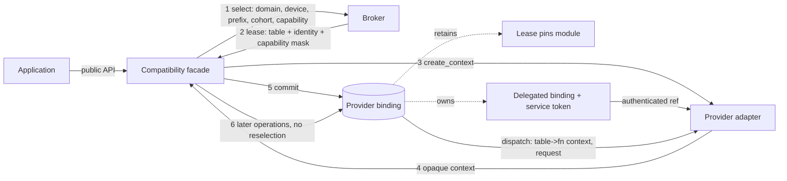

# Provider binding specification

Status: specification, not a description of shipped behavior. The concept is adopted by the
parent concepts document ([../draft-plan-reboot.md](../draft-plan-reboot.md), Provider binding).
Implementation status, source citations, test inventories, and prototype evidence for every rule
below live in [ledger/provider-binding.md](ledger/provider-binding.md); that ledger is
non-normative. Where a rule has no enforcement today, the ledger says so.

## Scope

This specification owns the provider binding object: its required state, its token and handle
representation, its validity and lifetime, its invalidation, and its thread-safety contract. It
covers creation and creation failure, ownership and sharing, destruction order, authentication of
objects handed across a provider-to-provider edge, rejection of stale and foreign objects, and
the prohibition on rebinding.

## Non-goals

Each topic below is specified elsewhere; this document states no rules of its own about it.

- Protocol records, dispatch-table shape, status taxonomy, ABI negotiation arithmetic:
  [provider-protocol.md](provider-protocol.md).
- Discovery, manifest parsing, candidate ordering, and the compatibility-check sequence that
  produces a lease: [broker.md](broker.md) and [manifest.md](manifest.md).
- Cohort identity, membership, and what a cohort may assert: [cohort.md](cohort.md).
- Public API, ABI, and the public error vocabulary: [facade.md](facade.md).
- Module file identity, exported symbols, and dlopen/dlclose rules:
  [provider-module.md](provider-module.md).
- Provider-side translation of protocol records: [provider-adapter.md](provider-adapter.md).
- Numerical or behavioral equivalence between providers. A binding is a wiring contract only.

## Terminology

Terms defined by the parent concepts document are used unchanged. Terms local to this document:

| Term | Meaning here |
| --- | --- |
| Binding holder | The object that owns a provider binding for the binding's whole lifetime. |
| Lease | The broker-issued object that names the selected provider, carries the validated table pointer and capability mask, and keeps the module resident. Issued per [broker.md](broker.md). |
| Primary binding | A binding a facade establishes for its own public context. |
| Delegated binding | A binding established on behalf of one provider so that provider can call a second provider through an authenticated reference. |
| Service token | The opaque, broker-minted, process-local value that authenticates a delegated binding at the receiving provider's call sites. |
| Binding epoch | The interval from successful binding creation to binding destruction. Every object minted inside an epoch is invalid outside it. |

## Nature of the object

A provider binding is a conceptual object with a required state set and a required lifetime
discipline. It is deliberately not specified as one concrete C++ interface.

- A binding MUST exist as an identifiable, single-owner aggregate holding every element of the
  required state set below.
- A binding MAY be realized as a distinct class, as members embedded in the binding holder, or as
  a private struct in the facade's translation unit. Conformance is judged by state, lifetime,
  and rejection behavior, not by type name.
- A binding MUST NOT be reconstructible from the public object alone. Given only a public handle,
  no code outside the binding holder may re-derive the table pointer, the provider context, or
  the lease.

## Required binding state

| Element | Requirement | Why |
| --- | --- | --- |
| Lease | MUST retain a strong reference to the broker-issued lease for the whole binding epoch. | The lease keeps the provider module resident. Dropping it while the table pointer is in use leaves a dangling code pointer. |
| Dispatch table pointer | MUST retain the validated, `const`-qualified pointer to the provider's operation table, and MUST NOT re-derive it per call. | Re-derivation is a second selection, which is prohibited. |
| Provider context | MUST retain the opaque `void*` the provider returned from its context-creation callback, and MUST pass exactly that value as the first argument to every table callback. | The provider's private state is reachable only through this value. |
| Device key | MUST retain the `rocm_interfaces_device_key` the binding was created against. | A later device change MUST NOT silently re-target the binding. |
| Cohort identity | MUST retain enough cohort identity to reject a cross-cohort object, either as the lease's cohort string or as a derived opaque key. | A cohort is the only current statement that two providers were qualified together. |
| Capability set | MUST have verified, at creation, every capability bit the binding holder will rely on. It MAY retain the mask. | A capability check after first use is a check the caller has already bet against. |
| Registry reference | SHOULD retain a strong reference to the broker registry that issued the lease. | Keeps the broker's host-services record alive for the binding's lifetime. |
| Delegated bindings | MUST own, for the whole epoch, every delegated binding the provider context was handed at creation. | The receiving provider holds a reference into that binding; releasing it first is a use-after-free. |
| Mutable public state | SHOULD be held in a separately addressable sub-object so a keep-alive can outlive a concurrent teardown. | See Thread safety. |

## Creation

The order of these four steps is normative.

1. Select. The binding holder MUST obtain a lease from the broker before asking any provider to
   create a context.
2. Verify the table. After the lease is returned and before any provider context exists, the
   holder MUST null-check every callback it will ever invoke and MUST verify every capability bit
   it will rely on. A null mandatory callback after successful negotiation is a fail-closed
   configuration error, never a fallback trigger.
3. Create the provider context. Only then may the holder call the provider's context-creation
   callback.
4. Commit. The lease, table, context, device, and any delegated binding MUST be installed into
   the binding holder as one step. A partially populated binding MUST NOT be observable.

### Cohort-complete creation

When a binding needs a dependent provider in a second domain, the holder MUST resolve the
complete set before committing any of it.

- The holder MUST propagate the cohort identity from the primary lease into the dependent
  selection.
- If any member of the required set fails to select, fails its callback completeness check, or
  fails its capability check, the holder MUST reject the whole set and MUST NOT return a
  partially bound public object.
- The holder MUST NOT commit one domain before its service dependencies are known.

### Creation failure

- Creation MUST be failure-atomic. On any failure the holder MUST destroy every provider context
  it already created, MUST release every lease it already took, and MUST leave no registration
  reachable by any other code path.
- A failed creation MUST NOT be cached. A later attempt MUST re-run selection.
- A holder MUST NOT report a creation failure by returning a public object that is only partly
  wired.
- The failure register itself - exception, domain status, or abort - is not yet chosen. See open
  decision 3.

## Ownership and sharing

- A provider binding MUST have exactly one owner: its binding holder.
- A binding MUST NOT be copied. If realized as a class it MUST delete copy construction and copy
  assignment; it SHOULD also delete move operations unless the holder needs to relocate it before
  the epoch begins.
- Two public objects MUST NOT share one provider context. Sharing a provider context makes the
  provider's private state visible across two independent public lifetimes.
- Two bindings MAY share a lease, and therefore MAY share a resident module and a dispatch table
  pointer. The lease is shared, immutable, and reference-counted; the provider context is not.
- A binding MAY be observed - not owned - by a shorter-lived call state, provided the observer
  holds a keep-alive strong reference for the duration of the call.
- A delegated binding MUST be owned by exactly one primary binding, and the reference the
  receiving provider holds MUST be a token, never a raw pointer to broker or facade state.

## Module residency

Module load, unload, and loader serialization are specified in
[provider-module.md](provider-module.md). The binding-side obligations are:

- A binding MUST keep its provider module resident for its whole epoch, and MUST do so by
  retaining the lease rather than by any separate `dlopen`.
- A binding holder MUST NOT retain a dispatch table pointer past the lease that produced it.
- A binding MUST NOT pin a module by any means that outlives the lease it holds; residency is
  lease-scoped per [provider-module.md](provider-module.md), so releasing the last binding
  releases the module. Whether a process-lifetime pin on top of the lease is an accepted
  retention policy is open decision 6.

## Thread safety

- A binding's immutable elements - lease, table pointer, provider context value, device key -
  MUST be established before the binding becomes reachable by any other thread and MUST NOT be
  mutated afterwards. Concurrent reads of those elements are then safe without a lock.
- A binding holder that exposes mutable public state MUST serialize that state against dispatch
  through the binding, so a provider never observes a torn mixture of concurrent setter updates.
- A call in flight through a binding MUST NOT be able to observe its own state freed by a
  concurrent teardown. The holder MUST take a keep-alive strong reference to any separately
  allocated sub-object for the duration of the call, and MUST release the lock before releasing
  that keep-alive.
- A binding MUST NOT be destroyed while a call through it is in flight. Enforcing that is the
  binding holder's obligation, not the provider's.
- A holder that does not serialize dispatch against its own setters MUST document itself as
  thread-compatible-but-not-thread-safe, and the facade MUST then require the caller to serialize
  per public object.

## Destruction

Destruction order is normative because a delegated binding is reachable from the provider context
that holds its reference.

1. The holder MUST first make the binding unreachable for new calls.
2. The holder MUST destroy the receiving provider context before releasing the delegated binding
   that provider was handed.
3. A delegated binding MUST revoke its service token before it releases the delegated provider
   context, so no new call can acquire the state.
4. A call that already acquired the delegated state MUST keep it alive until it returns.
5. The delegated provider context MUST be destroyed before its lease is released. The lease MUST
   be the last resource the binding releases.
6. Destruction MUST NOT throw. A provider destroy callback that throws MUST be contained.
7. Destruction MUST release provider-side state regardless of what status the provider's destroy
   callback returned. A non-success status MUST NOT leave the binding or its holder allocated.

## Token validation for delegated bindings

A receiving provider is separately compiled and may be misbuilt, misused, or recombined. A raw
pointer gives it nothing to check against, so the reference it is handed MUST be authenticated.

A conforming delegated binding MUST satisfy all of the following.

- The reference passed to the receiving provider MUST carry a broker-minted opaque token, not a
  provider-private context pointer.
- Token values MUST NOT be reused after revocation. An implementation MUST either retain the
  token object for the process lifetime or carry a monotonically increasing generation that a
  later token cannot forge.
- Every entry through the reference MUST validate, before touching any state: a non-null
  reference and non-null token; that the reference's function table is this broker's own
  process-local table; that the token is present in the live token map; that the profile and
  capability values in the reference equal the ones the binding was created with; and that the
  cohort key words in the reference equal the binding's own.
- Every extensible record crossing the edge MUST have its ABI header validated on entry.
- Any validation failure MUST return a deterministic boundary status - the transport-level
  invalid-object status defined in [provider-protocol.md](provider-protocol.md) plus the
  domain-level invalid-handle status - and MUST NOT execute any work.
- Reentry from the receiving provider back into the same service edge on the same thread MUST be
  rejected. The service edge is a directed edge, not a cycle.
- Provider replies MUST be validated, not trusted: origin and effect enumerations MUST be in
  range, reserved fields MUST be zero, and the invariant that success implies a returned status
  and a submitted effect MUST hold. A reply violating the invariant MUST be reset and reported as
  a provider failure.

Whether this full list binds every delegated edge or only the rocBLAS-to-hipBLASLt edge is open
decision 16.

## Stale and foreign object rejection

A binding epoch bounds the validity of every object minted inside it.

- An object minted by a binding - a delegated service reference, a service token, an algorithm
  token - MUST be rejected after that binding is destroyed.
- Rejection MUST be deterministic and MUST report no execution effect. A stale call MUST NOT
  submit work and MUST NOT modify caller or workspace storage.
- A later binding MUST NOT revive an earlier binding's object. Creating a replacement binding
  MUST NOT make a stale reference valid again.
- An object minted by a foreign binding, or reassembled from pieces of two bindings, MUST be
  rejected.
- An algorithm or solution token MUST be bound to the epoch that minted it, and SHOULD be bound
  to the problem shape it was produced for.

Whether a primary binding must carry its own identity check, and whether a live-object registry
is required for every class of facade-minted object, are open decisions 1 and 2.

## Rebinding

- An established binding MUST NOT be moved to a different provider, a different provider context,
  a different lease, or a different device, for any reason, at any time.
- A change in the ambient device after a binding is established MUST NOT alter which provider that
  binding uses.
- A failure at operation time MUST NOT trigger reselection. There is no fallback provider after a
  successful negotiation.
- A binding holder MAY defer selection until first use, provided that once a binding is
  established it obeys the rule above.
- Destroying a public object and creating a new one is the only supported way to reach a different
  provider.

## Responsibilities across the binding

What the facade owes the binding is specified in [facade.md](facade.md); what the broker owes it
is specified in [broker.md](broker.md). Two obligations are stated here because they are
properties of the binding itself:

- A binding holder MUST NOT expose the lease, the table pointer, or the provider context through
  the public surface.
- The broker MUST NOT be treated as the owner of any binding. It issues leases; the facade owns
  bindings.

## Open decisions (TBD)

Each entry blocks a contract in this document. Full text with citations is in the ledger.

| # | Question | What it blocks |
| --- | --- | --- |
| TBD-1 | Is a primary-binding identity check (magic word, generation, or live-object set) required, or is null-check-only accepted? | Stating foreign-object rejection as MUST for primary bindings. |
| TBD-2 | Is live-object registry validation required of every facade-minted opaque object, or only of narrow v2 allocation objects? | Whether foreign-object rejection is a general rule or a single-path property. |
| TBD-3 | Which creation-failure register is normative: throw, domain status, or abort? | Creation failure cannot name a register. |
| TBD-4 | Is `std::abort()` on delegated-provider create failure and on delegated destroy failure adopted behavior or a placeholder? | Whether destruction step 6 is satisfied by abort or violated by it. |
| TBD-5 | Is the primary loader binding thread-safe or thread-compatible? | Which contract the Thread safety section's last bullet resolves to. |
| TBD-6 | Is process-lifetime lease pinning an accepted retention policy or an unbounded-growth defect? | The binding's module-residency obligation. |
| TBD-7 | Are never-evicting process-wide binding caches accepted? | Whether a binding may be shared across public objects at all. |
| TBD-8 | Must a destroy path release provider-side state regardless of the provider's destroy status? | Destruction step 7. |
| TBD-9 | May two runtimes defining the same external handle type be linked into one binary? | Whether a single named binding type is required. |
| TBD-10 | Must legacy passthrough bindings apply the same capability and cohort gates? | The capability-set row of required binding state. |
| TBD-11 | Are algorithm and solution tokens required to be epoch-bound and shape-bound at the protocol level, or is that a provider-local convention? | The last bullet of stale and foreign object rejection. |
| TBD-12 | Must a delegated binding's cohort key be a security boundary? | The strength claim for cross-cohort rejection. |
| TBD-13 | Is unbounded growth of never-freed token objects accepted as the cost of address-reuse safety? | Whether token non-reuse may be satisfied by generation matching instead of retention. |
| TBD-14 | Is deferred first-use binding an approved binding shape or an inconsistency to reconcile? | Whether deferred selection stays a MAY. |
| TBD-15 | Is a behavior-preserving fallback after a delegated call that reported a possible execution effect accepted? | The route-level neighbor of the no-reselection rule. |
| TBD-16 | Is the full delegated-edge validation list required of every delegated edge? | Whether token validation is a general rule or a single-edge property. |

## Cross-links

- Parent concepts document: [../draft-plan-reboot.md](../draft-plan-reboot.md)
- [Architecture component model](architecture-component-model.md) - where the binding sits.
- [Facade](facade.md) - owns the binding holder and the public side.
- [Broker](broker.md) - issues the lease this binding retains.
- [Provider](provider.md) - what is bound.
- [Provider protocol](provider-protocol.md) - records, tables, and the status taxonomy.
- [Provider adapter](provider-adapter.md) - provider-side context and token discipline.
- [Provider module](provider-module.md) - the artifact the lease keeps resident.
- [Provider manifest](manifest.md) - the metadata that produced the candidate.
- [Cohort](cohort.md) - what the retained cohort identity may assert.
- [Evidence ledger](ledger/provider-binding.md) - non-normative status, citations, and tests.
