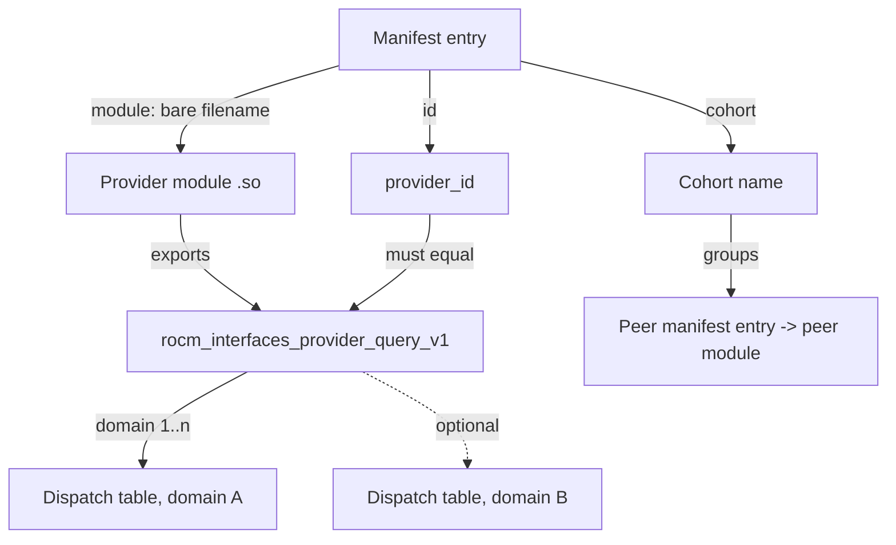

# Provider module specification

Normative. Requirements are stated with MUST / MUST NOT / SHOULD / MAY. Implementation status,
source citations, prototype evidence, test inventories, and rationale live in
[ledger/provider-module.md](ledger/provider-module.md); the obligations below hold whether or
not a check enforces them today.

## Scope

This document specifies the provider module: the loadable binary artifact that carries a
provider's protocol entry point and adapter code. It owns

- artifact form, filename, and provider identity as published by the module,
- installation location and colocation with a manifest,
- query-symbol naming and resolution,
- the allowed export set, symbol visibility, and ELF version nodes,
- module-to-provider, module-to-domain, and module-to-cohort multiplicity,
- link-time and load-time dependencies,
- load flags, residency, and unload,
- relocation and search-path behavior,
- platform rules and filesystem trust of the module file,
- the binary inspections a conforming build MUST perform.

## Non-goals

- Query request, response, dispatch-table shape, and status taxonomy. See
  [Provider protocol](provider-protocol.md).
- Manifest schema, keys, parsing, and trust of the manifest document. See
  [Manifest](manifest.md).
- Candidate ordering, capability gating, selection. See [Broker](broker.md).
- Cohort membership and consistency rules. See [Cohort](cohort.md).
- Adapter internals: status translation, ownership, threading. See
  [Provider adapter](provider-adapter.md).
- Lease semantics. See [Provider binding](provider-binding.md).
- Public facade DSOs. They are not provider modules. See [Facade](facade.md).

## Terminology

Terms are used as defined in [../draft-plan-reboot.md](../draft-plan-reboot.md). Local to this
document:

- **Provider module**: a loadable binary artifact containing some or all of a provider's
  executable components, including its protocol entry point and adapter code. It is a
  packaging and loading unit. A provider is logical; a module is physical.
- A rule is **conventional** when ELF, the dynamic loader, or the toolchain supplies the
  mechanism (visibility, version nodes, `DT_NEEDED`, `DT_RUNPATH`, `RTLD_LOCAL`, `$ORIGIN`).
- A rule is **project policy** when this project must enforce it itself (the one-export
  allowlist, the node name, the install directory, the trusted-path checks, the
  no-canonical-dependency rule).

## Artifact form and filename

A provider module MUST be a shared object built as a CMake `MODULE` library, not a versioned
`SHARED` library.

A provider module MUST NOT carry a SONAME or a symlink chain. It is opened by an exact
pathname derived from its manifest entry, never by SONAME resolution, so `SOVERSION` would be
inert metadata implying a linkable identity that does not exist. This is project policy; ELF
would accept a SONAME here.

A module SHOULD be named `lib<implementation>-provider-<variant>.so`. Nothing in the runtime
derives meaning from a basename: the broker consumes the manifest `module` string verbatim.
Packaging MUST NOT rely on a basename convention for behavior.

Modules built only as in-tree test fixtures MUST NOT be installed and MUST NOT ship a
manifest. They MUST otherwise meet the export and visibility rules below, so that a fixture
cannot pass a check a delivered module would fail.

## Provider identity

A module does not name itself in its filename for selection purposes. Identity is a string
that appears in two places and MUST agree: the manifest entry's `id`, and the `provider_id`
field the module writes into its query response.

A module MUST publish a stable, nonempty `provider_id`. Its packaging MUST declare the same
string. The broker rejects a candidate whose `provider_id` is null, empty, or unequal to the
identity the entry declares.

A module MUST write a nonempty `build_id` in the query response. No consumer may today treat
`build_id` as a selection or compatibility constraint; a build-identity constraint requires a
manifest-side key that does not exist (TBD-1).

Uniqueness of an identity across manifests is not defined (TBD-3).

## Installation location and colocation

A provider module MUST install to `${CMAKE_INSTALL_LIBDIR}/rocm/interfaces/providers` under
CMake component `providers`.

A module MUST install into the same directory as the manifest that names it, and MUST be
reachable from that manifest without leaving the directory. How a manifest `module` value is
spelled, resolved, and rejected is specified in [Manifest](manifest.md).

Packaging MUST preserve closure in both directions: every module named by a packaged manifest
MUST be present in the package, and every packaged module in the provider directory MUST be
referenced by some manifest.

Discovery is single-file: a facade names one manifest path, and nothing globs the provider
directory. Installing a module plus manifest therefore does NOT by itself make the module
discoverable. Multi-manifest and multi-vendor co-delivery into one directory is not defined
(TBD-4). Manifest discovery is specified in [Manifest](manifest.md) and [Broker](broker.md).

## Query symbol

A provider module MUST export exactly one function. Its default name is
`rocm_interfaces_provider_query_v1`, spelled by the macro
`ROCM_INTERFACES_PROVIDER_QUERY_SYMBOL`, with the type

```c
rocm_interfaces_status (ROCM_INTERFACES_CALL* rocm_interfaces_provider_query_fn)(
    const rocm_interfaces_provider_request*, rocm_interfaces_provider_response*);
```

The definition MUST be `extern "C"`, MUST carry `ROCM_INTERFACES_EXPORT`, and MUST be
`noexcept`. The `noexcept` obligation is the same one stated in
[provider-protocol.md](provider-protocol.md) and [provider-adapter.md](provider-adapter.md);
the typedef is not `noexcept`-qualified, so the compiler does not impose it.

The `v1` suffix names the bootstrap generation; it is not a version node. A second,
incompatible bootstrap generation SHOULD take a new symbol name rather than reinterpret this
one. That rule is not adopted (TBD-20).

Resolution is by bare name through `dlsym` on the module handle; the broker does not request a
version node, and a null result MUST be a load-time rejection of the candidate.

A manifest entry MAY carry an optional `query_symbol` override, but a module built with the
project's version script cannot honour it, because the script makes every other name local. A
module MUST NOT rely on `query_symbol` (TBD-2).

A provider module MUST NOT export `rocblas_internal_backend_query_v1`. That is a different
contract, exported by canonical rocBLAS.

## Allowed exports, visibility, and version nodes

Threat: a module that leaks a global symbol becomes an interposition surface and an implicit
ABI that nothing versions. Three mechanisms stack against it.

**Compiler visibility (conventional).** Every provider target MUST set
`C_VISIBILITY_PRESET hidden`, `CXX_VISIBILITY_PRESET hidden`, and
`VISIBILITY_INLINES_HIDDEN ON`, so only `ROCM_INTERFACES_EXPORT`-annotated definitions are
export candidates.

**Version script (conventional mechanism, project-chosen contents).** Every provider target
MUST link with the project version script `providers/provider.map`:

```
ROCM_INTERFACES_PROVIDER_1 {
  global:
    rocm_interfaces_provider_query_v1;
  local:
    *;
};
```

The node name `ROCM_INTERFACES_PROVIDER_1` is project policy. The `local: *;` catch-all is what
makes the one-export rule structural: a new global added to an adapter is hidden by default
rather than leaked. A provider target SHOULD list the map in `LINK_DEPENDS` so that editing the
map relinks the module.

**Export audit (project policy).** The built module MUST export exactly the single name
`rocm_interfaces_provider_query_v1`, and that name MUST carry the version node
`ROCM_INTERFACES_PROVIDER_1`. Absence of a node and a wrong node MUST be distinguishable
failures. The audit MUST NOT be skippable by omission: an undefined provider count, and a zero
count without an explicit no-providers opt-in, MUST both be hard configure errors. The audited
target list MUST be cross-checked against an independently collected set of every `MODULE`
library in the project, so that a module added in a new subdirectory cannot escape inspection.
Test-fixture modules MUST be in the audited set.

## Module relationships

**Module to domain.** A single query function receives `request->domain` and MUST answer
`NOT_SUPPORTED` for a domain it does not implement. A module MAY answer several domains. A
module that answers more than one domain MUST answer each with a table whose ABI header and
size are correct for that domain independently.

**Module to provider.** One provider MAY span several modules. A provider whose facility spans
modules MUST express that through cohort membership, not through inter-module linkage: modules
MUST NOT link each other.

**Module to cohort.** Cohort is a manifest assertion, not a property the module proves. A
module MUST NOT assume anything about a peer beyond what the broker validated. Cohort rules are
specified in [Cohort](cohort.md).



## Dependencies

**Link-time.** A provider module MUST NOT take a direct link dependency on a canonical math
library: no `DT_NEEDED` naming `librocblas`, `librocrand`, `libhipblas`, `libhipblaslt`,
`libhipsolver`, `librocsolver`, or `libhiprand`. The equivalent configure-time link properties
MUST also be rejected.

A provider module MAY link header-only interface targets of the library it adapts, the
project's protocol interface targets, the platform dynamic-loading library, the project's
dynamic-loader lock DSO, and a device-code runtime when the module implements its own kernels.

**Load-time.** A provider module SHOULD reach its canonical implementation by `dlopen` at first
successful query rather than by linkage, performed once under a one-time guard, resolving an
environment override over a compile-time SONAME default. A module that performs its own
`dlopen` MUST serialize it through the project's process-wide dynamic-loader lock (TBD-7).

**Backend failure.** A module MUST fail its query rather than abort or partially publish when
its backend cannot be loaded or is incompatible. Because the query is `noexcept`, a module
whose query can throw MUST convert every escaping exception into a protocol status before
returning. Whether a catch chain is auditable or an author obligation is open (TBD-17).

## Loading scope and residency

The broker opens a module with `dlopen(path, RTLD_NOW | RTLD_LOCAL)`. A provider module MUST be
loadable under those flags.

- `RTLD_NOW`: the module MUST have no unresolved symbols at load. A missing dependency is a
  load failure, not a later crash.
- `RTLD_LOCAL`: no other object may rely on the module's symbols. A module MUST NOT act as a
  symbol provider for anything but its own query, and MUST NOT assume it can see, or be seen
  by, a peer module in the same cohort.

A module MUST NOT call `dlopen`, `dlclose`, or `dlsym` outside the project's process-wide
dynamic-loader lock.

**Residency is lease-scoped.** The registry retains only a weak reference; a lease holds the
strong one. The module is loaded when no live lease holds it and unloaded when the last lease
drops. A module MUST therefore tolerate being unloaded after the last lease drops and reloaded
afterwards in the same process. Whether repeated load and unload churn is acceptable, or a
pinning policy is required, is open (TBD-8). Lease semantics are specified in
[Provider binding](provider-binding.md).

**Static destruction.** Because a module can be unloaded while the process continues, a module
MUST NOT register process-lifetime state outside itself that outlives its own unload, and MUST
NOT leave a callback pointer with the host after its last context is destroyed. This is an
author obligation the build does not police (TBD-21).

## Relocation and search-path behavior

Threat: a baked-in search path lets an artifact resolve a dependency from a directory the
distribution does not control.

A provider module MUST be built with an empty install RPATH, MUST NOT inherit link-path or
environment RPATH into the installed artifact, and MUST carry neither `RPATH` nor `RUNPATH` in
the packaged file. A module MUST NOT encode an installation-specific absolute path. Its backend
MUST therefore be resolvable by SONAME through the system loader path or by an explicit
environment override.

A module MAY use `$ORIGIN` for its own private satellite libraries; the broker opens the
canonical module pathname so that `$ORIGIN` expands beside the module rather than beside the
caller. Where a satellite may live and what validates it is not defined, and the trust checks
below do not reach an object the dynamic loader pulls in after `dlopen` (TBD-19).

Symbol-binding hardening (`-Bsymbolic`, `-Bsymbolic-functions`, `-z defs`) is deliberately not
applied to provider modules: a module exports one symbol and is loaded `RTLD_LOCAL`, so it has
no public names to be interposed on. A module that begins exporting or importing canonical
public names would need a relocation rule (TBD-11).

## Platform rules

A conforming provider module MUST target Linux/ELF. A configuration for any other platform MUST
be refused at configure time, before and after `project()`, with the message

```
rocm-library-interfaces provider runtime supports Linux/ELF only;
Windows/PE and macOS/Mach-O are outside the current runtime scope
```

Export macros and module-open code carry non-Linux arms, but the trust checks below compile
only on Linux; on other platforms they degrade to a regular-file test. A further platform MUST
NOT be enabled until an equivalent trust check exists (TBD-9).

## Trust of the module file

Threat: anything that can write the module file, or any directory on the path to it, executes
code inside every process that loads a facade. There is no signature, no certificate, and no
provenance verification. Trust is filesystem trust only, and it is project policy.

A provider module MUST be installed on a path that passes the trusted-path validation for
purpose `provider module`, or the broker MUST refuse to open it. That validation - ownership,
component type and mode, symlink handling, and the device/inode recheck - is specified once in
[Manifest](manifest.md) and applies unchanged to the module file. Because `dlopen` takes a path
and not a descriptor, the recheck MUST be repeated immediately after the module is loaded, and
the module MUST be unloaded when it fails.

Packaging therefore MUST place a module only where every path component is distribution-owned
and not group- or other-writable; a module installed anywhere else is unloadable, not merely
insecure.

What this does not give: a module writable only by root in a root-owned directory is trusted
regardless of who built it or whether it matches the distribution that shipped the manifest. No
document may claim that provider modules are signed or provenance-checked (TBD-10).

## Binary inspection requirements

A conforming build MUST perform the following inspections on every provider module it produces,
and MUST fail rather than skip when the ELF reader is absent.

| Inspection | Tool | Rule |
| --- | --- | --- |
| Defined dynamic exports | `nm -D --defined-only` | Exactly `rocm_interfaces_provider_query_v1` |
| Version node on that export | same `nm` output, `sym@@node` parse | `ROCM_INTERFACES_PROVIDER_1`; unversioned and wrong-node are distinct failures |
| Direct dependencies | `readelf -d` | No `librocblas`/`librocrand`/`libhipblas`/`libhipblaslt`/`libhipsolver`/`librocsolver`/`libhiprand` `DT_NEEDED` |
| Search paths in the package | `readelf -d` | No `RPATH`, no `RUNPATH` on any packaged `.so` or `.so.N` |
| Module set completeness | CMake target walk vs. audited list | Byte-identical |
| Manifest/module closure in the package | file glob plus JSON read | Every referenced module present; every present module referenced |

Not inspected on provider modules today: `DT_SONAME` absence, relocation and `-Bsymbolic`,
`GNU_RELRO`/`BIND_NOW`, build-ID extraction, stripped-symbol policy, section or size audit
(TBD-12).

## Conformance evidence

The ctest names that prove each rule, their skip and non-registration caveats, and the current
ENFORCED NOW / PROTOTYPE EVIDENCE / unenforced status of every mechanism are in
[ledger/provider-module.md](ledger/provider-module.md). A green run is not conformance evidence
until the caveats recorded there are read (TBD-13, TBD-14, TBD-16).

## Open decisions (TBD)

Each row blocks a contract this document would otherwise state.

| ID | Open question |
| --- | --- |
| TBD-1 | Is `build_id` ever a selection or compatibility constraint? |
| TBD-2 | Is the `query_symbol` manifest override supported or vestigial against a version script that cannot honour it? |
| TBD-3 | Is cross-manifest duplication of `(id, domain, gfx)` legal, and who wins? |
| TBD-4 | May several manifests in the provider directory be discovered together? |
| TBD-5 | Is the module filename pattern normative, or are basenames free-form? |
| TBD-6 | Are recording modules permanently test-only? |
| TBD-7 | Must a provider module route its own `dlopen` through the dynamic-loader lock, checked as facades are? |
| TBD-8 | Is lease-scoped unload-and-reload the adopted residency policy, or is pinning required? |
| TBD-9 | Is a non-Linux trust equivalent required before another platform can be enabled? |
| TBD-10 | Are provider modules ever signed or provenance-checked? |
| TBD-11 | Do provider modules need a relocation or symbol-binding rule? |
| TBD-12 | Are `DT_SONAME` absence, stripped symbols, `BIND_NOW`/`RELRO`, and build-ID extraction part of the binary-inspection contract? |
| TBD-13 | Must a configuration register a minimum test set, given that missing canonical libraries drop whole families with only a warning? |
| TBD-14 | Should a missing canonical library make provider-facing test families skip visibly, as the packaging stubs do? |
| TBD-15 | Is `schema_version` forward-compatibility reject-or-ignore? Owned with [Manifest](manifest.md). |
| TBD-16 | Must a conformance run include a root-capable lane, since owner rejection is only exercised as root? |
| TBD-17 | Is the `noexcept` query required to carry a catch chain, or is the signature alone the contract? |
| TBD-18 | Must package closure be checked in a configuration with no real provider? |
| TBD-19 | Where may a module's private `$ORIGIN` satellite live, and what validates it? |
| TBD-20 | Does a second bootstrap generation take a new symbol name or reinterpret `rocm_interfaces_provider_query_v1`? |
| TBD-21 | Is "no process-lifetime state and no host callback surviving unload" auditable, or an author obligation? |

## Cross-links

- [../draft-plan-reboot.md](../draft-plan-reboot.md) - concepts and adopted terminology.
- [Provider](provider.md) - the logical facility a module packages.
- [Provider protocol](provider-protocol.md) - the query envelope and dispatch tables the single
  export carries.
- [Provider adapter](provider-adapter.md) - what lives inside the module.
- [Provider binding](provider-binding.md) - the lease that keeps a module resident.
- [Manifest](manifest.md) - the document that names the module.
- [Broker](broker.md) - discovery, trust enforcement, ordering, and selection.
- [Cohort](cohort.md) - how modules are grouped into an atomic set.
- [Facade](facade.md) - the public DSOs, which are not provider modules.
- [Architecture component model](architecture-component-model.md) - how these pieces compose.
- [ledger/provider-module.md](ledger/provider-module.md) - non-normative evidence.
