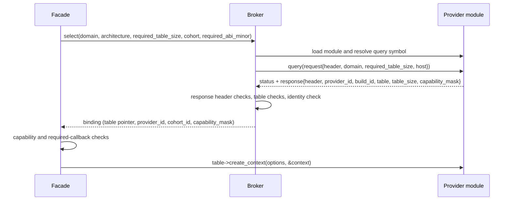

# Provider protocol specification

Normative specification of the private ABI between a compatibility facade, a broker, and a
provider. It is a distribution-private contract, not a public third-party ABI: a provider is part
of the same distribution as the facade that loads it. Implementation status, source citations,
test inventory, and prototype measurements live in
[ledger/provider-protocol.md](ledger/provider-protocol.md).

## Scope

This specification owns: the versioned bootstrap query (exported symbol, request record,
response record); domain identity; dispatch table shape, layout rules, and the mandatory prefix;
operation parameter and result records; the status taxonomy, defined once here and referenced by
every other specification; argument ownership, object lifetime, and concurrency for protocol
calls; capability and profile negotiation carried on the boundary; and the ABI version constants
and compatibility-check rules applied to a candidate.

## Non-goals

- Manifest syntax, discovery, trust, candidate ordering: [manifest.md](manifest.md), [broker.md](broker.md).
- The public API or ABI of any math library: [facade.md](facade.md).
- Translating a record onto an implementation, and mapping its errors onto the section 8 taxonomy:
  [provider-adapter.md](provider-adapter.md).
- The binding object, its validity and invalidation: [provider-binding.md](provider-binding.md).
- Shared-object identity, load, and unload: [provider-module.md](provider-module.md).
- Numerical semantics. Structural closure across the boundary is not numerical equivalence.

## Terminology

Terms from [../draft-plan-reboot.md](../draft-plan-reboot.md) are used unchanged. Local terms:

| Term | Meaning |
| --- | --- |
| Bootstrap query | The single call through the exported query symbol that exchanges a request record for a response record. |
| Dispatch table | A fixed-layout C struct of function pointers for one domain, published by the response. The parent document calls this the operation table; the two names denote the same record. |
| Mandatory prefix | The leading byte range of a dispatch table that a consumer requires through `required_table_size`. |
| Transport status | The `rocm_interfaces_status` value reporting whether a call crossed the protocol boundary. |
| Semantic status | The domain-native status reporting what the operation did. |

## 1. C ABI

**1.1** Every protocol declaration MUST be C-linkage, wrapped in `extern "C"` under `__cplusplus`.

**1.2** Every exported protocol entry point MUST be annotated `ROCM_INTERFACES_EXPORT`, and every
protocol function-pointer typedef MUST carry `ROCM_INTERFACES_CALL`. Both macros are defined in
`common.h`. The rocBLAS private backend contract of section 12 is the one declared exception; it
uses its own export macro and no calling-convention macro (TBD-15).

**1.3** Protocol records MUST be fixed-layout C aggregates. They MUST NOT contain C++ types,
virtual functions, references, or anything whose layout depends on a compiler flag. Scalar domain
typedefs and enums from the imitated library (`rocblas_status`, `rocblas_datatype`,
`rocblas_operation`, `rocrand_status`, `hipblasStatus_t`, and similar) MAY appear by value as
record fields; they are reused rather than mirrored.

**1.4** Implementation handle types MUST NOT cross the boundary. `rocblas_handle`,
`hipblasLtHandle_t`, `hipblasLtMatmulAlgo_t`, `hipStream_t`, `hipEvent_t`, `rocrand_generator`,
and the like MUST be erased to `void*` or to an opaque fixed-width token array.

**1.5** No C++ exception MAY cross a protocol boundary in either direction.

- The bootstrap query function MUST be `noexcept` and MUST convert every failure into a
  `rocm_interfaces_status`.
- Dispatch entries SHOULD be `noexcept` and MUST translate any escape into a domain status.
  Whether `noexcept` is mandatory on every slot is TBD-1.
- A callback reached through a service reference MUST NOT let an exception escape.

**1.6** A protocol callback MUST NOT assume the caller performed alignment-safe access on its
behalf. A reader of provider-supplied memory MUST validate the advertised byte boundary before
any read, and MUST NOT perform a typed load at an offset the provider controls until that
boundary check has passed.

## 2. Query and bootstrap contract

### 2.1 The exported symbol

**2.1.1** The protocol has exactly one entry point: the query symbol whose default name is
`ROCM_INTERFACES_PROVIDER_QUERY_SYMBOL`, the string literal
`"rocm_interfaces_provider_query_v1"`. A provider module MUST expose it; the module's export
surface is specified in [provider-module.md](provider-module.md). Its type is:

```c
typedef rocm_interfaces_status(ROCM_INTERFACES_CALL* rocm_interfaces_provider_query_fn)(
    const rocm_interfaces_provider_request* request, rocm_interfaces_provider_response* response);
```

**2.1.2** A manifest entry MAY name a different symbol through the optional `query_symbol` key.
This conflicts with 2.1.1, because a module built under the provider version script hides every
other name: TBD-2.

**2.1.3** The bootstrap query MUST NOT be conflated with the rocBLAS private backend query, which
is a separate contract with its own symbol, version macros, and header layout (section 12).

### 2.2 Query call sequence



**2.2.1** The caller of the query MUST stamp the request header itself: `header.abi_minor` carries
the minor the consumer requires and `required_table_size` carries the prefix it requires. A
provider MUST observe exactly the values the consumer asked for.

**2.2.2** A provider query MUST validate, in this order, before publishing a table: (1) null
`request` or `response`, returning `ROCM_INTERFACES_STATUS_INVALID_ARGUMENT`; (2) the request
header; (3) the response header; (4) the host-services header when `request->host` is non-null,
each returning `ROCM_INTERFACES_STATUS_INCOMPATIBLE_ABI`; (5) the requested domain, returning
`ROCM_INTERFACES_STATUS_NOT_SUPPORTED`; (6) `required_table_size`, returning
`ROCM_INTERFACES_STATUS_INCOMPATIBLE_ABI`.

**2.2.3** A provider MUST reject a `required_table_size` larger than the table it can publish,
with `ROCM_INTERFACES_STATUS_INCOMPATIBLE_ABI`. It MUST NOT publish a shorter table and let the
consumer discover the shortfall.

**2.2.4** A provider MUST NOT treat a query as a commitment. The query MAY be called repeatedly,
from several threads, and after an earlier failure. No party MAY cache a negative verdict: a
transiently failing query MUST be retried on a later selection.

**2.2.5** A provider SHOULD defer expensive backend initialization out of the query.

**2.2.6** `request->host` MAY be null on the wire, and a provider MUST NOT dereference it without
checking. Whether a provider MAY additionally require a non-null host is open and MUST NOT be
answered differently by different specifications; the shared entry is
[architecture-component-model.md](architecture-component-model.md) X3.

## 3. Domains

**3.1** A bootstrap query is scoped to exactly one domain. The domain enumeration is
`rocm_interfaces_domain`:

| Enumerator | Value | Manifest string | Dispatch table type |
| --- | --- | --- | --- |
| `ROCM_INTERFACES_DOMAIN_BLAS` | 1 | `blas` | `rocm_blas_provider_v1` |
| `ROCM_INTERFACES_DOMAIN_SOLVER` | 2 | `solver` | `rocm_solver_provider_v1` |
| `ROCM_INTERFACES_DOMAIN_RAND` | 3 | `rand` | `rocm_rand_provider_v1` |
| `ROCM_INTERFACES_DOMAIN_BLASLT` | 4 | `blaslt` | `rocm_blaslt_provider_v1`, extended by `rocm_rocblas_blaslt_provider_v1` and `rocm_hipblaslt_ai_gemm_provider_v1` |
| `ROCM_INTERFACES_DOMAIN_ROCBLAS_BRIDGE` | 5 | `rocblas_bridge` | `rocm_rocblas_bridge_v1` |
| `ROCM_INTERFACES_DOMAIN_BLAS_V2` | 6 | `blas_v2` | `rocm_blas_v2_provider` |

The manifest strings in this table are the complete accepted vocabulary; any other string MUST be
rejected as an unknown domain.

**3.2** Domain values MUST be append-only. A value MUST NOT be reused for a different contract.

**3.3** Domains are independent contracts. A provider MUST NOT assume that a record shape shared
by name between two domains is shared by layout or by enumerator value. `rocm_blas_batch_kind`
and `rocm_blas_v2_batch_kind` disagree by one on every enumerator; no document or adapter MAY
treat one batch encoding as covering both protocols.

**3.4** A domain's dispatch table type MAY be generated rather than hand-declared. A generated
table is subject to every rule in this specification.

## 4. Request and response records

### 4.1 The ABI header

**4.1.1** Every extensible protocol record and every dispatch table, except the rocBLAS private
backend table of section 12, MUST begin with:

```c
typedef struct rocm_interfaces_abi_header {
    uint32_t struct_size;
    uint16_t abi_major;
    uint16_t abi_minor;
} rocm_interfaces_abi_header;
```

**4.1.2** `struct_size` MUST be the byte count of the record as the writer built it. A reader
MUST NOT read a field whose end offset exceeds `struct_size`, and MUST leave its own prior state
untouched for a field the writer did not supply.

### 4.2 Request record

```c
typedef struct rocm_interfaces_provider_request {
    rocm_interfaces_abi_header header;
    rocm_interfaces_domain domain;
    uint32_t required_table_size;
    const rocm_interfaces_host_services* host;
} rocm_interfaces_provider_request;
```

- `header.abi_minor` carries the semantic level the consumer requires, not the level it was built
  at.
- `required_table_size` carries the mandatory prefix in bytes and MUST be at least
  `sizeof(rocm_interfaces_abi_header)`. A smaller value MUST be rejected before any candidate is
  queried.
- `host` MAY be null (2.2.6). The record is `const` to the provider; a provider MUST NOT write
  through it.

### 4.3 Response record

```c
typedef struct rocm_interfaces_provider_response {
    rocm_interfaces_abi_header header;
    const char* provider_id;
    const char* build_id;
    const void* dispatch_table;
    uint32_t dispatch_table_size;
    uint64_t capability_mask;
} rocm_interfaces_provider_response;
```

**4.3.1** `provider_id` MUST be non-null and nonempty, and MUST equal the configured identity when
the manifest entry declares one.

**4.3.2** `provider_id` and `build_id` MUST point at storage with static lifetime.

**4.3.3** `build_id` identifies a semantics-preserving rebuild. Every provider MUST write it.
Whether it becomes a selection or compatibility constraint is TBD-3.

**4.3.4** `dispatch_table` MUST point at storage that outlives every binding taken on it, and a
provider MUST NOT mutate a published table: the consumer retains the pointer and calls through it
for the life of the binding.

### 4.4 Well-formedness of a response and its table

A response and the dispatch table it publishes are well-formed only when every row below holds. A
provider MUST NOT publish a response that violates one. The order in which a broker applies these
as a compatibility-check sequence, and its rejection diagnostics and failure behavior, are
specified in [broker.md](broker.md); a reader MUST validate the advertised byte boundaries before
any read of provider memory (1.6).

| Field | Well-formed when |
| --- | --- |
| query return | `query()` returned SUCCESS; on any other status the response publishes nothing |
| `response.header.struct_size` | at least `sizeof(rocm_interfaces_provider_response)` |
| `response.header.abi_major` | equals `ROCM_INTERFACES_ABI_MAJOR` |
| `response.header.abi_minor` | at least the minor the consumer requested |
| `dispatch_table` | non-null |
| `dispatch_table_size` | at least `sizeof(rocm_interfaces_abi_header)`, and at least `required_table_size` |
| `table_header.struct_size` | equals `response.dispatch_table_size`, and is at least `required_table_size` |
| `table_header.abi_major` | equals `ROCM_INTERFACES_ABI_MAJOR` |
| `table_header.abi_minor` | at least the minor the consumer requested |
| version pair | table `(abi_major, abi_minor)` equals response `(abi_major, abi_minor)` |
| `provider_id` | non-null, nonempty, and equal to the configured identity when one is declared (4.3.1) |

**4.4.1** A consumer MUST NOT request semantics newer than the headers it was built from:
`required_abi_minor > ROCM_INTERFACES_ABI_MINOR` MUST be refused before any candidate is queried.

## 5. Dispatch tables

### 5.1 Shape

**5.1.1** A dispatch table MUST be a fixed-layout struct whose first member is
`rocm_interfaces_abi_header`, followed by function pointers in a fixed declared order.

**5.1.2** `table.header.struct_size` MUST be the complete table byte count and MUST equal
`response.dispatch_table_size`. It MUST NOT be the consumer's requested prefix size.

### 5.2 Table inventory

One table type per domain, named in 3.1. The declared member sequence of each is fixed by 5.1.1
and is listed in [ledger/provider-protocol.md](ledger/provider-protocol.md).

### 5.3 Mandatory prefix

**5.3.1** A consumer declares the prefix it requires through `required_table_size`. A provider
MUST supply at least that prefix or fail the query.

**5.3.2** Once a prefix is released, every byte of it MUST remain identical in size, offset, field
type, callback signature, calling convention, and semantics. New entries MUST be appended.

**5.3.3** The RAND mandatory prefix ends immediately before `initialize_generator`: it covers
`create_generator`, `destroy_generator`, `configure_generator`, and `generate`.

**5.3.4** The BLASLt extension chain makes its prefixes structural:
`rocm_rocblas_blaslt_provider_v1` MUST embed `rocm_blaslt_provider_v1` at offset zero as its first
member `legacy`, and `rocm_hipblaslt_ai_gemm_provider_v1` MUST embed
`rocm_rocblas_blaslt_provider_v1` at offset zero as its first member `service`. A provider
advertising the borrowed-service capability MUST return at least the complete legacy prefix.

**5.3.5** A new protocol generation SHOULD express its frozen prefix structurally (embedded prefix
structs) or with per-member ABI-minor annotations in the header, not in prose. Which members of
`rocm_rand_provider_v1` and `rocm_solver_provider_v1` constitute the frozen prefix is not
expressed in the headers: TBD-4.

**5.3.6** The advertised prefix of `rocm_solver_blas_services_v1`, the BLAS services handed to a
solver provider, ends at `triangular_matrix`. A consumer MUST NOT read or advertise a newer
BLAS-v2 tail that selection did not guarantee. Whether `matrix_transform` is deliberately outside
that prefix, and whether the boundary MUST be marked in `solver.h`, is TBD-5.

### 5.4 Required and optional callbacks

**5.4.1** Generic selection MUST NOT inspect individual function pointers. The broker validates
sizes, versions, and identity only.

**5.4.2** The domain consumer MUST null-check every entry it intends to call, immediately after
selection and before creating a provider context.

**5.4.3** A null mandatory callback discovered after successful negotiation MUST be a fail-closed
configuration error. Fallback MUST NOT be re-enabled after a successful provider negotiation.

**5.4.4** An optional callback MAY be null. A consumer that finds one null MUST either skip the
optional path or return the domain's not-implemented status; it MUST NOT synthesize behavior the
provider did not offer.

## 6. Operation parameter and result records

**6.1** Every operation parameter record and operation result record MUST begin with
`rocm_interfaces_abi_header` and MUST be extended only by appending fields.

**6.2** A consumer of an output record MUST initialize the record's header before the call, and
the provider MUST validate the header of every output slot before writing any of them.

**6.3** Reserved fields exist in several records. Whether "reserved input fields MUST be zero" is
protocol-wide or specific to the BLASLt service records is TBD-6; where a header states the rule,
the receiving side MUST enforce it.

**6.4** When a record grows, the appended fields MUST be documented in the header as belonging to
a specific ABI minor, and a provider built against the earlier prefix MUST be permitted to ignore
them.

**6.5** An algorithm token is a fixed-width opaque array, not a pointer, and tokens of different
widths are not interchangeable: `rocm_blaslt_heuristic_result` carries `uint64_t
algorithm_token[2]`, `rocm_blas_v2_solution` carries `uint64_t provider_algorithm_token[4]`.

**6.6** A protocol record MUST NOT be stretched to carry an operation shape it cannot express. A
declared enumerator does not imply representability: `ROCM_BLAS_BATCH_GROUPED` and
`ROCM_BLAS_V2_BATCH_GROUPED` exist, but a narrow matmul request cannot express per-group shapes,
operations, leading dimensions, and scalars, so the narrow edge MUST return the domain's
not-implemented status rather than approximate the operation.

## 7. Opaque contexts, ownership, and lifetime

### 7.1 Context representation

**7.1.1** Provider state MUST be opaque to the consumer. Every domain passes it as an untyped
`void*`.

**7.1.2** A consumer MUST NOT dereference, copy, compare for ordering, or otherwise interpret a
provider context pointer. It MUST pass it back unchanged as the first argument to entries of the
same table from the same provider instance.

**7.1.3** A provider MUST reject a null context with the domain's invalid-handle status.

**7.1.4** Cross-domain service state a provider receives MUST NOT be a raw pointer to consumer
internals. It MUST be an authenticated token that the issuing consumer validates on every call
against a live registry, together with table identity and profile, capability, and cohort-key
agreement.

**7.1.5** A revoked or foreign service token MUST be rejected, not trusted: the semantic status
MUST be the domain's invalid-handle status and the transport status MUST be
`ROCM_INTERFACES_STATUS_INVALID_OBJECT`.

### 7.2 Table and module lifetime

**7.2.1** A published dispatch table MUST remain mapped and unmodified for as long as any binding
on it exists. Module residency is specified in [provider-module.md](provider-module.md); what a
consumer retains is specified in [provider-binding.md](provider-binding.md). Whether a consumer
may pin a provider for the process lifetime is undecided and owned here as TBD-7; this
specification states no rule either way until that decision closes.

### 7.3 Pointer ownership across a call

**7.3.1** A provider MUST NOT retain a pointer to a request record, or to any record reachable
from it, after the call returns. Fields the provider needs beyond the call MUST be copied.

**7.3.2** Where a header states a retention rule for a specific field, that rule is binding and
narrows nothing in 7.3.1. Execution state supplied per call MUST be treated as a snapshot: a
provider MUST NOT observe a mixture of concurrent setter updates, and a query-size out-pointer is
valid only for the duration of the callback.

**7.3.3** A service reference is valid only for the lifetime of the receiving provider context.
The complete reference MUST be passed as the first argument to callbacks in its table. A
broker-defined `cohort_key` MAY be compared and copied, but a provider MUST NOT infer provider
state from it.

**7.3.4** Caller-supplied storage MUST NOT be treated as provider workspace.

**7.3.5** A provider MUST NOT allocate a buffer on the consumer's behalf except where an entry
explicitly transfers ownership. The transferring entries are `create_poisson_distribution` and
`create_discrete_distribution` in `rocm_rand_provider_v1`, whose results MUST be released through
`destroy_discrete_distribution`. `get_direction_vectors32`, `get_direction_vectors64`,
`get_scramble_constants32`, and `get_scramble_constants64` return borrowed pointers that MUST NOT
be freed.

**7.3.6** An algorithm token returned by `heuristic`, `matmul_query`, or `prepare` is private to
the issuing provider context. It MUST NOT be replayed against a different context, and the issuing
provider MUST reject a token that does not belong to the context it was presented with.

### 7.4 Creation and destruction

**7.4.1** Context creation MUST be failure-atomic: on any failure the provider MUST leave no
allocated state and MUST NOT write a context pointer.

**7.4.2** `destroy_context` MUST release all provider state unconditionally, including when an
underlying implementation reports failure. Two shipped paths currently release only on backend
success; which policy is adopted is TBD-8.

**7.4.3** Destruction order across a cohort MUST be specified by the consuming binding, and a
dependent context MUST be destroyed before the service it borrowed. Destroying a service binding
MUST revoke its token immediately; a call that already acquired the token retains the service
state until it returns.

**7.4.4** Whether aborting the process is adopted behavior when a borrowed provider context fails
to create or destroy is TBD-9.

## 8. Host services, device key, and status

### 8.1 Host services record

```c
typedef struct rocm_interfaces_host_services {
    rocm_interfaces_abi_header header;
    void* user_data;
    rocm_interfaces_allocate_fn allocate;
    rocm_interfaces_deallocate_fn deallocate;
    rocm_interfaces_trace_fn trace;
} rocm_interfaces_host_services;
```

with `allocate(void* user_data, size_t size, size_t alignment) -> void*`,
`deallocate(void* user_data, void* allocation, size_t alignment) -> void`, and
`trace(void* user_data, const char* domain, const char* operation, const void* payload, size_t payload_size) -> void`.

**8.1.1** Each of `allocate`, `deallocate`, and `trace` MAY be null. A provider MUST check before
calling.

**8.1.2** A provider MUST NOT let an exception escape from inside a host callback back across the
boundary, and MUST NOT let a misbehaving host callback change its own result.

**8.1.3** The consumer, not the caller of the public API, owns the host services pointer: a
consumer MUST set `host` on every options record it builds and MUST discard any caller value.

### 8.2 Device key

```c
typedef struct rocm_interfaces_device_key {
    rocm_interfaces_abi_header header;
    int32_t device_ordinal;
    char architecture[ROCM_INTERFACES_ARCHITECTURE_NAME_CAPACITY];
    uint64_t feature_mask;
} rocm_interfaces_device_key;
```

`ROCM_INTERFACES_ARCHITECTURE_NAME_CAPACITY` is `16u`; `ROCM_INTERFACES_ARCHITECTURE_UNKNOWN` is
`"gfx000"`.

**8.2.1** `architecture` MUST hold the canonical base architecture without feature suffixes and
MUST contain a NUL terminator inside the fixed array. Feature state MUST be carried in
`feature_mask` using `rocm_interfaces_device_feature`: `XNACK_KNOWN = 1u<<0`,
`XNACK_ENABLED = 1u<<1`, `SRAM_ECC_KNOWN = 1u<<2`, `SRAM_ECC_ENABLED = 1u<<3`. A KNOWN bit without
its ENABLED bit means the feature is disabled; a clear KNOWN bit means the state was not reported.
How the broker derives a device key and uses it for candidate matching is specified in
[broker.md](broker.md).

### 8.3 Status taxonomy

This section is the single definition of the protocol status taxonomy. No other specification
defines, renumbers, or extends it.

**8.3.1** `rocm_interfaces_status` is the transport status of the protocol boundary. Its values,
all prefixed `ROCM_INTERFACES_STATUS_`, are:

| Enumerator | Value | Meaning |
| --- | --- | --- |
| `SUCCESS` | 0 | The call crossed the boundary and produced a result. |
| `INVALID_ARGUMENT` | 1 | A required argument was null or structurally unusable. |
| `OUT_OF_MEMORY` | 2 | An allocation required to cross the boundary failed. |
| `NOT_SUPPORTED` | 3 | The requested domain or facility is not offered. |
| `NO_SOLUTION` | 4 | No candidate solution satisfies the request. |
| `INCOMPATIBLE_ABI` | 5 | A header, version, or prefix requirement was not met. |
| `PROVIDER_FAILURE` | 6 | The provider produced a result the consumer refused to trust. |
| `INVALID_OBJECT` | 7 | A token, context, or reference was revoked, foreign, or reentered. |
| `INTERNAL_ERROR` | 8 | An unclassifiable failure inside the boundary implementation. |

Which of `NO_SOLUTION`, `INVALID_OBJECT`, and `INTERNAL_ERROR` are reachable from a bootstrap
query, as opposed to only from service callbacks, is TBD-10.

**8.3.2** Domain operations MUST return the domain's native semantic status, not a transport
status: `rocblas_status` for BLAS, BLASLt, solver, and BLAS_V2; `rocrand_status` for RAND;
`hipblasStatus_t` for the hipBLASLt direct entries. Mapping an underlying implementation's errors
onto a semantic status is specified in [provider-adapter.md](provider-adapter.md).

**8.3.3** Where a call carries both, the transport status and the semantic status MUST be reported
separately. The transport status MUST report only whether the result crossed the boundary
successfully, never what the operation computed.

**8.3.4** A result record MUST record where its semantic status came from.
`rocm_rocblas_blaslt_outcome_origin` is `RETURNED_STATUS = 1` (the implementation returned it
normally), `CAUGHT_EXCEPTION = 2` (the adapter converted a caught exception), and
`BOUNDARY_FAILURE = 3` (no trustworthy semantic result crossed). A result record MUST be
pre-initialized to `BOUNDARY_FAILURE`, so an unwritten record is distinguishable from a real
outcome.

**8.3.5** An execution-capable call MUST report conservatively whether it touched observable
state. `rocm_rocblas_blaslt_execution_effect` is `NOT_STARTED = 1` (no work enqueued, no caller or
workspace byte modified, no persistent execution or numerics state changed), `MAY_HAVE_EFFECTS = 2`
(work began, or the callee cannot prove the stronger result), and `SUBMITTED = 3` (host submission
completed successfully). A consumer owns fallback policy and MUST consider the request, the
semantic status, the origin, and the effect together; it MUST NOT treat `NOT_STARTED` alone as
permission to fall through.

**8.3.6** A consumer MUST NOT trust a provider result record without validating it: the header,
origin validity, the invariant that success implies `RETURNED_STATUS` and `SUBMITTED`, and the
invariant that failure implies not `SUBMITTED`. On violation the consumer MUST reset the record
and return `ROCM_INTERFACES_STATUS_PROVIDER_FAILURE`.

## 9. Capability negotiation

**9.1** `response.capability_mask` is a `uint64_t` bitmask advertising optional guarantees. A
capability bit SHOULD be nonzero, so that a zero-initialized record advertises no optional
guarantee.

**9.2** A consumer that depends on an optional guarantee MUST require its bit before accepting a
candidate, and MUST skip a candidate that lacks it rather than degrade silently.

**9.3** Declared bit values:

| Macro | Value | Field it travels in |
| --- | --- | --- |
| `ROCM_ROCBLAS_BLASLT_CAPABILITY_OUTCOME_ORIGIN` | 1 | `capability_mask` |
| `ROCM_ROCBLAS_BLASLT_CAPABILITY_EXECUTION_EFFECT` | 2 | `capability_mask` |
| `ROCM_ROCBLAS_BLASLT_CAPABILITY_AI_GEMM_F16_F32` | 4 | `capability_mask` |
| `ROCM_ROCBLAS_BLASLT_PROFILE_GEMM_PREPARE_EXECUTE_V1_CAPABILITIES` | OR of the three above | `capability_mask` |
| `ROCM_BLAS_V2_CAPABILITY_BORROWED_BLASLT_AI_GEMM` | 1 | `capability_mask` |
| `ROCM_HIPBLASLT_CAPABILITY_DIRECT_AI_GEMM` | 8 | `capability_mask` |
| `ROCM_ROCBLAS_BLASLT_PROFILE_GEMM_PREPARE_EXECUTE_V1` | 1 | `profile` |
| `ROCM_HIPBLASLT_PROFILE_AI_GEMM_F16_F32_V1` | 1 | `profile` |

Profile id zero always means "no profile".

**9.3.1** Two capability bits in different domains currently share value 1 on the same
`uint64_t capability_mask`, and there is no rule assigning bit ranges per domain: TBD-11. Until
that is settled, a consumer MUST interpret a capability bit only in the context of the domain it
selected.

**9.4** A profile is a coarser negotiation unit than a bit: it names a required callback set plus
a required capability set. A receiving provider MUST validate profile equality and
`(capabilities & required) == required` before using a service reference, and MUST fail creation
rather than proceed when validation fails.

**9.5** Behavior flags are distinct from capabilities. A behavior flag such as
`ROCM_BLAS_V2_BEHAVIOR_PUBLIC_EXTENDED_API` is a per-call flag on the execution record, not a
provider capability, and MUST NOT be advertised in `capability_mask`. A provider MUST preserve the
validation result of the entry point a flag selects, including when the caller deliberately
supplies an invalid datatype.

## 10. Version evolution

**10.1** `ROCM_INTERFACES_ABI_MAJOR` is `1u`, `ROCM_INTERFACES_ABI_MINOR` is `2u`, and
`ROCM_INTERFACES_ABI_BASE_MINOR` is `0u`. Whether `ROCM_INTERFACES_ABI_BASE_MINOR` is normative or
a spelling convenience is TBD-12.

**10.2** A major mismatch MUST be fatal to selection: both `response.header.abi_major` and
`table_header.abi_major` MUST equal `ROCM_INTERFACES_ABI_MAJOR`.

**10.3** A provider minor MUST be at least the minor the consumer requested. An older consumer MAY
therefore accept a newer provider and ignore its tail; a current consumer MAY choose an older
provider only by deliberately requesting that older semantic level together with a prefix the
provider covers.

**10.4** The minor MUST NOT roll over or reset within a major. Exhausting its range requires a new
major.

**10.5** A change that preserves layout, callable signatures, enum values, ownership, and
observable semantics MUST NOT change the ABI numbers. Such a rebuild is identified by `build_id`
(4.3.3).

**10.6** The response and the selected table MUST stamp the same `(abi_major, abi_minor)` tuple; a
mixed tuple is malformed. Whether one tuple is additionally required to be global across all
domains in a deployment is TBD-13.

**10.7** Every release MUST extend the conformance controls before its headers or providers ship.

## 11. Concurrency

**11.1** The bootstrap query MUST be safe to call concurrently, and MUST tolerate reentrancy on
the calling thread.

**11.2** Dynamic-loader calls MUST be serialized process-wide by a single process-wide lock shared
by every component in the distribution. The lock's owning artifact is specified in
[provider-module.md](provider-module.md).

**11.3** Whether concurrent dispatch on one provider context is supported is not specified
(TBD-14). Until settled, a consumer MUST NOT assume a context is internally thread-safe, and a
provider MUST NOT assume the consumer serializes.

**11.4** Same-thread reentry from a provider back into a service it borrowed MUST be rejected with
`ROCM_INTERFACES_STATUS_INVALID_OBJECT` rather than allowed to cycle.

## 12. Boundary to the rocBLAS private backend contract

The rocBLAS private backend contract is adjacent to this protocol and MUST NOT be conflated with
it. `rocblas_internal_backend_api_v1` does not begin with `rocm_interfaces_abi_header`; its prefix
is `size_t struct_size; uint32_t abi_major; uint32_t abi_minor;`. Any statement that every table in
this system shares one header shape MUST exclude it. Two of its rules bind a provider that uses it:

- A DSO exporting `rocblas_internal_backend_query_v1` guarantees that references originating
  inside that DSO bind to that same implementation - on ELF this holds only when that DSO is
  linked with `-Bsymbolic-functions` - so the resolver stays safe when a public facade exporting
  the same `rocblas_*` names was loaded first.
- A provider MUST NOT synthesize a finite switch over argument counts for the varargs helpers; the
  normalized array-taking callbacks exist for that reason.

Whether it comes under `rocm_interfaces_abi_header` and the common ABI macros is TBD-15.

## Open decisions (TBD)

| ID | Question | Blocks |
| --- | --- | --- |
| TBD-1 | Must every dispatch-table slot be `noexcept`, or is per-adapter discretion accepted? | 1.5 |
| TBD-2 | Is the manifest `query_symbol` override supported, or vestigial? An override cannot resolve under the provider version script. | 2.1.2; the manifest allowed-key set |
| TBD-3 | Does `build_id` ever become a selection or compatibility constraint? | 4.3.3, 10.5; cohort build identity in [cohort.md](cohort.md) |
| TBD-4 | Which members of `rocm_rand_provider_v1` and `rocm_solver_provider_v1` are the frozen mandatory prefix? | 5.3.2, 5.3.5 |
| TBD-5 | Is `matrix_transform` deliberately outside the solver BLAS-services advertised prefix, and must `solver.h` mark the boundary? | 5.3.6 |
| TBD-6 | Is "reserved input fields must be zero" protocol-wide, or specific to the BLASLt service records? | 6.3 |
| TBD-7 | Is process-lifetime pinning of a selected provider adopted policy, or an unbounded-retention defect? | 7.2.1; unload semantics in [provider-module.md](provider-module.md) |
| TBD-8 | Must `destroy_context` release provider state unconditionally, including on a non-success backend status? | 7.4.2 |
| TBD-9 | Is aborting the process on borrowed-provider create/destroy failure adopted behavior? | 7.4.4 |
| TBD-10 | Which of `NO_SOLUTION`, `INVALID_OBJECT`, and `INTERNAL_ERROR` are reachable from a bootstrap query? | 8.3.1 |
| TBD-11 | Are capability-bit namespaces per domain or global? Two capability bits in different domains share value 1 on one mask. | 9.3.1 |
| TBD-12 | Is `ROCM_INTERFACES_ABI_BASE_MINOR` normative, and what does requesting the base minor promise a consumer? | 10.1 |
| TBD-13 | Is one global `(abi_major, abi_minor)` tuple across all domains required, or is per-domain agreement sufficient? | 10.6 |
| TBD-14 | Must a provider be internally thread-safe per context, or must the consumer serialize? | 11.3 |
| TBD-15 | Does `rocblas_internal_backend_api_v1` come under `rocm_interfaces_abi_header` and the common ABI macros? | 1.2, section 12 |
| TBD-16 | Are ctest target names part of the contract, and how is "check not configured here" distinguished from "check absent"? | the conformance evidence in [ledger/provider-protocol.md](ledger/provider-protocol.md) |
| TBD-17 | Must every protocol header have a check that compiles it as C, or is rule 1.1 narrowed to the headers a C consumer actually uses? | 1.1 |
| TBD-18 | Must a conformance check compare a provider table's member layout against its header declaration, not just its byte count and version tuple? | 1.3, 1.4, 5.1.1, 5.3.2 |

## Cross-links

- [architecture-component-model.md](architecture-component-model.md) - lanes and call directions.
- [broker.md](broker.md) - discovery, ordering, device key, and the `select()` contract behind 4.4.
- [facade.md](facade.md) - the public side of the boundary this protocol serves.
- [provider.md](provider.md) - the provider as a complete facility.
- [provider-adapter.md](provider-adapter.md) - translating this protocol onto an implementation.
- [provider-module.md](provider-module.md) - the loadable artifact, its exports, its lifetime.
- [provider-binding.md](provider-binding.md) - what a consumer retains after selection.
- [manifest.md](manifest.md) - manifest schema, discovery, and filesystem trust.
- [cohort.md](cohort.md) - coordinated multi-domain selection.
- [ledger/provider-protocol.md](ledger/provider-protocol.md) - non-normative evidence.

Parent: [../draft-plan-reboot.md](../draft-plan-reboot.md). Reference material reconciled here, not
superseded: [../provider-protocols.md](../provider-protocols.md),
[../03-abi-and-versioning-contract.md](../03-abi-and-versioning-contract.md),
[../07-status-and-roadmap.md](../07-status-and-roadmap.md).
