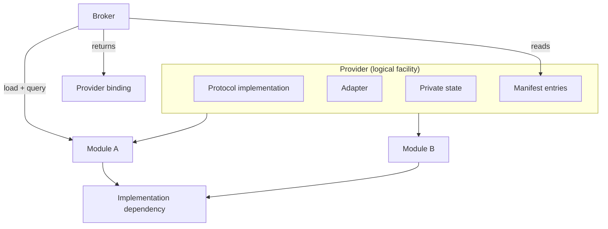

# Provider specification

## Status

This is a normative specification of the provider as a whole facility. It is not a report of
shipped behavior. Implementation status, source citations, test inventories, and the long
rationale are non-normative and live in [ledger/provider.md](ledger/provider.md).

This document is an aggregate. It states only what is true of a provider as a whole. Every part
of a provider is specified elsewhere, and this document adds no rules of its own about those
parts:

| Part | Owning specification |
| --- | --- |
| Protocol identity, query entry point, table layout, status taxonomy, argument ownership, object lifetime, concurrency | [provider-protocol.md](provider-protocol.md) |
| Translation to an underlying implementation, error mapping, adapter-local state | [provider-adapter.md](provider-adapter.md) |
| Shared-object file identity, exported symbols, load and unload | [provider-module.md](provider-module.md) |
| The binding object, its handle, validity and invalidation | [provider-binding.md](provider-binding.md) |
| Manifest name, location, schema, fields, trust | [manifest.md](manifest.md) |
| Cohort identity, membership, co-selection, upgrade | [cohort.md](cohort.md) |
| Discovery, candidate ordering, compatibility checks, selection | [broker.md](broker.md) |
| Public API, ABI, and library identity | [facade.md](facade.md) |

Terminology is defined in [../draft-plan-reboot.md](../draft-plan-reboot.md). Where that document
and this one disagree, it defines the terms and this one defines the obligations.

## Scope

- What a provider is, and which parts of a distribution belong to it.
- Provider identity and build identity.
- Which domains a provider may serve, and the capability guarantees it may advertise.
- The provider's implementation dependencies and how it reaches them.
- The provider-as-a-whole lifecycle obligations: composition, residency, context lifecycle,
  diagnostics, versioning tolerance, packaging.
- The conformance obligation on a release.

## Non-goals

- No wire format, table layout, or status taxonomy. See
  [provider-protocol.md](provider-protocol.md).
- No selection policy, candidate ordering, or architecture matching. See [broker.md](broker.md).
- No manifest schema. See [manifest.md](manifest.md).
- No cohort qualification policy. See [cohort.md](cohort.md).
- No numerical behavior, performance, or tuning. A structurally conforming provider may still be
  numerically wrong; structural closure is not equivalence.
- No third-party providers built outside the distribution. The protocol is a
  distribution-internal contract, not a public plugin ABI.

## Terminology local to this document

- **Provider** - the complete distribution-private facility that supplies one or more
  capabilities without owning the application-facing API, ABI, or public-library identity.
- **Implementation dependency** - the canonical math library, or other code, that the provider
  ultimately calls, for example `librocblas.so.5`.
- **Domain** - one capability family addressed by one dispatch-table type. The enumeration is
  defined in [provider-protocol.md](provider-protocol.md).

Provider module, adapter, protocol, binding, broker, facade, and cohort are defined in
[../draft-plan-reboot.md](../draft-plan-reboot.md) and specified in the files listed above.

## 1. Composition

A provider is a facility, not a file. The unit of packaging is the module; the unit of contract
is the provider.

A conforming provider MUST consist of all of the following. A candidate missing any one of them
is not a provider.

| Component | Obligation | Specified in |
| --- | --- | --- |
| Protocol implementation | One bootstrap query entry point per module, one dispatch table per served domain | [provider-protocol.md](provider-protocol.md) |
| Adapter | Translation of protocol records, statuses, and opaque state to the implementation dependency | [provider-adapter.md](provider-adapter.md) |
| Module or modules | One or more loadable binary artifacts carrying the above | [provider-module.md](provider-module.md) |
| Manifest entries | One entry per (domain, architecture) the provider offers | [manifest.md](manifest.md) |
| Private state | All provider-owned context, caches, and tokens, reachable only through opaque handles | this document, section 5 |
| Implementation dependencies | The libraries the provider calls, reached at run time | this document, section 4 |

Composition rules:

- A provider MAY span more than one module. A provider that spans modules MUST make each module
  independently loadable and independently queryable. Nothing in the system groups modules; the
  broker loads one module at a time.
- A module MAY carry more than one domain, and MAY carry parts of more than one provider only if
  each part remains independently identifiable by provider identity and domain.
- A provider MUST NOT own or export any public math-library symbol. Its dynamic export surface is
  fixed by [provider-module.md](provider-module.md).
- A provider MUST NOT link a canonical math-library implementation target. Header-only targets
  are permitted. This is a build-time obligation on every provider target.
- A provider MUST NOT assume it is the only provider in the process, that it is loaded once, or
  that it stays loaded.
- A provider that is not installed is a test fixture, not a provider. Whether the in-tree
  recording fixtures ever become a delivery surface is [TBD-17](#open-decisions-tbd).

## 2. Identity

A provider carries three distinct identifiers. They are not interchangeable.

| Identifier | Meaning | Where it is asserted |
| --- | --- | --- |
| `id` | provider identity - names the facility | manifest entry, and the query response |
| `build_id` | build identity - names the build the semantics come from | the query response only |
| `cohort` | cohort identity - names a qualified set | manifest entry; see [cohort.md](cohort.md) |

- A provider MUST publish a non-null, nonempty provider identity in every successful query
  response.
- When a manifest entry declares a nonempty identity, the response identity MUST equal it byte
  for byte.
- Provider identity MUST be stable across rebuilds of the same provider. It names the facility,
  not the binary.
- Provider identity SHOULD be unique across the distribution. Whether the same
  (identity, domain, architecture) triple is legal in two manifests is
  [TBD-1](#open-decisions-tbd).
- A provider SHOULD publish a build identity naming the build from which its semantics come. A
  provider MUST NOT rely on build identity being validated by anyone; whether it becomes a
  selection or compatibility constraint is [TBD-2](#open-decisions-tbd).
- A provider that participates in a cohort MUST declare the cohort string in every manifest entry
  that belongs to that cohort, and MUST NOT treat cohort membership as permission to share
  objects with another cohort member. Cohort rules are in [cohort.md](cohort.md).

## 3. Domains and capabilities

- A provider MUST answer a query for a domain it declares in a manifest entry, and MUST reject
  any other domain with the not-supported status defined in
  [provider-protocol.md](provider-protocol.md).
- A provider MUST return a distinct, correctly typed table for each domain it serves, and MUST
  NOT serve one domain with another domain's table, including between a domain and its successor
  generation.
- Capability-mask and capability-profile semantics - what a bit asserts, what a profile requires
  of the party that advertises it and of the party that receives it, and the rule that a bit is
  meaningful only within the domain that was queried - are
  [provider-protocol.md](provider-protocol.md) section 9's, and a provider MUST obey them. This
  document's TBD-3 and [provider-protocol.md](provider-protocol.md) TBD-11 are the same open
  question about per-domain versus global bit namespaces.
- A provider MUST NOT advertise, in a manifest or a capability mask, a bit, a profile, an
  architecture, or any other guarantee its shipped code does not implement, including the
  complete table prefix a bit implies. An unset mask means no optional guarantees. Advertising an
  architecture for which the provider's device code was not compiled is a defect, not a
  preference.

## 4. Implementation dependencies

The threat is a provider that binds a canonical math library the wrong way: linked at build time,
resolved out of the global symbol namespace, or opened from a path an attacker controls. Any of
those turns a private provider into a source of ODR collisions, wrong-library dispatch, or code
execution.

- A provider MUST reach every implementation dependency at run time by explicit dynamic load, and
  MUST NOT link it (section 1).
- A missing or incomplete dependency MUST be a clean query failure, not a crash, and MUST be
  retryable on a later query.
- A provider MUST NOT expose an implementation handle type across the protocol boundary.

How a dependency is named, acquired lazily and once, validated before use, routed through a
private backend query entry point, and serialized against the process-wide dynamic-loader lock
is specified in [provider-adapter.md](provider-adapter.md) section 2 and
[provider-module.md](provider-module.md). Type erasure duties are specified in
[provider-adapter.md](provider-adapter.md).

## 5. State and lifecycle

The provider lifecycle runs discovery, load, query, context creation, dispatch, context
destruction, and unload. Discovery, load, and selection are the broker's, in
[broker.md](broker.md); the retained result is the binding, in
[provider-binding.md](provider-binding.md).

- All provider-owned state MUST be reachable only through opaque handles the protocol defines. A
  provider MUST NOT publish state through a global the facade or another provider can reach.
- A provider MUST be safe to unload and reload within one process. Any state kept in module-scope
  statics is destroyed on unload, and a provider MUST NOT depend on it surviving.
- Whether a consumer may pin a lease for the process lifetime rather than accept unload churn is
  undecided ([provider-protocol.md](provider-protocol.md) TBD-7); this specification states no rule
  either way until that decision closes.
- A provider MUST NOT cache the fact that a query failed. A transiently failing provider is
  retried on the next selection.
- Context creation MUST be failure-atomic: an intermediate failure MUST leave no provider-side
  allocation behind.
- Context destruction MUST release provider-side state unconditionally, including when the
  implementation dependency reports a failure on the destroy path.
- An established context MUST NOT be rebound to a different provider.
- Where a provider borrows a service from another provider, the borrowed reference is valid only
  for the lifetime of the receiving context, the receiving context MUST be destroyed before the
  binding that supplied the service, and the provider MUST reject a stale or foreign service
  reference rather than dereferencing it.
- A provider MUST NOT re-enter, directly or transitively, the service edge it was called through.
- A provider MUST be safe to query concurrently from multiple threads.
- Whether a single provider context may be dispatched concurrently is undecided
  ([provider-protocol.md](provider-protocol.md) TBD-14). Until it
  is closed, a provider MUST document its own choice, and a provider that is not internally
  thread-safe per context MUST say so.

## 6. Diagnostics

The threat is a provider that fails invisibly. A rejected candidate that says nothing is
indistinguishable from a candidate that was never considered, and a provider that writes to the
process's standard streams corrupts the output of the application that linked the facade.

- A provider MUST NOT write to stdout or stderr. Its only sanctioned diagnostic channel is the
  host trace callback defined in [provider-protocol.md](provider-protocol.md).
- A provider MUST treat host callbacks as untrusted C ABI: validate the host header before use,
  null-check the callback, and wrap the call so a throwing host cannot escape.
- A provider SHOULD trace on a query failure that is not a plain domain mismatch, so a rejection
  is explainable without a rebuild.
- A provider MUST make its rejections attributable, and MUST NOT fail silently.
- A provider MUST NOT let a diagnostic affect selection or dispatch outcome.

## 7. Compatibility

Protocol versioning is specified in [provider-protocol.md](provider-protocol.md) and manifest
schema versioning in [manifest.md](manifest.md). The obligations on a provider as a whole:

- A provider MUST tolerate a request whose protocol minor is older than its own, and MUST answer
  with a table whose prefix satisfies the smaller size it was given.
- A provider MUST behave correctly when a caller's record is shorter than the current one,
  treating fields the record does not cover as absent rather than reading them.
- A provider MUST zero every reserved output field and MUST reject a nonzero reserved input
  field. Whether this generalizes protocol-wide is [provider-protocol.md](provider-protocol.md)
  TBD-6.
- A provider MUST assert at compile time every layout assumption it relies on, including the
  offset of an embedded prefix in a table it extends.
- A provider implementing an experimental protocol MUST NOT present it to anyone as a stable ABI.
- A provider's module and manifest MUST ship together in the same install component and
  directory, and every manifest entry in a shipped package MUST resolve to a module that exists
  beside it.

## 8. Conformance

A release MUST NOT claim provider conformance on the strength of a check that did not register.
Test families that silently do not register when an optional canonical library is absent are not
evidence. A required minimum test set is [TBD-19](#open-decisions-tbd).

The conformance obligations and the named ctest targets that currently cover them are inventoried
in [ledger/provider.md](ledger/provider.md), rows C1 through C21. That inventory is evidence, not
contract; the contracts are the MUST statements above and in the owning specifications.

## Open decisions (TBD)

Only decisions that block a provider-level contract are listed. Ids are stable across the
compression; decisions owned by another specification are cited there and repeated here only
when a provider obligation depends on them. The full pre-compression table, including TBD-4
through TBD-11, TBD-13 through TBD-16, TBD-18, TBD-20, TBD-21, TBD-22, and TBD-24, is preserved
in [ledger/provider.md](ledger/provider.md).

| Id | Question | Blocks |
| --- | --- | --- |
| TBD-1 | Is the same (identity, domain, architecture) triple legal across two manifests? | Whether provider identity is a global key. |
| TBD-2 | Does build identity ever become a selection or compatibility constraint? | Whether cohort identity can ever mean "built together". |
| TBD-3 | Are capability-bit namespaces per-domain or global? | Any cross-domain capability reasoning; safe addition of new bits. |
| TBD-12 | May one provider context be dispatched concurrently? Owned by provider-protocol.md. | Whether per-context caching is a race or a caller obligation. |
| TBD-17 | Are the in-tree recording modules permanently test-only? | Whether their export and manifest conformance are release requirements. |
| TBD-19 | Is there a required minimum test set a configuration MUST register? | Any claim that a green test run means conformance. |
| TBD-23 | Does the generated bridge provider obey these obligations, and what proves it? | Every rule whose only evidence is the hand-written adapters. |

## Related specifications

- [../draft-plan-reboot.md](../draft-plan-reboot.md) - parent concepts document and authoritative
  terminology.
- [architecture-component-model.md](architecture-component-model.md) - how the components fit.
- [broker.md](broker.md), [facade.md](facade.md), [manifest.md](manifest.md),
  [cohort.md](cohort.md) - the components a provider is selected by, hidden behind, described in,
  and qualified with.
- [provider-protocol.md](provider-protocol.md), [provider-adapter.md](provider-adapter.md),
  [provider-module.md](provider-module.md), [provider-binding.md](provider-binding.md) - the
  parts a provider is composed of.
- [ledger/provider.md](ledger/provider.md) - non-normative evidence for this specification.
