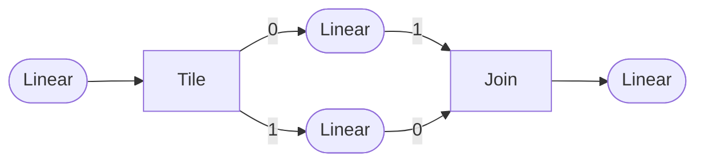

# Stream-K Plain & 2-tile Coordinate Transforms

For this document, we will assume the following:

| Dimension        |Value|
|------------------|-----|
| MacroTiles in M  |  10 |
| MacroTiles in N  |  12 |
| Total MacroTiles | 120 |
| K loop iterations| 512 |
| Workgroups/CUs   |  32 |

## Precondition

The Stream-K transformation starts with a coordinate graph similar to


There are two dangling `MacroTileNumber` coordinates, and the
`ForLoop(K)` coordinate.  In the data-parallel algorithm, the
`MacroTileNumber` coordinates are attached to workgroups, which
results in an implicit loop over the output M/N `D` tiles.  The K
tiles are looped over explicitly by each workgroup.

The Stream-K transform creates a flattened "global tile space" from
all of the M/N/K tiles.

## Stream-K

The flattened M/N/K global tile-space will be distributed evenly among
the CUs.

Each CU needs to iterate over its portion of the flattened global
tile-space.

To facilitate accumulation initialization and prefetching etc, we use
two loops to accomplish this: an outer local-tile loop and an inner
accumulation (K) loop.

The inner loop iterates over the K tiles one-by-one.  The outer loop
iterates over the local portion of the global tile-space.  Its
increment is: however many tiles the inner K loop processed.

When the inner K loop advances, it will be advancing to a new K
tile, but will remain within the same M/N tile.  When the outer
tile loop advances, it will be advancing to a new M/N tile.

The local combined index

    cuTile = forTileIdx + forKIdx

is the current CUs local tile in its portion of the global tile-space.
Then

    tile = tilesPerCU * cu + cuTile

is the global tile that the CU is processing.  Given the global tile,
the M/N/K tile coordinates are

    m = (tile / numTilesK) / numTilesN;
    n = (tile / numTilesK) % numTilesN;
    k = tile % numTilesK;

This does not need a new kind of `CoordinateTransform` edge.  It can
be done with existing `Tile`, `Flatten`, and `Split` edges.


The control graph would implement code roughly equivalent to:

```C++
    auto totalTiles = numTilesM * numTilesN * numTilesK;
    auto tilesPerCU = (totalTiles + numCUs - 1) / numCUs;

    for(uint cu = 0; cu < numCUs; cu++)
    {
        uint forTileIdx, forKIdx;

        forKIdx = 0;
        for(forTileIdx = 0;
            (forTileIdx < tilesPerCU)
            && ((tilesPerCU * cu + forTileIdx) < totalTiles);
            forTileIdx += forKIdx)
        {
            uint tile;
            uint m, n, k;

            tile = tilesPerCU * cu + forTileIdx;

            m = (tile / numTilesK) / numTilesN;
            n = (tile / numTilesK) % numTilesN;
            k = tile % numTilesK;

            bool sendPartialTile = k > 0;

            // init accum and prefetch

            auto startMN = tile / numTilesK;
            for(forKIdx = 0;
                (((tilesPerCU * cu + forTileIdx + forKIdx) / numTilesK) == startMN)
                && (tilesPerCU * cu + forTileIdx + forKIdx < totalTiles)
                && (forTileIdx + forKIdx < tilesPerCU);
                forKIdx += 1)
            {
                tile = tilesPerCU * cu + forTileIdx + forKIdx;

                m = (tile / numTilesK) / numTilesN;
                n = (tile / numTilesK) % numTilesN;
                k = tile % numTilesK;

                // process the tile
            }

            bool receivePartialTile = k < numTilesK - 1;

            if(sendPartialTile)
            {
                // store partial tile to buffer
                // store flag
            }

            if(receivePartialTile)
            {
               while(flag == 0);

               // load partial tile from buffer
               // accumulate into my tile from for-K loop
            }

            // load C
            // multiply my tile by alpha
            // my tile += beta * C
            // store into D
        }
    }

   ```

The Stream-K tiles will be done in a way that is fastest within the
ForTile loop of a particular workgroup.  This is difficult to change
at the lower level of this graph.

Reordering the tiles after the flattening the MacroTileNumber
dimensions (i.e. on the `Linear(size=120)` dimension), or reversing
the order of the `MacroTileNumber`s would be different ways of
changing the memory access pattern on this level if needed.

Swap input orders:


Reorder with tile/join:



## 2-Tile Stream-K

2-Tile stream-k will require an additional coordinate transform edge: `Sunder`.

This transform will cause the output (upstream) dimension to spread its size unevenly between the first N-1 of its subdimensions. Its value will be taken from one of the input (downstream) dimensions.  The last downstream dimension will be an index which determines which of the dimensions to take.

The `ReverseEdgeVisitor` implementation will be something like:

```C++
std::vector<Expression::ExpressionPtr> operator()(Sunder const& e)
{
    AssertFatal(srcs.size() == 1, ShowValue(srcs.size()));
    AssertFatal(dsts.size() > 1, ShowValue(dsts.size()));

    auto index = getUnsignedInt(evaluate(dsts.back()));
    AssertFatal(index >= 0 && index < (dsts.size()-1));

    ExpressionPtr offset = nullptr;

    for(int i = 0; i < index-1; i++)
    {
        auto mySize = getSize(dsts[i]);
        offset = offset ? offset + mySize : mySize;
    }

    auto result = dsts[index];
    if(offset != nullptr)
        result += offset;

    return {result};
}
```


### Notes:
 - The stream-k and data-parallel sections will be in the body node of a SetCoordinate node that sets **(x)** to 0 and 1, respectively.
   - Currently, the not-chosen subdimensions will also need to be set, likely to some kind of error expression.
   - We may want to refactor the `CoordinateEdgeVisitor` to walk the graph itself at some point. This would allow for short-circuit logic that doesn't need a value for the not-taken dimensions.
 - The stream-k portion can use the same exact graph configuration as above, but for a smaller number of tiles.
    - The stream-k portion should be `(WorkgroupCount + (TotalMacroTiles % WorkgroupCount)) * KIters`. In this case: `(32 + 120 % 32) * 512 = 28672`.
    - The data-parallel portion will take the remainder (`61440 - 28672 = 32768`) which should be a multiple of `WorkgroupCount * KIters`.
 - The data-parallel portion can simply tile itself between the K loop, the workgroup, and the tile loop:

    ```mermaid
    graph TD

    Sl1(["Data-parallel portion (size=32768)"])
    style Sl1 stroke:#3f3

    Sl1 --> Tile

    Tile --0--> ForK
    Tile --1--> WG
    Tile --2--> ForTile

    ForK(["For K(size=512)"])
    WG(["Workgroup (size=32)"])
    ForTile(["For Tile(size=2)"])
   ```
   Although we may want to coordinate the order of the Workgroup and ForTile dimensions with any reordering of the tiles as above.
