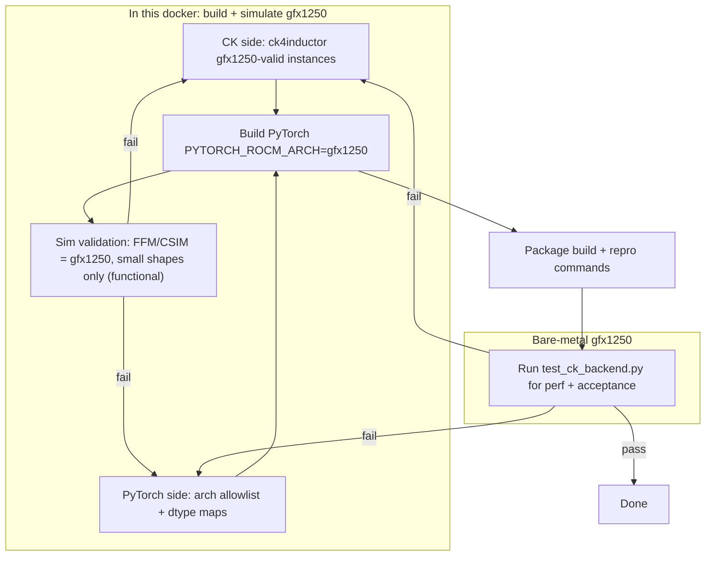

# AICK-1464 — [MI450] Enable CK backend for Inductor (gfx1250)

## Goal / acceptance criteria
From the ticket: `test/inductor/test_ck_backend.py::TestCKBackend` must pass on gfx1250 (MI450). PyTorch wants CK kernels (including TDM/gfx1250 features) as autotune candidates for `mm/addmm/bmm/scaled_mm/conv2d`.

## Guiding principle: keep the initial wiring LEAN (gfx950 PR #159195 scope)
- Match the size of the gfx950 enablement: PyTorch-side = arch allowlist + arch-conditional fp8 dtype maps + test enablement. Do NOT build new enumeration paths or large CK refactors for the first pass.
- Lean works because `ck4inductor` and Inductor degrade gracefully at every stage; the bar for "wired" is **at least one valid instance per exercised op** that parses, compiles, and survives benchmarking:
  - **Parse-time:** `parse_instances` wraps `CKGemmOperation(*args)` in `try/except TypeError` and `log.debug`s failures (PR #1796) — instances whose signature doesn't fit (e.g. the I4 weight-only-quant `*_i4_*` instances that are meaningless for Inductor) are silently dropped. Failures are only visible at DEBUG log level.
  - **Build-time / benchmark-time:** an instance that fails to compile or crashes during benchmarking is dropped/scored `+inf` (User Guide §6); the op still succeeds as long as one valid instance (or the `ATEN` fallback) remains.
- Implication: most effort is *inspection and confirmation* (read the DEBUG parse logs, confirm ≥1 instance per op), not new code. Only write code if an op ends up with zero valid gfx1250 instances.

Authoritative references (already fetched): JIRA AICK-1464, and Confluence MLSE pages "CK Backend for Inductor Max-Autotune" — [User Guide](https://amd.atlassian.net/wiki/pages/viewpage.action?pageId=1739593777), [Developer Guide](https://amd.atlassian.net/wiki/pages/viewpage.action?pageId=1739659708) (§7 = the gfx950 "new arch" precedent, PR #159195), and [SLURM env](https://amd.atlassian.net/wiki/pages/viewpage.action?pageId=1739625894).

## Execution constraints (environment split)
- ALL development, codegen, and builds happen **inside this gfx1250-enabled docker** (ROCm 7.13.0, AMD clang 23.0). PyTorch is built for the gfx1250 target (`PYTORCH_ROCM_ARCH=gfx1250`). The CK PyTorch backend is **not supported on the host's gfx1201 GPU**, so gfx1201 is not used as a build target or a verification device.
- The docker has **no physical gfx1250 device**, but gfx1250 kernels CAN be run in-docker via the **FFM/CSIM simulators** (`/dockerx/...csim+ffm-mi400-*`): DTIF functional models that present as **gfx1250/MI400**, so CK kernels execute and the arch gate engages **naturally (no allowlist hack)**. Source `ffm_mono_env.sh` (fast, 16-thread functional) or `csim_env.sh` (slower cycle model); then run any HIP/torch process and it executes on simulated gfx1250. Use the `rocdtif-7.13-...-r4.01` build to match the docker's ROCm 7.13.0 (`r5.01` is ROCm 7.14). CHANGELOG shows CK/WMMA fixes, so CK is exercised on these models.
  - LIMITS: **functional only, NOT timing-accurate** (perf-based autotune ranking is meaningless here — validates compile + numerical correctness), **very slow**, and **large tensors hang without warning**. Keep shapes tiny and cap instance counts.
- **Acceptance** — perf-based autotune and the final `test_ck_backend.py` pass/fail — happens on the **bare-metal gfx1250 machine**. The simulator validates correctness/codegen in-docker; bare metal is still required for the timing-dependent suite.

## Stream 1 — Environment (in this docker)
- Confirmed in-docker: ROCm 7.13.0, AMD clang 23.0. Validate a trivial `hipcc --offload-arch=gfx1250` compile succeeds so the gfx1250 toolchain is known-good before larger builds.
- Verify CK already recognizes the arch: `include/ck/ck.hpp` defines `__gfx125__`/`__gfx12__` for `__gfx1250__` and has gfx1250 workarounds (e.g. `CK_WORKAROUND_SWDEV_XXXXXX_GFX1250_NEG_OFFSET_ISSUE`). No new macro work expected here.
- The real gfx1250 device is reached in-docker only via the FFM/CSIM simulator (Stream 5); perf/acceptance is on bare metal.

## Stream 2 — CK side (`python/ck4inductor/`, this repo) — inspect first, code only if needed
The PyTorch backend imports `ck4inductor` for the instance database + headers. Per the lean principle, the goal is to *confirm* that each exercised op gets ≥1 valid gfx1250 instance through the existing graceful pipeline, and to maintain the Python parsing logic only where gfx1250 introduces new instance signatures.

### 2a. Parsing-logic maintenance (primary CK-side task)
- Run the existing generator test and inspect output: `pytest python/test/test_gen_instances.py` (added by PR #1796; asserts each `gen_ops_*` returns a non-empty list for gemm/preselected/conv/batched).
- Turn on DEBUG logging and inspect parse failures: the `try/except TypeError` in [`universal_gemm/gen_instances.py`](python/ck4inductor/universal_gemm/gen_instances.py) `parse_instances` (lines ~71-77) drops unparseable lines with `log.debug(f"{e} when parsing {line}")`. Capture these logs (e.g. `logging.basicConfig(level=logging.DEBUG)`) and confirm every dropped line is *expected* (e.g. `*_i4_*` weight-only-quant instances, which are meaningless for Inductor) and not a silently-lost gfx1250 instance we actually want.
- If gfx1250 brings WMMA universal-gemm instances with a different class name/signature than `DeviceGemm_Xdl_CShuffleV3` (the only string `gen_ops_library()` greps; the library also ships `device_gemm_wmma_universal_*`, see [`gemm_universal/CMakeLists.txt`](library/src/tensor_operation_instance/gpu/gemm_universal/CMakeLists.txt)), extend the grep/parse minimally — only if the classic `CK` backend would otherwise have zero valid gfx1250 instances. Otherwise leave it and let invalid XDL instances drop at build/benchmark time.

### 2b. Confirm per-op instance availability (lean validation)
- `CK` (classic universal gemm): `python -c "from ck4inductor.universal_gemm.gen_instances import gen_ops_library; print(len(gen_ops_library()))"` — confirm > 0 after parsing, then that ≥1 compiles for gfx1250.
- `CKTILE`: [`ck_tile_universal_gemm/gen_instances.py`](python/ck4inductor/ck_tile_universal_gemm/gen_instances.py) hardcodes `warp_tile=(32,32,16)`; confirm at least one fp16/bf16 instance compiles and runs on gfx1250 (sim). Only add gfx1250-specific instances if none survive.
- `grouped_conv_fwd`: confirm ≥1 instance for conv2d fwd.
- Acceptance for this stream is graceful: zero-instance for an op is the only true failure; a partially-dropped instance set is fine.
- Compile-validate in docker: hand-compile one surviving instance with `hipcc --offload-arch=gfx1250`; run it under the FFM simulator (Stream 5). Perf/acceptance is deferred to bare metal.
- Bump `__init__.py` `rocm_version` only if needed for the wheel/pin.

## Stream 3 — PyTorch side (clone `pytorch/pytorch`, gfx950 precedent PR #159195)
Apply the same shape of change as gfx950. Files (paths on `pytorch/pytorch` main):
- `torch/_inductor/config.py` — add `"gfx1250"` to `class rocm.ck_supported_arch` (default `["gfx90a","gfx942","gfx950"]`). This is the master gate via `use_ck_template` in `torch/_inductor/utils.py`.
- FP8 dtype maps — gfx1250 (gfx12) uses standard OCP fp8 (`float8_e4m3fn`/`float8_e5m2`), like gfx950, NOT the gfx94x `fnuz` variants. Make selection arch-conditional (treat gfx1250 like gfx950) in `torch/_inductor/codegen/rocm/ck_template.py` (`torch_type_to_ck`), `ck_tile_template.py`, and `rocm_utils.py` (`DTYPE_TO_ROCM_TYPE`). Confirm the actual gfx1250 fp8 convention against CK headers before finalizing.
- Tests: `test/inductor/test_ck_backend.py` — extend the parametrized matrix / arch-conditional skips so gfx1250 runs (mirror the gfx950 entries).
- (CI, optional/follow-up) bump `.ci/docker/ci_commit_pins/rocm-composable-kernel.txt` to a CK commit that includes the Stream-2 changes so the `ck4inductor` wheel built by `.ci/pytorch/rocm_utils.sh` ships gfx1250 instances.

## Stream 4 — Build (in docker, for gfx1250)
- Clone PyTorch recursively; install `ck4inductor` from this branch (`pip install --no-build-isolation .` from the CK repo root, or `export TORCHINDUCTOR_CK_DIR=<ck source>`), per Developer Guide §10.1.
- Build PyTorch from source for the gfx1250 target: `python tools/amd_build/build_amd.py && PYTORCH_ROCM_ARCH=gfx1250 python -m pip install --no-build-isolation -v -e .`. This completes in-docker even though no physical gfx1250 device is present.
- Python-only and codegen-render checks that don't need a device can run here (e.g. instance enumeration, `use_ck_template` gating with a forced arch, kernel source generation), to catch errors before simulator/hardware.

## Stream 5 — In-docker gfx1250 validation via FFM simulator (functional)
Primary in-docker correctness gate. The simulator presents as gfx1250, so the real arch path (allowlist + dtype maps + instance selection) is exercised end-to-end — the closest thing to hardware short of bare metal.
- Pick the ROCm-matched build: `/dockerx/rocdtif-7.13-csim+ffm-mi400-r4.01` (matches docker ROCm 7.13.0). Source `ffm_mono_env.sh` for the fast functional model (`csim_env.sh` only if the cycle model is needed). This sets `HSA_ENABLE_DTIF=1`, `TEST_ASIC=mi400`, and the model `LD_LIBRARY_PATH`.
- Sanity-check the model first with a bundled HIP example (e.g. `tests/suites/hip-examples/HelloWorld`) to confirm the simulated gfx1250 device is visible to HIP/torch.
- Run a **single small** autotuned `mm`/`addmm` (e.g. M=N=K=64–256; User Guide §7 example) under the sim with `TORCH_LOGS="+inductor"`, `rocm.ck_max_profiling_configs=1–2`, `rocm.ck_tile_max_profiling_configs=1–2`, `compile_threads` low. Confirm `rocm_ck_*`/`rocm_ck_tile_*` choices compile, run, and match a reference (`torch.testing.assert_close`).
- HARD CONSTRAINT: keep tensors tiny and instance counts minimal — large tensors hang the simulator with no warning, and each kernel is slow. Set a wall-clock watchdog/timeout around sim runs so a hang is detected rather than blocking indefinitely.
- Optionally run a curated, down-sized subset of `test_ck_backend.py` cases (small shapes only) to shake out per-op codegen (scaled_mm/fp8, bmm, conv2d). Treat sim results as correctness evidence, NOT performance/acceptance.

## Stream 6 — Hardware verification (bare-metal gfx1250)
- IMPORTANT: bare metal does **not** reuse the docker build artifacts. The **full install and build phases are repeated from source on the bare-metal gfx1250 machine** — this is intentional, to verify the end-to-end install/build/test flow on real hardware.
- Hand off **source + branches/commits + exact commands** (not prebuilt wheels/editable trees): the CK branch (`ck4inductor` source) and the PyTorch fork/branch with the gfx1250 patches, pinned to known commits.
- On bare-metal gfx1250, repeat Streams 2–4 from scratch:
  - Clone PyTorch recursively; install `ck4inductor` from the CK branch (`pip install --no-build-isolation .`, or `TORCHINDUCTOR_CK_DIR`), per Developer Guide §10.1.
  - Build PyTorch from source: `python tools/amd_build/build_amd.py && PYTORCH_ROCM_ARCH=gfx1250 python -m pip install --no-build-isolation -v -e .`.
- Then run the suite:
  - `export TORCHINDUCTOR_MAX_AUTOTUNE=1`
  - `TORCH_LOGS="+inductor" pytest test/inductor/test_ck_backend.py::TestCKBackend -v -s`
  - Fast-iteration knobs: `rocm.ck_max_profiling_configs=8`, `rocm.ck_tile_max_profiling_configs=8`, `compile_threads=16`.
- Confirm `rocm_ck_*` / `rocm_ck_tile_*` rows appear (User Guide §5). Feed any failure back into the shared source fixes (Stream 2/3), then re-clone/re-install/rebuild on both docker and bare metal, until the suite passes (acceptance criteria).

## Open questions to resolve during execution
- Does the classic `CK` backend end up with zero valid gfx1250 instances (XDL-only grep) so that minimal WMMA grep/parse is actually required, or do `CKTILE`/conv already cover the suite? Decide from the parse logs + sim runs; stay lean and only extend parsing if an op has zero instances.
- Exact gfx1250 fp8 variant (OCP vs fnuz) — verify against CK `ck.hpp`/fp8 headers, not just analogy to gfx950.
- Simulator shape ceiling: what is the largest problem size that runs without hanging under FFM/CSIM? Establish a safe small-shape budget empirically (start tiny, grow until it slows/hangs).
- Use `ffm_mono` (fast) vs `csim` (cycle) for validation? Default to `ffm_mono`; fall back to `csim` only if a kernel misbehaves and needs the more detailed model.
- Bare metal repeats the full install/build from source (decided). Confirm only how source/branches reach the machine (git access vs shared filesystem) and that the bare-metal ROCm matches what the gfx1250 build expects.

## Deliverables
- CK PR (this repo, branch `users/andriy/ck/1464-pytorch-gfx1250`): ck4inductor gfx1250 instance support + validation.
- PyTorch PR: gfx1250 allowlist + dtype maps + test enablement (gfx950 #159195 pattern).
- Evidence: `test_ck_backend.py::TestCKBackend` passing on the bare-metal gfx1250 machine.

---

# IMPLEMENTATION FINDINGS (updated post-implementation)

Artifacts on this machine: `/dockerx/aick-1464/` (`HANDOFF.md`, `run_sim_validate.sh`, `sim_validate.py`).
PyTorch worktree: `/dockerx/repos/pytorch` on branch `andriy/ck_inductor_gfx1250`.

## Status summary
- DONE in-docker: environment + toolchain, CK-side analysis, all PyTorch source changes,
  full gfx1250 build (aten CK enabled), and simulator validation that the CK backends engage
  and the classic CK kernel compiles to gfx1250 device code.
- BLOCKED for full end-to-end pytest in-docker: Triton (Inductor scheduler dependency) — no
  ROCm 7.13 / gfx1250 Triton wheel available. Acceptance run is on bare-metal gfx1250.
- FOLLOW-UP: CK-Tile (CKTILE) needs a PyTorch template update (API lag, see below).

## Environment (confirmed)
- Docker: ROCm 7.13.0, AMD clang 23.0; cross-builds for `--offload-arch=gfx1250`.
- Host GPU is gfx1201 (CK PyTorch backend unsupported there — not used).
- FFM simulator `/dockerx/rocdtif-7.13-csim+ffm-mi400-r4.01` presents as **gfx1250/mi450**
  under `ffm_mono_env.sh` — the CK arch gate engages naturally. Functional only; small shapes.

## Key correction: classic CK ("XDL") WORKS on gfx1250 — do NOT drop it
- CK CMake enables `_xdl` (and `gemm_xdl_universal _f8_`) instances for **gfx9/gfx11/gfx12**
  (`library/src/tensor_operation_instance/gpu/CMakeLists.txt` L66-67, L92).
- Proven: an XDL universal-gemm instance AND the inductor-generated `rocm_ck_gemm_template`
  both compile to a gfx1250 `.so` with an embedded `amdgcn-amd-amdhsa--gfx1250` `.hip_fatbin`.
- So Stream 2's "WMMA grep" concern is moot — the existing `DeviceGemm_Xdl_CShuffleV3` grep
  is correct; classic CK is retained for gfx1250.

## CK-side parsing (`ck4inductor`): healthy, no change needed
- `gen_ops_library()` enumerates **5224** instances. Parse drops are benign and expected:
  36 I4 weight-only-quant (`*_i4_*`) + 4 extended-bf16 signatures, dropped by the PR #1796
  `try/except TypeError`. Confirmed via DEBUG logs.

## ROOT CAUSE of build issues: CK version fragmentation (three CKs)
PyTorch consumes CK from three places; two were pinned pre-gfx1250:
1. `third_party/composable_kernel` submodule -> eager-mode aten CK GEMM/SDPA
   (`aten/src/ATen/native/hip/ck_gemm*`, `ck_bgemm*`, `bgemm_kernels/`,
   `.../transformers/hip/flash_attn/ck/`; gated by `USE_ROCM_CK_GEMM/SDPA`).
   Was `fdf4bb7` (Apr 2026, NO gfx1250) -> `CK_BUFFER_RESOURCE_3RD_DWORD` undefined -> bgemm fails.
2. `ck4inductor` wheel, pinned by `.ci/docker/ci_commit_pins/rocm-composable-kernel.txt`
   -> Inductor classic CK headers. Was `4266f867` (Feb 2026, NO gfx1250).
3. system `/opt/rocm/include/ck_tile` -> Inductor CK-Tile (ck4inductor ships only `ck/`, NOT `ck_tile/`).

### Fix applied (the right fix, not a workaround): bump CK to ONE gfx1250-capable commit
- Submodule `fdf4bb7 -> 713f1fbf` (develop tip, Jun 24 2026; gfx1250 in `__gfx12__`).
- `.ci/.../rocm-composable-kernel.txt -> 713f1fbf` (unifies #1 and #2 to one commit).
- aten eager CK stays ENABLED for gfx1250 and now builds (verified: bgemm kernels compile,
  no `CK_BUFFER` errors). aten CK uses the API-stable classic CK API
  (`DeviceGemmMultiD_Xdl_CShuffle_V3`, `DeviceGemmWmma_CShuffle`).
- (An earlier interim workaround that DISABLED `USE_ROCM_CK_GEMM/SDPA` for gfx1250 in
  `CMakeLists.txt` was REVERTED in favor of the version bump.)

## PyTorch-side changes (final, branch `andriy/ck_inductor_gfx1250`)
Intentional diff (6 items); everything else in the tree is HIPify (`build_amd.py`) noise — do not commit:
- `third_party/composable_kernel` submodule bump (`fdf4bb7 -> 713f1fb`).
- `.ci/docker/ci_commit_pins/rocm-composable-kernel.txt -> 713f1fbf`.
- `torch/_inductor/config.py`: add `gfx1250` to `rocm.ck_supported_arch`.
- `torch/_inductor/codegen/rocm/ck_template.py`, `ck_tile_template.py`: fp8 OCP dtype docs
  (the OCP entries `float8_e4m3fn`/`float8_e5m2` were ALREADY present from gfx95, so gfx1250
  needs NO functional dtype-map change; `rocm_utils.py` already had them too). LEANER than gfx950.
- `test/inductor/test_ck_backend.py`: add `gfx12` to the scaled_mm arch gate (OCP dtype already
  selected for non-gfx94).

## CK-Tile (CKTILE): version bump is NOT sufficient — template API lag
- `ck4inductor` does not ship `ck_tile`; the Inductor CK-Tile template compiles against system ROCm `ck_tile`.
- The template (`torch/_inductor/codegen/rocm/ck_tile_universal_gemm_template.py`) emits
  `ck_tile::UniversalGemmPipelineProblem<ADataType, BDataType, AccDataType, GemmShape, Traits,
  scheduler, has_hot_loop_v, tail_number_v>`, but current ck_tile changed the signature to
  tuple data types with the 7th param now a TYPE (`AElementWise_`) -> "template argument must be
  a type". System 7.13 ck_tile had the old API (compiled past) but failed in
  `block_gemm_areg_breg_creg_v1.hpp` for the gfx1250 32x32x16/CompV3 config.
- CONCLUSION: CK-Tile gfx1250 needs the PyTorch CK-Tile template updated to the new ck_tile API
  (and ideally ck4inductor shipping `ck_tile`). Follow-up; classic CK carries gfx1250 GEMM now.

## Triton blocker (end-to-end pytest)
- Inductor's GPU scheduler requires Triton; full `test_ck_backend.py` raises `TritonMissing` without it.
- Pin is triton 3.7.1 `f797708c`; no matching `pytorch-triton-rocm` wheel for ROCm 7.13/gfx1250.
- On bare metal use a ROCm PyTorch image that ships `pytorch-triton-rocm`, or build Triton from the pin.
- Independent of the CK backend wiring; the CK codegen/compile was validated without it.

## Open questions — resolved
- Classic CK zero-instances / WMMA grep needed? RESOLVED: No. XDL instances compile to gfx1250
  device code; keep the existing grep; classic CK retained.
- gfx1250 fp8 variant OCP vs fnuz? RESOLVED: OCP (`float8_e4m3fn`/`float8_e5m2`), already in the maps.
- Simulator: `ffm_mono` used; small shapes (M=N=K=64) to avoid hangs; wall-clock watchdog in `run_sim_validate.sh`.
- Bare-metal handoff: source+branches+commands (see `HANDOFF.md`), repeat full build from source.