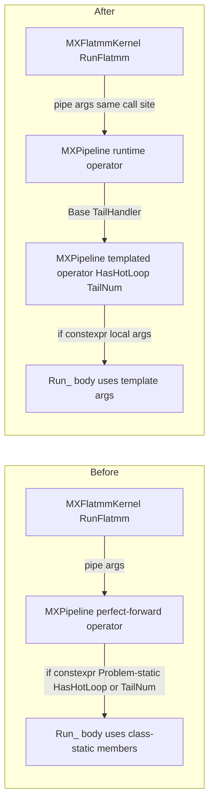

## Goal

Eliminate the asymmetry between non-MX and MX FLATMM pipelines. The non-MX side already runtime-dispatches `(HasHotLoop, TailNum)` inside the pipeline ([flatmm_pipeline_agmem_bgmem_creg_v1.hpp:1024-1043](include/ck_tile/ops/flatmm/pipeline/flatmm_pipeline_agmem_bgmem_creg_v1.hpp)), which is why `GroupedFlatmmKernel` needs no special handling. Mirror that pattern in the MX pipeline so `GroupedMXFlatmmKernel` and its tests become equally simple.

## Architecture change



## Changes

### 1. [include/ck_tile/ops/flatmm/pipeline/mx_flatmm_pipeline_agmem_bgmem_creg_v1.hpp](include/ck_tile/ops/flatmm/pipeline/mx_flatmm_pipeline_agmem_bgmem_creg_v1.hpp)

**1a. Parameterize `Run_` on `(HasHotLoop_, TailNum_)`** at [line 605](include/ck_tile/ops/flatmm/pipeline/mx_flatmm_pipeline_agmem_bgmem_creg_v1.hpp). Add two leading template params with defaults from the class-static members for backward compat:

```cpp
template <bool HasHotLoop_ = HasHotLoop,
          ck_tile::TailNumber TailNum_ = TailNum,
          typename ADramBlockWindowTmp,
          typename BFlatBlockWindowTmp,
          typename ScaleADramBlockWindowTmp,
          typename ScaleBDramBlockWindowTmp>
CK_TILE_DEVICE auto Run_(const ADramBlockWindowTmp& a_copy_dram_window_tmp, ...)
```

**1b. Replace the four class-static references in `Run_`'s body** with the local template args:
- [line 818](include/ck_tile/ops/flatmm/pipeline/mx_flatmm_pipeline_agmem_bgmem_creg_v1.hpp): `if constexpr(HasHotLoop || TailNum == TailNumber::Even)` -> `if constexpr(HasHotLoop_ || TailNum_ == TailNumber::Even)`
- [line 1090](include/ck_tile/ops/flatmm/pipeline/mx_flatmm_pipeline_agmem_bgmem_creg_v1.hpp): `if constexpr(HasHotLoop)` -> `if constexpr(HasHotLoop_)`
- [line 1100](include/ck_tile/ops/flatmm/pipeline/mx_flatmm_pipeline_agmem_bgmem_creg_v1.hpp): `if constexpr(TailNum == TailNumber::Even)` -> `if constexpr(TailNum_ == TailNumber::Even)`
- [line 1207](include/ck_tile/ops/flatmm/pipeline/mx_flatmm_pipeline_agmem_bgmem_creg_v1.hpp): `else if constexpr(TailNum == TailNumber::Odd)` -> `else if constexpr(TailNum_ == TailNumber::Odd)`

The class-static `HasHotLoop` / `TailNum` (lines 156-157) stay as defaults; they continue to feed the existing single-problem test fixture.

**1c. Replace the perfect-forwarding `operator()(Args&&...)`** at [line 583-602](include/ck_tile/ops/flatmm/pipeline/mx_flatmm_pipeline_agmem_bgmem_creg_v1.hpp) with an explicit templated overload that takes an `AElementFunction` arg (the discriminator vs. the runtime overload below). The body forwards the template args into `Run_`:

```cpp
template <bool HasHotLoop_, ck_tile::TailNumber TailNum_,
          typename ADram, typename AElementFunction, typename BFlat,
          typename ScaleA, typename ScaleB>
CK_TILE_DEVICE auto operator()(const ADram& a, const AElementFunction& a_fn,
                               const BFlat& b, const ScaleA& sa, const ScaleB& sb,
                               index_t num_loop, void* p_smem) const
{
    auto c_warp_tensors = Run_<HasHotLoop_, TailNum_>(
        a, b, sa, sb, num_loop, p_smem);
    // ... existing register-tile-to-block-tile reduction (lines 588-602) ...
}
```

The `a_fn` arg is currently unused in the MX `Run_` data path (it would apply pre-bit_cast). Plumbing it into `Run_` is out of scope; this signature only exists as the dispatch target.

**1d. Add the new runtime-dispatching overload** (mirrors [non-MX lines 1024-1043](include/ck_tile/ops/flatmm/pipeline/flatmm_pipeline_agmem_bgmem_creg_v1.hpp)):

```cpp
template <typename ADram, typename BFlat, typename ScaleA, typename ScaleB>
CK_TILE_DEVICE auto operator()(const ADram& a, const BFlat& b,
                               const ScaleA& sa, const ScaleB& sb,
                               index_t num_loop, void* p_smem) const
{
    const bool h = Base::BlockHasHotloop(num_loop);
    const auto t = Base::GetBlockLoopTailNum(num_loop);
    return Base::TailHandler(
        [&](auto h_, auto t_) {
            return operator()<h_.value, t_.value>(
                a, [](const ADataType& x) { return x; }, b, sa, sb, num_loop, p_smem);
        },
        h, t);
}
```

`Base` resolves transitively through `FlatmmPipelineAGmemBGmemCRegV1` to `BaseFlatmmPipelineAGmemBGmemCRegV1`, which provides `BlockHasHotloop` / `GetBlockLoopTailNum` / `TailHandler`.

### 2. [include/ck_tile/ops/flatmm/kernel/mx_flatmm_kernel.hpp](include/ck_tile/ops/flatmm/kernel/mx_flatmm_kernel.hpp)

**No change.** The existing call site at [line 339-344](include/ck_tile/ops/flatmm/kernel/mx_flatmm_kernel.hpp) uses 6 args (no `AElementFunction`), so it naturally binds to the new runtime-dispatching overload. The kernel binary now contains all 4 pipeline variants - same total kernel codegen as Fix B today, just located inside the pipeline instead of the test fixture.

### 3. [test/ck_tile/grouped_gemm_mx/test_grouped_gemm_mx_flatmm_util.hpp](test/ck_tile/grouped_gemm_mx/test_grouped_gemm_mx_flatmm_util.hpp)

**Revert Fix B's scaffolding** in the `Run()` method:

- Remove the `using GemmPipelineProblem = ...` and `using BaseFlatmmPipeline = ...` aliases.
- Remove the `compute_class` lambda and the per-group same-class assertion loop.
- Remove the `BaseFlatmmPipeline::template TailHandler<true>(...)` wrapper and the `#pragma clang diagnostic` block.
- Restore the kernel build/launch as straight inline code: one `MXFlatmmPipelineProblem`, one `Kernel` type, one `launch_kernel` call.
- Change the (now-irrelevant) `MXFlatmmPipelineProblem` template args from `(true, TailNumber::Even)` to `(true, TailNumber::Full)` (library defaults) and add a one-line comment that these template args are no longer load-bearing - the pipeline dispatches at runtime regardless.
- Drop the `num_loop`/`HasHotLoop`/`TailNum` fields from the launch log line.

### 4. [test/ck_tile/grouped_gemm_mx/test_grouped_gemm_mx_flatmm_ut_cases.inc](test/ck_tile/grouped_gemm_mx/test_grouped_gemm_mx_flatmm_ut_cases.inc)

**Restore mixed-K coverage**, replacing the 8 class-specific cases with 4 broader cases that span all 4 classes within and across calls:

- `Basic_4Groups` - K = `{256, 512, 768, 1024}` (one K per class, hits all 4 in one call).
- `Single_Group` - K=512 (the simplest non-trivial size).
- `Two_Groups_Same_Size` - K=256 (Class A, smallest-K boundary; was Fix B's worst-case 4x overshoot).
- `Eight_Groups` - K cycling through `{256, 512, 768, 1024, 1280, 1536, 1792, 2048}` (every class hit, deeply mixed).

The runtime dispatch in the pipeline handles each group's K independently, so mixing classes inside one call is now valid and tested.

## Build cost impact

- Grouped MX kernel binary: 4x per type (unchanged from Fix B).
- **Single-problem MX kernel binary: grows roughly 4x in kernel code size.** Today each pre-compiled instance .o contains 1 pipeline variant chosen by `Problem::HasHotLoop` / `Problem::TailNum`; after the refactor each .o contains all 4 pipeline variants (the runtime overload's `TailHandler` always compiles all permutations). Wall-clock impact is bounded by the slowest .o in the parallel build. Architecturally this matches what the non-MX FLATMM side already does today.
- Test fixture LoC: roughly -80 lines.
- Class invariant: no longer needed at any layer.

### Correctness audit (Problem-static vs template-arg divergence)

After the refactor, `Problem::HasHotLoop` and `Problem::TailNum` survive only as default values for the new template params on `Run_` and the templated `operator()`. A full audit confirmed there is no other place in the MX pipeline body, its policy ([mx_flatmm_pipeline_agmem_bgmem_creg_v1_policy.hpp](include/ck_tile/ops/flatmm/pipeline/mx_flatmm_pipeline_agmem_bgmem_creg_v1_policy.hpp)), the kernel ([mx_flatmm_kernel.hpp](include/ck_tile/ops/flatmm/kernel/mx_flatmm_kernel.hpp)), or any external caller (workspace-wide `::HasHotLoop` / `::TailNum` search returns 0 hits against any flatmm pipeline class) that reads the class-statics. SMEM size, tile distributions, layouts, and scheduler helpers (`HotLoopScheduler`, `Last2ndHotLoopScheduler`, `LastHotLoopScheduler`) are all independent. Divergence between the template args passed to `Run_` and the values stored on `Problem` is therefore harmless.

## Validation

1. **Single-problem MX FLATMM tests** ([test/ck_tile/flatmm/test_mx_flatmm_*.cpp](test/ck_tile/flatmm/test_mx_flatmm_fp8fp8.cpp)) must continue to pass - they use the existing TailHandler-at-fixture pattern with explicit `MXFlatmmPipelineProblem<..., HasHotLoop, TailNum>` instantiations. Default template args on the new templated `operator()` (defaulting to class-static `HasHotLoop` / `TailNum`) preserve this path.
2. **Grouped MX FLATMM tests** - rebuild both `test_ck_tile_grouped_gemm_mx_flatmm_non_tdm` and `test_ck_tile_grouped_gemm_mx_flatmm_tdm`, run on FFM simulator, expect all tests pass (same green status as Fix B, but now covering mixed-K cases instead of class-segregated cases).
3. **Visual confirmation** that runtime dispatch is firing: the `Two_Groups_Same_Size {256, 256}` case (Class A, K=256) was the case Fix B's hardcoded `(true, Even)` got most wrong (4x overshoot). If it passes after the pipeline refactor, runtime dispatch is engaged for every group.

## Out of scope (deferred)

- Refactoring the single-problem MX test fixture to drop its outer TailHandler (now redundant). Mechanical cleanup, separate PR.
- `GroupedMXFlatmmKernel` vs `GroupedFlatmmKernel` duplication noted in the earlier /ck-analyze (would need a `GroupedFlatmmDispatcher<UnderlyingKernel>` refactor).
- Wiring `AElementFunction` into MX `Run_`'s data path. Currently `Run_` does not transform A elements; the `AElementFunction` arg is purely a signature discriminator.

## Files touched (3)

- [include/ck_tile/ops/flatmm/pipeline/mx_flatmm_pipeline_agmem_bgmem_creg_v1.hpp](include/ck_tile/ops/flatmm/pipeline/mx_flatmm_pipeline_agmem_bgmem_creg_v1.hpp) - pipeline refactor (about +30 LoC, modified 5 lines in body).
- [test/ck_tile/grouped_gemm_mx/test_grouped_gemm_mx_flatmm_util.hpp](test/ck_tile/grouped_gemm_mx/test_grouped_gemm_mx_flatmm_util.hpp) - revert Fix B scaffolding (about -80 LoC).
- [test/ck_tile/grouped_gemm_mx/test_grouped_gemm_mx_flatmm_ut_cases.inc](test/ck_tile/grouped_gemm_mx/test_grouped_gemm_mx_flatmm_ut_cases.inc) - replace 8 class-specific cases with 4 mixed-K cases.

No CMake change. No kernel header change.