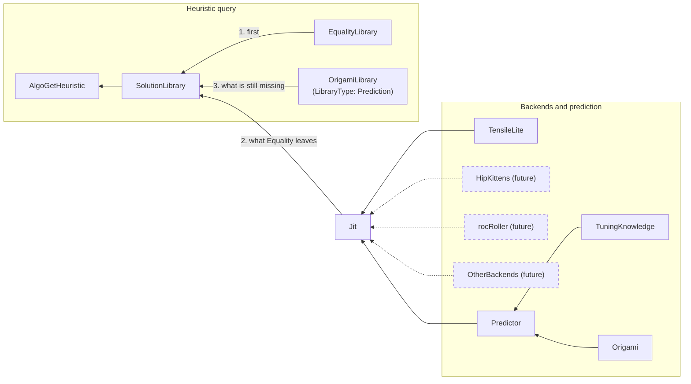

# hipBLASLt just-in-time (JIT) GEMM generation

This source guide describes just-in-time (JIT) kernel generation for general
matrix multiplication (GEMM) in hipBLASLt. It is written for hipBLASLt and
TensileLite contributors and integration developers, and it is maintained under
the existing @ROCm/hipblaslt-reviewers and @ROCm/hipblaslt-docs-reviewers rules
in [.github/CODEOWNERS](../../.github/CODEOWNERS). It is not a released
application programming interface (API) or support statement. Release-document
integration is undecided.

This page is the single JIT guide and carries the roadmap. It has three parts:

- [Current behavior](#current-behavior) describes what the code implements
  today. "Implemented" means present in the source, not released or approved
  as product naming.
- [Target design](#target-design) is the approved plan of record. The six
  roadmap steps implement it; the work listed after the roadmap remains future.
- [Roadmap](#roadmap) lists the implementation steps between the two, with the
  status of each.

The [TensileLite backend guide](JIT_TENSILELITE.md) covers the TensileLite
generator and its current direct entry point. The
[single-solution guide](tensilelite/SINGLE_SOLUTION.md) covers the Python
builder, recipes, bundles and ranked candidate validation. The
[JIT test guide](clients/tests/jit/README.md) covers building and running the
tests. The [design notes](jit-design/README.md) hold the KernelFromAnywhere
(KFA) assessment and the timing/progress plans.

## Summary

Applications reach JIT generation through the existing heuristic query. In a
build with `HIPBLASLT_ENABLE_JIT=ON`, the environment variable `HIPBLASLT_JIT`
lets `hipblasLtMatmulAlgoGetHeuristic`, `GemmInstance::algoGetHeuristic` and
`hipblasLtMatmul` without an algorithm return solutions from a persistent JIT
solution library on disk. Solutions that the library lacks are generated
through TensileLite, published into it, and returned by solution index, so any
later process runs them without generating again. In fallback mode JIT is
consulted after the pre-tuned Equality results and before the other pre-tuned
libraries; in forced mode JIT is the only source.
See [heuristic integration](#heuristic-integration).

The JIT test binaries also call internal entry points directly: they pass GEMM
descriptors, hipBLASLt compiles one solution through TensileLite, and the test
passes the returned algorithm to `hipblasLtMatmul` or `hipblaslt_ext::Gemm`, or
publishes generated solutions into the JIT solution library. These entry points
are not part of the public API. The separate, existing rocRoller integration
has its own runtime generation path and can compile during normal library use.

## Current behavior

### Entry points

Two internal JIT entry points exist. Both generate through the Jit component
with the TensileLite backend, share one process-local algorithm registry, and
return an algorithm for the existing C/C++ GEMM execution APIs.

| Entry point | Header | Behavior |
| --- | --- | --- |
| Direct TensileLite | `library/src/amd_detail/hipblaslt-jit-tensilelite.hpp` | `hipblaslt_ext::experimental::jit::tensilelite::getGemmAlgo` compiles one required, explicit YAML (YAML Ain't Markup Language) recipe and returns a `hipblasLtMatmulHeuristicResult_t`. The `hipblaslt-jit-direct-gemm-test` binary exercises it. See the [TensileLite backend guide](JIT_TENSILELITE.md). |
| Generic request/backend/solution | `library/src/amd_detail/hipblaslt-jit.hpp` | `jit::tensilelite::createBackend` returns a `Backend` handle that owns a Jit configured with the TensileLite backend. `jit::makeGemmRequest` captures existing GEMM descriptors and host scalars, `jit::getJitAlgo` compiles on the selected device and returns an owned `Solution`, and `jit::getGemmAlgo` adapts it to the algorithm accepted by `hipblasLtMatmul` and `Gemm`. The `hipblaslt-jit-generic-gemm-test` binary exercises it. `jit::getLibraryAlgos` instead returns solution indices from the [JIT solution library](#persistent-solution-library), generating and publishing the solutions it lacks; `hipblaslt_ext::getAlgosFromIndex` turns them into algorithms. |

Both headers are internal, as are `hipblaslt-jit-mock.hpp` and
`hipblaslt-jit-gemm-internal.hpp`: they are not installed and
`hipblaslt-ext.hpp` does not include them. `libhipblaslt.so` exports seven
functions and one type from them with `HIPBLASLT_EXPORT` for the JIT test
binaries, which link against the shared library: `jit::makeGemmRequest`,
`jit::getJitAlgo`, `jit::getGemmAlgo`, `jit::getLibraryAlgos`,
`jit::tensilelite::createBackend`, `jit::tensilelite::getGemmAlgo`,
`jit::mock::createBackend`, and the `jit::detail::GemmRequest` request type.
No installed header declares them, and they are not a supported API.

For these entry points, Python, compiler, recipe and output paths belong to the
TensileLite backend's `tensilelite::Options`; heuristic queries use the
[built-in tool paths](#tool-paths-and-scratch-files) instead. The application
owns its buffers and workspace. The
request owns descriptor values and host scalars; it does not take ownership of
device pointers. Compilation and support checks finish before graphics
processing unit (GPU) work is submitted; call the entry points before stream
capture. The Jit interfaces are for
compiled-in implementations and do not establish a stable external plugin
application binary interface (ABI). GEMM is the implemented operation; an
attention request adapter and backend remain future work.

Internally, the GEMM request reuses `RocblasltContractionProblem` with owned
scalar values. The generic `Solution` and private `CompiledSolution` retain
the Jit, device target, request, workspace and bundle lifetime around the
existing GEMM support and execution machinery. A matmul algorithm is an
adaptation token, not a general owning executable object.

### Components

| Component | Current input, output and connection |
| --- | --- |
| One-solution builder | One recipe and target produce a source bundle through `Tensile.SingleSolution --source-only` and the existing TensileLite generators and validators: the main kernel assembly, the helper HIP source and its headers, and the one-solution library entry. It builds no code objects in this mode. |
| Ranked recipe selector | Supplied candidates and problem facts produce validated recipes or rejection reasons. `Tensile.JitGemm` calls the builder without running a model, and publishes the first `requested_solutions` accepted candidates (default 1) that `exclude_kernel_names` does not name, each with a different kernel. It compares the kernel names that the published library uses. |
| Jit | `hipblaslt-jit-component.{hpp,cpp}`. For one request and device target, `Jit::generate` runs the predictor when the backend consumes a prediction, asks the backend for solutions in a private scratch directory, builds each solution's code objects, checks support, and loads the supported ones as process-local bundles. With a solution store, it publishes them instead and loads them only when publishing fails; `getLibraryAlgos` configures the JIT solution library as the store. Each failure records its stage (configure, predict, generate, build, support, load or publish), and `getJitAlgo` reports the first one. The scratch directory is removed on success and kept after a failure that left files in it. |
| TensileLite backend | `hipblaslt-jit-tensilelite.cpp`. It writes the `Tensile.JitGemm` request from the prediction, or passes an explicit recipe through, runs the generator with `--source-only`, and returns each published bundle's library entry, main kernel assembly and helper source. It builds and loads nothing. |
| Origami predictor | `hipblaslt-jit-origami-predictor.cpp` expands the tuning knowledge's candidate seeds across the target's matrix instructions, ranks them with Origami, and emits the `origami.gemm.dp.v1` modeled contract (workgroup mapping, stagger and launch outputs) that the TensileLite backend forwards to `Tensile.JitGemm`. Jit runs it only when no explicit recipe is configured. |
| TensileLite defaults | `hipblaslt-jit-tensilelite-defaults.cpp` is the tuning knowledge: 11 tile shapes, two DepthU rules, and cache hints that are only the defaults on gfx90a and gfx1250. It supplies no values for unmodeled knobs, which keep Tensile's defaults. |
| Code-object builder | `hipblaslt-jit-builder.cpp` over `hipblaslt-jit-code-object.cpp`. The comgr builder assembles the main kernels, compiles the helper source and links both into one raw executable code object for the device's target ID, then checks that the object targets that ID and defines the entry's kernel. See [code-object construction with comgr](#code-object-construction-with-comgr). |
| Loader | `hipblaslt-jit-loader.cpp`. It reads source bundles by directory convention for the backends. The Tensile loader parses the entry, checks support and workspace with TensileLite's predicates, and loads the code object into a `TensileBundle`. |
| JIT solution library | `hipblaslt-jit-library.cpp`, with `hipblaslt-jit-msgpack.cpp` writing the library files and `hipblaslt-jit-fs.cpp` providing the directory checks, file lock and atomic replacement. It publishes built solutions as a standard lazy TensileLite library on disk, looks them up by exact problem, and resolves their reserved solution indices for `tensile_host.cpp`. See [persistent solution library](#persistent-solution-library). |
| Direct entry point and test | An explicit recipe and GEMM descriptors produce a checked algorithm. `hipblaslt-jit-direct-gemm-test` exercises C/C++ execution independently of the generic entry point. |
| Generic entry point and adapters | `makeGemmRequest`, `getJitAlgo` and `getGemmAlgo` connect Jit to existing execution. `hipblaslt-jit-generic-gemm-test` covers this flow. |
| Heuristic integration | `hipblaslt-jit-mode.cpp` reads `HIPBLASLT_JIT`. `hipblaslt-jit-tensilelite.cpp` configures one Jit per process from the built-in tool paths, with the JIT solution library as its store, and `hipblaslt-jit-backend.cpp` looks a problem up in that library and generates what it lacks. `hipblaslt-jit-report.cpp` prints failures. `rocblaslt_auxiliary.cpp` calls them from both heuristic queries, and `tensile_host.cpp` from `hipblasLtMatmul` without an algorithm. See [heuristic integration](#heuristic-integration). |
| Benchmark | `hipblaslt-bench` has no JIT option. With `HIPBLASLT_JIT=2`, its ordinary heuristic query returns generated solutions, so selection and compilation finish before correctness checks and execution timing. See the [benchmark guide](clients/bench/README.jit.md). |
| Mock backend | `hipblaslt-jit-mock-backend.cpp` replays one source bundle that `Tensile.SingleSolution` or `Tensile.JitGemm` wrote, without Python or a subprocess, for problems and devices that the replayed solution's predicates accept; the comgr builder still builds it. Its faults fail generation, replace the main kernel assembly with an invalid instruction so the build fails, or abort the process. Tests reach it through `jit::mock::createBackend` in `hipblaslt-jit-mock.hpp`; it is not a production backend. |

The host runs the Python generator as a child process: POSIX spawning on Linux
and `CreateProcessW` on Windows. With `--source-only`, `Tensile.SingleSolution`
writes the main kernel assembly, the helper HIP source and headers, and the
serialized one-solution library, and publishes them as a source bundle with a
provenance manifest. The host reads the bundle, builds one code object with
comgr, checks support and workspace with TensileLite's predicates, and resolves
the helper symbols before the first submission.

With `createBackend`, an empty `Options::configPath` makes Jit run the Origami
predictor before generation. The selector validates ranked candidates
in order and publishes the first supported recipe, or the first N when Jit asks
for N solutions. It does not benchmark candidates or invent a recipe when
selection fails. The direct entry point always requires an explicit recipe.

### Origami modeled inputs

An empty TensileLite `Options::configPath` requests Origami prediction. The
private `origami.gemm.dp.v1` contract covers the existing data-parallel candidate
domain. Origami ranks caller-supplied configurations; it does not synthesize
their fields or choose whether to enable Stream-K. `StreamK=0` and occupancy 1
remain explicit model inputs. Every applicable prediction is transferred;
defaults supply only settings that this model does not predict.

The inventory below follows `shared/origami/include/origami/{origami,gemm,streamk,types}.hpp`
and their implementations. A selected configuration is an output of ranking even
though its fields originate in the caller's candidate catalog.

| Origami output | Generator input or use | Conditions |
| --- | --- | --- |
| `rank_configs` / `select_config`: ordered configuration and latency | Nine-value `MatrixInstruction` recipe (MI plus retained wave topology), macro tile, `DepthU`, `NonTemporalA/B`; latency and order in provenance | Estimation ranks the existing target instruction/tile/depth/cache-hint catalog. No kernel benchmarking. |
| `select_workgroup_mapping`: signed `wgm` | `WorkGroupMapping` | Preserved exactly; zero and values outside the runtime range are rejected. |
| `select_workgroup_mapping`: `wgmxcc` | `WorkGroupMappingXCC`, with `WorkGroupMappingXCCGroup=0` | Origami 0/1 both mean identity and translate to Tensile 1. Larger values require a supported power of two and a divisible grid for equivalent whole-grid grouping. |
| `select_workgroup_mapping`: `wgmxccchunk`, `wgmxccsplitk` | Retained in every candidate's `modeled.workgroup_mapping` | Nonzero values require the Stream-K mapping ABI and reject the current data-parallel candidate; neither is substituted with `WorkGroupMappingXCCGroup`. |
| `select_staggerU`: `staggerU`, `staggerUMapping` | `StaggerU`, `StaggerUMapping` | All results, including zero, are supplied and checked after derivation. Origami currently returns zero for batches, K splitting, and several no-benefit conditions. |
| `select_staggerU`: `staggerUStrideShift` | `StaggerUStride = DepthU × Tensile DataType bytes × 2^shift` | Check the derived `_staggerStrideShift`; zero stagger may normalize the byte stride without changing its meaning. |
| `gemm::compute_launch_parameters`: reduction, grid, active CUs, timesteps, split factor | `modeled.launch`; `StreamK=0`, `GlobalSplitU=1` | Data parallel derives `none`, output-tile grid and split factor 1. Active CUs/timesteps describe the model, not kernel tuning fields. |
| `streamk::select_reduction`, `select_grid_size` | Mode-dependent prediction APIs | Applicable when a caller enables Stream-K. The data-parallel domain has no reduction/grid tuning prediction to default. Adding Stream-K candidates requires preserving these outputs through Tensile's workspace and launch reconciliation. |
| `streamk::select_hybrid_mode` | Static/dynamic schedule within StreamK=5 | Does not select Stream-K enablement. Inapplicable to the current data-parallel domain. |
| `gemm::predict_workgroup_mapping` | Internal latency-estimation approximation | Alternative fast mapping estimate, not an additional kernel field. The generator receives the full `select_workgroup_mapping` result. |
| Hardware `get_recommended_matrix_instruction` | Alternative throughput-based MI choice | The predictor uses the full instruction catalog plus ranking, preserving the selected MI. |
| GEMM/Formocast performance and resource estimates | Scores/diagnostics | These APIs estimate latency/utilization/resource costs; they do not predict new vector widths, occupancy, or backend tuning settings. |

Unpredicted inputs include wave topology, occupancy, Stream-K enablement and grid
policy, workspace limits, vector widths, subtile/main-loop choice, prefetch and
scheduling, direct-to-LDS/VGPR settings, load coalescing, swizzle/layout and
split-U policy. Some are fixed by the request or candidate domain; others retain
Tensile defaults and derivation. Formocast consumes additional backend settings
to estimate cost; it does not fill them in. Epilogue overhead is not modeled.

The selector rejects missing modeled fields, unsupported translations, and any
derived recipe that changes a modeled value or cannot carry it at runtime.
Rejection advances to the next ranked candidate; exhausting the ranking fails
with reasons and emits no selected recipe. A CU budget smaller than the device's
XCD count is rejected before calling the mapping selectors. Diagnostic manifests
retain raw outputs, translated parameters, defaults, and rejections. Explicit
recipes continue through `Tensile.SingleSolution` without this prediction contract.

### Pre-tuned heuristic selection

The installed library answers `hipblasLtMatmulAlgoGetHeuristic` and
`GemmInstance::algoGetHeuristic` from pre-tuned TensileLite libraries. Default
construction orders the Equality, Range, Prediction, GridBased and FreeSize
selection libraries, followed by TruePred rows, beneath hardware, operation and
problem predicates. Modes and available branches affect traversal. Equality is
matching with equality distance.

The Prediction library type (C++ `ProblemPredictionLibrary`) is referred to as
the **OrigamiLibrary** in the target design; it is not a new type. It ships 507
pre-tuned solution YAML files in per-architecture `Origami` directories under
`library/src/amd_detail/rocblaslt/src/Tensile/Logic/asm_full/`: 489 for gfx950,
7 each for gfx1250 and gfx1250v0, and 4 for navi32. At runtime it ranks those
existing solutions with `origami::rank_configs`. Origami does not construct
kernels at package time. This existing-solution ranking is distinct from the JIT
predictor, which ranks candidate recipes that may not exist in any library.

When a problem that requests xf32 math (`rocblaslt_compute_f32_fast_xf32`)
finds no solution, `getBestSolutions` in `tensile_host.cpp` repeats the lookup
with FP32 math. When `getBestSolutions` returns fewer results than
`requestedAlgoCount`, the existing heuristic code in `rocblaslt_auxiliary.cpp`
calls `getAllSolutions`, excluding the GridBased and Prediction libraries that
were already consulted, and appends supported, non-duplicate solutions until the
count is reached. When the rocRoller route applies (`HIPBLASLT_USE_ROCROLLER=1`,
or by default for eligible block-scaled problems), `getBestSolutions` and
`getAllSolutions` return rocRoller results before Tensile lookup. With
`HIPBLASLT_JIT` set, the [heuristic integration](#heuristic-integration)
extends or replaces this lookup.

### Build

`HIPBLASLT_ENABLE_JIT` is disabled by default. A disabled build compiles and
exports no JIT entry points. The enabled implementation requires the host
library, ROCm and ROCm's `amd_comgr` CMake package, which only a JIT build
links. comgr compiles the helper source against the host's C and C++ standard
library headers, so those must be installed where JIT runs. The TensileLite
backend also requires its Python dependencies and the local rocisa extension.
Additional Python import paths use the platform separator (`:` or `;`). From the
repository root, with a Python environment that has the TensileLite
dependencies:

```bash
project_root="$PWD"
project_build="$project_root/projects/hipblaslt/build/release"
project_python=/path/to/venv/bin/python
cmake -S "$project_root/projects/hipblaslt" -B "$project_build" \
  -DHIPBLASLT_ENABLE_JIT=ON -DHIPBLASLT_ENABLE_HOST=ON \
  -DHIPBLASLT_BUILD_TESTING=ON \
  -DHIPBLASLT_ENABLE_DEVICE=OFF -DGPU_TARGETS=gfx950 \
  -DPython_EXECUTABLE="$project_python" -DPython3_EXECUTABLE="$project_python"
cmake --build "$project_build" --target _rocisa hipblaslt-jit-generic-api-test --parallel
export PYTHONPATH="$project_build/tensilelite/rocisa:$project_build/tensilelite:$project_root/projects/hipblaslt/tensilelite"
export LD_LIBRARY_PATH="$project_build/library:$project_build/tensilelite${LD_LIBRARY_PATH:+:$LD_LIBRARY_PATH}"
```

Use the compiler and target appropriate for the local device. Set both Python
executable keys to the same interpreter, and use the built rocisa extension only
with that interpreter. A ROCm installation can ship its own `libhipblaslt` and
`libtensilelite-host`; keep the build tree's `library` and `tensilelite`
directories ahead of them on `LD_LIBRARY_PATH`, or the loader picks the prebuilt
copies. Generated bundles do not depend on a prebuilt hipBLASLt device library.
The `jit` CMake preset enables this feature for a new configuration. The
[JIT test guide](clients/tests/jit/README.md) lists the test targets and the
validation commands.

### Algorithm lifetime and failures

The returned heuristic result contains the required workspace size. Supply that
workspace and follow the same handle, stream and workspace sharing rules as
`hipblasLtMatmul` and `Gemm` calls using prebuilt algorithms. All helper
entrypoints are resolved before submission. Stream-K uses the handle's
stream-specific synchronization region; MultipleBufferSingleKernel and
output-amax use its shared synchronization storage. Registry synchronization
protects algorithm lookup; it does not protect application buffers or make
simultaneous calls on one `Gemm` object safe.

Copies of an algorithm remain usable on its generating device within the same
process, and its modules are retained until process exit. Reuse within one
program invocation needs no recompilation. The opaque algorithm bytes that
`getJitAlgo` and `getGemmAlgo` return are not a library index, and a different
program invocation cannot use them. To reuse a solution across processes,
publish it with `getLibraryAlgos` and keep its solution index. Save recipes and
diagnostic manifests for reproduction.

An empty GEMM output (M=0 or N=0) returns `HIPBLAS_STATUS_NOT_SUPPORTED` from
the request factory without compilation. K=0 can use a recipe that implements
beta*C. TensileLite owns its datatype, instruction and scale-layout restrictions;
output-amax currently requires one batch, GlobalSplitU=1 and StreamK=0. The
library propagates support failures, including a mismatch between the
supplied physical MX scale layout and the compiled solution. Generation never
benchmarks recipes or substitutes another recipe when the supplied one fails.

hipBLASLt reads a source bundle by directory convention:
`library/TensileLibrary.*` is the one-solution entry, `sources/*.s` are the
main kernels, `sources/Kernels.cpp` holds the helper kernels, and the other
files in `sources/` are the headers it includes. The file count and sizes are
bounded, and symbolic links must stay inside the bundle. The JavaScript Object
Notation (JSON) `manifest.json` is a provenance record that hipBLASLt does not
read. `clients/tests/jit/test_helper_failures.py` and `test_bundle_failures.py`
damage valid bundles and check that the public C and extension paths reject
them without writing output or workspace. A failed build names the retained
`comgr.log` in its message.

### Persistent solution library

The JIT solution library keeps generated solutions on disk so that later
processes run them without generating again. `jit::getLibraryAlgos` is its
entry point: for one request it returns up to the requested number of solution
indices, first the published solutions that match the request, in the order
they were first published, then solutions that Jit generates with the supplied
backend and publishes. Any process then passes an index to
`hipblaslt_ext::getAlgosFromIndex`, `hipblasLtMatmul` and `Gemm` as it would a
prebuilt index. With `HIPBLASLT_JIT` set, heuristic queries and
`hipblasLtMatmul` without an algorithm use the same lookup and publication; see
[heuristic integration](#heuristic-integration).

**Location and permissions.** The root is `HIPBLASLT_JIT_LIBRARY_PATH` or, when
that is unset or empty, `/tmp/hipblaslt-jit-<uid>/` on Linux and
`%TEMP%\hipblaslt-jit-<user>` on Windows. hipBLASLt creates missing directories
with mode 0700. On Linux it refuses the root, and each directory it uses below
the root, when the path is a symbolic link or not a directory, is owned by
another user, or is writable by group or others; a readable directory such as
0755 is accepted. Windows checks only for reparse points and non-directories.
There is no setting that accepts a shared, writable directory. A refused
directory, a privileged (setuid or setgid) process and a build that reads YAML
libraries disable the library for the process, and each use then fails with
`JIT solution library disabled: <reason>`. A prebuilt library that already uses
the reserved index range also disables it.

**Layout.** Under a `v1` schema directory, each cache key has its own
directory, named after the ISA and a 64-bit hash of the key. Each key directory
is a standard lazy TensileLite library that the stock loader reads: a master
file, the index mapping, and one entry (`.dat`) and code object (`.co`) per
solution. For example:

```text
$HIPBLASLT_JIT_LIBRARY_PATH/
└── v1/
    ├── allocator.dat                  next free solution index
    ├── lock                           publication lock for the whole root
    └── gfx950-677afeae9fbc7f02/       one directory per cache key
        ├── cache-key.json
        ├── TensileLibrary_lazy_gfx950.dat
        ├── TensileLiteLibrary_lazy_gfx950_Mapping.dat
        ├── TensileLibrary_JIT_ad7857c9cccf2981_555e7809bfd8786c.dat
        ├── TensileLibrary_JIT_ad7857c9cccf2981_555e7809bfd8786c.co
        └── staging/                   temporary files before rename
```

An entry name is `TensileLibrary_JIT_<ProblemType hash>_<kernel and size hash>`,
so publishers of the same solution for the same problem choose the same files.
When a name already holds another kernel, the publisher appends `_1`, `_2` and
so on. Each entry holds one solution, with its solution index rewritten to the
allocated one. Each master row is
`And(SizeEqual(M), SizeEqual(N), SizeEqual(batch), SizeEqual(K), <the entry's
problem predicate>)` pointing to a placeholder for the entry, so a lookup
matches only the exact sizes within the full ProblemType. The solution's own
hardware, problem and task predicates, including its workspace requirement,
still run on every match.

**Cache key.** `cache-key.json` records, in canonical JSON:

| Field | Contents |
| --- | --- |
| `target` | Full target ID with features (for example `gfx950:sramecc+:xnack-`), ISA, TensileLite library architecture and wavefront size |
| `backend` | Backend identifier and version. The TensileLite version is a hash of the hipBLASLt version and library file, the backend options, the Python interpreter and compiler files, the recipe, and the TensileLite and rocisa Python sources; the mock backend's is a hash of its replayed bundle. |
| `comgr` | comgr version, and on Linux the path, size and modification time of the loaded comgr library |
| `code_object_version` | The code-object version that the generator and the builder use (4) |
| `rocm_path` | The ROCm path that the builder passes to comgr |
| `compiler_environment` | `HIP_PATH`, `LLVM_PATH`, and every set `AMD_COMGR_*` variable, such as `AMD_COMGR_DRIVER_OPTIONS_APPEND` and `AMD_COMGR_HOTSWAP_*`, except those that control only comgr's cache, logging, temporary files and statistics |
| `schema` | The library schema version (1) |

A process uses only the directory whose name and `cache-key.json` both match
its key exactly. It ignores other directories and never modifies or deletes
them, and a directory whose `cache-key.json` holds a different key fails the
lookup or publication with a message that says so. To resolve an index it has
not looked up, a process searches the directories for its device whose key
matches everything except the backend, so a later process can run the solution
without configuring the backend that generated it.

**Indices.** JIT solutions use solution indices from 2^30 to `INT32_MAX`.
Prebuilt libraries stay below that range: `TensileCreateLibrary` stops with an
error when a library's solution indices would reach 2^30. `allocator.dat` holds
the next index, so
indices stay unique across every key directory under a root and are never
reused while the root exists. Publication fails once the range is exhausted.
`tensile_host.cpp` routes reserved indices to the JIT solution library, with its
own solution adapter whose code-object directory is the key directory, and all
other indices to the prebuilt library. An index that no JIT library holds
resolves to an empty library, so callers report their usual missing-solution
error. For an index that names no solution in either range,
`hipblaslt_ext::Gemm::initialize` and `GroupedGemm::initialize` return
`HIPBLAS_STATUS_INVALID_VALUE`, and `hipblasLtMatmul` returns
`HIPBLAS_STATUS_INTERNAL_ERROR`; problems that take rocRoller's early route do
not reach this check. The `AlgoErrors` tests in `hipblaslt-test` check these
statuses with index 2^30 − 1, the last index below the reserved range; see
[validation](#validation).

**Publication and refresh.** A publisher holds `lock` (waiting up to 120
seconds) while it allocates indices and writes, in this order: `allocator.dat`,
the code objects, the entries, the mapping and the master. Each file is written
under `staging/` and renamed into place, so readers never see a partial file.
A process that stops at any point leaves a library that loads, whose master
refers only to complete entries; the next publisher reuses or overwrites what
it left. Republishing a published solution writes nothing and returns its
index. Each lookup reloads the master when another process has replaced the
master or mapping file, and resolving an unknown index reloads it too. A
solution already resolved from an earlier master stays valid.

**Clearing.** hipBLASLt never deletes entries. To clear the library, delete
the root directory, or one key directory, while no process is using it.

### Heuristic integration

`HIPBLASLT_JIT` selects the JIT mode for the process. hipBLASLt reads it once,
when the first handle is created.

| `HIPBLASLT_JIT` | Mode | Behavior |
| --- | --- | --- |
| unset, empty or `0` | Off | Heuristic queries and `hipblasLtMatmul` behave as in a build without JIT. |
| `1` | Fallback | JIT comes after the Equality results: a query takes the Equality results, then JIT solutions, then the results of the other pre-tuned libraries and the `getAllSolutions` fill, each only for what is still missing. |
| `2` | Forced | JIT is the only source. The query skips the override file, every pre-tuned library, rocRoller's early path and the `getAllSolutions` fill. |

Any other value leaves JIT off and prints
`hipblaslt warning: HIPBLASLT_JIT=<value> is not 0, 1 or 2; JIT is off` once.
A build without JIT ignores a nonzero value and prints
`hipblaslt warning: HIPBLASLT_JIT=<value> is ignored: hipBLASLt was built without HIPBLASLT_ENABLE_JIT`
once.

**Order.** In fallback mode, `hipblasLtMatmulAlgoGetHeuristic` and
`GemmInstance::algoGetHeuristic` take results from these sources in turn, each
only for what is still missing from `requestedAlgoCount`:

1. The override file.
2. The Equality rows of the pre-tuned libraries.
3. JIT. It looks the problem up in the JIT solution library under the process's
   cache key. If that is still short, Jit generates the rest: Origami ranks
   candidates, TensileLite generates them, comgr builds them, and the library
   publishes them. Every kernel that the query has already returned is
   excluded by name, and a ranked candidate that would repeat an accepted
   kernel is skipped, so selection moves on until each new result is a
   different kernel.
4. The other pre-tuned libraries: the Range, Prediction (Origami), GridBased and
   FreeSize rows and the MLP rows.
5. The `getAllSolutions` fill.

JIT results count toward the request, so a query that the Equality results
fill does not consult JIT and returns what it returns with JIT off. The sources
after JIT skip the kernels its results use. The Equality pass covers every
hardware branch of the pre-tuned library before the other rows are searched, so
an Equality result of the generic branch can come before a result that a
CU-specific branch would put first with JIT off. When neither pre-tuned pass
finds a solution for an xf32 problem, both repeat with FP32 math; JIT runs once
for the query. When rocRoller's early path applies, its results come first and
JIT fills only what is still missing after the `getAllSolutions` fill.

In forced mode, the JIT lookup and generation are the whole query. Each JIT
result passes the same support and workspace checks as a `getAllSolutions`
result. Its solution index is in the reserved JIT range.

**Return count.** `hipblasLtMatmulAlgoGetHeuristic` sets `*returnAlgoCount` to 0
before it validates the request, so a rejected request also reports no results:
a `requestedAlgoCount` below 1 returns `HIPBLAS_STATUS_INVALID_VALUE` with a
count of 0. Only a null argument, and in builds with fused all-to-all a
rejected all-to-all epilogue, return before the count is set. Returning
fewer results than requested, including none, is success, as it already was for
the pre-tuned lookup. In fallback mode, a query whose pre-tuned lookup failed,
for example because no pre-tuned library could be loaded, succeeds when JIT adds
a result and otherwise keeps its error. In forced mode the query succeeds even
when JIT fails; it then returns no results and reports the failure.

**`hipblasLtMatmul` without an algorithm.** In fallback mode it runs the first
solution of the same order: an Equality result, else a JIT solution, else a
result of the other pre-tuned libraries. When rocRoller's early path applies, it
uses a JIT solution only when that path finds none. In forced mode it uses only
JIT solutions. When no solution is found it returns
`HIPBLAS_STATUS_NOT_SUPPORTED`.

**Failure reporting.** JIT problems are printed on stderr without any
`HIPBLASLT_LOG_LEVEL` setting, once per distinct message in a process, and are
also passed to the existing error or info log. A failure is an error when the
query gets no JIT result and a warning when JIT still added one. A shortfall
without a failure is a warning. Each line names the stage (configure, predict,
generate, build, support, load, lookup or publish), the problem and the cause.
A generator or build failure names its kept log:

```text
hipblaslt error: JIT configure failed for GEMM M=256 N=128 K=512 batch=1 opA=OP_N opB=OP_N A=R_16F B=R_16F C=R_16F D=R_16F compute=COMPUTE_32F epilogue=EPILOGUE_DEFAULT: Python not found at /nonexistent; set HIPBLASLT_JIT_PYTHON
hipblaslt error: JIT predict failed for GEMM M=256 N=128 K=0 ... EPILOGUE_DEFAULT: JIT GEMM prediction: No Origami ranking: no finite positive-latency candidates for this request
hipblaslt error: JIT generate failed for GEMM M=256 N=128 K=512 ... EPILOGUE_DEFAULT: TensileLite generator: Provider exited with code 1; see /tmp/hipblaslt-jit-hG2kQx/tensilelite.log
hipblaslt warning: JIT returned 1 of 2 requested solutions for GEMM M=256 N=128 K=512 ... EPILOGUE_DEFAULT: Origami ranked 72 parameter candidates; the first 2 candidates accepted by TensileLite were compiled
```

Once generation falls short for a problem, later queries for it in the same
process look it up in the library but do not generate again. Queries for the
same problem and workspace limit in one process generate one at a time, so the
second one finds what the first published. Separate processes can generate the
same solutions at once; they publish under the library lock, which keeps one
entry and one index per solution, so every process returns the same indices.
An empty output (M=0 or N=0) gets no JIT result. A problem that Origami cannot
rank, such as K=0, reports a predict failure. Grouped GEMM is not supported and
reports an error.

Behavior when a heuristic query, or `hipblasLtMatmul` without an algorithm,
would generate during HIP stream capture is not specified. Generate before
capture: run the query first and pass the returned algorithm to
`hipblasLtMatmul` inside the capture, or warm the JIT solution library by
running the same queries beforehand, in this process or an earlier one.

#### Tool paths and scratch files

A JIT build compiles the generator's tool paths into the library as defaults:
the configured `Python_EXECUTABLE`, the source tree's `tensilelite` directory,
the directory above the built rocisa extension as the import path, and
`CMAKE_CXX_COMPILER`. `HIPBLASLT_JIT_PYTHON`, `HIPBLASLT_JIT_TENSILE_SOURCE`,
`HIPBLASLT_JIT_PYTHONPATH` and `HIPBLASLT_JIT_CXX` override them. The defaults
point into the build and source trees, so an installed library without those
trees reports a configure failure that names the variable to set. The tool
paths and files are part of the TensileLite
[cache key](#persistent-solution-library), so a process with different tools
uses a different key directory. hipBLASLt checks the tools and computes the key
once per process.

A query that generates waits for the whole generation, which takes seconds to
minutes per problem. Generation runs in a new directory under the system
temporary directory (`TMPDIR` on Linux). It is removed after success and kept
after a failure, whose report names the log inside it.

### Validation

The [JIT test guide](clients/tests/jit/README.md) describes the test binaries
and the shared driver, `.github/scripts/test_hipblaslt_jit.py`, which runs them
on a GPU of the requested architecture. Its heuristic routes cover each mode,
reuse of the library by later processes and by `getAlgosFromIndex` with JIT
off, distinct kernels when several solutions are requested, the order of a
device library's Equality results, JIT solutions and other pre-tuned results,
the same query from several threads and processes at once, a problem the
backend cannot rank, and failure reports.
The `code-object-gfx1250` and `jit-gemm-gfx1250` routes run compile-only for
gfx1250 on any host; the second generates heuristic solutions with
`Tensile.JitGemm` and builds them with comgr. The
[`AlgoErrors` tests](clients/tests/jit/README.md#algorithm-error-status-tests)
in `hipblaslt-test` check the statuses for an index that names no solution and
for a rejected heuristic query; the driver does not run them. The
[benchmark guide](clients/bench/README.jit.md) describes the prediction and
benchmark checks.

The shared `hipblaslt-jit-gemm-ci.yml` workflow configures gfx90a, gfx942,
gfx950 and gfx1250 runners. A configured target is a coverage request; the
workflow's run results show which native executions completed. Numerical
results require execution on the target GPU, and cross-compilation establishes
generation and compilation only. The tests do not cover native Windows
execution. The rocRoller analysis in this guide is based on source inspection.

## Target design

This section is the approved plan of record. The [roadmap](#roadmap) tracks
which steps are implemented; until a step is marked Done, its part of the design
is planned only.



Dashed nodes and edges are future backends. Each backend is an independent
generator connected only to Jit; the future backends do not depend on
TensileLite.

### Components

| Component | Role in the target design |
| --- | --- |
| AlgoGetHeuristic | The public entry points `hipblasLtMatmulAlgoGetHeuristic` (C) and `GemmInstance::algoGetHeuristic` (C++ extension). They query SolutionLibrary; no JIT-specific public call is required. |
| SolutionLibrary | The existing Tensile solution-library lookup, fed by the pre-tuned libraries and, when enabled, by the JIT solution library. |
| EqualityLibrary | The existing Equality matching library. |
| OrigamiLibrary | The existing `LibraryType: Prediction` (C++ `ProblemPredictionLibrary`), described under [pre-tuned heuristic selection](#pre-tuned-heuristic-selection). The name is a design label, not a new type. |
| Jit | hipBLASLt code that calls a backend-specific JIT interface and builds a library of JIT-generated kernels. In fallback mode it supplies SolutionLibrary after the Equality results and before the other pre-tuned libraries. |
| JIT interface | Input: algorithm parameters (for GEMM: M, N, K, datatypes, scale types, layout, activation and the remaining operation description) plus the gfx target. Output: solutions. Each backend implements it. |
| TensileLite backend | The live backend. It emits assembly, HIP helper source and metadata. See the [TensileLite backend guide](JIT_TENSILELITE.md). |
| rocRoller, HipKittens, other backends | Future extension points behind the same interface. HipKittens is explicitly deferred in this pass. |
| Mock backend | A new in-process test backend behind the same interface. It proves the interface is swappable and that Jit does not depend on TensileLite. |
| Predictor | Ranks candidate configurations for Jit. It is fed by Origami and TuningKnowledge. |
| Origami | The existing analytical model. It ranks configurations; it is not a generator backend. |
| TuningKnowledge | A new interface that supplies values for knobs the model does not predict. It initially returns TensileLite defaults; real tuning data (tuning blueprints) is planned as [future work](#roadmap). |
| Code-object builder | hipBLASLt C++ that turns emitted source into executable code objects through AMD comgr. |
| JIT solution library | The persistent cache of generated solutions, loaded as a second master library. |

### Jit and the backend interface

Jit is the component name; the design does not introduce a `JitInterface`
type name. Jit passes the algorithm parameters and gfx target to the selected
backend and receives solutions back. Backend implementations are backend
specific and independent of one another: TensileLite is live, rocRoller and
HipKittens are future extension points, and other generators can implement the
same interface. A new in-process mock backend in the tests demonstrates that Jit
does not depend on TensileLite.

The existing type-reuse guidance still applies. The GEMM payload remains
`RocblasltContractionProblem`, another generator does not require a second
public GEMM problem model, and selection and execution reuse
`ContractionProblemGemm`, `ContractionSolution`, `KernelArguments`,
`KernelInvocation` and the HIP `SolutionAdapter` where sufficient. The
[KFA assessment](jit-design/kfa-producer-convergence.md) records which metadata
generators must carry for a shared consumer.

### Predictor and TuningKnowledge

The Predictor produces ranked candidates for Jit. Its inputs are Origami and
TuningKnowledge. The C++ Origami predictor behind the Predictor interface
(`hipblaslt-jit-origami-predictor.cpp`) ranks synthetic candidates with Origami
and emits the `origami.gemm.dp.v1` modeled contract. TuningKnowledge supplies
the TensileLite defaults used today for unmodeled knobs. Replacing those
defaults with stored tuning data is later work, listed under
[future work](#roadmap).

### Code-object construction with comgr

Generators emit assembly or HIP source plus metadata only; they do not assemble,
link or bundle. hipBLASLt C++ builds code objects in process through AMD comgr
(`hipblaslt-jit-code-object.cpp`), adapted from rocRoller's `InProcessAssembler`
(`shared/rocroller/lib/source/Assemblers/InProcessAssembler.cpp`), as roadmap
step 3 describes. The builder uses three comgr actions:

- Assembly: `AMD_COMGR_ACTION_ASSEMBLE_SOURCE_TO_RELOCATABLE`, after the
  `.amdgcn_target` directive is rewritten to the device's full target ID.
- HIP helper source: `AMD_COMGR_ACTION_COMPILE_SOURCE_TO_RELOCATABLE` with
  `--rocm-path` and a content-derived `-cuid`, so helper objects link together.
- Link: `AMD_COMGR_ACTION_LINK_RELOCATABLE_TO_EXECUTABLE` joins the main kernel
  and helper relocatables into one code object per solution, with
  `-Xlinker --build-id=sha1`.

The generator and the builder use the same code-object version, which
`GenerationRequest::codeObjectVersion` carries (4 by default). The output is a
raw, uncompressed executable code object. comgr cannot bundle or compress it,
and `hipModuleLoadData` accepts raw executable and linkable format (ELF)
objects. The generator receives the compiler path, which TensileLite uses to
probe assembler capabilities, and needs no offload bundler.

comgr's own on-disk cache (`~/.cache/comgr`) keeps its default in every
`HIPBLASLT_JIT` mode: hipBLASLt never sets `AMD_COMGR_CACHE`. That cache is
separate from the JIT solution library and serves a different purpose. It holds
the results of comgr actions for every comgr user in the process, such as
hipRTC, and comgr reads its setting once per process. The JIT solution library
holds the solutions that hipBLASLt generated, and its
[cache key](#persistent-solution-library) ignores the variables that control
only comgr's cache.

### JIT solution library

The JIT solution library is the persistent cache. Roadmap step 4 implements it
as described under [persistent solution library](#persistent-solution-library):

- **Location:** the directory named by `HIPBLASLT_JIT_LIBRARY_PATH`. By default
  hipBLASLt creates a per-user directory with mode 0700:
  `/tmp/hipblaslt-jit-<uid>/` on Linux and `%TEMP%\hipblaslt-jit-<user>` on
  Windows.
- **Layout:** one standard lazy TensileLite library per cache key, a master
  file plus one entry and code object per solution, matched by exact
  `ProblemType` and sizes.
- **Publication:** new solutions merge into the library under a file lock and
  are published by atomic rename, so several processes can share a directory.
- **Loading:** the runtime loads it as a second master library alongside the
  pre-tuned libraries.
- **Indices:** cached solutions use real solution indices from a reserved index
  range. Tests may continue to use process-local JIT tokens.
- **Cache key:** each library records the gfx target and its target features,
  the backend identifier and version, the comgr version, the code-object
  version, the ROCm path that the builder passes to comgr, the compiler
  environment settings that affect output, and the library schema version. A
  library whose key does not match the running process is ignored. hipBLASLt
  never deletes cache entries automatically.

Process-local algorithm retention and rocRoller's handle-owned kernel cache are
separate mechanisms.

### Tool paths

Generation needs the Python interpreter, the TensileLite source directory and
its import paths, and the compiler that TensileLite uses to probe assembler
capabilities. A heuristic query has no application `Options`, so their
locations are build-time defaults compiled into the library, and the
`HIPBLASLT_JIT_PYTHON`, `HIPBLASLT_JIT_TENSILE_SOURCE`,
`HIPBLASLT_JIT_PYTHONPATH` and `HIPBLASLT_JIT_CXX` environment variables
override them. Step 5 implements this; see
[tool paths and scratch files](#tool-paths-and-scratch-files).

### Heuristic integration and `HIPBLASLT_JIT`

| `HIPBLASLT_JIT` | Behavior |
| --- | --- |
| `0` or unset (default) | JIT is off. Heuristic queries behave as they do today. |
| `1` | Fallback. JIT is a source after the Equality results and before the other pre-tuned libraries. |
| `2` | Forced. JIT is the only source: the query skips the override file, Equality, Origami (Prediction), all other pre-tuned libraries, rocRoller's early path and the `getAllSolutions` fill. It looks up the JIT solution library first, then generates. |

In fallback mode, each source supplies only what is still missing from
`requestedAlgoCount`, in this order:

1. The override file and the Equality rows of the pre-tuned libraries.
2. The JIT solution library for the problem's `ProblemType` and sizes.
3. Generation: Jit asks the backend for as many new solutions as are needed to
   reach `requestedAlgoCount`, builds their code objects, publishes them into
   the JIT solution library and returns them.
4. The other pre-tuned libraries (Range, Origami (Prediction), GridBased and
   FreeSize), then the existing `getAllSolutions` shortfall fill.

The retry that repeats an xf32 lookup with FP32 math covers both pre-tuned
steps and does not generate again. When rocRoller's early path applies, its
results come first, followed by the `getAllSolutions` fill, and JIT supplies
only what is still missing.

This mirrors `AlgoGetHeuristic`, which already returns up to the requested count.
JIT solutions therefore can complete a partial result, not only an empty one.

Failures follow these rules:

- JIT failures are always reported, in both modes.
- In fallback mode, a result shorter than `requestedAlgoCount` is not an error:
  the existing heuristic contract already returns fewer results with success,
  so the query returns what it found and reports the shortfall.
- In forced mode, a failure returns zero results and is still reported.

`hipblasLtMatmul` without an algorithm follows the mode: in fallback mode it
runs the first solution of the same order, so an Equality result wins, then a
JIT solution, then the other pre-tuned libraries, and in forced mode it uses
only JIT. A build with `HIPBLASLT_ENABLE_JIT=OFF` ignores `HIPBLASLT_JIT` and
prints a one-time warning when it is set. Step 5 implements this section; see
[heuristic integration](#heuristic-integration).

### Public API changes

The explicit JIT entry points are not part of the public API; roadmap step 1,
which is Done, implements this part of the design:

- `getJitAlgo`, `getLibraryAlgos`, `makeGemmRequest`, both `getGemmAlgo`
  functions (generic and TensileLite direct) and both `createBackend` functions
  (TensileLite and mock) are not in the public or extension API.
- `hipblaslt-jit.hpp`, `hipblaslt-jit-tensilelite.hpp`, `hipblaslt-jit-mock.hpp`
  and `hipblaslt-jit-gemm-internal.hpp` are not installed or included from
  `hipblaslt-ext.hpp`. They are internal headers under `library/src/amd_detail/`
  used by the JIT tests. The functions and the `GemmRequest` type stay exported
  from the shared library only so those tests can link; see
  [Entry points](#entry-points).
- The `hipblaslt-jit-direct-gemm-test` and `hipblaslt-jit-generic-gemm-test`
  binaries under `clients/tests/jit` exercise the two entry points and are run
  by `.github/scripts/test_hipblaslt_jit.py`.
- Step 5 removed `hipblaslt-bench --jit-gemm`. The benchmark reaches JIT
  through `HIPBLASLT_JIT` like any other application.

Applications reach JIT only through the heuristic query and `HIPBLASLT_JIT`.

## Roadmap

The steps are planned in this order, and the status column shows which are
implemented. The work-area column names the part of the overall JIT effort that
each step advances.

| Step | Status | Scope | Work area |
| --- | --- | --- | --- |
| 1. Demote the public API | Done | `hipblaslt-jit.hpp` and `hipblaslt-jit-tensilelite.hpp` are not installed and `hipblaslt-ext.hpp` does not include them; they are internal headers used by unit tests. The direct and generic GEMM test binaries under `clients/tests/jit` are run by the shared driver. `hipblaslt-bench --jit-gemm` used the internal header until step 5 removed it. | Backend interface |
| 2. Jit component and interfaces | Done | Add Jit, the backend interface, the mock backend, and the Predictor and TuningKnowledge interfaces. Wrap the existing TensileLite provider and C++ predictor behind them; TuningKnowledge returns TensileLite defaults. | Backend interface; prediction; tuning blueprints |
| 3. comgr code-object builder | Done | hipBLASLt builds one code object per solution through comgr, adapted from rocRoller's `InProcessAssembler`, linking the main kernel assembly and the helper HIP source together. With `--source-only`, TensileLite emits only assembly, helper source and metadata, and `Tensile.JitGemm` can publish several ranked bundles. comgr's own cache keeps its default. | Backend interface |
| 4. JIT solution library | Done | One standard lazy TensileLite library per cache key under `HIPBLASLT_JIT_LIBRARY_PATH` or a private per-user default, with exact-size entries merged under a file lock by atomic rename, loaded as a second master library that reloads when other processes publish, with reserved solution indices from 2^30 to `INT32_MAX`. `jit::getLibraryAlgos` looks solutions up and publishes them; step 5 connects the heuristic queries to it. | JIT solution library (cache) |
| 5. Heuristic integration | Done | `HIPBLASLT_JIT` modes 0, 1 and 2 in `hipblasLtMatmulAlgoGetHeuristic`, `GemmInstance::algoGetHeuristic` and `hipblasLtMatmul` without an algorithm, with the fallback order and failure rules above and every JIT failure reported on stderr. The tool-path defaults are compiled into the library, a JIT-off build warns once when it sees `HIPBLASLT_JIT`, and `hipblaslt-bench --jit-gemm` is removed. The shared driver checks each mode, reuse of the library by a second process, failure reports and the JIT-off warning. | JustInTime library type; backend interface |
| 6. Validation sweep | Done | The shared driver's heuristic routes cover each mode, a published index resolved with JIT off, distinct kernels when several solutions are requested, the order of a device library's Equality results, JIT solutions and other pre-tuned results, a problem the backend cannot rank, and threads and processes that query the same problem at once. The gfx1250 routes generate ranked heuristic solutions and build their code objects without a gfx1250 device. | Overall JIT validation |

The following work sits outside the six steps and remains future:

| Work | Remaining contract |
| --- | --- |
| Exact epilogue specialization | Compile the requested bias/activation/output specialization. This is separate from current epilogue correctness and from modeling epilogue cost. |
| Tuning blueprints | Replace TuningKnowledge defaults with stored choices for parameters outside the model. Existing defaults are not a blueprint database. |
| rocRoller and HipKittens backends | Implement the backend interface. HipKittens is deferred in this pass. The existing rocRoller runtime path remains separate until then. |
| KFA metadata convergence | Complete producer metadata, then prove argument, launch, helper, workspace and synchronization equivalence before sharing dispatch. See the [KFA assessment](jit-design/kfa-producer-convergence.md). |
| Timing/progress | Independent `HIPBLASLT_JIT_DEBUG` categories `timing`, `progress`, or `timing,progress`. Unset/empty adds no collection, observer or files. See the [host](jit-design/timing-host-plan.md) and [Python](jit-design/timing-python-plan.md) plans. |
| More operations | Add concrete profiles and adapters after demonstrating their execution contracts. Non-GEMM KFA support, a stable external plugin ABI and dynamic backend discovery remain undefined. |
