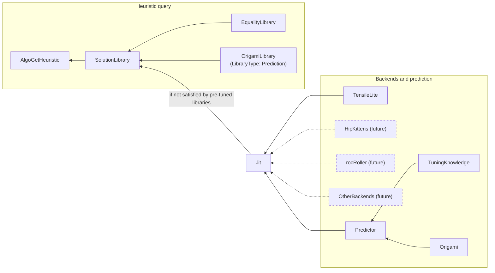

# hipBLASLt just-in-time (JIT) GEMM generation

This source guide describes just-in-time (JIT) kernel generation for general
matrix multiplication (GEMM) in hipBLASLt. It is written for hipBLASLt and
TensileLite contributors and integration developers, and it is maintained under
the existing @ROCm/hipblaslt-reviewers and @ROCm/hipblaslt-docs-reviewers rules
in [.github/CODEOWNERS](../../.github/CODEOWNERS). It is not a released
application programming interface (API) or support statement. Release-document
integration is undecided.

This page is the single JIT guide and carries the roadmap. It has three parts:

- [Current behavior](#current-behavior) describes what the downstream branch
  `users/jolabega/downstream-hipblaslt-jit-develop` implements today.
  "Implemented" means present on that branch, not merged, released or approved
  as product naming.
- [Target design](#target-design) is the approved plan of record. The code does
  not implement it yet, apart from the roadmap steps marked Done.
- [Roadmap](#roadmap) lists the planned implementation steps between the two.
  It is updated as each step lands.

The [TensileLite backend guide](JIT_TENSILELITE.md) covers the TensileLite
generator and its current direct entry point. The
[single-solution guide](tensilelite/SINGLE_SOLUTION.md) covers the Python
builder, recipes, bundles and ranked candidate validation. The
[design notes](jit-design/README.md) hold the Confluence discussion draft, the
KernelFromAnywhere (KFA) assessment and the timing/progress plans.

## Summary

Today, JIT generation is an explicit, application-driven path. The application
calls a JIT entry point with its GEMM descriptors, hipBLASLt compiles one
solution through TensileLite, and the application passes the returned algorithm
to `hipblasLtMatmul` or `hipblaslt_ext::Gemm`. An ordinary heuristic query or
matmul call does not initiate this path. The separate, existing rocRoller
integration has its own runtime generation path and can compile during normal
library use.

In the target design, JIT generation moves behind the existing heuristic query.
`hipblasLtMatmulAlgoGetHeuristic` and `GemmInstance::algoGetHeuristic` consult
the pre-tuned libraries first. When the environment variable `HIPBLASLT_JIT`
enables it, they fill a shortfall from a persistent JIT solution library and
then from newly generated solutions. The explicit JIT entry points leave the
public API and remain as internal interfaces used by tests.

## Current behavior

### Entry points

Two JIT entry points are installed on this branch today. Both share one
TensileLite provider implementation and one process-local algorithm registry,
and both return an algorithm for the existing C/C++ GEMM execution APIs.

| Entry point | Header | Behavior |
| --- | --- | --- |
| Direct TensileLite | `hipblaslt/hipblaslt-jit-tensilelite.hpp` | `hipblaslt_ext::experimental::jit::tensilelite::getGemmAlgo` compiles one required, explicit YAML (YAML Ain't Markup Language) recipe and returns a `hipblasLtMatmulHeuristicResult_t`. Sample `29_hipblaslt_jit_gemm` exercises it. See the [TensileLite backend guide](JIT_TENSILELITE.md). |
| Generic request/backend/solution | `hipblaslt/hipblaslt-jit.hpp` | `jit::tensilelite::createBackend` configures the provider. `jit::makeGemmRequest` captures existing GEMM descriptors and host scalars, `jit::getJitAlgo` compiles on the selected device and returns an owned `Solution`, and `jit::getGemmAlgo` adapts it to the algorithm accepted by `hipblasLtMatmul` and `Gemm`. Sample `30_hipblaslt_generic_jit_gemm` exercises it. |

`hipblaslt-ext.hpp` includes both headers, and `library/include/CMakeLists.txt`
installs them. [Step 1](#roadmap), now in progress, removes both from the public
surface.

Python, compiler, recipe and output paths belong to the provider's
`tensilelite::Options`. The application owns its buffers and workspace. The
request owns descriptor values and host scalars; it does not take ownership of
device pointers. Compilation and support checks finish before graphics
processing unit (GPU) work is submitted. The provider boundary is for
compiled-in implementations and does not establish a stable external plugin
application binary interface (ABI). GEMM is the implemented operation; an
attention request adapter and provider remain future work.

Internally, the GEMM request reuses `RocblasltContractionProblem` with owned
scalar values. The generic `Solution` and private `CompiledSolution` retain
backend, target, request, workspace and bundle lifetime around the existing GEMM
support and execution machinery. A matmul algorithm is an adaptation token, not
a general owning executable object.

### Components

| Component | Current input, output and connection |
| --- | --- |
| One-solution builder | One recipe and target produce complete main/helper artifacts through `Tensile.SingleSolution` and the existing TensileLite generators, validators and compiler tools. |
| Ranked recipe selector | Supplied candidates and problem facts produce one validated recipe or rejection reasons. `Tensile.JitGemm` calls the builder without running a model. |
| C++ predictor | `hipblaslt-jit-tensilelite-predictor.cpp` enumerates synthetic candidates from the target's instruction, tile, depth and cache-hint catalog, ranks them with Origami, and emits the `origami.gemm.dp.v1` modeled contract (workgroup mapping, stagger and launch outputs) to `Tensile.JitGemm`. |
| Direct API and sample | An explicit recipe and GEMM descriptors produce a checked algorithm. Sample `29_hipblaslt_jit_gemm` exercises C/C++ execution independently of the generic API. |
| Generic API and adapters | `makeGemmRequest`, `getJitAlgo` and `getGemmAlgo` connect the provider to existing execution. Sample `30_hipblaslt_generic_jit_gemm` covers this flow. |
| Benchmark | `hipblaslt-bench --jit-gemm` uses the generic TensileLite backend with prediction, completing selection and compilation before correctness checks and execution timing. See the [benchmark guide](clients/bench/README.jit.md). |
| Independent test provider | The `alternate-backend` driver case in `clients/tests/jit` uses a HIP provider with no Tensile metadata. It demonstrates the generic seam; it is not a second production compiler. |

The host runs the Python generator as a child process: POSIX spawning on Linux
and `CreateProcessW` on Windows. `Tensile.SingleSolution` assembles and links
the main kernel and compiles helper source with the configured compiler and
offload-bundler paths, then publishes a bundle containing the serialized
solution library, manifest, private loader envelope and code objects. The host
loads the serialized library and every listed code object, checks support and
workspace with TensileLite's predicates, and resolves every helper symbol before
returning an algorithm.

With the generic TensileLite provider, an empty `Options::configPath` requests
provider-private Origami prediction. The selector validates ranked candidates
in order and compiles the first supported recipe. It does not benchmark
candidates or invent a recipe when selection fails. The direct entry point always
requires an explicit recipe.

### Origami modeled inputs

An empty TensileLite `Options::configPath` requests Origami prediction. The
private `origami.gemm.dp.v1` contract covers the existing data-parallel candidate
domain. Origami ranks caller-supplied configurations; it does not synthesize
their fields or choose whether to enable Stream-K. `StreamK=0` and occupancy 1
remain explicit model inputs. Every applicable prediction is transferred;
defaults supply only settings that this model does not predict.

The inventory below follows `shared/origami/include/origami/{origami,gemm,streamk,types}.hpp`
and their implementations. A selected configuration is an output of ranking even
though its fields originate in the caller's candidate catalog.

| Origami output | Generator input or use | Conditions |
| --- | --- | --- |
| `rank_configs` / `select_config`: ordered configuration and latency | Nine-value `MatrixInstruction` recipe (MI plus retained wave topology), macro tile, `DepthU`, `NonTemporalA/B`; latency and order in provenance | Estimation ranks the existing target instruction/tile/depth/cache-hint catalog. No kernel benchmarking. |
| `select_workgroup_mapping`: signed `wgm` | `WorkGroupMapping` | Preserved exactly; zero and values outside the runtime range are rejected. |
| `select_workgroup_mapping`: `wgmxcc` | `WorkGroupMappingXCC`, with `WorkGroupMappingXCCGroup=0` | Origami 0/1 both mean identity and translate to Tensile 1. Larger values require a supported power of two and a divisible grid for equivalent whole-grid grouping. |
| `select_workgroup_mapping`: `wgmxccchunk`, `wgmxccsplitk` | Retained in every candidate's `modeled.workgroup_mapping` | Nonzero values require the Stream-K mapping ABI and reject the current data-parallel candidate; neither is substituted with `WorkGroupMappingXCCGroup`. |
| `select_staggerU`: `staggerU`, `staggerUMapping` | `StaggerU`, `StaggerUMapping` | All results, including zero, are supplied and checked after derivation. Origami currently returns zero for batches, K splitting, and several no-benefit conditions. |
| `select_staggerU`: `staggerUStrideShift` | `StaggerUStride = DepthU × Tensile DataType bytes × 2^shift` | Check the derived `_staggerStrideShift`; zero stagger may normalize the byte stride without changing its meaning. |
| `gemm::compute_launch_parameters`: reduction, grid, active CUs, timesteps, split factor | `modeled.launch`; `StreamK=0`, `GlobalSplitU=1` | Data parallel derives `none`, output-tile grid and split factor 1. Active CUs/timesteps describe the model, not kernel tuning fields. |
| `streamk::select_reduction`, `select_grid_size` | Mode-dependent prediction APIs | Applicable when a caller enables Stream-K. The data-parallel domain has no reduction/grid tuning prediction to default. Adding Stream-K candidates requires preserving these outputs through Tensile's workspace and launch reconciliation. |
| `streamk::select_hybrid_mode` | Static/dynamic schedule within StreamK=5 | Does not select Stream-K enablement. Inapplicable to the current data-parallel domain. |
| `gemm::predict_workgroup_mapping` | Internal latency-estimation approximation | Alternative fast mapping estimate, not an additional kernel field. The generator receives the full `select_workgroup_mapping` result. |
| Hardware `get_recommended_matrix_instruction` | Alternative throughput-based MI choice | The provider uses the full instruction catalog plus ranking, preserving the selected MI. |
| GEMM/Formocast performance and resource estimates | Scores/diagnostics | These APIs estimate latency/utilization/resource costs; they do not predict new vector widths, occupancy, or backend tuning settings. |

Unpredicted inputs include wave topology, occupancy, Stream-K enablement and grid
policy, workspace limits, vector widths, subtile/main-loop choice, prefetch and
scheduling, direct-to-LDS/VGPR settings, load coalescing, swizzle/layout and
split-U policy. Some are fixed by the request or candidate domain; others retain
Tensile defaults and derivation. Formocast consumes additional backend settings
to estimate cost; it does not fill them in. Epilogue overhead is not modeled.

The selector rejects missing modeled fields, unsupported translations, and any
derived recipe that changes a modeled value or cannot carry it at runtime.
Rejection advances to the next ranked candidate; exhausting the ranking fails
with reasons and emits no selected recipe. A CU budget smaller than the device's
XCD count is rejected before calling the mapping selectors. Diagnostic manifests
retain raw outputs, translated parameters, defaults, and rejections. Explicit
recipes continue through `Tensile.SingleSolution` without this prediction contract.

### Pre-tuned heuristic selection

The installed library answers `hipblasLtMatmulAlgoGetHeuristic` and
`GemmInstance::algoGetHeuristic` from pre-tuned TensileLite libraries. Default
construction orders the Equality, Range, Prediction, GridBased and FreeSize
selection libraries, followed by TruePred rows, beneath hardware, operation and
problem predicates. Modes and available branches affect traversal. Equality is
matching with equality distance.

The Prediction library type (C++ `ProblemPredictionLibrary`) is referred to as
the **OrigamiLibrary** in the target design; it is not a new type. It ships 507
pre-tuned solution YAML files in per-architecture `Origami` directories under
`library/src/amd_detail/rocblaslt/src/Tensile/Logic/asm_full/`: 489 for gfx950,
7 each for gfx1250 and gfx1250v0, and 4 for navi32. At runtime it ranks those
existing solutions with `origami::rank_configs`. Origami does not construct
kernels at package time. This existing-solution ranking is distinct from the JIT
predictor, which ranks candidate recipes that may not exist in any library.

When a problem that requests xf32 math (`rocblaslt_compute_f32_fast_xf32`)
finds no solution, `getBestSolutions` in `tensile_host.cpp` repeats the lookup
with FP32 math. When `getBestSolutions` returns fewer results than
`requestedAlgoCount`, the existing heuristic code in `rocblaslt_auxiliary.cpp`
calls `getAllSolutions`, excluding the GridBased and Prediction libraries that
were already consulted, and appends supported, non-duplicate solutions until the
count is reached. When the rocRoller route applies (`HIPBLASLT_USE_ROCROLLER=1`,
or by default for eligible block-scaled problems), `getBestSolutions` and
`getAllSolutions` return rocRoller results before Tensile lookup.

### Build

`HIPBLASLT_ENABLE_JIT` is disabled by default. The declarations remain
available when disabled, and selection returns `HIPBLAS_STATUS_NOT_SUPPORTED`.
The enabled implementation requires the host library and ROCm. The TensileLite
provider also requires its Python dependencies and the local rocisa extension.
Additional Python import paths use the platform separator (`:` or `;`). Using an
existing configured build and Python environment:

```bash
cmake -S "$project_root/projects/hipblaslt" -B "$project_build" \
  -DHIPBLASLT_ENABLE_JIT=ON -DHIPBLASLT_ENABLE_HOST=ON \
  -DHIPBLASLT_BUILD_TESTING=ON \
  -DHIPBLASLT_ENABLE_DEVICE=OFF -DGPU_TARGETS=gfx950 \
  -DPython_EXECUTABLE="$project_python" -DPython3_EXECUTABLE="$project_python"
cmake --build "$project_build" --target _rocisa hipblaslt-jit-generic-api-test --parallel
export PYTHONPATH="$project_build/tensilelite/rocisa:$project_build/tensilelite:$project_root/projects/hipblaslt/tensilelite"
```

Use the compiler and target appropriate for the local device. Generated bundles
do not depend on a prebuilt hipBLASLt device library. The `jit` CMake preset
enables this feature for a new configuration.

### Algorithm lifetime and failures

The returned heuristic result contains the required workspace size. Supply that
workspace and follow the same handle, stream and workspace sharing rules as
`hipblasLtMatmul` and `Gemm` calls using prebuilt algorithms. All helper
entrypoints are resolved before submission. Stream-K uses the handle's
stream-specific synchronization region; MultipleBufferSingleKernel and
output-amax use its shared synchronization storage. Registry synchronization
protects algorithm lookup; it does not protect application buffers or make
simultaneous calls on one `Gemm` object safe.

Copies of an algorithm remain usable on its generating device within the same
process, and its modules are retained until process exit. Reuse within one
program invocation needs no recompilation. A different program invocation
compiles its own solution: no persistent cache or bundle reload is provided
today. Save recipes and diagnostic manifests for reproduction; the opaque
algorithm bytes are not a prebuilt library index.

An empty GEMM output (M=0 or N=0) returns `HIPBLAS_STATUS_NOT_SUPPORTED` from
the request factory without compilation. K=0 can use a recipe that implements
beta*C. TensileLite owns its datatype, instruction and scale-layout restrictions;
output-amax currently requires one batch, GlobalSplitU=1 and StreamK=0. The
library propagates provider support failures, including a mismatch between the
supplied physical MX scale layout and the compiled solution. Generation never
benchmarks recipes or substitutes another recipe when the supplied one fails.

The private loader reads `loader.bin`, a bounded, versioned envelope published
alongside the human-readable `manifest.json`. JavaScript Object Notation (JSON)
is a diagnostic record. `clients/tests/jit/test_helper_failures.py` and
`test_bundle_failures.py` damage valid bundles and check that the public C and
extension paths reject them without writing output or workspace.

### Recorded validation

The earlier review stacks are closed without merging; see
[SESSION_HANDOFF.md](../../SESSION_HANDOFF.md) for historical revisions and
evidence. Recorded direct validation passed ten routes on native Linux gfx950,
and generic validation passed twelve routes with affected failure checks rerun.
Direct and generic samples passed C/C++ checks over 32,768 elements with zero
maximum error. Prediction/benchmark checks passed sixteen targeted cases. The
`ScheduleIterAlg=4` gfx1250 fixture has generation/compilation evidence only.

The shared `hipblaslt-jit-gemm-ci.yml` workflow configures gfx90a, gfx942,
gfx950 and gfx1250 runners. Configured targets are distinct from completed
native runs, and native Windows execution is unverified. rocRoller analysis is
source-based; the current local build has it disabled.

## Target design

This section is the approved plan of record. The [roadmap](#roadmap) tracks
which steps are implemented; until a step is marked Done, its part of the design
is planned only.



Dashed nodes and edges are future backends. Each backend is an independent
generator connected only to Jit; the future backends do not depend on
TensileLite.

### Components

| Component | Role in the target design |
| --- | --- |
| AlgoGetHeuristic | The public entry points `hipblasLtMatmulAlgoGetHeuristic` (C) and `GemmInstance::algoGetHeuristic` (C++ extension). They query SolutionLibrary; no JIT-specific public call is required. |
| SolutionLibrary | The existing Tensile solution-library lookup, fed by the pre-tuned libraries and, when enabled, by the JIT solution library. |
| EqualityLibrary | The existing Equality matching library. |
| OrigamiLibrary | The existing `LibraryType: Prediction` (C++ `ProblemPredictionLibrary`), described under [pre-tuned heuristic selection](#pre-tuned-heuristic-selection). The name is a design label, not a new type. |
| Jit | hipBLASLt code that calls a backend-specific JIT interface and builds a library of JIT-generated kernels. It supplies SolutionLibrary only when the pre-tuned libraries do not satisfy the request. |
| JIT interface | Input: algorithm parameters (for GEMM: M, N, K, datatypes, scale types, layout, activation and the remaining operation description) plus the gfx target. Output: solutions. Each backend implements it. |
| TensileLite backend | The live backend. It emits assembly, HIP helper source and metadata. See the [TensileLite backend guide](JIT_TENSILELITE.md). |
| rocRoller, HipKittens, other backends | Future extension points behind the same interface. HipKittens is explicitly deferred in this pass. |
| Mock backend | A new in-process test backend behind the same interface. It proves the interface is swappable and that Jit does not depend on TensileLite. |
| Predictor | Ranks candidate configurations for Jit. It is fed by Origami and TuningKnowledge. |
| Origami | The existing analytical model. It ranks configurations; it is not a generator backend. |
| TuningKnowledge | A new interface that supplies values for knobs the model does not predict. It initially returns TensileLite defaults; real tuning data is planned under AIHPBLAS-4554. |
| Code-object builder | hipBLASLt C++ that turns emitted source into executable code objects through AMD comgr. |
| JIT solution library | The persistent cache of generated solutions, loaded as a second master library. |

### Jit and the backend interface

Jit is the component name; the design does not introduce a `JitInterface`
type name. Jit passes the algorithm parameters and gfx target to the selected
backend and receives solutions back. Backend implementations are backend
specific and independent of one another: TensileLite is live, rocRoller and
HipKittens are future extension points, and other generators can implement the
same interface. A new in-process mock backend in the tests demonstrates that Jit
does not depend on TensileLite.

The existing type-reuse guidance still applies. The GEMM payload remains
`RocblasltContractionProblem`, another generator does not require a second
public GEMM problem model, and selection and execution reuse
`ContractionProblemGemm`, `ContractionSolution`, `KernelArguments`,
`KernelInvocation` and the HIP `SolutionAdapter` where sufficient. The
[KFA assessment](jit-design/kfa-producer-convergence.md) records which metadata
generators must carry for a shared consumer.

### Predictor and TuningKnowledge

The Predictor produces ranked candidates for Jit. Its inputs are Origami and
TuningKnowledge. The current C++ predictor already ranks synthetic candidates
with Origami and emits the `origami.gemm.dp.v1` modeled contract; step 2 places
it behind a Predictor interface. TuningKnowledge supplies the TensileLite
defaults used today for unmodeled knobs. Replacing those defaults with stored
tuning data is later work under AIHPBLAS-4554.

### Code-object construction with comgr

Generators emit assembly or HIP source plus metadata only; they do not assemble,
link or bundle. hipBLASLt C++ builds code objects in process through AMD comgr,
adapted from rocRoller's `InProcessAssembler`
(`shared/rocroller/lib/source/Assemblers/InProcessAssembler.cpp`):

- Assembly: `AMD_COMGR_ACTION_ASSEMBLE_SOURCE_TO_RELOCATABLE`, then
  `AMD_COMGR_ACTION_LINK_RELOCATABLE_TO_EXECUTABLE`.
- HIP helper source: comgr HIP compilation.

The output is raw, uncompressed executable code objects. comgr cannot bundle or
compress them, and `hipModuleLoad` accepts raw executable and linkable format
(ELF) objects. hipBLASLt disables comgr's own on-disk cache (`~/.cache/comgr`)
for these builds, so the JIT solution library is the only persistent cache of
generated code. Once this step lands, the generator no longer needs the compiler
and offload-bundler paths it uses today.

### JIT solution library

The JIT solution library is the persistent cache:

- **Location:** the directory named by `HIPBLASLT_JIT_LIBRARY_PATH`. By default
  hipBLASLt creates a per-user directory with mode 0700:
  `/tmp/hipblaslt-jit-<uid>/` on Linux and `%TEMP%\hipblaslt-jit-<user>` on
  Windows.
- **Layout:** one library per `ProblemType`, mimicking the TensileLibrary layout
  of a library file plus code objects.
- **Publication:** new solutions merge into the library under a file lock and
  are published by atomic rename, so several processes can share a directory.
- **Loading:** the runtime loads it as a second master library alongside the
  pre-tuned libraries.
- **Indices:** cached solutions use real solution indices from a reserved index
  range. Tests may continue to use process-local JIT tokens.
- **Cache key:** each library records the gfx target and its target features,
  the backend identifier and version, the comgr version, the compiler
  environment settings that affect output, and the library schema version. A
  library whose key does not match the running process is ignored. hipBLASLt
  never deletes cache entries automatically.

Process-local algorithm retention and rocRoller's handle-owned kernel cache are
separate mechanisms.

### Tool paths

Generation needs the Python interpreter, the TensileLite source directory and
its import paths and, until step 3, the compiler and offload bundler. Their
locations become build-time defaults baked into the library. The existing
`HIPBLASLT_JIT_PYTHON`, `HIPBLASLT_JIT_TENSILE_SOURCE`,
`HIPBLASLT_JIT_PYTHONPATH`, `HIPBLASLT_JIT_CXX` and
`HIPBLASLT_JIT_OFFLOAD_BUNDLER` environment variables override them. Today only
`hipblaslt-bench` bakes these defaults and reads the overrides. A heuristic query
has no application `Options`, so the library must own them.

### Heuristic integration and `HIPBLASLT_JIT`

| `HIPBLASLT_JIT` | Behavior |
| --- | --- |
| `0` or unset (default) | JIT is off. Heuristic queries behave as they do today. |
| `1` | Fallback. JIT runs only when the existing lookup leaves the result short of `requestedAlgoCount`. |
| `2` | Forced. JIT is the only source: the query skips Equality, Origami (Prediction), all other pre-tuned libraries and rocRoller's early path. It looks up the JIT solution library first, then generates. |

In fallback mode, the existing lookup runs unchanged and to completion first:

1. `getBestSolutions`, including rocRoller's early path when it applies and the
   retry that repeats an xf32 lookup with FP32 math when it finds no solution.
2. The existing `getAllSolutions` shortfall fill.

Results from rocRoller's path count toward `requestedAlgoCount`. If the result
is still empty or contains fewer than `requestedAlgoCount` solutions, the query
continues:

3. The JIT solution library for the problem's `ProblemType`.
4. Generation: Jit asks the backend for as many new solutions as are needed to
   reach `requestedAlgoCount`, builds their code objects, publishes them into
   the JIT solution library and returns them.

This mirrors `AlgoGetHeuristic`, which already returns up to the requested count.
Generated solutions therefore can fill a partial result, not only an empty one.

Failures follow these rules:

- JIT failures are always reported, in both modes.
- In fallback mode, failing to reach `requestedAlgoCount` is a hard error unless
  the existing heuristic contract already allows returning fewer results. Step 5
  verifies that contract before implementing the rule.
- In forced mode, a failure returns zero results and is still reported.

A build with `HIPBLASLT_ENABLE_JIT=OFF` ignores `HIPBLASLT_JIT` and prints a
one-time warning when it is set.

### Public API changes

Step 1 demotes the explicit JIT entry points:

- `getJitAlgo`, `makeGemmRequest`, both `getGemmAlgo` functions (generic and
  TensileLite direct) and `createBackend` leave the public and extension API.
- `hipblaslt-jit.hpp` and `hipblaslt-jit-tensilelite.hpp` are no longer installed
  or included from `hipblaslt-ext.hpp`. They become internal headers under
  `library/src/amd_detail/` used by unit tests.
- Samples 29 and 30 become standalone test binaries under `clients/tests/jit`,
  run by `.github/scripts/test_hipblaslt_jit.py`.
- `hipblaslt-bench --jit-gemm` keeps working through the internal header until
  step 5, which removes the option once `HIPBLASLT_JIT` exists.

Applications then reach JIT only through the heuristic query and
`HIPBLASLT_JIT`.

### Ticket mapping

AIHPBLAS-4548 is the umbrella epic. These mappings describe scope, not ticket
closure.

| Ticket | Scope in the target design |
| --- | --- |
| AIHPBLAS-4801, Interface for JIT backends | The backend interface and the predict, cache lookup and active module path. |
| AIHPBLAS-4552 | The JIT solution library (cache). |
| AIHPBLAS-4551 | Prediction. |
| AIHPBLAS-4550 | The JustInTime library type. |
| AIHPBLAS-4553 | Exact epilogue specialization. |
| AIHPBLAS-4554 | Tuning blueprints (real TuningKnowledge data). |
| AIHPBLAS-4549 | The builder and direct integration that the current behavior delivers. |

## Roadmap

The steps are planned in this order. The status column is updated as code
lands. The related-ticket column associates each step with the ticket scopes
above for review; it is not a ticket-closure plan.

| Step | Status | Scope | Related tickets |
| --- | --- | --- | --- |
| 1. Demote the public API | In progress | Stop installing `hipblaslt-jit.hpp` and `hipblaslt-jit-tensilelite.hpp` and remove their includes from `hipblaslt-ext.hpp`; move them to internal headers used by unit tests. Convert samples 29 and 30 to test binaries under `clients/tests/jit` run by the shared driver. `hipblaslt-bench --jit-gemm` uses the internal header until step 5. | AIHPBLAS-4801 |
| 2. Jit component and interfaces | Planned | Add Jit, the backend interface, the mock backend, and the Predictor and TuningKnowledge interfaces. Wrap the existing TensileLite provider and C++ predictor behind them; TuningKnowledge returns TensileLite defaults. | AIHPBLAS-4801, AIHPBLAS-4551, AIHPBLAS-4554 |
| 3. comgr code-object builder | Planned | Build code objects in hipBLASLt through comgr, adapted from rocRoller's `InProcessAssembler`. TensileLite emits only assembly, helper source and metadata. | AIHPBLAS-4801 |
| 4. JIT solution library | Planned | Per-`ProblemType` library under `HIPBLASLT_JIT_LIBRARY_PATH`, merged under a file lock with atomic rename, loaded as a second master library, with reserved solution indices. | AIHPBLAS-4552 |
| 5. Heuristic integration | Planned | Add `HIPBLASLT_JIT` modes 0, 1 and 2 to `hipblasLtMatmulAlgoGetHeuristic` and `GemmInstance::algoGetHeuristic`, with the fallback order and failure rules above. Bake the tool-path defaults into the library, warn once when a JIT-off build sees `HIPBLASLT_JIT`, and remove `hipblaslt-bench --jit-gemm`. | AIHPBLAS-4550, AIHPBLAS-4801 |
| 6. Validation sweep | Planned | Rerun the shared JIT driver and add heuristic, cache and mode coverage. | AIHPBLAS-4548 |

On the development host described in [SESSION_HANDOFF.md](../../SESSION_HANDOFF.md),
gfx950 hardware (8× MI355X) is available for native numerical validation, and
gfx1250 kernels run on the FFM MI450 simulator. Simulator runs are not native
gfx1250 hardware evidence.

The following work sits outside the six steps and remains future:

| Work | Remaining contract |
| --- | --- |
| Exact epilogue — AIHPBLAS-4553 | Compile the requested bias/activation/output specialization. This is separate from current epilogue correctness and from modeling epilogue cost. |
| Tuning data — AIHPBLAS-4554 | Replace TuningKnowledge defaults with stored choices for parameters outside the model. Existing defaults are not a blueprint database. |
| rocRoller and HipKittens backends | Implement the backend interface. HipKittens is deferred in this pass. The existing rocRoller runtime path remains separate until then. |
| KFA metadata convergence | Complete producer metadata, then prove argument, launch, helper, workspace and synchronization equivalence before sharing dispatch. See the [KFA assessment](jit-design/kfa-producer-convergence.md). |
| Timing/progress | Independent `HIPBLASLT_JIT_DEBUG` categories `timing`, `progress`, or `timing,progress`. Unset/empty adds no collection, observer or files. See the [host](jit-design/timing-host-plan.md) and [Python](jit-design/timing-python-plan.md) plans. |
| More operations | Add concrete profiles and adapters after demonstrating their execution contracts. Non-GEMM KFA support, a stable external plugin ABI and dynamic backend discovery remain undefined. |
