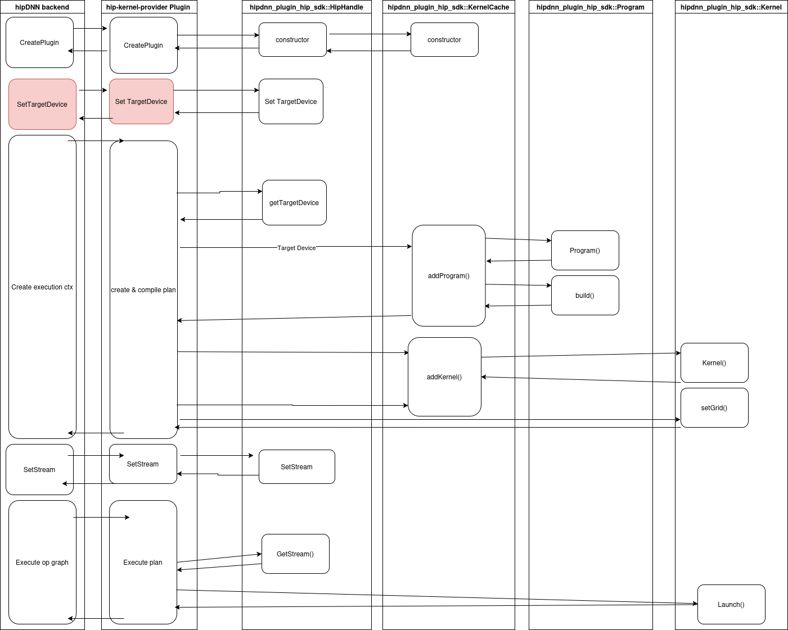

# RFC 0007: Plugin HIP SDK Design

## Table of Contents

1. [Executive Summary](executive-summary)
2. [Problem Statement](problem-statement)
3. [Current System Overview](current-system-overview)
4. [Proposed Design](proposed-design)
5. [Key Design Decisions](key-design-decisions)
6. [Risks](risks)
7. [Execution Plan](execution-plan)
8. [Testing Plan](testing-plan)
9. [Future Considerations](future-considerations)

## Executive Summary

This RFC a new hipDNN SDK that defines common components that can be used for development of plugins that use HIP kernels
directly. It defines classes for kernel and program objects which are owned by a `HipHandle` class to manage their lifetimes
and wrap common HIP stream operations and device queries. Satisfying the requirements for AOT compilation are left to future
considerations as they need more input from the hipDNN backend component owners to enable the functionality in the APIs
they are responsible for.

## Problem Statement

The nature of a plugin that defines its own HIP kernels to implement graph operations is that the plugin needs mechanisms
to compile and execute those kernels. In order for the direct HIP plugin to be performant and portable there are the
following requirements:

* Just In Time (JIT) compilation - Plugin HIP kernels must be compilable from source strings during program execution
  using [hipRTC](https://rocm.docs.amd.com/projects/HIP/en/latest/how-to/hip_rtc.html).
* Ahead Of Time (AOT) compilation - Plugin must be able to consume HIP kernels compiled prior to application execution.
* Device-less compilation - There must be a mechanism to compile the HIP kernels the plugin defines on a machine without
  a GPU (or non-matching GPU) based on a target device description.
* Caching - The HIP `hipFunction_t` kernels handles already created during the course of plugin execution should be cached so that they
  can be reused without having to fallback to loading the binary object again, i.e. `hipModuleLoadData().`
* Serialization - A plugin should be able to serialize and deserialize compiled kernel binaries. That is, save the
  binary blob to a file, and load an executable binary blob from a file. This should be combined with the device less compilation
  requirement to enable shipping of serialized blobs for a variety of supported GPUs for users to deserialize and run.

## Current System Overview

The plugin SDK defines a interfaces for device specific compilation of an execution plan. This should be used
by plugins as part of plan creation in the `hipdnnEnginePluginCreateExecutionContext` call by the hipDNN backend. Resulting in
a compiled binary that is ready to execute when the hipDNN backend calls `hipdnnEnginePluginExecuteOpGraph`. To achieve this
the compiled binary will be embedded in the execution plan handle that the plugin returns, such that if the hipDNN backend
performs caching of the creating execution plans, then that will implicitly also cache the compiled binary blobs.

## Proposed Design

Diagram showing first usage of a kernel when all caches are cold.



The red box for setting the target device represents an API interface that doesn't currently exist between the hipDNN backend
and plugin for setting the target device. Separating the target device from the actual stream is important for AOT and
device-less compilation requirements, so we want to make sure they are not coupled together. In an initial implementation
however the target device could be inferred from the stream.

### Namespace

Objects are defined in the following namespace and use C++ exceptions for error handling.

```cpp
namespace hipdnn_plugin_hip_sdk;
```

### Handle

A `HipHandle` owns the objects allocated by the user to manage when they are freed, either at the request of
the user or when the `HIPHandle` is destroyed. It also provides a wrapper for interfacing with the HIP runtime
for common stream operations and queries of the target device.

```cpp
/*
 Each plugin user should allocate an instance on the heap with new HipHandle()
 in hipdnnEnginePluginCreateImpl and free in hipdnnEnginePluginDestroyImpl();
*/
class HipHandle {
public:
// @brief Destructor
// @detail Frees underlying resources which have handles returned to the user, e.g Programs and Kernels.
~HipHandle();

// Methods for managing device/stream. Note that these are set by the plugin user,
// and only cached in the handle:
// * hipStream_t getHipStream() const;
// * void setHipStream(hipStream_t stream);
// * hipDeviceProp_t getTargetDevice() const;
// * void setTargetDevice(hipDeviceProp_t device_props);

// Device query methods which should be taken from the target device rather than the stream to
// be enable devicel-ess compilation flows.
// * getMaxComputeUnits()
// * getWavefrontWidth()

// HIP runtime wrappers for stream operations
// * finish() 
// * memcpy host->device, device->host

// Give plan builder access to the kernel cache
KernelCache getKernelCache() { return _kernelCache.get(); }

private:
  // RAII owned allocation, which the .get() element is returned to users as handles.
  // Constructed with handle instance is created.
  std::unique_ptr<KernelCacheImpl> _kernelCache;
};
```

### Program / Kernels

Define classes for working with HIP program & kernel objects.

#### Kernel Cache class

A dedicated kernel cache object is used to manage the creation of HIP kernels,
this separates the concerns from the more general HIP functionality in the HIP
handle. A kernel cache is created per HIP handle and therefore per-thread in a
multi-threaded scenario.

Program and Kernel objects are therefore kept under same ownership for consistent
lifetimes. As the hip module a kernel is created from shouldn't be unloaded while
the kernel is in use.

```cpp
// User works with a handle to the created object, but doesn't own it
using KernelCache = KernelCacheImpl *;

class KernelCacheImpl {
public:
/*
  @brief Creates program object and returns pointer to the user
  @detail Checks if Program can be found in the cache before building new object
  @param program_name Name of the program file
  @param kernel_src Source string for program.
  @param target_device Identifies the architecture to compile the binary for.
  @param params Compilation options
  @return Handle to allocated program object owned by this HipHandle object
*/
Program AddProgram(const std::string& program_name,
                   const std::string& kernel_src,
                   hipDeviceProp_t target_device,
                   const std::string& params);

/*
  @brief Creates a kernel object matching an algorithm and config
  @detail Checks if Kernel can be found in the cache before creating new object
  @param name Name of the kernel entry-point in program
  @param algorithm_config Configuration uniquely identifying an algorithm for a particular shape.
  @return Handle to allocated kernel object owned by this HipHandle object
*/
Kernel AddKernel(Program program,
                 const std::string& name,
                 const std::string& algorithm_config);

/*
   @brief Finds the list of kernels that have been added to the handle matching
   the algorithm and config.
   @param target_device Identifies the architecture the binary was compliled for.
   @param algorithm_config Configuration uniquely identifying an algorithm for a particular shape.
   @return list of kernels
*/
std::vector<Kernel> GetKernels(const std::string& algorithm,
                               hipDeviceProp_t target_device,
                               const std::string& algorithm_config) const;
                               
private:
  // RAII owned allocations, which the .get() element is returned to users as handles.
  std::vector<std::unique_ptr<KernelCacheImpl>> _kernels;
  std::vector<std::unique_ptr<Program>> _programs;
  
  // Cache to check before going to DB for queries, see MIOpen kernel_cache.cpp
  using Key = std::pair<std::string, std::string>; // program-name, params
  struct SimpleHash
  {
    size_t operator()(const Key& p) const
    {
        return (std::hash<std::string>()(p.first) ^ std::hash<std::string>()(p.second));
    }
  };

 // Key represnts <algorithm, config>
 std::unordered_map<Key, std::vector<Kernel>, SimpleHash> _kernel_map
 // Key represnts <program_name, compile params>
 std::unordered_map<Key, Program, SimpleHash> _program_map

};
```

#### Program class

See `hipoc_program.cpp` in MIOpen

```cpp
// User works with a handle to the created object, but doesn't own it
using Program = ProgramImpl *;

class ProgramImpl {
public:
   /* @brief Constructor
      @param name Name of program
      @param program_src HIP source code for program or binary blob.
   */
   ProgramImpl(std::string name,
              std::string program_src);
           
   // Destructor, calls hipModuleUnload
   ~ProgramImpl();
           
   /*
   @detail Calls hiprtcProgram, hiprtcDestroyProgram, hipModuleLoadData
   @param options Compilation options for program, e.g. macro definitions
   @throws If there is a compilation error or the program has already been built.
   */
   void build(std::string options);
   
   /*
     @brief Uses hiprtcGetProgramLog API to query compilation error log
     @return Error log if exists, empty string otherwise
   */
   std::string getLog();
};
```

#### Kernel class

See `hipoc_kernel.cpp` in MIOpen

```cpp
// User works with a handle to the created object, but doesn't own it
using Kernel = KernelImpl *;

class KernelImpl {
public:
    /*
      @brief Given the name of a kernel in the HIP program, creates an object
      that can be used to set the griddimensions of and invoked.
      @detail Should call `hipModuleGetFunction()` to set hipFunction_t member.
      @param program The Program the kernel is created from
      @param name Name of a kernel in the program
      @throws If name doesn't exist in Program, if Program is null
      @throws If Program doesn't have a built binary
   */
   KernelImpl(Program program, std::string name); 

   /*
      @brief Sets the execution grid dimenions of the kernel. No validity checks are done.
      @lds Local dimensions
      @gds Global dimensions
   */
   void setGrid(std::array<size_t, 3> lds, std::array<size_t, 3> gds);

    /*
      @brief Executes the kernel
      @detail Uses hipExtModuleLaunchKernel to launch kernel. It is the callers
      responsibility to synchronize the launch.
      @brief Creates an invocable kernel object 
      @param stream the HIP stream the kernel will be invoked on
      @param args Argument pack of kernel argument
      @throws If the device associated with the stream doesn't match the device arch
      which the program used to create the kernel was compiled for.
    */
   template <typename... Args>
   void Launch(hipStream_t stream, Args&&... args);
};
```

## Risks

- **Single User**: There is only a single plugin that will stress the SDK design, this may bias the design towards that
  single plugins use-case.
- **Ecosystem**: The SDK exists as part enabling a larger software stack, where each component of the stack will have
  it's own owners and requirements. This design is focused on the needs of the hipDNN backend and direct hip plugin
  however the requirements is other stakeholders in the stack can have implications too.
- **Development Pace**: The hipDNN plugin mechanism and associated SDKs is developing at a rapid pace. This introduces
  the risk of git conflicts during coding but also increases the burden of communication and work synchronization
  between engineers to ensure efficient development.
- **MIOpen Tech Debt**: The work of the direct HIP plugin and SDK uses the MIOpen project as a reference due to it's
  use of HIP defined kernels with JIT compilation and caching. This introduces the risk of copying designs
  without understanding the implications, and either copying over technical debt or introducing tech debt from
  a suboptimal design.

## Execution Plan

The need for a HIP compilation SDK is predicated on the existence of a plugin that defines and executes it's own
HIP kernels. The development of the plugin is already underway as the `hip-kernel-provider` plugin and will begin
with batchnorm operation support. These kernels will be JIT compiled for the current GPU using code that lives
within the plugin itself.

Once the batchnorm operations are established in the direct plugin we will be able to begin on the implementation
work of the HIP compilation SDK defined by this RFC. In this step the compilation code can be refactored
out of the plugin into the SDK into the program and kernel SDK classes for the plugin code to use.

## Testing Plan

A new test suite will be created along with the SDK that will stress functionality as it is implemented in the SDK.

Additionally as the SDK API is adopted by the direct HIP plugin testing will be run on the plugin to
ensure that it's functionality hasn't regressed.

## Future Considerations

If the multi-threaded scenario is important then this should be added to the requirements and the design iterated on.

The kernel class is state due to the existence of the `setGrid` function which updates the execution dimensions.
This was chosen due to the fact that this is a runtime parameter to the HIP kernel launch APIs. However,
it would also be possible to remove this state and create duplicate kernel objects for different grid sizes if
that was deemed a better trade off.

This design is primarily focused on refactoring out common functionality for managing HIP kernel JIT
compilation in way that leaves SDK components decoupled enough for AOT/serialization/device-less requirements
to be added later. The extra functionality to meet those requirements will require changes to the plugin API to
allow plugins to provides callbacks for generic save/load support which will be implemented in a plugin specific
manner.
