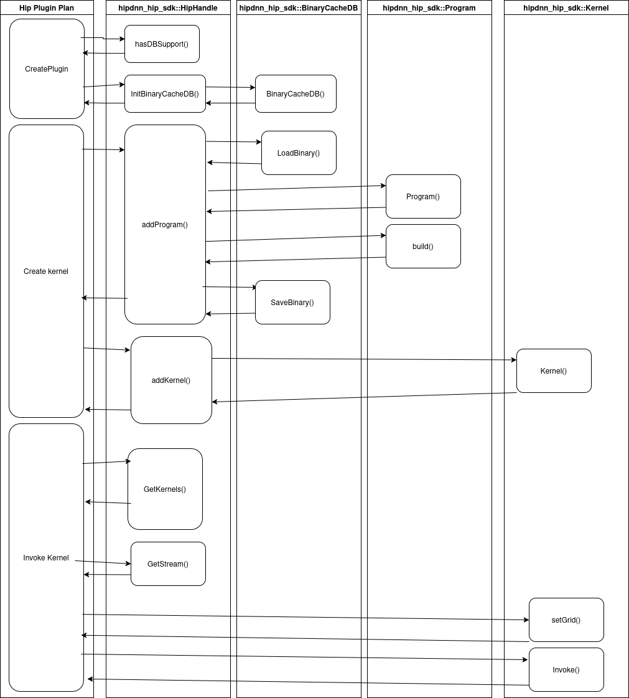

# RFC 0007: HIP Compilation SDK Design

## Table of Contents

1. [Executive Summary](executive-summary)
2. [Problem Statement](problem-statement)
3. [Current System Overview](current-system-overview)
4. [Proposed Design](proposed-design)
5. [Key Design Decisions](key-design-decisions)
6. [Risks](risks)
7. [Execution Plan](execution-plan)
8. [Testing Plan](testing-plan)
9. [Future Considerations](future-considerations)

## Executive Summary

This RFC a new hipDNN SDK that defines common components that can be used for development of plugins that use HIP kernels
directly. It defines classes for kernel and program objects which are owned by a `HipHandle` class to manage their lifetimes
and wrap common HIP operations, such as executing those objects.

## Problem Statement

The nature of a plugin that defines it's own HIP kernels to implement graph operations is that the plugin needs mechanisms
to compile and execute those kernels. In order for the direct HIP plugin to be performant and portable there are the
following requirements:

* Just In Time (JIT) compilation - Plugin must be able to compile HIP kernels from source strings during program execution
  using [hipRTC](https://rocm.docs.amd.com/projects/HIP/en/latest/how-to/hip_rtc.html).
* Ahead Of Time (AOT) compilation - Plugin must be able to consume HIP kernels compiled prior to application execution,
  i.e. using `hipcc`.
* Device-less compilation - There must be a mechanism to compile the HIP kernels the plugin defines on a machine without
  a GPU (or non-matching GPU) based on a target device description.
* Caching - The HIP `hipFunction_t` kernels handles already created during the course of plugin execution should be cached so that they
  can be reused without having to fallback to loading the binary object again, i.e. `hipModuleLoadData().`
* Serialization - A plugin should be able to serialize and deserialize compiled kernel binaries. That is, save the
  binary blob to a file, and load an executable binary blob from a file. This should be combined wit the device less compilation
  requirement to enable shipping of serialized blobs for a variety of supported GPUs for users to deserialize and run.

## Current System Overview

The plugin SDK defines an `ICompilablePlan` interface for device specific compilation of an execution plan. This should be used
by plugins as part of plan creation in the `hipdnnEnginePluginCreateExecutionContext` call by the hipDNN backend. Resulting in
a compiled binary that is ready to execute when the hipDNN backend calls `hipdnnEnginePluginExecuteOpGraph`. To achieve this
the compiled binary will be embedded in the execution plan handle that the plugin returns, such that if the hipDNN backend
performs caching of the creating execution plans, then that will implicitly also cache the compiled binary blobs.

## Proposed Design

> TODO - Iterate on to address feedback.

### Overview

High level plan for Once implementation/refactoring from the new plugin into an SDK actually starts then this design may change,
it is primarily intended as a starting point to make that work easier by reducing initial design work.

Objects are defined in the following namespace and use C++ exceptions for error handling.

```
namespace hipdnn_hip_sdk;
```

Diagram showing first usage of a kernel when all caches are cold.



### CMake

* Requires hipRTC to build
* Checks for presence of SQLite database
* CMake variable to build without caching, primarily for developers. See `MIOPEN_DEV` CMake variable.

### Handle

A Hip handle provides an object for interfacing with the HIP runtime, and managing the currently active HIP stream/device.
See `miopen::Handle` as reference. It also owns the objects allocated by the user, and manages when they are freed.
Either at the request of the user or when the `HIPHandle` is destroyed.

Initial version can be whatever is required for the MVP hip kernel plugin, but it can be extended over time.

```cpp
/*
 Each plugin user should allocate an instance on the heap with new HipHandle()
 in hipdnnEnginePluginCreateImpl and free in hipdnnEnginePluginDestroyImpl();
*/
class HipHandle {

// @brief Destructor
// @detail Frees underlying resources which have handles returned to the user, e.g Programs and Kernels.
~HipHandle();

// Methods for managing deivce/stream:
// * get/set HIP stream
// * get/set HIP device

// Device query methods:
// * getMaxComputeUnits()
// * getWavefrontWidth()

// HIP runtime wrappers:
// * finish() 
// * memcpy host->device, device->host

// Methods for managing DB of JITed binaries:

/// @brief Returns literal based on macro set during Cmake configure.
bool hasDBSupport();  

/// @brief Creates object for managing the cache and returns pointer to user
BinaryCacheDB initBinaryCacheDB(std::string path_to_db);
                 
/*
  @brief Creates program object and returns pointer to the user
  @detail Checks if Program can be found in the cache before building new object
  @param program_name Name of the program file
  @param params Compilation options
  @return Handle to allocated program object owned by this HipHandle object
*/
Program AddProgram(const std::string& program_name,
                   const std::string& kernel_src,
                   const std::string& params);

/*
  @brief Creates a kernel object matching an algorithm and config
  @detail Checks if Kernel can be found in the cache before creating new object
  @param name Name of the kernel entry-point in program
  @param algorithm Name of the algorithm the kernel is used to implement
  @param network_config Configuration of the algorithm for the particular shape.
  @return Handle to allocated kernel object owned by this HipHandle object
*/
Kernel AddKernel(Program program,
                 const std::string& name,
                 const std::string& algorithm,
                 const std::string& network_config);

/*
   @brief Finds the list of kernels that have been added to the handle matching
   the algorithm and config.
   @param algorithm Name of the algorithm the kernel is used to implement
   @param network_config Configuration of the algorithm for the particular shape.
   @return list of kernels
*/
std::vector<Kernel> GetKernels(const std::string& algorithm,
                               const std::string& network_config) const;
                               
private:
  // RAII owned allocations, which the .get() element is returned to users as handles.
  std::unique_ptr<BinaryCacheDBImpl> _binary_db_cache;
  std::vector<unique_ptr<KernelImpl>> _kernels;
  std::vector<unique_ptr<Program>> _programs;
  
  // Cache to check before going to DB for queries, see MIOpen kernel_cache.cpp
  using Key = std::pair<std::string, std::string>; // program-name, params
  struct SimpleHash
  {
    size_t operator()(const Key& p) const
    {
        return (std::hash<std::string>()(p.first) ^ std::hash<std::string>()(p.second));
    }
  };

 // Key represnts <algorithm, config>
 std::unordered_map<Key, std::vector<Kernel>, SimpleHash> _kernel_map
 // Key represnts <program_name, compile params>
 std::unordered_map<Key, Program, SimpleHash> _program_map
};
```

### Binary cache DB

Manages access to SQLite cache, see MIOpen `binary_cache.cpp`, `db.cpp`, and `sqlite_db.hpp`

```cpp
// User works with a handle to the created object, but doesn't own it
using BinaryCacheDB = BinaryCacheDBImpl *;

class BinaryCacheDBImpl {
  /// @brief Constructor taking path to cache.
  /// @throws if path is invalid
  BinaryCacheDBImpl(std::string cache_path)

  /// @brief Loads a binary from cache
  /// @detail Uses SQLite as implementation detail, DB key is a combination of
  /// name, hash, and args for a DB specific to target.
  /// @param target ASIC to lookup
  /// @param name Name for program
  /// @param source_hash std::hash<string> of source string
  /// @param args Configuration of program
  /// @return Binary blob as a list of bytes, or empty list if lookup failed
  std::vector<uint8t> LoadBinary(const TargetProperties& target,
                                 const std::string& name,
                                 size_t source_hash,
                                 const std::string& args);
              
   /// @brief Stores a binary into cache
   /// @detail Uses SQLite as implementation detail, DB key is a combination of
   /// name, hash, and args for a DB specific to target.
   /// @param binary Binary blob as a list of bytes to store at DB dentry
   /// @param target ASIC of DB entry
   /// @param name Name for program
   /// @param source_hash std::hash<string> of source string
   /// @param args Configuration of program
   void SaveBinary(const std::vector<uint8_t>& binary,
                   const TargetProperties& target,
                   const std::string& name,
                   size_t source_hash,
                   const std::string& args);
                   
  // Implementation details will be more complex than outlined here, e.g con
  // * A DB per ASIC target
  // * A single table in DB for program binaries, then can use other tables for
  //   equivalents of perfdb etc.
};
```

### Program / Kernels

Define classes for working with HIP program & kernel objects JITed from source using HIP RTC or loaded from a cache.

#### Program classes

See `hipoc_program.cpp` in MIOpen

```cpp
// User works with a handle to the created object, but doesn't own it
using Program = ProgramImpl *;

class ProgramImpl {
public:
   /* @brief Constructor
      @param name Name of program
      @param program_src HIP source code for program or binary blob.
   */
   ProgramImpl(std::string name,
              std::string program_src);
           
   // Destructor, calls hipModuleUnload
   ~ProgramImpl();
           
   /*
   @brief Uses hip RTC to compile source into a binary blob (if build from source) and load into hip module.
   @detail Calls hiprtcProgram, hiprtcDestroyProgram, hipModuleLoadData
   @param options Compilation options for program, e.g. `--gpu-architecture`
   @throws If there is a compilation error or the program has already been built.
   */
   void build(std::string options);
   
   /*
     @brief Uses hiprtcGetProgramLog API to query compilation error log
     @return Error log if exists, empty string otherwise
   */
   std::string getLog();
};
```

#### Kernel classes

See `hipoc_kernel.cpp` in MIOpen

```cpp
// User works with a handle to the created object, but doesn't own it
using Kernel = KernelImpl *;

class KernelImpl {
public:
    /*
      @brief Given the name of a kernel in the HIP program, creates an object
      that can be used to set the griddimensions of and invoked.
      @detail Should call `hipModuleGetFunction()` to set hipFunction_t member.
      @param program The Program the kernel is created from
      @param name Name of a kernel in the program
      @throws If name doesn't exist in Program, if Program is null
      @throws If Program doesn't have a built binary
   */
   KernelImpl(Program program, std::string name); 

   /*
      @brief Sets the execution grid dimenions of the kernel. No validity checks are done.
      @lds Local dimensions
      @gds Global dimensions
   */
   void setGrid(std::array<size_t, 3> lds, std::array<size_t, 3> gds);

    /*
      @brief Executes the kernel
      @detail Uses hipExtModuleLaunchKernel to launch kernel. It is the callers
      responsibility to synchronize the launch.
      @brief Creates an invocable kernel object 
      @param stream the HIP stream the kernel will be invoked on
      @param args Argument pack of kernel argument
    */
   template <typename... Args>
   void Launch(hipStream_t stream, Args&&... args);
};
```

## Risks

- **Single User**: There is only a single plugin that will stress the SDK design, this may bias the design towards that
  single plugins use-case.
- **Ecosystem**: The SDK exists as part enabling a larger software stack, where each component of the stack will have
  it's own owners and requirements. This design is focused on the needs of the hipDNN backend and direct hip plugin
  however the requirements is other stakeholders in the stack can have implications too.
- **Development Pace**: The hipDNN plugin mechanism and associated SDKs is developing at a rapid pace. This introduces
  the risk of git conflicts during coding but also increases the burden of communication and work synchronization
  between engineers to ensure efficient development.
- **MIOpen Tech Debt**: The work of the direct HIP plugin and SDK uses the MIOpen project as a reference due to it's
  use of HIP defined kernels with JIT compilation and caching. This introduces the risk of copying designs
  without understanding the implications, and either copying over technical debt or introducing tech debt from
  a suboptimal design.

## Execution Plan

### Prerequisite Work

The need for a HIP compilation SDK is predicated on the existence of a plugin that defines and executes it's own
HIP kernels. The development of the plugin is already underway as the `hip-kernel-provider` plugin and will begin
with batchnorm operation support. These kernels will be JIT compiled for the current GPU using code that lives
within the plugin itself.

### Refactor

Once the batchnorm operations are established in the direct plugin we will be able to begin on the implementation
work of the HIP compilation SDK defined by this RFC. In this initial step the compilation code can be refactored
out of the plugin into the SDK into the program and kernel SDK classes for the plugin code to use.

### Enhance

The initially refactoring work won't implement the functionality the SDK enables for device-less AOT compilation
and serialization/deserialization. This will be done afterwards as follow-on work based on priority and may also
involve integration into the hipDNN backend.

## Testing Plan

A new test suite will be created along with the SDK that will stress functionality as it is implemented in the SDK.

Additionally as the SDK API is adopted by the direct HIP plugin testing will be run on the plugin to
ensure that it's functionality hasn't regressed.

## Future Considerations

This RFC design is primarily intended as a starting point for implementation work, as well as a focal point for
discussion between stakeholders to make sure requirements are understood. Therefore the proposed design may not
survive unmodified from the final SDK API once implementation work is underway.
