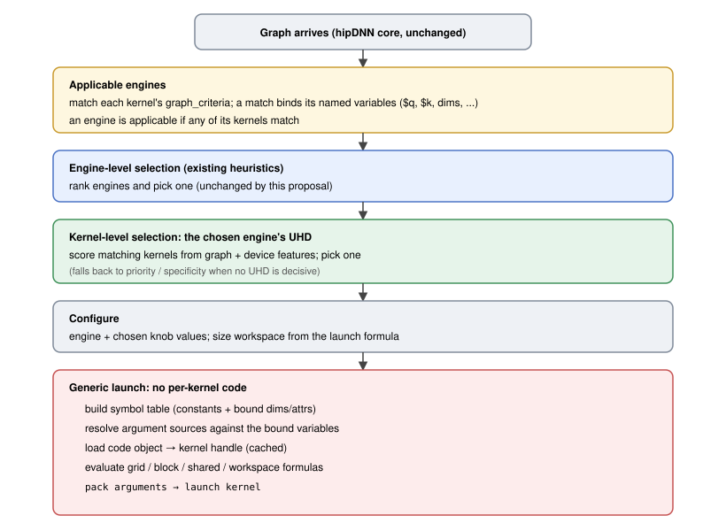

# RFC 0017: Universal Kernel Descriptor (UKD/UED/UHD): A Data-Driven Kernel Ingestor

- Contributors: Brian Harrison

## Table of Contents

1. [Overview](#1-overview)
2. [The Three Descriptors](#2-the-three-descriptors)
3. [How It Works](#3-how-it-works)
4. [Descriptor Formats](#4-descriptor-formats)
5. [Graph Criteria Matching](#5-graph-criteria-matching)
6. [Launch and Workspace](#6-launch-and-workspace)
7. [Kernel Source](#7-kernel-source)
8. [End-to-End Flow](#8-end-to-end-flow)
9. [Multiple Kernels and Composition](#9-multiple-kernels-and-composition)
10. [Packaging and Delivery](#10-packaging-and-delivery)
11. [Worked Example: SDPA as a UKD](#11-worked-example-sdpa-as-a-ukd)
12. [Phased Delivery](#12-phased-delivery)
13. [Risks](#13-risks)
14. [Open Questions](#14-open-questions)
15. [References and Prior Art](#15-references-and-prior-art)
16. [Glossary](#16-glossary)

---

## 1. Overview

Adding a kernel or fused graph to hipDNN's kernel provider today means hand-writing C++ for each one:
a plan builder that matches the graph, an engine, a registration-table entry, bespoke launch code, and
a selection heuristic. Every kernel is a code change and a recompile, and near-identical variants add
up quickly (rocKE already has several variants of SDPA forward across gfx942 and gfx950, and an
operation like convolution would be tens per architecture). Cross-cutting features are the larger
cost, since adding something like hipGraph support or plan serialization means updating each engine by
hand.

This RFC replaces that per-kernel C++ with declarative descriptor files that a single generic provider
loads and runs. An author drops in files and the provider matches, selects, and launches the kernel
with no new code; because behavior lives in one shared base, a cross-cutting feature is added once and
inherited by every descriptor-backed kernel. Three descriptor kinds carry everything the provider
needs:

- **UKD (Universal Kernel Descriptor).** One launchable kernel: when it applies (graph criteria),
  which engine it belongs to, which heuristic ranks it, how to launch it (grid, block, shared
  memory, workspace, and argument binding), and where its code lives.
- **UED (Universal Engine Descriptor).** One engine: a stable identity plus the user-facing knobs
  and tags it exposes. An engine is simply a named group of kernels.
- **UHD (Universal Heuristic Descriptor).** One kernel-selection model: given many kernels that all
  fit a graph, it picks the best one for the problem.

A prototype for a single operation (SDPA) runs a kernel end-to-end from a generic launch core plus a
thin operation-specific adapter (rocKE, [PR #9207](https://github.com/ROCm/rocm-libraries/pull/9207)).
This design generalizes that adapter into data, so that any kernel expressible as a code object plus a
description of when and how to run it can be ingested the same way.


**Scope.** This document is intentionally high-level: it describes the shape of the system, not the
full implementation, and each complex piece (the matcher, the expression language, the packaging
pipeline, the drop-in loader, and the composition layer) will be expanded in its own follow-up RFC.
The first deliverable is the single-kernel path, one UKD with its UED and UHD; multi-kernel programs
and composition ([Section 9](#9-multiple-kernels-and-composition)) are the target design but are
future work, not committed here. UKD covers kernels that reduce to a loadable code object described
declaratively, or that fall back to a named escape hatch for a step that needs real C++ (Sections
[5](#5-graph-criteria-matching) and [6](#6-launch-and-workspace)); anything needing a new C-API
surface or a runtime dependency remains a full provider. It complements build-time codegen rather
than replacing it, since the most tuned kernels come from many sources (hand-written, an assembly
generator, the rocKE generator, or a DSL).

---

## 2. The Three Descriptors

Each descriptor maps directly onto a concept hipDNN already has; the difference is that the concept
becomes data instead of hand-written code.

| Descriptor | Purpose | Exists in hipDNN today as |
|---|---|---|
| **UKD** (kernel) | Accept a graph, then launch a specific kernel for it | A hand-coded `IPlanBuilder::isApplicable` check plus bespoke launch code |
| **UED** (engine) | A stable engine identity with its knobs and tags | The provider's engine-registration table plus a `HIPDNN_REGISTER_ENGINE` id |
| **UHD** (heuristic) | Rank the kernels within one engine and pick one | A ranking model living inside an engine's dispatcher |

The relationships are simple: many UKDs belong to one UED (an engine is a bag of kernels), and many
UKDs are ranked by one UHD (a selection group). UEDs and UHDs are shared and reusable; the UKD is
the leaf that ties them together.


There are two independent selection levels, and they are named apart to avoid conflation. The
**engine-selection heuristic** is hipDNN's existing heuristic plugin interface, which chooses which
engine handles a graph. A UHD is a **kernel-selection heuristic** that operates one level down,
choosing which kernel within an engine to run; it is part of the generic provider, not a new host
interface. Both are needed: engine selection is unchanged by this proposal, and the kernel-selection
heuristic is what makes dropping in a family of kernels useful, because it ranks them per problem.

---

## 3. How It Works

There is one descriptor format, one generic engine, and two ways descriptors reach it:

- **Build-time (AOT).** Descriptors and kernel sources in the source tree are compiled and packed
  per GPU architecture, then installed beside the provider.
- **Runtime drop-in.** Descriptors backed by a prebuilt code object (or JIT source) are placed in a
  folder and loaded when the provider starts, with no build step.

Both paths produce the same thing the generic engine consumes, so everything downstream (matching,
selection, launch) is identical regardless of how a kernel arrived.


At provider load, the generic engine discovers all available descriptors and wires them up: each UED
becomes an engine, each UKD becomes a data-backed plan builder inside its engine, and each UHD
becomes the selector its engine consults. No new host or plugin-ABI interfaces are introduced; the
generic engine satisfies hipDNN's existing contracts using descriptor data, and the new machinery it
needs (the matcher, the expression interpreter, the selector, and the predicate and custom-plan
registries) lives inside the provider behind those contracts.

---

## 4. Descriptor Formats

Descriptors are authored in a human-readable, diffable text format and compiled to a compact binary
form for fast loading. Every descriptor carries a schema version and is refused, never silently
reinterpreted, if it is newer than the runtime understands. The examples below are illustrative.

**UED, an engine with its knobs and tags:**

```jsonc
{
  "schema": "hipdnn.ued/v1",
  "engine": "EXAMPLE_ATTN_ENGINE",            // stable, unique engine identity
  "tags":   ["experimental", "prefill-only"], // user-filterable; extends today's engine behavior notes
  "knobs": [                                    // author-exposed, user-controllable
    {"name": "split_k",     "type": "int", "default": 1, "constraint": {"min": 1, "max": 8}},
    {"name": "use_atomics", "type": "int", "default": 0, "constraint": {"one_of": [0, 1]}}
  ]
}
```

**UHD, a kernel-selection model for one group:**

```jsonc
{
  "schema": "hipdnn.uhd/v1",
  "heuristic": "EXAMPLE_ATTN_LGBM",
  "kind": "model",                     // "model" | "static_order" | "native_predicate"
  "model": {
    "framework": "lightgbm",           // tagged so other frameworks are additive
    "artifact":  "example_attn/model.bin",
    "features":  "example_attn/features.json"
  },
  "objective": "max"                   // higher predicted score wins
}
```

**UKD, one kernel:** three sub-objects, each a hard problem addressed in the sections that follow.

```jsonc
{
  "schema": "hipdnn.ukd/v1",
  "name":      "example_attn_prefill_d128_bf16_gfx942",
  "engine":    "EXAMPLE_ATTN_ENGINE",  // which UED this kernel joins
  "heuristic": "EXAMPLE_ATTN_LGBM",    // which UHD ranks it
  "priority":  100,                     // tie-break when the UHD is not decisive

  "graph_criteria": { ... },           // Section 5: when this kernel applies
  "launch":         { ... },           // Section 6: how to launch it
  "kernel_source":  { ... }            // Section 7: where its code lives
}
```

---

## 5. Graph Criteria Matching

This is the core of the proposal: turning a hand-coded applicability check into declarative data
that a generic matcher can run. Today the check is a C++ switch over the graph. We express the same
intent as data (a structural pattern plus constraints) and compile it once into a fast matcher.

A criterion has two parts:

1. A **structural pattern**: named operation nodes and their named operand/result edges. Because
   hipDNN op graphs are DAGs (shared inputs, multi-output nodes), the pattern is an explicit
   node-and-edge graph, not a nested expression.
2. A **constraint list** attached to those nodes and edges. Constraints implicitly AND together.

Crucially, matching a graph does double duty: it decides the kernel applies and it binds named
variables (`$q`, `$k`, `$root`, dims like `seqlen_q`) to concrete tensors and values. The launch and
workspace formulas ([Section 6](#6-launch-and-workspace)) then reference those bound names, so one
match feeds everything downstream.


The constraint vocabulary covers what the hand-written checks do today:

| Constraint | What it expresses |
|---|---|
| **Opcode** | Exact op, a set of ops, or any op |
| **Dtype** | Exact, one-of-set, or a relation to another tensor's dtype |
| **Shape / rank** | Exact dims, rank only, or symbolic dims that unify across the graph and bind a reusable symbol |
| **Layout** | A dim-order / stride pattern (e.g. NHWC, contiguous) |
| **Attribute** | An op attribute compared by `equals` / `not_equals` / `one_of`, or related to another value |
| **Use-count / exclusivity** | "Used exactly once", or "no consumer outside the pattern", the safety check that a substitution is legal |
| **Cross-tensor relation** | A relation over two or more bound variables (e.g. same head dim across Q/K/V) |
| **Optional / variadic operands** | Optional slots (bias, mask, dropout) that a shorter match may skip |

**Escape hatch.** When a check cannot be expressed declaratively, a criterion may name a
**native predicate** resolved from a provider-internal registry:

```jsonc
{"kind": "native_predicate", "name": "hipdnn.same_head_dim", "args": ["$q", "$k", "$v"], "negated": false}
```

The descriptor carries only a symbol name and a typed argument list drawn from bound variables, never
inline code. This is what lets the identical file load under both the build-time and runtime paths,
since both resolve predicates from the same provider-internal registry. Predicates take explicit
arguments (not the whole graph), so they stay auditable and reusable across kernels. The launch layer
has an analogous escape hatch, a custom plan ([Section 6](#6-launch-and-workspace)); together they
form a graded ladder from fully declarative descriptors, to a named escape hatch for a single step
that needs real C++, to a full provider.

**Arbitration is deterministic.** When several UKDs accept the same graph, the UHD ranks them; if no
UHD is decisive, ties break by explicit `priority`, then by match specificity (a strictly more
constrained pattern wins; if neither pattern's constraints are a superset of the other's, this step
is a tie), then by a stable id order. Declaration order is never used. Two kernels registering an
identical criterion for the same engine is flagged at load rather than silently double-matching.

**Out of scope for v1.** General N-ary commutative matching and unbounded variable-length operation
chains are deferred; bounded commutative pairs and bounded optional slots cover the common fusion
cases.

---

## 6. Launch and Workspace

The second hard problem is launching a matched kernel with no bespoke code.

**One expression language** describes grid, block, shared memory, and workspace as formulas over
symbols. Symbols resolve at plan time from the kernel's compile-time constants and the dims and
attributes bound during matching ([Section 5](#5-graph-criteria-matching)). Evaluation is a safe
interpreter that fails closed on an unknown symbol or an invalid operation; it never executes
arbitrary code, which is what keeps descriptors pure data.

```jsonc
"launch": {
  "grid":  {"x": {"op": "ceil_div", "args": [{"sym": "seqlen_q"}, 16]},
            "y": {"sym": "num_heads"}, "z": {"sym": "batch"}},
  "block": {"x": 256, "y": 1, "z": 1},
  "shared_mem_bytes": 32768,
  "workspace_bytes":  0                 // a formula when the kernel needs scratch
}
```

Workspace, when non-zero, is a sum of terms: dimension products (from the graph) times per-element
byte rates (author constants), gated by knobs or attributes where needed. It is evaluated once per
plan, satisfying hipDNN's existing workspace-size query generically.

**Declarative argument binding** describes each kernel argument and where its value comes from,
so the generic launcher can assemble the call directly from the matched graph:

```jsonc
"launch": {
  ...,
  "args_signature": [
    {"name": "Q",          "kind": "pointer", "source": {"from": "tensor", "ref": "$q"}},
    {"name": "seqlen_q",   "kind": "scalar", "type": "i64", "source": {"from": "dim",    "ref": "$q", "axis": 2}},
    {"name": "stride_q",   "kind": "scalar", "type": "i64", "source": {"from": "stride", "ref": "$q", "axis": 2}},
    {"name": "scale_log2", "kind": "scalar", "type": "f32",
       "source": {"from": "expr",
                  "expr": {"op": "mul", "args": [{"op": "rsqrt", "args": [{"sym": "head_size"}]}, 1.4426950408889634]}}},
    {"name": "__workspace__", "kind": "workspace"}
  ]
}
```

Each argument's `source` (a tensor pointer, a dim or stride read off a bound tensor, an attribute, a
computed expression, or the plan-allocated workspace) is exactly the information the hand-written
adapter supplies today. Making it data removes the per-kernel adapter entirely. In `dim` and `stride`
sources, `axis` indexes the tensor's logical dimension order (as listed in its `shape`), independent
of its physical `layout`.

The generic launcher then does the same steps for every kernel: resolve the argument sources against
the bound variables, evaluate the grid/block/shared/workspace formulas, pack the arguments, load the
kernel's code object, and launch. A parsed launch spec, cached kernel handle, and preallocated
argument buffer keep this close to hand-written launch cost (see [Section 12.1](#12-phased-delivery)).

**Escape hatch: a custom plan.** When the declarative launch cannot express what a kernel needs, for
example a swizzled or data-dependent grid, host-side logic between launches, or nonstandard compile
flags, a UKD's `launch` may name a registered custom plan instead of the declarative fields:

```jsonc
"launch": {"custom_plan": "hipdnn.persistent_gemm", "config": {"compile_flags": ["-mllvm", "..."]}}
```

As with the native predicate ([Section 5](#5-graph-criteria-matching)), the descriptor carries only a
symbol name and typed config, never inline code, and the handler is resolved from the
provider-internal registry. A custom plan still matches its graph declaratively and reports its
workspace size through the handler, so it composes with everything else; only the launch itself
becomes C++. On the drop-in path a custom plan must be a built-in registered handler, subject to the
source-trust rules of [Section 10](#10-packaging-and-delivery).

---

## 7. Kernel Source

A UKD points at its code through a small tagged union. The initial variants:

```jsonc
"kernel_source": {
  "kind": "kpack" | "hsaco" | "hip_source" | "hiprtc"
  // kpack:      a packed multi-arch bundle entry (build-time)
  // hsaco:      a prebuilt code object file (runtime drop-in)
  // hip_source: HIP source compiled ahead of time (build-time)
  // hiprtc:     HIP source JIT-compiled on first use (runtime drop-in)
}
```

The set is deliberately open. Every source, however authored, terminates in a single loadable kernel
handle; adding a new authoring source (for example a higher-level DSL) means adding one variant plus
a handler that lowers it to a code object, never a new launcher or dispatch path. Prebuilt sources
(`kpack`, `hsaco`) need no lowering and ship first; ahead-of-time and JIT compilation follow, reusing
the existing compile pipeline.

---

## 8. End-to-End Flow

The flow below is the standard hipDNN path, with descriptor-backed behavior at each step and no change
to the core, frontend, or plugin interfaces.



### 8.1 Observability and Diagnostics

Because a kernel is now a dropped-in file, operators need to see why one was not selected or not
loaded, and why one winner beat another. Selection and launch are data-driven and inspectable, so
implementation will add diagnostics along the way: a view of the resolved plan and its bindings, a
why-not and arbitration trace, and timing of descriptor discovery and JIT compilation.

---

## 9. Multiple Kernels and Composition

So far a UKD is one kernel: one match, one launch. Two capabilities need more than one kernel to
satisfy a graph, and both extend the existing model. Selection composition adds one new descriptor
kind, the UCD.

Composition is presented here as the target design, so the single-kernel format does not foreclose
it. It is future work, not committed in this RFC or its first deliverable, and it will be specified
in its own follow-up RFC.

- **Execution composition (several kernels for one operation).** Some operations are intrinsically
  multi-launch. A fused attention backward pass is three co-designed kernels over one problem: a
  preprocess that computes `D = rowsum(dO * O)`, a `dK/dV` kernel, and a `dQ` kernel. Split-K GEMM
  with a separate reduction has the same shape. These kernels share tiling and scratch, are authored
  together, and are selected as a unit.
- **Selection composition (a pipeline of separately-chosen kernels).** A graph is satisfied by
  chaining independently-authored kernels, each picked by its own heuristic, for example
  `Transpose -> Work -> Transpose`, where a reusable transpose adapts a layout the work kernel
  requires. The pieces are not co-designed; each is chosen on its own merits.

The unifying idea is that a UKD resolves to a program: an ordered sequence of launch steps over a
shared symbol table and a shared set of named intermediate buffers. The single-launch kernel is just
the one-step case, so nothing authored today changes.


### 9.1 Several Kernels for One Operation

A UKD's `launch` generalizes from one launch to an ordered `steps` array. The graph is still matched
once and its variables bound once; every step shares that binding and symbol table. Each step carries
its own grid, block, shared memory, kernel source, and argument signature, and steps run in written
order on the plan stream so a producer's writes are visible to its consumers. The whole program is
ranked as a unit by a single heuristic (it competes against other whole programs for the same graph,
not against its own steps) and is selected atomically; a caller never picks a subset of its steps.

```jsonc
{
  "schema": "hipdnn.ukd/v1",
  "name":      "sdpa_bwd_d128_bf16_gfx942",
  "engine":    "ROCKE_ENGINE",
  "heuristic": "ROCKE_LGBM",              // one pick: the triplet is co-designed

  "graph_criteria": { ... },              // matches sdpa_bwd once, binds vars
  "intermediates": [                      // named scratch (see 9.3)
    {"name": "$D", "dtype": "FLOAT", "shape": ["batch", "num_heads", "seqlen_q"]}
  ],
  "steps": [
    {"name": "preprocess", "kernel_source": { ... }, "grid": { ... }, "block": { ... },
     "args_signature": [
       {"name": "O",  "kind": "pointer", "source": {"from": "tensor", "ref": "$o"}},
       {"name": "dO", "kind": "pointer", "source": {"from": "tensor", "ref": "$do"}},
       {"name": "D",  "kind": "pointer", "source": {"from": "intermediate", "ref": "$D", "access": "write"}}
     ]},
    {"name": "dkdv", "kernel_source": { ... }, "grid": { ... }, "block": { ... },
     "args_signature": [ /* Q, K, V, dO, D(read), dK(write), dV(write) */ ]},
    {"name": "dq",   "kernel_source": { ... }, "grid": { ... }, "block": { ... },
     "args_signature": [ /* Q, K, V, dO, D(read), dQ(write) */ ]}
  ]
}
```

### 9.2 A Pipeline of Separately-Chosen Kernels

Folding `Transpose -> Work -> Transpose` into one UKD would be wrong, because the transposes are
reusable, separately-tuned kernels that each deserve their own heuristic. A **composite descriptor
(UCD)** instead declares an ordered array of stages wired by intermediate tensors. Each stage
resolves to a concrete UKD at plan time, ranked by that stage's own heuristic.

A stage does not embed a kernel. It names its input and output tensors (drawn from the composite's
bound graph tensors and its declared intermediates) and a `select` that references kernels in one of
two ways:

- `select.criteria`: a graph fragment over the stage's tensors. Any registered UKD whose own
  `graph_criteria` accepts that fragment is a candidate, so kernels dropped in later are picked up
  automatically. This is the open, drop-in-friendly form.
- `select.candidates`: an explicit array of UKD names, for when a stage should draw from a fixed set.

Either way the stage's `heuristic` ranks the resolved candidates and picks one, exactly as a single
UKD is chosen within an engine. Because a resolved stage may itself be a multi-step program
([Section 9.1](#91-several-kernels-for-one-operation)), the composite's plan is the concatenation of
its stages' programs, with each stage's intermediates remapped into the composite's buffer set.

```jsonc
{
  "schema": "hipdnn.ucd/v1",              // UCD = Universal Composite Descriptor
  "name":   "layout_adapted_work",
  "engine": "PIPELINE_ENGINE",            // its own engine; engine selection picks it vs. the fused engine
  "graph_criteria": { ... },              // matches the work fragment once; binds $x (in), $y (out)

  "intermediates": [
    {"name": "$x_t", "dtype": {"same_as": "$x"}, "shape": {"layout_of": "$x", "as": "nchw"}},
    {"name": "$y_t", "dtype": {"same_as": "$y"}, "shape": {"layout_of": "$y", "as": "nchw"}}
  ],
  "stages": [
    {"name": "transpose_in",  "in": "$x",   "out": "$x_t",
     "select": {"criteria": {"op": "transpose"},        "heuristic": "TRANSPOSE_LGBM"}},
    {"name": "work",          "in": "$x_t", "out": "$y_t",
     "select": {"criteria": { ... work fragment ... },  "heuristic": "WORK_LGBM"}},
    {"name": "transpose_out", "in": "$y_t", "out": "$y",
     "select": {"candidates": ["transpose_nchw_nhwc_gfx942", "transpose_generic"],
                "heuristic": "TRANSPOSE_LGBM"}}
  ]
}
```

The choice between a fused kernel and a decomposed pipeline is not made inside a descriptor: each
alternative is its own engine, so ordinary engine-selection ([Section 2](#2-the-three-descriptors))
picks between them, with no new composite cost model.

### 9.3 Intermediate Buffers

Both capabilities share one new data model. The scalar workspace of
[Section 6](#6-launch-and-workspace) generalizes to a set of named regions, each with a dtype and a
symbolic shape drawn from the same expression language and bound dims as grid and block:

```jsonc
"intermediates": [
  {"name": "$D", "dtype": "FLOAT", "shape": ["batch", "num_heads", "seqlen_q"], "align": 256}
]
```

These named regions are a new descriptor construct, sub-allocated from the single flat workspace
pointer the host already provides, which is why they need no ABI change. Workspace size is
the sum of the region sizes: the existing workspace-size query, answered with a sum over regions
instead of a single term. A new argument source,
`{"from": "intermediate", "ref": "$D", "access": "read" | "write"}`, binds a region to a step
alongside the tensor/dim/stride/attr sources of [Section 6](#6-launch-and-workspace). Each region has
a single writer; it is live from that write to its last read, so non-overlapping regions may later
share storage. The initial model simply sums them.

### 9.4 Execution and Selection

The launcher gains one outer loop: sub-allocate each region from the plan workspace once, then for
each step bind arguments, evaluate the grid/block/shared formulas, load the code object, pack, and
launch on the plan stream. Because a resolved program is a fixed launch sequence over fixed offsets,
it is a natural capture-and-replay target when launch latency matters.

Selection reuses the two levels defined in [Section 2](#2-the-three-descriptors): a program is one
UKD ranked by its UHD, competing alternatives are separate engines ranked by the existing engine
chain, and within a composite each stage resolves in dependency order by its own heuristic. A
mandatory stage with no candidate fails the composite closed, and engine selection falls through to
another engine. Comparing whole pipelines against each other never arises, because those alternatives
are separate engines the existing chain already ranks.

Cross-step correctness is the new surface, validated at build and load: every read of an intermediate
is preceded by a write with matching dtype and shape, every region is written before it is read, the
stage graph is acyclic, and a composite is offered on a given architecture only if every mandatory
stage has at least one candidate kernel for that architecture. The detailed liveness and
storage-sharing model is deferred to the composition follow-up RFC.

### 9.5 What This Adds

| Capability | Existing piece | Extension |
|---|---|---|
| Multi-launch program | UKD body; launch spec ([Section 6](#6-launch-and-workspace)) | `launch` becomes an ordered `steps[]`; one launch is the one-step case |
| Intermediate buffers | workspace + argument sources ([Section 6](#6-launch-and-workspace)) | scalar workspace becomes named `intermediates[]`, summed; new `intermediate` argument source |
| Composite pipeline | concepts ([Section 2](#2-the-three-descriptors)); matching ([Section 5](#5-graph-criteria-matching)) | a composite descriptor (UCD) whose stages resolve to UKDs |
| Alternative selection | engine selection ([Section 2](#2-the-three-descriptors)) | each alternative is its own engine; the existing chain arbitrates |
| Cross-step safety | validation | producer-before-consumer, acyclicity, and per-arch coverage gates |

The only new descriptor kind is the UCD. There are no new plugin interfaces and no hipDNN core
changes: a multi-step program is an extended UKD, and a pipeline is one composite descriptor that
resolves to ordinary UKDs.

---

## 10. Packaging and Delivery

The two ingestion paths differ only in where a kernel's code comes from:

- **Build-time (AOT).** Discover and validate descriptors, compile each kernel per target
  architecture, pack the code objects into per-arch bundles with a self-describing manifest, and
  install them beside the provider. The manifest records provenance (architecture, toolchain,
  build id) so incompatible bundles are rejected before load.
- **Runtime drop-in.** The path is off by default and enabled by an explicit environment flag; when
  enabled, the descriptor source directories are given by an environment variable (for example
  `HIPDNN_UKD_PATH`). Each directory is scanned at startup, each descriptor is compiled to a matcher
  once and registered exactly as an installed one, a single package may declare many descriptors and
  register them all, and a bad descriptor is quarantined on load without failing the rest of the
  folder. JIT kernels compile on first use and cache their result.

Compatibility is gated the same way in both paths: a descriptor whose schema version, required
architecture, or toolchain does not match the runtime is refused with a clear error rather than
risking silent misexecution.

**Trust boundary.** Prebuilt code objects, whether packed in a bundle or installed into the
provider's tree, inherit the trust of that install tree: an actor who can write them there can
already replace hipDNN's own installed libraries, so they are not a new surface. Runtime JIT of author
source is different, since it invokes a compiler on author-controlled text; the intent is still to
support dropping in sources, so JIT source lives in a sibling directory beside the installed
`arch_content` and is enabled by its own opt-in. The exact requirements for trusting a source, up to
and including restricting drop-in to prebuilt code objects, are deferred to the delivery follow-up
RFC; this RFC commits only to the shape, that prebuilt inherits install-tree trust and that JIT
source is opt-in with its trust rules defined before it ships.

---

## 11. Worked Example: SDPA as a UKD

The SDPA path prototyped in the rocKE work ([PR #9207](https://github.com/ROCm/rocm-libraries/pull/9207)),
a graph allowlist plus a grid-symbol table plus hand-written argument wiring, collapses into the single
descriptor below.
This shows the model is sufficient for a real kernel: every SDPA-specific line of C++ maps to a data
field.

```jsonc
{
  "schema": "hipdnn.ukd/v1",
  "name":      "sdpa_fwd_d128_bf16_gfx942",
  "engine":    "ROCKE_ENGINE",
  "heuristic": "ROCKE_LGBM",
  "priority":  100,

  "graph_criteria": {
    "nodes": [
      {"kind": "op", "id": "root", "op": "sdpa_fwd",
       "operands": {"Q": "$q", "K": "$k", "V": "$v"}, "results": {"O": "$o"}}
    ],
    "constraints": [
      {"on": "$q", "dtype": {"one_of": ["BFLOAT16"]}, "layout": "bhsd",
       "shape": ["batch", "num_heads", "seqlen_q", "head_size"]},
      {"on": "$k", "dtype": {"one_of": ["BFLOAT16"]}, "shape": ["batch", "num_heads", "seqlen_k", "head_size"]},
      {"on": "$v", "dtype": {"one_of": ["BFLOAT16"]}},
      {"kind": "native_predicate", "name": "hipdnn.same_head_dim", "args": ["$q", "$k", "$v"]},
      {"on": "root", "attr": {"head_size": {"equals": 128}, "mask_mode": {"one_of": ["none"]}}}
    ]
  },

  "launch": {
    "grid":  {"x": {"op": "ceil_div", "args": [{"sym": "seqlen_q"}, 16]},
              "y": {"sym": "num_heads"}, "z": {"sym": "batch"}},
    "block": {"x": 256, "y": 1, "z": 1},
    "shared_mem_bytes": 32768,
    "workspace_bytes":  0,
    "args_signature": [
      {"name": "Q", "kind": "pointer", "source": {"from": "tensor", "ref": "$q"}},
      {"name": "K", "kind": "pointer", "source": {"from": "tensor", "ref": "$k"}},
      {"name": "V", "kind": "pointer", "source": {"from": "tensor", "ref": "$v"}},
      {"name": "O", "kind": "pointer", "source": {"from": "tensor", "ref": "$o"}},
      {"name": "scale_log2", "kind": "scalar", "type": "f32",
        "source": {"from": "expr",
                   "expr": {"op": "mul", "args": [{"op": "rsqrt", "args": [{"sym": "head_size"}]}, 1.4426950408889634]}}},
      {"name": "seqlen_q",   "kind": "scalar", "type": "i64", "source": {"from": "dim",    "ref": "$q", "axis": 2}},
      {"name": "seqlen_k",   "kind": "scalar", "type": "i64", "source": {"from": "dim",    "ref": "$k", "axis": 2}},
      {"name": "stride_q",   "kind": "scalar", "type": "i64", "source": {"from": "stride", "ref": "$q", "axis": 2}}
      // remaining strides follow the same pattern, indexed by logical axis order
    ]
  },

  "kernel_source": {"kind": "kpack", "entry": "rocke/sdpa_fwd/d128_bf16_gfx942"}
}
```

The graph allowlist becomes `graph_criteria`; the grid-symbol table becomes symbols bound during
matching; the argument wiring becomes `args_signature[].source`. The generic launcher runs it with
no SDPA-specific code.

---

## 12. Phased Delivery

Each phase is independently shippable and validated against the SDPA path from the rocKE work, with
the testing and performance checks of [Section 12.1](#12-phased-delivery), so the generic path is
shown to match the hand-written one before any hand-written code is removed. Each phase's design
details are expected to land as its own follow-up RFC.

1. **Generalize the launch core.** Lift the prototype's launch core into a shared, operation-agnostic
   module; add the expression language, workspace formula, and declarative argument binding.
   Re-express SDPA launch as data.
2. **Descriptor formats and registry.** Define the UKD/UED/UHD formats; populate the generic engine
   and plan builders from data, replacing static registration for descriptor-backed engines.
3. **Graph-criteria matcher.** Declarative pattern and constraint model, native-predicate escape
   hatch, compile-once matcher, and deterministic arbitration. Replace the SDPA graph decode with a
   criterion.
4. **AOT packaging.** Producer, packer, and manifest for arbitrary descriptor sets, with validation
   and duplicate detection in the build.
5. **Runtime drop-in.** Folder discovery, prebuilt and JIT source kinds, compatibility gating, and
   the enablement flag and trust controls of [Section 10](#10-packaging-and-delivery).
6. **UHD kernel selection.** The generic selector driven by UHD model content, consulted by the
   engine to rank matching kernels.

Composition and pipelines ([Section 9](#9-multiple-kernels-and-composition)) are future work and are
not committed in this plan.

### 12.1 Testing and Performance

UKD does not introduce a new testing strategy; it reuses hipDNN's (`docs/Testing.md`,
`docs/testing/TestingStrategy.md`) and slots into the established tiers. A UKD-backed kernel runs
through the generic engine as an ordinary engine and produces the same `graph.fbs` graphs everything
else consumes, so the existing correctness path applies unchanged: the plugin-agnostic integration
harness ([RFC 0006](0006_PluginAgnosticIntegrationTests.md)) validates the generic engine against the
CPU reference ([RFC 0001](0001_CpuGraphExecutorDesign.md)) with the golden-reference tolerance chain
([RFC 0011](0011_GoldenReferenceValidation.md)), and each descriptor-backed engine carries support
claims ([RFC 0015](0015_EngineSupportClaims.md)) like any other. New UKD tests go into those tiers,
not a parallel framework.

Three areas are new to UKD:

- **Fuzzing the descriptor pipeline.** The loader, matcher, and expression interpreter parse input
  that is untrusted on the drop-in path. UKD adds a seed corpus and a fuzzer over them, run under the
  existing ASAN build, backing the fail-closed requirement of [Section 13](#13-risks).
- **Generic-vs-hand-written parity.** A cross-engine test runs the same graph through the generic path
  and a hand-written engine and asserts numerical agreement, proving the generic launch and argument
  packing equivalent to the code they replace, and that a loaded UKD leaves the selection unchanged
  for graphs it covers.
- **Launch overhead.** Generic launch and plan-time matching add some overhead; the goal is to keep it
  minimal. As hipDNN's benchmarking and performance testing (`tools/dnn-benchmarking`,
  [RFC 0013](0013_Autotune.md)) matures, UKD's overhead is validated against the hand-written
  baseline. Loading is lazy and cached, so the cost is paid once at plan build.

---

## 13. Risks

This proposal is high-level by design, so several hard areas are called out here and deferred to
follow-up RFCs rather than solved now.

- **Performance.** Generic launch and plan-time matching add overhead over hand-written code; the
  goal is to keep it minimal, validated via hipDNN's benchmarking ([Section 12.1](#12-phased-delivery)).
  Matching is compiled and indexed by root opcode so match cost does not grow linearly with descriptor
  count.
- **Trust and enablement.** Prebuilt drop-in inherits install-tree trust and is opt-in and off by
  default; runtime JIT of author source is a separate opt-in with trust rules deferred to the delivery
  follow-up RFC ([Section 10](#10-packaging-and-delivery)).
- **Hostile and malformed input.** The descriptor loader, the matcher, and the expression interpreter
  parse input that, on the drop-in path, may be untrusted or simply malformed. They must be bounded
  (recursion, step count, and size limits) and fail closed rather than crash, and shape and workspace
  arithmetic must use checked-width integers that fail closed on overflow rather than under-allocate.
- **Identity collisions.** Engine and heuristic names must be unique; validated at build, and a
  colliding drop-in id is logged and ignored rather than taking down the provider. Namespacing (for
  example a vendor prefix) is encouraged.
- **Compatibility and caching.** Descriptors are refused when newer than the runtime understands, and
  architecture and toolchain are gated before load. Additive schema evolution and JIT cache-key
  composition (architecture, toolchain, driver and runtime version, source hash, descriptor version)
  will be defined per subsystem.
- **Composition correctness (future).** When composition ([Section 9](#9-multiple-kernels-and-composition))
  is pursued, concatenating and remapping programs must preserve each sub-program's buffer
  assumptions (dtype, shape, alignment, single-writer, no aliasing between concurrently-live regions),
  all steps must run on the plan stream, and a composite must have per-arch stage coverage. The
  single-kernel first deliverable carries none of this.

---

## 14. Open Questions

1. **Identity for drop-in-only engines:** require a pre-registered engine name (safer,
   collision-checked) or allow an identity minted from the descriptor (lower friction, higher risk)?
2. **Source trust for drop-in:** what is the minimum trust requirement for drop-in JIT source, from
   restricting drop-in to prebuilt code objects, to bounding compiler inputs, to a separate opt-in?
3. **Composition:** if composition ([Section 9](#9-multiple-kernels-and-composition)) is pursued,
   should multi-step programs land before composite pipelines?
4. **Expression coverage:** validate the expression language against several real kernels (for
   example a split-K GEMM with workspace, a normalization, and a ragged attention that forces the
   data-dependent-launch discussion) before freezing it.
5. **Feature-vector contract:** standardize a graph/device feature extractor so selection models are
   portable across UHDs, or keep it per-model?

---

## 15. References and Prior Art

The design borrows established ideas rather than inventing new ones. These systems informed specific
choices; none is a dependency.

| System | Idea borrowed |
|---|---|
| **MLIR PDL / PDLL** | Two-layer design (declarative pattern compiled to a fast matcher); constraints inline on the binding; named native-predicate escape hatch; pattern priority |
| **TVM Relax DFPattern** | Constraint vocabulary (op, dtype, symbolic shape, wildcard); dataflow use-def constraints; cross-tensor same-shape relations |
| **XLA pattern matcher** | Exact-vs-compatible equality; use-count vs user-count; layout as a distinct constraint; optional operands; capture-by-reference |
| **PyTorch Inductor / torch.library** | Node/edge pattern vocabulary; serialized precompiled patterns; duplicate-pattern detection; fake-tensor shape derivation as the basis for symbolic workspace sizing |
| **ExecuTorch** | Tag-then-lower seam; backend interface (is-available, init, execute); name-keyed registration; compatibility rejection |
| **ONNX Runtime** | First-claim-wins arbitration; single-node vs fused-subgraph capability; shared-context blobs; session-scoped drop-in registration |
| **MIGraphX** | Generic code-object launch (raw module load plus kernarg patching); problem-to-solution cache; module-of-instructions model for fused operations |
| **Triton AOT** | Generic launch stub with trailing scratch slots |
| **CUTLASS / CK / Tensile** | Description/configuration/arguments split; per-problem workspace sizing; workspace as a sum of dim-product terms times byte rates; natural-alignment argument packing |

---

## 16. Glossary

- **UKD / UED / UHD:** Universal Kernel / Engine / Heuristic Descriptor (this design).
- **UCD (Universal Composite Descriptor):** a pipeline of stages, each resolving to a UKD chosen by
  its own heuristic ([Section 9.2](#92-a-pipeline-of-separately-chosen-kernels)).
- **AOT:** ahead-of-time compilation; kernels compiled per architecture at build time and installed
  beside the provider, as opposed to runtime JIT.
- **Custom plan:** a registered launch handler a UKD names when the declarative launch cannot express
  its needs; carried as a symbol name and typed config, never inline code
  ([Section 6](#6-launch-and-workspace)).
- **Engine-selection heuristic / kernel-selection heuristic:** the two selection levels; the
  engine-selection heuristic (existing) picks the engine, the kernel-selection heuristic (a UHD) picks
  the kernel within it.
- **Program / steps:** a UKD resolves to an ordered sequence of launch steps sharing one symbol table
  and one set of intermediate buffers; a single-launch kernel is the one-step case
  ([Section 9](#9-multiple-kernels-and-composition)).
- **Intermediate buffer:** a named scratch region with a dtype and symbolic shape, written by one
  step and read by later steps; workspace size is the sum of a program's regions.
- **Engine:** a named group of kernels with a stable identity; hipDNN selects among engines, then a
  UHD selects a kernel within the chosen engine.
- **Graph criteria:** the declarative pattern and constraints that decide whether a kernel applies to
  a graph, and bind the variables its launch and workspace formulas use.
- **Code object:** a loadable, prebuilt GPU kernel binary.
- **kpack:** a packed multi-architecture archive of code objects.
- **Escape hatch:** a named, registry-resolved predicate or binding for logic the declarative model
  cannot express, carried as a symbol name and typed arguments, never inline code.
