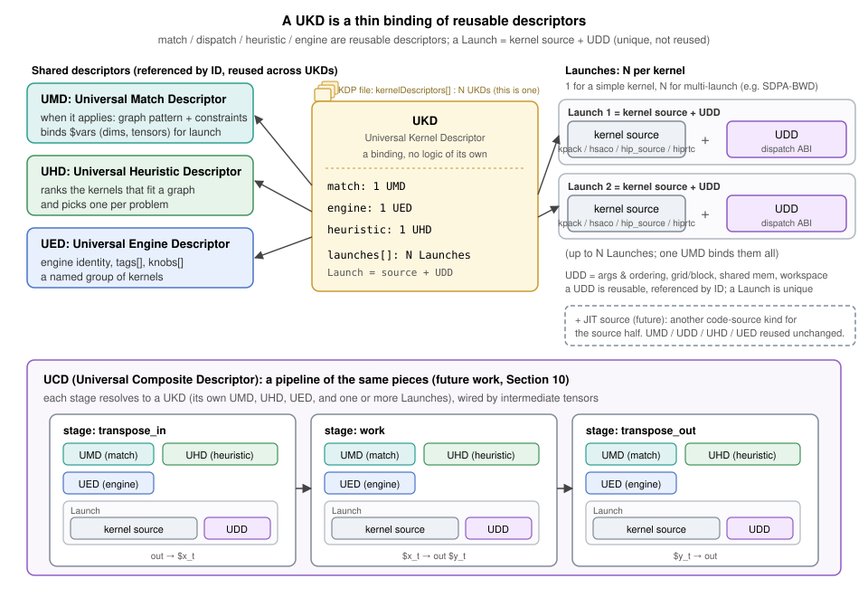
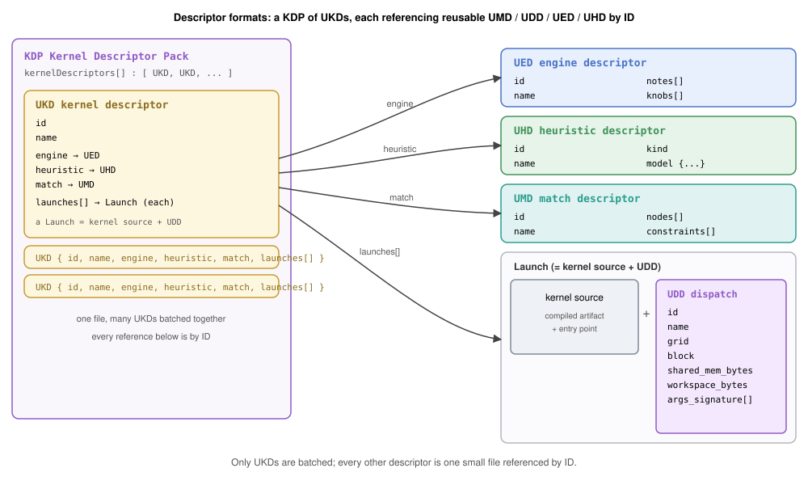

# RFC 0017: Universal Kernel Descriptors (UKD/UMD/UDD/UED/UHD): A Data-Driven Kernel Ingestor

- Contributors: Brian Harrison

## Table of Contents

1. [Overview](#1-overview)
2. [The Descriptors](#2-the-descriptors)
3. [How It Works](#3-how-it-works)
4. [Descriptor Formats](#4-descriptor-formats)
5. [Matching and the UMD](#5-matching-and-the-umd)
6. [Dispatch and Workspace](#6-dispatch-and-workspace)
7. [Kernel Source](#7-kernel-source)
8. [Adapters and Extensibility](#8-adapters-and-extensibility)
9. [Observability and Diagnostics](#9-observability-and-diagnostics)
10. [Packaging and Delivery](#10-packaging-and-delivery)
11. [Worked Example: SDPA as a UKD](#11-worked-example-sdpa-as-a-ukd)
12. [Phased Delivery](#12-phased-delivery)
13. [Multiple Kernels and Composition](#13-multiple-kernels-and-composition)
14. [Risks](#14-risks)
15. [Open Questions](#15-open-questions)
16. [References and Prior Art](#16-references-and-prior-art)
17. [Glossary](#17-glossary)

---

## 1. Overview

Every kernel hipDNN's kernel provider runs is hand-written C++: a plan builder that matches the graph,
an engine, a registration-table entry, bespoke launch code, and a selection heuristic. Carrying each
kernel's behavior as code creates four problems that compound as the library grows.

- **Scale.** Kernels multiply combinatorially: a variant per architecture, data type, and problem
  shape, and again per fused form. rocKE (ROCm's kernel engine) already carries three to four SDPA-forward variants per
  architecture, and convolution alone spans several algorithm families (implicit GEMM, explicit GEMM,
  direct, and Winograd). Ten variants per architecture is a near-term floor, with hundreds looming as
  coverage grows toward every algorithm and architecture. Each variant is another hand-written engine.
- **Staleness.** These kernels come from upstream authors who revise them continuously, but every
  variant is hand-ported C++, so staying current means re-porting by hand. hipDNN falls behind: a stale
  copy misses a niche uplift (sometimes more than 2x) or keeps selecting a solution that is now 2x
  slower, and the built value goes undelivered until the re-port is prioritized.
- **Maintainability.** Every hand-written variant is code the team then carries: it must be tested,
  kept building, updated as interfaces change, and fixed when it breaks. The near-identical copies drift
  apart over time, so that burden, test coverage included, is paid again for each one, with no single
  source of truth.
- **Feature velocity.** A cross-cutting change, such as hipGraph support or plan serialization, has to
  be threaded by hand through every one of those near-duplicate engines, so platform features arrive
  slowly and unevenly.

This RFC moves kernel behavior out of code and into data: declarative descriptor files that one
generic provider loads and runs. An author drops in files and the provider matches, selects, and
launches the kernel with no new code, and because the behavior lives in one shared base, a
cross-cutting feature is written once and inherited by every descriptor-backed kernel. The provider
works from a small family of reusable descriptors, bound together for one kernel by a UKD:

- **UMD (Universal Match Descriptor).** When a kernel applies: the graph pattern and constraints,
  which also bind the named variables a launch references.
- **UDD (Universal Dispatch Descriptor).** How to invoke a kernel, the dispatch ABI: argument binding
  and ordering, grid, block, shared memory, and workspace.
- **UED (Universal Engine Descriptor).** One engine: a stable identity plus the knobs it exposes and
  its behavior and numerical notes. An engine is a named group of kernels.
- **UHD (Universal Heuristic Descriptor).** One kernel-selection model: given many kernels that fit a
  graph, it picks the best one for the problem.
- **UKD (Universal Kernel Descriptor).** One launchable kernel, a thin binding with no logic of its
  own. It names one UMD, one UED, one UHD, and one or more Launches, where a **Launch pairs a kernel
  source with a UDD**.

A family of near-identical kernels shares one engine (UED), one selector (UHD), a few matches, and a
couple of dispatch descriptors, but is *many* kernels, so only kernels are batched: a **KDP
(KernelDescriptorPack)** is one file holding `kernelDescriptors[]`, an array of UKDs. Every other
descriptor is authored once and referenced by ID, so the family is a few shared descriptors plus one
small UKD each, not hundreds of near-duplicate files.

A prototype for a single operation (SDPA) runs a kernel end-to-end from a generic launch core plus a
thin operation-specific adapter (rocKE, [PR #9207](https://github.com/ROCm/rocm-libraries/pull/9207)).
This RFC generalizes that adapter into a complete data description of a kernel and makes that
generalized form the delivery vehicle: any kernel expressible as a code object plus a description of
when and how to run it is ingested the same way.


**Vision.** The goal is to let kernel authors own delivery end to end. hipDNN provides the tools and
platform to describe, package, and release a kernel; the author takes it the rest of the way without
waiting on provider changes. This cuts the friction from writing a fast kernel to shipping it and gives
a defined path for extending the system. The end state is one generalized description covering both
ahead-of-time (AOT) and just-in-time (JIT) kernels; AOT is the focus here, and JIT is a future
follow-on ([Section 8.3](#83-future-jit-and-normalized-providers)).

**Scope.** This document frames the system and its direction; each descriptor format (UMD, UDD, UED,
UHD) and subsystem (the matcher, the expression language, packaging, and the drop-in loader) is
designed in its own follow-up RFC ([Section 12.2](#122-follow-up-rfcs)). The first deliverable is the
single-kernel path. Multi-kernel launch and composition
([Section 13](#13-multiple-kernels-and-composition)) are fast-follows, not part of this initial design.
A named escape hatch covers a step that genuinely needs C++ (Sections [5](#5-matching-and-the-umd) and
[6](#6-dispatch-and-workspace)); anything needing a new C-API surface or runtime dependency stays a
full provider. This complements build-time codegen rather than replacing it.

### 1.1 What Ships Now Versus Later

| Capability | This RFC (day-one) | Deferred to a follow-up |
|---|---|---|
| Single-kernel path: UKD + UMD + UDD + UED + UHD | Yes | None |
| Fusion: one UMD matches a bounded multi-op subgraph, run as one kernel | Yes ([§5](#5-matching-and-the-umd)) | None |
| Match constraints: opcode, dtype, shape, layout, attribute, use-count, cross-tensor, bounded optional and commutative slots | Yes ([§5](#5-matching-and-the-umd)) | None |
| General matching: N-ary commutative, unbounded chains | None | JIT ([§8.3](#83-future-jit-and-normalized-providers)) |
| Kernel sources | `kpack`, `hsaco` first; `hip`, `hiprtc` follow | new authoring adapters, DSLs ([§8.1](#81-kernel-source-adapters)) |
| Heuristic sources | LightGBM model; custom C-API library | other model formats, static tables ([§8.2](#82-heuristic-adapters)) |
| Runtime drop-in | prebuilt code objects, opt-in, off by default | JIT-compiled sources ([§10](#10-packaging-and-delivery)) |
| Multi-kernel launch program (e.g. SDPA-BWD) | None | composition ([§13.1](#131-several-kernels-for-one-operation)) |
| Selection composition: UCD pipeline | None | composition ([§13.2](#132-a-pipeline-of-separately-chosen-kernels)) |
| JIT compilation; normalized providers | None | JIT ([§8.3](#83-future-jit-and-normalized-providers)) |

---

## 2. The Descriptors

Each descriptor maps directly onto a concept hipDNN already has; the difference is that the concept
becomes data instead of hand-written code.

| Descriptor | Purpose | Exists in hipDNN today as |
|---|---|---|
| **UKD** (kernel) | Bind the pieces below into one launchable kernel | A hand-coded `IPlanBuilder::isApplicable` check plus bespoke launch code |
| **UMD** (match) | Accept a graph and bind its named variables | The graph half of `isApplicable` |
| **UDD** (dispatch) | Invoke a kernel: args & ordering, grid/block, shared mem, workspace | The bespoke launch and argument-wiring code |
| **UED** (engine) | A stable engine identity with its knobs and behavior/numerical notes | The provider's engine-registration table plus a `HIPDNN_REGISTER_ENGINE` id |
| **UHD** (heuristic) | Rank the kernels within one engine and pick one | A ranking model living inside an engine's dispatcher |

A UKD carries no logic of its own. It binds one UMD, one UED, one UHD, and one or more Launches, where
a **Launch** is a kernel source paired with a UDD. A simple kernel has one Launch; a multi-launch
kernel such as SDPA backward has several, all bound by the one UMD
([Section 13](#13-multiple-kernels-and-composition)). Because the UMD, UDD, UED, and UHD are referenced
by ID, many UKDs share one UED (an engine is a group of kernels) and one UHD (a selection group), and
only the Launch is unique to a kernel.



Two more terms complete the set: a **KDP (KernelDescriptorPack)** batches many UKDs into one file
(the deployment shape of [Section 1](#1-overview)), and a **UCD (Universal Composite Descriptor)**
composes stages that each resolve to a UKD (future work, [Section 13](#13-multiple-kernels-and-composition)).


There are two independent selection levels, and they are named apart to avoid conflation. The
**engine-selection heuristic** is hipDNN's existing heuristic plugin interface, which chooses which
engine handles a graph. A UHD is a **kernel-selection heuristic** that operates one level down,
choosing which kernel within an engine to run; it is part of the generic provider, not a new host
interface. Both are needed: engine selection is unchanged by this proposal, and the kernel-selection
heuristic is what makes dropping in a family of kernels useful, because it ranks them per problem.

---

## 3. How It Works

There is one family of descriptor formats, one generic engine, and two ways descriptors reach it:

- **Build-time (AOT).** Descriptors and kernel sources in the source tree are compiled and packed
  per GPU architecture, then installed beside the provider.
- **Runtime drop-in.** Descriptors backed by a prebuilt code object (or JIT source) are placed in a
  folder and loaded when the provider starts, with no build step.

Both paths produce the same thing the generic engine consumes, so everything downstream (matching,
selection, launch) is identical regardless of how a kernel arrived.


At provider load, the generic engine discovers all available descriptors and wires them up: each UED
becomes an engine, each UKD becomes a data-backed plan builder inside its engine, and each UHD
becomes the selector its engine consults. No new host or plugin-ABI interfaces are introduced; the
generic engine satisfies hipDNN's existing contracts using descriptor data, and the new machinery it
needs (the matcher, the expression interpreter, the selector, and the predicate and custom-plan
registries) lives inside the provider behind those contracts.

---

## 4. Descriptor Formats

Descriptors are authored in a human-readable, diffable text format and compiled to a compact binary
form for fast loading. Each format has a defined schema (a JSON Schema or FlatBuffer definition) and a
version; a descriptor is refused, never silently reinterpreted, if its version is newer than the
runtime understands, and the concrete schema for each format lands in that format's follow-up RFC.
Every descriptor also carries a stable, opaque `id` used for cross-references and a `name` that is mandatory for
logging and diagnostics; both appear in the examples. The examples are illustrative, and the
`schema`/version plumbing is shown once here and elided elsewhere.



**UED, an engine with its knobs and notes:**

```jsonc
{
  "schema": "hipdnn.ued/v1",
  "id":     3310472051,                        // stable, unique; referenced by UKDs
  "name":   "Example attention engine",        // human-readable label
  "behavior_notes":  ["runtime_compilation"],  // hipDNN behavior notes for this engine
  "numerical_notes": ["tensor_core", "reduced_precision_reduction"],  // hipDNN numerical notes
  "knobs": [                                   // author-exposed, user-controllable
    {"name": "split_k",     "type": "int", "default": 1, "constraint": {"min": 1, "max": 8}},
    {"name": "use_atomics", "type": "int", "default": 0, "constraint": {"one_of": [0, 1]}}
  ]
}
```

**UHD, a kernel-selection model for one group:**

```jsonc
{
  "schema": "hipdnn.uhd/v1",
  "id":     3310472052,       // stable, unique; referenced by UKDs
  "name":   "Example attention LightGBM selector",
  "kind":   "model",          // "model" | "static_order" | "custom_library"
  "model": {
    "framework": "lightgbm",  // tagged so other frameworks are additive
    "artifact":  "example_attn/model.bin",
    "features":  "example_attn/features.json"
  },
  "objective": "max"          // higher predicted score wins
}
```

**UMD, when a kernel applies** ([Section 5](#5-matching-and-the-umd)): a graph pattern plus constraints, referenced by ID.

```jsonc
{
  "schema": "hipdnn.umd/v1",
  "id":     8811203344,    // stable; referenced by UKDs
  "name":   "SDPA prefill d128 bf16 match",
  "nodes":       [ ... ],  // structural pattern (Section 5)
  "constraints": [ ... ]   // dtype / shape / attr / predicate (Section 5)
}
```

**UDD, how to invoke a kernel** ([Section 6](#6-dispatch-and-workspace)): the dispatch ABI, referenced by ID.

```jsonc
{
  "schema": "hipdnn.udd/v1",
  "id":     8811203390,
  "name":   "SDPA prefill d128 dispatch",
  "grid":   { ... }, "block": { ... },  // Section 6
  "shared_mem_bytes": 32768,
  "workspace_bytes":  0,
  "args_signature":   [ ... ]           // argument binding + ordering (Section 6)
}
```

**UKD, one kernel:** a thin binding that references the descriptors above by ID and pairs each
kernel source with a UDD to form a Launch. Any referenced descriptor may instead be defined inline; the
examples keep them separate for clarity and reuse.

```jsonc
{
  "schema": "hipdnn.ukd/v1",
  "id":        4471900201,
  "name":      "Example attention prefill d128 bf16 (gfx942)",
  "engine":    3310472051,         // UED id this kernel joins
  "heuristic": 3310472052,         // UHD id that ranks it
  "priority":  100,                // tie-break when the UHD is not decisive
  "match":     8811203344,         // UMD id: when it applies (Section 5)

  "launches": [                    // one Launch here; N for a multi-launch kernel (Section 13)
    {"kernel_source": { ... },     // Section 7: where the code lives
     "dispatch":      8811203390}  // which UDD invokes it (Section 6)
  ]
}
```

**KDP, a pack of kernels:** one file batches many UKDs so a family is not hundreds of near-duplicate
files. Only UKDs are batched; UMD/UDD/UED/UHD stay individual and referenced by ID.

```jsonc
{
  "schema": "hipdnn.kdp/v1",
  "version": "1",         // pack format version, gated at load
  "kernelDescriptors": [  // N UKDs
    { "id": 4471900201, ... },
    { "id": 4471900202,  ... }
    // ...
  ]
}
```

---

## 5. Matching and the UMD

Matching turns a hand-coded applicability check into declarative data that a generic matcher can run.
Today the check is a C++ switch over the graph. The same intent becomes a **UMD (Universal Match
Descriptor)**, a structural pattern plus constraints, compiled once into a fast matcher. A UKD
references its UMD by ID, so one match is reused across every kernel that shares it.

A UMD has two parts:

1. A **structural pattern**: named operation nodes and their named operand/result edges. Because
   hipDNN op graphs are DAGs (shared inputs, multi-output nodes), the pattern is an explicit
   node-and-edge graph, not a nested expression.
2. A **constraint list** attached to those nodes and edges. Constraints implicitly AND together.

**Fusion is a day-one capability.** Because a UMD's pattern is a multi-node subgraph, one UMD can match
a fused op sequence, bind all its tensors at once, and hand it to a single UKD; the fused case is shown
at the end of this section. Fusion is distinct from composition, running one graph as several kernels
([Section 13](#13-multiple-kernels-and-composition)), which goes the opposite direction and is future
work.

The UMD below matches SDPA forward and binds the tensors and dims its Launch will reference:

```jsonc
{
  "schema": "hipdnn.umd/v1",
  "id":   1180449020,
  "name": "SDPA forward (d128, bf16) match",
  "nodes": [
    {"kind": "op", "id": "root", "op": "sdpa_fwd",
     "operands": {"Q": "$q", "K": "$k", "V": "$v"}, "results": {"O": "$o"}}
  ],
  "constraints": [
    {"on": "$q", "dtype": {"one_of": ["BFLOAT16"]}, "layout": "bhsd",
     "shape": ["batch", "num_heads", "seqlen_q", "head_size"]},  // binds batch, num_heads, seqlen_q, head_size
    {"on": "$k", "dtype": {"one_of": ["BFLOAT16"]}, "shape": ["batch", "num_heads", "seqlen_k", "head_size"]},
    {"on": "$v", "dtype": {"one_of": ["BFLOAT16"]}},
    {"kind": "native_predicate", "name": "hipdnn.same_head_dim", "args": ["$q", "$k", "$v"]},
    {"on": "root",   "attr": {"head_size": {"equals": 128}, "mask_mode": {"one_of": ["none"]}}},
    {"on": "device", "arch": {"one_of": ["gfx942"]}}  // gate on GPU architecture
  ]
}
```

Matching does double duty: it decides the kernel applies and it binds named variables to concrete
tensors and values. A symbol has a clear lifecycle. It is **declared** in the UMD, as a dim named in a
tensor's `shape` or an op attribute; **bound** to a concrete value when the graph matches; then
**used** in the UDD's dispatch and workspace formulas ([Section 6](#6-dispatch-and-workspace)). For
example, `seqlen_q` is declared above as `$q`'s third dim, bound when the SDPA graph matches, and used
in the grid formula `ceil_div(seqlen_q, 16)` in Section 6. Every symbol a formula uses must be declared
this way, so a formula can only reference values the match actually produces.


The constraint vocabulary covers what the hand-written checks do today:

| Constraint | What it expresses |
|---|---|
| **Opcode** | Exact op, a set of ops, or any op |
| **Dtype** | Exact, one-of-set, or a relation to another tensor's dtype |
| **Shape / rank** | Exact dims, rank only, or symbolic dims that unify across the graph and bind a reusable symbol |
| **Layout** | A dim-order / stride pattern (e.g. NHWC, contiguous) |
| **Attribute** | An op attribute compared by `equals` / `not_equals` / `one_of`, or related to another value |
| **Use-count / exclusivity** | "Used exactly once", or "no consumer outside the pattern", the safety check that a substitution is legal |
| **Cross-tensor relation** | A relation over two or more bound variables (e.g. same head dim across Q/K/V) |
| **Optional / variadic operands** | Optional slots (bias, mask, dropout) that a shorter match may skip |
| **Device / architecture** | Restrict to specific GPU archs, for example `arch: {one_of: ["gfx942"]}` |

Most constraints target a bound tensor (`$q`) or a matched op node (`root`); `device` is a special
target for properties of the GPU rather than the graph. The device constraint gates *applicability* at
match time, while the per-architecture `kpack` manifest ([Section 10](#10-packaging-and-delivery))
gates *loadability* at install and load; both must agree for a kernel to run.

**Escape hatch.** When a check cannot be expressed declaratively, a UMD constraint may name a
**native predicate** resolved from a provider-internal registry:

```jsonc
{"kind": "native_predicate", "name": "hipdnn.same_head_dim", "args": ["$q", "$k", "$v"], "negated": false}
```

The descriptor carries only a symbol name and a typed argument list drawn from bound variables, never
inline code. Because both paths resolve predicates from the same provider-internal registry, a file
that names only shipped predicates loads identically under build-time and drop-in; a file that names a
predicate the running provider does not ship fails to resolve on the drop-in path, so the registry a
provider ships is part of its published contract. Predicates take explicit arguments (not the whole
graph), so they stay auditable and reusable across kernels. The dispatch layer
has an analogous escape hatch, a custom plan ([Section 6](#6-dispatch-and-workspace)); together they
form a graded ladder from fully declarative descriptors, to a named escape hatch for a single step
that needs real C++, to a full provider.

**Arbitration is deterministic.** When several UKDs accept the same graph, the UHD ranks them and the
top-scored kernel wins. Ties break in a fixed order: explicit `priority`, then the descriptor's stable
`id`. When the decision falls to `id`, the provider logs the conflict to the warning log.

**Out of scope for v1.** General N-ary commutative matching and unbounded variable-length chains are
deferred; bounded commutative pairs and bounded optional slots cover the common fusion cases. A
prebuilt kernel encodes one fixed graph shape, so it only ever needs bounded matching; general matching
lands with the JIT follow-up ([Section 8.3](#83-future-jit-and-normalized-providers)).

**A fused match.** The same UMD form matches several ops as one fusable unit. This UMD matches a Conv,
Bias, and ReLU chain; the `use_count` constraints make the fusion legal (the intermediate tensors have
no consumer outside the pattern), so one UKD serves the whole chain as a single kernel:

```jsonc
{
  "schema": "hipdnn.umd/v1",
  "id":   6620551007,
  "name": "Conv-Bias-ReLU (NHWC, f16) match",
  "nodes": [
    {"kind": "op", "id": "conv", "op": "convolution_fwd",
     "operands": {"X": "$x", "W": "$w"},           "results": {"Y": "$conv_out"}},
    {"kind": "op", "id": "bias", "op": "pointwise_add",
     "operands": {"A": "$conv_out", "B": "$bias"},  "results": {"Y": "$bias_out"}},
    {"kind": "op", "id": "act",  "op": "pointwise_relu",
     "operands": {"A": "$bias_out"},                "results": {"Y": "$y"}}
  ],
  "constraints": [
    {"on": "$x", "dtype": {"one_of": ["FLOAT16"]}, "layout": "nhwc"},
    {"on": "$y", "dtype": {"one_of": ["FLOAT16"]}, "layout": "nhwc",
     "shape": ["batch", "out_h", "out_w", "out_channels"]},
    {"on": "$bias", "shape": ["out_channels"]},
    {"on": "$conv_out", "use_count": 1},  // private to the subgraph, so the fusion is legal
    {"on": "$bias_out", "use_count": 1}
  ]
}
```

Its bound `$y` dims feed the fused kernel's launch formulas exactly as the single-op case does.

---

## 6. Dispatch and Workspace

The second hard problem is dispatching a matched kernel with no bespoke code. The dispatch ABI lives
in a **UDD (Universal Dispatch Descriptor)**, referenced by ID and paired with a kernel source to
form a Launch.

**One expression language** describes grid, block, shared memory, and workspace as formulas over
symbols. Symbols resolve at plan time from the kernel's compile-time constants and the dims and
attributes bound during matching ([Section 5](#5-matching-and-the-umd)). Evaluation is a safe
interpreter that fails closed on an unknown symbol or an invalid operation; it never executes
arbitrary code, which is what keeps descriptors pure data.

Because a UDD is referenced by ID and reused across kernels, a UMD publishes the set of symbols it
binds, and every UKD that pairs a UDD with a UMD is checked at build and at drop-in load: a UDD that
references a symbol its UMD does not bind is rejected then, rather than left to fail closed at plan time
on a live graph. Plan-time fail-closed remains a backstop, not the first line of defense.

```jsonc
{  // a UDD; every `sym` below is a dim the UMD binds (Section 5)
  "schema": "hipdnn.udd/v1",
  "grid":  {"x": {"op": "ceil_div", "args": [{"sym": "seqlen_q"}, 16]},
            "y": {"sym": "num_heads"}, "z": {"sym": "batch"}},
  "block": {"x": 256, "y": 1, "z": 1},
  "shared_mem_bytes": 32768,
  "workspace_bytes": {"op": "mul",  // scratch = batch * num_heads * seqlen_q * 4 bytes
                      "args": [{"op": "mul", "args": [{"sym": "batch"}, {"sym": "num_heads"}]},
                               {"op": "mul", "args": [{"sym": "seqlen_q"}, 4]}]}
}
```

Workspace, when non-zero, is an expression in this same language, most commonly a sum of terms:
dimension products (from the graph) times per-element byte rates (author constants), gated by knobs or
attributes where needed. Kernels whose scratch depends on a knob, such as a split-K GEMM sizing its
partials by the split factor, use the full expression (ceil-div, max, and the rest), not only the
sum-of-products form. It is evaluated once per plan, satisfying hipDNN's existing workspace-size query
generically.

**Declarative argument binding** describes each kernel argument and where its value comes from,
so the generic launcher can assemble the call directly from the matched graph:

```jsonc
{  // the same UDD, continued
  ...,
  "args_signature": [
    {"name": "Q",          "kind": "pointer", "source": {"from": "tensor", "ref": "$q"}},
    {"name": "seqlen_q",   "kind": "scalar", "type": "i64", "source": {"from": "dim",    "ref": "$q", "axis": 2}},
    {"name": "stride_q",   "kind": "scalar", "type": "i64", "source": {"from": "stride", "ref": "$q", "axis": 2}},
    {"name": "scale_log2", "kind": "scalar", "type": "f32",
       "source": {"from": "expr",
                  "expr": {"op": "mul", "args": [{"op": "rsqrt", "args": [{"sym": "head_size"}]}, 1.4426950408889634]}}},
    {"name": "__workspace__", "kind": "workspace"}
  ]
}
```

Each argument's `source` is one of a small set: a tensor pointer, a dim or stride read off a bound
tensor, an attribute, a computed expression, or the plan-allocated workspace. Together these describe
the full kernel call as data, so the launcher assembles it without any per-kernel code. In `dim` and
`stride` sources, `axis` indexes the tensor's logical dimension order (as listed in its `shape`),
independent of its physical `layout`.

The generic launcher then does the same steps for every kernel: resolve the argument sources against
the bound variables, evaluate the grid/block/shared/workspace formulas, pack the arguments, load the
kernel's code object, and launch. A parsed dispatch spec, cached kernel handle, and preallocated
argument buffer keep this close to hand-written launch cost (see [Section 12.1](#121-testing-and-performance)).


**Escape hatch: a custom plan.** When the declarative dispatch cannot express what a kernel needs, for
example a swizzled or data-dependent grid, host-side logic between launches, or nonstandard compile
flags, a UDD may name a registered custom plan instead of the declarative fields:

```jsonc
{"custom_plan": "hipdnn.persistent_gemm", "config": {"compile_flags": ["-mllvm", "..."]}}  // a UDD
```

As with the native predicate ([Section 5](#5-matching-and-the-umd)), the descriptor carries only a
symbol name and typed config, never inline code, and the handler is resolved from the
provider-internal registry. Because a custom plan replaces the UDD's declarative fields, its handler
owns everything those fields would have provided, including reporting the kernel's workspace size (the
query the `workspace_bytes` formula would otherwise answer). Matching still happens declaratively
through the UMD, so only the launch itself becomes C++. On the drop-in path a custom plan must be a
built-in registered handler, subject to the source-trust rules of
[Section 10](#10-packaging-and-delivery).

---

## 7. Kernel Source

A kernel source points at code through a small tagged union; paired with a UDD it forms a Launch
inside a UKD. The initial variants:

```jsonc
"kernel_source": {
  "kind": "kpack" | "hsaco" | "hip" | "hiprtc"
  // kpack:  a packed multi-arch bundle entry (build-time)
  // hsaco:  a prebuilt code object file (runtime drop-in)
  // hip:    a HIP kernel compiled ahead of time (build-time)
  // hiprtc: a HIP kernel JIT-compiled on first use (runtime drop-in)
}
```

The set is deliberately open. Every source, however authored, terminates in a single loadable kernel
handle, and each source kind is reached through an adapter, so growing the set never adds a new launcher
or dispatch path. [Section 8](#8-adapters-and-extensibility) covers the adapter model and the order in
which sources arrive.

---

## 8. Adapters and Extensibility

Two of the descriptors are open-ended: a kernel source ([Section 7](#7-kernel-source)) can be authored
many ways, and a UHD can carry many kinds of selection model. Rather than bake each variant into the
generic engine, both reach their content through **adapters**. An adapter turns one supported
authoring form into something the engine can use: a loadable kernel module for a source, or a scorer
for a heuristic. Anything with an adapter is a supported target, and the set of adapters grows over
time.

Adapters come in two delivery classes, which decides where a target is available:

- **Build-only.** The adapter needs extra dependencies not available in the shipped runtime (for
  example a DSL's compiler or toolchain). It runs during the build (AOT) and emits a prebuilt
  artifact; the runtime never needs the dependency.
- **Build and runtime drop-in.** The adapter is self-contained enough to also run at load, so its
  targets work on the drop-in path as well as AOT.


### 8.1 Kernel-Source Adapters

The source variants of [Section 7](#7-kernel-source) are the first built-in adapters: `kpack` and
`hsaco` are prebuilt and ship first, and `hiprtc` follows as a build-and-runtime adapter. Adding a new
authoring tool means adding one adapter that lowers its form to a code object, never a new launcher or
dispatch path ([Section 6](#6-dispatch-and-workspace)). A DSL that needs its own compiler is typically
a build-only adapter; a self-contained generator can be build-and-runtime.

### 8.2 Heuristic Adapters

UHDs extend the same way. A UHD names a `kind`, and an adapter interprets that content into a scorer.
The first adapter is a **LightGBM model** ([Section 4](#4-descriptor-formats)); alongside it, a
**custom heuristic library** adapter satisfies a small C-API, so a provider can supply a bespoke
selector without a model file. Further adapters extend what a UHD can reference (other model formats,
or plain file types such as a static CSV lookup or a fixed static order) without changing the spec. A
heuristic runs at selection time, so its adapter is always build-and-runtime, never build-only.

### 8.3 Future: JIT and Normalized Providers

JIT is deferred to its **own deeper follow-up RFC**; only its shape is sketched here. The same pieces
built for this AOT ingestor (UMD, UDD, UHD, UED, and the source/adapter model) extend to JIT with no
new vocabulary. A kernel source already gives a clear path: at build time (or,
for supported runtime sources, at load) convert the authored source into a launchable kernel module.
A JIT source is the same seam, except instead of lowering a source straight to a module it either
names custom functions to call (like the escape hatches of Sections
[5](#5-matching-and-the-umd) and [6](#6-dispatch-and-workspace)) or ties to a specific JIT definition
and the system that runs it.


Because JIT is bound to a JIT engine and its source technology, it belongs in the **provider SDK**:
each provider reuses this same descriptor system to describe its own provider matches, so a JIT source
may be custom function sources or a specific technology (rocKE, a provider-specific DSL). JIT sources
need their own extensible adapters to register and describe them. For rocKE, for example, a template
spec plus a builder maps the matched graph's details onto the final spec and build. That is complex
enough to warrant the dedicated follow-up.

The matcher's general-pattern extensions land here too, for the reason given in
[Section 5](#5-matching-and-the-umd): general matching is only useful once a kernel can be generated for
whatever was matched.

Longer term, providers normalize onto one implementation: AOT sources become KDPs; a
C-API provider becomes a custom JIT version; future fusions are ingested the same way; and the model
is expressive enough to describe compositions *within* a provider
([Section 13](#13-multiple-kernels-and-composition)) where support is extended through
composition instead of a hand-fused kernel.

---

## 9. Observability and Diagnostics

A data-driven provider needs more diagnostic surface than hand-written code, not less. When a kernel
is a dropped-in file, an operator must be able to see why one was not selected or not loaded, why one
winner beat another, and where time went. Because selection and launch are data-driven, they are also
inspectable, so this design treats tooling as a first-class deliverable rather than an afterthought.
The provider surfaces:

- **A resolved-plan view**: the chosen UKD, its bound variables, and the concrete grid, block, and
  workspace values.
- **A why-not and arbitration trace**: which UKDs matched, how the UHD scored them, and where a tie
  fell to `priority` or stable `id`.
- **Load and compile diagnostics**: which descriptors were discovered, which were quarantined and why,
  and the timing of descriptor discovery and any JIT compilation.

These make a descriptor-backed kernel as debuggable as hand-written C++, and are what let an operator
trust a system whose behavior lives in data. The tooling surface is built out alongside the phases of
[Section 12](#12-phased-delivery).

---

## 10. Packaging and Delivery

The two ingestion paths differ only in where a kernel's code comes from:

- **Build-time (AOT).** Discover and validate descriptors, compile each kernel per target
  architecture, pack the code objects into per-arch bundles with a self-describing manifest, and
  install them beside the provider. The manifest records provenance (architecture, toolchain,
  build id) so incompatible bundles are rejected before load.
- **Runtime drop-in.** The path is opt-in and off by default. When enabled, the provider scans a
  dedicated drop-in location for custom bundles at startup, compiles each descriptor to a matcher once,
  and registers it exactly as an installed one; a single package may declare many descriptors, and a
  bad descriptor is quarantined on load without failing the rest. JIT kernels compile on first use and
  cache their result. (The concrete enablement and location mechanism is left to the delivery
  follow-up RFC.)

Compatibility is gated the same way in both paths: a descriptor whose schema version, required
architecture, or toolchain does not match the runtime is refused with a clear error rather than
risking silent misexecution.

**Trust boundary.** Prebuilt code objects, whether packed in a bundle or installed into the
provider's tree, inherit the trust of that install tree: an actor who can write them there can
already replace hipDNN's own installed libraries, so they are not a new surface. Runtime JIT of author
source is different, since it invokes a compiler on author-controlled text; the intent is still to
support dropping in sources, so JIT source lives in a sibling directory beside the installed
`arch_content` and is enabled by its own opt-in. The exact source-trust requirements, up to and
including restricting drop-in to prebuilt code objects, are deferred to the delivery follow-up RFC.

---

## 11. Worked Example: SDPA as a UKD

The SDPA path prototyped in the rocKE work ([PR #9207](https://github.com/ROCm/rocm-libraries/pull/9207)),
a graph allowlist plus a grid-symbol table plus hand-written argument wiring, collapses into a UMD, a
UDD, and a UKD that binds them inside a KDP. It reuses the SDPA forward UMD from
[Section 5](#5-matching-and-the-umd) (id `1180449020`); the UDD and the packed UKD complete it:

```jsonc
// --- UDD: how to invoke it (referenced by ID; reusable across kernels) ---
{
  "schema": "hipdnn.udd/v1",
  "id":   1180449055,
  "name": "SDPA forward (d128) dispatch",
  "grid":  {"x": {"op": "ceil_div", "args": [{"sym": "seqlen_q"}, 16]},
            "y": {"sym": "num_heads"}, "z": {"sym": "batch"}},
  "block": {"x": 256, "y": 1, "z": 1},
  "shared_mem_bytes": 32768,
  "workspace_bytes":  0,
  "args_signature": [
    {"name": "Q", "kind": "pointer", "source": {"from": "tensor", "ref": "$q"}},
    {"name": "K", "kind": "pointer", "source": {"from": "tensor", "ref": "$k"}},
    {"name": "V", "kind": "pointer", "source": {"from": "tensor", "ref": "$v"}},
    {"name": "O", "kind": "pointer", "source": {"from": "tensor", "ref": "$o"}},
    {"name": "scale_log2", "kind": "scalar", "type": "f32",
      "source": {"from": "expr",
                 "expr": {"op": "mul", "args": [{"op": "rsqrt", "args": [{"sym": "head_size"}]}, 1.4426950408889634]}}},
    {"name": "seqlen_q",   "kind": "scalar", "type": "i64", "source": {"from": "dim",    "ref": "$q", "axis": 2}},
    {"name": "seqlen_k",   "kind": "scalar", "type": "i64", "source": {"from": "dim",    "ref": "$k", "axis": 2}},
    {"name": "stride_q",   "kind": "scalar", "type": "i64", "source": {"from": "stride", "ref": "$q", "axis": 2}}
    // remaining strides follow the same pattern, indexed by logical axis order
  ]
}

// --- KDP: the pack, holding the UKD that binds the above ---
{
  "schema": "hipdnn.kdp/v1",
  "kernelDescriptors": [
    {
      "schema": "hipdnn.ukd/v1",
      "id":   1180449900,
      "name": "SDPA forward (d128, bf16, gfx942)",
      "engine":    9100067001,
      "heuristic": 9100067002,
      "priority":  100,
      "match":     1180449020,         // the UMD above
      "launches": [                    // one Launch: source + UDD
        {"kernel_source": {"kind": "kpack", "entry": "rocke/sdpa_fwd/d128_bf16_gfx942"},
         "dispatch":      1180449055}  // the UDD above
      ]
    }
    // more UKDs (d64, other dtypes/arches) reuse the same UMD/UDD or their own
  ]
}
```

Every SDPA-specific line of hand-written C++ maps to a field:

| Hand-written today | Becomes | In this example |
|---|---|---|
| `isApplicable` graph allowlist | UMD `nodes` + `constraints` | the `sdpa_fwd` node with its operands and results |
| dtype, layout, and attribute guards | UMD `constraints` | `dtype: {one_of: [BFLOAT16]}`, `head_size == 128` |
| grid-symbol table | symbols the UMD binds, used in UDD formulas | `seqlen_q`, `num_heads`, `batch` in `grid` |
| argument wiring | UDD `args_signature[].source` | `{"from": "tensor", "ref": "$q"}`, the `scale_log2` expression |
| module load and launch | the generic launcher | `kernel_source: kpack` paired with the UDD |

The generic launcher runs it with no SDPA-specific code, and a sibling kernel such as `d64` is one more
small UKD in the same KDP, reusing or replacing the UMD and UDD as needed. This descriptor set is what
the phased delivery ([Section 12](#12-phased-delivery)) produces: the pieces land and are used to
implement SDPA for rocKE as the first real target, and the existing hand-written engines are replaced
by their descriptor-backed equivalents over time.

---

## 12. Phased Delivery

The plan begins by publishing the follow-up RFC series ([Section 12.2](#122-follow-up-rfcs)), one per
descriptor format bundled with the subsystem it drives, so the design is agreed before code lands.
Implementation then follows that series in dependency order. Each phase is independently shippable and
validated against the SDPA path from the rocKE work with the checks of
[Section 12.1](#121-testing-and-performance) before any hand-written code is removed. Adoption is
incremental: a hand-written engine and its descriptor-backed replacement coexist, the generic one is
enabled once it reaches parity on the graphs that engine covers, and the hand-written code is retired
last.

1. **Dispatch (UDD + expression language).** Lift the prototype's launch core into a shared,
   operation-agnostic module and add the symbolic grid, block, workspace, and argument language, so
   SDPA launches from data.
2. **Formats and registry (UKD, UED, UHD, KDP).** Define the descriptor formats and populate the
   generic engine and plan builders from data, replacing static registration for descriptor-backed
   engines.
3. **Matching (UMD + graph matcher).** Declarative pattern and constraint model, native-predicate
   escape hatch, compile-once matcher, and deterministic arbitration, replacing the SDPA graph decode
   with a UMD.
4. **AOT packaging (KDP).** Producer, packer, and per-architecture manifest for arbitrary descriptor
   sets, with build-time validation and duplicate detection.
5. **Runtime drop-in.** Opt-in loading of custom bundles from a dedicated location, prebuilt sources,
   and compatibility gating ([Section 10](#10-packaging-and-delivery)).
6. **Kernel selection (UHD).** The generic selector driven by UHD content, consulted by the engine to
   rank matching kernels.

Multi-kernel launch and composition ([Section 13](#13-multiple-kernels-and-composition)) are
fast-follows, not committed in this plan.

### 12.1 Testing and Performance

UKD does not introduce a new testing strategy; it reuses hipDNN's (`docs/Testing.md`,
`docs/testing/TestingStrategy.md`) and slots into the established tiers. A UKD-backed kernel runs
through the generic engine as an ordinary engine and produces the same `graph.fbs` graphs everything
else consumes, so the existing correctness path applies unchanged: the plugin-agnostic integration
harness ([RFC 0006](0006_PluginAgnosticIntegrationTests.md)) validates the generic engine against the
CPU reference ([RFC 0001](0001_CpuGraphExecutorDesign.md)) with the golden-reference tolerance chain
([RFC 0011](0011_GoldenReferenceValidation.md)), and each descriptor-backed engine carries support
claims ([RFC 0015](0015_EngineSupportClaims.md)) like any other. New UKD tests go into those tiers,
not a parallel framework.

Three areas are new to UKD:

- **Fuzzing the descriptor pipeline.** The loader, matcher, and expression interpreter parse input
  that is untrusted on the drop-in path. UKD adds a seed corpus and a fuzzer over them, run under the
  existing ASAN build, backing the fail-closed requirement of [Section 14](#14-risks).
- **Generic-vs-hand-written parity.** A cross-engine test runs the same graph through the generic path
  and a hand-written engine and asserts numerical agreement, proving the generic launch and argument
  packing equivalent to the code they replace, and that a loaded UKD leaves the selection unchanged
  for graphs it covers.
- **Launch overhead.** Generic launch and plan-time matching add some overhead; the goal is to keep it
  minimal. As hipDNN's benchmarking and performance testing (`tools/dnn-benchmarking`,
  [RFC 0013](0013_Autotune.md)) matures, UKD's overhead is validated against the hand-written
  baseline. Loading is lazy and cached, so the cost is paid once at plan build.

### 12.2 Follow-up RFCs

The pieces this document frames but does not design each land in a focused follow-up RFC. Each bundles
a descriptor format with the subsystem it drives, and together they form the planned series below.

| Follow-up RFC | Covers |
|---|---|
| UMD + graph matcher | The match format plus the pattern and constraint model, compile-once matcher, native-predicate registry, and arbitration ([§5](#5-matching-and-the-umd)) |
| UDD + expression language | The dispatch format plus the symbolic grid, block, shared-memory, workspace, and argument language and its safe interpreter ([§6](#6-dispatch-and-workspace)) |
| UED + UHD + selection | The engine and heuristic formats plus the registry and the generic kernel selector |
| KDP + AOT packaging | The pack format plus the producer, packer, per-architecture manifest, and build-time validation ([§10](#10-packaging-and-delivery)) |
| Runtime drop-in | Loading custom bundles, compatibility gating, and source-trust rules ([§10](#10-packaging-and-delivery)) |
| Adapters | Registering kernel-source and heuristic adapters ([§8](#8-adapters-and-extensibility)) |
| Composition | Multi-kernel launch, intermediate buffers, and UCD pipelines ([§13](#13-multiple-kernels-and-composition)) |
| JIT and normalized providers | JIT sources, general pattern matching, and normalizing existing providers onto the descriptor system ([§8.3](#83-future-jit-and-normalized-providers)) |

---

## 13. Multiple Kernels and Composition

So far a UKD is one kernel: one UMD, one Launch. That one kernel may already cover a *fused* multi-op
subgraph, where the UMD matches the whole subgraph (for example Conv-Bias-ReLU) and the single Launch runs the
fused kernel ([Section 5](#5-matching-and-the-umd)); fusion is not what this section is about. Two
capabilities go further, and they differ in kind:

- **A multi-kernel launch UKD (several kernels for one operation).** Some operations are intrinsically
  multi-launch. A fused attention backward pass is three co-designed kernels over one problem: a
  preprocess that computes `D = rowsum(dO * O)`, a `dK/dV` kernel, and a `dQ` kernel. Split-K GEMM
  with a separate reduction has the same shape. These kernels share tiling and scratch, are authored
  together, and are selected as a unit. This is not composition: it is one UKD whose `launches` array
  holds several Launches over a single match.
- **Composition (a pipeline of separately-chosen kernels).** A graph is satisfied by chaining
  independently-authored kernels, each picked by its own heuristic, for example
  `Transpose -> Work -> Transpose`, where a reusable transpose adapts a layout the work kernel
  requires. The pieces are not co-designed; each is chosen on its own merits. Composition is the one
  new descriptor kind here, the **UCD (Universal Composite Descriptor)**.

Both are the target design, presented so the single-kernel format does not foreclose them; both are
future work, not committed in this RFC or its first deliverable, and each will be specified in its own
follow-up RFC. A UKD resolves to a program: an ordered sequence of Launches over a shared symbol table
and a shared set of intermediate buffers ([Section 13.3](#133-intermediate-buffers)). The single-Launch
kernel is the one-step case, so nothing authored today changes.


### 13.1 Several Kernels for One Operation

A UKD's `launches` array generalizes from one Launch to several. The graph is still matched once by
the one UMD and its variables bound once; every Launch shares that binding and symbol table. Each
Launch pairs a kernel source with a UDD (its own grid, block, shared memory, and argument signature),
and Launches run in written order on the plan stream so a producer's writes are visible to its
consumers. The whole program is ranked as a unit by a single heuristic (it competes against other
whole programs for the same graph, not against its own Launches) and is selected atomically; a caller
never picks a subset of its Launches.

The UMD referenced below (id `7715002230`, not shown) matches `sdpa_bwd` and binds the inputs
`$q, $k, $v, $o, $do`, the gradient outputs `$dq, $dk, $dv`, and the dims `batch, num_heads, seqlen_q,
seqlen_k` that the Launch formulas and the `$D` intermediate use.

```jsonc
{
  "schema": "hipdnn.ukd/v1",
  "id":   7715002999,
  "name": "SDPA backward (d128, bf16, gfx942)",
  "engine":    9100067001,
  "heuristic": 9100067002,  // one pick: the program is co-designed
  "match":     7715002230,  // one UMD: matches sdpa_bwd once, binds vars

  "intermediates": [        // named scratch (see 13.3)
    {"name": "$D", "dtype": "FLOAT", "shape": ["batch", "num_heads", "seqlen_q"]}
  ],
  "launches": [             // three Launches, each a (kernel source + UDD) pair
    {"name": "preprocess",
     "kernel_source": {"kind": "kpack", "entry": "rocke/sdpa_bwd/preprocess_d128_bf16_gfx942"},
     "dispatch": {
       "grid":  {"x": {"op": "ceil_div", "args": [{"sym": "seqlen_q"}, 128]},
                 "y": {"sym": "num_heads"}, "z": {"sym": "batch"}},
       "block": {"x": 128, "y": 1, "z": 1},
       "args_signature": [
         {"name": "O",  "kind": "pointer", "source": {"from": "tensor",       "ref": "$o"}},
         {"name": "dO", "kind": "pointer", "source": {"from": "tensor",       "ref": "$do"}},
         {"name": "D",  "kind": "pointer", "source": {"from": "intermediate", "ref": "$D", "access": "write"}}
       ]}},
    {"name": "dkdv",
     "kernel_source": {"kind": "kpack", "entry": "rocke/sdpa_bwd/dkdv_d128_bf16_gfx942"},
     "dispatch": {
       "grid":  {"x": {"op": "ceil_div", "args": [{"sym": "seqlen_k"}, 64]},
                 "y": {"sym": "num_heads"}, "z": {"sym": "batch"}},
       "block": {"x": 256, "y": 1, "z": 1},
       "args_signature": [
         {"name": "Q",  "kind": "pointer", "source": {"from": "tensor",       "ref": "$q"}},
         {"name": "K",  "kind": "pointer", "source": {"from": "tensor",       "ref": "$k"}},
         {"name": "V",  "kind": "pointer", "source": {"from": "tensor",       "ref": "$v"}},
         {"name": "dO", "kind": "pointer", "source": {"from": "tensor",       "ref": "$do"}},
         {"name": "D",  "kind": "pointer", "source": {"from": "intermediate", "ref": "$D", "access": "read"}},
         {"name": "dK", "kind": "pointer", "source": {"from": "tensor",       "ref": "$dk"}},
         {"name": "dV", "kind": "pointer", "source": {"from": "tensor",       "ref": "$dv"}}
       ]}},
    {"name": "dq",
     "kernel_source": {"kind": "kpack", "entry": "rocke/sdpa_bwd/dq_d128_bf16_gfx942"},
     "dispatch": {
       "grid":  {"x": {"op": "ceil_div", "args": [{"sym": "seqlen_q"}, 64]},
                 "y": {"sym": "num_heads"}, "z": {"sym": "batch"}},
       "block": {"x": 256, "y": 1, "z": 1},
       "args_signature": [
         {"name": "Q",  "kind": "pointer", "source": {"from": "tensor",       "ref": "$q"}},
         {"name": "K",  "kind": "pointer", "source": {"from": "tensor",       "ref": "$k"}},
         {"name": "V",  "kind": "pointer", "source": {"from": "tensor",       "ref": "$v"}},
         {"name": "dO", "kind": "pointer", "source": {"from": "tensor",       "ref": "$do"}},
         {"name": "D",  "kind": "pointer", "source": {"from": "intermediate", "ref": "$D", "access": "read"}},
         {"name": "dQ", "kind": "pointer", "source": {"from": "tensor",       "ref": "$dq"}}
       ]}}
  ]
}
```

Each Launch carries a `name` for diagnostics and for wiring intermediates; `preprocess` writes `$D`
and both `dkdv` and `dq` read it, so the producer-before-consumer order is explicit. A Launch's
`dispatch` may be an inline UDD as shown, or an id referencing a shared UDD.

### 13.2 A Pipeline of Separately-Chosen Kernels

Folding `Transpose -> Work -> Transpose` into one UKD would be wrong, because the transposes are
reusable, separately-tuned kernels that each deserve their own heuristic. A **composite descriptor
(UCD)** instead declares an ordered array of stages wired by intermediate tensors. Each stage
resolves to a concrete UKD at plan time, ranked by that stage's own heuristic.

A stage does not embed a kernel. It names its input and output tensors (drawn from the composite's
bound graph tensors and its declared intermediates) and a `select` that references kernels in one of
two ways:

- `select.criteria`: a graph fragment over the stage's tensors. Any registered UKD whose own
  UMD accepts that fragment is a candidate, so kernels dropped in later are picked up
  automatically. This is the open, drop-in-friendly form.
- `select.candidates`: an explicit array of UKD ids, for when a stage should draw from a fixed set.

Either way the stage's `heuristic` ranks the resolved candidates and picks one, exactly as a single
UKD is chosen within an engine. Because a resolved stage may itself be a multi-step program
([Section 13.1](#131-several-kernels-for-one-operation)), the composite's plan is the concatenation of
its stages' programs, with each stage's intermediates remapped into the composite's buffer set.

```jsonc
{
  "schema": "hipdnn.ucd/v1",  // UCD = Universal Composite Descriptor
  "id":   2093844170,
  "name": "Layout-adapted work pipeline",
  "engine": 2093800000,       // its own engine; engine selection picks it vs. the fused engine
  "match":  2093844001,       // one UMD: matches the work fragment once; binds $x (in), $y (out)

  "intermediates": [
    {"name": "$x_t", "dtype": {"same_as": "$x"}, "shape": {"layout_of": "$x", "as": "nchw"}},
    {"name": "$y_t", "dtype": {"same_as": "$y"}, "shape": {"layout_of": "$y", "as": "nchw"}}
  ],
  "stages": [
    {"name": "transpose_in",  "in": "$x",   "out": "$x_t",
     "select": {"criteria": {"op": "transpose"},        "heuristic": 2093800100}},
    {"name": "work",          "in": "$x_t", "out": "$y_t",
     "select": {"criteria": { ... work fragment ... },  "heuristic": 2093800101}},
    {"name": "transpose_out", "in": "$y_t", "out": "$y",
     "select": {"candidates": [2093844501, 2093844502],
                "heuristic": 2093800100}}
  ]
}
```

The choice between a fused kernel and a decomposed pipeline is not made inside a descriptor: each
alternative is its own engine, so ordinary engine-selection ([Section 2](#2-the-descriptors))
picks between them, with no new composite cost model.

### 13.3 Intermediate Buffers

Both capabilities share one new data model: **virtual tensors**. A multi-launch UKD (or a composite)
declares named intermediate regions that exist only across its Launches and are never part of the
graph, each with a dtype and a symbolic shape drawn from the same expression language and bound dims as
grid and block:

```jsonc
"intermediates": [
  {"name": "$D", "dtype": "FLOAT", "shape": ["batch", "num_heads", "seqlen_q"], "align": 256}
]
```

These are virtual tensors: scratch shared between Launches, not graph tensors. They, and each Launch's
own scratch, are sub-allocated from the single flat workspace pointer the host already provides in the
execute call, which is why they need no ABI change. This relies on the existing execution contract: the
host hands a plan one workspace buffer that stays valid for the plan's whole execution, and all of the
plan's kernels run on the one stream tied to its handle, so a multi-launch program lives inside that
same buffer and stream. Intermediates are therefore just offsets into workspace the host has already
sized and does not reclaim mid-plan, and stream ordering makes each producer's writes visible to its
consumers.

The plan's total workspace is the sum of the intermediate regions **plus** each Launch's own
`workspace_bytes`, its per-kernel scratch from [Section 6](#6-dispatch-and-workspace); the existing
workspace-size query is answered with that sum instead of a single term. The two are distinct sources:
a Launch binds a shared region with `{"from": "intermediate", "ref": "$D", "access": "read" | "write"}`,
while its own private scratch remains the `{"kind": "workspace"}` argument of a single kernel
([Section 6](#6-dispatch-and-workspace)).

Each region has a single writer and is live from that write to its last read, so regions whose
lifetimes do not overlap can later share storage. The initial model forgoes that and simply sums the
regions; the liveness and storage-sharing model is deferred to the composition follow-up
([Section 12.2](#122-follow-up-rfcs)).

### 13.4 Execution and Selection

The launcher gains one outer loop: sub-allocate each region from the plan workspace once, then for
each Launch bind arguments, evaluate the grid/block/shared formulas, load the code object, pack, and
launch on the plan stream. Because a resolved program is a fixed launch sequence over fixed offsets,
it is a natural capture-and-replay target when launch latency matters.

Selection reuses the two levels defined in [Section 2](#2-the-descriptors): a program is one
UKD ranked by its UHD, competing alternatives are separate engines ranked by the existing engine
chain, and within a composite each stage resolves in dependency order by its own heuristic. A
mandatory stage with no candidate fails the composite closed, and engine selection falls through to
another engine. Comparing whole pipelines against each other never arises, because those alternatives
are separate engines the existing chain already ranks.

Cross-step correctness is the new surface, validated at build and load: every read of an intermediate
is preceded by a write with matching dtype and shape, every region is written before it is read, the
stage graph is acyclic, and a composite is offered on a given architecture only if every mandatory
stage has at least one candidate kernel for that architecture.

### 13.5 What This Adds

| Capability | Existing piece | Extension |
|---|---|---|
| Multi-launch program | UKD binding; Launch = source + UDD ([Section 6](#6-dispatch-and-workspace)) | `launches[]` holds several Launches; one Launch is the simple case |
| Intermediate buffers | workspace + argument sources ([Section 6](#6-dispatch-and-workspace)) | scalar workspace becomes named `intermediates[]`, summed; new `intermediate` argument source |
| Composite pipeline | concepts ([Section 2](#2-the-descriptors)); matching ([Section 5](#5-matching-and-the-umd)) | a composite descriptor (UCD) whose stages resolve to UKDs |
| Alternative selection | engine selection ([Section 2](#2-the-descriptors)) | each alternative is its own engine; the existing chain arbitrates |
| Cross-step safety | validation | producer-before-consumer, acyclicity, and per-arch coverage gates |

The only new descriptor kind is the UCD. There are no new plugin interfaces and no hipDNN core
changes: a multi-step program is an extended UKD, and a pipeline is one composite descriptor that
resolves to ordinary UKDs.

---

## 14. Risks

This proposal is high-level by design, so several hard areas are called out here and deferred to
follow-up RFCs rather than solved now.

- **Performance.** Generic launch and plan-time matching add overhead; matching is compiled and indexed
  by root opcode so match cost does not grow linearly with descriptor count, though per-candidate
  constraint, predicate, and expression evaluation is separate and unbounded by that index. The overhead
  target and its validation live in [Section 12.1](#121-testing-and-performance).
- **Trust and enablement.** Prebuilt drop-in inherits install-tree trust and is opt-in and off by
  default; runtime JIT of author source is a separate opt-in with trust rules deferred to the delivery
  follow-up RFC ([Section 10](#10-packaging-and-delivery)).
- **Hostile and malformed input.** The descriptor loader, the matcher, and the expression interpreter
  parse input that, on the drop-in path, may be untrusted or simply malformed. They must be bounded
  (recursion, step count, and size limits) and fail closed rather than crash, and shape and workspace
  arithmetic must use checked-width integers that fail closed on overflow rather than under-allocate.
- **Identity collisions.** Descriptor ids are unique per kind (a UMD and a UED may share a string;
  references are typed by field), validated at build; a colliding drop-in id is logged and ignored
  rather than taking down the provider. Overlapping matches that are not id collisions are handled by
  arbitration ([Section 5](#5-matching-and-the-umd)). Namespacing, for example a vendor prefix, is
  encouraged.
- **Compatibility and caching.** Descriptors are refused when newer than the runtime understands, and
  architecture and toolchain are gated before load. Additive schema evolution and JIT cache-key
  composition (architecture, toolchain, driver and runtime version, source hash, descriptor version)
  will be defined per subsystem.
- **Composition correctness (future).** When composition ([Section 13](#13-multiple-kernels-and-composition))
  is pursued, concatenating and remapping programs must preserve each sub-program's buffer
  assumptions (dtype, shape, alignment, single-writer, no aliasing between concurrently-live regions),
  all steps must run on the plan stream, and a composite must have per-arch stage coverage. The
  single-kernel first deliverable carries none of this.

---

## 15. Open Questions

1. **Source trust for drop-in:** what is the minimum trust requirement for drop-in JIT source, from
   restricting drop-in to prebuilt code objects, to bounding compiler inputs, to a separate opt-in?
2. **Composition:** if composition ([Section 13](#13-multiple-kernels-and-composition)) is pursued,
   should multi-kernel launch land before composite pipelines?
3. **Expression coverage:** validate the expression language against several real kernels (for
   example a split-K GEMM with workspace, a normalization, and a ragged attention that forces the
   data-dependent-launch discussion) before freezing it.
4. **Feature-vector contract:** standardize a graph/device feature extractor so selection models are
   portable across UHDs, or keep it per-model?

---

## 16. References and Prior Art

The design borrows established ideas rather than inventing new ones. These systems informed specific
choices; none is a dependency.

| System | Idea borrowed |
|---|---|
| **MLIR PDL / PDLL** | Two-layer design (declarative pattern compiled to a fast matcher); constraints inline on the binding; named native-predicate escape hatch; pattern priority |
| **TVM Relax DFPattern** | Constraint vocabulary (op, dtype, symbolic shape, wildcard); dataflow use-def constraints; cross-tensor same-shape relations |
| **XLA pattern matcher** | Exact-vs-compatible equality; use-count vs user-count; layout as a distinct constraint; optional operands; capture-by-reference |
| **PyTorch Inductor / torch.library** | Node/edge pattern vocabulary; serialized precompiled patterns; duplicate-pattern detection; fake-tensor shape derivation as the basis for symbolic workspace sizing |
| **ExecuTorch** | Tag-then-lower seam; backend interface (is-available, init, execute); name-keyed registration; compatibility rejection |
| **ONNX Runtime** | First-claim-wins arbitration; single-node vs fused-subgraph capability; shared-context blobs; session-scoped drop-in registration |
| **MIGraphX** | Generic code-object launch (raw module load plus kernarg patching); problem-to-solution cache; module-of-instructions model for fused operations |
| **Triton AOT** | Generic launch stub with trailing scratch slots |
| **CUTLASS / CK / Tensile** | Description/configuration/arguments split; per-problem workspace sizing; workspace as a sum of dim-product terms times byte rates; natural-alignment argument packing |

---

## 17. Glossary

- **UKD (Universal Kernel Descriptor):** one launchable kernel; a thin binding that references one
  UMD, one UED, one UHD, and one or more Launches. Carries no logic of its own.
- **UMD (Universal Match Descriptor):** the declarative pattern and constraints that decide whether a
  kernel applies to a graph, and bind the variables its dispatch and workspace formulas use
  ([Section 5](#5-matching-and-the-umd)). Reused across kernels by ID.
- **UDD (Universal Dispatch Descriptor):** the dispatch ABI, meaning argument binding and ordering,
  grid, block, shared memory, and workspace ([Section 6](#6-dispatch-and-workspace)). Reused by ID.
  (Distinct from a tensor UID, which is an unrelated unique identifier.)
- **UED (Universal Engine Descriptor):** one engine, a stable identity plus knobs and behavior/numerical notes.
- **UHD (Universal Heuristic Descriptor):** one kernel-selection model that ranks the kernels fitting
  a graph and picks one.
- **Launch:** a kernel source paired with a UDD; the unique, non-reused unit a UKD lists in
  `launches[]`. A simple kernel has one Launch; a multi-launch kernel has several.
- **KDP (KernelDescriptorPack):** one file batching many UKDs as `kernelDescriptors[]`, so a family of
  kernels is not hundreds of near-duplicate files. Only UKDs are batched; every other descriptor is
  individual and referenced by ID.
- **UCD (Universal Composite Descriptor):** a pipeline of stages, each resolving to a UKD chosen by
  its own heuristic ([Section 13.2](#132-a-pipeline-of-separately-chosen-kernels)).
- **id / name:** every descriptor carries a stable `id` used for cross-references and a human-readable
  `name`; references (a UKD's `engine`, `heuristic`, `match`, and per-Launch `dispatch`) use the id.
- **AOT:** ahead-of-time compilation; kernels compiled per architecture at build time and installed
  beside the provider, as opposed to runtime JIT.
- **ABI:** the calling convention a kernel expects, its argument layout and order plus launch
  configuration, which a UDD encodes as data.
- **SDPA:** scaled dot-product attention, the running example operation (forward in
  [Section 11](#11-worked-example-sdpa-as-a-ukd), backward in [Section 13.1](#131-several-kernels-for-one-operation)).
- **Custom plan:** a registered launch handler a UDD names when the declarative dispatch cannot express
  its needs; carried as a symbol name and typed config, never inline code
  ([Section 6](#6-dispatch-and-workspace)).
- **Engine-selection heuristic / kernel-selection heuristic:** the two selection levels; the
  engine-selection heuristic (existing) picks the engine, the kernel-selection heuristic (a UHD) picks
  the kernel within it.
- **Program / Launches:** a UKD resolves to an ordered sequence of Launches sharing one symbol table
  and one set of intermediate buffers; a single-Launch kernel is the one-step case
  ([Section 13](#13-multiple-kernels-and-composition)).
- **Intermediate buffer:** a named scratch region with a dtype and symbolic shape, written by one
  Launch and read by later ones; workspace size is the sum of a program's regions.
- **Engine:** a named group of kernels with a stable identity; hipDNN selects among engines, then a
  UHD selects a kernel within the chosen engine.
- **knobs:** author-exposed, user-controllable tuning parameters a UED declares (name, type, default,
  constraint).
- **Behavior / numerical notes:** hipDNN's existing per-engine annotations that a UED carries; behavior
  notes describe execution properties (for example runtime compilation), numerical notes describe
  precision behavior (for example tensor-core use).
- **Code object:** a loadable, prebuilt GPU kernel binary.
- **kpack:** a packed multi-architecture archive of code objects.
- **hsaco:** a single prebuilt GPU code-object file (Heterogeneous System Architecture Code Object).
- **hip:** a HIP kernel compiled ahead of time into a code object.
- **hiprtc:** HIP source compiled just-in-time on first use (HIP Runtime Compilation).
- **Adapter:** a plug-in that turns one supported authoring form into something the generic engine can
  use: a loadable kernel module for a kernel source, or a scorer for a UHD. Build-only adapters need
  dependencies not shipped in the runtime; build-and-runtime adapters also work on the drop-in path
  ([Section 8](#8-adapters-and-extensibility)).
- **Provider SDK:** the shared machinery and registries a provider builds on, and the home for JIT
  sources and their adapters ([Section 8.3](#83-future-jit-and-normalized-providers)).
- **JIT (future):** runtime kernel generation reached through the same descriptors and a JIT-source
  adapter in the provider SDK; deferred to its own follow-up RFC
  ([Section 8.3](#83-future-jit-and-normalized-providers)).
- **Escape hatch:** a named, registry-resolved predicate or binding for logic the declarative model
  cannot express, carried as a symbol name and typed arguments, never inline code. The two instances
  are the native predicate (match side, [Section 5](#5-matching-and-the-umd)) and the custom plan
  (dispatch side, [Section 6](#6-dispatch-and-workspace)).
- **Native predicate:** the match-side escape hatch; a predicate a UMD names for a check it cannot
  express declaratively, resolved from the provider registry ([Section 5](#5-matching-and-the-umd)).
