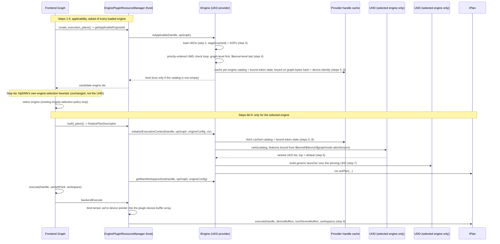

# RFC 0017: Universal Kernel Descriptors (UKD/UMD/UDD/UED/UHD/KMD/KDP): A Data-Driven Kernel Ingestor

- Contributors: Brian Harrison, Daryl Hawkins, Jason Campbell, Brad Pepers

## Table of Contents

1. [Overview](#1-overview)
2. [The Descriptors](#2-the-descriptors)
3. [How It Works](#3-how-it-works)
4. [Descriptor Formats](#4-descriptor-formats)
5. [Matching and the UMD](#5-matching-and-the-umd)
6. [Dispatch and Workspace](#6-dispatch-and-workspace)
7. [Kernel Source](#7-kernel-source)
8. [End-to-End Flow](#8-end-to-end-flow)
9. [Adapters and Extensibility](#9-adapters-and-extensibility)
10. [Observability and Diagnostics](#10-observability-and-diagnostics)
11. [Tooling](#11-tooling)
12. [Packaging and Delivery](#12-packaging-and-delivery)
13. [Worked Example: SDPA as a UKD](#13-worked-example-sdpa-as-a-ukd)
14. [Phased Delivery](#14-phased-delivery)
15. [Multiple Kernels and Composition](#15-multiple-kernels-and-composition)
16. [Risks](#16-risks)
17. [Open Questions](#17-open-questions)
18. [References and Prior Art](#18-references-and-prior-art)
19. [Glossary](#19-glossary)

---

## 1. Overview

Every kernel hipDNN's kernel provider runs is hand-written C++: a plan builder that matches the graph,
an engine, a registration-table entry, bespoke launch code, and a selection heuristic. Carrying each
kernel's behavior as code creates four problems that compound as the library grows.

- **Scale.** Kernels multiply combinatorially: a variant per architecture, data type, and problem
  shape, and again per fused form. rocKE (ROCm's kernel engine) already carries three to four scaled
  dot-product attention (SDPA) forward variants per architecture, and convolution alone spans several
  algorithm families (implicit GEMM, explicit GEMM,
  direct, and Winograd). Ten variants per architecture is a near-term floor, with hundreds looming as
  coverage grows toward every algorithm and architecture. Each variant is another hand-written engine.
- **Staleness.** These kernels come from upstream authors who revise them continuously, but every
  variant is hand-ported C++, so staying current means re-porting by hand. hipDNN falls behind: a stale
  copy misses a niche uplift (sometimes more than 2x) or keeps selecting a solution that is now 2x
  slower, and the built value goes undelivered until the re-port is prioritized.
- **Maintainability.** Every hand-written variant is code the team then carries: it must be tested,
  kept building, updated as interfaces change, and fixed when it breaks. The near-identical copies drift
  apart over time, so that burden, test coverage included, is paid again for each one, with no single
  source of truth.
- **Feature velocity.** A cross-cutting change, such as hipGraph support or plan serialization, has to
  be threaded by hand through every one of those near-duplicate engines, so platform features arrive
  slowly and unevenly.

This RFC moves kernel behavior out of code and into data: declarative descriptor files that one
generic provider loads and runs. An author drops in files and the provider matches, selects, and
launches the kernel with no new code, and because the behavior lives in one shared base, a
cross-cutting feature is written once and inherited by every descriptor-backed kernel. The provider
works from a small family of reusable descriptors, bound together for a family of kernels by a **KDP
(Kernel Descriptor Pack)**, the cohesive file that packages a kernel family and the pieces it shares:

- **UMD (Universal Match Descriptor).** A matcher: when a kernel applies, given as a graph pattern and a
  declarative criteria expression, which also bind the named variables the launch references.
- **UDD (Universal Dispatch Descriptor).** How to invoke a kernel, the dispatch application binary interface (ABI): argument binding
  and ordering, grid, block, shared memory, and workspace.
- **UED (Universal Engine Descriptor).** One engine: a stable identity plus the knobs it exposes and its
  behavior and numerical notes. It also names the engine's **one heuristic (UHD)** and **one kernel
  metadata schema (KMD)**, since a single selector ranks all the engine's kernels over one feature space.
  An engine is a named group of kernels.
- **UHD (Universal Heuristic Descriptor).** One kernel-selection model, one per engine: given the
  kernels that fit a graph, it picks the best for the problem, ranking on their metadata, the problem
  shape, and device details.
- **KMD (Kernel Metadata Descriptor).** The engine's metadata schema: the variant fields every kernel in
  the engine carries, each with a type and an optional default (tile size, block size, and the like).
  Each UKD supplies concrete values; the engine's heuristic ranks the catalog on them, and matchers read
  them as `$kernel.<field>`.
- **UKD (Universal Kernel Descriptor).** One launchable kernel, carrying no logic of its own: its source
  details plus concrete metadata values for the fields the engine's KMD declares. The source is either a
  compiled kernel or the details for building it ahead-of-time (AOT). A UKD lives in a KDP and inherits
  the pack's matchers and dispatch and, through the pack's engine, the heuristic and metadata schema, so
  it names none of them; it is applicable only when **all** of its pack's matchers pass.

A family of near-identical kernels launches the same way and matches the same graph shapes, differing
only in their compiled source and its build metadata. That family is exactly a KDP: one cohesive file
that binds a **set of matchers** (referenced by ID and shared across packs), **one engine descriptor**,
and **one dispatch descriptor**, over a **vector of child kernels** that each supply only their source
and metadata values. The engine carries the heuristic and metadata schema, so many KDPs may share one
engine while differing in their matchers and dispatch. One matcher set and UDD per KDP is intentional: a
kernel whose ABI or matcher set differs belongs in another pack, and one whose engine, heuristic, or
metadata schema differs belongs in another engine. Because every shared descriptor is authored once and
referenced by ID, a family is a handful of shared descriptors plus one tiny entry per kernel, not
hundreds of near-duplicate files.

A prototype for a single operation (SDPA) runs a kernel end-to-end from a generic launch core plus a
thin operation-specific adapter (rocKE, [PR #9207](https://github.com/ROCm/rocm-libraries/pull/9207)).
This RFC generalizes that adapter into a complete data description of a kernel and makes that
generalized form the delivery vehicle: any kernel expressible as a code object plus a description of
when and how to run it is ingested the same way.


**Vision.** The goal is to let kernel authors own delivery end to end. hipDNN provides the tools and
platform to describe, package, and release a kernel; the author takes it the rest of the way without
waiting on provider changes. This cuts the friction from writing a fast kernel to shipping it and gives
a defined path for extending the system. The end state is one generalized description covering both
AOT and just-in-time (JIT) kernels; AOT is the focus here, and JIT is a future
follow-on ([Section 9.3](#93-future-jit-and-normalized-providers)).

**Scope.** This document frames the system and its direction; each descriptor format (match, dispatch,
engine, heuristic) and subsystem (the matcher, the expression language, packaging, and the drop-in loader) is
designed in its own follow-up RFC ([Section 14.2](#142-follow-up-rfcs)). The first deliverable is the
single-kernel path. Multi-kernel launch and composition
([Section 15](#15-multiple-kernels-and-composition)) are separate follow-ups, not part of this initial design.
A named escape hatch covers a step that genuinely needs C++ (Sections [5](#5-matching-and-the-umd) and
[6](#6-dispatch-and-workspace)); anything that needs a new runtime dependency stays a full provider, one
provider per dependency ([Section 1.2](#12-provider-boundary) states the minimum bar and the JIT
exception). This complements build-time codegen rather than replacing it.

### 1.1 What Ships Now Versus Later

| Capability | This RFC (day-one) | Deferred to a follow-up |
|---|---|---|
| Single-kernel path: UKD + UMD + UDD + UED + UHD + KMD, bound by a KDP | Yes | None |
| Fusion **matching**: one UMD matches a bounded multi-op subgraph, run as one kernel (the choice of whether to fuse is the host's, via engine selection; see [§5](#5-matching-and-the-umd)) | Yes ([§5](#5-matching-and-the-umd)) | None |
| Match criteria: opcode, dtype, shape/rank, stride order, packed, divisibility, range, attribute, graph-structure, cross-tensor, per-element `all`, bounded `or` | Yes ([§5](#5-matching-and-the-umd)) | None |
| General matching: N-ary commutative, unbounded chains, optional/variadic operands | None | JIT ([§9.3](#93-future-jit-and-normalized-providers)) |
| Kernel sources | `kpack`, `hsaco`, and the rocKE adapter (build-only, lowers to `hsaco`) first; `hip` follows | new authoring adapters, DSLs ([§9.1](#91-kernel-source-adapters)) |
| Heuristic sources | LightGBM model; custom C-API library | other model formats, static tables ([§9.2](#92-heuristic-adapters)) |
| Runtime drop-in | prebuilt code objects, opt-in, off by default | JIT-compiled sources ([§12](#12-packaging-and-delivery)) |
| Multi-kernel launch program (e.g. SDPA backward) | None | composition ([§15.1](#151-several-kernels-for-one-operation)) |
| Selection composition: UCD (Universal Composite Descriptor) pipeline | None | composition ([§15.2](#152-a-pipeline-of-separately-chosen-kernels)) |
| JIT compilation; normalized providers | None | JIT ([§9.3](#93-future-jit-and-normalized-providers)) |

### 1.2 Provider Boundary

A provider is the right unit when a kernel source needs a new **runtime** dependency; keep each
provider one to one with the dependency it carries, mirroring the three providers that exist today
(MIOpen, hipBLASLt, and the HIP kernel provider), each built around exactly one backend library. This
descriptor system is for the opposite case: a **drop-in kernel source** with no new runtime dependency
of its own. Anything the source needs to build or bundle, an authoring toolchain, a compiler, a codegen
step, is an **adapter** ([Section 9](#9-adapters-and-extensibility)), not a reason to add a provider.

JIT complicates this, because a JIT source can pull in a real runtime dependency: the compiler or
interpreter that turns a DSL into a kernel at request time. Where that happens, the right unit may be a
**JIT-specific provider per technology**, not an adapter. A DSL provider whose runtime depends on its
own compiler is handled as its own provider because of that dependency and the delivery system hipDNN
conforms to. Concretely: a Python DSL reached through JIT would likely need to be its own provider,
installed separately from both hipDNN and TheRock, because of the Python ABI and the Python runtime
dependency it carries. A provider that embeds an interpreter is not a drop-in kernel source in the sense
this RFC targets.

This codebase has already drawn the line both ways. rocKE's own authoring
toolchain is a Python environment used only at build time, never installed with the shipped kernel, so
it is absorbed as a build-only adapter inside the HIP kernel provider
([Section 9.1](#91-kernel-source-adapters)) rather than shipping as its own provider. A separate,
unmerged in-tree design took the opposite case seriously: it designed a standalone provider specifically
to carry an embedded Python interpreter as a runtime dependency, because that dependency belongs behind
its own C-API boundary rather than inside the generic engine. Two directions, the same rule: a
build-time-only dependency becomes an adapter, and a runtime dependency becomes its own provider.

Where this is genuinely open is packaging. Today's install destinations for a provider's shared library
are shared and provider-agnostic, so nothing in them forbids installing a provider with a runtime Python
dependency alongside the others. But nothing supports it either: no mechanism today ships a Python
runtime, resolves a Python ABI, or manages a `site-packages` tree at install time, and none of the three
shipped providers need one. How a Python-runtime provider would actually be delivered separately from
hipDNN and TheRock is left to the delivery follow-up RFC ([Section 12](#12-packaging-and-delivery)); this
RFC states the boundary, not the mechanism.

The graded ladder ([Section 5](#5-matching-and-the-umd)) ends at "a full provider" without saying what a
provider must minimally supply, the same floor hipDNN's existing plugin contract already enforces at
load time:

- **MUST** export the identity and lifecycle entry points every plugin needs: name, version, error
  reporting, and a logging callback.
- **MUST** declare its plugin kind (engine or heuristic) and, for an engine, export the applicability
  query, workspace sizing, execution-context creation and destruction, and execute entry points; a
  heuristic plugin exports the equivalent policy and scoring entry points instead.
- **MUST** declare an API version whose major component is checked against hipDNN's own plugin ABI major
  version; a provider that reports, or defaults to, a mismatched major is excluded before its
  applicability is ever asked, the same reject-before-query gate the KDP version tag mirrors
  ([Section 4](#4-descriptor-formats)).
- **MUST** register at least one globally unique engine id, and build with hidden symbol visibility and
  position-independent code so the loader's eager, load-time symbol resolution succeeds and the provider
  installs cleanly into the shared plugin search path.
- **Optional**: serialized-execution-context replay and policy-override entry points exist for providers
  that support them; a provider that omits them simply does not support that path.

Nothing beyond this surface is required. hipDNN does not mandate any particular internal architecture,
an engine object, a plan builder, or plan classes, inside the provider; the only true requirement is the
exported contract above.

---

## 2. The Descriptors

Each descriptor maps directly onto a concept hipDNN already has; the difference is that the concept
becomes data instead of hand-written code.

| Descriptor | Purpose | Exists in hipDNN today as |
|---|---|---|
| **UKD** (kernel) | One launchable kernel: its source details plus build metadata; the KDP binds the rest | The compiled kernel module (code object) and its hand-tracked build config |
| **KDP** (pack) | Bind a matcher set, one engine, and one dispatch over a kernel vector | The engine-registration table plus the per-kernel applicability and launch scaffolding |
| **UMD** (match) | Accept a graph and bind its named variables | The graph half of `isApplicable` |
| **UDD** (dispatch) | Invoke a kernel: args & ordering, grid/block, shared mem, workspace | The bespoke launch and argument-wiring code |
| **UED** (engine) | A stable engine identity with its heuristic, metadata schema, knobs, and behavior/numerical notes | The provider's engine-registration table plus a `HIPDNN_REGISTER_ENGINE` id |
| **UHD** (heuristic) | Rank the kernels within one engine and pick one | A ranking model living inside an engine's dispatcher |
| **KMD** (metadata) | Declare the engine's variant fields, each with a type and optional default | The compile-time template/tuning parameters that distinguish each hand-written kernel variant |

A UED is deliberately 1:1 with a hipDNN engine: engines are intended to be scoped tightly enough that
one heuristic and one metadata schema cover exactly the kernels an engine owns, so "the engine" and
"the UED" name the same unit going forward. Today's MIOpen engine is not that; it is a legacy wrapper
bundling what should be several distinct, tightly-scoped engines into one registration. Mapping UED onto
today's engine-registration table is therefore a deliberate restructuring of how engines are meant to be
organized, not a literal analogy to how MIOpen uses the term today.

A UKD carries no logic of its own: it is just its source details plus metadata values, and it inherits
when it applies, how it launches, how it is ranked, and its schema from its KDP and that KDP's engine
([Section 1](#1-overview)). The KDP's one UDD holds one or more **Launches**, each a dispatch step paired
at runtime with the UKD source that fills it: a simple kernel is a one-Launch UDD, and a multi-launch
kernel such as SDPA backward is a several-Launch UDD run in order
([Section 15](#15-multiple-kernels-and-composition)). The remaining term is the **UCD (Universal
Composite Descriptor)**, which composes stages that each resolve to a UKD (future work,
[Section 15](#15-multiple-kernels-and-composition)).


There are two independent selection levels, and they are named apart to avoid conflation. The
**engine-selection heuristic** is hipDNN's existing heuristic plugin interface, which chooses which
engine handles a graph. A UHD is a **kernel-selection heuristic** that operates one level down,
choosing which kernel within an engine to run; it is part of the generic provider, not a new host
interface. Both are needed: engine selection is unchanged by this proposal, and the kernel-selection
heuristic is what makes dropping in a family of kernels useful, because it ranks them per problem.

**Cross-engine arbitration today.** Engine selection, the level above the UHD, already exists in hipDNN
as an ordered-policy loop: a resolved sequence of heuristic-policy plugins runs in order, and the first
policy that succeeds wins, supplying the ranked engine list. The order resolves from an environment
override, then a descriptor attribute, then a built-in default. If every policy declines, the query
fails outright instead of silently falling back to some hidden order. The top-level mechanism is
therefore not first-claim-wins by registration order, though the built-in fallback policy does order a
curated set of named engines first and stable-sort the rest, so two UKD-backed engines that policy
does not name are left in registration order unless a configuration rule or a custom policy separates
them. It is unchanged by this proposal.

Choosing between engines is therefore hipDNN's job, not a KDP's or a UHD's, and hipDNN already has
three mechanisms for it: engine-selection policies, explicit user selection, and auto-tuning. Two
kernels in different engines are arbitrated by those, whatever their UHDs scored them at internally.
This proposal does not change the engine-selection problem; it only makes it more visible, because
more engines become cheap to add.

Out-of-box kernel selection is the UHD's job: given a catalog, it picks one kernel. There is no UKD
equivalent of MIOpen's Find modes (enumerate every applicable kernel, benchmark it, and pick by
measured time); that distinction lives one level up, in hipDNN's out-of-box versus tuning paths, not
inside the descriptor system. A tuning run may ignore the heuristic's suggestion entirely and
benchmark every kernel in the catalog, or use the suggestion to tune faster
([RFC 0013](0013_Autotune.md)). Exactly how hipDNN uses heuristic output in each path is left to the
UHD follow-up RFC.

---

## 3. How It Works

There is one family of descriptor formats, one generic engine, and two ways descriptors reach it:

- **Build-time (AOT).** Descriptors and kernel sources in the source tree are compiled and packed
  per GPU architecture, then installed beside the provider.
- **Runtime drop-in.** Descriptors backed by a prebuilt code object (or JIT source) are placed in a
  folder and loaded when the provider starts, with no build step.

Both paths produce the same thing the generic engine consumes, so everything downstream (matching,
selection, launch) is identical regardless of how a kernel arrived.


At provider load, the generic engine discovers all available descriptors and wires up the engines. Two
kinds load eagerly, because every graph needs them to decide applicability: every UED, so the set of
engines and their identities exist, and every matcher. The heavier content, each engine's heuristic
model, the kernels and their metadata, and the dispatch descriptors, loads lazily the first time a graph
needs it and is cached thereafter. Each UED becomes an engine that names its heuristic (UHD) and metadata
schema (KMD); the KDPs that name it contribute their matchers, dispatch, and kernels, and each child
kernel becomes a data-backed plan builder inside that engine. Deciding which kernels apply to a graph is
then a cheap, shared-matcher pass ([Section 5](#5-matching-and-the-umd)): shared checks run once for the
whole graph, per-kernel checks run only for the survivors, and results are cached. No new host or plugin-ABI interfaces are introduced; the
generic engine satisfies hipDNN's existing contracts using descriptor data, and the new machinery it
needs (the matcher, the expression interpreter, the selector, and the predicate and custom-plan
registries) lives inside the provider behind those contracts.

---

## 4. Descriptor Formats

Descriptors are authored in a human-readable, diffable text format and compiled to a compact binary
form for fast loading. Each format (KDP, UMD, UDD, UED, UHD, KMD, UKD) has a defined schema and its
own `major.minor` version, versioned independently per file type rather than as one shared component
version. A descriptor is refused, never silently reinterpreted, if its version is newer than the
runtime understands: a major-version mismatch is always refused, and within a major version an older
minor always loads (minor versions are additive only) while a newer minor is refused. Concretely, a
pack stamped `1.0.0` loads under a `1.1.0` runtime, but a pack stamped `1.1.0` does not load under a
`1.0.0` runtime, because it carries features that runtime does not understand. Breaking changes
(removing or retyping a field, changing field order, or anything else consumers must expect to react
to) require a major bump; every other change is a minor bump, and authors should stamp the lowest
version their descriptor actually requires, for maximum compatibility with older runtimes. This is a
finer granularity than [RFC 0005](0005_Versioning.md)'s component-level `MAJOR.MINOR.PATCH.TWEAK`
versioning, not the same policy applied more narrowly: RFC 0005 advances each hipDNN component
(schema, plugin SDK, backend, ...) in lockstep, while this versions each descriptor file type
independently, so a KMD and a UDD can advance their minor versions on different schedules. The
reject-newer, accept-older-within-major shape itself is not new: hipDNN already rejects a plugin
whose major API version mismatches, accepts an older plugin minor version for graphs that do not
need its newer features, and rejects a serialized graph or execution plan whose version exceeds what
the build understands ([RFC 0005](0005_Versioning.md) section 4.6.4,
[RFC 0009](0009_CompiledPlanSerialization.md)); per-file-type descriptor versioning follows that
same established shape. The concrete serialization and schema for each format are deferred to that
format's follow-up RFC.
Every descriptor also carries a stable `id`, a GUID, used for cross-references, and a `name` that is
mandatory for logging and diagnostics; both appear in the examples. GUIDs let any author mint an id
locally that never collides with another author's, so there is no central allocation authority to
serialize through. The schema and its relations are still centrally defined (the field vocabulary
and the custom-operation registry are part of the provider's published contract); what a follow-up
adds is authoring tooling to generate and lint descriptors, mint ids, and drive this from
higher-level inputs. The examples are illustrative, and the `schema`/version plumbing is shown once
here and elided elsewhere.

**KDP schema/SDK-version tag.** A KDP separately declares the schema (SDK) version its matchers were
authored against: an explicit ceiling of the graph features its author understands, not an
enumeration of which fields its matchers reference. The alternative considered and rejected was
auto-rejecting a KDP for any graph field its matchers do not mention; that would force every matcher
into a massive, exhaustive field-by-field block and would break every existing KDP, including
third-party drop-ins, each time hipDNN adds a field. Instead, a graph's minimum required schema
version is computed from the optional fields it actually sets, and a KDP whose declared schema
version is below that floor is declined automatically, before its matchers run. For example: a KDP
declares support for schema `1.0.0`; hipDNN later adds an optional SDPA field at `1.1.0`; a graph
that sets that field now requires `1.1.0` and the KDP is declined before its matcher runs, while a
graph that does not set it still resolves to `1.0.0` and still reaches the KDP. This lets KDP
authors add support for new features asynchronously, or deliberately stay on an older schema version
when their kernel cannot support the newer feature.

This mirrors, rather than invents, an existing hipDNN mechanism: a graph already carries a
minimum-required engine-plugin API version, computed by a single source-of-truth function in the
plugin SDK as a monotonic maximum over the optional features the graph uses, and providers below
that floor are excluded before their applicability check runs; a serialized graph above the build's
ceiling is rejected outright at deserialize. The KDP schema/SDK-version tag is the same pattern
applied to matchers instead of engine plugins. This is a high-level statement of intent; the future
KDP follow-up RFC must specify this tag concretely in the schema.

**UED, an engine with its heuristic, metadata schema, knobs, and notes:**

```jsonc
{
  "schema": "hipdnn.ued/v1",
  "id":     "efc9eae4-fe33-4cb0-a593-95d771dc13b2",                        // stable, unique; referenced by the KDP
  "name":   "Example attention engine",        // human-readable label
  "heuristic": "ae896b07-80cd-473c-b3f4-6a8892998519",                     // one UHD: the selector for this engine's kernels
  "metadata":  "9ae0b215-32a7-49d1-96df-e9b05e1927ea",                     // one KMD: the variant schema this engine's kernels fill
  "behavior_notes":  ["runtime_compilation"],  // hipDNN behavior notes for this engine
  "numerical_notes": ["tensor_core", "reduced_precision_reduction"],  // hipDNN numerical notes
  "knobs": [                                   // author-exposed, user-controllable
    {"name": "split_k",     "type": "int", "default": 1, "constraint": {"min": 1, "max": 8}},
    {"name": "use_atomics", "type": "int", "default": 0, "constraint": {"one_of": [0, 1]}}
  ]
}
```

**Knobs are restricted to the loaded catalog.** For both the AOT path and the future JIT path
([Section 9.3](#93-future-jit-and-normalized-providers)), the knob values an engine presents are a
function of two things: the fields its KMD declares, and the values those fields actually take
among the kernels in the catalog loaded for this graph. A knob's legal values are not the KMD
field's theoretical range; they are whatever the surviving kernels actually have. If a `tile_size`
field exists in the KMD but every kernel that matched this graph declares `tile_size: 4`, the
presented "choice" is `[4, 4]`, not a selectable range: one value is not a choice.

Because a knob's value can affect which kernels apply, the catalog is built first and legal knob
values are derived from the kernels that survive it, never the other way around. A user-set knob then
restricts that catalog: setting `split_k = 4` keeps only kernels whose KMD `split_k` field equals 4,
and the UHD's ranking decides among those
([Section 10](#10-observability-and-diagnostics) shows where this is visible at runtime).

This fits hipDNN's existing knob-discovery shape rather than requiring a new one: today's
per-engine knob query already takes the operation graph, not just the engine id, and one existing
provider already narrows a knob's *range* from the graph it is handed (MIOpen derives its
workspace-size-limit knob's bounds from the actual convolution problem it is given). Deriving a
knob's legal *value set* from a pre-built kernel catalog is the same shape one step further:
graph-scoped input, narrower output.

**Ordering works on today's API.** The catalog derives from graph details alone, so it exists by the
time the engine answers applicability and a knob's legal values are known then, reported through the
existing graph-parameterized knob query. That the user's values are consumed later, after an engine id
is chosen, costs nothing. A UHD scores each kernel on its own metadata and the problem, independently
of which other kernels are in the catalog, so restricting the catalog and ranking it commute: the
highest-scoring kernel that satisfies the knobs is the same either way. An implementation restricts
first, to avoid scoring candidates it would discard. That independence is a requirement on a UHD, not
an assumption about one: a scorer that normalized across the catalog or broke ties on the surviving
set would make selection depend on filtering order, and is out of contract. No new front-end entry
point and no change to the existing call order is required.

**Autotune.** Because a sweep's values are validated against the same per-graph knob lookup used
for a manually-set knob, a catalog-filtered value set is inherited by autotune automatically. A
caller that hardcodes a sweep axis from a knob's general range instead of re-querying it per graph
has its out-of-catalog entries skipped with a warning, not the whole sweep rejected
([RFC 0013](0013_Autotune.md)).

**UHD, a kernel-selection model for one group:**

```jsonc
{
  "schema": "hipdnn.uhd/v1",
  "id":     "ae896b07-80cd-473c-b3f4-6a8892998519",       // stable, unique; referenced by the UED (one per engine)
  "name":   "Example attention LightGBM selector",
  "kind":   "model",          // "model" | "static_order" | "custom_library"
  "model": {
    "framework": "lightgbm",  // tagged so other frameworks are additive
    "artifact":  "example_attn/model.bin"
  },
  "features_signature": [     // ordered model inputs, bound like a UDD args_signature; order and form must match training
    "$device.cu_count",                          // device property
    "$device.lds_size",                          // device property
    "$kernel.tile_m",                            // kernel metadata
    "$kernel.split_k",                           // kernel metadata
    "$sdpa_fwd.head_size",                       // graph node attribute
    "$q.seqlen_q",                               // graph tensor dim
    {"*": ["$q.batch", "$q.num_heads"]}          // a derived feature (expression)
  ],
  "objective": "max"          // higher predicted score wins
}
```

The `features_signature` binds the model's inputs the same way a UDD's `args_signature` binds a kernel's
arguments: an ordered list where each entry is a token or an expression over the schema's declared fields,
drawing on device properties (`$device.*`), kernel metadata (`$kernel.*`), and graph and node properties
(tensor dims and attributes the match bound). Every value the model was trained on is bound here, in the
same order and form as training, so the feature vector the provider assembles at selection time is exactly
what the model expects.

**KMD, the metadata schema:** the variant fields every kernel in the engine carries, each with a type and
an optional default. It declares upfront which variants the engine spans; each UKD fills in concrete
values. When the engine's KDPs span different axes, the schema is their union and unused fields take
their defaults.

The KMD is the feature space the engine's heuristic ranks over, which is why the UED owns both the
KMD and the one UHD. The coupling is not unconditional: an additive change, a new field or new legal
values added to an existing field, does not require a retrain until the change is exposed, because the
old feature space is still valid. A breaking change, one that removes or reinterprets an existing
field's values, must land its retrain in the same change, because a field the UHD was not trained on
is not selected against until the model learns it. [Section 16](#16-risks) has the full classification
and what else counts as breaking.

The KMD is not limited to the fields the UHD ranks on. All per-kernel fields the UHD needs must be in
the KMD, but the KMD may also carry fields the UHD never reads: values a UDD formula consumes to
compute per-kernel dispatch detail, such as launch geometry
([Section 6](#6-dispatch-and-workspace)).

```jsonc
{
  "schema": "hipdnn.kmd/v1",
  "id":     "9ae0b215-32a7-49d1-96df-e9b05e1927ea",       // stable, unique; referenced by the UED (one per engine)
  "name":   "Example attention variant fields",
  "fields": [
    {"name": "tile_m",  "type": "int", "optional": true, "default": 1},
    {"name": "split_k", "type": "int", "optional": true, "default": 1}
  ]
}
```

**UMD, a matcher** ([Section 5](#5-matching-and-the-umd)): one shared, ID-referenced match descriptor,
a structural pattern (when present) plus a declarative criteria expression. A KDP lists the matcher IDs
its kernels require.

```jsonc
{
  "schema": "hipdnn.umd/v1",
  "id":     "968156a8-ee21-4827-bcd7-893a8a72dccc",    // stable; listed in KDP matchers[], shared across packs
  "name":   "Example attention forward (d128, bf16) match",
  "nodes":    [ ... ],     // structural pattern that binds $vars (Section 5)
  "criteria": { ... }      // declarative expression tree over bound tokens (Section 5)
}
```

**UDD, how to invoke a kernel** ([Section 6](#6-dispatch-and-workspace)): the dispatch ABI, referenced
by ID. A UDD's formulas use the same declarative expression language as the UMD criteria
([Section 5](#5-matching-and-the-umd)) and the same referencable namespaces: kernel metadata, device
properties, graph facts, node attributes, and tensor fields ([Section 6](#6-dispatch-and-workspace) has
the full list).

```jsonc
{
  "schema": "hipdnn.udd/v1",
  "id":     "625df14f-f0cd-4beb-9297-1872d055c1cb",
  "name":   "Example attention forward (d128) dispatch",
  "grid":   { ... }, "block": { ... },  // Section 6
  "shared_mem_bytes": 32768,
  "workspace_bytes":  0,
  "args_signature":   [ ... ]           // argument binding + ordering (Section 6)
}
```

**UKD, one kernel:** its source details plus concrete metadata values for the fields the KMD declares.
The source points at a compiled kernel or says how to build it AOT ([Section 7](#7-kernel-source)); the
metadata gives the exact variant this kernel was built with (a field the UKD omits takes the KMD's
default). The engine's heuristic ranks the catalog on these values and criteria read them as `$kernel.*`
tokens ([Section 5](#5-matching-and-the-umd)); they are checked against the engine's KMD at load. A UKD's
matchers, engine, and dispatch are all the KDP's, and its heuristic and metadata schema are the engine's,
so it names none of them.

Because applicability and ranking both key on these `$kernel.*` values, a kernel's identity for matching
and dispatch purposes is exactly its KMD field values: two kernels with identical metadata and the same
ABI cannot diverge in applicability or ranking, since nothing distinguishes them to a matcher or the UHD.
This is a design boundary: if two kernels must behave differently, add a KMD field
that distinguishes them; a kernel vector should never carry two entries keyed to the same metadata.

```jsonc
{
  "schema": "hipdnn.ukd/v1",
  "id":        "15b02840-05ba-40cf-ac17-384b50f56a7d",
  "name":      "Example attention forward (d128, bf16, gfx942)",
  "kernel_source": { ... },                       // Section 7: a compiled kernel, or how to build it AOT
  "metadata":  {"tile_m": 128},                    // tile_m set; split_k omitted, takes the KMD default
  "priority":  100                                // tie-break when the UHD is not decisive
}
```

**KDP, a cohesive pack:** one file that binds a shared **matcher set**, **one engine**, and **one dispatch
descriptor**, over a **vector of child kernels** (the deployment shape and its one-of-each rationale are
in [Section 1](#1-overview)). Every referenced descriptor is shared by ID across packs; only the child
kernels are unique to this pack.

```jsonc
{
  "schema": "hipdnn.kdp/v1",
  "version": "1.0",            // pack format version, major.minor, gated at load (Section 4)
  "sdk_version": "1.0",        // hipDNN schema version this pack's matchers were authored against
  "arch":     ["gfx942"],      // arch is a pack property, resolved at selection (Section 5)
  "matchers": ["968156a8-ee21-4827-bcd7-893a8a72dccc"],   // UMD ids; a child kernel applies iff all listed matchers pass
  "engine":    "efc9eae4-fe33-4cb0-a593-95d771dc13b2",     // one UED id: the engine every child kernel joins (carries UHD + KMD)
  "dispatch":  "625df14f-f0cd-4beb-9297-1872d055c1cb",     // one UDD id, shared by every child kernel (Section 6)
  "kernelDescriptors": [       // the vector of child kernels; each is just source + metadata values
    { "id": "15b02840-05ba-40cf-ac17-384b50f56a7d", ... },
    { "id": "562e3777-8082-483d-82b8-12b0f7a363e4", ... }
    // ...
  ]
}
```

---

## 5. Matching and the UMD

Matching turns a hand-coded applicability check into declarative data. Today the check is a C++ switch
over the graph; the same intent becomes a **UMD (Universal Match Descriptor)**, a reusable **matcher**:
a **structural pattern** (named op nodes and their operand/result edges over the op DAG, when the check
is about graph shape) plus a **criteria expression** over the fields the pattern binds. A KDP lists a
**set of matcher IDs**; a kernel is applicable only when **all** pass, and matchers are shared by ID
across packs. A validated study of MIOpen CK convolution and rocKE SDPA applicability found that over a
thousand concrete kernels collapse to a handful of shared matcher shapes, with tile and vector constants
carried as matcher *parameters* rather than new matchers.

**Criteria are expressions, not flat token lists.** A criterion is a nested `{"op": [args]}` tree over
the fields the pattern binds, built from logical operators (`and`, `or`, `!`), comparisons (`==`, `!=`,
`<`, `in`), a per-element `all`, and arithmetic (`+`, `*`, `%`), plus a few custom short-hands
(`divisible`, and the pattern-binding `shape`/`rank`) and registry-resolved custom operations for checks
the built-ins cannot express (the escape hatch below). Operators nest to any depth, and a left-hand side
can itself be a computed expression rather than a raw field. A leaf is a literal or a `$`-prefixed field
reference (`"$q.dtype"`); the `$` marks a reference, so no `var` wrapper is needed.

**The hipDNN schema declares the fields an expression may reference**, so an author sees the whole
vocabulary up front and the interpreter fails closed on anything undeclared. The fields fall in five
namespaces, and every criteria and dispatch expression draws from the same set:

- **Tensor:** a bound operand's fields: `$q.dtype`, `$q.rank`, its named dims (`$q.seqlen_q`, `$w.c`),
  evaluated flags (`$q.stride_order`, `$q.packed`), and `$q.virtual` (an internal intermediate between
  matched nodes, not a graph input or output).
- **Graph:** structural facts of the matched graph, e.g. `$graph.node_count`, which pins an exact match
  (the graph has exactly this many nodes).
- **Attributes:** a matched op node's attributes, named by the node's pattern `id`: an SDPA node
  `{"id": "sdpa_fwd"}` exposes `$sdpa_fwd.head_size`, a conv node `{"id": "conv"}` exposes `$conv.dilation`.
- **Kernel metadata:** `$kernel.<field>`, the values a UKD supplies for the fields its engine's KMD
  declares (tile and vector constants, the dtype it targets); the heuristic ranks on them
  ([Section 4](#4-descriptor-formats)) and a check binds a kernel to the graph, e.g.
  `divisible($q.head_size, $kernel.tile_m)`. A `$kernel.*` field a shared matcher reads must exist in the
  engine's KMD; this is checked at load.
- **Device properties:** `$device.<field>` such as `$device.lds_size` or `$device.warp_size`, for a
  check like an LDS budget `<=($kernel.lds_per_block, $device.lds_size)`.

A bare boolean field used on its own is a truthiness check: a lone `"$q.packed"` in an `and` list reads
as "the tensor is packed", equivalent to `==($q.packed, true)`, so such a token is a criterion, not a
stray element.

New fields are added to the schema and referenced the same way; the full field and operator vocabulary,
the operand-property set (broadcast, alignment, sparse and ragged kinds), and the interpreter profile
are in the UMD follow-up.

**A prebuilt match is exact.** A prebuilt kernel solves one complete graph, so a matcher asserts
`$graph.node_count` to accept only a graph of exactly that size, and marks each intermediate tensor
`virtual`. A single-op kernel checks `node_count == 1`; a fused Conv-Bias-ReLU kernel checks
`node_count == 3` with its two intermediates `virtual`. Shared checks (like the tile matcher below) stay
graph-shape-agnostic, so one such matcher composes into packs of either shape. Matching a pattern inside
a larger graph, without a fixed count, is the looser JIT / general-matching mode
([Section 9.3](#93-future-jit-and-normalized-providers)).

**Formal constraint: every KDP needs an umbrella matcher.** At least one matcher in a KDP must check the
complete graph topology it accepts, the same node_count and shape-defining criteria described above,
applied to the whole graph rather than a fragment. Other shared matchers in the pack may constrain any
subset of what that matcher already binds. Without this, several matchers could each verify disjoint
pieces of a graph while nothing guarantees the overall topology is one this kernel can serve, producing
loose or incorrect matches. Authors remain free to write one large matcher that does everything, or split
the work across several focused matchers; the only requirement is that somewhere in the pack, the full
graph shape is checked explicitly.

**Architecture** is handled at pack selection rather than as a runtime criterion, at least for AOT: a
pack carries code objects for the arches it targets, so its per-architecture `kpack` manifest
([Section 12](#12-packaging-and-delivery)) gates both loadability and arch applicability, and no arch
criterion runs at match time. A JIT pack that generates per arch may instead reference arch as a
`$device` field at match time; that path is deferred to the JIT follow-up
([Section 9.3](#93-future-jit-and-normalized-providers)).

The `conv.tile_fit` matcher shows the form, checking a conv's implicit-GEMM dims (products of its bound
dims) against the kernel instance's tile constants (its `$kernel.*` metadata):

```jsonc
// conv.tile_fit: implicit-GEMM M/N/K (products of the conv's bound dims) must divide the tile constants
{
  "schema": "hipdnn.umd/v1",
  "id":   "a541565e-09eb-471b-8507-0e00f5bf75d7",
  "name": "conv.tile_fit",
  "nodes": [
    {"kind": "op", "id": "conv", "op": "convolution_fwd",
     "operands": {"X": "$x", "W": "$w"}, "results": {"Y": "$y"}}
  ],
  "criteria": {"and": [
    {"divisible": [{"*": ["$y.n", "$y.ho", "$y.wo"]}, "$kernel.MPerBlock"]},  // GEMM M = output positions
    {"divisible": ["$y.k", "$kernel.NPerBlock"]},                             // GEMM N = output channels
    {"divisible": [{"*": ["$w.c", "$w.y", "$w.x"]}, "$kernel.KPerBlock"]}     // GEMM K = reduction (C*Y*X)
  ]}
}
```

**Fusion is a day-one capability, but only fusion matching.** Because a matcher's pattern is a multi-node
subgraph, one matcher can match a fused op sequence, bind all its tensors at once, and hand it to a
single UKD (the fused case is below); that is what ships day one. The decision of whether to fuse at all
is not made inside a descriptor: a fused matcher (`node_count == 3` for Conv-Bias-ReLU, say) and its
unfused counterpart (`node_count == 1`) are mutually exclusive by node count and never share a candidate
set, so nothing in the UHD's ranking can compare a fused kernel against its decomposed equivalent. That
choice belongs to the host, through ordinary engine selection ([Section 2](#2-the-descriptors)), and
there is no fusion cost model anywhere in this design. If one engine wants to offer both the fused and
the sequential form, its heuristic must carry a metadata field distinguishing the two and rank on it
directly; choosing between forms that live in different engines is ordinary engine selection (explicit
choice, policy heuristics, or auto-tuning). Fusion is distinct from composition, running one graph as
several kernels ([Section 15](#15-multiple-kernels-and-composition)), which goes the opposite direction
and is future work.

The matcher below matches SDPA forward: its `nodes` bind the tensor tokens, its `criteria` constrain
them:

```jsonc
{
  "schema": "hipdnn.umd/v1",
  "id":   "daef2dc6-647d-4c9e-b0e0-85402d2dc2bd",
  "name": "SDPA forward (d128, bf16) match",
  "nodes": [
    {"kind": "op", "id": "sdpa_fwd", "op": "sdpa_fwd",
     "operands": {"Q": "$q", "K": "$k", "V": "$v"}, "results": {"O": "$o"}}
  ],
  "criteria": {"and": [
    {"in":    ["$q.dtype", ["BFLOAT16"]]},
    {"==":    ["$q.stride_order", [0, 1, 2, 3]]}, "$q.packed",  // contiguous bhsd
    {"shape": ["$q", ["batch", "num_heads", "seqlen_q", "head_size"]]},  // binds these dims
    {"in":    ["$k.dtype", ["BFLOAT16"]]},
    {"shape": ["$k", ["batch", "num_heads", "seqlen_k", "head_size"]]},  // reuses head_size: must equal $q's
    {"in":    ["$v.dtype", ["BFLOAT16"]]},
    {"shape": ["$v", ["batch", "num_heads", "seqlen_k", "head_size"]]},  // same head_size across Q, K, V
    {"==":    ["$sdpa_fwd.head_size", 128]},
    {"in":    ["$sdpa_fwd.mask_mode", ["none"]]},
    {"==":    ["$graph.node_count", 1]}  // exact: this kernel is the whole graph
  ]}
}
```

Matching does double duty: it decides the kernel applies and binds the fields the launch will use. A
field is **declared** in the pattern (a dim named in a `shape`, or an op attribute), **bound** when the
graph matches, then **used** in the UDD's formulas ([Section 6](#6-dispatch-and-workspace)): `$q.seqlen_q`
binds here and feeds `ceil_div($q.seqlen_q, 16)` there. A formula can only reference fields the match
produces. A capture name reused across patterns binds once and requires the matches to agree, so
`head_size` naming a dim in the Q, K, and V shapes expresses equal head dim across the three tensors as
ordinary data, no escape hatch. Reuse handles the equality case; a cross-tensor relation that is not
equality is written explicitly as an operator over two bound references, for example GQA grouping as
`divisible($q.num_heads, $k.num_heads)` or a derived comparison over a product of dims. Both forms are
plain data over the fields the match binds.


**Variable-rank tensors.** Naming every dim in `shape` pins an exact rank. When rank varies (NCHW vs
NCDHW), the pattern names the fixed dims and binds the variable run as a single vector, e.g.
`["n", "c", "$spatial"]` where `$spatial` captures the 2 or 3 spatial dims, so one matcher accepts both
ranks and still reaches those dims through `all` or a product (`*($spatial)`). Per-dim names like `$x.h`
are the fixed-rank shorthand; the vector is the general form. (This is variable dims within one tensor,
distinct from variadic *operands*; exact `shape` syntax is in the UMD follow-up.)

**Escape hatch.** When the built-ins cannot express a check, a criterion invokes a **custom operation**,
a native predicate resolved from the provider's registry (for example a probe into a backing library's
own support query, whose logic lives in vendor code and cannot be reduced to schema fields), carried as a
symbol name and typed arguments, never inline code. It is a deliberate last resort, not a routine tool:
the validated catalog of MIOpen CK convolution and rocKE SDPA applicability needed no custom
operation. It did rely on a third mechanism between the built-ins and the escape hatch:
**precomputed fields**, values the schema layer derives once and exposes as ordinary tokens, so a
matcher compares them instead of re-deriving them. `$q.packed`, `$q.stride_order`, and the classified
`$sdpa_fwd.mask_mode` ([Section 13.3](#133-encoding-classifymaskmode)) are the examples in this
document. A precomputed field is declared in the hipDNN schema like any other field and versioned with
it, so adding one is an additive schema change, not a per-pack extension point. A file that names a
predicate the provider does not ship
fails to resolve, so the registry is part of its published contract. The dispatch layer has an analogous
custom plan ([Section 6](#6-dispatch-and-workspace)); together they form a graded ladder from declarative
data, to a named escape hatch for a step that needs real C++, to a full provider.

**Applicability is a cheap, shared-matcher pass.** A matcher that reads only graph fields
(Tensor/Graph/Attributes/Device) runs **once for the whole graph**; on failure it disqualifies every
pack that lists it, so evaluating the most-shared checks first (arch, dtype, layout) prunes the
candidate set fast. A matcher that also reads `$kernel.*` is the **same** matcher re-evaluated **once
per kernel** (per distinct metadata, memoized) and disqualifies per kernel, not per pack. Those
kernel-level checks are expected; they stay cheap because distinct metadata values are far fewer than
kernels and they run only for kernels whose packs survived the graph-only pruning. Results are cached
across queries, and a kernel whose matchers all pass goes to the UHD to be ranked.

**Arbitration is deterministic.** When several UKDs accept the same graph, the UHD ranks them and the
top-scored kernel wins. Ties break in a fixed order: explicit `priority`, then the descriptor's stable
`id`. When the decision falls to `id`, the provider logs the conflict to the warning log.

**Optional operands.** A pattern marks an operand optional with a `?` suffix, `"bias": "$bias?"`, binding
it only when the graph supplies it; a formula then reads a possibly-absent value with a default via
`value_or_default(["$bias", 0])`, and criteria on an optional operand are checked only when it is bound.

**Out of scope for v1.** General N-ary commutative matching, unbounded variadic operands, and unbounded
chains are deferred to the JIT follow-up ([Section 9.3](#93-future-jit-and-normalized-providers)); a
prebuilt kernel encodes one fixed graph shape, so bounded matching covers it.

**A fused match.** The same UMD form matches several ops as one fusable unit. This Conv-Bias-ReLU
matcher pins the exact graph: `$graph.node_count == 3` accepts only these three ops, and `$conv_out` and
`$bias_out` are required `virtual`, so those intermediates are absorbed into the fused kernel and one UKD
serves the whole chain as a single kernel.

```jsonc
{
  "schema": "hipdnn.umd/v1",
  "id":   "963e2d15-9293-4eca-b071-793eb0a47d60",
  "name": "Conv-Bias-ReLU (NHWC, f16) match",
  "nodes": [
    {"kind": "op", "id": "conv", "op": "convolution_fwd",
     "operands": {"X": "$x", "W": "$w"},           "results": {"Y": "$conv_out"}},
    {"kind": "op", "id": "bias", "op": "pointwise_add",
     "operands": {"A": "$conv_out", "B": "$bias"},  "results": {"Y": "$bias_out"}},
    {"kind": "op", "id": "act",  "op": "pointwise_relu",
     "operands": {"A": "$bias_out"},                "results": {"Y": "$y"}}
  ],
  "criteria": {"and": [
    {"in":    ["$x.dtype", ["FLOAT16"]]},
    {"==":    ["$x.stride_order", [0, 2, 3, 1]]}, "$x.packed",  // NHWC
    {"in":    ["$y.dtype", ["FLOAT16"]]},
    {"==":    ["$y.stride_order", [0, 2, 3, 1]]}, "$y.packed",  // NHWC
    {"shape": ["$y", ["batch", "out_h", "out_w", "out_channels"]]},
    {"shape": ["$bias", ["out_channels"]]},
    {"==":  ["$graph.node_count", 3]},  // exactly these three ops
    "$conv_out.virtual",                // internal intermediate, absorbed by the fused kernel
    "$bias_out.virtual"
  ]}
}
```

Its bound `$y` dims feed the fused kernel's launch formulas exactly as the single-op case does.

---

## 6. Dispatch and Workspace

The second hard problem is dispatching a matched kernel with no bespoke code. The dispatch ABI lives
in a **UDD (Universal Dispatch Descriptor)**, referenced by ID: one UDD per KDP, shared by every child
kernel. A UDD holds one or more **Launches**, each a dispatch step
(grid, block, shared memory, workspace, and argument signature); a kernel's source fills a Launch's slot
to run it. A single-kernel UDD has one Launch, shown below; a multi-launch UDD has several run in order
([Section 15](#15-multiple-kernels-and-composition)). Because the launch ABI is written once here, every
kernel in the pack inherits it; a kernel that needs a different one belongs in a different pack.

**One expression language**, the same one the criteria use ([Section 5](#5-matching-and-the-umd)),
describes grid, block, shared memory, and workspace as formulas over the schema's declared fields. A UDD
formula can reference any of the same five namespaces criteria draw on: tensor fields (a bound operand's
dims and attributes, `$q.*`), graph facts (`$graph.*`), node attributes (`$conv.*`, `$sdpa_fwd.*`),
kernel metadata (`$kernel.*`, the values this UKD supplies for the fields its engine's KMD declares), and
device properties (`$device.*`). Evaluation is a safe interpreter that fails closed on an undeclared
field or an invalid operation; it never executes arbitrary code, which is what keeps descriptors pure
data.

Because a KDP pairs one UDD with a set of matchers, the matchers publish the fields they bind, and the
pairing is checked at build and at drop-in load: a UDD that references a graph field none of its pack's
matchers bind is rejected then, rather than left to fail closed at plan time on a live graph. Plan-time
fail-closed remains a backstop, not the first line of defense.

```jsonc
{  // a UDD; every $q.* dim below is a field the pack's matcher bound (Section 5)
  "schema": "hipdnn.udd/v1",
  "grid":  {"x": {"ceil_div": ["$q.seqlen_q", 16]},
            "y": "$q.num_heads", "z": "$q.batch"},
  "block": {"x": 256, "y": 1, "z": 1},
  "shared_mem_bytes": 32768,                        // dynamic LDS per workgroup: on-chip launch config
  "workspace_bytes": {"*": [{"*": ["$q.batch", "$q.num_heads"]},  // global scratch (provider-allocated) = batch*num_heads*seqlen_q*4
                           {"*": ["$q.seqlen_q", 4]}]}
}
```

Workspace, when non-zero, is an expression in this same language, most commonly a sum of terms:
dimension products (from the graph) times per-element byte rates (author constants), gated by knobs or
attributes where needed. Kernels whose scratch depends on a knob, such as a split-K GEMM sizing its
partials by the split factor, use the full expression (ceil-div, max, and the rest), not only the
sum-of-products form. It is evaluated once per plan, satisfying hipDNN's existing workspace-size query
generically. The formula is the author's contract: the provider allocates exactly what it reports and
hands the kernel that scratch, so a wrong formula is an author bug in the same class as a wrong kernel,
caught by testing and code review rather than by a runtime guard.

**Declarative argument binding** describes each kernel argument and where its value comes from,
so the generic launcher can assemble the call directly from the matched graph:

```jsonc
{  // the same UDD, continued
  ...,
  "args_signature": [
    {"name": "Q",          "kind": "pointer", "source": {"from": "tensor", "ref": "$q"}},
    {"name": "seqlen_q",   "kind": "scalar", "type": "i64", "source": {"from": "dim",    "ref": "$q", "axis": 2}},
    {"name": "stride_q",   "kind": "scalar", "type": "i64", "source": {"from": "stride", "ref": "$q", "axis": 2}},
    {"name": "scale_log2", "kind": "scalar", "type": "f32",
       "source": {"from": "expr",
                  "expr": {"*": [{"rsqrt": ["$q.head_size"]}, 1.4426950408889634]}}},
    {"name": "__workspace__", "kind": "workspace"}
  ]
}
```

Each argument's `source` is one of a small set: a tensor pointer, a dim or stride read off a bound
tensor, an attribute, a computed expression, or the plan-allocated workspace. These name the same schema
fields the criteria use, so a `dim` source is the field `$q.seqlen_q` and an `expr` source is a formula
in that same token language; together they describe the full kernel call as data, so the launcher
assembles it without any per-kernel code. In `dim` and `stride` sources, `axis` indexes the tensor's
logical dimension order (as listed in its `shape`), independent of its physical `stride_order`.

The generic launcher then does the same steps for every kernel: resolve the argument sources against
the bound variables, evaluate the grid/block/shared/workspace formulas, pack the arguments, load the
kernel's code object, and launch. A parsed dispatch spec, cached kernel handle, and preallocated
argument buffer keep this close to hand-written launch cost (see [Section 14.1](#141-testing-and-performance)).


**Per-kernel dispatch detail via `$kernel.*`.** A UDD is shared by every child kernel in a pack, so any
launch quantity that varies per kernel rather than per graph is expressed through `$kernel.*`, reading
the metadata values that kernel supplies ([Section 4](#4-descriptor-formats)).

rocKE's CTA-geometry heuristics are a concrete instance of the case this answers. Today `num_warps`,
`block_m_per_warp`, and `tile_size` are the output of measured-threshold branching over the problem
shape, a decision tree of roughly ten named cohort gates, each backed by an out-of-tree performance
sweep, not a formula over graph dimensions. That branch tree is exactly what a UKD vector replaces: each
measured cohort becomes one distinct UKD whose geometry is fixed KMD metadata, and the engine's UHD,
trained on the same sweep data, replaces the hand-written thresholds. Ranking the catalog picks the
cohort; the winning UKD's KMD values then carry its geometry into the shared UDD's formulas. Fixed
per-instance metadata that is not formula-derivable from the graph is exactly what `$kernel.*` is for.
rocKE's own dispatcher already treats tiling this way at its own layer: the block-size fields in its
`CompileSpec` are commented as kernel-internal and excluded from selection, and the matcher that
selects a kernel never compares them.

One UDD per pack holds within one kernel family, where the argument list is single-sourced across every
shape and dtype variant that family builds. It does not hold across FMHA families: paged-KV, split-KV
decode, varlen, and unified-attention builders genuinely differ in tensor count (roughly two to five)
and in argument shape (extra stride scalars, workspace pointers, presence or absence of Q or O). This is
a clarification of the existing pack boundary: a kernel whose ABI differs from its
siblings already belongs in a different pack, with its own UDD.

**One UDD per KDP is the rule.** A pack generalizes its dispatch once and expresses anything
kernel-specific through per-kernel metadata and expressions over it, so a per-UKD UDD reference and a
layered UKD-overrides-UDD-default precedence are both deliberately excluded. Every launch quantity
that varies per kernel, geometry included, is a KMD field a formula reads. The boundary is argument
*presence*, not argument *value*: an `args_signature` entry can resolve its value conditionally, but
the entry list itself is fixed for the pack, so a kernel that adds or drops a whole argument slot has
a different ABI and belongs in a different pack. That is the existing pack rule, not a new limit.

```jsonc
{  // one UDD shared by a two-kernel pack; per-kernel geometry comes from $kernel.* metadata
  "schema": "hipdnn.udd/v1",
  "id":     "05d68b90-04b9-44ff-b6bb-d442fd9b7e3e",
  "name":   "Example attention forward (tiled) dispatch",
  // num_warps, block_m_per_warp, tile_size are KMD fields this engine declares (Section 4);
  // each child UKD below fixes its own values for them.
  "grid":  {"x": {"ceil_div": ["$q.seqlen_q",
                                {"*": ["$kernel.num_warps", "$kernel.block_m_per_warp"]}]},
            "y": "$q.num_heads", "z": "$q.batch"},
  "block": {"x": {"*": ["$device.wave_size", "$kernel.num_warps"]}, "y": 1, "z": 1},
  "shared_mem_bytes": {"*": [{"*": ["$kernel.num_warps", "$kernel.tile_size"]}, 4]}
}
```

```jsonc
// two child UKDs in the same pack, sharing the UDD above; each fixes its own $kernel.* values
"kernelDescriptors": [
  {"schema": "hipdnn.ukd/v1", "id": "861f0b5f-e638-4590-997b-e79ad854a591",
   "name": "Example attention forward (short seqlen, gfx950)", "kernel_source": { ... },
   "metadata": {"num_warps": 2, "block_m_per_warp": 32, "tile_size": 64}},
  {"schema": "hipdnn.ukd/v1", "id": "697c23ee-5c6f-4d6f-983f-3fe21531298e",
   "name": "Example attention forward (long seqlen, gfx950)", "kernel_source": { ... },
   "metadata": {"num_warps": 4, "block_m_per_warp": 16, "tile_size": 128}}
]
```

**Escape hatch: a custom plan.** When the declarative dispatch cannot express what a kernel needs, for
example a swizzled or data-dependent grid, host-side logic between launches, or nonstandard compile
flags, a UDD may name a registered custom plan instead of the declarative fields:

```jsonc
{"custom_plan": "hipdnn.persistent_gemm", "config": {"compile_flags": ["-mllvm", "..."]}}  // a UDD
```

As with the native predicate ([Section 5](#5-matching-and-the-umd)), the descriptor carries only a
symbol name and typed config, never inline code, and the handler is resolved from the
provider-internal registry. Because a custom plan replaces the UDD's declarative fields, its handler
owns everything those fields would have provided, including reporting the kernel's workspace size (the
query the `workspace_bytes` formula would otherwise answer). Matching still happens declaratively
through the UMD, so only the launch itself becomes C++. On the drop-in path a custom plan must be a
built-in registered handler, subject to the source-trust rules of
[Section 12](#12-packaging-and-delivery).

---

## 7. Kernel Source

A kernel source points at code through a small tagged union; it is the one piece unique to a UKD, and
it fills a Launch slot in the pack's shared UDD to run. A single-kernel UKD supplies one source; a
multi-launch UKD supplies one per Launch ([Section 15](#15-multiple-kernels-and-composition)). The
initial variants:

```jsonc
"kernel_source": {
  "kind": "kpack" | "hsaco" | "hip",
  // kind-specific fields point at a compiled kernel, or say how to build one; each yields one loadable handle:
  // kpack:  {"library": "rocke_attn.kpack", "symbol": "sdpa_fwd_d128_bf16_gfx942"}
  //           a function symbol resolved from a packed multi-arch library artifact (build-time)
  // hsaco:  {"file": "sdpa_fwd_d128_bf16_gfx942.co"}
  //           a prebuilt code-object file (runtime drop-in)
  // hip:    {"source": "sdpa_fwd.hip", "entry": "sdpa_fwd_kernel"}
  //           a HIP source file, compiled ahead of time and packaged (build-time; covers hipRTC too)
}
```

The set is deliberately open. Every source, however authored, terminates in a single loadable kernel
handle, and each source kind is reached through an adapter, so growing the set never adds a new launcher
or dispatch path. [Section 9](#9-adapters-and-extensibility) covers the adapter model and the order in
which sources arrive.

---

## 8. End-to-End Flow

[Sections 2](#2-the-descriptors) through [7](#7-kernel-source) define the descriptors; this section
walks the path a graph actually takes through them, named
against hipDNN's real, already-shipped provider interfaces. As with the rest of this design, no new
host or plugin-ABI interface is introduced ([Section 3](#3-how-it-works)): everything below happens
behind `IEngine` and `IPlanBuilder`, the contracts a hand-written engine already implements.

1. **Applicability is requested from hipDNN.** The host asks every loaded engine plugin whether it
   can serve this graph, through `IEngine::isApplicable(handle, opGraph)`. For a UKD-backed engine,
   answering that one call is the rest of this section.
2. **UEDs load, from disk or from the provider's own cache.** Every UED loads eagerly at provider
   start ([Section 3](#3-how-it-works)), so the set of engines this provider offers, and each one's
   declared heuristic (UHD) and metadata schema (KMD), already exists before any graph arrives. A
   later graph reuses what is already loaded instead of reloading it.
3. **KDPs supply the matcher set to run.** For this engine, the provider takes the KDPs that name it
   and, from them, the set of matcher ids ([Section 4](#4-descriptor-formats)) its kernels could
   possibly need for this graph. Matchers load eagerly at provider start alongside the UEDs
   ([Section 3](#3-how-it-works)), so this step selects from already-loaded state rather than
   reading from disk per graph.
4. **Each engine runs a priority-ordered check loop.** Having loaded all of an engine's matchers, the
   provider evaluates them for this graph in priority order: the most commonly used matchers first,
   kernel-level matchers, the ones that read `$kernel.*` tokens, last. This is the same
   shared-versus-per-kernel matcher pass already described in
   [Section 5](#5-matching-and-the-umd): a graph-level matcher runs once and prunes hard, so ordering
   the cheap, broadly shared checks (architecture, dtype, layout) ahead of the `$kernel.*` checks
   means the expensive per-kernel pass only ever runs over kernels that already survived the cheap
   pruning.
5. **The output is a per-engine catalog.** Every UKD whose full matcher set passed becomes a
   candidate in that engine's catalog for this graph. The catalog is cached and attached to this
   engine's context for this graph, so a later step (selection, ranking, plan build) reads it once
   rather than re-running the match sequence.
6. **Selection happens, then the winning engine's UHD ranks the catalog.** Which engine handles the
   graph is decided by hipDNN's existing engine-selection heuristic ([Section 2](#2-the-descriptors)),
   a mechanism this proposal does not change. Only once this engine is the one selected does its
   `IEngine::initializeExecutionContext` call arrive; that is when its UHD loads (disk or cache) and
   is handed the catalog from step 5. The UHD scores every candidate and returns a ranked list, its
   top entry the default selection ([Section 4](#4-descriptor-formats)). Deferring UHD ranking to
   this point, rather than ranking at applicability time, means the ranking work only ever runs for
   the engine hipDNN actually picked.
7. **The winning UKD's UDD loads and generic plan building begins.** The selected UED/UKD pair is now
   known, so the KDP's one UDD ([Section 6](#6-dispatch-and-workspace)) loads and the provider begins
   building the generic launch plan for it, the same `initializeExecutionContext` call constructing
   the plan object the execution context holds.
8. **The bound token state from matching is cached alongside the catalog.** Step 4's match sequence
   binds `$kernel`, `$graph`, `$device`, node-attribute (`$conv`, `$sdpa_fwd`), and tensor (`$q`, `$k`)
   fields as it evaluates each matcher. Both the UHD's ranking (step 6) and the UDD's dispatch
   formulas (step 7) need this same bound state, so it is computed once, during matching, and cached
   alongside the catalog rather than recomputed at each later step.
9. **The UDD builds the generic launcher and executes.** The provider assembles the launcher from the
   UDD's grid, block, shared-memory, and argument formulas over the bound token state. At execute
   time, `IPlan::execute(handle, deviceBuffers, numDeviceBuffers, workspace)` binds each named
   argument from the variant pack: hipDNN hands the plugin ABI a flat array pairing each tensor's uid
   with a device pointer, built from the caller's variant pack, and the generic launcher resolves each
   UDD argument against it by uid.

Workspace sizing is queried the same way a hand-written engine is queried,
`IEngine::getMaxWorkspaceSize(handle, opGraph, engineConfig)`, evaluating the UDD's `workspace_bytes`
formula over the bound token state cached at steps 5 and 8. It does not depend on plan build: the call
carries no execution context, and autotune queries it for every candidate engine, most of which are
never selected and so never reach step 7 ([RFC 0013](0013_Autotune.md)). An engine that reached step 5
can answer it.

| Step | Descriptor consumed | hipDNN interface |
|---|---|---|
| 1 | UED (the engine identity being queried) | `IEngine::isApplicable` |
| 2 | UED (loaded, not yet graph-specific) | provider-internal load backing the same `isApplicable` call |
| 3 | KDP (its matcher set) | provider-internal, backing the same `isApplicable` call |
| 4 | UMD, graph-level then `$kernel`-level | same `isApplicable` call, detailed in [Section 5](#5-matching-and-the-umd) |
| 5 | Catalog (surviving UKDs) | the boolean return of `isApplicable`; cached on the provider's own handle |
| 6 | UHD | `IEngine::initializeExecutionContext`, after hipDNN's own engine selection has already run |
| 7 | UDD | same `initializeExecutionContext` call, building the plan the execution context holds |
| (workspace) | UDD's `workspace_bytes` formula | `IEngine::getMaxWorkspaceSize` |
| 8 | Bound token state (cached, not a separate call) | read again at steps 6 and 7 |
| 9 | UKD's `kernel_source`, variant pack | `IPlan::execute` |



**The catalog and the bound token state are provider-owned, not hipDNN-owned.** Across a session,
`IEngine::isApplicable` and `IEngine::initializeExecutionContext` share two things: the provider's own
handle, the one object guaranteed to be the same instance across both calls, and the graph's
serialized bytes, which the provider receives on every call. That is enough. The catalog from step 5
and the bound token state from step 8 are cached on the provider's handle, keyed by a hash the
provider computes over the serialized graph bytes **before deserializing them**, with a `memcmp`
against the cached bytes on a hash hit to confirm the graph is byte-for-byte identical rather than
merely hash-equal. The key also carries a device identity, because the bound token state resolves
`$device.*` and a handle can be rebound to a stream on another device; a graph-only key would serve a
catalog and geometry computed for the wrong device. Hashing raw bytes ahead of deserialization keeps
the lookup cheap: the expensive
work, deserializing the graph and running the matchers, happens only on a miss, and a hit skips
straight to the cached catalog and token state. The provider already holds other per-session state on
its handle the same way. No hipDNN interface change is required, and no correlation id or
host-provided graph identity is needed, since the graph bytes themselves are the identity.

**Base-path invariant: accept implies a non-empty catalog.** Accepting applicability, returning true
from `isApplicable`, means a non-empty catalog exists for this graph: at least one UKD passed every
matcher in some KDP. Producing an empty catalog after accepting applicability is a bug, not a legal
outcome. If the catalog is empty at the end of step 4, or the UHD legally returns nothing at step 6,
the engine fails closed there and hipDNN falls through to the next candidate engine, exactly as if
this engine had never claimed applicability. [Section 15.4](#154-execution-and-selection) already
states a fall-through rule for a composite's mandatory stage; that is this same base-path invariant,
applied to one stage of a multi-stage program, not a separate rule.

**Which descriptor sees which data, at which step.** [Section 2](#2-the-descriptors)'s concepts
diagram shows static ownership, which descriptor belongs to which; this table shows the runtime data
each one actually reads, and when:

| Descriptor / state | Data it reads | Steps |
|---|---|---|
| UED | its own id, heuristic id, and metadata id; no per-graph data | 1, 2 |
| KMD | the engine's declared metadata field names and types (schema only) | 3, 4 (kernel-level matchers reference the `$kernel.*` fields declared here) |
| UMD | `$graph.*`, node-attribute (`$conv.*`, `$sdpa_fwd.*`), and tensor (`$q.*`) fields at the graph-level pass; adds `$kernel.*` at the kernel-level pass | 4 |
| Catalog | the set of UKDs whose matchers all passed, for this graph | produced at 5, read at 6 and 7, retained through 8 |
| Bound token state | concrete values bound while matching: `$kernel`, `$graph`, `$device`, node-attribute, and tensor fields | produced at 4, cached at 8, read again at 6 (by the UHD) and 7 (by the UDD) |
| UHD | `$device.*`, `$kernel.*`, and the node-attribute/tensor fields named in its `features_signature`, plus the catalog | 6 |
| UDD | `$kernel.*`, `$device.*`, `$graph.*`, node-attribute, and tensor fields in its dispatch formulas, plus the bound token state | 7, and again at execute (9) |
| UKD | its own concrete KMD field values, the `$kernel.*` values the UHD and UDD read | 6, 7 |
| Variant pack | tensor uid to device pointer, at execute time only | 9 |

---

## 9. Adapters and Extensibility

Two of the descriptors are open-ended: a kernel source ([Section 7](#7-kernel-source)) can be authored
many ways, and a UHD can carry many kinds of selection model. Rather than bake each variant into the
generic engine, both reach their content through **adapters**. An adapter turns one supported
authoring form into something the engine can use: a loadable kernel module for a source, or a scorer
for a heuristic. Anything with an adapter is a supported target, and the set of adapters grows over
time.

Adapters come in two delivery classes, which decides where a target is available:

- **Build-only.** The adapter needs extra dependencies not available in the shipped runtime (for
  example a DSL's compiler or toolchain). It runs during the build (AOT) and emits a prebuilt
  artifact; the runtime never needs the dependency.
- **Build and runtime drop-in.** The adapter is self-contained enough to also run at load, so its
  targets work on the drop-in path as well as AOT.


### 9.1 Kernel-Source Adapters

The source variants of [Section 7](#7-kernel-source) are the first built-in adapters: `kpack` and
`hsaco` are prebuilt and ship first, and `hip` follows as a build-only adapter, since it needs the
compiler to lower its source to a code object ahead of time. Adding a new authoring tool means adding
one adapter that lowers its form to a code object, never a new launcher or dispatch path
([Section 6](#6-dispatch-and-workspace)). A DSL that needs its own compiler is typically a build-only
adapter; a self-contained generator can be build-and-runtime. Runtime JIT of source is a future
direction ([Section 9.3](#93-future-jit-and-normalized-providers)).

The rocKE prototype ([PR #9207](https://github.com/ROCm/rocm-libraries/pull/9207)) is the first
concrete case and gets its own **build-only** kernel-source adapter: rocKE sources are not directly
loadable, so the adapter runs the rocKE build step to lower them into `hsaco` code objects ahead of
time, which the runtime then loads like any other prebuilt code object. This is the adapter migrated in
the first implementation work ([Section 14](#14-phased-delivery)).

### 9.2 Heuristic Adapters

UHDs extend the same way. A UHD names a `kind`, and an adapter interprets that content into a scorer.
The first adapter is a **LightGBM model** ([Section 4](#4-descriptor-formats)); alongside it, a
**custom heuristic library** adapter satisfies a small C-API, so a provider can supply a bespoke
selector without a model file. Further adapters extend what a UHD can reference (other model formats,
or plain file types such as a static CSV lookup or a fixed static order) without changing the spec. A
heuristic runs at selection time, so its adapter is always build-and-runtime, never build-only.

### 9.3 Future: JIT and Normalized Providers

JIT is deferred to its **own deeper follow-up RFC**; only its shape is sketched here. The same pieces
built for this AOT ingestor (the match, dispatch, heuristic, and engine descriptors, and the
source/adapter model) carry over to JIT with no new *dispatch or engine* vocabulary: the launch and
selection machinery is unchanged. A kernel source already gives a clear path: at build time (or, for
supported runtime sources, at load) convert the authored source into a launchable kernel module. A JIT
source is the same seam, except instead of lowering a source straight to a module it either names custom
functions to call (like the escape hatches of Sections [5](#5-matching-and-the-umd) and
[6](#6-dispatch-and-workspace)) or ties to a specific JIT definition and the system that runs it. Two
things do grow for JIT, in the JIT follow-up: the matcher gains the general-pattern extensions below,
and a generated kernel's metadata describes the space of variants it can emit rather than one fixed
build, so the heuristic ranks over that space.


Because JIT is bound to a JIT engine and its source technology, it belongs in the **provider SDK**:
each provider reuses this same descriptor system to describe its own provider matches, so a JIT source
may be custom function sources or a specific technology (rocKE, a provider-specific DSL). JIT sources
need their own extensible adapters to register and describe them. For rocKE, for example, a template
spec plus a builder maps the matched graph's details onto the final spec and build. That is complex
enough to warrant the dedicated follow-up.

The matcher's general-pattern extensions land here too, for the reason given in
[Section 5](#5-matching-and-the-umd): general matching is only useful once a kernel can be generated for
whatever was matched.

Longer term, some providers normalize onto this system: AOT sources become KDPs; a C-API provider
becomes a custom JIT version; future fusions are ingested the same way; and the model is expressive
enough to describe compositions *within* a provider ([Section 15](#15-multiple-kernels-and-composition))
where support is extended through composition instead of a hand-fused kernel. This is not every
provider's destination. MIOpen and hipBLASLt keep their own internal kernel selection behind their
existing C-API and are not expected to converge onto this system; they do not have the same needs. MIOpen
in particular keeps its own Find-mode selection process, and cross-engine comparison against UKD-backed
engines happens at the higher engine-policy level, not by folding MIOpen's internal selection into a UHD.
This RFC describes a new ingestion path for engines that want one, not a replacement mandate: its focus
is giving kernel authors a generic, self-serve recipe for delivering their kernels through hipDNN.

---

## 10. Observability and Diagnostics

A data-driven provider needs more diagnostic surface than hand-written code, not less. When a kernel
is a dropped-in file, an operator must be able to see why one was not selected or not loaded, why one
winner beat another, and where time went. Because selection and launch are data-driven, they are also
inspectable, so this design treats tooling as a first-class deliverable rather than an afterthought.
The provider surfaces:

- **A resolved-plan view**: the chosen UKD, its bound variables, and the concrete grid, block, and
  workspace values.
- **A why-not and arbitration trace**: which UKDs matched, how the UHD scored them, and where a tie
  fell to `priority` or stable `id`.
- **Load and compile diagnostics**: which descriptors were discovered, which were quarantined and
  why, and the timing of descriptor discovery and any JIT compilation. Descriptor load and compile
  wall-time is reported explicitly, using the same wall-time instrumentation the provider already
  applies elsewhere, so an operator on a machine where a large number of kernels have been dropped
  in can see where startup time went.
- **Load-time validation**: each descriptor is checked when it loads (eagerly for UEDs and matchers, at
  first use for the lazily loaded rest), and a failure names the descriptor, the field, and the reason.
  The checks include expression syntax (balanced tree, known operators, right arity); token references
  that resolve (every `$`-field is declared in the schema, and every `$kernel.*` a matcher or dispatch
  formula reads exists in the engine's KMD); cross-descriptor references that resolve (a KDP's `engine`,
  `matchers`, and `dispatch`; a UED's `heuristic` and `metadata`); UDD formulas that reference only
  fields the matcher binds; and launch slots that every referenced kernel source fills. Where a code
  object exposes its kernarg layout, the UDD's argument signature is checked against it so an ABI
  mismatch is caught here rather than corrupting the launch. Anything that fails, an unbound token, an
  unknown operator, a dangling reference, is a clear error that quarantines the offending descriptor,
  never a runtime surprise.
- **Operator opt-out**: an engine, an individual kernel pack (KDP), or a single kernel (UKD) can
  each be disabled at runtime by id or name through an environment variable (for example
  `HIPDNN_DISABLE_ENGINES`, `HIPDNN_DISABLE_KDPS`, and `HIPDNN_DISABLE_UKDS`, each taking a
  comma-separated list of ids or names, whitespace trimmed, entries that match nothing skipped
  silently), so a problematic engine, pack, or individual kernel is removed from selection without
  rebuilding or deleting files. The three levels form a coherent ladder from coarsest to finest:
  engine, then pack, then individual kernel. Pulling one misbehaving kernel is the most common
  production hotfix, and no mechanism reaches that granularity today: editing a shared matcher to
  exclude one kernel breaks every other pack that references it, the engine and pack level disables
  over-block healthy sibling kernels, removing the UKD outright means an AOT redeploy, and a
  drop-in kernel source can only add a kernel, never remove one at runtime. Disabling a UKD is not
  free of risk: a shared matcher written around the kernel set it was meant to cover may no longer
  be correct once one of those kernels is excluded from selection, which can leave the engine
  over-claiming applicability for cases the matcher no longer actually serves. The option is
  provided with that risk stated. Excluding a UKD this way does not mutate the KMD schema, so it
  never triggers a UHD retrain ([Section 4](#4-descriptor-formats)); the UHD simply ranks over a
  smaller catalog. Disabled descriptors of all three kinds are reported in the load diagnostics
  like any other exclusion.

- **Knob-flow visibility**: a knob's path from input to effect is observable at every step, since
  static ownership ([`ukd_concepts.svg`](../images/ukd_concepts.svg)) does not show configuration
  flow. The load and why-not diagnostics report which KMD field a knob came from, which catalog
  entries its value filtered out, and what the UHD then ranked
  ([Section 4](#4-descriptor-formats) defines the rule,
  [Section 8](#8-end-to-end-flow) places it in the flow).

These make a descriptor-backed kernel as debuggable as hand-written C++, and are what let an operator
trust a system whose behavior lives in data. The tooling that authors and operators use to work with
these descriptors is described in [Section 11](#11-tooling), built out alongside the phases of
[Section 14](#14-phased-delivery).

---

## 11. Tooling

The descriptor formats in this document are the base representation: precise, diffable, and
machine-checkable, but deliberately low-level. Hand-writing, reviewing, and validating them at scale is
not the intended long-term workflow, so tooling grows around the format during rollout, and much of it is
expected to be agentic: agent-driven skills that build and check descriptors from intent. Agentic
authoring is a committed first step; the specific tools in the other categories below are added as the
need becomes concrete.

- **Agentic skills**: agent-driven workflows that turn a kernel and its intent into a correct KDP, and
  that help validate and inspect descriptors conversationally, so an author does not hand-assemble
  descriptor files. An authoring skill is the first tool built, with further skills following for the
  categories below.
- **Authoring**: generators that emit descriptors from higher-level inputs (an existing kernel's build
  config, a template, or an interactive definition) and mint their ids, so an author does not assemble
  descriptor files by hand.
- **Validation**: a linter and schema checker that runs the load-time checks
  ([Section 10](#10-observability-and-diagnostics)) offline, plus deeper checks such as criteria
  satisfiability, UDD-to-ABI agreement, and KMD/UHD feature-signature consistency, so problems surface at
  author time rather than at load.
- **Bundling and packaging**: tools that assemble a KDP and its per-arch code objects into a
  distributable bundle with its manifest ([Section 12](#12-packaging-and-delivery)) and verify arch and
  toolchain provenance.
- **Inspection**: viewers that render a descriptor set the way the provider sees it (the resolved plan,
  the why-not trace, the catalog of engines and packs), so a change can be reviewed without deploying it.

Beyond the agentic authoring skill, none of these is specified here. The intent is that agentic,
authoring, validation, and inspection tooling is added as needed during implementation, on top of the
stable descriptor format this RFC defines.

---

## 12. Packaging and Delivery

The two ingestion paths differ only in where a kernel's code comes from:

- **Build-time (AOT).** Discover and validate descriptors, compile each kernel per target
  architecture, pack the code objects into per-arch bundles with a self-describing manifest, and
  install them beside the provider. The manifest records provenance (architecture, toolchain,
  build id) so incompatible bundles are rejected before load.
- **Runtime drop-in.** The path is opt-in and off by default. When enabled, the provider scans a
  dedicated drop-in location for custom bundles at startup, compiles each descriptor to a matcher once,
  and registers it exactly as an installed one; a single package may declare many descriptors, and a
  bad descriptor is quarantined on load without failing the rest. JIT kernels compile on first use and
  cache their result. (The concrete enablement and location mechanism is left to the delivery
  follow-up RFC.)

Compatibility is gated the same way in both paths: a descriptor whose schema version, required
architecture, or toolchain does not match the runtime is refused with a clear error rather than
risking silent misexecution.

**Trust boundary.** Prebuilt code objects, whether packed in a bundle or installed into the
provider's tree, inherit the trust of that install tree: an actor who can write them there can
already replace hipDNN's own installed libraries, so they are not a new surface. Runtime JIT of author
source is different, since it invokes a compiler on author-controlled text; the intent is still to
support dropping in sources, so JIT source lives in a sibling directory beside the installed
`arch_content` and is enabled by its own opt-in. The exact source-trust requirements, up to and
including restricting drop-in to prebuilt code objects, are deferred to the delivery follow-up RFC.

---

## 13. Worked Example: SDPA as a UKD

The SDPA path prototyped in the rocKE work ([PR #9207](https://github.com/ROCm/rocm-libraries/pull/9207)),
a graph allowlist plus a grid-symbol table plus hand-written argument wiring, collapses into a matcher,
a dispatch descriptor, an engine, and a KDP that binds them over a kernel vector. It is more important
that this example shows *decline* correctly than that it shows *accept*: a matcher that over-accepts is
a correctness bug hiding behind a happy path. So this section walks through one accept and two distinct
declines, each grounded in a condition rocKE's dispatcher enforces today
(`dnn-providers/hip-kernel-provider/rocke/library/api/src/dispatcher/SdpaGraphAdapter.cpp`).

Section 5's `daef2dc6-647d-4c9e-b0e0-85402d2dc2bd` matcher is deliberately narrow (fixed head_size,
mask `none`) to introduce the matcher form with a minimal example. The real dispatcher enforces 21
distinct decline conditions across two stages, so this section uses a separate, fuller matcher built
for that real gate set, referenced by its own id below.

### 13.1 Two Stages, Not One

`isApplicable` is not one check. It is `translate()` (the allowlist: graph shape, tensor presence,
attribute values) followed by `select()` (does any prebuilt kernel in the catalog match the problem
`translate()` built). Both must pass. A matcher expresses `translate()`; the catalog itself, the set of
UKDs whose declared metadata actually matches, expresses part of `select()`. A graph can clear every
matcher criterion and still have no applicable kernel, because nothing in the pack's kernel vector
declares the shape it produced. That is not a bug in the matcher; it is the catalog carrying its share
of the contract, and the example below (§13.4, case C) shows it happening.

### 13.2 The Matcher: the Real Gate Set

```jsonc
{
  "schema": "hipdnn.umd/v1",
  "id":   "244cbb5c-b831-462f-b1ac-0c649f27dc45",
  "name": "SDPA forward (general) match",
  "nodes": [
    {"kind": "op", "id": "sdpa_fwd", "op": "sdpa_fwd",
     "operands": {
       "Q": "$q", "K": "$k", "V": "$v",
       // representative subset of 23 optional operands the real dispatcher rejects on presence;
       // one per category; the full 23 are the fields swept by usesUnsupportedTensor
       // in SdpaGraphAdapter.cpp
       "AttnMask":  "$attn_mask?",   // additive attention bias
       "SeqLenQ":   "$seq_len_q?",   // varlen
       "DropSeed":  "$drop_seed?",   // dropout machinery
       "PageTblK":  "$page_tbl_k?",  // paged-KV
       "BlockMask": "$block_mask?",  // sparse/block mask
       "SinkTok":   "$sink_tok?",    // sink-token attention
       "DescaleQ":  "$descale_q?",   // FP8 input
       "StatsOut":  "$stats_out?",   // stats/LSE output
       "RngDump":   "$rng_dump?",    // dropout debug output
       "AmaxO":     "$amax_o?"       // FP8 output
     },
     "results": {"O": "$o"}}
  ],
  "criteria": {"and": [
    // --- gate #1: graph-level flag, not a tensor or attribute field ---
    {"!": ["$graph.override_shape"]},
    // --- gate #2: exact graph shape, this kernel is the whole graph ---
    {"==": ["$graph.node_count", 1]},

    // --- gate #4: "none of a large optional set". 23 total; 10 shown above are representative,
    //     one from each optional-tensor category. Any one bound anywhere in the 23 declines. ---
    {"none_of": ["$attn_mask", "$seq_len_q", "$drop_seed", "$page_tbl_k", "$block_mask",
                 "$sink_tok", "$descale_q", "$stats_out", "$rng_dump", "$amax_o"]},

    // --- gates #7, #13-#16: rank-4-ness and cross-tensor dim equality, all as ordinary capture
    //     reuse, not relational operators. head_size named the same in all four shapes enforces
    //     gate #13 (Q/K/V/O head_size equality); batch named the same in all four enforces
    //     gate #14; O reusing num_heads/seqlen_q from Q enforces gate #15 (O mirrors Q); V reusing
    //     num_kv_heads/seqlen_k from K enforces gate #16 (V mirrors K). Naming exactly four dims
    //     also pins rank 4, subsuming gate #7's isRank4 check. ---
    {"shape": ["$q", ["batch", "num_heads",    "seqlen_q", "head_size"]]},
    {"shape": ["$k", ["batch", "num_kv_heads", "seqlen_k", "head_size"]]},
    {"shape": ["$v", ["batch", "num_kv_heads", "seqlen_k", "head_size"]]},
    {"shape": ["$o", ["batch", "num_heads",    "seqlen_q", "head_size"]]},

    // --- gates #8, #9: dtype membership on Q, equality propagated to K/V/O ---
    {"in": ["$q.dtype", ["HALF", "BFLOAT16"]]},
    {"==": ["$k.dtype", "$q.dtype"]}, {"==": ["$v.dtype", "$q.dtype"]}, {"==": ["$o.dtype", "$q.dtype"]},

    // --- gate #17: physical layout, precomputed convenience fields (D1). packed/stride_order
    //     replace inferLayout's contiguous-stride formulas; equality is capture-free here because
    //     stride_order is a value, not a shape-bound name, so it needs an explicit comparison ---
    "$q.packed", "$k.packed", "$v.packed", "$o.packed",
    {"==": ["$k.stride_order", "$q.stride_order"]},
    {"==": ["$v.stride_order", "$q.stride_order"]},
    {"==": ["$o.stride_order", "$q.stride_order"]},

    // --- gate #10: tri-state, UNSET declines. Only FLOAT is accepted; UNSET is a distinct enum
    //     value (index 0) so this one equality rejects both UNSET and any other explicit dtype ---
    {"==": ["$sdpa_fwd.compute_data_type", "FLOAT"]},
    // --- gate #11: tri-state, UNSET accepts, any explicit value declines ---
    {"==": ["$sdpa_fwd.mma_core_mode", "UNSET"]},
    // --- gate #12: no UNSET enumerator at all; the unspecified value IS the default, AUTO ---
    {"in": ["$sdpa_fwd.implementation", ["AUTO", "UNIFIED"]]},

    // --- gate #18: plain bools, default false, any true declines ---
    {"!": ["$sdpa_fwd.alibi_mask"]}, {"!": ["$sdpa_fwd.padding_mask"]},

    // --- gate #20: scale, a second none_of use over two fields of different kinds (a float
    //     attribute and a tensor-uid reference); both unset accepts, either set declines ---
    {"none_of": ["$sdpa_fwd.attn_scale_value", "$sdpa_fwd.scale_tensor_uid"]},

    // --- gate #21: the mask-mode classifier's legal outputs, see §13.3. "sliding_window" is a
    //     LEGAL value here; the matcher does not know no catalog kernel declares it, see §13.4 ---
    {"in": ["$sdpa_fwd.mask_mode", ["none", "causal_top_left", "causal_bottom_right", "sliding_window"]]}
  ]}
}
```

Not shown in JSON, because each is a one-line repeat of a pattern already above, and the coverage is
easier to state than to re-encode: `generate_stats` (gate #5) and `dropout_probability` (gate #19) are
the same "UNSET accepts" tri-state shape as `mma_core_mode`, just on a bool and a float respectively,
each `and`ed in as `{"!": [{"value_or_default": ["$sdpa_fwd.generate_stats", false]}]}` and
`{"<=": [{"value_or_default": ["$sdpa_fwd.dropout_probability", 0.0]}, 0.0]}`; `max_seq_len_kv` (gate
#6) is a third `none_of` singleton, `{"none_of": ["$sdpa_fwd.max_seq_len_kv"]}`. All 21 gates land in
one of the shapes already written out above: presence (`none_of`), equality/membership (`==`, `in`),
capture reuse (`shape`), or the mask-mode classifier (§13.3). None needed a custom operation.

### 13.3 Encoding `classifyMaskMode`

Reviewer AnaghaRaoAMD asked the design to prove itself against `classifyMaskMode`
(`SdpaGraphAdapter.cpp:124-159`), a 5-input precedence machine, before accepting "no custom operation
needed." It reads `causal_mask`, `causal_mask_bottom_right`, `left_bound`, `right_bound` (unset
normalized to -1), and `diagonal_alignment`, in that order, first match wins:

1. Contradiction, checked first: both deprecated booleans set. Decline.
2. `causal_mask` alone: `causal_top_left`.
3. `causal_mask_bottom_right` alone: `causal_bottom_right`.
4. Only now are the bounds read. Both unbounded (`-1, -1`): `none`.
5. Left unbounded, right exactly `0`: `causal_bottom_right` if `diagonal_alignment == BOTTOM_RIGHT`,
   else `causal_top_left`. The only branch that reads `diagonal_alignment`.
6. Anything else (any other bound pair, including finite windows on both sides): `sliding_window`.

The decline test, the *only* place this machine can fail a graph, is one contradiction check, and it
encodes with today's built-ins alone, no new operator:

```jsonc
{"!": [{"and": ["$sdpa_fwd.causal_mask", "$sdpa_fwd.causal_mask_bottom_right"]}]}
```

The full 5-way classification, needed downstream so `select()` can compare `mask_mode` against a
catalog entry's declared mode, is a different problem: it does not decide accept/decline, it *produces
a value*, and none of `and`/`or`/`!`/`==`/`in`/`shape` return anything other than a boolean. Writing it
out anyway, to see exactly where that gap is:

```jsonc
// Illustrative: the value-producing shape classifyMaskMode needs. "cond" (first-match [test, value]
// pairs) is NOT a built-in the criteria language has today; shown to make the gap concrete.
{"cond": [
  [{"and": ["$sdpa_fwd.causal_mask", "$sdpa_fwd.causal_mask_bottom_right"]}, null],  // contradiction
  [ "$sdpa_fwd.causal_mask",              "causal_top_left" ],
  [ "$sdpa_fwd.causal_mask_bottom_right", "causal_bottom_right" ],
  [ {"and": [{"==": [{"value_or_default": ["$sdpa_fwd.left_bound",  -1]}, -1]},
             {"==": [{"value_or_default": ["$sdpa_fwd.right_bound", -1]}, -1]}]}, "none" ],
  [ {"and": [{"==": [{"value_or_default": ["$sdpa_fwd.left_bound",  -1]}, -1]},
             {"==": [{"value_or_default": ["$sdpa_fwd.right_bound", -1]},  0]}]},
    {"cond": [[{"==": ["$sdpa_fwd.diagonal_alignment", "BOTTOM_RIGHT"]}, "causal_bottom_right"],
              [true, "causal_top_left"]]} ],
  [ true, "sliding_window" ]
]}
```

**Verdict.** The part that gates admission, the contradiction check, is fully expressible with the
criteria built-ins today; no custom operation, no escape hatch. The part that classifies into five
named modes is a value derivation the pure-boolean criteria language does not have a primitive for, and
adding one (`cond` above) is one option. The better fit, and the one this RFC recommends, is the same
resolution D1 already commits to for layout: `mask_mode` becomes a **precomputed field**, `$sdpa_fwd.mask_mode`,
computed once by the schema layer exactly the way `stride_order` and `packed` are, so every matcher
compares it (`==`, `in`, as in §13.2) instead of re-deriving it. Either path keeps this out of the
registry-resolved custom-operation escape hatch ([Section 5](#5-matching-and-the-umd)); the honest
finding is that the criteria language's built-ins fully cover *deciding*, and a small, generically
useful addition (a precomputed derived field, the same shape D1 already asked for) covers *producing
the classified value*. `classifyMaskMode` does not force the heavier escape hatch.

### 13.4 One Accept, Two Declines

All three cases below share one graph shape: a single `sdpa_fwd` node, Q/K/V/O rank-4, bf16, contiguous
BHSD, `batch=2`, `num_heads=num_kv_heads=16`, `head_size=128`, `seqlen_q=seqlen_k=2048`,
`compute_data_type=FLOAT`, `mma_core_mode=UNSET`, `implementation=AUTO`, no optional tensors, no
alibi/padding, dropout and scale unset. They differ only in the field named in each case.

**Case A: accept.** `causal_mask=true` (all other mask fields unset). `classifyMaskMode` returns
`causal_top_left`; every §13.2 criterion passes; `translate()` builds a problem with
`mask_mode="causal_top_left"`. `select()` then finds a catalog entry (§13.6's first sibling UKD)
whose declared `head_size=128`, `dtype="bf16"`, `mask_mode="causal_top_left"` match exactly.
`isApplicable` returns true.

**Case B: matcher-stage decline.** Same graph, but the caller also supplies an additive attention bias
(`attn_mask_tensor_uid` set, i.e. `$attn_mask` bound). `none_of` in §13.2's gate #4 fails the instant
that operand is present, before mask mode, dtype, or layout are even considered; `translate()` returns
nullopt. `select()` never runs. This is one instance of the "none of a large optional set" shape
(§13.2); binding any other one of the 23 (varlen seqlens, dropout seed, paged-KV tables, a block mask,
a sink token, FP8 descale/scale, a stats/LSE/max/sum_exp output, an RNG dump, an FP8 amax output)
declines the same way, at the same gate.

The graph-level flag (`$graph.override_shape`, §13.2's gate #1) declines the identical way: if the
caller enables execute-time override shapes, `translate()` declines before any tensor is even bound,
because a prebuilt kernel serves one fixed compile-time shape and an override shape can diverge from it.
This is the third decline shape distinct from a tensor-presence or a tri-state check: a plain fact about
the graph itself, outside both the tensor and attribute namespaces, proving `$graph.*` is not limited to
topology counts.

**Case C: catalog-stage decline.** Same graph, but instead of `causal_mask`, the caller sets
`left_bound=64, right_bound=64` (a finite window on both sides). Every §13.2 criterion still passes:
this is not a contradiction, and `left==-1 && right==0` does not hold, so per §13.3's branch 6,
`classifyMaskMode` returns `"sliding_window"`, a legal member of the `in` list at gate #21.
`translate()` **accepts**, building a problem with `mask_mode="sliding_window"`. `select()` then filters
the pack's catalog for a kernel declaring `mask_mode="sliding_window"`: neither sibling UKD in §13.6
declares it (both declare `causal_top_left`), and no other kernel in this KDP does either. `select()`
returns nullopt for want of a matching catalog entry, not because any criterion failed. `isApplicable`
is false, and the reason lives entirely in the kernel vector's declared metadata, invisible to anyone
reading only the matcher. This is why §13.1 calls the catalog part of the contract: a KDP author who
adds a `sliding_window`-capable kernel later needs no matcher change at all, only a new entry in
`kernelDescriptors`.

### 13.5 Dispatch Geometry from `$kernel.*`

The launch geometry rocKE actually uses is not a formula over graph dims; it is the output of
measured-threshold branching over the problem shape (`_select_2d_num_warps`,
`kernels/common/attention_unified.py:719-948`), fixed per kernel once built. Its dispatcher already draws
the same line for the tiling it does carry, marking its `CompileSpec` block-size fields
"kernel-internal tiling and are NOT part of selection" (`AotInstance.hpp:65-67`); `num_warps` and
`tile_size` are the analogous quantities one layer up, in the kernel build spec. That is exactly KMD
territory, not a UDD formula to derive: each measured cohort becomes
its own UKD, carrying its own `num_warps`, `block_m_per_warp`, `tile_size` as ordinary metadata, and the
UDD's grid/block formulas read those values through `$kernel.*` instead of hard-coding a thread count:

```jsonc
{
  "schema": "hipdnn.udd/v1",
  "id":   "03739ce1-c971-492b-a403-5872b11f3c18",
  "name": "SDPA forward (d128) dispatch",
  "grid":  {"x": {"ceil_div": ["$q.seqlen_q",
                               {"*": ["$kernel.num_warps", "$kernel.block_m_per_warp"]}]},
            "y": "$q.num_heads", "z": "$q.batch"},
  "block": {"x": {"*": ["$device.warp_size", "$kernel.num_warps"]}, "y": 1, "z": 1},
  // the real LDS-budget formula from the step-down loop this geometry replaces
  // (attention_unified.py:140), now over $kernel.* and the matched head_size
  "shared_mem_bytes": {"+": [
    {"*": [16, "$kernel.num_warps",  "$sdpa_fwd.head_size", 2]},
    {"*": [2,  "$kernel.tile_size",  "$sdpa_fwd.head_size", 2]},
    {"*": [2,  "$kernel.tile_size",  "$sdpa_fwd.head_size", 2]},
    {"*": [16, "$kernel.num_warps",  "$kernel.tile_size",   2]},
    {"*": [16, "$kernel.num_warps",  "$sdpa_fwd.head_size", 4]}
  ]},
  "workspace_bytes": 0,
  "args_signature": [
    {"name": "Q", "kind": "pointer", "source": {"from": "tensor", "ref": "$q"}},
    {"name": "K", "kind": "pointer", "source": {"from": "tensor", "ref": "$k"}},
    {"name": "V", "kind": "pointer", "source": {"from": "tensor", "ref": "$v"}},
    {"name": "O", "kind": "pointer", "source": {"from": "tensor", "ref": "$o"}},
    {"name": "scale_log2", "kind": "scalar", "type": "f32",
      "source": {"from": "expr",
                 "expr": {"*": [{"rsqrt": ["$q.head_size"]}, 1.4426950408889634]}}},
    {"name": "seqlen_q",   "kind": "scalar", "type": "i64", "source": {"from": "dim",    "ref": "$q", "axis": 2}},
    {"name": "seqlen_k",   "kind": "scalar", "type": "i64", "source": {"from": "dim",    "ref": "$k", "axis": 2}},
    {"name": "stride_q",   "kind": "scalar", "type": "i64", "source": {"from": "stride", "ref": "$q", "axis": 2}}
    // remaining strides follow the same pattern, indexed by logical axis order
  ]
}
```

`grid` and `block` are now genuine formulas: arithmetic over `$kernel.num_warps`,
`$kernel.block_m_per_warp`, and `$device.warp_size`, exactly as [Section 6](#6-dispatch-and-workspace)
already describes for `$kernel.*` in a UDD. What is **not** a formula, and is not meant to be, is which
`(num_warps, block_m_per_warp, tile_size)` triple a given problem shape should use; that selection stays
UHD territory, trained on the same sweeps rocKE's threshold branches were tuned against. One UDD, shared
by the whole pack, now expresses geometry for every kernel whose metadata differs; §13.6 shows two such
kernels sharing it.

### 13.6 The Engine, Metadata, and Kernel Vector

```jsonc
// --- UED (the engine): carries its one heuristic and one metadata schema ---
{
  "schema":    "hipdnn.ued/v1",
  "id":        "1bd3d4c3-84bc-4b9b-a375-e8e14ebd4659",
  "name":      "rocKE SDPA forward engine",
  "heuristic": "6d346c89-bc2e-4250-b6ac-e1b00115dfe8",
  "metadata":  "45a62a28-86b7-41dd-bebe-c98122e6bd1d"  // KMD: head_size, dtype, mask_mode,
                                                        // num_warps, block_m_per_warp, tile_size
}

// --- KDP (the cohesive pack): matchers, one engine, one UDD, and a kernel vector ---
{
  "schema": "hipdnn.kdp/v1",
  "arch":      ["gfx942"],
  "matchers":  ["244cbb5c-b831-462f-b1ac-0c649f27dc45"],   // §13.2's matcher
  "engine":    "1bd3d4c3-84bc-4b9b-a375-e8e14ebd4659",
  "dispatch":  "03739ce1-c971-492b-a403-5872b11f3c18",     // §13.5's UDD, shared by both kernels below
  "kernelDescriptors": [
    {
      "schema": "hipdnn.ukd/v1",
      "id":   "a81a790d-9a9a-49cb-991c-eeaa15a7bbc8",
      "name": "SDPA forward (d128, bf16, causal, short-prefill, gfx942)",
      "kernel_source": {"kind": "kpack", "library": "rocke_attn.kpack",
                        "symbol": "sdpa_fwd_d128_bf16_causal_shortprefill_gfx942"},
      "metadata": {"head_size": 128, "dtype": "bf16", "mask_mode": "causal_top_left",
                   "num_warps": 2, "block_m_per_warp": 32, "tile_size": 64},
      "priority":  100
    },
    {
      "schema": "hipdnn.ukd/v1",
      "id":   "4e7e2760-3e01-4db2-a379-e970da5fd1e7",
      "name": "SDPA forward (d128, bf16, causal, long-prefill, gfx942)",
      "kernel_source": {"kind": "kpack", "library": "rocke_attn.kpack",
                        "symbol": "sdpa_fwd_d128_bf16_causal_longprefill_gfx942"},
      "metadata": {"head_size": 128, "dtype": "bf16", "mask_mode": "causal_top_left",
                   "num_warps": 4, "block_m_per_warp": 32, "tile_size": 128},
      "priority":  100
    }
    // both kernels share every matcher, the engine, and the UDD above; they differ only in
    // kernel_source.symbol and the four measured-cohort metadata values, matching §13.5's point
    // that geometry is per-kernel data, not per-kernel dispatch code. A "sliding_window" kernel
    // belongs in this same vector, as a third entry, with no matcher change (§13.4, case C).
  ]
}
```

### 13.7 What Maps to What

| Hand-written today | Becomes | In this example |
|---|---|---|
| `isApplicable` = allowlist + catalog lookup | UMD `criteria` (§13.2) then KDP `kernelDescriptors` (catalog) | two stages, §13.1 |
| 23-tensor `usesUnsupportedTensor` sweep | `none_of` over the optional operand set | gate #4, §13.2 |
| graph-level `is_override_shape_enabled` | `$graph.override_shape` | gate #1, §13.4 |
| tri-state UNSET-declines (`compute_data_type`) | `==` against the one accepted value | gate #10, §13.2 |
| tri-state UNSET-accepts (`mma_core_mode`) | `==` against `UNSET` | gate #11, §13.2 |
| no-UNSET-enumerator (`implementation`) | `in` over the accepted values | gate #12, §13.2 |
| `classifyMaskMode`'s contradiction check | `!(and(...))` over the two deprecated bools | gate #21, §13.3 |
| `classifyMaskMode`'s 5-way classification | a precomputed `$sdpa_fwd.mask_mode` field | §13.3 verdict |
| `inferLayout` + cross-tensor layout equality | `$q.packed`/`$q.stride_order` convenience fields | gate #17, §13.2 |
| cross-tensor dim equality (gates #13-#16) | reused capture names in `shape` | §13.2 |
| catalog existence + `satisfies()` match | the KDP's `kernelDescriptors` metadata | §13.6, case C |
| measured-threshold `num_warps`/`block_m_per_warp`/`tile_size` | per-kernel KMD metadata | §13.5, §13.6 |
| grid-symbol table + hard-coded thread count | UDD `grid`/`block` formulas over `$kernel.*` | §13.5 |
| argument wiring | UDD `args_signature[].source` | §13.5 |
| module load and launch | the generic launcher | `kernel_source: kpack` paired with the UDD |

The generic launcher runs either sibling kernel with no SDPA-specific code, decline is handled the same
way whether it happens in the matcher or the catalog, and a third measured cohort, or a `sliding_window`
kernel, is one more entry in `kernelDescriptors`, reusing every matcher, the engine, and the UDD above.
This descriptor set is what the phased delivery ([Section 14](#14-phased-delivery)) produces: the
pieces land and are used to implement SDPA for rocKE as the first real target, and the existing
hand-written engine is replaced by its descriptor-backed equivalent over time.

---

## 14. Phased Delivery

Each piece is designed in its own follow-up RFC ([Section 14.2](#142-follow-up-rfcs)), one per
descriptor format bundled with the subsystem it drives, so the design is agreed before code lands.
Implementation proceeds against that series and is validated throughout against the SDPA path from the
rocKE work with the checks of [Section 14.1](#141-testing-and-performance). This RFC does not commit to
a strict build order; the pieces are implemented as their designs land.

No existing engine is converted until the system has enough support to demonstrate a kernel running end
to end from descriptor data. Only then does migration begin, and it is incremental and non-disruptive:
a hand-written engine and its descriptor-backed replacement coexist until the generic one reaches
parity on the graphs that engine covers, at which point the hand-written code is retired.

Multi-kernel launch and composition ([Section 15](#15-multiple-kernels-and-composition)) are
separate follow-ups, not committed in this plan.

### 14.1 Testing and Performance

UKD does not introduce a new testing strategy; it reuses hipDNN's (`docs/Testing.md`,
`docs/testing/TestingStrategy.md`) and slots into the established tiers. A UKD-backed kernel runs
through the generic engine as an ordinary engine and produces the same `graph.fbs` graphs everything
else consumes, so the existing correctness path applies unchanged: the plugin-agnostic integration
harness ([RFC 0006](0006_PluginAgnosticIntegrationTests.md)) validates the generic engine against the
CPU reference ([RFC 0001](0001_CpuGraphExecutorDesign.md)) with the golden-reference tolerance chain
([RFC 0011](0011_GoldenReferenceValidation.md)), and each descriptor-backed engine carries support
claims ([RFC 0015](0015_EngineSupportClaims.md)) like any other. New UKD tests go into those tiers,
not a parallel framework.

Three areas are new to UKD:

- **Fuzzing the descriptor pipeline.** The loader, matcher, and expression interpreter parse input
  that is untrusted on the drop-in path. UKD adds a seed corpus and a fuzzer over them, run under the
  existing ASAN build, backing the fail-closed requirement of [Section 16](#16-risks).
- **Generic-vs-hand-written parity.** A cross-engine test runs the same graph through the generic path
  and a hand-written engine and asserts numerical agreement, proving the generic launch and argument
  packing equivalent to the code they replace, and that a loaded UKD leaves the selection unchanged
  for graphs it covers.
- **Launch overhead.** Generic launch and plan-time matching add some overhead; the goal is to keep it
  minimal. As hipDNN's benchmarking and performance testing (`tools/dnn-benchmarking`,
  [RFC 0013](0013_Autotune.md)) matures, UKD's overhead is validated against the hand-written
  baseline. Loading is eager for UEDs and matchers and lazy for the rest ([Section 3](#3-how-it-works)),
  so that cost is paid once at first use.

### 14.2 Follow-up RFCs

The pieces this document frames but does not design each land in a focused follow-up RFC. Each bundles
a descriptor format with the subsystem it drives, and together they form the planned series below.

| Follow-up RFC | Covers |
|---|---|
| KDP + AOT packaging | The pack format plus the producer, packer, per-architecture manifest, and build-time validation ([§12](#12-packaging-and-delivery)) |
| UMD + graph matcher | The match format plus the pattern and criteria-expression model, the shared-matcher evaluator (run-once memoization, fail-prune), custom-operation registry, and arbitration ([§5](#5-matching-and-the-umd)) |
| UED + engine registry | The engine format plus the registry that populates the generic engine and its plan builders from descriptor data |
| UDD + expression language | The dispatch format plus the symbolic grid, block, shared-memory, workspace, and argument language and its safe interpreter ([§6](#6-dispatch-and-workspace)) |
| UHD + kernel selection | The heuristic format plus the generic selector that ranks the kernels matching a graph |
| KMD + metadata schema | The metadata format plus the field/type/default declaration and the feature contract the heuristic and matchers consume |
| Runtime drop-in | Loading custom bundles, compatibility gating, and source-trust rules ([§12](#12-packaging-and-delivery)) |
| Adapters | Registering kernel-source and heuristic adapters ([§9](#9-adapters-and-extensibility)) |
| Composition | Multi-kernel launch, intermediate buffers, and UCD pipelines ([§15](#15-multiple-kernels-and-composition)) |
| JIT and normalized providers | JIT sources, general pattern matching, and normalizing existing providers onto the descriptor system ([§9.3](#93-future-jit-and-normalized-providers)) |

---

## 15. Multiple Kernels and Composition

So far a kernel descriptor is one kernel: it lives in a KDP, matched by the pack's matchers and launched
by the pack's one shared UDD. That one kernel may already cover a *fused* multi-op subgraph, where a
matcher matches the whole subgraph (for example Conv-Bias-ReLU) and the single Launch runs the fused
kernel ([Section 5](#5-matching-and-the-umd)); fusion is not what this section is about. Two
capabilities go further, and they differ in kind. Both are future work:

- **A multi-launch pack (several kernels for one operation).** Some operations are intrinsically
  multi-launch. A fused attention backward pass is three co-designed kernels over one problem: a
  preprocess that computes `D = rowsum(dO * O)`, a `dK/dV` kernel, and a `dQ` kernel. Split-K GEMM
  with a separate reduction has the same shape. These kernels share tiling and scratch, are authored
  together, and are selected as a unit. This is not composition: it is one KDP whose shared UDD holds
  several Launches over a single match, with each UKD supplying a source per Launch.
- **Composition (a pipeline of separately-chosen kernels).** A graph is satisfied by chaining
  independently-authored kernels, each picked by its own heuristic, for example
  `Transpose -> Work -> Transpose`, where a reusable transpose adapts a layout the work kernel
  requires. The pieces are not co-designed; each is chosen on its own merits. Composition is the one
  new descriptor kind here, the **UCD (Universal Composite Descriptor)**.

Both are the target design, presented so the single-kernel format does not foreclose them; both are
future work, not committed in this RFC or its first deliverable, and each will be specified in its own
follow-up RFC. The pack's UDD resolves to a program: an ordered sequence of Launches over a shared
symbol table and a shared set of intermediate buffers ([Section 15.3](#153-intermediate-buffers)). The
single-Launch case is the one-step form, so nothing authored today changes.


### 15.1 Several Kernels for One Operation

The pack's one UDD generalizes from one Launch to several; nothing moves onto the UKD. The graph is
matched once by the pack's matchers and its variables bound once; every Launch shares that binding and
symbol table. Each Launch is a dispatch step (its own grid, block, shared memory, and argument
signature) with a named source slot, and the Launches run in written order on the plan stream so a
producer's writes are visible to its consumers. The UDD stays one per pack and shared by the whole
family; each UKD just fills the launch slots with its own sources. The program is ranked as a unit by
the engine's heuristic (it competes against other whole programs for the same graph, not against its own
Launches) and is selected atomically; a caller never picks a subset of its Launches.

The pack's matcher (id `fa32046b-c6e7-4270-8759-8bf879fd5a09`, not shown) matches `sdpa_bwd` and binds the inputs
`$q, $k, $v, $o, $do`, the gradient outputs `$dq, $dk, $dv`, and the dims `batch, num_heads, seqlen_q,
seqlen_k` that the Launch formulas and the `$D` intermediate use.

```jsonc
// --- UDD: one per KDP, the launch program shared by every UKD in the family ---
{
  "schema": "hipdnn.udd/v1",
  "id":   "f2513834-5b17-4084-b09f-f0c3b440588a",
  "name": "SDPA backward (d128) dispatch",
  "intermediates": [        // named scratch shared across the Launches (see 14.3)
    {"name": "$D", "dtype": "FLOAT", "shape": ["batch", "num_heads", "seqlen_q"]}
  ],
  "launches": [             // three dispatch steps, run in order; each has a named source slot
    {"name": "preprocess",
     "grid":  {"x": {"ceil_div": ["$q.seqlen_q", 128]},
               "y": "$q.num_heads", "z": "$q.batch"},
     "block": {"x": 128, "y": 1, "z": 1},
     "args_signature": [
       {"name": "O",  "kind": "pointer", "source": {"from": "tensor",       "ref": "$o"}},
       {"name": "dO", "kind": "pointer", "source": {"from": "tensor",       "ref": "$do"}},
       {"name": "D",  "kind": "pointer", "source": {"from": "intermediate", "ref": "$D", "access": "write"}}
     ]},
    {"name": "dkdv",
     "grid":  {"x": {"ceil_div": ["$k.seqlen_k", 64]},
               "y": "$q.num_heads", "z": "$q.batch"},
     "block": {"x": 256, "y": 1, "z": 1},
     "args_signature": [ /* $q, $k, $v, $do, $D (read), $dk, $dv */ ]},
    {"name": "dq",
     "grid":  {"x": {"ceil_div": ["$q.seqlen_q", 64]},
               "y": "$q.num_heads", "z": "$q.batch"},
     "block": {"x": 256, "y": 1, "z": 1},
     "args_signature": [ /* $q, $k, $v, $do, $D (read), $dq */ ]}
  ]
}

// --- UKD: fills each Launch slot with a source, plus metadata (one per family member) ---
{
  "schema": "hipdnn.ukd/v1",
  "id":   "8e0f76d6-3522-4099-b5f1-7b1544bde29c",
  "name": "SDPA backward (d128, bf16, gfx942)",
  "sources": {              // one kernel source per Launch name in the pack's UDD
    "preprocess": {"kind": "kpack", "library": "rocke_attn.kpack", "symbol": "sdpa_bwd_preprocess_d128_bf16_gfx942"},
    "dkdv":       {"kind": "kpack", "library": "rocke_attn.kpack", "symbol": "sdpa_bwd_dkdv_d128_bf16_gfx942"},
    "dq":         {"kind": "kpack", "library": "rocke_attn.kpack", "symbol": "sdpa_bwd_dq_d128_bf16_gfx942"}
  },
  "metadata": {"head_size": 128, "dtype": "bf16"}
}
```

Each Launch carries a `name` for diagnostics, for wiring intermediates, and for matching a UKD's source
to its slot; `preprocess` writes `$D` and both `dkdv` and `dq` read it, so the producer-before-consumer
order is explicit. (A single-Launch UDD has one unnamed slot, filled directly by the UKD's
`kernel_source`.) The loader rejects a UKD that does not fill every Launch the UDD declares, the same
gate that rejects a UDD symbol no matcher binds ([Section 6](#6-dispatch-and-workspace)). A sibling
family member (d64) is one more UKD supplying its own sources against the same UDD; because the UDD holds
the launch structure, a variant that needs a different Launch count or wiring shares nothing at that
level and belongs in its own pack.

### 15.2 A Pipeline of Separately-Chosen Kernels

Folding `Transpose -> Work -> Transpose` into one UKD would be wrong, because the transposes are
reusable, separately-tuned kernels that each deserve their own heuristic. A **composite descriptor
(UCD)** instead declares an ordered array of stages wired by intermediate tensors. Each stage
resolves to an engine at plan time, and that engine's own heuristic picks the kernel.

A stage does not embed a kernel. It names its input and output tensors (drawn from the composite's
bound graph tensors and its declared intermediates) and a `select` that references kernels in one of
two ways:

- `select.criteria`: a graph fragment over the stage's tensors. Any registered KDP whose matchers
  accept that fragment contributes its engine as a candidate, so packs dropped in later are picked up
  automatically. This is the open, drop-in-friendly form. (A UKD carries no matcher of its own; it is
  matchable only through its pack, so a fragment resolves to packs and their engines, not bare UKDs.)
- `select.candidates`: an explicit array of UED ids, for when a stage should draw from a fixed set. A
  stage names engines, not kernels: the named engine's own heuristic then picks the kernel, which is
  the same contract every other selection in this design uses. A bare UKD id could not fulfil it
  anyway, since a UKD carries no matcher and no dispatch of its own.

Either way the stage resolves to one engine, whose own heuristic then ranks that engine's applicable
kernels and picks one, exactly as a single UKD is chosen within an engine on the base path. When a
stage's `criteria` or `candidates` leave more than one engine qualifying, that is ordinary
cross-engine arbitration and is resolved the same way as anywhere else in hipDNN
([Section 2](#2-the-descriptors)); a composite introduces no stage-level ranking of its own. Because a
resolved stage may itself be a multi-step program
([Section 15.1](#151-several-kernels-for-one-operation)), the composite's plan is the concatenation of
its stages' programs, with each stage's intermediates remapped into the composite's buffer set.

**Composition reuses engine selection; it does not add a pinning mechanism.** A stage resolves to an
engine and that engine's heuristic picks the kernel, so a composite is a sequential meta-fusion built
out of the ordinary engine components rather than a way to hand-pick individual kernels. Selecting a
specific kernel outright is not a composition feature: within one engine that is what the UHD and the
engine's knobs already do ([Section 4](#4-descriptor-formats)), and across engines it is explicit
engine selection ([Section 2](#2-the-descriptors)).

```jsonc
{
  "schema": "hipdnn.ucd/v1",  // UCD = Universal Composite Descriptor
  "id":   "21d7eb92-5948-43f0-a4c7-d25bf60fca40",
  "name": "Layout-adapted work pipeline",
  "engine": "9a5d91ec-0b87-43dd-bb3e-69ebeabc6a76",       // its own engine; engine selection picks it vs. the fused engine
  "match":  "aa038018-049d-4caf-a448-b26f6c2f5b5f",       // one UMD: matches the work fragment once; binds $x (in), $y (out)

  "intermediates": [
    {"name": "$x_t", "dtype": {"same_as": "$x"}, "shape": {"layout_of": "$x", "as": "nchw"}},
    {"name": "$y_t", "dtype": {"same_as": "$y"}, "shape": {"layout_of": "$y", "as": "nchw"}}
  ],
  "stages": [
    {"name": "transpose_in",  "in": "$x",   "out": "$x_t",
     "select": {"criteria": {"kind": "op", "op": "transpose"}}},
    {"name": "work",          "in": "$x_t", "out": "$y_t",
     "select": {"criteria": { ... work fragment ... }}},
    {"name": "transpose_out", "in": "$y_t", "out": "$y",
     "select": {"candidates": ["1bd3d4c3-84bc-4b9b-a375-e8e14ebd4659"]}}  // UED ids; that engine's own UHD picks the kernel
  ]
}
```

The choice between a fused kernel and a decomposed pipeline is not made inside a descriptor: each
alternative is its own engine, so ordinary engine-selection ([Section 2](#2-the-descriptors))
picks between them, with no new composite cost model.

### 15.3 Intermediate Buffers

Both capabilities share one new data model: **virtual tensors**. A multi-launch UDD (or a composite)
declares named intermediate regions that exist only across its Launches and are never part of the
graph, each with a dtype, a symbolic shape drawn from the same expression language and bound dims as
grid and block, and an optional `align` giving the region's byte alignment:

```jsonc
"intermediates": [
  {"name": "$D", "dtype": "FLOAT", "shape": ["batch", "num_heads", "seqlen_q"], "align": 256}
]
```

These are virtual tensors: scratch shared between Launches, not graph tensors. They, and each Launch's
own scratch, are sub-allocated from the single flat workspace pointer the host already provides in the
execute call, which is why they need no ABI change. This relies on the existing execution contract: the
host hands a plan one workspace buffer that stays valid for the plan's whole execution, and all of the
plan's kernels run on the one stream tied to its handle, so a multi-launch program lives inside that
same buffer and stream. Intermediates are therefore just offsets into workspace the host has already
sized and does not reclaim mid-plan, and stream ordering makes each producer's writes visible to its
consumers.

The plan's total workspace is the sum of the intermediate regions **plus** each Launch's own
`workspace_bytes`, its per-kernel scratch from [Section 6](#6-dispatch-and-workspace); the existing
workspace-size query is answered with that sum instead of a single term. The two are distinct sources:
a Launch binds a shared region with `{"from": "intermediate", "ref": "$D", "access": "read" | "write"}`,
while its own private scratch remains the `{"kind": "workspace"}` argument of a single kernel
([Section 6](#6-dispatch-and-workspace)).

Each region has a single writer and is live from that write to its last read, so regions whose
lifetimes do not overlap can later share storage. The initial model forgoes that and simply sums the
regions; the liveness and storage-sharing model is deferred to the composition follow-up
([Section 14.2](#142-follow-up-rfcs)).

### 15.4 Execution and Selection

The launcher gains one outer loop: sub-allocate each region from the plan workspace once, then for
each Launch bind arguments, evaluate the grid/block/shared formulas, load the code object, pack, and
launch on the plan stream. Because a resolved program is a fixed launch sequence over fixed offsets,
it is a natural capture-and-replay target when launch latency matters.

Selection reuses the two levels defined in [Section 2](#2-the-descriptors): a program is one kernel
descriptor ranked by its heuristic descriptor, competing alternatives are separate engines ranked by
the existing engine chain, and within a composite each stage resolves in dependency order to an engine
whose heuristic picks its kernel. A mandatory stage with no candidate fails the composite closed, and
engine selection falls through to another engine. Comparing whole pipelines against each other never
arises, because those alternatives are separate engines the existing chain already ranks.

Cross-step correctness is the new surface, validated at build and load: every read of an intermediate
is preceded by a write with matching dtype and shape, every region is written before it is read, the
stage graph is acyclic, and a composite is offered on a given architecture only if every mandatory
stage has at least one candidate kernel for that architecture.

### 15.5 What This Adds

| Capability | Existing piece | Extension |
|---|---|---|
| Multi-launch program | the pack's one shared UDD ([Section 6](#6-dispatch-and-workspace)) | the UDD's `launches[]` holds several dispatch steps; each UKD supplies a source per Launch; one Launch is the simple case |
| Intermediate buffers | workspace + argument sources ([Section 6](#6-dispatch-and-workspace)) | scalar workspace becomes named `intermediates[]`, summed; new `intermediate` argument source |
| Composite pipeline | concepts ([Section 2](#2-the-descriptors)); matching ([Section 5](#5-matching-and-the-umd)) | a composite descriptor (UCD) whose stages resolve to UKDs |
| Alternative selection | engine selection ([Section 2](#2-the-descriptors)) | each alternative is its own engine; the existing chain arbitrates |
| Cross-step safety | validation | producer-before-consumer, acyclicity, and per-arch coverage gates |

The only new descriptor kind is the UCD. There are no new plugin interfaces and no hipDNN core
changes: a multi-step program is a UDD with several Launches, and a pipeline is one composite descriptor
that resolves to ordinary UKDs.

---

## 16. Risks

This proposal is high-level by design, so several hard areas are called out here and deferred to
follow-up RFCs rather than solved now.

- **Performance.** Generic launch and plan-time matching add overhead; matching is compiled and indexed
  by root opcode so match cost does not grow linearly with descriptor count, though per-candidate
  constraint, predicate, and expression evaluation is separate and unbounded by that index. The overhead
  target and its validation live in [Section 14.1](#141-testing-and-performance).
- **Trust and enablement.** Prebuilt drop-in inherits install-tree trust and is opt-in and off by
  default; runtime JIT of author source is a separate opt-in with trust rules deferred to the delivery
  follow-up RFC ([Section 12](#12-packaging-and-delivery)).
- **Hostile and malformed input.** The descriptor loader, the matcher, and the expression interpreter
  parse input that, on the drop-in path, may be untrusted or simply malformed. They must be bounded
  (recursion, step count, and size limits) and fail closed rather than crash, and shape and workspace
  arithmetic must use checked-width integers that fail closed on overflow rather than under-allocate.
- **Identity collisions.** Ids are GUIDs, so independent authors do not collide by construction and
  no central allocation authority is needed. References are typed by field (a match descriptor and
  an engine descriptor are told apart by where the id appears). A duplicate id, which should only
  arise from a copy-paste mistake, is caught at load, logged, and ignored rather than taking down
  the provider. This framing is provisional: it does not yet cover an in-place kernel retune, which
  is legitimately the same id with different compiled bytes, and which the copy-paste rule as stated
  would wrongly drop. Whether UKD ids stay mutable (retune keeps the id) or move to content identity
  (retune mints a new id) is not decided here. It cannot be, because it depends on how serialization
  of a generic-ingestor plan ends up working, and that is a future feature that does not exist yet:
  it is designed once this system does. If a serialized plan captures the compiled binary itself, id
  mutability does not matter to a saved plan. If it captures only which kernel was picked, strict
  id-immutability rules and much stricter plan versioning become mandatory, since a mutated id could
  then resolve to different compiled code on replay. Overlapping
  matches that are not id collisions are handled by arbitration
  ([Section 5](#5-matching-and-the-umd)).
- **Compatibility and caching.** Each descriptor file type is versioned independently as
  `major.minor` ([Section 4](#4-descriptor-formats)); a descriptor newer than the runtime
  understands is refused, an older minor within the same major always loads, and architecture and
  toolchain are gated before load. This answers forward compatibility for the drop-in path: a pack
  built against an older minor version keeps loading as the runtime advances. Backward compatibility
  for a drop-in, whether a pack built against a newer runtime can be read by an older one, is
  exactly the newer-than-understood case above and is refused by the same rule. Whether a drop-in
  pack may carry its own engine/heuristic pair instead of binding an installed one is deferred to
  the drop-in packaging follow-up RFC ([Section 12](#12-packaging-and-delivery)); nothing here
  requires resolving it. Additive schema evolution and JIT cache-key composition (architecture,
  toolchain, driver and runtime version, source hash, descriptor version) will be defined per
  subsystem.

- **Change classification and lifecycle.** Not every KMD change needs a retrain immediately; which
  class it falls into decides when the retrain has to land.

  | Class | Examples | When it must land | Consumer expectation |
  |---|---|---|---|
  | Additive (non-breaking) | a new knob; new values added to a knob with no change to the existing values | no retrain required until the new capability is exposed; may land after the PR that adds it | old state is still valid, no change should be expected |
  | Breaking (mutates an existing KMD) | removing values from a knob; removing a knob; new values that change the meaning of the existing ones | the heuristic retrain must land in the same change as the KMD mutation | old state is no longer valid, or results have changed, and change should be expected |

  The general rule: a breaking change updates every related piece, KMD, UHD, matchers, and metadata,
  as it lands. An additive change may land alone because the old state is still valid, but it still
  owes a follow-up that exposes the new capability.

  A kernel's dispatch ABI ([Section 6](#6-dispatch-and-workspace)) follows the same rule at the pack
  level: you may mutate an existing UDD, and the ABI it encodes, in place, provided every kernel in the
  pack moves to the new ABI together and the change leaves the existing heuristics and metadata fields
  unaffected. If the UDD is shared by another pack that still needs the old definition, splitting it
  into two UDDs is the escape valve. Breaking a shared descriptor that another pack still references is
  not a hipDNN runtime error: it surfaces as a logged, non-fatal pack-load error, the kind caught by
  testing, and the load diagnostics ([Section 10](#10-observability-and-diagnostics)) report the
  malformed pack while applicability for the affected packs changes accordingly.

  Removal is straightforward for the cases that exist today. Removing a UKD is acceptable: the UHD
  ranks only over the catalog of kernels actually available, so removing one does not itself break UHD
  selection. The real risk is that the matcher a removed UKD relied on may no longer be correct once
  the kernel is gone, but that is a general risk of any change, not specific to removal; over-claiming
  support is always a bug. You should not remove a shared descriptor another pack still references,
  and if you do, it is caught rather than silent: the dangling reference fails the load-time
  cross-reference validation ([Section 10](#10-observability-and-diagnostics)), which quarantines the
  orphaned pack and names the missing id, in CI and at runtime alike.

  Two removal cases are deliberately not specified here. A serialized plan that has baked in a removed
  id is a future concern: plan serialization for the generic ingestor does not exist yet, and how it
  captures a selected kernel is undecided, so there is nothing yet to keep consistent. A dropped-in
  pack is not hipDNN's to remove: a drop-in KDP is expected to be self-contained, and its lifecycle
  belongs to whoever dropped it in.

  Author-time signalling closes the loop: the validation tooling ([Section 11](#11-tooling)) flags a
  KMD change as a retraining event at author time, against the classification above, rather than
  leaving the retrain requirement to be discovered at review or at runtime.
- **Composition correctness (future).** When composition ([Section 15](#15-multiple-kernels-and-composition))
  is pursued, concatenating and remapping programs must preserve each sub-program's buffer
  assumptions (dtype, shape, alignment, single-writer, no aliasing between concurrently-live regions),
  all steps must run on the plan stream, and a composite must have per-arch stage coverage. The
  single-kernel first deliverable carries none of this.

---

## 17. Open Questions

1. **Source trust for drop-in:** what is the minimum trust requirement for drop-in JIT source, from
   restricting drop-in to prebuilt code objects, to bounding compiler inputs, to a separate opt-in?
2. **Composition:** if composition ([Section 15](#15-multiple-kernels-and-composition)) is pursued,
   should multi-kernel launch land before composite pipelines?
3. **Expression coverage:** validate the expression language against several real kernels (for
   example a split-K GEMM with workspace, a normalization, and a ragged attention that forces the
   data-dependent-launch discussion) before freezing it.
4. **Feature-vector contract:** standardize a graph/device feature extractor so selection models are
   portable across UHDs, or keep it per-model?

---

## 18. References and Prior Art

The design borrows established ideas rather than inventing new ones. These systems informed specific
choices; none is a dependency.

| System | Idea borrowed |
|---|---|
| **MLIR PDL / PDLL** | Two-layer design (declarative pattern compiled to a fast matcher); constraints inline on the binding; named native-predicate escape hatch; pattern priority |
| **TVM Relax DFPattern** | Constraint vocabulary (op, dtype, symbolic shape, wildcard); dataflow use-def constraints; cross-tensor same-shape relations |
| **XLA pattern matcher** | Exact-vs-compatible equality; use-count vs user-count; layout as a distinct constraint; optional operands; capture-by-reference |
| **PyTorch Inductor / torch.library** | Node/edge pattern vocabulary; serialized precompiled patterns; duplicate-pattern detection; fake-tensor shape derivation as the basis for symbolic workspace sizing |
| **ExecuTorch** | Tag-then-lower seam; backend interface (is-available, init, execute); name-keyed registration; compatibility rejection |
| **ONNX Runtime** | Single-node vs fused-subgraph capability; shared-context blobs; session-scoped drop-in registration (not borrowed: strict first-claim-wins arbitration; hipDNN's own engine selection is a resolved, ordered-policy loop, see [Section 2](#2-the-descriptors), not registration-order first-claim) |
| **MIGraphX** | Generic code-object launch (raw module load plus kernarg patching); problem-to-solution cache; module-of-instructions model for fused operations |
| **Triton AOT** | Generic launch stub with trailing scratch slots |
| **CUTLASS / CK / Tensile** | Description/configuration/arguments split; per-problem workspace sizing; workspace as a sum of dim-product terms times byte rates; natural-alignment argument packing |

---

## 19. Glossary

- **UKD (Universal Kernel Descriptor):** one launchable kernel, carrying no logic of its own: its source
  details (a compiled kernel, or how to build it AOT; one source per Launch for a multi-launch pack) and
  concrete metadata values for the fields its engine's KMD declares (with an optional `priority`). It
  lives in a KDP and inherits everything shared (the pack's matchers, engine, and UDD, and through the
  engine its heuristic and metadata schema), so it names none of them.
- **UMD (Universal Match Descriptor) / matcher:** one shared, ID-referenced matcher, a structural
  pattern (when present) plus a declarative **criteria expression**, that decides whether a kernel
  applies and binds the variables its dispatch and workspace formulas use
  ([Section 5](#5-matching-and-the-umd)). A KDP lists a set of matcher IDs; a kernel applies only when
  all of them pass. Reused across packs by ID.
- **UDD (Universal Dispatch Descriptor):** the dispatch ABI, meaning argument binding and ordering,
  grid, block, shared memory, and workspace ([Section 6](#6-dispatch-and-workspace)). It holds one or
  more Launches (one for a single-kernel pack, several for a multi-launch one). One per KDP, shared by
  every child kernel, and reused across packs by ID.
- **Criteria expression:** the declarative `{"op": [args]}` tree that forms a matcher's checks, over
  `$`-prefixed references to schema-declared fields. Plain data the safe interpreter walks; it fails
  closed on any field the schema does not declare ([Section 5](#5-matching-and-the-umd)).
- **UED (Universal Engine Descriptor):** one engine, a stable identity plus knobs and behavior/numerical
  notes. It names the engine's one heuristic (UHD) and one metadata schema (KMD); many KDPs may share
  one engine.
- **UHD (Universal Heuristic Descriptor):** one kernel-selection model that ranks the kernels fitting
  a graph and picks one. One per engine, named by the UED.
- **KMD (Kernel Metadata Descriptor):** the engine's variant fields, each with a type and optional
  default; it is the feature space the UHD ranks over, so it and the UHD are both engine-owned and change
  together. Each UKD fills in concrete values; matchers read them as `$kernel.<field>`. One per engine,
  named by the UED ([Section 4](#4-descriptor-formats)).
- **Launch:** one dispatch step in a UDD (grid, block, shared memory, argument signature) with a named
  source slot, paired at runtime with the UKD source that fills it. A UDD holds one Launch for a
  single-kernel pack, several run in order for a multi-launch pack
  ([Section 15](#15-multiple-kernels-and-composition)); it is always one shared UDD per pack.
- **KDP (Kernel Descriptor Pack):** one cohesive file binding a **set of matchers** (referenced by ID,
  shared across packs), **one engine**, and **one dispatch descriptor**, over a **vector of child
  kernels**, so a family of kernels is not hundreds of near-duplicate files. The engine carries the
  heuristic and metadata schema, so many KDPs may share one engine while differing in their matchers and
  dispatch. One of each is intentional: a kernel whose launch ABI, engine, or matcher set differs belongs
  in a different pack.
- **UCD (Universal Composite Descriptor):** a pipeline of stages, each resolving to a UKD chosen by
  its own heuristic ([Section 15.2](#152-a-pipeline-of-separately-chosen-kernels)).
- **id / name:** every descriptor carries a stable `id`, a GUID minted by the author so ids never
  collide without a central authority, and a human-readable `name`; references (a KDP's `matchers`,
  `engine`, and `dispatch`, and a UED's `heuristic` and `metadata`) use the id.
- **AOT:** ahead-of-time compilation; kernels compiled per architecture at build time and installed
  beside the provider, as opposed to runtime JIT.
- **ABI:** the calling convention a kernel expects, its argument layout and order plus launch
  configuration, which a UDD encodes as data.
- **SDPA:** scaled dot-product attention, the running example operation (forward in
  [Section 13](#13-worked-example-sdpa-as-a-ukd), backward in [Section 15.1](#151-several-kernels-for-one-operation)).
- **Engine-selection heuristic / kernel-selection heuristic:** the two selection levels; the
  engine-selection heuristic (existing) picks the engine, the kernel-selection heuristic (a UHD) picks
  the kernel within it.
- **Program / Launches:** a pack's UDD resolves to an ordered sequence of Launches sharing one symbol
  table and one set of intermediate buffers; a single-Launch UDD is the one-step case
  ([Section 15](#15-multiple-kernels-and-composition)).
- **Intermediate buffer:** a named scratch region with a dtype and symbolic shape, written by one
  Launch and read by later ones; workspace size is the sum of a program's regions.
- **Engine:** a named group of kernels with a stable identity; hipDNN selects among engines, then a
  UHD selects a kernel within the chosen engine.
- **Catalog:** the set of an engine's kernels that pass every matcher for one graph, built during the
  applicability query and cached for that graph. The UHD ranks it, knobs restrict it, and it is what
  "applicable" means: a non-empty catalog ([Section 8](#8-end-to-end-flow)).
- **Bound token state:** the field values the match sequence binds for one graph (`$kernel`, `$graph`,
  `$device`, node attributes, tensor fields), cached alongside the catalog so matching, ranking, and
  dispatch all read them without recomputing ([Section 8](#8-end-to-end-flow)).
- **knobs:** author-exposed, user-controllable tuning parameters a UED declares (name, type, default,
  constraint).
- **Behavior / numerical notes:** hipDNN's existing per-engine annotations that a UED carries; behavior
  notes describe execution properties (for example runtime compilation), numerical notes describe
  precision behavior (for example tensor-core use).
- **Code object:** a loadable, prebuilt GPU kernel binary.
- **kpack:** a packed multi-architecture archive of code objects.
- **hsaco:** a single prebuilt GPU code-object file (Heterogeneous System Architecture Code Object).
- **hip:** a HIP source file compiled ahead of time into a code object and packaged (covers hipRTC-style
  sources, processed AOT rather than at runtime).
- **Adapter:** a plug-in that turns one supported authoring form into something the generic engine can
  use: a loadable kernel module for a kernel source, or a scorer for a UHD. Build-only adapters need
  dependencies not shipped in the runtime; build-and-runtime adapters also work on the drop-in path
  ([Section 9](#9-adapters-and-extensibility)).
- **Provider SDK:** the shared machinery and registries a provider builds on, and the home for JIT
  sources and their adapters ([Section 9.3](#93-future-jit-and-normalized-providers)).
- **JIT (future):** runtime kernel generation reached through the same descriptors and a JIT-source
  adapter in the provider SDK; deferred to its own follow-up RFC
  ([Section 9.3](#93-future-jit-and-normalized-providers)).
- **Escape hatch:** a named, registry-resolved predicate or binding for logic the declarative model
  cannot express, carried as a symbol name and typed arguments, never inline code. The two instances are
  the **native predicate** (match side, [Section 5](#5-matching-and-the-umd)) and the **custom plan**
  (dispatch side, [Section 6](#6-dispatch-and-workspace)).
