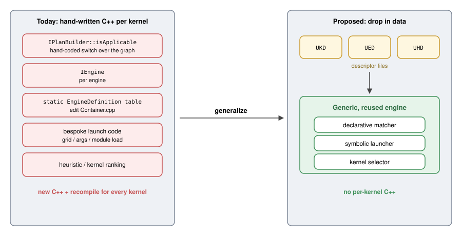
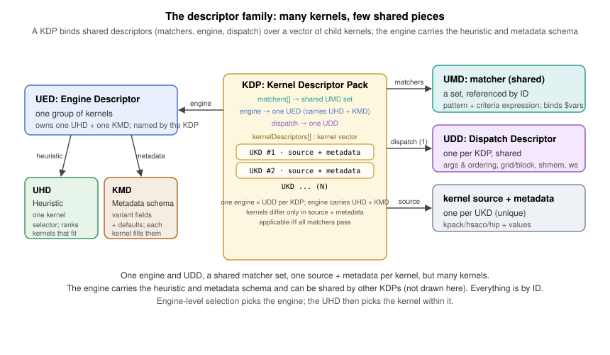
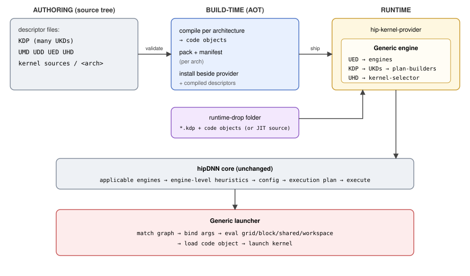
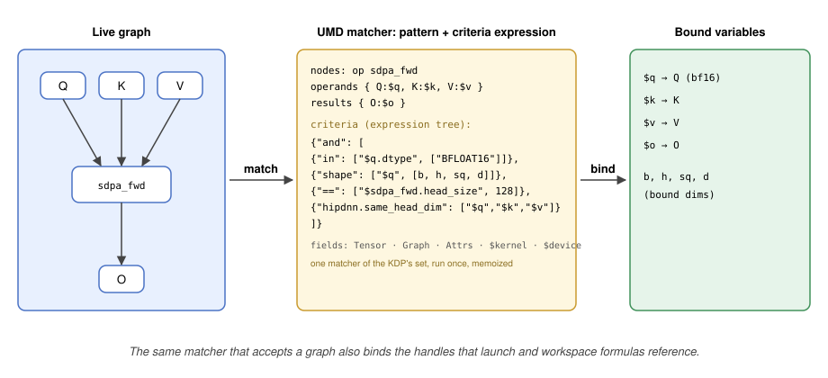
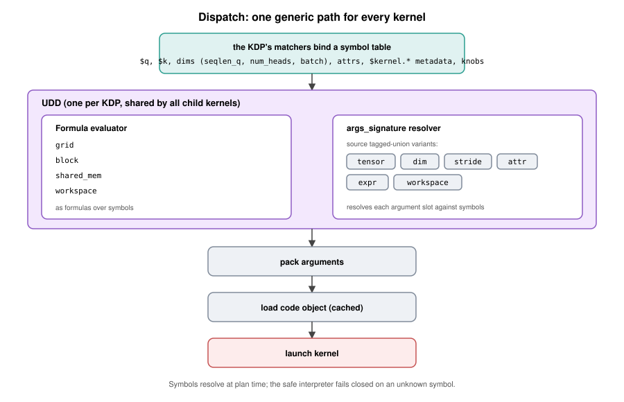
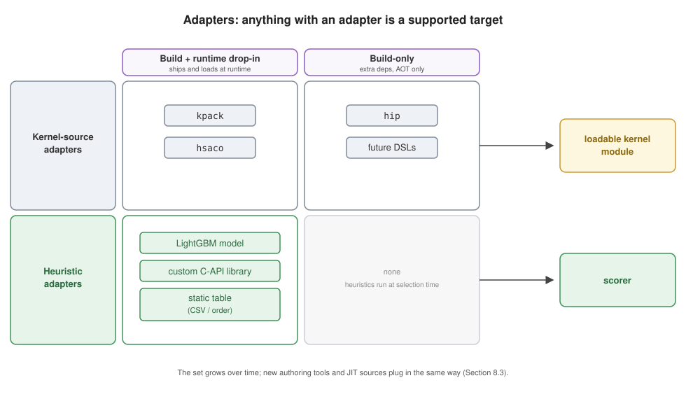
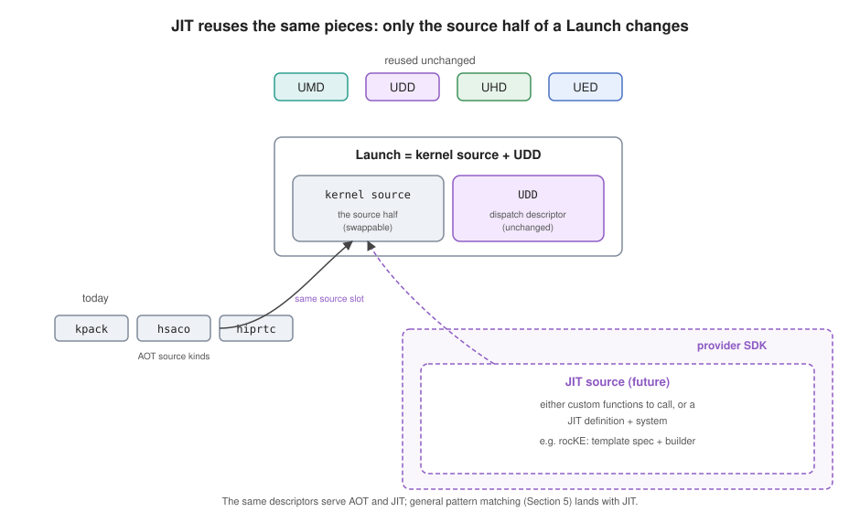
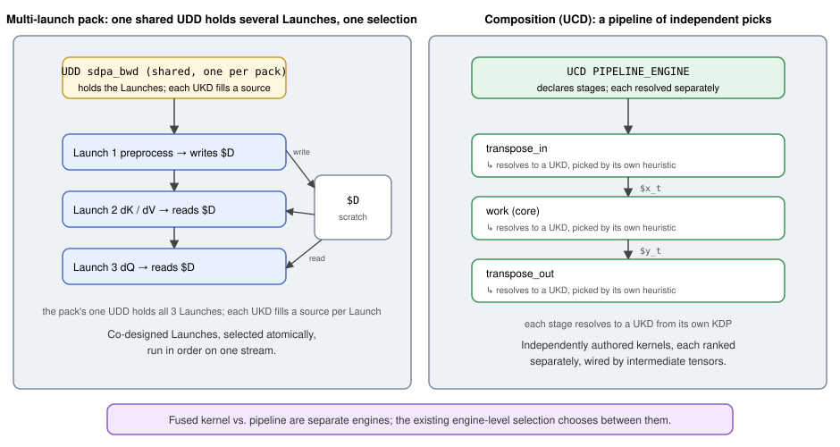

# RFC 0017: Universal Kernel Descriptors (UKD/UMD/UDD/UED/UHD): A Data-Driven Kernel Ingestor

- Contributors: Brian Harrison, Daryl Hawkins, Jason Campbell, Brad Pepers

## Table of Contents

1. [Overview](#1-overview)
2. [The Descriptors](#2-the-descriptors)
3. [How It Works](#3-how-it-works)
4. [Descriptor Formats](#4-descriptor-formats)
5. [Matching and the UMD](#5-matching-and-the-umd)
6. [Dispatch and Workspace](#6-dispatch-and-workspace)
7. [Kernel Source](#7-kernel-source)
8. [Adapters and Extensibility](#8-adapters-and-extensibility)
9. [Observability and Diagnostics](#9-observability-and-diagnostics)
10. [Packaging and Delivery](#10-packaging-and-delivery)
11. [Worked Example: SDPA as a UKD](#11-worked-example-sdpa-as-a-ukd)
12. [Phased Delivery](#12-phased-delivery)
13. [Multiple Kernels and Composition](#13-multiple-kernels-and-composition)
14. [Risks](#14-risks)
15. [Open Questions](#15-open-questions)
16. [References and Prior Art](#16-references-and-prior-art)
17. [Glossary](#17-glossary)

---

## 1. Overview

Every kernel hipDNN's kernel provider runs is hand-written C++: a plan builder that matches the graph,
an engine, a registration-table entry, bespoke launch code, and a selection heuristic. Carrying each
kernel's behavior as code creates four problems that compound as the library grows.

- **Scale.** Kernels multiply combinatorially: a variant per architecture, data type, and problem
  shape, and again per fused form. rocKE (ROCm's kernel engine) already carries three to four scaled
  dot-product attention (SDPA) forward variants per architecture, and convolution alone spans several
  algorithm families (implicit GEMM, explicit GEMM,
  direct, and Winograd). Ten variants per architecture is a near-term floor, with hundreds looming as
  coverage grows toward every algorithm and architecture. Each variant is another hand-written engine.
- **Staleness.** These kernels come from upstream authors who revise them continuously, but every
  variant is hand-ported C++, so staying current means re-porting by hand. hipDNN falls behind: a stale
  copy misses a niche uplift (sometimes more than 2x) or keeps selecting a solution that is now 2x
  slower, and the built value goes undelivered until the re-port is prioritized.
- **Maintainability.** Every hand-written variant is code the team then carries: it must be tested,
  kept building, updated as interfaces change, and fixed when it breaks. The near-identical copies drift
  apart over time, so that burden, test coverage included, is paid again for each one, with no single
  source of truth.
- **Feature velocity.** A cross-cutting change, such as hipGraph support or plan serialization, has to
  be threaded by hand through every one of those near-duplicate engines, so platform features arrive
  slowly and unevenly.

This RFC moves kernel behavior out of code and into data: declarative descriptor files that one
generic provider loads and runs. An author drops in files and the provider matches, selects, and
launches the kernel with no new code, and because the behavior lives in one shared base, a
cross-cutting feature is written once and inherited by every descriptor-backed kernel. The provider
works from a small family of reusable descriptors, bound together for a family of kernels by a **KDP
(Kernel Descriptor Pack)**, the cohesive file that packages a kernel family and the pieces it shares:

- **UMD (Universal Match Descriptor).** A matcher: when a kernel applies, given as a graph pattern and a
  declarative criteria expression, which also bind the named variables the launch references.
- **UDD (Universal Dispatch Descriptor).** How to invoke a kernel, the dispatch application binary interface (ABI): argument binding
  and ordering, grid, block, shared memory, and workspace.
- **UED (Universal Engine Descriptor).** One engine: a stable identity plus the knobs it exposes and
  its behavior and numerical notes. An engine is a named group of kernels.
- **UHD (Universal Heuristic Descriptor).** One kernel-selection model: given many kernels that fit a
  graph, it picks the best one for the problem.
- **UKD (Universal Kernel Descriptor).** One launchable kernel, carrying no logic of its own: its source
  details plus the metadata carried with it. The source is either a compiled kernel or the details for
  building it ahead-of-time (AOT); the metadata records the features and values the kernel was built with, which the
  heuristic uses to build the catalog it picks from. Every UKD in a KDP shares that pack's matchers,
  engine, heuristic, and dispatch, so a UKD names none of them; it is applicable only when **all** of its
  pack's matchers pass.

A family of near-identical kernels launches the same way, matches the same graph shapes, joins the same
engine, and is ranked by the same selector, differing only in their compiled source and its build
metadata. That family is exactly a KDP: one cohesive file that binds a
**set of matchers** (referenced by ID and shared across packs), **one engine descriptor**, **one
heuristic descriptor**, and **one dispatch descriptor**, over a **vector of child kernels** that each
supply only their source and metadata. One of each shared piece per KDP is intentional: a kernel whose
ABI, engine, selector, or matcher set differs simply belongs in another pack. Because every shared
descriptor is authored once and referenced by ID, a family is a handful of shared descriptors plus one
tiny entry per kernel, not hundreds of near-duplicate files.

A prototype for a single operation (SDPA) runs a kernel end-to-end from a generic launch core plus a
thin operation-specific adapter (rocKE, [PR #9207](https://github.com/ROCm/rocm-libraries/pull/9207)).
This RFC generalizes that adapter into a complete data description of a kernel and makes that
generalized form the delivery vehicle: any kernel expressible as a code object plus a description of
when and how to run it is ingested the same way.



**Vision.** The goal is to let kernel authors own delivery end to end. hipDNN provides the tools and
platform to describe, package, and release a kernel; the author takes it the rest of the way without
waiting on provider changes. This cuts the friction from writing a fast kernel to shipping it and gives
a defined path for extending the system. The end state is one generalized description covering both
AOT and just-in-time (JIT) kernels; AOT is the focus here, and JIT is a future
follow-on ([Section 8.3](#83-future-jit-and-normalized-providers)).

**Scope.** This document frames the system and its direction; each descriptor format (match, dispatch,
engine, heuristic) and subsystem (the matcher, the expression language, packaging, and the drop-in loader) is
designed in its own follow-up RFC ([Section 12.2](#122-follow-up-rfcs)). The first deliverable is the
single-kernel path. Multi-kernel launch and composition
([Section 13](#13-multiple-kernels-and-composition)) are fast-follows, not part of this initial design.
A named escape hatch covers a step that genuinely needs C++ (Sections [5](#5-matching-and-the-umd) and
[6](#6-dispatch-and-workspace)); anything needing a new C-API surface or runtime dependency stays a
full provider. This complements build-time codegen rather than replacing it.

### 1.1 What Ships Now Versus Later

| Capability | This RFC (day-one) | Deferred to a follow-up |
|---|---|---|
| Single-kernel path: UKD + UMD + UDD + UED + UHD | Yes | None |
| Fusion: one UMD matches a bounded multi-op subgraph, run as one kernel | Yes ([§5](#5-matching-and-the-umd)) | None |
| Match criteria: opcode, dtype, shape/rank, stride order, packed, divisibility, range, attribute, graph-structure, cross-tensor, per-element `all`, bounded `or` | Yes ([§5](#5-matching-and-the-umd)) | None |
| General matching: N-ary commutative, unbounded chains, optional/variadic operands | None | JIT ([§8.3](#83-future-jit-and-normalized-providers)) |
| Kernel sources | `kpack`, `hsaco`, and the rocKE adapter (build-only, lowers to `hsaco`) first; `hip` follows | new authoring adapters, DSLs ([§8.1](#81-kernel-source-adapters)) |
| Heuristic sources | LightGBM model; custom C-API library | other model formats, static tables ([§8.2](#82-heuristic-adapters)) |
| Runtime drop-in | prebuilt code objects, opt-in, off by default | JIT-compiled sources ([§10](#10-packaging-and-delivery)) |
| Multi-kernel launch program (e.g. SDPA backward) | None | composition ([§13.1](#131-several-kernels-for-one-operation)) |
| Selection composition: UCD pipeline | None | composition ([§13.2](#132-a-pipeline-of-separately-chosen-kernels)) |
| JIT compilation; normalized providers | None | JIT ([§8.3](#83-future-jit-and-normalized-providers)) |

---

## 2. The Descriptors

Each descriptor maps directly onto a concept hipDNN already has; the difference is that the concept
becomes data instead of hand-written code.

| Descriptor | Purpose | Exists in hipDNN today as |
|---|---|---|
| **UKD** (kernel) | One launchable kernel: its source details plus build metadata; the KDP binds the rest | The compiled kernel module (code object) and its hand-tracked build config |
| **KDP** (pack) | Bind a matcher set, one engine, one heuristic, and one dispatch over a kernel vector | The engine-registration table plus the per-kernel applicability and launch scaffolding |
| **UMD** (match) | Accept a graph and bind its named variables | The graph half of `isApplicable` |
| **UDD** (dispatch) | Invoke a kernel: args & ordering, grid/block, shared mem, workspace | The bespoke launch and argument-wiring code |
| **UED** (engine) | A stable engine identity with its knobs and behavior/numerical notes | The provider's engine-registration table plus a `HIPDNN_REGISTER_ENGINE` id |
| **UHD** (heuristic) | Rank the kernels within one engine and pick one | A ranking model living inside an engine's dispatcher |

A kernel descriptor carries no logic of its own. Everything but the code is the KDP's: the pack's shared
matcher set decides when the kernel applies, its one engine and one heuristic own and rank it, and its
one dispatch descriptor decides how it launches. So a UKD is just its source details plus the build
metadata the heuristic ranks it by. The pack's one UDD holds one or more **Launches**, each a dispatch
step, and a Launch pairs one such step with the kernel source that fills it. A simple kernel is a
one-Launch UDD; a multi-launch kernel such as SDPA backward is a several-Launch UDD run in order
([Section 13](#13-multiple-kernels-and-composition)), still one shared UDD per pack. Because the KDP
holds the engine and heuristic, every kernel in it joins one engine (an engine is a group of kernels)
and is ranked by one selector (a selection group); many KDPs may name the same engine and heuristic.

Two more terms complete the set: a **KDP (Kernel Descriptor Pack)** is the cohesive unit above (a set of
matchers, one engine, one heuristic, and one dispatch descriptor over a vector of child kernels, the
deployment shape of [Section 1](#1-overview)), and a **UCD (Universal Composite Descriptor)** composes
stages that each resolve to a UKD (future work, [Section 13](#13-multiple-kernels-and-composition)).



There are two independent selection levels, and they are named apart to avoid conflation. The
**engine-selection heuristic** is hipDNN's existing heuristic plugin interface, which chooses which
engine handles a graph. A UHD is a **kernel-selection heuristic** that operates one level down,
choosing which kernel within an engine to run; it is part of the generic provider, not a new host
interface. Both are needed: engine selection is unchanged by this proposal, and the kernel-selection
heuristic is what makes dropping in a family of kernels useful, because it ranks them per problem.

---

## 3. How It Works

There is one family of descriptor formats, one generic engine, and two ways descriptors reach it:

- **Build-time (AOT).** Descriptors and kernel sources in the source tree are compiled and packed
  per GPU architecture, then installed beside the provider.
- **Runtime drop-in.** Descriptors backed by a prebuilt code object (or JIT source) are placed in a
  folder and loaded when the provider starts, with no build step.

Both paths produce the same thing the generic engine consumes, so everything downstream (matching,
selection, launch) is identical regardless of how a kernel arrived.



At provider load, the generic engine discovers all available descriptors and wires them up: it loads
every KDP, then builds the set of engines from them: each UED becomes an engine associated with the
KDPs that name it, each child kernel becomes a data-backed plan builder inside that engine, and each
KDP's heuristic becomes the selector its engine consults. Deciding which kernels apply to a
graph is then a cheap, shared-matcher pass ([Section 5](#5-matching-and-the-umd)): shared checks run
once for the whole graph, per-kernel checks run only for the survivors, and results are cached. No new host or plugin-ABI interfaces are introduced; the
generic engine satisfies hipDNN's existing contracts using descriptor data, and the new machinery it
needs (the matcher, the expression interpreter, the selector, and the predicate and custom-plan
registries) lives inside the provider behind those contracts.

---

## 4. Descriptor Formats

Descriptors are authored in a human-readable, diffable text format and compiled to a compact binary
form for fast loading. Each format has a defined schema and a
version; a descriptor is refused, never silently reinterpreted, if its version is newer than the
runtime understands. The concrete serialization and schema for each format are deferred to that
format's follow-up RFC.
Every descriptor also carries a stable, opaque `id` used for cross-references and a `name` that is mandatory for
logging and diagnostics; both appear in the examples. The examples are illustrative, and the
`schema`/version plumbing is shown once here and elided elsewhere.

**UED, an engine with its knobs and notes:**

```jsonc
{
  "schema": "hipdnn.ued/v1",
  "id":     3310472051,                        // stable, unique; referenced by the KDP
  "name":   "Example attention engine",        // human-readable label
  "behavior_notes":  ["runtime_compilation"],  // hipDNN behavior notes for this engine
  "numerical_notes": ["tensor_core", "reduced_precision_reduction"],  // hipDNN numerical notes
  "knobs": [                                   // author-exposed, user-controllable
    {"name": "split_k",     "type": "int", "default": 1, "constraint": {"min": 1, "max": 8}},
    {"name": "use_atomics", "type": "int", "default": 0, "constraint": {"one_of": [0, 1]}}
  ]
}
```

**UHD, a kernel-selection model for one group:**

```jsonc
{
  "schema": "hipdnn.uhd/v1",
  "id":     3310472052,       // stable, unique; referenced by the KDP
  "name":   "Example attention LightGBM selector",
  "kind":   "model",          // "model" | "static_order" | "custom_library"
  "model": {
    "framework": "lightgbm",  // tagged so other frameworks are additive
    "artifact":  "example_attn/model.bin",
    "features":  "example_attn/features.json"
  },
  "objective": "max"          // higher predicted score wins
}
```

**UMD, a matcher** ([Section 5](#5-matching-and-the-umd)): one shared, ID-referenced match descriptor,
a structural pattern (when present) plus a declarative criteria expression. A KDP lists the matcher IDs
its kernels require.

```jsonc
{
  "schema": "hipdnn.umd/v1",
  "id":     8811203344,    // stable; listed in KDP matchers[], shared across packs
  "name":   "SDPA prefill d128 bf16 match",
  "nodes":    [ ... ],     // structural pattern that binds $vars (Section 5)
  "criteria": { ... }      // declarative expression tree over bound tokens (Section 5)
}
```

**UDD, how to invoke a kernel** ([Section 6](#6-dispatch-and-workspace)): the dispatch ABI, referenced by ID.

```jsonc
{
  "schema": "hipdnn.udd/v1",
  "id":     8811203390,
  "name":   "SDPA prefill d128 dispatch",
  "grid":   { ... }, "block": { ... },  // Section 6
  "shared_mem_bytes": 32768,
  "workspace_bytes":  0,
  "args_signature":   [ ... ]           // argument binding + ordering (Section 6)
}
```

**UKD, one kernel:** its source details plus the metadata carried with it. The source points at a
compiled kernel or says how to build it AOT ([Section 7](#7-kernel-source)); the metadata records the
features and values the kernel was built with. That metadata does double duty: the heuristic ranks the
catalog on it, and criteria read it as `$kernel.*` tokens ([Section 5](#5-matching-and-the-umd)). It is
checked at load against the heuristic's expected features. A UKD's matchers, engine, heuristic, and
dispatch are all the KDP's, so it names none of them.

```jsonc
{
  "schema": "hipdnn.ukd/v1",
  "id":        4471900201,
  "name":      "Example attention prefill d128 bf16 (gfx942)",
  "kernel_source": { ... },        // Section 7: a compiled kernel, or how to build it AOT
  "metadata": {                    // build features + values: heuristic ranks on these, criteria read them as $kernel.*
    "head_size": 128, "dtype": "bf16", "tile_m": 128, "split_k": 1
  },
  "priority":  100                 // tie-break when the UHD is not decisive
}
```

**KDP, a cohesive pack:** one file that binds a shared **matcher set**, **one engine**, **one
heuristic**, and **one dispatch descriptor**, over a **vector of child kernels**. Every referenced
descriptor is shared by ID across packs; only the child kernels are unique to this pack. One of each is
intentional: every kernel in the pack shares that launch ABI, engine, selector, and matcher set, so a
kernel that differs in any of them belongs in a different pack.

```jsonc
{
  "schema": "hipdnn.kdp/v1",
  "version": "1",              // pack format version, gated at load
  "arch":     ["gfx942"],      // arch is a pack property, resolved at selection (Section 5)
  "matchers": [8811203344, 8811203301, 8811203302],  // UMD ids; a kernel applies iff all pass
  "engine":    3310472051,     // one UED id: the engine every child kernel joins
  "heuristic": 3310472052,     // one UHD id: the selector that ranks them
  "dispatch":  8811203390,     // one UDD id, shared by every child kernel (Section 6)
  "kernelDescriptors": [       // the vector of child kernels; each is just source + metadata
    { "id": 4471900201, ... },
    { "id": 4471900202, ... }
    // ...
  ]
}
```

---

## 5. Matching and the UMD

Matching turns a hand-coded applicability check into declarative data. Today the check is a C++ switch
over the graph; the same intent becomes a **UMD (Universal Match Descriptor)**, a reusable **matcher**:
a **structural pattern** (named op nodes and their operand/result edges over the op DAG, when the check
is about graph shape) plus a **criteria expression** over the fields the pattern binds. A KDP lists a
**set of matcher IDs**; a kernel is applicable only when **all** pass, and matchers are shared by ID
across packs. A validated study of MIOpen CK convolution and rocKE SDPA applicability found that over a
thousand concrete kernels collapse to a handful of shared matcher shapes, with tile and vector constants
carried as matcher *parameters* rather than new matchers.

**Criteria are expressions, not flat token lists.** A criterion is a nested `{"op": [args]}` tree over
the fields the pattern binds, built from logical operators (`and`, `or`, `!`), comparisons (`==`, `!=`,
`<`, `in`), a per-element `all`, and arithmetic (`+`, `*`, `%`), plus a few custom short-hands
(`divisible`, and the pattern-binding `shape`/`rank`) and registry-resolved custom operations for checks
the built-ins cannot express (the escape hatch below). Operators nest to any depth, and a left-hand side
can itself be a computed expression rather than a raw field. A leaf is a literal or a `$`-prefixed field
reference (`"$q.dtype"`); the `$` marks a reference, so no `var` wrapper is needed.

**The hipDNN schema declares the fields an expression may reference**, so an author sees the whole
vocabulary up front and the interpreter fails closed on anything undeclared. The fields fall in five
namespaces, and every criteria and dispatch expression draws from the same set:

- **Tensor:** a bound operand's fields: `$q.dtype`, `$q.rank`, its named dims (`$q.seqlen_q`, `$w.c`),
  evaluated flags (`$q.stride_order`, `$q.packed`), and `$q.virtual` (an internal intermediate between
  matched nodes, not a graph input or output).
- **Graph:** structural facts of the matched graph, e.g. `$graph.node_count`, which pins an exact match
  (the graph has exactly this many nodes).
- **Attributes:** a matched op node's attributes, named by the node's pattern `id`: an SDPA node
  `{"id": "sdpa_fwd"}` exposes `$sdpa_fwd.head_size`, a conv node `{"id": "conv"}` exposes `$conv.dilation`.
- **Kernel metadata:** `$kernel.<field>`, the current UKD's build features and values (tile and vector
  constants, the dtype and shape it targets); the same metadata the heuristic ranks on
  ([Section 4](#4-descriptor-formats)), so a check binds a kernel to the graph, e.g.
  `divisible($q.head_size, $kernel.tile_d)`.
- **Device properties:** `$device.<field>` such as `$device.lds_size` or `$device.warp_size`, for a
  check like an LDS budget `<=($kernel.lds_per_block, $device.lds_size)`.

New fields are added to the schema and referenced the same way; the full field and operator vocabulary,
the operand-property set (broadcast, alignment, sparse and ragged kinds), and the interpreter profile
are in the UMD follow-up.

**A prebuilt match is exact.** A prebuilt kernel solves one complete graph, so a matcher asserts
`$graph.node_count` to accept only a graph of exactly that size, and marks each intermediate tensor
`virtual`. A single-op kernel checks `node_count == 1`; a fused Conv-Bias-ReLU kernel checks
`node_count == 3` with its two intermediates `virtual`. Shared checks (like the tile matcher below) stay
graph-shape-agnostic, so one such matcher composes into packs of either shape. Matching a pattern inside
a larger graph, without a fixed count, is the looser JIT / general-matching mode
([Section 8.3](#83-future-jit-and-normalized-providers)).

**Architecture** is handled at pack selection rather than as a runtime criterion, at least for AOT: a
pack carries code objects for the arches it targets, so its per-architecture `kpack` manifest
([Section 10](#10-packaging-and-delivery)) gates both loadability and arch applicability, and no arch
criterion runs at match time. A JIT pack that generates per arch may instead reference arch as a
`$device` field at match time; that path is deferred to the JIT follow-up
([Section 8.3](#83-future-jit-and-normalized-providers)).

The `conv.tile_fit` matcher shows the form, checking a conv's implicit-GEMM dims (products of its bound
dims) against the kernel instance's tile constants (its `$kernel.*` metadata):

```jsonc
// conv.tile_fit: implicit-GEMM M/N/K (products of the conv's bound dims) must divide the tile constants
{
  "schema": "hipdnn.umd/v1",
  "id":   8811203301,
  "name": "conv.tile_fit",
  "nodes": [
    {"kind": "op", "id": "conv", "op": "convolution_fwd",
     "operands": {"X": "$x", "W": "$w"}, "results": {"Y": "$y"}}
  ],
  "criteria": {"and": [
    {"divisible": [{"*": ["$y.n", "$y.ho", "$y.wo"]}, "$kernel.MPerBlock"]},  // GEMM M = output positions
    {"divisible": ["$y.k", "$kernel.NPerBlock"]},                             // GEMM N = output channels
    {"divisible": [{"*": ["$w.c", "$w.y", "$w.x"]}, "$kernel.KPerBlock"]}     // GEMM K = reduction (C*Y*X)
  ]}
}
```

**Fusion is a day-one capability.** Because a matcher's pattern is a multi-node subgraph, one matcher can
match a fused op sequence, bind all its tensors at once, and hand it to a single UKD (the fused case is
below). Fusion is distinct from composition, running one graph as several kernels
([Section 13](#13-multiple-kernels-and-composition)), which goes the opposite direction and is future work.

The matcher below matches SDPA forward: its `nodes` bind the tensor tokens, its `criteria` constrain
them:

```jsonc
{
  "schema": "hipdnn.umd/v1",
  "id":   1180449020,
  "name": "SDPA forward (d128, bf16) match",
  "nodes": [
    {"kind": "op", "id": "sdpa_fwd", "op": "sdpa_fwd",
     "operands": {"Q": "$q", "K": "$k", "V": "$v"}, "results": {"O": "$o"}}
  ],
  "criteria": {"and": [
    {"in":    ["$q.dtype", ["BFLOAT16"]]},
    {"==":    ["$q.stride_order", [0, 1, 2, 3]]}, "$q.packed",  // contiguous bhsd
    {"shape": ["$q", ["batch", "num_heads", "seqlen_q", "head_size"]]},  // binds these dims
    {"in":    ["$k.dtype", ["BFLOAT16"]]},
    {"shape": ["$k", ["batch", "num_heads", "seqlen_k", "head_size"]]},
    {"in":    ["$v.dtype", ["BFLOAT16"]]},
    {"hipdnn.same_head_dim": ["$q", "$k", "$v"]},      // custom operation
    {"==":    ["$sdpa_fwd.head_size", 128]},
    {"in":    ["$sdpa_fwd.mask_mode", ["none"]]},
    {"==":    ["$graph.node_count", 1]}  // exact: this kernel is the whole graph
  ]}
}
```

Matching does double duty: it decides the kernel applies and binds the fields the launch will use. A
field is **declared** in the pattern (a dim named in a `shape`, or an op attribute), **bound** when the
graph matches, then **used** in the UDD's formulas ([Section 6](#6-dispatch-and-workspace)): `$q.seqlen_q`
binds here and feeds `ceil_div($q.seqlen_q, 16)` there. A formula can only reference fields the match
produces.



**Variable-rank tensors.** Naming every dim in `shape` pins an exact rank. When rank varies (NCHW vs
NCDHW), the pattern names the fixed dims and binds the variable run as a single vector, e.g.
`["n", "c", "$spatial"]` where `$spatial` captures the 2 or 3 spatial dims, so one matcher accepts both
ranks and still reaches those dims through `all` or a product (`*($spatial)`). Per-dim names like `$x.h`
are the fixed-rank shorthand; the vector is the general form. (This is variable dims within one tensor,
distinct from variadic *operands*; exact `shape` syntax is in the UMD follow-up.)

**Escape hatch.** When the built-ins cannot express a check, a criterion invokes a **custom operation**,
a native predicate resolved from the provider's registry (`hipdnn.same_head_dim` above), carried as a
symbol name and typed arguments, never inline code. A file that names a predicate the provider does not
ship fails to resolve, so the registry is part of its published contract. The dispatch layer has an
analogous custom plan ([Section 6](#6-dispatch-and-workspace)); together they form a graded ladder from
declarative data, to a named escape hatch for a step that needs real C++, to a full provider.

**Applicability is a cheap, shared-matcher pass.** A matcher that reads only graph fields
(Tensor/Graph/Attributes/Device) runs **once for the whole graph**; on failure it disqualifies every
pack that lists it, so evaluating the most-shared checks first (arch, dtype, layout) prunes the
candidate set fast. A matcher that also reads `$kernel.*` is the **same** matcher re-evaluated **once
per kernel** (per distinct metadata, memoized) and disqualifies per kernel, not per pack. Those
kernel-level checks are expected; they stay cheap because distinct metadata values are far fewer than
kernels and they run only for kernels whose packs survived the graph-only pruning. Results are cached
across queries, and a kernel whose matchers all pass goes to the UHD to be ranked.

**Arbitration is deterministic.** When several UKDs accept the same graph, the UHD ranks them and the
top-scored kernel wins. Ties break in a fixed order: explicit `priority`, then the descriptor's stable
`id`. When the decision falls to `id`, the provider logs the conflict to the warning log.

**Out of scope for v1.** General N-ary commutative matching and unbounded chains are deferred to the JIT
follow-up ([Section 8.3](#83-future-jit-and-normalized-providers)); a prebuilt kernel encodes one fixed
graph shape, so bounded matching covers it, and operand optionality is handled by shipping distinct UKDs.

**A fused match.** The same UMD form matches several ops as one fusable unit. This Conv-Bias-ReLU
matcher pins the exact graph: `$graph.node_count == 3` accepts only these three ops, and `$conv_out` and
`$bias_out` are required `virtual`, so those intermediates are absorbed into the fused kernel and one UKD
serves the whole chain as a single kernel.

```jsonc
{
  "schema": "hipdnn.umd/v1",
  "id":   6620551007,
  "name": "Conv-Bias-ReLU (NHWC, f16) match",
  "nodes": [
    {"kind": "op", "id": "conv", "op": "convolution_fwd",
     "operands": {"X": "$x", "W": "$w"},           "results": {"Y": "$conv_out"}},
    {"kind": "op", "id": "bias", "op": "pointwise_add",
     "operands": {"A": "$conv_out", "B": "$bias"},  "results": {"Y": "$bias_out"}},
    {"kind": "op", "id": "act",  "op": "pointwise_relu",
     "operands": {"A": "$bias_out"},                "results": {"Y": "$y"}}
  ],
  "criteria": {"and": [
    {"in":    ["$x.dtype", ["FLOAT16"]]},
    {"==":    ["$x.stride_order", [0, 2, 3, 1]]}, "$x.packed",  // NHWC
    {"in":    ["$y.dtype", ["FLOAT16"]]},
    {"==":    ["$y.stride_order", [0, 2, 3, 1]]}, "$y.packed",  // NHWC
    {"shape": ["$y", ["batch", "out_h", "out_w", "out_channels"]]},
    {"shape": ["$bias", ["out_channels"]]},
    {"==":  ["$graph.node_count", 3]},  // exactly these three ops
    "$conv_out.virtual",                // internal intermediate, absorbed by the fused kernel
    "$bias_out.virtual"
  ]}
}
```

Its bound `$y` dims feed the fused kernel's launch formulas exactly as the single-op case does.

---

## 6. Dispatch and Workspace

The second hard problem is dispatching a matched kernel with no bespoke code. The dispatch ABI lives
in a **UDD (Universal Dispatch Descriptor)**, referenced by ID: one UDD per KDP, shared by every child
kernel. A UDD holds one or more **Launches**, each a dispatch step
(grid, block, shared memory, workspace, and argument signature); a kernel's source fills a Launch's slot
to run it. A single-kernel UDD has one Launch, shown below; a multi-launch UDD has several run in order
([Section 13](#13-multiple-kernels-and-composition)). Because the launch ABI is written once here, every
kernel in the pack inherits it; a kernel that needs a different one belongs in a different pack.

**One expression language**, the same one the criteria use ([Section 5](#5-matching-and-the-umd)),
describes grid, block, shared memory, and workspace as formulas over the schema's declared fields: the
tensor dims and attributes the match bound, the kernel's `$kernel.*` metadata, and `$device.*`
properties. Evaluation is a safe interpreter that fails closed on an undeclared field or an invalid
operation; it never executes arbitrary code, which is what keeps descriptors pure data.

Because a KDP pairs one UDD with a set of matchers, the matchers publish the fields they bind, and the
pairing is checked at build and at drop-in load: a UDD that references a graph field none of its pack's
matchers bind is rejected then, rather than left to fail closed at plan time on a live graph. Plan-time
fail-closed remains a backstop, not the first line of defense.

```jsonc
{  // a UDD; every $q.* dim below is a field the pack's matcher bound (Section 5)
  "schema": "hipdnn.udd/v1",
  "grid":  {"x": {"ceil_div": ["$q.seqlen_q", 16]},
            "y": "$q.num_heads", "z": "$q.batch"},
  "block": {"x": 256, "y": 1, "z": 1},
  "shared_mem_bytes": 32768,
  "workspace_bytes": {"*": [{"*": ["$q.batch", "$q.num_heads"]},  // batch*num_heads*seqlen_q*4
                           {"*": ["$q.seqlen_q", 4]}]}
}
```

Workspace, when non-zero, is an expression in this same language, most commonly a sum of terms:
dimension products (from the graph) times per-element byte rates (author constants), gated by knobs or
attributes where needed. Kernels whose scratch depends on a knob, such as a split-K GEMM sizing its
partials by the split factor, use the full expression (ceil-div, max, and the rest), not only the
sum-of-products form. It is evaluated once per plan, satisfying hipDNN's existing workspace-size query
generically.

**Declarative argument binding** describes each kernel argument and where its value comes from,
so the generic launcher can assemble the call directly from the matched graph:

```jsonc
{  // the same UDD, continued
  ...,
  "args_signature": [
    {"name": "Q",          "kind": "pointer", "source": {"from": "tensor", "ref": "$q"}},
    {"name": "seqlen_q",   "kind": "scalar", "type": "i64", "source": {"from": "dim",    "ref": "$q", "axis": 2}},
    {"name": "stride_q",   "kind": "scalar", "type": "i64", "source": {"from": "stride", "ref": "$q", "axis": 2}},
    {"name": "scale_log2", "kind": "scalar", "type": "f32",
       "source": {"from": "expr",
                  "expr": {"*": [{"rsqrt": ["$q.head_size"]}, 1.4426950408889634]}}},
    {"name": "__workspace__", "kind": "workspace"}
  ]
}
```

Each argument's `source` is one of a small set: a tensor pointer, a dim or stride read off a bound
tensor, an attribute, a computed expression, or the plan-allocated workspace. These name the same schema
fields the criteria use, so a `dim` source is the field `$q.seqlen_q` and an `expr` source is a formula
in that same token language; together they describe the full kernel call as data, so the launcher
assembles it without any per-kernel code. In `dim` and `stride` sources, `axis` indexes the tensor's
logical dimension order (as listed in its `shape`), independent of its physical `stride_order`.

The generic launcher then does the same steps for every kernel: resolve the argument sources against
the bound variables, evaluate the grid/block/shared/workspace formulas, pack the arguments, load the
kernel's code object, and launch. A parsed dispatch spec, cached kernel handle, and preallocated
argument buffer keep this close to hand-written launch cost (see [Section 12.1](#121-testing-and-performance)).



**Escape hatch: a custom plan.** When the declarative dispatch cannot express what a kernel needs, for
example a swizzled or data-dependent grid, host-side logic between launches, or nonstandard compile
flags, a UDD may name a registered custom plan instead of the declarative fields:

```jsonc
{"custom_plan": "hipdnn.persistent_gemm", "config": {"compile_flags": ["-mllvm", "..."]}}  // a UDD
```

As with the native predicate ([Section 5](#5-matching-and-the-umd)), the descriptor carries only a
symbol name and typed config, never inline code, and the handler is resolved from the
provider-internal registry. Because a custom plan replaces the UDD's declarative fields, its handler
owns everything those fields would have provided, including reporting the kernel's workspace size (the
query the `workspace_bytes` formula would otherwise answer). Matching still happens declaratively
through the UMD, so only the launch itself becomes C++. On the drop-in path a custom plan must be a
built-in registered handler, subject to the source-trust rules of
[Section 10](#10-packaging-and-delivery).

---

## 7. Kernel Source

A kernel source points at code through a small tagged union; it is the one piece unique to a UKD, and
it fills a Launch slot in the pack's shared UDD to run. A single-kernel UKD supplies one source; a
multi-launch UKD supplies one per Launch ([Section 13](#13-multiple-kernels-and-composition)). The
initial variants:

```jsonc
"kernel_source": {
  "kind": "kpack" | "hsaco" | "hip",
  // kind-specific fields point at a compiled kernel, or say how to build one; each yields one loadable handle:
  // kpack:  {"library": "rocke_attn.kpack", "symbol": "sdpa_fwd_d128_bf16_gfx942"}
  //           a function symbol resolved from a packed multi-arch library artifact (build-time)
  // hsaco:  {"file": "sdpa_fwd_d128_bf16_gfx942.co"}
  //           a prebuilt code-object file (runtime drop-in)
  // hip:    {"source": "sdpa_fwd.hip", "entry": "sdpa_fwd_kernel"}
  //           a HIP source file, compiled ahead of time and packaged (build-time; covers hipRTC too)
}
```

The set is deliberately open. Every source, however authored, terminates in a single loadable kernel
handle, and each source kind is reached through an adapter, so growing the set never adds a new launcher
or dispatch path. [Section 8](#8-adapters-and-extensibility) covers the adapter model and the order in
which sources arrive.

---

## 8. Adapters and Extensibility

Two of the descriptors are open-ended: a kernel source ([Section 7](#7-kernel-source)) can be authored
many ways, and a UHD can carry many kinds of selection model. Rather than bake each variant into the
generic engine, both reach their content through **adapters**. An adapter turns one supported
authoring form into something the engine can use: a loadable kernel module for a source, or a scorer
for a heuristic. Anything with an adapter is a supported target, and the set of adapters grows over
time.

Adapters come in two delivery classes, which decides where a target is available:

- **Build-only.** The adapter needs extra dependencies not available in the shipped runtime (for
  example a DSL's compiler or toolchain). It runs during the build (AOT) and emits a prebuilt
  artifact; the runtime never needs the dependency.
- **Build and runtime drop-in.** The adapter is self-contained enough to also run at load, so its
  targets work on the drop-in path as well as AOT.



### 8.1 Kernel-Source Adapters

The source variants of [Section 7](#7-kernel-source) are the first built-in adapters: `kpack` and
`hsaco` are prebuilt and ship first, and `hip` follows as a build-only adapter, since it needs the
compiler to lower its source to a code object ahead of time. Adding a new authoring tool means adding
one adapter that lowers its form to a code object, never a new launcher or dispatch path
([Section 6](#6-dispatch-and-workspace)). A DSL that needs its own compiler is typically a build-only
adapter; a self-contained generator can be build-and-runtime. Runtime JIT of source is a future
direction ([Section 8.3](#83-future-jit-and-normalized-providers)).

The rocKE prototype ([PR #9207](https://github.com/ROCm/rocm-libraries/pull/9207)) is the first
concrete case and gets its own **build-only** kernel-source adapter: rocKE sources are not directly
loadable, so the adapter runs the rocKE build step to lower them into `hsaco` code objects ahead of
time, which the runtime then loads like any other prebuilt code object. This is the adapter migrated in
the first implementation work ([Section 12](#12-phased-delivery)).

### 8.2 Heuristic Adapters

UHDs extend the same way. A UHD names a `kind`, and an adapter interprets that content into a scorer.
The first adapter is a **LightGBM model** ([Section 4](#4-descriptor-formats)); alongside it, a
**custom heuristic library** adapter satisfies a small C-API, so a provider can supply a bespoke
selector without a model file. Further adapters extend what a UHD can reference (other model formats,
or plain file types such as a static CSV lookup or a fixed static order) without changing the spec. A
heuristic runs at selection time, so its adapter is always build-and-runtime, never build-only.

### 8.3 Future: JIT and Normalized Providers

JIT is deferred to its **own deeper follow-up RFC**; only its shape is sketched here. The same pieces
built for this AOT ingestor (the match, dispatch, heuristic, and engine descriptors, and the
source/adapter model) carry over to JIT with no new *dispatch or engine* vocabulary: the launch and
selection machinery is unchanged. A kernel source already gives a clear path: at build time (or, for
supported runtime sources, at load) convert the authored source into a launchable kernel module. A JIT
source is the same seam, except instead of lowering a source straight to a module it either names custom
functions to call (like the escape hatches of Sections [5](#5-matching-and-the-umd) and
[6](#6-dispatch-and-workspace)) or ties to a specific JIT definition and the system that runs it. Two
things do grow for JIT, in the JIT follow-up: the matcher gains the general-pattern extensions below,
and a generated kernel's metadata describes the space of variants it can emit rather than one fixed
build, so the heuristic ranks over that space.



Because JIT is bound to a JIT engine and its source technology, it belongs in the **provider SDK**:
each provider reuses this same descriptor system to describe its own provider matches, so a JIT source
may be custom function sources or a specific technology (rocKE, a provider-specific DSL). JIT sources
need their own extensible adapters to register and describe them. For rocKE, for example, a template
spec plus a builder maps the matched graph's details onto the final spec and build. That is complex
enough to warrant the dedicated follow-up.

The matcher's general-pattern extensions land here too, for the reason given in
[Section 5](#5-matching-and-the-umd): general matching is only useful once a kernel can be generated for
whatever was matched.

Longer term, providers normalize onto one implementation: AOT sources become KDPs; a
C-API provider becomes a custom JIT version; future fusions are ingested the same way; and the model
is expressive enough to describe compositions *within* a provider
([Section 13](#13-multiple-kernels-and-composition)) where support is extended through
composition instead of a hand-fused kernel.

---

## 9. Observability and Diagnostics

A data-driven provider needs more diagnostic surface than hand-written code, not less. When a kernel
is a dropped-in file, an operator must be able to see why one was not selected or not loaded, why one
winner beat another, and where time went. Because selection and launch are data-driven, they are also
inspectable, so this design treats tooling as a first-class deliverable rather than an afterthought.
The provider surfaces:

- **A resolved-plan view**: the chosen UKD, its bound variables, and the concrete grid, block, and
  workspace values.
- **A why-not and arbitration trace**: which UKDs matched, how the UHD scored them, and where a tie
  fell to `priority` or stable `id`.
- **Load and compile diagnostics**: which descriptors were discovered, which were quarantined and why,
  and the timing of descriptor discovery and any JIT compilation.

These make a descriptor-backed kernel as debuggable as hand-written C++, and are what let an operator
trust a system whose behavior lives in data. The tooling surface is built out alongside the phases of
[Section 12](#12-phased-delivery).

---

## 10. Packaging and Delivery

The two ingestion paths differ only in where a kernel's code comes from:

- **Build-time (AOT).** Discover and validate descriptors, compile each kernel per target
  architecture, pack the code objects into per-arch bundles with a self-describing manifest, and
  install them beside the provider. The manifest records provenance (architecture, toolchain,
  build id) so incompatible bundles are rejected before load.
- **Runtime drop-in.** The path is opt-in and off by default. When enabled, the provider scans a
  dedicated drop-in location for custom bundles at startup, compiles each descriptor to a matcher once,
  and registers it exactly as an installed one; a single package may declare many descriptors, and a
  bad descriptor is quarantined on load without failing the rest. JIT kernels compile on first use and
  cache their result. (The concrete enablement and location mechanism is left to the delivery
  follow-up RFC.)

Compatibility is gated the same way in both paths: a descriptor whose schema version, required
architecture, or toolchain does not match the runtime is refused with a clear error rather than
risking silent misexecution.

**Trust boundary.** Prebuilt code objects, whether packed in a bundle or installed into the
provider's tree, inherit the trust of that install tree: an actor who can write them there can
already replace hipDNN's own installed libraries, so they are not a new surface. Runtime JIT of author
source is different, since it invokes a compiler on author-controlled text; the intent is still to
support dropping in sources, so JIT source lives in a sibling directory beside the installed
`arch_content` and is enabled by its own opt-in. The exact source-trust requirements, up to and
including restricting drop-in to prebuilt code objects, are deferred to the delivery follow-up RFC.

---

## 11. Worked Example: SDPA as a UKD

The SDPA path prototyped in the rocKE work ([PR #9207](https://github.com/ROCm/rocm-libraries/pull/9207)),
a graph allowlist plus a grid-symbol table plus hand-written argument wiring, collapses into a matcher,
a dispatch descriptor, and a KDP that binds them over a kernel vector. All three are
shown below so the example stands on its own; the matcher is the SDPA forward one from
[Section 5](#5-matching-and-the-umd) (id `1180449020`), repeated here for reference:

```jsonc
// --- UMD (a matcher): when it applies + the vars it binds (same as Section 5; repeated so this stands alone) ---
{
  "schema": "hipdnn.umd/v1",
  "id":   1180449020,
  "name": "SDPA forward (d128, bf16) match",
  "nodes": [
    {"kind": "op", "id": "sdpa_fwd", "op": "sdpa_fwd",
     "operands": {"Q": "$q", "K": "$k", "V": "$v"}, "results": {"O": "$o"}}
  ],
  "criteria": {"and": [
    {"in":    ["$q.dtype", ["BFLOAT16"]]},
    {"==":    ["$q.stride_order", [0, 1, 2, 3]]}, "$q.packed",  // contiguous bhsd
    {"shape": ["$q", ["batch", "num_heads", "seqlen_q", "head_size"]]},  // binds these dims
    {"in":    ["$k.dtype", ["BFLOAT16"]]},
    {"shape": ["$k", ["batch", "num_heads", "seqlen_k", "head_size"]]},
    {"in":    ["$v.dtype", ["BFLOAT16"]]},
    {"hipdnn.same_head_dim": ["$q", "$k", "$v"]},      // custom operation
    {"==":    ["$sdpa_fwd.head_size", 128]},
    {"in":    ["$sdpa_fwd.mask_mode", ["none"]]},
    {"==":    ["$graph.node_count", 1]}  // exact: this kernel is the whole graph
  ]}
  // arch is a pack property (KDP.arch below), not a criterion
}

// --- UDD: how to invoke it (one per KDP, shared by every child kernel) ---
{
  "schema": "hipdnn.udd/v1",
  "id":   1180449055,
  "name": "SDPA forward (d128) dispatch",
  "grid":  {"x": {"ceil_div": ["$q.seqlen_q", 16]},
            "y": "$q.num_heads", "z": "$q.batch"},
  "block": {"x": 256, "y": 1, "z": 1},
  "shared_mem_bytes": 32768,
  "workspace_bytes":  0,
  "args_signature": [
    {"name": "Q", "kind": "pointer", "source": {"from": "tensor", "ref": "$q"}},
    {"name": "K", "kind": "pointer", "source": {"from": "tensor", "ref": "$k"}},
    {"name": "V", "kind": "pointer", "source": {"from": "tensor", "ref": "$v"}},
    {"name": "O", "kind": "pointer", "source": {"from": "tensor", "ref": "$o"}},
    {"name": "scale_log2", "kind": "scalar", "type": "f32",
      "source": {"from": "expr",
                 "expr": {"*": [{"rsqrt": ["$q.head_size"]}, 1.4426950408889634]}}},
    {"name": "seqlen_q",   "kind": "scalar", "type": "i64", "source": {"from": "dim",    "ref": "$q", "axis": 2}},
    {"name": "seqlen_k",   "kind": "scalar", "type": "i64", "source": {"from": "dim",    "ref": "$k", "axis": 2}},
    {"name": "stride_q",   "kind": "scalar", "type": "i64", "source": {"from": "stride", "ref": "$q", "axis": 2}}
    // remaining strides follow the same pattern, indexed by logical axis order
  ]
}

// --- KDP (the cohesive pack): a matcher set, one engine, one heuristic, one UDD, and a kernel vector ---
{
  "schema": "hipdnn.kdp/v1",
  "arch":      ["gfx942"],      // arch is a pack property, resolved at selection
  "matchers":  [1180449020],    // the UMD above; a child kernel applies iff all listed matchers pass
  "engine":    9100067001,      // one UED: the engine every child kernel joins
  "heuristic": 9100067002,      // one UHD: the selector that ranks them
  "dispatch":  1180449055,      // the one UDD above, shared by every child kernel
  "kernelDescriptors": [        // the kernel vector; each is just source + metadata
    {
      "schema": "hipdnn.ukd/v1",
      "id":   1180449900,
      "name": "SDPA forward (d128, bf16, gfx942)",
      "kernel_source": {"kind": "kpack", "library": "rocke_attn.kpack",
                        "symbol": "sdpa_fwd_d128_bf16_gfx942"},   // function symbol in the packed library
      "metadata": {"head_size": 128, "dtype": "bf16"},  // build features the heuristic ranks on
      "priority":  100
    }
    // more child kernels share this pack's matchers, engine, heuristic, and UDD; a kernel that
    // differs in any of those (e.g. d64 with a different ABI) belongs in its own KDP
  ]
}
```

Every SDPA-specific line of hand-written C++ maps to a field:

| Hand-written today | Becomes | In this example |
|---|---|---|
| `isApplicable` graph allowlist | UMD `nodes` + `criteria` | the `sdpa_fwd` node with its operands and results |
| dtype, layout, and attribute guards | UMD `criteria` operators | `in($q.dtype, [BFLOAT16])`, `==($sdpa_fwd.head_size, 128)` |
| architecture gate | KDP `arch` (pack property) | `arch: ["gfx942"]`, resolved at selection |
| grid-symbol table | fields the matcher binds, used in UDD formulas | `$q.seqlen_q`, `$q.num_heads`, `$q.batch` in `grid` |
| argument wiring | UDD `args_signature[].source` | `{"from": "tensor", "ref": "$q"}`, the `scale_log2` expression |
| module load and launch | the generic launcher | `kernel_source: kpack` paired with the pack's UDD |

The generic launcher runs it with no SDPA-specific code, and a sibling kernel that launches the same way
is one more entry in this pack's kernel vector; one that launches differently is its own small KDP,
reusing the shared matchers where it can. This descriptor set is what
the phased delivery ([Section 12](#12-phased-delivery)) produces: the pieces land and are used to
implement SDPA for rocKE as the first real target, and the existing hand-written engines are replaced
by their descriptor-backed equivalents over time.

---

## 12. Phased Delivery

Each piece is designed in its own follow-up RFC ([Section 12.2](#122-follow-up-rfcs)), one per
descriptor format bundled with the subsystem it drives, so the design is agreed before code lands.
Implementation proceeds against that series and is validated throughout against the SDPA path from the
rocKE work with the checks of [Section 12.1](#121-testing-and-performance). This RFC does not commit to
a strict build order; the pieces are implemented as their designs land.

No existing engine is converted until the system has enough support to demonstrate a kernel running end
to end from descriptor data. Only then does migration begin, and it is incremental and non-disruptive:
a hand-written engine and its descriptor-backed replacement coexist until the generic one reaches
parity on the graphs that engine covers, at which point the hand-written code is retired.

Multi-kernel launch and composition ([Section 13](#13-multiple-kernels-and-composition)) are
fast-follows, not committed in this plan.

### 12.1 Testing and Performance

UKD does not introduce a new testing strategy; it reuses hipDNN's (`docs/Testing.md`,
`docs/testing/TestingStrategy.md`) and slots into the established tiers. A UKD-backed kernel runs
through the generic engine as an ordinary engine and produces the same `graph.fbs` graphs everything
else consumes, so the existing correctness path applies unchanged: the plugin-agnostic integration
harness ([RFC 0006](0006_PluginAgnosticIntegrationTests.md)) validates the generic engine against the
CPU reference ([RFC 0001](0001_CpuGraphExecutorDesign.md)) with the golden-reference tolerance chain
([RFC 0011](0011_GoldenReferenceValidation.md)), and each descriptor-backed engine carries support
claims ([RFC 0015](0015_EngineSupportClaims.md)) like any other. New UKD tests go into those tiers,
not a parallel framework.

Three areas are new to UKD:

- **Fuzzing the descriptor pipeline.** The loader, matcher, and expression interpreter parse input
  that is untrusted on the drop-in path. UKD adds a seed corpus and a fuzzer over them, run under the
  existing ASAN build, backing the fail-closed requirement of [Section 14](#14-risks).
- **Generic-vs-hand-written parity.** A cross-engine test runs the same graph through the generic path
  and a hand-written engine and asserts numerical agreement, proving the generic launch and argument
  packing equivalent to the code they replace, and that a loaded UKD leaves the selection unchanged
  for graphs it covers.
- **Launch overhead.** Generic launch and plan-time matching add some overhead; the goal is to keep it
  minimal. As hipDNN's benchmarking and performance testing (`tools/dnn-benchmarking`,
  [RFC 0013](0013_Autotune.md)) matures, UKD's overhead is validated against the hand-written
  baseline. Loading is lazy and cached, so the cost is paid once at plan build.

### 12.2 Follow-up RFCs

The pieces this document frames but does not design each land in a focused follow-up RFC. Each bundles
a descriptor format with the subsystem it drives, and together they form the planned series below.

| Follow-up RFC | Covers |
|---|---|
| KDP + AOT packaging | The pack format plus the producer, packer, per-architecture manifest, and build-time validation ([§10](#10-packaging-and-delivery)) |
| UMD + graph matcher | The match format plus the pattern and criteria-expression model, the shared-matcher evaluator (run-once memoization, fail-prune), custom-operation registry, and arbitration ([§5](#5-matching-and-the-umd)) |
| UED + engine registry | The engine format plus the registry that populates the generic engine and its plan builders from descriptor data |
| UDD + expression language | The dispatch format plus the symbolic grid, block, shared-memory, workspace, and argument language and its safe interpreter ([§6](#6-dispatch-and-workspace)) |
| UHD + kernel selection | The heuristic format plus the generic selector that ranks the kernels matching a graph |
| Runtime drop-in | Loading custom bundles, compatibility gating, and source-trust rules ([§10](#10-packaging-and-delivery)) |
| Adapters | Registering kernel-source and heuristic adapters ([§8](#8-adapters-and-extensibility)) |
| Composition | Multi-kernel launch, intermediate buffers, and UCD pipelines ([§13](#13-multiple-kernels-and-composition)) |
| JIT and normalized providers | JIT sources, general pattern matching, and normalizing existing providers onto the descriptor system ([§8.3](#83-future-jit-and-normalized-providers)) |

---

## 13. Multiple Kernels and Composition

So far a kernel descriptor is one kernel: it lives in a KDP, matched by the pack's matchers and launched
by the pack's one shared UDD. That one kernel may already cover a *fused* multi-op subgraph, where a
matcher matches the whole subgraph (for example Conv-Bias-ReLU) and the single Launch runs the fused
kernel ([Section 5](#5-matching-and-the-umd)); fusion is not what this section is about. Two
capabilities go further, and they differ in kind. Both are future work:

- **A multi-launch pack (several kernels for one operation).** Some operations are intrinsically
  multi-launch. A fused attention backward pass is three co-designed kernels over one problem: a
  preprocess that computes `D = rowsum(dO * O)`, a `dK/dV` kernel, and a `dQ` kernel. Split-K GEMM
  with a separate reduction has the same shape. These kernels share tiling and scratch, are authored
  together, and are selected as a unit. This is not composition: it is one KDP whose shared UDD holds
  several Launches over a single match, with each UKD supplying a source per Launch.
- **Composition (a pipeline of separately-chosen kernels).** A graph is satisfied by chaining
  independently-authored kernels, each picked by its own heuristic, for example
  `Transpose -> Work -> Transpose`, where a reusable transpose adapts a layout the work kernel
  requires. The pieces are not co-designed; each is chosen on its own merits. Composition is the one
  new descriptor kind here, the **UCD (Universal Composite Descriptor)**.

Both are the target design, presented so the single-kernel format does not foreclose them; both are
future work, not committed in this RFC or its first deliverable, and each will be specified in its own
follow-up RFC. The pack's UDD resolves to a program: an ordered sequence of Launches over a shared
symbol table and a shared set of intermediate buffers ([Section 13.3](#133-intermediate-buffers)). The
single-Launch case is the one-step form, so nothing authored today changes.



### 13.1 Several Kernels for One Operation

The pack's one UDD generalizes from one Launch to several; nothing moves onto the UKD. The graph is
matched once by the pack's matchers and its variables bound once; every Launch shares that binding and
symbol table. Each Launch is a dispatch step (its own grid, block, shared memory, and argument
signature) with a named source slot, and the Launches run in written order on the plan stream so a
producer's writes are visible to its consumers. The UDD stays one per pack and shared by the whole
family; each UKD just fills the launch slots with its own sources. The program is ranked as a unit by
the pack's heuristic (it competes against other whole programs for the same graph, not against its own
Launches) and is selected atomically; a caller never picks a subset of its Launches.

The pack's matcher (id `7715002230`, not shown) matches `sdpa_bwd` and binds the inputs
`$q, $k, $v, $o, $do`, the gradient outputs `$dq, $dk, $dv`, and the dims `batch, num_heads, seqlen_q,
seqlen_k` that the Launch formulas and the `$D` intermediate use.

```jsonc
// --- UDD: one per KDP, the launch program shared by every UKD in the family ---
{
  "schema": "hipdnn.udd/v1",
  "id":   7715002250,
  "name": "SDPA backward (d128) dispatch",
  "intermediates": [        // named scratch shared across the Launches (see 13.3)
    {"name": "$D", "dtype": "FLOAT", "shape": ["batch", "num_heads", "seqlen_q"]}
  ],
  "launches": [             // three dispatch steps, run in order; each has a named source slot
    {"name": "preprocess",
     "grid":  {"x": {"ceil_div": ["$q.seqlen_q", 128]},
               "y": "$q.num_heads", "z": "$q.batch"},
     "block": {"x": 128, "y": 1, "z": 1},
     "args_signature": [
       {"name": "O",  "kind": "pointer", "source": {"from": "tensor",       "ref": "$o"}},
       {"name": "dO", "kind": "pointer", "source": {"from": "tensor",       "ref": "$do"}},
       {"name": "D",  "kind": "pointer", "source": {"from": "intermediate", "ref": "$D", "access": "write"}}
     ]},
    {"name": "dkdv",
     "grid":  {"x": {"ceil_div": ["$k.seqlen_k", 64]},
               "y": "$q.num_heads", "z": "$q.batch"},
     "block": {"x": 256, "y": 1, "z": 1},
     "args_signature": [ /* $q, $k, $v, $do, $D (read), $dk, $dv */ ]},
    {"name": "dq",
     "grid":  {"x": {"ceil_div": ["$q.seqlen_q", 64]},
               "y": "$q.num_heads", "z": "$q.batch"},
     "block": {"x": 256, "y": 1, "z": 1},
     "args_signature": [ /* $q, $k, $v, $do, $D (read), $dq */ ]}
  ]
}

// --- UKD: fills each Launch slot with a source, plus metadata (one per family member) ---
{
  "schema": "hipdnn.ukd/v1",
  "id":   7715002999,
  "name": "SDPA backward (d128, bf16, gfx942)",
  "sources": {              // one kernel source per Launch name in the pack's UDD
    "preprocess": {"kind": "kpack", "library": "rocke_attn.kpack", "symbol": "sdpa_bwd_preprocess_d128_bf16_gfx942"},
    "dkdv":       {"kind": "kpack", "library": "rocke_attn.kpack", "symbol": "sdpa_bwd_dkdv_d128_bf16_gfx942"},
    "dq":         {"kind": "kpack", "library": "rocke_attn.kpack", "symbol": "sdpa_bwd_dq_d128_bf16_gfx942"}
  },
  "metadata": {"head_size": 128, "dtype": "bf16"}
}
```

Each Launch carries a `name` for diagnostics, for wiring intermediates, and for matching a UKD's source
to its slot; `preprocess` writes `$D` and both `dkdv` and `dq` read it, so the producer-before-consumer
order is explicit. (A single-Launch UDD has one unnamed slot, filled directly by the UKD's
`kernel_source`.) The loader rejects a UKD that does not fill every Launch the UDD declares, the same
gate that rejects a UDD symbol no matcher binds ([Section 6](#6-dispatch-and-workspace)). A sibling
family member (d64) is one more UKD supplying its own sources against the same UDD; because the UDD holds
the launch structure, a variant that needs a different Launch count or wiring shares nothing at that
level and belongs in its own pack.

### 13.2 A Pipeline of Separately-Chosen Kernels

Folding `Transpose -> Work -> Transpose` into one UKD would be wrong, because the transposes are
reusable, separately-tuned kernels that each deserve their own heuristic. A **composite descriptor
(UCD)** instead declares an ordered array of stages wired by intermediate tensors. Each stage
resolves to a concrete UKD at plan time, ranked by that stage's own heuristic.

A stage does not embed a kernel. It names its input and output tensors (drawn from the composite's
bound graph tensors and its declared intermediates) and a `select` that references kernels in one of
two ways:

- `select.criteria`: a graph fragment over the stage's tensors. Any registered KDP whose matchers
  accept that fragment contributes its kernels as candidates, so packs dropped in later are picked up
  automatically. This is the open, drop-in-friendly form. (A UKD carries no matcher of its own; it is
  matchable only through its pack, so stage selection resolves against KDPs, not bare UKDs.)
- `select.candidates`: an explicit array of UKD ids, for when a stage should draw from a fixed set.

Either way the stage's `heuristic` ranks the resolved candidates and picks one, exactly as a single
UKD is chosen within an engine. Because a resolved stage may itself be a multi-step program
([Section 13.1](#131-several-kernels-for-one-operation)), the composite's plan is the concatenation of
its stages' programs, with each stage's intermediates remapped into the composite's buffer set.

```jsonc
{
  "schema": "hipdnn.ucd/v1",  // UCD = Universal Composite Descriptor
  "id":   2093844170,
  "name": "Layout-adapted work pipeline",
  "engine": 2093800000,       // its own engine; engine selection picks it vs. the fused engine
  "match":  2093844001,       // one UMD: matches the work fragment once; binds $x (in), $y (out)

  "intermediates": [
    {"name": "$x_t", "dtype": {"same_as": "$x"}, "shape": {"layout_of": "$x", "as": "nchw"}},
    {"name": "$y_t", "dtype": {"same_as": "$y"}, "shape": {"layout_of": "$y", "as": "nchw"}}
  ],
  "stages": [
    {"name": "transpose_in",  "in": "$x",   "out": "$x_t",
     "select": {"criteria": {"kind": "op", "op": "transpose"}, "heuristic": 2093800100}},
    {"name": "work",          "in": "$x_t", "out": "$y_t",
     "select": {"criteria": { ... work fragment ... },  "heuristic": 2093800101}},
    {"name": "transpose_out", "in": "$y_t", "out": "$y",
     "select": {"candidates": [2093844501, 2093844502],
                "heuristic": 2093800100}}
  ]
}
```

The choice between a fused kernel and a decomposed pipeline is not made inside a descriptor: each
alternative is its own engine, so ordinary engine-selection ([Section 2](#2-the-descriptors))
picks between them, with no new composite cost model.

### 13.3 Intermediate Buffers

Both capabilities share one new data model: **virtual tensors**. A multi-launch UDD (or a composite)
declares named intermediate regions that exist only across its Launches and are never part of the
graph, each with a dtype, a symbolic shape drawn from the same expression language and bound dims as
grid and block, and an optional `align` giving the region's byte alignment:

```jsonc
"intermediates": [
  {"name": "$D", "dtype": "FLOAT", "shape": ["batch", "num_heads", "seqlen_q"], "align": 256}
]
```

These are virtual tensors: scratch shared between Launches, not graph tensors. They, and each Launch's
own scratch, are sub-allocated from the single flat workspace pointer the host already provides in the
execute call, which is why they need no ABI change. This relies on the existing execution contract: the
host hands a plan one workspace buffer that stays valid for the plan's whole execution, and all of the
plan's kernels run on the one stream tied to its handle, so a multi-launch program lives inside that
same buffer and stream. Intermediates are therefore just offsets into workspace the host has already
sized and does not reclaim mid-plan, and stream ordering makes each producer's writes visible to its
consumers.

The plan's total workspace is the sum of the intermediate regions **plus** each Launch's own
`workspace_bytes`, its per-kernel scratch from [Section 6](#6-dispatch-and-workspace); the existing
workspace-size query is answered with that sum instead of a single term. The two are distinct sources:
a Launch binds a shared region with `{"from": "intermediate", "ref": "$D", "access": "read" | "write"}`,
while its own private scratch remains the `{"kind": "workspace"}` argument of a single kernel
([Section 6](#6-dispatch-and-workspace)).

Each region has a single writer and is live from that write to its last read, so regions whose
lifetimes do not overlap can later share storage. The initial model forgoes that and simply sums the
regions; the liveness and storage-sharing model is deferred to the composition follow-up
([Section 12.2](#122-follow-up-rfcs)).

### 13.4 Execution and Selection

The launcher gains one outer loop: sub-allocate each region from the plan workspace once, then for
each Launch bind arguments, evaluate the grid/block/shared formulas, load the code object, pack, and
launch on the plan stream. Because a resolved program is a fixed launch sequence over fixed offsets,
it is a natural capture-and-replay target when launch latency matters.

Selection reuses the two levels defined in [Section 2](#2-the-descriptors): a program is one
kernel descriptor ranked by its heuristic descriptor, competing alternatives are separate engines ranked by the existing engine
chain, and within a composite each stage resolves in dependency order by its own heuristic. A
mandatory stage with no candidate fails the composite closed, and engine selection falls through to
another engine. Comparing whole pipelines against each other never arises, because those alternatives
are separate engines the existing chain already ranks.

Cross-step correctness is the new surface, validated at build and load: every read of an intermediate
is preceded by a write with matching dtype and shape, every region is written before it is read, the
stage graph is acyclic, and a composite is offered on a given architecture only if every mandatory
stage has at least one candidate kernel for that architecture.

### 13.5 What This Adds

| Capability | Existing piece | Extension |
|---|---|---|
| Multi-launch program | the pack's one shared UDD ([Section 6](#6-dispatch-and-workspace)) | the UDD's `launches[]` holds several dispatch steps; each UKD supplies a source per Launch; one Launch is the simple case |
| Intermediate buffers | workspace + argument sources ([Section 6](#6-dispatch-and-workspace)) | scalar workspace becomes named `intermediates[]`, summed; new `intermediate` argument source |
| Composite pipeline | concepts ([Section 2](#2-the-descriptors)); matching ([Section 5](#5-matching-and-the-umd)) | a composite descriptor (UCD) whose stages resolve to UKDs |
| Alternative selection | engine selection ([Section 2](#2-the-descriptors)) | each alternative is its own engine; the existing chain arbitrates |
| Cross-step safety | validation | producer-before-consumer, acyclicity, and per-arch coverage gates |

The only new descriptor kind is the UCD. There are no new plugin interfaces and no hipDNN core
changes: a multi-step program is a UDD with several Launches, and a pipeline is one composite descriptor
that resolves to ordinary UKDs.

---

## 14. Risks

This proposal is high-level by design, so several hard areas are called out here and deferred to
follow-up RFCs rather than solved now.

- **Performance.** Generic launch and plan-time matching add overhead; matching is compiled and indexed
  by root opcode so match cost does not grow linearly with descriptor count, though per-candidate
  constraint, predicate, and expression evaluation is separate and unbounded by that index. The overhead
  target and its validation live in [Section 12.1](#121-testing-and-performance).
- **Trust and enablement.** Prebuilt drop-in inherits install-tree trust and is opt-in and off by
  default; runtime JIT of author source is a separate opt-in with trust rules deferred to the delivery
  follow-up RFC ([Section 10](#10-packaging-and-delivery)).
- **Hostile and malformed input.** The descriptor loader, the matcher, and the expression interpreter
  parse input that, on the drop-in path, may be untrusted or simply malformed. They must be bounded
  (recursion, step count, and size limits) and fail closed rather than crash, and shape and workspace
  arithmetic must use checked-width integers that fail closed on overflow rather than under-allocate.
- **Identity collisions.** Descriptor ids are unique per kind (a match descriptor and an engine
  descriptor may share a string; references are typed by field), validated at build; a colliding drop-in id is logged and ignored
  rather than taking down the provider. Overlapping matches that are not id collisions are handled by
  arbitration ([Section 5](#5-matching-and-the-umd)). Namespacing, for example a vendor prefix, is
  encouraged.
- **Compatibility and caching.** Descriptors are refused when newer than the runtime understands, and
  architecture and toolchain are gated before load. Additive schema evolution and JIT cache-key
  composition (architecture, toolchain, driver and runtime version, source hash, descriptor version)
  will be defined per subsystem.
- **Composition correctness (future).** When composition ([Section 13](#13-multiple-kernels-and-composition))
  is pursued, concatenating and remapping programs must preserve each sub-program's buffer
  assumptions (dtype, shape, alignment, single-writer, no aliasing between concurrently-live regions),
  all steps must run on the plan stream, and a composite must have per-arch stage coverage. The
  single-kernel first deliverable carries none of this.

---

## 15. Open Questions

1. **Source trust for drop-in:** what is the minimum trust requirement for drop-in JIT source, from
   restricting drop-in to prebuilt code objects, to bounding compiler inputs, to a separate opt-in?
2. **Composition:** if composition ([Section 13](#13-multiple-kernels-and-composition)) is pursued,
   should multi-kernel launch land before composite pipelines?
3. **Expression coverage:** validate the expression language against several real kernels (for
   example a split-K GEMM with workspace, a normalization, and a ragged attention that forces the
   data-dependent-launch discussion) before freezing it.
4. **Feature-vector contract:** standardize a graph/device feature extractor so selection models are
   portable across UHDs, or keep it per-model?

---

## 16. References and Prior Art

The design borrows established ideas rather than inventing new ones. These systems informed specific
choices; none is a dependency.

| System | Idea borrowed |
|---|---|
| **MLIR PDL / PDLL** | Two-layer design (declarative pattern compiled to a fast matcher); constraints inline on the binding; named native-predicate escape hatch; pattern priority |
| **TVM Relax DFPattern** | Constraint vocabulary (op, dtype, symbolic shape, wildcard); dataflow use-def constraints; cross-tensor same-shape relations |
| **XLA pattern matcher** | Exact-vs-compatible equality; use-count vs user-count; layout as a distinct constraint; optional operands; capture-by-reference |
| **PyTorch Inductor / torch.library** | Node/edge pattern vocabulary; serialized precompiled patterns; duplicate-pattern detection; fake-tensor shape derivation as the basis for symbolic workspace sizing |
| **ExecuTorch** | Tag-then-lower seam; backend interface (is-available, init, execute); name-keyed registration; compatibility rejection |
| **ONNX Runtime** | First-claim-wins arbitration; single-node vs fused-subgraph capability; shared-context blobs; session-scoped drop-in registration |
| **MIGraphX** | Generic code-object launch (raw module load plus kernarg patching); problem-to-solution cache; module-of-instructions model for fused operations |
| **Triton AOT** | Generic launch stub with trailing scratch slots |
| **CUTLASS / CK / Tensile** | Description/configuration/arguments split; per-problem workspace sizing; workspace as a sum of dim-product terms times byte rates; natural-alignment argument packing |

---

## 17. Glossary

- **UKD (Universal Kernel Descriptor):** one launchable kernel, carrying no logic of its own: its source
  details (a compiled kernel, or how to build it AOT; one source per Launch for a multi-launch pack) plus
  the metadata recording the features and values it was built with, which the heuristic uses to build the
  catalog it ranks (and an optional `priority`). It lives in a KDP and inherits everything shared (the
  pack's matchers, engine, heuristic, and UDD), so it names none of them.
- **UMD (Universal Match Descriptor) / matcher:** one shared, ID-referenced matcher, a structural
  pattern (when present) plus a declarative **criteria expression**, that decides whether a kernel
  applies and binds the variables its dispatch and workspace formulas use
  ([Section 5](#5-matching-and-the-umd)). A KDP lists a set of matcher IDs; a kernel applies only when
  all of them pass. Reused across packs by ID.
- **UDD (Universal Dispatch Descriptor):** the dispatch ABI, meaning argument binding and ordering,
  grid, block, shared memory, and workspace ([Section 6](#6-dispatch-and-workspace)). It holds one or
  more Launches (one for a single-kernel pack, several for a multi-launch one). One per KDP, shared by
  every child kernel, and reused across packs by ID. (Distinct from a tensor UID, which is an unrelated
  unique identifier.)
- **Criteria expression:** the declarative `{"op": [args]}` tree that forms a matcher's checks:
  built-in operators plus custom short-hand tokens and custom operations, over `"..."` token
  references. The hipDNN schema declares the fields in five namespaces: **Tensor** (`$q.dtype`, dims
  `$y.ho`, evaluated `$q.stride_order`), **Graph** (`$graph.node_count`), **Attributes**
  (`$sdpa_fwd.head_size`), **Kernel metadata** (`$kernel.<field>`), and **Device properties**
  (`$device.<field>`). Plain data the safe interpreter walks; it fails closed on any field the schema
  does not declare ([Section 5](#5-matching-and-the-umd)).
- **UED (Universal Engine Descriptor):** one engine, a stable identity plus knobs and behavior/numerical notes.
- **UHD (Universal Heuristic Descriptor):** one kernel-selection model that ranks the kernels fitting
  a graph and picks one.
- **Launch:** one dispatch step in a UDD (grid, block, shared memory, argument signature) with a named
  source slot, paired at runtime with the UKD source that fills it. A UDD holds one Launch for a
  single-kernel pack, several run in order for a multi-launch pack
  ([Section 13](#13-multiple-kernels-and-composition)); it is always one shared UDD per pack.
- **KDP (Kernel Descriptor Pack):** one cohesive file binding a **set of matchers** (referenced by ID,
  shared across packs), **one engine**, **one heuristic**, and **one dispatch descriptor**, over a
  **vector of child kernels**, so a family of kernels is not hundreds of near-duplicate files. One of
  each is intentional: a kernel whose launch ABI, engine, selector, or matcher set differs belongs in a
  different pack.
- **UCD (Universal Composite Descriptor):** a pipeline of stages, each resolving to a UKD chosen by
  its own heuristic ([Section 13.2](#132-a-pipeline-of-separately-chosen-kernels)).
- **id / name:** every descriptor carries a stable `id` used for cross-references and a human-readable
  `name`; references (a KDP's `matchers`, `engine`, `heuristic`, and `dispatch`) use the id.
- **AOT:** ahead-of-time compilation; kernels compiled per architecture at build time and installed
  beside the provider, as opposed to runtime JIT.
- **ABI:** the calling convention a kernel expects, its argument layout and order plus launch
  configuration, which a UDD encodes as data.
- **SDPA:** scaled dot-product attention, the running example operation (forward in
  [Section 11](#11-worked-example-sdpa-as-a-ukd), backward in [Section 13.1](#131-several-kernels-for-one-operation)).
- **Custom plan:** a registered launch handler a UDD names when the declarative dispatch cannot express
  its needs; carried as a symbol name and typed config, never inline code
  ([Section 6](#6-dispatch-and-workspace)).
- **Engine-selection heuristic / kernel-selection heuristic:** the two selection levels; the
  engine-selection heuristic (existing) picks the engine, the kernel-selection heuristic (a UHD) picks
  the kernel within it.
- **Program / Launches:** a pack's UDD resolves to an ordered sequence of Launches sharing one symbol
  table and one set of intermediate buffers; a single-Launch UDD is the one-step case
  ([Section 13](#13-multiple-kernels-and-composition)).
- **Intermediate buffer:** a named scratch region with a dtype and symbolic shape, written by one
  Launch and read by later ones; workspace size is the sum of a program's regions.
- **Engine:** a named group of kernels with a stable identity; hipDNN selects among engines, then a
  UHD selects a kernel within the chosen engine.
- **knobs:** author-exposed, user-controllable tuning parameters a UED declares (name, type, default,
  constraint).
- **Behavior / numerical notes:** hipDNN's existing per-engine annotations that a UED carries; behavior
  notes describe execution properties (for example runtime compilation), numerical notes describe
  precision behavior (for example tensor-core use).
- **Code object:** a loadable, prebuilt GPU kernel binary.
- **kpack:** a packed multi-architecture archive of code objects.
- **hsaco:** a single prebuilt GPU code-object file (Heterogeneous System Architecture Code Object).
- **hip:** a HIP source file compiled ahead of time into a code object and packaged (covers hipRTC-style
  sources, processed AOT rather than at runtime).
- **Adapter:** a plug-in that turns one supported authoring form into something the generic engine can
  use: a loadable kernel module for a kernel source, or a scorer for a UHD. Build-only adapters need
  dependencies not shipped in the runtime; build-and-runtime adapters also work on the drop-in path
  ([Section 8](#8-adapters-and-extensibility)).
- **Provider SDK:** the shared machinery and registries a provider builds on, and the home for JIT
  sources and their adapters ([Section 8.3](#83-future-jit-and-normalized-providers)).
- **JIT (future):** runtime kernel generation reached through the same descriptors and a JIT-source
  adapter in the provider SDK; deferred to its own follow-up RFC
  ([Section 8.3](#83-future-jit-and-normalized-providers)).
- **Escape hatch:** a named, registry-resolved predicate or binding for logic the declarative model
  cannot express, carried as a symbol name and typed arguments, never inline code. The two instances
  are the native predicate (match side, [Section 5](#5-matching-and-the-umd)) and the custom plan
  (dispatch side, [Section 6](#6-dispatch-and-workspace)).
- **Native predicate:** the match-side escape hatch; a predicate a UMD names for a check it cannot
  express declaratively, resolved from the provider registry ([Section 5](#5-matching-and-the-umd)).
