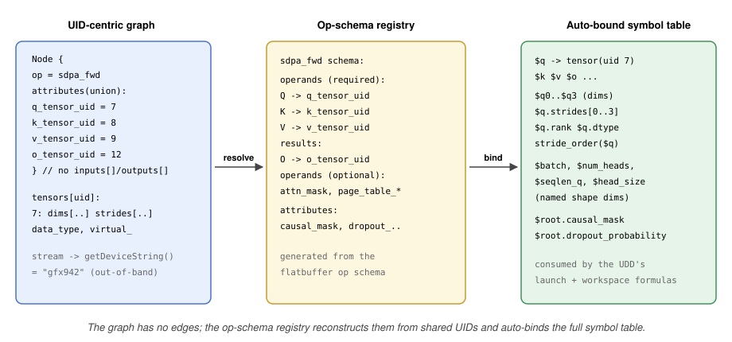

# RFC 0018: The Graph Matcher: the UED's Pattern and the UMD's Criteria

- Contributors: Brian Harrison

> Follow-up to [RFC 0017 (Universal Kernel Descriptors)](0017_UniversalKernelDescriptor.md),
> the "UMD + graph matcher" row of its follow-up series ([RFC 0017 §14.2](0017_UniversalKernelDescriptor.md#142-follow-up-rfcs)).
> This RFC designs the matcher and the two descriptor halves it reads: the graph pattern a UED
> carries and the criteria a UMD carries. The sibling formats (UDD, UHD, KDP) and subsystems
> (packaging, drop-in, adapters) are designed in their own follow-ups and are referenced, not
> redesigned, here; the UED's remaining fields belong to the "UED + engine registry" follow-up,
> which adopts the pattern block specified here. The RFC number is provisional and is reconciled
> against the concurrent follow-up series at PR-open time.

## Table of Contents

1. [Overview](#1-overview)
2. [The Matcher's Input: hipDNN's Graph Model](#2-the-matchers-input-hipdnns-graph-model)
3. [Symbol Binding: What the Engine Publishes](#3-symbol-binding-what-the-engine-publishes)
4. [Constraint Vocabulary](#4-constraint-vocabulary)
5. [The Shared Expression Language](#5-the-shared-expression-language)
6. [Layout and Stride-Order Constraints](#6-layout-and-stride-order-constraints)
7. [The Native-Matcher Escape Hatch](#7-the-native-matcher-escape-hatch)
8. [Composite Constraints](#8-composite-constraints)
9. [The Matcher: Compilation, Indexing, and Caching](#9-the-matcher-compilation-indexing-and-caching)
10. [Static Matcher (Sketch)](#10-static-matcher-sketch)
11. [Arbitration](#11-arbitration)
12. [Serialization and Versioning](#12-serialization-and-versioning)
13. [Security and Hostile Input](#13-security-and-hostile-input)
14. [Observability and Diagnostics](#14-observability-and-diagnostics)
15. [Testing and Performance](#15-testing-and-performance)
16. [Migration](#16-migration)
17. [Worked Example: SDPA Forward](#17-worked-example-sdpa-forward)
18. [Risks](#18-risks)
19. [Open Questions](#19-open-questions)
20. [References and Prior Art](#20-references-and-prior-art)
21. [Glossary](#21-glossary)
22. [Appendix A: Schema Reference](#appendix-a-schema-reference)
23. [Appendix B: Op-Schema Registry Generation](#appendix-b-op-schema-registry-generation)

---

## 1. Overview

Deciding whether a kernel applies to an incoming problem graph is two questions, and this RFC gives
each its own descriptor. **Does this engine serve graphs of this shape, and what are the pieces
called?** is the **UED (Universal Engine Descriptor)**, whose `nodes` block is a structural pattern
over the op DAG that binds every tensor and attribute it matches. **Given those pieces, can this
kernel take the problem?** is the **UMD (Universal Match Descriptor)**, one JsonLogic boolean over
the symbols the pattern bound. Together they replace a hand-coded `IPlanBuilder::isApplicable`
([RFC 0017 §2](0017_UniversalKernelDescriptor.md#2-the-descriptors)).

Matching is therefore two stages over one graph. The **engine's pattern** runs first: the UED's
`nodes` block resolves op and tensor names against the op-schema registry, walks the graph, and
publishes the bound symbol table — every operand and result tensor with its dims and strides, and
every matched node's scalar attributes. It runs **once per engine per graph**, and a graph its
pattern does not match declines the engine outright, before any pack is consulted. The **criteria**
run second: each UMD a pack lists evaluates its single boolean over that table, and a kernel applies
only when every matcher in its pack passes
([RFC 0017 §5](0017_UniversalKernelDescriptor.md#5-matching-the-ueds-pattern-and-the-umds-criteria)),
so a family of near-identical kernels shares a handful of criteria sets rather than carrying a
bespoke C++ check each.

**The split follows the shape of the calls hipDNN actually makes.** `isApplicable` arrives per
engine ([RFC 0017 §8](0017_UniversalKernelDescriptor.md#8-end-to-end-flow)). Had every matcher
carried its own pattern, an engine would re-walk one graph once per matcher of every pack naming it,
structurally matching the same nodes again and again before any of them could disagree. One pattern
per engine collapses that to a single structural pass, and the root-opcode index then keys engines
rather than matchers ([§9](#9-the-matcher-compilation-indexing-and-caching)), so an engine whose
pattern is not rooted at the graph's opcode is pruned before a single criterion is read.

**It also gives the bound-symbol set one owner.** A UED names one heuristic and one metadata schema
([RFC 0017 §2](0017_UniversalKernelDescriptor.md#2-the-descriptors)), and that heuristic's
`features_signature` reads graph tokens — `$q.dims[2]`, `$sdpa_fwd.dropout_probability`. Those symbols have to
be bound by something the engine owns, or an engine-wide model is written against names only some
pack happens to supply. The UED publishes the bound-symbol set, and it is the single source every
consumer is checked against: a UMD's criteria, its pack's UDD formulas, and the engine's own UHD
`features_signature`. A reference none of them can resolve is rejected at load rather than failing
closed later on a live graph.

This document turns that frame into a concrete format and a concrete matcher. It specifies the
pattern and criteria schemas, the standard formula that auto-binds every tensor and attribute of a
matched op, the layout representation as a stride-order index array, the native-matcher escape
hatch, deterministic arbitration, and the compile-once matcher with its indexing and caching. The
static (compile-time) matcher is sketched as options, not fully designed, in this iteration.

**The expression language itself is not specified here.** Criteria are written in the descriptor
expression language of [RFC 0018](0018_DescriptorExpressionLanguage.md), which owns its grammar,
type system, operator set, three-valued semantics, and bounded interpreter. What this document
supplies is the *environment* that language evaluates over — the graph model, the five namespaces a
pattern binds, and the hipDNN-specific fields and resolution rules that go with them
([§5](#5-the-shared-expression-language)).

### 1.1 What This RFC Specifies Versus Defers

| Capability | This RFC (day-one) | Deferred |
|---|---|---|
| The contract the matcher needs from the engine's pattern: one per UED, and what matching it publishes | Yes ([§3](#3-symbol-binding-what-the-engine-publishes)) | The `nodes` format itself: the UED follow-up |
| Auto-binding of every operand/result tensor, its dims and strides, and every op attribute | Yes ([§3](#3-symbol-binding-what-the-engine-publishes)) | None |
| Two-stage evaluation: bind once per engine per graph, then evaluate each pack's criteria over the binding | Yes ([§9](#9-the-matcher-compilation-indexing-and-caching)) | None |
| Criteria (UMD) as one JsonLogic expression: dtype (exact/set/relation), rank, dim relations, divisibility, stride order, packed, attribute, `virtual`, cross-tensor relation, optional operand, device property, `$kernel.*` pins | Yes ([§4](#4-constraint-vocabulary)) | None |
| The expression language criteria are written in: grammar, operators, type system, semantics, interpreter | None: [RFC 0018](0018_DescriptorExpressionLanguage.md) owns it, recapped in [§5](#5-the-shared-expression-language) | Operator additions ([RFC 0018 §11](0018_DescriptorExpressionLanguage.md#11-versioning-and-evolution)) |
| Layout as a stride-order index array, with named aliases | Yes ([§6](#6-layout-and-stride-order-constraints)) | None |
| Escape hatch for checks needing C++, beside the descriptor rather than inside the expression language | Yes ([§7](#7-the-native-matcher-escape-hatch)) | None |
| Composite criteria: `(A AND B) OR C` as one criteria expression, via JsonLogic `and`/`or`/`!`/`if` | Yes ([§8](#8-composite-constraints)) | None |
| Compile-once matcher, root-opcode index over engines, applicability-time match cache | Yes ([§9](#9-the-matcher-compilation-indexing-and-caching)) | None |
| Static (compile-time / AOT-lowered) matcher | Options sketched ([§10](#10-static-matcher-sketch)) | Full design |
| Several alternative patterns under one engine | None ([§3](#3-symbol-binding-what-the-engine-publishes): one pattern per UED) | [Open Question 4](#19-open-questions) |
| General N-ary commutative matching, unbounded variable-length chains | None | JIT follow-up ([RFC 0017 §9.3](0017_UniversalKernelDescriptor.md#93-future-jit-and-normalized-providers)) |

---

## 2. The Matcher's Input: hipDNN's Graph Model

The matcher reads an immutable graph through the existing `IGraph` interface
(`projects/hipdnn/flatbuffers_sdk/include/hipdnn_flatbuffers_sdk/flatbuffer_utilities/GraphWrapper.hpp`)
plus the HIP stream for device properties. Three properties of that model drive the design.

**The graph is UID-centric, not edge-centric.** A `Node` carries only `{name, compute_data_type,
attributes_type, attributes}` (`graph_generated.h`, Node table). It has no input or output tensor
lists. A node's operands and results are UID fields inside its concrete attribute table, for example
`SdpaAttributes::q_tensor_uid()`, `k_tensor_uid()`, `o_tensor_uid()` (`sdpa_attributes_generated.h`).
Connectivity between nodes is implicit: two nodes are connected when a result UID of one appears as an
operand UID of the other. To resolve a node's edges, the matcher must know the op type, cast via
`attributesAs<T>()`, and read the named UID fields.

**Consequence: the matcher needs an op-schema registry.** For each op type, the registry declares which
attribute fields are operand UIDs, which are result UIDs, whether each is required or optional, and the
names of the op's scalar attributes. This registry is what lets a UED's pattern reference operands and
results by name (`q`, `k`, `v`, `o`) and what powers the auto-binding formula of
[§3](#3-symbol-binding-what-the-engine-publishes).

**The registry is generated from schema annotations, not name conventions.** A table-level FlatBuffers
attribute names the op, and field-level attributes on each op's attribute table declare the binding
contract next to the field they govern. `umd_opcode` on the attribute table gives the op's UMD-facing
opcode (`SdpaAttributes (umd_opcode: "sdpa_fwd")`); a pattern node's `op` names it, and the registry keys
on it (falling back to the table type name when the attribute is absent), so the schema is the single
source of truth for the opcode rather than an ad-hoc string. `umd_input_tensor` / `umd_output_tensor`
mark a UID field and `umd_name` names it, so SDPA's Q operand is
`q_tensor_uid: long (umd_input_tensor, umd_name: "q")` and its O result is
`o_tensor_uid: long (umd_output_tensor, umd_name: "o")`. Optionality is not re-annotated:
a UID field's `= null` default already encodes it (`attn_mask_tensor_uid: long = null`), and the
`NodeAttributes` union already maps each opcode to its table, so every unannotated *scalar* field is a
scalar attribute by elimination (unannotated non-scalar fields — vectors, sub-tables — are not
bindable scalars and are skipped). A build step emits the binary
reflection schema (`graph.bfbs`, which transitively covers every attribute table; custom attributes
surface only through reflection, not the generated headers) and a generator reads each field's
attributes to emit the registry, so it stays in lockstep with the graph definitions rather than being
hand-maintained ([Appendix B](#appendix-b-op-schema-registry-generation) specifies the annotation contract, the field-classification rules, and the generation pipeline). Names are never inferred from the `_tensor_uid` name suffix, which would misclassify
non-UID fields such as `PointwiseAttributes::axis_tensor_uid` (a plain axis index, not a tensor UID).

**Tensors expose dims, strides, dtype, and a virtual flag, but no layout enum and no rank field.**
`TensorAttributes` (`tensor_attributes_generated.h`) offers `dims()`, `strides()` (both nullable
vectors), `data_type()`, `uid()`, and `virtual_()`. Rank is `dims()->size()`. Layout is not stored; it
is derived from the stride order, which is why layout is compared as a stride-order index array
([§6](#6-layout-and-stride-order-constraints)). Quantities like head size, batch, and head count are
**not** attributes; they are specific tensor dims (for SDPA, `q.dims[3]`, `q.dims[0]`, `q.dims[1]`).
A criterion reaches them positionally as `$q.dims[i]`, never as an attribute read
([§3](#3-symbol-binding-what-the-engine-publishes)).

**Device and arch are out-of-band.** The graph carries no device identity. Arch comes from the stream
via `getDeviceString(handle.getStream())` (`HipDeviceUtils.hpp:48`); for AOT it gates *pack selection*,
not a match criterion ([§4](#4-constraint-vocabulary)). Other device properties resolve against the
`Handle` the matcher receives alongside the graph, read as `$device.<field>` rather than a graph field.

**Graph guarantees the matcher may rely on.** Per the `IGraph` contract the graph is topologically
sorted, acyclic, fully connected, and has unique tensor UIDs. The matcher builds its own
UID-to-producer and UID-to-consumers index once per graph to walk edges and reconstruct connectivity,
since no adjacency query is provided; fusion legality reads each intermediate's `virtual` flag.



---

## 3. Symbol Binding: What the Engine Publishes

Matching does double duty: it decides applicability and it binds named variables. The binding half is
the **engine's**: a UED carries a `nodes` block, a structural pattern over the op DAG whose format
this RFC does not specify — it belongs to the UED and its follow-up
([RFC 0017 §14.2](0017_UniversalKernelDescriptor.md#142-follow-up-rfcs)), and the shape it takes
today is [RFC 0017 §5](0017_UniversalKernelDescriptor.md#5-matching-the-ueds-pattern-and-the-umds-criteria).
What matters here is what matching it produces, because that is what every criterion is written
against.

A symbol is **declared** in the UED's pattern, **bound** when the graph matches, and **used** by a
UMD's criteria, by the UDD's dispatch and workspace formulas
([RFC 0017 §6](0017_UniversalKernelDescriptor.md#6-dispatch-and-workspace)), and by the engine's UHD
`features_signature`. Every symbol any of them references must be bound by the pattern, so none of
them can read a value the match does not produce.

**The pattern is engine-wide and singular**, one per UED, so every pack naming that engine matches the
same graph shape and differs only in what it constrains. Two consequences run through the rest of
this document: the matcher binds once per engine per graph rather than once per matcher
([§8](#9-the-matcher-compilation-indexing-and-caching)), and the bound-symbol set has a single owner.
A kernel family whose graph shape differs *structurally* is therefore a different engine — most
variation does not reach that bar, and a genuinely different topology already needed its own metadata
schema and heuristic anyway, so fused and unfused counterparts are mutually exclusive by engine
rather than by node count ([§17](#18-risks)).

**The UED publishes the bound-symbol set, and it is the single source every consumer is checked
against.** A UMD listed by a pack, that pack's UDD, and the engine's own UHD are each validated
against the engine's published symbols at build and at drop-in load, and a reference that does not
resolve is rejected then rather than failing closed later on a live graph. One publisher rather than
three keeps the check mechanical: the UHD in particular is engine-wide, so before the pattern moved
onto the engine there was no engine-level binding for its feature tokens to resolve against, only
whatever matchers the packs naming that engine happened to carry.

**Auto-binding is the default, and follows a standard formula (AICK-1698).** When the pattern names an
operand or result variable, the matcher, using the op-schema registry, automatically binds it and its
fields, so authors get a complete symbol table for free and never hand-declare each field. Every field a
criteria or dispatch expression may reference falls in one of **five namespaces**, and the hipDNN schema
declares them so the interpreter fails closed on anything undeclared:

- **Tensor** — a bound operand/result and its fields: `$q` is the whole tensor (the matched
  `TensorAttributes`) and `$q.uid` its graph UID; each dim positionally as `$q.dims[i]`;
  each stride as `$q.strides[i]`; and the derived facts `$q.rank`, `$q.dtype`, `$q.stride_order`
  ([§6](#6-layout-and-stride-order-constraints)), `$q.packed`, `$q.virtual` (an internal
  intermediate between matched nodes, not a graph input or output),
  `$q.is_runtime_pass_by_value` (its value arrives per execution rather than being baked into the
  graph, [RFC 0016](0016_RuntimePassByValueTensors.md)), and the precomputed scalar `$q.value_f32`
  (below). An optional operand also carries `$q.present`, true only when the graph supplies it.
- **Graph** — structural facts and graph-level flags of the matched graph: `$graph.node_count`, which
  pins an exact match ([§3](#3-symbol-binding-what-the-engine-publishes)), and `$graph.is_override_shape_enabled`, the
  graph's own opt-in to execute-time override shapes. That flag is the graph's state and is distinct
  from the descriptor's `allow_override_shape`, which is this matcher's opt-in to accepting such a
  graph at all.
- **Attributes** — a matched node's scalar attributes, named by the node's pattern `id`: an
  `{"id": "sdpa_fwd"}` node exposes `$sdpa_fwd.dropout_probability`, a `{"id": "conv"}` node
  `$conv.dilation`. An optional attribute carries `$sdpa_fwd.<attr>.present`.
- **Kernel metadata** — `$kernel.<field>`, the values a UKD supplies for the fields its KMD declares
  (tile and vector constants, the dtype it targets, [RFC 0017 §4](0017_UniversalKernelDescriptor.md#4-descriptor-formats));
  a matcher that reads them is evaluated per kernel ([§9](#9-the-matcher-compilation-indexing-and-caching)).
  These are the one namespace the pattern does not bind: they come from the engine's KMD, and a
  `$kernel.*` field a matcher reads MUST exist in it, so the matcher publishes the set of `$kernel.*`
  fields it reads and the loader checks them against the engine that pack names.
- **Device properties** — `$device.<field>` such as `$device.lds_size` or `$device.warp_size`, for a
  check like an LDS budget. The device facts hipDNN carries today are narrower than this vocabulary
  needs, so the device-property set is extended additively as the checks that need it land.
  Architecture is **not** here for AOT: it is a pack property gated at
  selection ([§2](#2-the-matchers-input-hipdnns-graph-model)); a JIT pack may reference `$device.arch`.

**Precomputed fields.** Some tokens above are not stored on the graph: the schema layer derives them
once and publishes them as ordinary fields, so a matcher compares a value instead of re-deriving it.
`$q.packed` and `$q.stride_order` are the layout examples, standing in for `inferLayout`'s
contiguous-stride arithmetic. `$q.value_f32` is the other kind: a tensor's compile-time `value` is a
tagged union over eight differently-typed arms, and the expression language has no discriminator
syntax to unwrap one, so the schema layer coerces whichever arm is set to `f32` once and publishes it
as a single typed token — present only when the tensor carries a compile-time value at all, so a
criterion over it declines on a tensor that does not. A precomputed field is declared in the hipDNN
schema like any other field and versioned with it, so adding one is an additive schema change rather
than a per-pack extension point. Precomputed fields sit between the built-in operators and the
native-matcher escape hatch ([§7](#7-the-native-matcher-escape-hatch)): reach for one when a check
needs a derived fact, and for the hatch only when it needs real C++.

**A `$` marks a reference.** Every reference to a bound field carries a leading `$`: tensors and
their fields (`$q`, `$q.uid`, `$q.dims[2]`, `$q.rank`), a node's attributes
(`$sdpa_fwd.dropout_probability` — the node id `sdpa_fwd` is bare, the reference carries the `$`),
`$graph.node_count`, `$kernel.tile_m`,
and `$device.lds_size`. Tokens without a `$` are literals: numbers, enum values (`"BFLOAT16"`,
`"gfx942"`), opcodes, and layout aliases. This is the JsonLogic variable rule of
[§5](#5-the-shared-expression-language): a `$`-string is a variable, everything else a literal, so no
`var` wrapper is needed and the same token reads identically wherever a criteria expression names a
bound field.


---

## 4. Constraint Vocabulary

The `criteria` field is a **single JsonLogic boolean expression** evaluated over the symbol table the
engine's pattern published ([§3](#3-symbol-binding-what-the-engine-publishes), [§5](#5-the-shared-expression-language)). It is
normally an `and` of the individual tests, and reaches for `or` / `!` / `if` wherever a real
disjunction is needed ([§8](#8-composite-constraints)). The table below is not a set of criterion
*kinds* (there are none); it is the set of hand-written checks and the
JsonLogic sub-expression that expresses each. The residue — the handful of checks that need real C++
— is not an operator at all: it is a **native matcher** the pack lists beside the descriptor
([§7](#7-the-native-matcher-escape-hatch)), so the expression language itself stays closed.

| Hand-written check | JsonLogic criterion | Lowers from |
|---|---|---|
| **Opcode** | in the engine's pattern node `op` (exact, `one_of`, `any`), not a criterion ([§3](#3-symbol-binding-what-the-engine-publishes)) | node attribute-type gate |
| **Dtype (exact / set)** | `{"==": ["$q.dtype", "BFLOAT16"]}` / `{"in": ["$q.dtype", ["BFLOAT16", "FP8_E4M3"]]}` | `validateDataTypeIsSupported`, `validateFixedDataType` |
| **Dtype (relation)** | `{"==": ["$k.dtype", "$q.dtype"]}` | `validateConsistentDataTypes`, `q == k == v` |
| **Rank** | `{"==": ["$q.rank", 4]}` | `validateDimensionCount`, rank == 4 |
| **Dim (value / relation)** | `{"==": ["$q.dims[3]", 128]}`; relate with `{"==": ["$k.dims[3]", "$q.dims[3]"]}` | dim reads and cross-tensor dim relations |
| **Divisibility** | `{"divisible": [{"*": ["$y.dims[0]", "$y.dims[2]", "$y.dims[3]"]}, "$kernel.MPerBlock"]}` | tile-fit / GEMM-dim gates |
| **Layout** | `{"==": ["$q.stride_order", [0, 1, 2, 3]]}` ([§6](#6-layout-and-stride-order-constraints)) | `validateSupportedLayout` |
| **Packing** | `"$q.packed"` (a bound boolean) | `validatePackedTensors` |
| **Cross-tensor layout** | `{"==": ["$x.stride_order", "$y.stride_order"]}` (per pair) | `validateConsistentLayouts` |
| **Attribute (value)** | `{"==": ["$sdpa_fwd.causal_mask", false]}`; absent-or `{"or": [{"!": "$sdpa_fwd.dropout_probability.present"}, {"==": ["$sdpa_fwd.dropout_probability", 0.0]}]}` | per-attr value gates |
| **Attribute (one_of)** | `{"in": ["$sdpa_fwd.diagonal_alignment", ["TOP_LEFT", "BOTTOM_RIGHT"]]}` | enum-attribute set gates |
| **Optional operand present/absent** | operand `?` in the engine's pattern; `{"not_present": ["$attn_mask"]}` (absent) / `{"present": ["$bias"]}` (present); one call takes a list, so a pack declines every optional operand it cannot serve at once | `attn_mask_tensor_uid()` absent gate |
| **Graph structure (exact / fusion)** | `{"==": ["$graph.node_count", 3]}`, and each intermediate `"$conv_out.virtual"` | node-count gate, fusion legality |
| **Cross-tensor / arithmetic** | `{"==": ["$q.dims[1]", "$k.dims[2]"]}`, `{"<": ["$q.dims[3]", 129]}`, `{"==": [{"%": ["$q.dims[1]", "$k.dims[1]"]}, 0]}` | arithmetic and comparison gates |
| **Device property** | `{"<=": ["$kernel.lds_per_block", "$device.lds_size"]}` (arch is a pack property, not a criterion) | LDS/occupancy budgets; `getDeviceString` arch → pack `arch` |
| **Needs real C++** | not a criterion; a native matcher listed beside the descriptor ([§7](#7-the-native-matcher-escape-hatch)) | overflow guards, contradiction checks, derived-shape relations |

Architecture gates *applicability* at pack selection via the KDP `arch` property and the per-arch
`kpack` manifest ([RFC 0017 §5](0017_UniversalKernelDescriptor.md#5-matching-the-ueds-pattern-and-the-umds-criteria),
[§11](0017_UniversalKernelDescriptor.md#12-packaging-and-delivery)), not as a match-time criterion for
AOT; other device properties (`$device.lds_size`, `$device.warp_size`) are read directly in criteria.

**Exactness runs to the kernel, not just the graph.** `$graph.node_count` and the engine's pattern
pin the shape of the *graph*, but say nothing about whether a given candidate kernel can serve it. A
prebuilt kernel bakes quantities into its binary — a dtype, a head size, sometimes a sequence length —
and a graph that clears a pack's graph-level gates may still disagree with what one kernel baked.
**Every quantity a kernel bakes MUST therefore be a KMD field, and the pack's matcher MUST pin it
against the graph with a `$kernel.*` criterion.** Those are the clauses re-evaluated per candidate
([§9](#9-the-matcher-compilation-indexing-and-caching)), which is what turns one matcher plus a
kernel vector into a per-kernel applicability test. It is also why, although a KDP may list no
matchers at all and rest on the engine's pattern alone, a prebuilt pack in practice always lists one.

Getting this wrong fails silently rather than loudly: a matcher gating dtype only as
`{"in": ["$q.dtype", ["FLOAT16", "BFLOAT16"]]}` accepts an fp16 graph and may hand it to a bf16
binary, which returns wrong numbers instead of an error. A field missing from the KMD also cannot be
pinned, so two kernels differing only in an unmodelled baked constant collide on the catalog key. The
check is mechanical, so the loader performs it: a UKD whose source declares a baked constant with no
corresponding KMD field is a load error. That check is a KDP/KMD-loader responsibility and is
specified by [RFC 0017 §5](0017_UniversalKernelDescriptor.md#5-matching-the-ueds-pattern-and-the-umds-criteria); the UMD's part
is to publish the `$kernel.*` fields it reads ([§3](#3-symbol-binding-what-the-engine-publishes))
so the loader can perform it.

**The engine's pattern is the topology.** An earlier draft required every pack to nominate one
"umbrella" matcher checking the complete graph shape, because several per-matcher patterns could each
verify a disjoint fragment while nothing confirmed the whole. One pattern per engine forecloses that:
the topology is checked once, structurally, before any criterion runs, and a matcher can only
constrain what the pattern already bound. The rule and its pack-level loader check are gone, and with
them the class of loose match they existed to prevent.

---

## 5. The Shared Expression Language

A UMD's `criteria` field is a single `Bool`-rooted expression in the **descriptor expression
language**. That language is specified by [RFC 0018](0018_DescriptorExpressionLanguage.md) and not
restated here: syntax in [RFC 0018 §3](0018_DescriptorExpressionLanguage.md#3-syntax), the operator
set in [RFC 0018 §6](0018_DescriptorExpressionLanguage.md#6-operators), and the bounded interpreter
in [RFC 0018 §9](0018_DescriptorExpressionLanguage.md#9-the-interpreter-safety-and-bounds). What
this document supplies is the binding environment those expressions evaluate over
([§3](#3-symbol-binding-what-the-engine-publishes)).

**The `$`-variable rule.** Any JSON string beginning with `$` is a reference into the bound symbol
table of [§3](#3-symbol-binding-what-the-engine-publishes); every other JSON scalar is a literal.

**Criteria are boolean-rooted; the UDD's dispatch formulas are value-rooted.** Both are the same
language over the same symbol table — a criterion decides applicability, a formula yields a grid,
block, or workspace number
([RFC 0017 §6](0017_UniversalKernelDescriptor.md#6-dispatch-and-workspace)) — so one parser,
validator, and interpreter serve both subsystems.

**The operator set is closed.** A descriptor cannot introduce an operation, so a check that needs
real C++ is a native matcher listed beside the descriptor, never a nested extension point
([§7](#7-the-native-matcher-escape-hatch)).

```jsonc
// criteria (boolean): sub-expressions of the single top-level criteria expression
{"==": ["$q.rank", 4]}                                      // rank pin
{"==": ["$q.dims[3]", 128]}                                 // head dimension (last axis)
{"==": ["$k.dims[3]", "$q.dims[3]"]}                        // cross-tensor dim relation
{"in": ["$q.dtype", ["BFLOAT16", "FP8_E4M3"]]}              // dtype set
{"==": ["$q.stride_order", [0, 1, 2, 3]]}, "$q.packed"      // layout + packed
{"or": [{"not_present": ["$attn_mask"]},
        {"==": ["$attn_mask.dtype", "$q.dtype"]}]}          // composition (§8)
```

---

## 6. Layout and Stride-Order Constraints

hipDNN tensors store no layout enum; layout is implied by stride order
([§2](#2-the-matchers-input-hipdnns-graph-model)). The UMD represents layout the way
[RFC 0017 §5](0017_UniversalKernelDescriptor.md#5-matching-the-ueds-pattern-and-the-umds-criteria) writes it: an **ordered list
of logical dimension indices, outermost (largest-stride) first**. Entry `i` names the logical
dimension stored at physical position `i`, so the array reads as the layout it describes:
`[0, 2, 3, 1]` over an `(n, c, h, w)` logical dim order spells N, H, W, C.

```jsonc
{"==": ["$q.stride_order", [0, 1, 2, 3]]}   // descending-stride packed (BHSD, rank-4)
{"==": ["$x.stride_order", [0, 2, 3, 1]]}   // NHWC over an NCHW logical dim order
```

- The array is a permutation of `0..rank-1`. Entry `i` is the logical dimension at physical position
  `i`, counting from the slowest-varying, so `[0,1,2,3]` is descending-stride packed and `[0,2,3,1]`
  places the channel dim last, hence fastest-varying (NHWC). The `axis` used everywhere else (dims,
  strides, `args_signature`) indexes the logical dimension order, independent of this physical
  layout, consistent with RFC 0017 §6.
- **This is not the encoding `extractStrideOrder` returns.** That helper
  (`data_sdk/include/hipdnn_data_sdk/utilities/ShapeUtilities.hpp:146`, called from
  `ApplicabilityChecks.cpp:22`) produces the inverse: a per-dimension stride *rank*, entry `d`
  giving the rank of logical dimension `d`, higher meaning slower-varying. The two forms are exact
  inverses carrying identical information — `[0,2,3,1]` and `[3,0,2,1]` are the same NHWC layout —
  so the binding layer converts once when it publishes `$q.stride_order`, and descriptors are
  authored in the RFC 0017 form throughout. Nothing in the graph model changes; only the spelling a
  matcher author writes.
- **Named aliases** are provided for the common cases and expand to the array literal at compile time,
  so `{"==": ["$x.stride_order", "nhwc"]}` compiles to a comparison against `[0, 2, 3, 1]`
  (A.5). The array remains the single canonical form. The four convolution aliases are exactly the
  layouts `validateSupportedLayout` accepts today — NCHW/NHWC at rank 4, NCDHW/NDHWC at rank 5
  (`ApplicabilityChecks.cpp:76`); `bhsd` is an addition for the attention families, which that
  oracle never covered.
- **Cross-tensor consistency** is a JsonLogic equality between stride orders,
  `{"==": ["$x.stride_order", "$y.stride_order"]}` (one per pair, joined by the top-level `and`),
  lowering `validateConsistentLayouts`; layout-agnostic tensors (rank-1 scalars, pass-by-value) are
  skipped as they are today. Equality is convention-independent, so a cross-tensor check reads the
  same under either form.
- **Packing** is the separate bound boolean `$q.packed` (written `"$q.packed"`), since a supported
  stride order does not imply the tensor is gap-free; it lowers `validatePackedTensors`.
- `$q.stride_order` is an ordinary bound value ([§3](#3-symbol-binding-what-the-engine-publishes)),
  so a `stride_order == [0,1,2,3]` gate is expressible directly.

---

## 7. The Native-Matcher Escape Hatch

Some checks cannot be stated with the built-in operators: they need real C++. **The expression
language has no extension point for them.** There is no custom operation, no namespaced operator key,
and no predicate registry the criteria tree resolves against; an operation key outside
[RFC 0018 §A.3](0018_DescriptorExpressionLanguage.md#a3-operator-reference) is simply unrecognized
and refused at compile time ([Appendix A.5](#a5-compile-time-validation-normative)).

Instead, such a check is a **native matcher**: an ordinary `GraphMatcherFn` registered in the
provider's `NativeRegistry` and named by a `MatchDescriptor`'s `matchSymbol`
([RFC 0017 §5](0017_UniversalKernelDescriptor.md#5-matching-the-ueds-pattern-and-the-umds-criteria)). It stays a
**pack-level** listing beside the descriptor-backed matcher, because what it expresses is a gate on
the kernel family rather than a statement about the graph shape the engine serves. The ingestor
conjoins their verdicts: a pack's graph-scoped matchers all run and all must pass, so "this UMD's
criteria **and** this C++ predicate" is expressed by listing two matcher ids, not by nesting one
inside the other.

```jsonc
// pack.matcherIds: [ <the UMD above>, <"hipdnn.sdpa.strides_fit_u32">, ... ]
```

**Why the hatch sits beside the expression language rather than inside it.** An escape hatch that
nests inside `criteria` has to be resolved by the compiler, which means the criteria language grows a
registry, a signature table, and a per-argument type contract — a second extension mechanism running
parallel to the one RFC 0017 already defines, differing only in grain. One hatch, at the matcher
level, keeps the expression language closed: every operator in
[RFC 0018 §A.3](0018_DescriptorExpressionLanguage.md#a3-operator-reference) is
total, statically typed against the op-schema registry, and means the same thing in every provider
that ships a UMD. A descriptor is then fully interpretable from the schema alone, which is what makes
the drop-in path and the static-matcher lowering of [§10](#10-static-matcher-sketch) tractable.

**What this costs, and the follow-up it implies.** A nested custom operation would have received
*bound variables* (`["$q", "$k", "$v", "$o"]`); a `GraphMatcherFn` receives `MatchContext` — the raw
graph and a device id — and must locate those tensors itself, repeating a structural search the
engine already performed, in hand-written code that can drift from the registry-driven binding. Nor
can the existing plumbing hand them over: `BoundTokens` is `string -> int64_t`, which carries a dim
but not a tensor. What the two-stage split changes is that the binding a native matcher wants now
exists before any pack's checks run, published by the engine and shared by every pack naming it
([§3](#3-symbol-binding-what-the-engine-publishes)), rather than being some sibling matcher's private
product. Handing it over is therefore a change to the invocation signature alone, not a question of
whether a binding is available to hand ([Open Question 1](#19-open-questions)).

The grounded cases that take this path:

- **Integer-overflow guards.** `wouldFwdByteStridesFitUint32` / `byteStrideFitsU32`
  (`SdpaFwdPlanBuilder.cpp:294`, `SdpaPlanUtils.hpp:159`): the kernarg struct stores byte strides as
  `uint32`, so the check must be exact and fail closed.
- **Derived-quantity relations.** NumPy-broadcast affine-shape compatibility
  (`BatchnormApplicabilityChecks.cpp:169`), layernorm normalized-dim reconciliation
  (`LayernormApplicabilityChecks.cpp:68`), and RMSnorm `inv_rms` derived shape
  (`RMSnormApplicabilityChecks.cpp:106`) each compute a shape and compare it, beyond the constraint
  vocabulary.
- **Contradiction checks.** `getMaskType` throws when mask attributes contradict
  (`SdpaFwdPlanBuilder.cpp:276`); a matcher encodes "the mask attributes are self-consistent".

**GQA divisibility is not one of them.** `nhead_q % nhead_k == 0 && nhead_k != 0`
(`SdpaBwdPlanBuilder.cpp:548`) is expressible with `%` ([§5](#5-the-shared-expression-language)),
and with no hatch inside the language there is no longer a "centralize the zero-guard as a
predicate" alternative to weigh: it stays declarative, and the unknown-propagation rule of
[RFC 0018 §7](0018_DescriptorExpressionLanguage.md#7-unknown-values-and-three-valued-logic)
supplies the fail-closed behavior.

**Kernel-table lookups are a migration artifact, not a lasting matcher.** The
`getKernelNameKey` / CSV-registry lookups (`SdpaFwdPlanBuilder.cpp:287`, three in
`SdpaBwdPlanBuilder.cpp:660`) exist because today the builder resolves which prebuilt code object serves
a shape. Under the UKD model the KDP names the code object directly and the heuristic ranks candidates,
so these lookups mostly dissolve into ordinary constraints plus the Launch's kernel source. Where a
residual "is there a row for this exact combination" gate remains during coexistence, it is a native
matcher.

**The registry a provider ships is part of its published contract**, unchanged from
[RFC 0017 §5](0017_UniversalKernelDescriptor.md#5-matching-the-ueds-pattern-and-the-umds-criteria): a pack naming a `matchSymbol`
the running provider does not ship fails to resolve, and fails closed. What changes is that this is
the *only* place a name resolves to C++, so the drop-in story is simple — **a UMD file is pure data
and always loads identically; a pack that needs C++ is not a drop-in.**

Together with the UDD's custom-plan hatch
([RFC 0017 §6](0017_UniversalKernelDescriptor.md#6-dispatch-and-workspace)), these form the graded
ladder: fully declarative constraints, then a native matcher beside the descriptor for one gate that
needs C++, then a full provider.

---

## 8. Composite Constraints

Composition is native to the language, so `(A AND B) OR C` is stated directly in the one `criteria`
tree with no extra mechanism
([RFC 0018 §6](0018_DescriptorExpressionLanguage.md#6-operators)):

```jsonc
"criteria":
  {"or": [
    {"and": [{"==": ["$q.dims[3]", 64]},          // head dimension (last axis)
             {"==": ["$q.dims[1]", "$k.dims[1]"]}]},  // (A AND B): equal head counts, so not GQA
    {"==": ["$q.dims[3]", 128]}                   // OR C
  ]}
```

A UMD whose tests all conjoin simply makes the top-level expression an `and`, the common case.
General N-ary commutative matching and unbounded chains remain deferred to the JIT follow-up, as in
RFC 0017 §5.

---

## 9. The Matcher: Compilation, Indexing, and Caching

Both halves are authored as text and **compiled once** into in-memory structures, on demand: nothing
is parsed until a graph needs it, and the parsed result is cached and reused
([RFC 0017 §3](0017_UniversalKernelDescriptor.md#3-how-it-works)). Compiling a UED's pattern resolves
op-schema names into typed accessors and lays out the symbol table it will publish. Compiling a UMD's
criteria expands layout aliases and parses the expression to an AST. Neither compiled form is
complete on its own: a UMD is **validated against the engine of each pack that lists it**, checking
that every `$`-reference resolves in that engine's published symbols and every `$kernel.*` exists in
its KMD ([Appendix A.5](#a5-compile-time-validation-normative)). That pair-validation is cached on
`(matcher, engine)`, so a matcher shared by several packs on one engine is checked once. The compiled
forms, not the text, are what run against live graphs.

**Root-opcode indexing, over engines.** The compiled patterns are indexed by their root node's
opcode, so match cost does not grow linearly with the number of descriptors: a graph whose root op is
`sdpa_fwd` only consults engines whose pattern is rooted at `sdpa_fwd`. This is the index RFC 0017
§16 calls for, and moving the pattern onto the engine makes it coarser and therefore cheaper — a
miss now prunes an engine and every pack naming it in one step, without loading a single UMD. Only
the surviving engines pay for criteria at all.

**Stage one: bind, once per engine per graph.** The engine's pattern walks the graph against the
per-graph UID-to-producer and UID-to-consumers index ([§2](#2-the-matchers-input-hipdnns-graph-model)),
and publishes the bound symbol table
([§3](#3-symbol-binding-what-the-engine-publishes)). A graph the pattern does not match declines the
engine outright: `isApplicable` returns false with no pack consulted, no UMD loaded, and no criteria
evaluated. Because the pattern is the engine's, this cost is paid once no matter how many packs name
that engine, which is the structural saving the split buys.

**Stage two: constrain, per pack and per kernel.** A KDP lists a set of matcher IDs and a kernel
applies only when all pass
([RFC 0017 §5](0017_UniversalKernelDescriptor.md#5-matching-the-ueds-pattern-and-the-umds-criteria)),
so matchers are the unit of sharing and of evaluation within an engine. A matcher reading only bound
graph fields (Tensor / Graph / Attributes / Device, [§3](#3-symbol-binding-what-the-engine-publishes))
runs **once per graph**; on failure it prunes every pack that lists it, so the most-shared checks
(dtype, layout, rank) evaluated first shrink the candidate set fast. A matcher that also reads
`$kernel.*` is the **same** matcher re-evaluated **once per distinct value of the `$kernel.*` fields
it reads**, memoized on those, pruning per kernel rather than per pack. The projection is what makes
this pay: a kernel's full metadata tuple is unique by construction, so memoizing on the whole tuple
would save nothing, while a matcher reading one field
collapses an engine's catalog to that field's handful of distinct values. The compiler already
computes which `$kernel.*` fields a matcher reads ([§3](#3-symbol-binding-what-the-engine-publishes)),
so the memoization key costs nothing extra. Results are cached across queries.

**Short-circuit evaluation.** The matcher relies on the language's written-order short-circuit
([RFC 0018 §8](0018_DescriptorExpressionLanguage.md#8-evaluation-semantics)), so a non-match is
rejected as early as the author's structure allows; the compiler may additionally hoist a cheap,
highly selective sub-expression (a scalar attribute or dtype read) ahead of an expensive one (a wide
cross-tensor relation), which changes when a decision is reached and never what it is.

**Matching runs during applicability, and the provider owns the cache.** The order and the cache are
specified by [RFC 0017 §8](0017_UniversalKernelDescriptor.md#8-end-to-end-flow), which this RFC
follows rather than restates: both stages happen inside `IEngine::isApplicable`, and their two
products — the **catalog** (the kernels whose full matcher set passed) and the **bound token state**
(every `$`-prefixed value the pattern and the criteria resolved) — are cached together on the
provider's shared container, keyed on the engine, graph, and device that describe the problem, plus
the descriptor-inventory generation. The key already carries the engine, which is what makes a
per-engine binding the natural thing to cache under it. Later phases read that cache instead of
re-matching, so the
`isApplicable` / `getMaxWorkspaceSize` / `buildPlan` sequence that re-runs the loop today
(`AsmSdpaEngine.cpp:66,87`) matches a graph once. The compiled pattern and criteria are built once and
shared across every graph; only the binding result is per-problem.

**Accepting is a promise.** Because the catalog is settled during applicability, a non-empty catalog
commits the engine to producing a launchable kernel: a later failure surfaces as a failed plan build,
not a fallback to another engine. This is RFC 0017 §8.6's base-path invariant, and it is what makes
match semantics load-bearing — a pattern or criteria set that accepts a graph its kernel cannot serve
turns a decline into a user-visible error rather than a retry. It is the reason every quantity a
kernel bakes must be pinned by a `$kernel.*` criterion ([§4](#4-constraint-vocabulary)).

**Device properties are constant per stream.** A `$device.<field>` sub-expression (for example
`$device.lds_size`) is evaluated once per graph, since device properties do not vary across a stream.
Architecture is not a match-time criterion at all for AOT: it is a pack property gated at selection
([RFC 0017 §5](0017_UniversalKernelDescriptor.md#5-matching-the-ueds-pattern-and-the-umds-criteria)).


---

## 10. Static Matcher (Sketch)

AICK-1698 asks whether a matcher can be pre-compiled into a static form that further cuts the runtime
cost, while still supporting runtime (drop-in) matchers. This iteration does not commit to a design; it
records the options and the constraint they must satisfy.

**The parity constraint.** However a static matcher is produced, it must be behaviorally identical to
the runtime matcher on the same descriptors and graph — over **both** stages, the engine's pattern and
the criteria evaluated against its binding, since a lowering that agreed on criteria while binding
differently would be wrong in exactly the way that is hardest to see. For the criteria half this is
the language's lowering-parity requirement
([RFC 0018 §10](0018_DescriptorExpressionLanguage.md#10-compilation-and-lowering)); the pattern half
is this document's, and neither lowers without the other. Build-time and drop-in descriptors run
through one
generic engine ([RFC 0017 §3](0017_UniversalKernelDescriptor.md#3-how-it-works)), so a kernel that is
AOT-packed today and dropped in tomorrow must match the same graphs either way. Parity is testable as a
cross-path equivalence check ([§15](#15-testing-and-performance)).

The candidate lowerings for the criteria half — interpreted compiled IR as the baseline and parity
oracle, a serializable bytecode that gives drop-in the same artifact AOT gets, and generated C++ for
build-time descriptors only — are enumerated in
[RFC 0018 §10](0018_DescriptorExpressionLanguage.md#10-compilation-and-lowering) and are not
re-argued here. The one option that is the matcher's own, layered over any of them, is a **shared
decision tree**: combine many patterns rooted at the same opcode into one discrimination net, and
likewise the criteria of packs on one engine, which changes throughput rather than per-descriptor
semantics.

Recommendation for a later iteration: make the interpreted compiled IR the contract and the parity
oracle, add the bytecode form as the shared AOT/drop-in fast path, and treat generated C++ and the
shared decision tree as opportunistic optimizations gated behind the parity test. The concrete choice
is deferred.

---

## 11. Arbitration

Today the first applicable plan builder wins, which is a documented latent bug when more than one
matches (`HipMlopsEngine.cpp:34`). Descriptor-driven matching makes overlap explicit and resolves it
deterministically, reusing the rule from RFC 0017 §5:

1. When several UKDs match a graph, the engine's **heuristic** (the UHD) ranks them and the
   top-scored kernel wins.
2. Ties break by explicit **`priority`** on the UKD.
3. Remaining ties break by the descriptor's stable **`id`**, compared as raw bytes, and the conflict
   is logged to the warning log so an unintended overlap is visible. That byte order carries no
   meaning; it is chosen for being stable across runs, load orders, and machines, not because a lower
   id is better.

Arbitration is a property of the generic engine over the set of matching UKDs; a UMD shared by several
UKDs contributes each of them as a candidate. This closes the mutual-exclusion-by-construction
requirement that the current engines depend on: overlap is allowed and resolved, not a correctness
hazard. Overlap *between* engines — two engines whose patterns both accept one graph — is not
arbitrated here at all: that is ordinary engine selection, which hipDNN owns and the caller controls
([RFC 0017 §2](0017_UniversalKernelDescriptor.md#2-the-descriptors)).

---

## 12. Serialization and Versioning

- **Authoring form.** Human-readable, diffable JSONC (the examples here): the JsonLogic criteria
  expression of [§5](#5-the-shared-expression-language) with the `$`-variable convention.
- **Compiled form.** The compact binary the matcher runs ([§9](#9-the-matcher-compilation-indexing-and-caching)),
  whose concrete bytes are defined with the KDP/packaging follow-up
  ([RFC 0017 §14.2](0017_UniversalKernelDescriptor.md#142-follow-up-rfcs)); the schema those bytes
  encode is specified in [Appendix A](#appendix-a-schema-reference).
- **Schema and version.** Every UMD carries `schema: "hipdnn.umd/v1"`, a stable `id` (a UUID), and a
  mandatory `name` for diagnostics; the pattern travels with the UED and is versioned with it. A
  descriptor whose schema version is newer than the runtime understands is
  refused with a clear error, never silently reinterpreted, matching
  [RFC 0017 §4](0017_UniversalKernelDescriptor.md#4-descriptor-formats).
- **`version` is a ceiling.** The format version of the descriptor itself: a differing `major`, or a
  `minor` newer than the runtime's, is
  refused, because the descriptor carries features that runtime cannot understand. An older minor
  within the same major always loads — a file stamped `1.0` loads on a `1.1` runtime — so an author
  stamps the lowest version their descriptor needs and it stays loadable on the oldest runtime that
  can serve it. This is RFC 0017 §4's rule for every format, applied here.
- **`sdk_version` is a floor the graph sets, and both halves carry one.** It names the hipDNN graph
  schema a descriptor was authored against. A graph reports the schema version its own contents
  require, and a descriptor declaring less is declined before it runs rather than reading the fields
  it knows while silently ignoring one that changes what the graph means. Both halves need it because
  both are exposed to a graph-schema change, in different ways. The **UED's** covers graph
  *structure* — the opcodes and operand names its pattern resolves — and below the floor the whole
  engine declines, before binding, taking every pack naming it. The **UMD's** covers the *criteria*,
  and it is the sharper of the two: auto-binding is registry-driven
  ([Appendix B](#appendix-b-op-schema-registry-generation)), so a newly added attribute is bound
  whether or not the pattern was touched, and what actually goes stale is a criteria set that never
  gates it. Below the floor that matcher is skipped, declining its packs while other packs on the
  same engine carry on. Both bounds hold at once — an `sdk_version` newer than the runtime's own
  schema is still refused at compile
  ([RFC 0017 §4](0017_UniversalKernelDescriptor.md#4-descriptor-formats)). Both compare numerically
  by `(major, minor)`; both default to `1.0` when omitted, which is what every descriptor authored
  against this revision means.
- **The graph's floor is an existing mechanism, not a new one.** hipDNN already computes the minimum
  engine-plugin API version a graph requires from the optional features it uses and stamps it into
  the serialized graph (`min_required_engine_api_version`); override shapes
  ([RFC 0008](0008_OverridableTensorShapesDesign.md)) raise it to `1.1` and runtime pass-by-value
  tensors ([RFC 0016](0016_RuntimePassByValueTensors.md)) to `1.2`. The matcher reads that field
  rather than deriving a second floor of its own. A graph carrying no stamp reads as the `1.0`
  baseline.
- **Additive evolution.** New layout aliases and new bound fields are additive
  within `v1` where they do not change the meaning of an existing descriptor; anything that would
  reinterpret existing fields bumps the version. The expression language versions on its own axis
  ([RFC 0018 §11](0018_DescriptorExpressionLanguage.md#11-versioning-and-evolution)).
- **Identity.** A UMD `id` is a **UUID**: globally unique with no central allocator, so descriptors
  authored independently — including third-party drop-in files — do not collide by construction.
  References are typed by field (a KDP's `matchers` versus `engine`), so a matcher id and an engine id
  are never confused. A duplicate `id` seen on the drop-in path is logged and ignored rather than
  taking down the provider ([RFC 0017 §16](0017_UniversalKernelDescriptor.md#16-risks)).
- **A UMD is versioned alone but validated in context.** Its `version` and `sdk_version` are its own,
  but the check that its `$`-references resolve is against the engine of each pack that lists it
  ([§9](#9-the-matcher-compilation-indexing-and-caching)), so a UED pattern edit that drops or
  renames a bound variable invalidates every matcher written against it. That is a load-time error
  naming both descriptors, not a silent behavior change ([§18](#18-risks)).

---

## 13. Security and Hostile Input

On the drop-in path the loader, the matcher, and the expression interpreter parse input that may be
untrusted or simply malformed, so they must be bounded and fail closed rather than crash
([RFC 0017 §16](0017_UniversalKernelDescriptor.md#16-risks)).

- **Bounded parsing.** Descriptor size, pattern node count, and pattern edge count are capped;
  exceeding a cap quarantines the descriptor, it does not abort the provider. The caps split with the
  descriptors: node and edge counts bound a UED, descriptor size bounds either.
- **A bounded, fail-closed interpreter.** Expression depth and step count, checked arithmetic, and
  declining on an unknown symbol, an unrecognized operator key, an out-of-range axis, or a type error
  are the language's contract
  ([RFC 0018 §9](0018_DescriptorExpressionLanguage.md#9-the-interpreter-safety-and-bounds)), which
  the loader relies on rather than restating. Overflow is the same class of bug the
  `strides_fit_u32` native matcher guards ([§7](#7-the-native-matcher-escape-hatch)).
- **Quarantine, not cascade.** A bad descriptor is quarantined on load with a diagnostic; the rest load
  ([RFC 0017 §12](0017_UniversalKernelDescriptor.md#12-packaging-and-delivery)).
- **Fuzzing.** A seed corpus of patterns, criteria, and graphs plus a fuzzer over the loader and
  matcher run under the existing ASAN build ([§15](#15-testing-and-performance)), backing the
  fail-closed requirement.

---

## 14. Observability and Diagnostics

Because matching is data-driven, it is inspectable. The provider surfaces:

- **A why-not trace, in two stages.** Matching declines in one of two places and the trace says
  which. An engine whose **pattern** did not match reports the node or edge that failed to resolve,
  and that one line explains why every pack on that engine is absent from the answer. A **criterion**
  that evaluated false reports the sub-expression and the concrete values compared, naming the
  matcher and the pack, so an author sees exactly which test declined and which kernels it took with
  it. Conflating the two would be the common confusion in a two-stage matcher: an author whose
  criteria are never reached needs to be told the engine never claimed the graph. The
  per-sub-expression content of that second trace is the language's evaluation-trace contract
  ([RFC 0018 §12](0018_DescriptorExpressionLanguage.md#12-diagnostics-and-evaluation-traces)),
  rendered on the matcher's diagnostic surface.
- **A binding view.** For a successful pattern match, the full bound symbol table (tensors, dims,
  strides, attributes) as the criteria and the UDD will see it — the bound token state of
  [RFC 0017 §8](0017_UniversalKernelDescriptor.md#8-end-to-end-flow). It is the engine's, so one view
  serves every pack naming that engine.
- **An arbitration trace.** Which UKDs matched, how the heuristic scored them, and where a tie fell to
  `priority` or stable `id` ([§11](#11-arbitration)).
- **Load diagnostics.** Which patterns and criteria compiled, which were quarantined and why, which
  `(matcher, engine)` pairs failed symbol resolution and on which reference, and unresolved native
  predicates by name.

These reuse the diagnostic surface
[RFC 0017 §10](0017_UniversalKernelDescriptor.md#10-observability-and-diagnostics) defines rather than
adding a UMD-specific one. Authoring and validation tooling around the format is a separate,
first-class deliverable specified in
[RFC 0017 §11](0017_UniversalKernelDescriptor.md#11-tooling), where agentic authoring — agent-driven
skills that build and check descriptors from intent — is a committed first step. These descriptors are
a good fit for it: the schema of [Appendix A](#appendix-a-schema-reference) and the compile-time
checks of A.5 are exactly what such a tool validates against.

A matcher is also affected by the runtime opt-outs RFC 0017 §10 defines
(`HIPDNN_DISABLE_ENGINES`, `HIPDNN_DISABLE_KDPS`, `HIPDNN_DISABLE_UKDS`). Disabling a kernel carries a
risk specific to shared matchers: a matcher written around the kernel set it was meant to cover may no
longer be correct once one of those kernels is excluded, leaving the engine over-claiming
applicability for cases it no longer serves. The option is provided with that risk stated.

---

## 15. Testing and Performance

The split introduces no new testing strategy; it slots into hipDNN's existing tiers (`docs/Testing.md`,
`docs/testing/TestingStrategy.md`) as RFC 0017 §14.1 requires. A descriptor-backed kernel runs through
the
generic engine as an ordinary engine and produces the same graphs everything else consumes, so the
plugin-agnostic integration harness ([RFC 0006](0006_PluginAgnosticIntegrationTests.md)) validates it
against the CPU reference ([RFC 0001](0001_CpuGraphExecutorDesign.md)) with the golden-reference
tolerance chain ([RFC 0011](0011_GoldenReferenceValidation.md)).

Matcher-specific coverage:

- **Match-equivalence against hand-written `isApplicable`.** For each converted engine, a test drives a
  battery of graphs (accepting and rejecting) through both the hand-written builder and the
  pattern-plus-criteria pair and
  asserts identical accept/reject decisions and identical bound values. The SDPA-forward builder
  ([§17](#17-worked-example-sdpa-forward)) is the first target.
- **Symbol-resolution rejection.** A UMD referencing a symbol a given UED does not publish is rejected
  at pair-validation, naming the reference and both descriptors, and a UED pattern edit that removes a
  bound variable is caught the same way
  ([§9](#9-the-matcher-compilation-indexing-and-caching)). This is the check the split exists to make
  possible, so it is tested directly rather than only through the descriptors that happen to be valid.
- **Static/runtime parity.** The parity oracle of [§10](#10-static-matcher-sketch): the same UMD and
  graph must decide identically on the interpreted and any lowered matcher.
- **Expression-language conformance.** The shared suite of
  [RFC 0018 §13](0018_DescriptorExpressionLanguage.md#13-conformance-and-testing), which this
  subsystem runs as a consumer of the language rather than re-specifying.
- **Fuzzing.** The corpus and fuzzer of [§13](#13-security-and-hostile-input).
- **Match overhead.** Plan-time match cost is measured against the hand-written baseline as
  benchmarking matures (`tools/dnn-benchmarking`, [RFC 0013](0013_Autotune.md)); the compiled matcher,
  root-opcode index, and applicability-time cache ([§9](#9-the-matcher-compilation-indexing-and-caching))
  keep it minimal, and the cost is paid once per graph and device.

---

## 16. Migration

Migration follows RFC 0017 §14: no engine is converted until a descriptor-backed kernel runs end to
end, and a
hand-written engine and its descriptor-backed replacement coexist until the generic one reaches parity
on the graphs that engine covers, at which point the hand-written code is retired.

The **SDPA-forward** `isApplicable` (`SdpaFwdPlanBuilder.cpp:167`) is the first conversion, because it
exercises nearly the whole vocabulary (opcode, attribute gates, optional-operand absence, rank, dtype
relations, and cross-tensor dim relations) in one node, with its two non-declarative gates in the
paired native matcher. It splits cleanly: the single `sdpa_fwd` node and its operands are the engine's
pattern, and every gate is criteria. Its match-equivalence
test ([§15](#15-testing-and-performance)) gates the cutover. The mlops builders follow, reusing the
`IValidator` primitives (`dnn-providers/hip-kernel-provider/src/engines/hip_mlops_engine/plans/ApplicabilityChecks.cpp`) as the reference for their criteria
lowering. The kernel-table lookups dissolve into the KDP as described in
[§7](#7-the-native-matcher-escape-hatch).

---

## 17. Worked Example: SDPA Forward

The SDPA-forward check collapses into one UED pattern, one UMD, and one native matcher. Compared to
the hand-written
builder (`SdpaFwdPlanBuilder.cpp:167-296`), the node-shape gates become the engine's pattern, each
remaining C++ gate becomes a criteria sub-expression, and only the two
genuinely non-declarative gates (uint32 stride fit, mask self-consistency) stay in C++ — as a native
matcher the pack lists beside the criteria, not as criteria themselves
([§7](#7-the-native-matcher-escape-hatch)). Note the head dimension is a dim of `$q`, read
positionally, not an attribute ([§2](#2-the-matchers-input-hipdnns-graph-model)).

This example is grounded on the asm-SDPA builder because that builder is this RFC's first migration
target ([§16](#16-migration)), so the mapping table below doubles as the cutover checklist. It is
deliberately a different example from
[RFC 0017 §13](0017_UniversalKernelDescriptor.md#13-worked-example-sdpa-as-a-ukd), which works the
`attention_dense` kernel family end to end across all six descriptor kinds; that one shows the pair in
the context of a full UKD, this one shows one hand-written `isApplicable` becoming one pattern plus
one criteria set.

The engine's pattern is a single `sdpa_fwd` node binding `$q`, `$k`, `$v` and the result `$o`, plus
the optional operands this kernel intends to decline — `attn_mask`, `page_table_k`, `page_table_v`,
each with a `?` suffix, since an operand the pattern never binds cannot be asked about at all. The
pack's matcher then constrains what that pattern bound:

```jsonc
{
  "schema": "hipdnn.umd/v1",
  "id":   "9c3f5b2a-7d41-4e88-b6a0-1f2e3d4c5b6a",
  "name": "SDPA forward (d128, bf16/fp8) criteria",
  "criteria": {"and": [
    {"in": ["$q.dtype", ["BFLOAT16", "FP8_E4M3"]]},                // supported dtype set
    {"==": ["$k.dtype", "$q.dtype"]}, {"==": ["$v.dtype", "$q.dtype"]},  // q == k == v
    {"==": ["$q.rank", 4]}, {"==": ["$k.rank", 4]},                // (batch, heads, sequence, head dim)
    {"==": ["$v.rank", 4]}, {"==": ["$o.rank", 4]},
    {"==": ["$k.dims[3]", "$q.dims[3]"]},                          // same head dim across q/k/v
    {"==": ["$v.dims[3]", "$q.dims[3]"]},
    {"==": ["$v.dims[1]", "$k.dims[1]"]},                          // same KV head count on k and v
    {"==": ["$q.dims[3]", 128]},                                   // head dim (last axis) is 128
    {"or": [{"!": "$sdpa_fwd.dropout_probability.present"}, {"==": ["$sdpa_fwd.dropout_probability", 0.0]}]},
    {"==": ["$sdpa_fwd.alibi_mask", false]},
    {"==": ["$sdpa_fwd.padding_mask", false]},
    {"or": [{"!": "$sdpa_fwd.generate_stats.present"}, {"==": ["$sdpa_fwd.generate_stats", false]}]},
    // unsupported optional operands declined together; `not_present` always evaluates,
    // unlike a field read on an absent operand
    {"not_present": ["$attn_mask", "$page_table_k", "$page_table_v"]}
  ]}
  // arch is a pack property (KDP.arch), not a match criterion
  // uint32 stride fit and mask self-consistency are a native matcher the pack lists
  // alongside this descriptor (§7), conjoined with these criteria by the ingestor
}
```

Mapping to the hand-written code:

| Hand-written (`SdpaFwdPlanBuilder.cpp`) | Where it lands |
|---|---|
| `getDeviceString` gfx942/gfx950 (:186) | pack `arch` property (KDP), gated at selection |
| `nodeWrappers().size() != 1` (:199) | UMD `{"==": ["$graph.node_count", 1]}` |
| `attributesType() != SdpaAttributes` (:200) | UED pattern node `op: sdpa_fwd` |
| dropout / alibi / padding / stats gates (:205-224) | UMD `$sdpa_fwd.*` criteria |
| `attn_mask` / `page_table_*` absent (:209-215) | UED `?` operands + one UMD `{"not_present": [...]}` over all three |
| rank == 4 (:231-247) | UMD `{"==": ["$q.rank", 4]}`, one per bound tensor |
| `q == k == v` dtype (:244) | UMD `{"==": ["$k.dtype", "$q.dtype"]}` |
| `k.dims[1] == v.dims[1]` head count (:251) | UMD `{"==": ["$v.dims[1]", "$k.dims[1]"]}` |
| head dim == 128 | UMD `{"==": ["$q.dims[3]", 128]}` |
| `getMaskType` throw-on-contradiction (:276) | native matcher ([§7](#7-the-native-matcher-escape-hatch)) |
| `wouldFwdByteStridesFitUint32` (:294) | native matcher ([§7](#7-the-native-matcher-escape-hatch)) |
| `getKernelNameKey` table lookup (:287) | dissolves into the KDP's Launch ([§7](#7-the-native-matcher-escape-hatch)) |

The split is visible in the two columns: everything about *which graph* is the engine's, everything
about *whether this kernel takes it* is the pack's. The bound symbols the engine publishes
(`$q`..`$o` and every auto-bound dim, stride, and attribute) are what the criteria above read and
what the paired UDD's grid
and argument formulas reference ([RFC 0017 §6](0017_UniversalKernelDescriptor.md#6-dispatch-and-workspace)).

---

## 18. Risks

- **Op-schema registry coupling.** Auto-binding depends on a registry generated from the flatbuffer op
  schema ([§2](#2-the-matchers-input-hipdnns-graph-model)). If it drifts from the graph definitions,
  bindings are wrong. Mitigation: generate it from the schema's own `umd_opcode` table attribute and
  `umd_input_tensor` / `umd_output_tensor` / `umd_name` field annotations (never from field-name conventions), so a
  new or renamed operand carries
  its binding contract in the same edit ([§2](#2-the-matchers-input-hipdnns-graph-model)), and fail
  closed on an unknown op or name rather than binding a wrong field.
- **Expression language sharing.** The expression language is shared with the UDD
  ([§5](#5-the-shared-expression-language)), so a change made for one subsystem can affect the
  other. That risk and its mitigation are
  [RFC 0018 §14](0018_DescriptorExpressionLanguage.md#14-risks)'s.
- **Native-matcher symbols as contract.** A pack's `matchSymbol` names C++ the provider must ship
  ([§7](#7-the-native-matcher-escape-hatch)); a drop-in pack naming an unshipped symbol fails to
  resolve. Mitigation: version and document the shipped symbol set, fail closed with a clear
  diagnostic, and keep pure-UMD packs free of symbols so they remain true drop-ins.
- **Match overhead.** Per-candidate evaluation of the criteria expression is unbounded by the
  root-opcode index ([§9](#9-the-matcher-compilation-indexing-and-caching)). Mitigation: short-circuit
  evaluation, applicability-time caching, and the overhead test of [§15](#15-testing-and-performance).
- **Static-matcher parity.** A lowered matcher that diverges from the interpreter is a silent
  correctness bug ([§10](#10-static-matcher-sketch)). Mitigation: the interpreter is the oracle and the
  parity test gates any lowering.
- **Matcher reuse is narrower than pack-scoped sharing suggests.** A UMD's criteria read symbols a
  particular engine's pattern published, so a matcher over tensor and attribute names is reusable
  across packs whose engine publishes a compatible set — in practice, packs on the same engine
  ([§9](#9-the-matcher-compilation-indexing-and-caching)). Only criteria confined to
  `$kernel.*`, `$device.*`, and `$graph.*` are reusable anywhere. Mitigation: none is needed for
  correctness, since pair-validation rejects a mismatch loudly at load, but authors should expect
  matcher libraries to be organized per engine rather than globally, and the `conv.tile_fit` shape —
  a pure `$kernel.*` tile gate — is the pattern to reach for when portability matters.
- **A UED pattern edit invalidates the matchers written against it.** Because the pattern owns the
  symbol table, dropping or renaming a bound variable breaks every UMD, UDD, and the
  UHD that read it. Mitigation: the break is a load-time error naming both descriptors and the
  unresolved reference ([§15](#15-testing-and-performance)), never a silent behavior change; a
  pattern is engine-wide and versioned like any descriptor, so a breaking edit is a coordinated
  change in the sense of [RFC 0017 §16](0017_UniversalKernelDescriptor.md#16-risks).
- **Engine granularity is now forced by graph shape.** One pattern per UED
  ([§3](#3-symbol-binding-what-the-engine-publishes)) means a family serving two structurally different topologies must
  split into two engines, each with its own KMD and UHD, even where the kernels are otherwise
  siblings. Mitigation: `one_of` opcodes and `?` operands absorb most variation
  without a split, and a genuinely different topology already implied a different metadata schema and
  heuristic. The residual cost is more engines in the id space, which
  [RFC 0017 §4](0017_UniversalKernelDescriptor.md#4-descriptor-formats) sizes for hundreds to low
  thousands.

---

## 19. Open Questions

1. **Native-matcher bindings.** A native matcher gets `MatchContext`, not the binding the engine
   already published ([§7](#7-the-native-matcher-escape-hatch)), so it re-locates tensors by hand.
   The binding now exists engine-side before any pack's checks run, so this is a question of the
   invocation signature rather than of availability: extend the matcher-invocation contract to pass
   it, or accept the duplication?
2. **Static-matcher form.** Which of the [§10](#10-static-matcher-sketch) options becomes the AOT fast
   path, and does it also serve drop-in via a serialized bytecode?
3. **Feature-vector overlap.** Largely settled by the split: the UED's pattern is engine-wide and
   publishes the tensor, dim, and attribute symbols a UHD's `features_signature` reads, so an
   engine's binding is the natural canonical feature source
   ([RFC 0017 §17 Q4](0017_UniversalKernelDescriptor.md#17-open-questions)). What remains is whether
   a *portable* extractor across engines is still wanted for model reuse, or whether per-engine
   feature spaces are the right granularity.
4. **Alternative patterns under one engine.** A UED carries exactly one `nodes` block
   ([§3](#3-symbol-binding-what-the-engine-publishes)), so a family spanning two topologies splits into two engines. A
   `patterns[]` list matched in order would avoid the split, but needs an answer for which arm's
   binding is published, whether the published set is the union or the intersection, and what a
   criterion referencing a symbol only one arm binds means. Is the split acceptable, or is that
   design worth doing?

---

## 20. References and Prior Art

The design borrows established ideas; none is a dependency. These informed the matcher specifically.

| System | Idea borrowed |
|---|---|
| **MLIR PDL / PDLL** | Two-layer design: a declarative pattern compiled once to a fast matcher; constraints inline on the binding; a named native-predicate escape hatch; pattern priority for arbitration |
| **TVM Relax DFPattern** | Constraint vocabulary (op, dtype, symbolic shape, wildcard); dataflow use-def constraints; cross-tensor same-shape relations |
| **XLA pattern matcher** | Exact-vs-compatible equality; a tensor virtual/internal flag gating fusion; layout as a distinct constraint; optional operands; capture-by-reference binding |
| **PyTorch Inductor / torch.library** | Node/edge pattern vocabulary; serialized precompiled patterns; duplicate-pattern detection |
| **LLVM ISel / discrimination nets** | Sharing common prefixes of many patterns rooted at one opcode into one decision structure ([§10](#10-static-matcher-sketch)) |
| **ONNX Runtime** | First-claim arbitration as the anti-pattern this RFC replaces with deterministic ranking; single-node versus fused-subgraph capability |

---

## 21. Glossary

- **UMD (Universal Match Descriptor) / matcher:** one criteria expression that decides whether a
  kernel applies, evaluated over the symbols its engine's pattern bound. A KDP lists a set of matcher
  IDs; a kernel applies only when all pass. Reused across packs whose engine publishes the symbols it
  reads ([§4](#4-constraint-vocabulary)).
- **UED (Universal Engine Descriptor) / the engine's pattern:** the engine, which besides naming its
  one heuristic and one metadata schema carries the `nodes` block: the graph shape it serves and the
  binding that shape produces. One pattern per engine ([§3](#3-symbol-binding-what-the-engine-publishes)).
- **Structural pattern:** the op nodes and the named operand/result edges of a UED's `nodes`; edges are
  implicit through shared pattern variables ([§3](#3-symbol-binding-what-the-engine-publishes)).
- **Two-stage matching:** the pattern binds once per engine per graph, then each pack's criteria
  evaluate over that binding ([§9](#9-the-matcher-compilation-indexing-and-caching)).
- **Criteria expression:** the single JsonLogic `{"op": [args]}` boolean a UMD evaluates over the
  engine's bound symbol table, typically an `and` of the individual tests ([§4](#4-constraint-vocabulary)).
- **Symbol lifecycle:** a name is declared in the engine's pattern, bound when the graph matches, and
  used by a UMD's criteria, the UDD's formulas, and the UHD's features
  ([§3](#3-symbol-binding-what-the-engine-publishes)).
- **Published symbol set:** what a UED's pattern binds and every consumer is validated against; a
  reference that does not resolve is a load error, not a runtime decline
  ([§3](#3-symbol-binding-what-the-engine-publishes)).
- **Auto-binding formula:** the standard scheme that binds every operand/result tensor, its dims and
  strides, and every op attribute of a matched node, without hand-declaration
  ([§3](#3-symbol-binding-what-the-engine-publishes)).
- **Op-schema registry:** the generated table mapping each op type to its operand/result UID fields and
  attributes, letting the matcher reconstruct edges and auto-bind
  ([§2](#2-the-matchers-input-hipdnns-graph-model)).
- **JsonLogic:** the descriptor expression language, specified in
  [RFC 0018](0018_DescriptorExpressionLanguage.md); a UMD's criteria are its boolean-rooted form over
  the five namespaces of [§3](#3-symbol-binding-what-the-engine-publishes), a UDD's dispatch formulas
  its value-rooted form over the same table ([§5](#5-the-shared-expression-language)).
- **Stride-order layout:** layout represented as an ordered list of logical dimension indices,
  outermost first, since tensors carry no layout enum ([§6](#6-layout-and-stride-order-constraints)).
- **Native matcher:** the escape hatch; a `GraphMatcherFn` named by a `MatchDescriptor`'s
  `matchSymbol` and conjoined with a UMD's criteria by the ingestor, for logic the built-in operators
  cannot state. It lives beside the expression language, never inside it
  ([§7](#7-the-native-matcher-escape-hatch)).
- **Composite criteria:** any boolean combination of tests within the one `criteria` expression
  ([§8](#8-composite-constraints)).
- **Arbitration:** the deterministic resolution when several UKDs match: heuristic (UHD) score, then
  `priority`, then stable `id` compared as raw bytes ([§11](#11-arbitration)).
- **Catalog / bound token state:** the two products of matching a graph — the kernels whose full
  matcher set passed, and every `$`-prefixed value the matchers resolved. Both are cached by the
  provider during applicability and read by every later phase
  ([RFC 0017 §8](0017_UniversalKernelDescriptor.md#8-end-to-end-flow)).
- **Root-opcode index:** the index of compiled patterns by root opcode that keeps match cost sublinear
  in descriptor count; a miss prunes an engine and every pack naming it
  ([§9](#9-the-matcher-compilation-indexing-and-caching)).

---

## Appendix A: Schema Reference

This appendix is the normative schema for `hipdnn.umd/v1`. The engine's `nodes` block, which the
matcher also reads, is specified with the UED and not here ([§3](#3-symbol-binding-what-the-engine-publishes)).
Where the prose sections above describe a construct by example, the grammar and tables here fix its exact form. A descriptor that violates a
**MUST** here is refused at compile ([§9](#9-the-matcher-compilation-indexing-and-caching)); it never
matches by default ([§13](#13-security-and-hostile-input)). Grammar is EBNF; quoted terminals are JSON
tokens. The expression language's own normative reference — grammar, operator table, type rules, and
static validation — is
[RFC 0018 Appendix A](0018_DescriptorExpressionLanguage.md#appendix-a-normative-reference); this
appendix fixes the descriptor object and the hipDNN environment its criteria are evaluated over.

### A.1 The UMD descriptor object

| Field | Type | Required | Default | Rule |
|---|---|---|---|---|
| `schema` | string | yes | — | MUST equal `"hipdnn.umd/v1"`; a newer version is refused, never reinterpreted ([§12](#12-serialization-and-versioning)) |
| `id` | string (UUID) | yes | — | A UUID; stable, globally unique identity ([§12](#12-serialization-and-versioning)) |
| `name` | string | yes | — | Diagnostics only; not semantic |
| `version` | string | no | `"1.0"` | Matcher format version, `<major>.<minor>`, gated at load as a **ceiling**: a differing `major`, or a `minor` newer than the runtime's, is refused; an older minor always loads ([§12](#12-serialization-and-versioning)) |
| `sdk_version` | string | no | `"1.0"` | The hipDNN graph schema version these criteria were authored against, `<major>.<minor>`. Refused at load when newer than the runtime's own schema, and declined at match time against the **floor the graph sets** — a matcher below what the graph requires is skipped instead of asked, declining its packs ([§12](#12-serialization-and-versioning)) |
| `allow_override_shape` | bool | no | `false` | When `false`, override-shape graphs are declined ([§3](#3-symbol-binding-what-the-engine-publishes)) |
| `criteria` | Expr | yes | — | A single expression whose static type is `Bool` ([RFC 0018 §A.4](0018_DescriptorExpressionLanguage.md#a4-type-rules)) |

No other top-level keys are permitted; an unknown key is refused. In particular a UMD carries no
`nodes`: the pattern is the engine's ([§3](#3-symbol-binding-what-the-engine-publishes)). Both version fields compare
numerically by `(major, minor)`, so `1.10` is above `1.9`; a value that does not parse as exactly two
decimal components is refused.

A UMD names no engine. It is bound to one by the KDPs that list it
([RFC 0017 §4](0017_UniversalKernelDescriptor.md#4-descriptor-formats)), and its `$`-references are
resolved per `(matcher, engine)` pair rather than in isolation (A.5).

### A.2 Variable references and the five namespaces

A `$`-reference is spelled and resolved as
[RFC 0018 §A.2](0018_DescriptorExpressionLanguage.md#a2-variable-references) specifies. What follows
is the environment it resolves against: the roots the matcher binds and the fields each carries.

```ebnf
var-ref      = "$" , ( tensor-ref | graph-ref | attr-ref | kernel-ref | device-ref ) ;
tensor-ref   = tvar , [ "." , tensor-field ] ;
tvar         = ident ;                          (* a pattern variable bound to a Tensor *)
tensor-field = "uid" | "rank" | "dtype" | "stride_order" | "packed" | "virtual" | "present"
             | "is_runtime_pass_by_value" | "value_f32"
             | "dims"    , "[" , uint , "]"
             | "strides" , "[" , uint , "]" ;
graph-ref    = "graph" , "." , ( "node_count" | "is_override_shape_enabled" ) ;
attr-ref     = node-id , "." , attr-name , [ "." , "present" ] ;
kernel-ref   = "kernel" , "." , ident ;
device-ref   = "device" , "." , ident ;
uint         = digit , { digit } ;
```

| Namespace | Root | Fields | Type |
|---|---|---|---|
| Tensor | a pattern variable (`$q`) | `uid`, `rank`, `dtype`, `stride_order`, `packed`, `virtual`, `present`, `is_runtime_pass_by_value`, `value_f32`, `dims[i]`, `strides[i]` | `Tensor` / `Int` / `Dtype` / `IntArray` / `Bool` / `Float` |
| Graph | `$graph` | `node_count`, `is_override_shape_enabled` | `Int` / `Bool` |
| Attributes | a node `id` (`$sdpa_fwd`) | `<attr-name>`, `<attr-name>.present` | scalar / `Bool` |
| Kernel | `$kernel` | `<field>` a UKD supplies ([RFC 0017 §4](0017_UniversalKernelDescriptor.md#4-descriptor-formats)) | scalar |
| Device | `$device` | `<field>` (`lds_size`, `warp_size`, …) | scalar |

Rules:
- `graph`, `kernel`, and `device` are **reserved** namespace roots: a `tvar` and a node `id` MUST NOT
  use them.
- `present` is bound only for an optional operand/attribute; reading it on a required one is refused.
- A field access on an **absent** optional operand or attribute (e.g. `$attn_mask.dtype` when
  `attn_mask` is absent) resolves to **unknown**, and the language's unknown rules take it from there
  ([RFC 0018 §7](0018_DescriptorExpressionLanguage.md#7-unknown-values-and-three-valued-logic)): the
  criterion containing it can no longer be satisfied, so the match declines (fail closed,
  [§13](#13-security-and-hostile-input)). This is what RFC 0017 §5 means by a check on an absent
  operand that "neither passes nor fails, it simply does not run", and it is what lets the
  "absent, or present and constrained" pair of [§4](#4-constraint-vocabulary) accept a graph without
  the operand.
- An out-of-range `dims[i]`/`strides[i]`, or any reference that does not resolve against the table
  above, declines the match. `value_f32` resolves only when the tensor carries a compile-time value,
  so it declines on one that does not.

### A.3 The expression language

The criteria expression grammar, the operator table with arities and types, and the type rules are
[RFC 0018 Appendix A](0018_DescriptorExpressionLanguage.md#appendix-a-normative-reference): grammar
in [A.1](0018_DescriptorExpressionLanguage.md#a1-grammar), operators in
[A.3](0018_DescriptorExpressionLanguage.md#a3-operator-reference), and type rules in
[A.4](0018_DescriptorExpressionLanguage.md#a4-type-rules).

The operator set is closed
([RFC 0018 §A.6](0018_DescriptorExpressionLanguage.md#a6-the-operator-set-is-closed)): an unlisted
operation key, including a dotted one such as `{"hipdnn.strides_fit_u32": [...]}`, is refused at
compile, and the check it expresses belongs to a native matcher listed beside this descriptor in the
pack ([§7](#7-the-native-matcher-escape-hatch)).

### A.4 `stride_order` values and layout aliases

A `stride_order` comparison accepts either an integer array or an alias string; aliases expand to the
array at compile time, and the array is the single canonical form ([§6](#6-layout-and-stride-order-constraints)).
An array MUST be a permutation of `0 .. rank-1` listing logical dimension indices outermost
(largest-stride) first, matching
[RFC 0017 §5](0017_UniversalKernelDescriptor.md#5-matching-the-ueds-pattern-and-the-umds-criteria).

| Alias | Array | | Alias | Array |
|---|---|---|---|---|
| `nchw` | `[0,1,2,3]` | | `ndhwc` | `[0,2,3,4,1]` |
| `nhwc` | `[0,2,3,1]` | | `bhsd` | `[0,1,2,3]` |
| `ncdhw` | `[0,1,2,3,4]` | | | |

Every alias is fixed-rank, so an alias compared against a tensor the criteria pin to a different rank
is refused at compile rather than declining silently at match time.

### A.5 Compile-time validation (normative)

A UMD MUST pass every check below to compile; a failure refuses (and, on the drop-in path,
quarantines) the descriptor with a diagnostic ([§9](#9-the-matcher-compilation-indexing-and-caching),
[§13](#13-security-and-hostile-input)). They fall into two groups, because a UMD's references cannot
be resolved without an engine to resolve them against
([§9](#9-the-matcher-compilation-indexing-and-caching)). The pattern's own validation belongs to
the UED ([§3](#3-symbol-binding-what-the-engine-publishes)).

**The UMD alone:**

1. `schema == "hipdnn.umd/v1"`, `id` is a well-formed UUID, only the keys of A.1 at the top level,
   and each of `version` / `sdk_version`, when present, is a well-formed `<major>.<minor>` string the
   runtime can honor: same `major`, and a `minor` no newer than the runtime's
   ([§12](#12-serialization-and-versioning)).
2. `criteria` passes the language's static validation — operator recognition, arity, argument types,
   and the `Bool` root
   ([RFC 0018 §A.5](0018_DescriptorExpressionLanguage.md#a5-static-validation)) — and every layout
   alias in it resolves (A.4).

**The UMD against the engine of each pack that lists it:**

3. Every `$`-reference in `criteria` resolves to a symbol that engine's pattern published — a
   pattern variable, a node `id`'s attribute, or a reserved `$graph.*` / `$device.*` root (A.2).
4. Every `$kernel.*` field the criteria read is declared by that engine's KMD
   ([§4](#4-constraint-vocabulary)).

Checks 3 and 4 are cached on `(matcher, engine)` and re-run when either side changes; a failure
names the unresolved reference and both descriptors ([§14](#14-observability-and-diagnostics)). The
same two checks apply to a pack's UDD formulas and to the engine's UHD `features_signature`, which is
what makes the engine's published set the single contract
([§3](#3-symbol-binding-what-the-engine-publishes)).

---

## Appendix B: Op-Schema Registry Generation

The op-schema registry ([§2](#2-the-matchers-input-hipdnns-graph-model)) is the table the matcher
consults to reconstruct a UID-centric graph's edges and to auto-bind symbols
([§3](#3-symbol-binding-what-the-engine-publishes), [Appendix A.2](#a2-variable-references-and-the-five-namespaces)).
It is **generated from FlatBuffers field annotations on the graph schema**, never hand-maintained and
never inferred from field-name conventions, so the binding contract for an operand lives in the same
`.fbs` edit that adds the operand and cannot silently drift from the graph definitions.

### B.1 Attribute declarations

Four custom attributes are declared once in the graph schema. FlatBuffers requires an `attribute`
declaration before an attribute may be used, and declared attributes — on a table or on a field — are
retained in the binary reflection schema (`.bfbs`), which is what the generator reads.

```fbs
attribute "umd_opcode";         // table: the op's UMD-facing opcode (e.g. "sdpa_fwd")
attribute "umd_input_tensor";   // field flag: this field is an input (operand) tensor UID
attribute "umd_output_tensor";  // field flag: this field is an output (result) tensor UID
attribute "umd_name";           // field string: the name the UMD binds it by (e.g. "q", "o")
```

`umd_opcode` is a **table-level** attribute (applied in parentheses after the table name); the other
three are field-level. No separate operand/result type attribute is needed: an operand or result always
binds a `Tensor` — a tensor UID is the only edge kind in a UID-centric graph
([§2](#2-the-matchers-input-hipdnns-graph-model)) — and every scalar attribute is precisely an
unannotated scalar field (B.3). The `long` UID field type and the `umd_input_tensor`/`umd_output_tensor` flag
together already fix what the binding is.

### B.2 Annotated schema

Each op's attribute table annotates its UID fields next to the field they govern. Optionality is **not**
re-annotated: a UID field's `= null` default (an optional field) already encodes it, so the generator
derives required-vs-optional from the field's presence semantics rather than a fourth attribute.

```fbs
table SdpaAttributes (umd_opcode: "sdpa_fwd") {              // table-level opcode shorthand
  q_tensor_uid:long (umd_input_tensor, umd_name: "q");          // required input
  k_tensor_uid:long (umd_input_tensor, umd_name: "k");
  v_tensor_uid:long (umd_input_tensor, umd_name: "v");
  o_tensor_uid:long (umd_output_tensor, umd_name: "o");         // required output
  attn_mask_tensor_uid:long = null (umd_input_tensor, umd_name: "attn_mask");  // optional input
  // ... other optional UID operands, likewise annotated ...
  dropout_probability:float = null;                        // unannotated -> scalar attribute
  alibi_mask:bool = false;                                 // unannotated -> scalar attribute
  causal_mask:bool = false;
}
```

### B.3 Field classification (normative)

For every table reachable from the `NodeAttributes` union (which already maps each opcode to its
attribute table), the generator reads the table's `umd_opcode` (the entry's opcode key; when absent it
falls back to the table type name) and classifies each field by these rules; a violation **fails the
build** rather than emitting a wrong registry:

| Field carries | Classified as | Requirements |
|---|---|---|
| `umd_input_tensor` + `umd_name` | input (operand) edge for that name | field type MUST be an integer UID (`long`); `umd_name` MUST be non-empty |
| `umd_output_tensor` + `umd_name` | output (result) edge for that name | field type MUST be an integer UID (`long`); `umd_name` MUST be non-empty |
| neither flag, a **scalar** field | scalar attribute, named by the field name | — |
| neither flag, a **non-scalar** field (vector, sub-table, union, string) | skipped (not a UMD scalar) | — |

- **Optionality** is derived, not annotated: a field with a `= null` default (an optional UID or an
  optional scalar) is optional; it supplies the `?`-binding of [RFC 0017 §5](0017_UniversalKernelDescriptor.md#5-matching-the-ueds-pattern-and-the-umds-criteria)
  and the `.present` field of [Appendix A.2](#a2-variable-references-and-the-five-namespaces).
- **Build errors (fail closed):** `umd_input_tensor` and `umd_output_tensor` on the same field; `umd_name` without
  either flag; `umd_input_tensor`/`umd_output_tensor` on a non-integer field; a duplicate `umd_name` within one op;
  an input/output tensor whose name collides with a reserved token
  ([Appendix A.2](#a2-variable-references-and-the-five-namespaces)); or a duplicate `umd_opcode` across
  ops.
- **Scalar attribute value kind.** A scalar attribute carries its value kind for compile-time type
  checking ([Appendix A.5](#a5-compile-time-validation-normative)): integer fields bind as `Int`,
  float/double as `Float`, `bool` as `Bool`, and an **enum-typed** field as `Dtype`, carrying the
  enum-value name string (e.g. `diagonal_alignment` → `"TOP_LEFT"`). This mirrors the tensor `dtype`
  representation and lets a criterion compare an enum attribute against a literal enum name.
- **No name-suffix inference.** `PointwiseAttributes::axis_tensor_uid` is a plain axis index, not a
  tensor UID; because it carries no `umd_input_tensor`/`umd_output_tensor` it is classified a scalar attribute,
  exactly as intended — nothing keys off the `_tensor_uid` suffix.
- **Scalar attributes need no annotation, and are still fully bound.** An annotation carries the two
  facts that cannot be inferred for an *edge*: that a `long` field is a tensor UID rather than a plain
  integer (`q_tensor_uid` and `left_bound` are the same type, distinguishable only by the flag), and a
  bind name distinct from the field name (`"q"` vs `q_tensor_uid`). A scalar needs neither: it is a
  non-edge by elimination, and its bind name *is* its field name, which reflection already reports. So
  every unannotated field is auto-bound in the Attributes namespace as `$<node_id>.<field_name>`
  ([Appendix A.2](#a2-variable-references-and-the-five-namespaces)) with its reflected type and its
  `= null`-derived optionality — `$sdpa_fwd.dropout_probability`, `$sdpa_fwd.alibi_mask`,
  `$sdpa_fwd.left_bound` bind with no annotation (B.5). The one consequence is that a scalar's bind
  name is coupled to its field name: renaming the field renames the symbol, whereas `umd_name`
  insulates an operand from a field rename. If a scalar ever needs that insulation, the additive
  extension is an optional `umd_name` on an unflagged field, used purely as a bind-name override; the
  flag remains the operand/result discriminator.

### B.4 Generation pipeline

1. `flatc` compiles the graph schema and emits the binary reflection schema `graph.bfbs`, which
   transitively covers every attribute table and carries the declared `umd_*` attributes (custom
   attributes surface through reflection, not through the generated C++ headers).
2. A build-time generator loads `graph.bfbs` through the FlatBuffers reflection API, enumerates the
   `NodeAttributes` union members (opcode → table), reads each table's `umd_opcode`, and applies the
   B.3 rules to each table's fields. Because `graph.fbs` pulls the per-op tables in via `include`, the
   `.bfbs` (and thus the registry) must regenerate when **any** included schema changes, not only when
   the top-level schema does.
3. The generator emits the op-schema registry as generated C++ the provider compiles (a header-only
   registry emitted into the schema-owning SDK, so it needs no dependency on the provider): a table
   keyed by the `umd_opcode` shorthand, each entry also carrying its attribute-table name and the
   integer `NodeAttributes` value, and listing its input and output tensors (name, optionality, and
   the typed accessor for the UID field) and its scalar attributes (name, optionality, value kind, and
   typed accessor).

Reflection is used **only at build time**; the generated registry holds typed accessors, so the runtime
match path reads UID and attribute fields via `attributesAs<T>()`
([§2](#2-the-matchers-input-hipdnns-graph-model)) with no per-match reflection cost.

### B.5 Generated registry and how the matcher uses it

The emitted entry for one opcode is, conceptually:

```jsonc
// generated; illustrative shape, not a wire format
"sdpa_fwd": {                          // key: the table's umd_opcode (fallback: table name)
  "attributes_type": "SdpaAttributes", // NodeAttributes union member; matched via Node::attributes_type()
  "operands": [
    {"name": "q", "uid": "&SdpaAttributes::q_tensor_uid",         "optional": false},
    {"name": "k", "uid": "&SdpaAttributes::k_tensor_uid",         "optional": false},
    {"name": "v", "uid": "&SdpaAttributes::v_tensor_uid",         "optional": false},
    {"name": "attn_mask", "uid": "&SdpaAttributes::attn_mask_tensor_uid", "optional": true}
  ],
  "results":  [{"name": "o", "uid": "&SdpaAttributes::o_tensor_uid", "optional": false}],
  "attributes": [
    {"name": "dropout_probability", "get": "&SdpaAttributes::dropout_probability", "optional": true},
    {"name": "alibi_mask",          "get": "&SdpaAttributes::alibi_mask",          "optional": false}
  ]
}
```

At compile ([§9](#9-the-matcher-compilation-indexing-and-caching)) the matcher resolves each pattern
name against this entry. At match time, for a node of that opcode it reads each name's UID via the typed
accessor, resolves the UID against the per-graph UID→producer/consumer index
([§2](#2-the-matchers-input-hipdnns-graph-model)) to bind the tensor, and auto-binds the tensor's fields
and the node's scalar attributes into the five namespaces
([Appendix A.2](#a2-variable-references-and-the-five-namespaces)). An optional operand absent from the
graph binds `.present = false` and is read only through a guarded reference or `value_or_default`.

### B.6 Lockstep and failure modes

- **Lockstep.** Adding or renaming an operand is one `.fbs` edit that carries its `umd_input_tensor` /
  `umd_name` with it; the next build regenerates the registry, so a UMD naming that name resolves and a
  UMD referencing a name that no longer exists fails compile
  ([Appendix A.5](#a5-compile-time-validation-normative)).
- **Unknown op or name at match compile.** The matcher fails closed: a pattern node whose opcode or
  name is absent from the registry is refused, never bound to a guessed field
  ([§19 Op-schema registry coupling](#18-risks)).
- **Generation is deterministic and diffable.** The generated registry is a build artifact; a schema
  change that alters bindings shows up as a registry diff, which is the review surface for a binding
  change.
