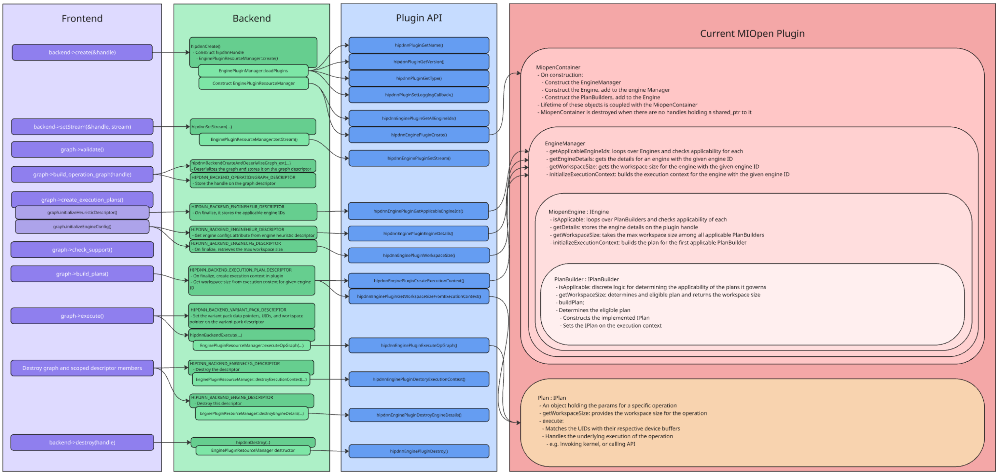

# hipDNN - Plugin SDK Design Document

- Contributors: Mitch Ousdahl, Sam Reeder, Adam Dickin
- Original Implementation: Adam Dickin
- Last Update: Dec 5, 2025

## Table of Contents
1. [Executive Summary](#executive-summary)
2. [Problem Statement](#problem-statement)
3. [Current System Overview](#current-system-overview)
4. [Proposed Design](#proposed-design)
5. [Key Design Decisions](#5-key-design-decisions)
6. [Risks](#6-risks)
6. [Execution Plan](#7-execution-plan)
7. [Testing Plan](#8-testing-plan)

## 1. Executive Summary
hipDNN represents a system for the validation and execution of complex graphs of tensor operations that can be expressed as a directed acyclic graph (DAG).  Rather that directly include engines that can capably execute those graphs directly in hipDNN code, hipDNN has implemented a plugin mechanism wherein engine authors can fulfill a simple C-compatible API with the goal of generating a dynamic plugin library.  This allows the system the capability for flexibility without recompilation, allows for future growth, and allows for a robust ecosystem of engine providers.

This proposal describes two pieces of work.

The first is to split the **Plugin SDK** from our existing **SDK**, with the eventual goal of making the original SDK a **Data SDK** that describes the data contract between the frontend and backend of hipDNN.  The **Plugin SDK** will be solely to aid authors of plugins.

**❓Open Question - Will we have a separate `engine_plugin_sdk` and `heuristic_plugin_sdk`?**

The second part of the proposal is for the design of an optional framework that will assist a hipDNN plugin developer to quickly and reliably create a engine plugin for hipDNN.  

Currently, a basic shared-library C-compatible API for plugins has been defined by PluginApi.h.  While plugin developers will be free to implement their plugins using solely this API, a set of helpful classes can provide some basic structure that will allow developers to:
- bootstrap a new engine plugin quickly
- provide mechanical guidance and guardrails
- create an comfortable object-oriented abstraction

## 2. Problem Statement
The C-compatible engine plugin API is certainly suggestive of certain concepts and patterns, such as Engines, Workspaces, Engine Configs, and Execution Contexts, it can be somewhat opaque in how those plugin entry points relate to one-another.  What is the recommended life-cycle of an engine?  Or an execution plan?  

While the proposed design isn't meant to be proscriptive, it should work either as an direct implementation aid (using the classes directly) or a documentation aid (these classes suggest how an engine plugin is used by hipDNN)

### 2.1 Object Lifetimes
For the plugin, there's a comment on std::weak_ptr<MiopenContainer> in [MiopenLegacyPlugin.cpp](../../plugins/miopen_legacy_plugin/MiopenLegacyPlugin.cppplugins/miopen_legacy_plugin/MiopenLegacyPlugin.cpp) that describes why the weak_ptr / shared_ptr for the container exists.  

To summarize, it's so that if the plugin is opened more than once, the container can be shared, but the container gets cleaned up if that last plugin ref drops off.

However, as the thread note indicates, that means that multiple threads can be accessing the container, the engine manager, the engines, and the plan builders.  Since the plans are handed back up via handles, they should exist inside the execution context of a single thread.  

Any state required should be attached to plugin handles, which should be isolated to a single thread by hipDNN convention.

### 2.2 Multi-Threading
.so files aren't reloaded by dlopen calls from different threads, so we isolate threads by putting state on the hipDNN handle, but it also means that anything in the plugin needs to effectively be stateless after it's constructed (except for plans which are handed off to the execution context).

For example, it would be bad if the plugin container or engine manager had any caching or any other mutable state.

## 3. Current System Overview
The hipDNN framework consists of a frontend (C++ Graph API), a backend (core runtime), and a plugin system. The backend manages prepares and dispatches execution to dynamically loaded plugins via a C-API interface.

### MIOpen Plugin Architecture

The MIOpen Legacy Plugin serves as the kernel provider. It employs a modular C++ architecture, largely decoupled from the API layer.

*   **Dependency Injection Container (`MiopenContainer`):**
    This is the root object that manages the lifecycle and dependencies of all other components. It initializes the `EngineManager` and ensures that all necessary services are correctly injected.

*   **Engine Manager (`EngineManager`):**
    The central registry for execution engines. It orchestrates the selection of the appropriate engine for a given operation graph by querying its registered engines.

*   **Plan Builders (`IPlanBuilder`):**
    Each engine is associated with a set of Plan Builders. These components are responsible for:
    *   **Applicability:** Inspecting an operation graph to determine if the engine can execute it.
    *   **Resource Estimation:** Calculating the required workspace size.
    *   **Plan Construction:** Creating an executable `IPlan` object if the graph is supported.

*   **Plans (`IPlan`):**
    An `IPlan` represents a strategy for executing a specific operation graph. It encapsulates all the necessary logic and state to run the routine, abstracting the details from the higher-level engine management.

*   **C-API Interface:**
    A thin translation layer that exposes these internal C++ components to the backend via the required engine plugin C-API.

### Execution Flow

When the backend requests a graph execution, the flow within the plugin is as follows:

1.  **Ingestion:** The C-API bridge receives the raw graph handle and forwards it to the `MiopenContainer`.
2.  **Selection:** The `EngineManager` iterates through registered engines to find a candidate.
3.  **Compilation:** The selected Engine's `PlanBuilder` validates the graph and constructs an `IPlan`.
4.  **Execution:** The `IPlan` executes the operation, marshaling pointers from the backend's `VariantPack` to the underlying device kernels.

This architecture effectively separates the plugin interface from the engine implementation details. However, currently, this infrastructure is largely internal to the MIOpen plugin. The goal of the Plugin SDK is to standardize and provide these as reusable components for plugin development, so developers can focus on the implementations of the underlying kernels and libraries.

## 4. Proposed Design

### 4.1 **Macro:** `DECLARE_ENGINE_PLUGIN_DEFAULT_IMPL()`

There will be a macro (or a .inl file that gets #included) that declares all the engine plugin api entry points and glues them to an [EnginePluginContainer](#42-engineplugincontainer).  It will be entirely optional and opt-in.  If an engine plugin doesn't want to use them, they're free to implement the entry points themselves.

These default entry points will do the work of marshaling data between the C interface and the C++ `EnginePluginContainer` that handles the implementation of the interface.  It'll do things like copy vectors to contiguous memory, wrap flatbuffer graphs and manage the default `EnginePluginContainer` lifecycle.

- **Arguments:** If the user wants to specify a custom class derived from `EnginePluginContainer`, they can do so, otherwise the default implementation will be used.

### 4.2 **Class:** `EnginePluginContainer`

This class encapsulates the lifecycle of an engine plugin from `hipdnnEnginePluginCreate()` to `hipdnnEnginePluginDestroy()`.  

- **Lifecycle:** The default implementation will be an instance that is shared amongst plugin invocations and attached to the plugin handle via shared_ptr.  A weak_ptr at global scope can be used to allow subsequent invocations of `hipdnnEnginePluginCreate()` to make an additional shared copy of the `EnginePluginContainer`.  When the last shared_ptr of this class is destroyed (via destruction of the plugin handle), the weak_ptr ensures that that the memory isn't hung on to.

- **Threading:** Since this class can be accessed by multiple threads, it should be stateless.

- **Methods:** The class will basically act as a C++ bridge to the plugin API.  Each api call will have a corresponding method on it in `EnginePluginContainer`.  Many of them will be passed through to an underlying `EngineManager`.

- **Members:** 
    - A private `EngineManager`

### 4.3 EngineManager
This represents the collection of all engines that can be found in the plugin.  This class is a private member of the EnginePluginContainer, and shares a lifespan with it.

- **Lifecycle:** Since this class by default is a private member of `EnginePluginContainer`, it will share the same lifecycle

- **Threading:** Since this class can be accessed by multiple threads, it should be stateless.  The container of engines should not be mutable.  Store any state in the handle.

- **Methods:** The class will implement the following
    - `static vector<int64_t> getAllEngineIds()` - Returns a list of all engines managed by this `EngineManager`
    - `static vector<int64_t> getApplicableEngineIds(handle, graph)` - Returns a list of all engines that can handle the supplied graph
    - `engine_details getEngineDetails(handle, graph, engine_id)` - Pass-through to the engine indicated by engine_id
    - `size_t getWorkspaceSize(handle, graph, engine_config)` - Pass-through to the engine indicated by engine_id
    - `execution_context initializeExecutionContext(handle, graph, engine_config)` - Pass-through to the engine indicated by engine_id
        - ❓Question: Should the engine_config be passed into the engine here?

- **Members:** 
    - A container of several `IEngine`-derived class instances.

### 4.4 EngineBase (IEngine)
This represents an engine that can handle a one or more graphs of operations.  

For example a BatchNormEngine might be able to handle single-op and simple fused graphs that contain batchnorm operations.

- **LifeCycle:** The engines typically have the same lifecycle as the `EngineManager` that contains them.  The engine_details returned by `getDetails` has explicit create / destroy entry-points in the plugin.  The execution_plan created by `initializeExecutionContext` also has explicit create / destroy entry-points in the plugin.  Default implementations of the destruction will just call `delete` on the appropriate objects.

- **Threading:** Since this class can be accessed by multiple threads, it should be stateless.  The engines should not be mutable.  Store any state in the handle.

- **Methods:** The class will implement the following
    - `bool isApplicable(handle, graph)` - Returns a list of all engines that can handle the supplied graph.  Typically it would do this by checking all its plan builders.  It's important that (for now) only a single plan builder for a given graph + engine combo be applicable until we have some sort of mechanism for plan builder selection.
    - `engine_details getDetails(handle, graph)` - Pass-through to the engine indicated by engine_id
    - `size_t getWorkspaceSize(handle, graph, engine_config)` - Pass-through to the engine indicated by the engine_id inside the engine_config.
        - ❓Question: Should the engine_config be passed into the plan builder here?
    - `execution_context initializeExecutionContext(handle, graph)` - Pass-through to the engine indicated by engine_id
        - ❓Question: Should the engine_config be passed into the plan builder here?

- **Members:** 
    - A container of several `IPlanBuilder`-derived class instances.

### 4.5 PlanBuilderBase (IPlanBuilder)
This represents a planbuilder that can handle a specific graph of operations.  

In the above example, a single PlanBuilder can handle single batchnorm forward operation, while another might be able to handle batchnorm + activation.

- **LifeCycle:** The plan builders typically have the same lifecycle as the `Engine` that contains them.

- **Threading:** Since this class can be accessed by multiple threads, it should be stateless.  The plan builders should not be mutable.  Store any state in the handle.

- **Methods:** The class will implement the following
    - `bool isApplicable(handle, graph)` - Returns true if this plan builder can handle this graph
    - `size_t getWorkspaceSize(handle, graph)` - Returns the workspace required for the supplied graph.
    - `execution_context initializeExecutionContext(handle, graph)` - Creates an instance of an `IPlan`-derived class and attaches it to the execution context.

### 4.6 PlanBase (IPlan)
This class represents a ready-to-execute plan that can take device data and then execute the desired operations on it.

- **LifeCycle:** The plans typically share a lifespan with the execution_plan they are attached to.

- **Threading:** Since this class is tied to a single execution plan, it can cope with more state.  Execution contexts should not be shared between threads.

- **Methods:** The class will implement the following
    - `size_t getWorkspaceSize(handle)` - Returns the workspace required for this plan.
    - `void execute(handle, buffers, workspace)` - Executes the plan as built by the IPlanBuilder that created it.

    
## 5. Key Design Decisions
- Opt-in glue code via macros
- A single-instanced container
- Stateless classes for thread safety

## 6. Risks

## 7. Execution Plan
- Create blank plugin_sdk
   - Changes needed in rocm-libraries to enable new components (empty new library, or w/e)
    - Wait for TheRock submodule bump
    - Update TheRock to add these
    - Update rocm-libraries to use the new TheRock CI hash to have the merged changes from step #1
    - Changes in rocm-libraries to use the new artifacts
- Migrate sdk/plugin code to plugin_sdk
    - establish hipdnn_plugin_sdk namespace
    - Modify consuming CMakeFiles.txt to add required plugin_sdk dependencies and remove unnecessary sdk transitive dependencies
    - Modify consuming code to use the utilities from the new namespaces and the new include location
- Write new plugin helpers
- Migrate existing MIOpen plugin to consume the new plugin helpers
- Migrate existing MIOpen unit tests
- Write a reference CPU plugin that consumes the new plugin helpers

## 8. Testing Plan
- Execute existing MIOpen plugin unit tests
- Execute existing MIOpen plugin integration tests
- Execute new plugin helper unit tests
- Multi-threaded testing