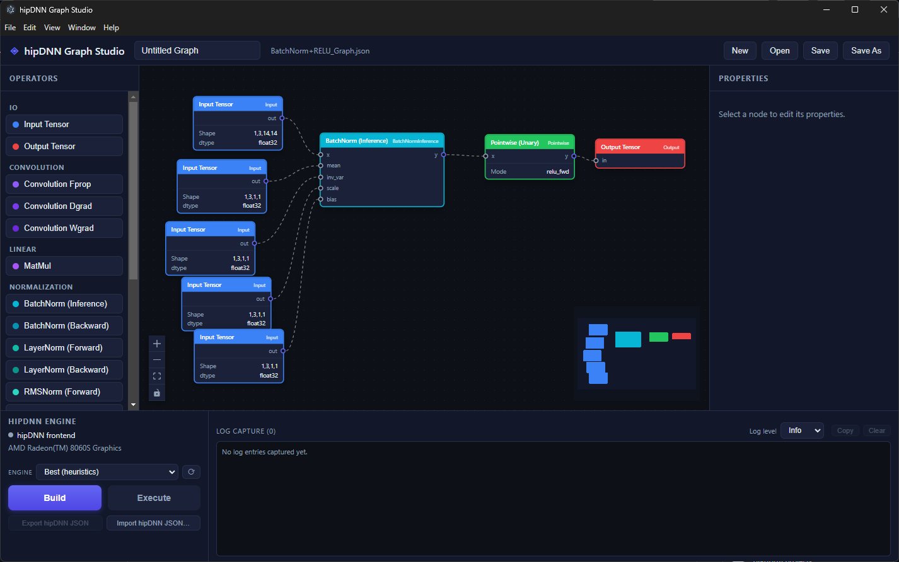

# hipDNN Graph Studio

A desktop app for drawing hipDNN computation graphs and running them on a GPU.



Drag operators onto a canvas, wire them together, fill in shapes and settings,
then press **Build** to compile the graph with hipDNN and **Execute** to run it.
Errors and engine logs come back in the panel at the bottom, so you can try a
graph out without writing any code.

## What you can do

- Build graphs from a palette of operators: convolution (forward, data and
  weight gradients), matmul, batch/layer/RMS normalization, pointwise math,
  reductions, pooling and resampling, block-scale quantize/dequantize, plus
  input and output tensors.
- Edit each node's shape, data type, and settings in the inspector.
- Let hipDNN infer output shapes, or clear **Use defaults** on an Output node to
  pin its dimensions yourself.
- Save and load graphs as JSON. Your work is also auto-saved between sessions.
- Pick which hipDNN engine to use, or let hipDNN choose the best one.
- Run the graph with randomly filled tensors and see how long it took.
- Import and export hipDNN's own JSON format, so graphs can be shared with
  other hipDNN tools.
- Open benchmark reports to compare engines, inspect correctness, and view optional profiling traces.
- Launch an agent flow against the graph you have open, from the **Implement**
  tab, and watch it run — steps, loop iterations with the condition they are
  measured against, and the files each one produced. See
  [Running agent flows](#running-agent-flows).

## Requirements

To edit graphs:

- [Bun](https://bun.sh) 1.2 or newer.

To also build and run graphs on a GPU, you additionally need:

- An AMD GPU with ROCm installed.
- An in-tree hipDNN build, or an installed hipDNN SDK (headers and libraries).
- Node.js 20+, Python 3.9+, and a C++ compiler — on Windows, Visual Studio 2022
  with the "Desktop development with C++" workload; on Linux, GCC or Clang.

Without the GPU pieces the app still runs: you can draw, save, and export
graphs, and the Build and Execute buttons stay disabled.

## Quick start

### Shared local installation

From the outer `rocm-libraries` checkout, use Python 3.12+, Bun, Node.js 20+,
and a native C++ build toolchain. On Windows, use a Visual Studio 2022 developer
terminal. Initialize only the benchmarking submodule; do not recurse into its
nested `rocm-libraries` submodule.

```bash
git submodule update --init -- projects/hipdnn/tools/dnn-benchmarking
python3 projects/hipdnn/tools/dnn-benchmarking/setup_env.py --graph-studio --gpu-arch <gfx-target> --yes
build/install/bin/start-graph-studio
build/install/bin/dnn-benchmark --graph /path/to/graph.json -o /path/to/results.json
```

Use the target for the host GPU. An explicit target permits building when device
detection is unavailable; it does not establish that the GPU can execute kernels.
On Windows, use the generated `start-graph-studio.bat` and `dnn-benchmark.bat`.

Setup preserves the outer checkout's `.venv`, provisions PyTorch and the ROCm
wheel SDK, and builds hipDNN, its Python bindings, all three providers, and Studio
in one superbuild. It installs fresh artifacts into `build/install`, not into
the dependency SDK. The benchmarking package and matching frontend wheel install
into `.venv`. The nested benchmarking checkout is not used.

Use `--source-dir`, `--build-dir`, `--install-prefix`, and `--workspace` to select
other locations. `--workspace` owns `.venv`; `--rocm-prefix` selects an existing
dependency SDK, not the application destination. Rerun setup to rebuild and
reinstall. Add `--reuse-artifacts` to reinstall an already-built superbuild
without configuring or compiling it.

The installed launchers work from any directory without Bun, Node.js, or source
files at runtime. They use the bundled Electron executable, the exact configured
Python interpreter, application libraries before SDK libraries, and the explicit
application plugin directory. Benchmark startup selects the fresh backend before
PyTorch probes can preload the SDK copy. Keep the configured `.venv` and ROCm
dependencies at their recorded paths; this is a per-host install, not a standalone
redistributable package.

An import check or a zero benchmark exit code is not proof of GPU execution.
Check report rows for actual executed engines. A host without a working ROCm
device can render Studio and produce reports with every engine skipped.
Studio's Build and Execute actions remain native; this setup does not replace
them with the benchmarking backend.

### Source development

Windows, from the project folder:

```
start.bat
```

That installs dependencies on first run and opens the app. Use `start.bat dev`
for a development window that reloads as you edit the source.

Any platform, the same thing by hand:

```
bun install
bun run electron:start     # build and open the app
bun run electron:dev       # development window with live reload
```

You can also run it as a plain web page in the browser, without the GPU parts:

```
bun run dev
```

Saving to a file works best in Chrome or Edge; other browsers fall back to a
normal download.

## Benchmarking the canvas graph

**Start Benchmarking** on the **Verify** tab runs the graph on the canvas and
loads the report it produces. The command behind the button is

```
dnn-benchmark --graph ${current_graph} --run-dir ${run_dir}
```

`${current_graph}` is replaced with the canvas graph written out as hipDNN JSON,
and `${run_dir}` with one directory for the whole run: the tool writes
`results.json`, `tensors/`, and `profiling-output/` inside it. Both live in a
per-tab directory under the OS temp directory, and each run replaces the
previous one. Keeping every artifact under the report is what lets a trace and
its captures load with it — a path the report records outside that directory
cannot be followed. `dnn-benchmark` is resolved on the PATH the launcher
establishes for child processes, which covers both an installed tree and the
`.venv` console script.

The button becomes **Stop** while the run is in flight, which kills the process
tree. A run that leaves no readable report says so and falls back to what was
there before — a stale run directory is cleared first, so it can never be
mistaken for the current one.

The controls beside the button add arguments to that command line:

| Control | Argument | Effect |
| --- | --- | --- |
| Validate against PyTorch | `--validate pytorch` | Runs the graph through PyTorch as a reference and compares the two. The report then carries a `pytorch` reference row and a pass/fail verdict per engine instead of timing alone. Needs PyTorch in the selected Python environment. |
| Capture kernel trace | `--emit-trace pftrace` | Re-runs under rocprofv3 and records a Perfetto trace, opened from a row's **Details**. Costs about one extra run. |
| CPU counters | `--perf` | Re-runs under `perf stat` for cycles, instructions and IPC, shown under a row's **Details**. Costs about one extra run. |
| Autotune kernels | `--autotune` | Benchmarks every candidate kernel instead of serving the cold heuristic's first pick. Required for a best-vs-best comparison, and much slower. |
| Iterations | `--iters N` | Timed iterations per engine. Fewer is faster and noisier. |
| Warmup | `--warmup N` | Untimed iterations first, so compilation and clocks settle before measurement. |

A blank number box leaves its flag off, so the tool's own default applies.

**Output log** at the bottom holds the tool's terminal output. It starts
collapsed and stays that way through a run; open it when a run needs explaining.

## Viewing benchmark results

The tab starts empty and stays that way until a run produces a report. To read
one you did not just run, **Open past run…** takes the folder that holds a
`results.json` — one written by `dnn-benchmark --run-dir DIR` — finds the report
inside it, and resolves every trace and tensor capture from that same folder. One
pick, nothing else to choose. A browser without the File System Access API offers
**Open report…** instead, which reads a bare JSON or a raw timing export without
its artifacts. An opened report stays in memory: it survives tab switches, a
reload discards it, and it never enters graph autosave. Viewing a report needs no
GPU, Python, native add-on, or backend service.

A suite of several graphs leads with **Best engine per graph**: the winner of
each graph under the chosen metric, as one bar each. Select one to compare the
engines inside it below.

The per-graph comparison chart comes next, then the full result table. Pick a
metric and an engine filter to compare; graph executions/s is derived from GPU
mean time. Bars are ordered best first, coloured per provider so one engine
keeps its colour across both charts, and labelled with their distance from the
winner — a percentage while it is close, a multiplier once it is not. On a
timing metric the hatched band over each bar is the measured range across
iterations, so a fast mean built on a wide spread is not read as a clean win.

**Scale** chooses the axis. *From zero* is the honest default and the one to
compare magnitudes on. *Best to worst* drops the zero and spans the measured
values instead, which is what makes a fraction of a percent visible; it is a
truncated axis, so each value is marked with a dot rather than a bar length and
both ends of the range are labelled underneath.

Rows that never ran are absent from the chart and counted beside it — charting a
row that measured nothing draws an empty bar, which reads as "infinitely slow";
the table gives each such row the reason it was skipped where its numbers would
be. A reference provider is marked as such and is not a correctness pass, and a
derived TFLOP/s built from partial analytical coverage is shown as a lower bound.
Reported suite counters stay separate from the viewer's own row counts. Use a
current browser to keep large integer engine IDs from rounding.

**Details** on a row opens one engine: identity, timing statistics,
resource metrics, correctness comparison, oracle tuning against the warm baseline,
and profiling artifacts, each in its own section. **Back to report** returns.

Native **Execute** on the Create tab publishes its snapshot to Verify the same
way a run does. Its single wall time is not a repeated benchmark or a correctness
comparison, and later canvas edits are not included. **Close execution** returns
to the opened report, as **Close benchmark run** does for a run. Use **Export
hipDNN JSON**, not ordinary Save, for the existing benchmarking handoff.

Traces and captured tensors load themselves whenever the app can resolve the
paths the report names, which is what **Open past run…** establishes. The
desktop build always can: it knows where the report came from and reads beside
it. The browser cannot read by path at all, so a folder grant is the only bridge
— **Use results folder…** appears after a report opened from a bare file. Manual
pickers stay as an override, and a report can never reach outside its own
directory: a path that escapes it is refused, and a failed read names the file
and folder instead of quietly showing an empty picker.

Trace bytes go to a sandboxed `https://ui.perfetto.dev/` iframe, not an upload
endpoint. Perfetto requires network access; report viewing does not. Confirm
**Open trace?** inside the frame if asked. The parent reports byte handoff only;
Perfetto owns parsing and trace diagnostics.

### Checking the trace viewer without a GPU

`tests/fixtures/run/results.json` and `tests/fixtures/run/traces/sample.pftrace`
exist for this. The trace is a real Perfetto protobuf trace with three slices on a
`hipdnn` thread track; `bun run tests/fixtures/run/traces/make-trace.ts` regenerates it.

1. `bun run dev`, then open the **Verify** tab.
2. **Open past run…** → `tests/fixtures/run`. The report opens and the trace
   starts loading by itself; **Tensors** on the `MIOPEN_ENGINE` row shows both
   captures already read, with the reference comparison filled in.
3. **Details** on that row, then expand **Profiling trace & artifacts**.

Perfetto then shows `conv_fwd`, `bias_add`, and `relu`. The second row in the same
report records a skipped trace, so the suppressed state is visible beside it.
To confirm the file itself outside the browser:

```bash
curl -LO https://get.perfetto.dev/trace_processor && chmod +x trace_processor
echo 'select ts, dur, name from slice' > q.sql
./trace_processor -q q.sql tests/fixtures/run/traces/sample.pftrace
```

## Inspecting captured tensors

The **Tensors** tab lists every capture the report on screen recorded — each
engine's output, the reference output when validation ran, and the graph inputs.
The first two fill the two slots on their own, so the comparison is there when
the tab opens. **Tensors** on a report row opens the same tab narrowed to that
row's captures.

Resolution and its refusals are the ones described above: a capture loads when
the host can resolve the path the report names, a path that escapes the report's
own directory is refused, and the manual pickers stay as the override — select
`manifest.json` together with its `.bin` siblings, or drop them onto a slot.

## Turning on the GPU engine

The GPU support lives in a small native add-on that links hipDNN. The easiest
way to get one is the repository superbuild, which builds hipDNN, every DNN
provider, and the Studio (including this add-on) in one go:

```
cmake --preset hipdnn-graph-studio -B build
cmake --build build
```

Everything it produces stays in the build tree, under `build/graph-studio/`:
`dist/` (web bundle), `native/` (the add-on plus its node-gyp intermediates),
and `build-config.json`, which records the include paths, libraries and plugin
directory of that build. Launch it from there with:

```
build\bin\start-graph-studio.bat        # Linux: build/bin/start-graph-studio.sh
```

Running from this directory works too — `start.bat` and `bun run build:native`
pick up `<repo>/build` automatically, so the app finds hipDNN and the provider
plugins with nothing else to set up. Point `HIPDNN_BUILD_DIR` at a different
build directory to use that one instead.

To build the add-on against an installed SDK rather than a build tree, set
`HIPDNN_SDK` instead:

Windows (PowerShell):

```
cd electron\native
bun install
cd ..\..
$env:HIPDNN_SDK = "C:\path\to\sdk"
bun run build:native
```

Linux:

```
cd electron/native && bun install && cd ../..
HIPDNN_SDK=/path/to/sdk bun run build:native
```

Without a build tree the outputs stay here instead (`dist/` and
`electron/native/build/`); set `GRAPH_STUDIO_OUT_DIR` to move them elsewhere.
Start the app with the same environment variables set, so it resolves the same
hipDNN and the same outputs at runtime. The engine panel shows which device it
found, or explains why it could not load.

If the add-on is missing or fails to load, the app keeps working with Build and
Execute switched off — rebuilding it is the only fix needed.

## Running agent flows

The **Implement** tab launches a hipDNN agent flow against the graph on the
canvas and follows it to completion. Flows live in the orchestrator
(`../orchestrator/configs/flows`) and describe what the agents do; Studio only
launches them and renders what the run reports, so a new or rewritten flow shows
up here with no change to the app.

This needs the orchestrator's MCP extra, which is deliberately not part of its
base requirements:

```bash
cd ../orchestrator
.venv/Scripts/python.exe -m pip install -r requirements-mcp.txt   # Windows
# .venv/bin/python -m pip install -r requirements-mcp.txt         # Linux
```

Studio finds the orchestrator by walking up from its own directory, so a normal
checkout needs no configuration; `HIPDNN_ORCHESTRATOR_DIR` overrides it. **If the
tab's controls are disabled it says why** — usually that the extra above is not
installed, or that the tool registry names an executable this machine lacks.

Pick a flow and its inputs are generated from what that flow declares. Any input
the flow types as a path can be filled from the canvas instead of typed, which is
how the graph you are editing reaches the run. **Iterations** lowers the flow's
own loop budget; it cannot raise it.

Start with `fast-converge`: it runs no agent, takes about two seconds, and
exercises the whole path — live timeline, artifacts, cancellation — for free. The
rest spend real agent sessions, and those sessions can edit this checkout, so
`git status` after a run is worth a look.

What a run reports is read from the run itself, never assumed. The terminal line
is the run's status and the condition its loop was measured against, verbatim —
there is no "passed". A run whose steps only invoked agents says so: nothing was
compiled or executed, so it is review evidence and not a correctness claim. A
flow that builds or tests stops saying it, on its own.

Quitting ends every run and the agent sessions they are waiting on. Runs cannot
outlive the app: the server is its child, so it goes when Studio goes. Everything
already written stays in the run directory.

## Project layout

```
src/            The editor: canvas, palette, inspector, engine panel
src/graph/      Operator catalog and the saved graph format
src/engine/     Talks to the GPU engine, with a no-op version for the browser
src/platform/   File dialogs and settings storage, per platform
src/results/    Shared benchmark reader, comparison viewer, and optional trace iframe
electron/       Desktop shell (window, file dialogs, engine bridge)
electron/native/  C++ add-on that calls hipDNN
electron/paths.cjs  Finds hipDNN and the build-output locations
electron/native/build-addon.cjs  Drives node-gyp against those locations
CMakeLists.txt  Superbuild hook (the hipdnn-graph-studio component)
```

## Commands

| Command | What it does |
| --- | --- |
| `bun run dev` | Web version with live reload |
| `bun run build` | Type-check and bundle the web assets |
| `bun run typecheck` | Type-check only |
| `bun run preview` | Serve the built editor |
| `bun test tests/results.test.ts` | Check result parsing and metric boundaries |
| `bun run electron:dev` | Desktop app with live reload |
| `bun run electron:start` | Build, then open the desktop app |
| `bun run electron:pack` | Package the desktop app for distribution |
| `bun run build:native` | Build the hipDNN add-on |

## License

MIT. See [LICENSE](LICENSE).
