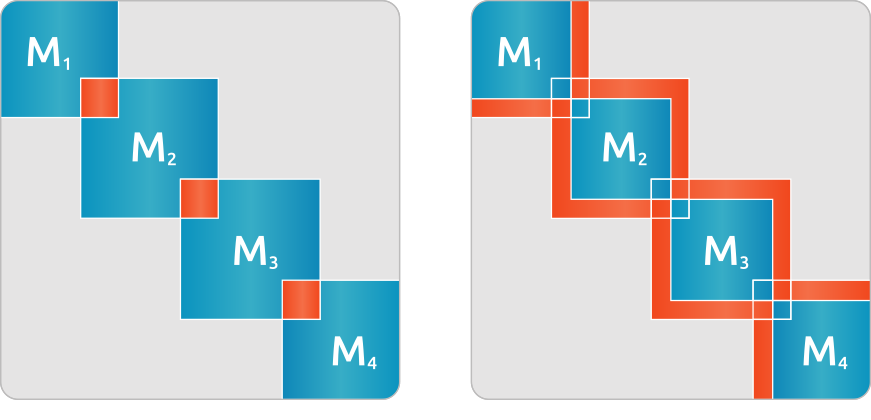
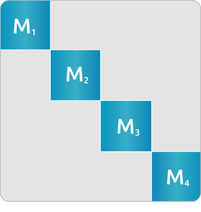

.. meta::
   :description: rocALUTION preconditioners
   :keywords: rocALUTION, ROCm, library, API, preconditioners

.. _preconditioners:

***************************
rocALUTION Preconditioners
***************************

This document provides a category-wise listing of the preconditioners. All preconditioners support local operators. They can be used as a global preconditioner via block-jacobi scheme, which works locally on each interior matrix. To provide fast application, all preconditioners require extra memory to keep the approximated operator.

Complete member documentation for each class is on the :ref:`api` page. The sections below highlight configuration routines and usage notes.

Code structure
==============

The preconditioners provide a solution to the system :math:`Mz = r`, where the solution :math:`z` is either directly computed by the approximation scheme or iteratively obtained with :math:`z = 0` initial guess.

:cpp:class:`rocalution::Preconditioner` is the base class for all preconditioners.

Jacobi method
=============

:cpp:class:`rocalution::Jacobi`

.. note::

  To adjust the damping parameter :math:`\omega`, use :cpp:func:`rocalution::FixedPoint::SetRelaxation`.

(Symmetric) Gauss-Seidel or (S)SOR method
==========================================

:cpp:class:`rocalution::GS` and :cpp:class:`rocalution::SGS`

.. note::

  To adjust the relaxation parameter :math:`\omega`, use :cpp:func:`rocalution::FixedPoint::SetRelaxation`.

Incomplete factorizations
=========================

ILU
---

:cpp:class:`rocalution::ILU`

.. doxygenfunction:: rocalution::ILU::Set

ILUT
----

:cpp:class:`rocalution::ILUT`

.. doxygenfunction:: rocalution::ILUT::Set(double)
.. doxygenfunction:: rocalution::ILUT::Set(double, int)

IC
---

:cpp:class:`rocalution::IC`

AI Chebyshev
============

:cpp:class:`rocalution::AIChebyshev`

.. doxygenfunction:: rocalution::AIChebyshev::Set

FSAI
====

:cpp:class:`rocalution::FSAI`

.. doxygenfunction:: rocalution::FSAI::Set(int)
.. doxygenfunction:: rocalution::FSAI::Set(const OperatorType&)
.. doxygenfunction:: rocalution::FSAI::SetPrecondMatrixFormat

SPAI
====

:cpp:class:`rocalution::SPAI`

.. doxygenfunction:: rocalution::SPAI::SetPrecondMatrixFormat

TNS
===

:cpp:class:`rocalution::TNS`

.. doxygenfunction:: rocalution::TNS::Set
.. doxygenfunction:: rocalution::TNS::SetPrecondMatrixFormat

MultiColored preconditioners
============================

:cpp:class:`rocalution::MultiColored`

.. doxygenfunction:: rocalution::MultiColored::SetPrecondMatrixFormat
.. doxygenfunction:: rocalution::MultiColored::SetDecomposition

MultiColored (symmetric) Gauss-Seidel / (S)SOR
----------------------------------------------

:cpp:class:`rocalution::MultiColoredGS` and :cpp:class:`rocalution::MultiColoredSGS`

.. doxygenfunction:: rocalution::MultiColoredSGS::SetRelaxation

.. note::

  To change the preconditioner matrix format, use :cpp:func:`rocalution::MultiColored::SetPrecondMatrixFormat`.

MultiColored power(q)-pattern method ILU(p,q)
---------------------------------------------

:cpp:class:`rocalution::MultiColoredILU`

.. doxygenfunction:: rocalution::MultiColoredILU::Set(int)
.. doxygenfunction:: rocalution::MultiColoredILU::Set(int, int, bool)

.. note::

  To change the preconditioner matrix format, use :cpp:func:`rocalution::MultiColored::SetPrecondMatrixFormat`.

Multi-elimination incomplete LU
===============================

:cpp:class:`rocalution::MultiElimination`

.. doxygenfunction:: rocalution::MultiElimination::GetSizeDiagBlock
.. doxygenfunction:: rocalution::MultiElimination::GetLevel
.. doxygenfunction:: rocalution::MultiElimination::Set
.. doxygenfunction:: rocalution::MultiElimination::SetPrecondMatrixFormat

Diagonal preconditioner for saddle-point problems
=================================================

:cpp:class:`rocalution::DiagJacobiSaddlePointPrecond`

.. doxygenfunction:: rocalution::DiagJacobiSaddlePointPrecond::Set

(Restricted) Additive Schwarz preconditioner
============================================

:cpp:class:`rocalution::AS` and :cpp:class:`rocalution::RAS`

.. doxygenfunction:: rocalution::AS::Set

See the overlapped area in the figure below:

.. _AS:

  Example of a 4 block-decomposed matrix - Additive Schwarz with overlapping preconditioner (left) and Restricted Additive Schwarz preconditioner (right).

Block-Jacobi (MPI) preconditioner
=================================

:cpp:class:`rocalution::BlockJacobi`

.. doxygenfunction:: rocalution::BlockJacobi::Set

See the Block-Jacobi (MPI) preconditioner in the figure below:

.. _BJ:

  Example of a 4 block-decomposed matrix - Block-Jacobi preconditioner.

Block preconditioner
====================

:cpp:class:`rocalution::BlockPreconditioner`

.. doxygenfunction:: rocalution::BlockPreconditioner::Set
.. doxygenfunction:: rocalution::BlockPreconditioner::SetDiagonalSolver
.. doxygenfunction:: rocalution::BlockPreconditioner::SetLSolver
.. doxygenfunction:: rocalution::BlockPreconditioner::SetExternalLastMatrix
.. doxygenfunction:: rocalution::BlockPreconditioner::SetPermutation

Variable preconditioner
=======================

:cpp:class:`rocalution::VariablePreconditioner`

.. doxygenfunction:: rocalution::VariablePreconditioner::SetPreconditioner
