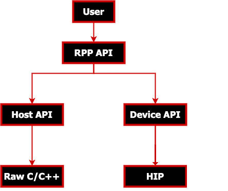

.. meta::
  :description: ROCm Performance Primitives (RPP) documentation and API reference library
  :keywords: RPP, ROCm, Performance Primitives, documentation

********************************************************************
ROCm Performance Primitives documentation
********************************************************************

ROCm Performance Primitives (RPP) is a computer vision library for AMD CPUs and GPUs that have a HIP or CPU backend.

RPP implements image, voxel, and audio augmentations used in deep learning training pipelines. The same primitives run on the HOST CPU backend and the HIP GPU backend.

The RPP project is located in `ROCm/rocm-libraries <https://github.com/ROCm/rocm-libraries/tree/develop/projects/rpp>`_.

.. grid:: 2
  :gutter: 3

  .. grid-item-card:: Install

    * :doc:`Install RPP <install/rpp-install>`
    * :doc:`Build from source <install/rpp-build>`

  .. grid-item-card:: How to

    * :doc:`Run a tensor augmentation <./how-to/rpp-run-tensor-augmentation>`
    
  .. grid-item-card:: Examples

    * `RPP examples <https://github.com/ROCm/rocm-examples/tree/amd-staging/Libraries/RPP>`_

  .. grid-item-card:: Reference

    * :doc:`RPP environment variables <./reference/rpp-env-variables>`
    * :doc:`Supported RPP functionalities and variants <./reference/rpp-supported-functionalities>`
    * :doc:`RPP functionality and variant example outputs <./reference/rpp-supported-func-and-var-examples>`

    * RPP API reference

      * :doc:`RPP header files <./doxygen/html/files>`
      * :doc:`RPP common definitions <./doxygen/html/group__group__rppdefs>`
      * :doc:`RPP data structures <./doxygen/html/annotated>`

To contribute to the documentation refer to :doc:`Contributing to ROCm  <rocm:contribute/contributing>`.

You can find licensing information on the :doc:`Licensing <rocm:about/license>` page.
