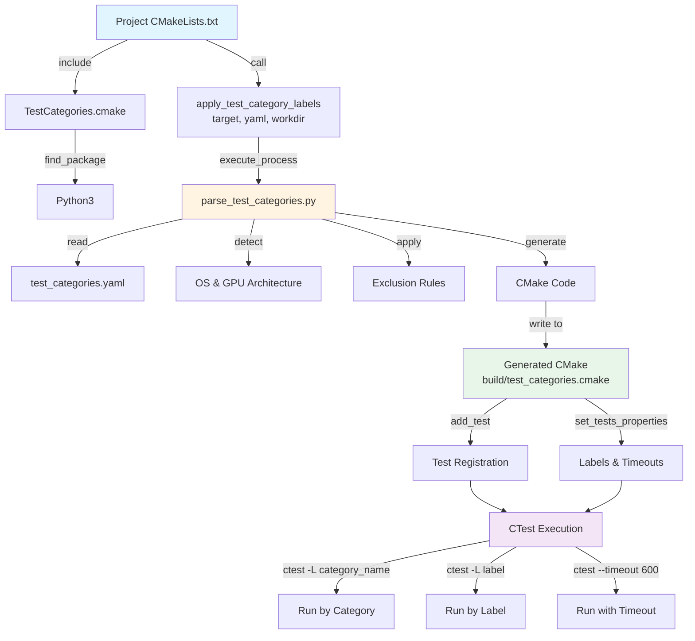

# ROCm Libraries CTest Integration Architecture

This directory contains the shared CTest integration files for organizing and executing tests across ROCm library projects using YAML-based test categorization.

## Directory Structure

```
shared/ctest/
├── README.md                      # This file - architecture documentation
├── TestCategories.cmake           # CMake module for test category integration
└── parse_test_categories.py       # Python parser for YAML to CMake conversion
```

**Files:**
- [TestCategories.cmake](./TestCategories.cmake) - CMake module with `apply_test_category_labels()` function
- [parse_test_categories.py](./parse_test_categories.py) - Python parser for YAML to CMake conversion

## Architecture Overview

The CTest integration provides a flexible, maintainable system for organizing tests into categories with support for platform-specific and GPU-specific(TODO) test exclusions.

### **Core Components**

#### 1. **test_categories.yaml** (Project-specific)
Located in each project's test directory (e.g., `projects/miopen/test/gtest/test_categories.yaml`).

Defines test organization:
- Test categories with patterns and labels
- Test exclusions
- Timeout settings per category

#### 2. **parse_test_categories.py** (Shared)
Python script that:
- Parses YAML configuration files
- Detects runtime environment (OS, GPU architecture)
- Applies exclusion rules
- Generates CMake test registration code

#### 3. **TestCategories.cmake** (Shared)
CMake module providing:
- `apply_test_category_labels()` function for projects
- Python interpreter detection
- Error handling and fallback mechanisms

## Execution Flow



## 📝 YAML Configuration Format

### **Basic Structure**

```yaml
test_categories:
  category_name:
    description: "Human-readable description"
    test_patterns: ["*pattern1*", "*pattern2*"]
    labels: ["label1", "label2"]

execution_settings:
  default_timeout: 300
  category_timeouts:
    category_name: 600

  # Global exclusions applied to all categories
  exclude: ["*always_exclude*"]
  exclude_windows: ["*linux_only*"]
  exclude_linux: ["*windows_only*"]
```

### **Exclusion Hierarchy**

The parser applies exclusions from `execution_settings` in this order:

1. **Base exclusions** (`exclude`) - Always applied to all categories
2. **OS-specific exclusions** (`exclude_windows`, `exclude_linux`) - Applied based on detected OS
3. **GPU-specific exclusions** (TODO) - Will be applied based on detected GPU architecture


## Integration Guide

##### **Step 1: Create test_categories.yaml**

Create `test_categories.yaml` in your project's test directory:

##### **Step 2: Include in CMakeLists.txt**

In your project's test CMakeLists.txt:

```cmake
# projects/myproject/clients/tests/CMakeLists.txt

# Set ROCM_LIBRARIES_ROOT to find shared modules
set(ROCM_LIBRARIES_ROOT ${CMAKE_CURRENT_SOURCE_DIR}/../../..)

# Include the shared CTest module
include(${ROCM_LIBRARIES_ROOT}/shared/ctest/TestCategories.cmake)

if(BUILD_TESTING)
    enable_testing()

    # Apply test categorization
    apply_test_category_labels(
        myproject-test                               # Test executable name
        "${CMAKE_CURRENT_SOURCE_DIR}/test_categories.yaml"  # YAML file path
        "${PROJECT_BINARY_DIR}/{WORK_DIR}"              # Working directory
    )
endif()
```

#### **Step 3: Build and Test**

```bash
# Configure with testing enabled
<cmake -DBUILD_TESTING=ON ..>
(use -DMIOPEN_TEST_DISCRETE=OFF for miopen, the POC works on the monolithic miopen_gtest)
<make>

# Run all tests
ctest

# Run specific category
ctest -L standard

# Run with verbose output
ctest -L quick -V

# List available tests
ctest -N
```

## Integrations for miopen

Projects currently using this architecture:

- **miopen** - [test_categories.yaml](../../projects/miopen/test/gtest/test_categories.yaml) | [CMakeLists.txt](../../projects/miopen/test/gtest/CMakeLists.txt)
