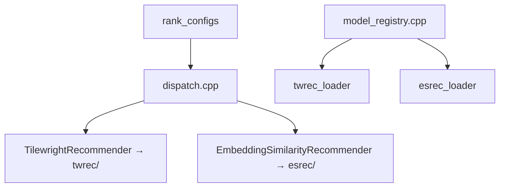

# Origami NN Backend: Two-PR Split Proposal

Split the NN work from `regs-test/shared/origami` into two reviewable pull requests
against a clean `rocm-libraries` environment at `orig-nn/shared/origami`.

| PR | Scope | Base |
|----|-------|------|
| **PR 1** | Tilewright (TWREC) NN backend | `develop` |
| **PR 2** | Embedding similarity (ESREC) NN backend | PR 1 branch (stacked) |

---

## Current State

**Source work:** `regs-test` on branch `users/yenong-amd/origami-nn-phase1` — full NN stack
(tilewright + embedding similarity).

**Target repo:** `orig-nn` — clean `ROCm/rocm-libraries` clone at current `develop`.
`shared/origami` has **no NN code** yet. Branch `users/yenong-amd/tilewright-pr` exists
but is identical to `develop`.

**Architecture:** Two parallel backends sharing only plumbing:



There is **no code dependency** between tilewright and embedding similarity — only shared
registry, dispatch, and types. Phase 1 already reserves `embedding_similarity_v1` in the
public API even before ES is implemented.

**Natural split point:** commit `164c338eb1e` ("Updated readme") — last commit before
`2ec0cb8c9ad` ("Add ESREC embedding similarity loader and ranking in origami NN").

**Gap to fix for PR 1:** `device-library/CMakeLists.txt` references `OrigamiNNWeights.cmake`,
but that file was only added later in `52bf77a1831` (combined TW+ES version). PR 1 needs a
**tilewright-only** version of this cmake module.

**Weights:** commit `1b060179326` removed tilewright weights from git; `shared/origami/data/`
is currently **untracked** on disk (~1.3M lines of YAML). PR 1 must decide how to ship them
(see [Weight Handling](#weight-handling-decision-needed-before-pr-1)).

---

## PR 1 — Tilewright NN Backend

**Title:** `feat(origami): add tilewright (TWREC) NN backend for rank_configs`

**Base:** `orig-nn/develop`  
**Branch:** `users/yenong-amd/tilewright-pr`

### Scope

| Layer | Include | Exclude |
|-------|---------|---------|
| **origami core** | Phase 1 API (`rank_options_t`, `inference_mode_t`, `nn_backend_t`), `nn.hpp`, filter, recommender interface | — |
| **tilewright** | `twrec/*`, `gemm_tilewright.*`, tilewright dispatch/registry paths | `esrec/*`, `gemm_embedding_similarity.*` |
| **shared plumbing** | `backend_id_t` + `library_models_t` with both slots (API-stable); dispatch resolves tilewright only | ES loader, ES recommender, ES feature builder |
| **data** | `data/nn/tilewright/gfx950/` (9 manifests + sidecars + `origami_nn_index`) | `data/nn/embedding_similarity/` |
| **tests** | `[nn]` + `[nn][tilewright]` cases in `test_nn.cpp` | `[nn][embedding_similarity]` cases |
| **hipblaslt** | `ORIGAMI_ENABLE_NN` gate, `PredictionLibrary.hpp` serialization for tilewright, device-library colocation | `EmbeddingSimilarity*.hpp`, `LibraryIO.py` ES hooks, logic yaml manifest rewrites |

PR 1 stays buildable without ES: CMakeLists compiles only TW sources; `model_registry` loads
only `.tilewright.yaml`; dispatch only implements `TilewrightRecommender`.

### Source Commits (from `regs-test`)

Cherry-pick or file-scoped checkout from `users/yenong-amd/origami-nn-phase1`:

```
340e926  Phase 1 NN API foundation
b8594a59 Fix file names
c895955  Implement tilewright (+ initial hipblaslt hooks)
5803e4c9 Fix difference in results
afcbb1f  Embed in-tree TWREC
f8655e7  Remove nn/config.hpp
5cf058e  Gate NN-only hipblaslt build
a48324e  Drop filter wrapper
3ee5e52  Centralize kernel feasibility, harden TWREC
164c338  Updated readme
```

**Plus one new commit:** tilewright-only `OrigamiNNWeights.cmake` (strip ES sections from
current `52bf77a1831` at `regs-test` HEAD).

### Key Files — PR 1

**origami headers**

- `include/origami/nn/nn.hpp`
- `include/origami/nn/types.hpp`
- `include/origami/nn/filter.hpp`
- `include/origami/nn/detail/recommender.hpp`
- `include/origami/nn/detail/model_store.hpp`
- `include/origami/nn/features/gemm_tilewright.hpp`
- `include/origami/nn/twrec/*`

**origami sources**

- `src/nn/dispatch.cpp` (tilewright-only, ~138 lines)
- `src/nn/model_registry.cpp` (tilewright loader paths only)
- `src/nn/filter.cpp`
- `src/nn/types.cpp`
- `src/nn/features/gemm_tilewright.cpp`
- `src/nn/twrec/*`
- `src/origami/origami.cpp` (NN hook in `rank_configs`)

**origami data**

- `data/nn/tilewright/gfx950/origami_nn_index`
- `data/nn/tilewright/gfx950/*.tilewright.yaml`
- `data/nn/tilewright/gfx950/*.tilewright.wts.yaml`

**hipblaslt**

- `projects/hipblaslt/CMakeLists.txt` (`ORIGAMI_ENABLE_NN`)
- `projects/hipblaslt/device-library/CMakeLists.txt`
- `projects/hipblaslt/cmake/OrigamiNNWeights.cmake` (tilewright-only, new)
- `projects/hipblaslt/tensilelite/include/Tensile/PredictionLibrary.hpp`
- `projects/hipblaslt/tensilelite/include/Tensile/Serialization/PredictionLibrary.hpp`

---

## PR 2 — Embedding Similarity Backend (Stacked on PR 1)

**Title:** `feat(origami): add embedding similarity (ESREC) NN backend`

**Base:** PR 1 branch (stacked); retarget to `develop` after PR 1 merges  
**Branch:** `users/yenong-amd/embedding-similarity-pr`

### Scope

| Layer | Add on top of PR 1 |
|-------|-------------------|
| **origami** | `esrec/*`, `gemm_embedding_similarity.*`, ES paths in `dispatch.cpp` + `model_registry.cpp`, `weights_hash.*` |
| **data** | `data/nn/embedding_similarity/gfx950/` + `gfx950_id75a3/`, `ESREC_STORAGE_FORMAT.md`, `split_embedding_yaml.py` |
| **tests** | `[nn][embedding_similarity]` cases; point `ORIGAMI_TEST_ES_*` at in-tree weights (not hipblaslt Embedding path) |
| **hipblaslt** | `EmbeddingSimilarityLibrary.hpp`, serialization, `LibraryIO.py` / `SolutionLibrary.py`, logic yaml `embedding_manifest` pointers, extend `OrigamiNNWeights.cmake` + add `OrigamiNNMergeIndex.cmake` |

### Source Commits (from `regs-test`, after `164c338`)

```
2ec0cb8  ESREC loader and ranking
3ef974c  embedding similarity library headers
c7eae2c  Embedding lib logic
c80b027  Embedding similarity changes
e2dd9c5  weights_hash + loader hardening
52bf77a  cmake files (ES portions + merge index)
```

### Key Files — PR 2

**origami headers**

- `include/origami/nn/esrec/*`
- `include/origami/nn/features/gemm_embedding_similarity.hpp`

**origami sources**

- `src/nn/esrec/*`
- `src/nn/features/gemm_embedding_similarity.cpp`
- `src/nn/dispatch.cpp` (+ ES recommender)
- `src/nn/model_registry.cpp` (+ ES loader)

**origami data**

- `data/nn/embedding_similarity/gfx950/origami_nn_index`
- `data/nn/embedding_similarity/gfx950_id75a3/origami_nn_index`
- `data/nn/embedding_similarity/gfx950/*.embedding.yaml`
- `data/nn/embedding_similarity/gfx950/*.embedding.wts.yaml`
- `data/nn/embedding_similarity/gfx950_id75a3/*.embedding.yaml`
- `data/nn/embedding_similarity/gfx950_id75a3/*.embedding.wts.yaml`
- `data/nn/embedding_similarity/ESREC_STORAGE_FORMAT.md`
- `data/nn/embedding_similarity/split_embedding_yaml.py`

**hipblaslt**

- `projects/hipblaslt/cmake/OrigamiNNMergeIndex.cmake`
- `projects/hipblaslt/cmake/OrigamiNNWeights.cmake` (extend with ES colocation)
- `projects/hipblaslt/tensilelite/include/Tensile/EmbeddingSimilarity.hpp`
- `projects/hipblaslt/tensilelite/include/Tensile/EmbeddingSimilarityLibrary.hpp`
- `projects/hipblaslt/tensilelite/include/Tensile/Serialization/EmbeddingSimilarityLibrary.hpp`
- `projects/hipblaslt/tensilelite/Tensile/LibraryIO.py`
- `projects/hipblaslt/tensilelite/Tensile/SolutionLibrary.py`
- Logic YAML manifest pointer updates under `library/src/amd_detail/rocblaslt/src/Tensile/Logic/`

---

## Execution Workflow in `orig-nn`

```bash
# 0. Safety snapshot (regs-test working tree)
cd /path/to/regs-test
SHA=$(git stash create "pre-split-origami-nn")
git update-ref "refs/backup/pre-split-origami-nn-$(date +%s)" "$SHA"

# 1. PR 1 branch from fresh develop
cd /path/to/orig-nn
git fetch origin develop
git checkout -B users/yenong-amd/tilewright-pr origin/develop

# 2. Port tilewright slice (prefer file-scoped checkout over blind cherry-pick
#    because regs-test develop is ~585 commits behind orig-nn develop)
git checkout regs-test/users/yenong-amd/origami-nn-phase1 -- \
  shared/origami/...          # tilewright files only (see PR 1 table)
  projects/hipblaslt/...      # tilewright hipblaslt files only

# 3. Add tilewright-only OrigamiNNWeights.cmake (fork from regs-test HEAD, remove ES)
# 4. Re-add data/nn/tilewright/gfx950/ (currently untracked in regs-test)
# 5. Build + test
cmake -B build -DORIGAMI_ENABLE_NN=ON -DORIGAMI_BUILD_TESTING=ON ...
ctest -R 'origami.*nn.*tilewright'

# 6. Squash into 2–4 logical commits, push, open PR 1 → develop

# 7. PR 2: branch from tilewright-pr, apply ES slice, open stacked PR
git checkout -b users/yenong-amd/embedding-similarity-pr
# ... apply ES files only ...
```

Use **file-scoped checkout** from `regs-test` rather than raw cherry-picks — the branch
diverged from an older develop (`ddbaef2777`) and blind cherry-picks risk conflicts across
~585 upstream commits.

---

## Weight Handling (Decision Needed Before PR 1)

| Option | Pros | Cons |
|--------|------|------|
| **Git LFS** for `*.wts.yaml` | Keeps repo lean; weights versioned | Requires LFS setup in rocm-libraries |
| **Include in PR** (~130 MB YAML) | Simplest for reviewers | Huge diff; may hit size limits |
| **External fetch script** | Smallest git footprint | CI/reviewer friction |

**Recommendation:** Git LFS for PR 1 tilewright weights, mirroring TWREC layout under
`data/nn/tilewright/gfx950/`. PR 2 does the same for ES sidecars.

**Decision (PR 1 implementation):** Use an **external fetch script** (added after both PRs
land). PR 1 tracks only `origami_nn_index` and gitignores `*.tilewright.yaml` /
`*.tilewright.wts.yaml`. Weight-dependent tests skip when manifests are absent.

---

## Reviewer Alignment

| PR | Primary reviewers care about |
|----|------------------------------|
| PR 1 | origami API design, TWREC loader/rank correctness, hipblaslt PredictionLibrary wiring, gfx950 weight colocation |
| PR 2 | ESREC format/split tooling, encoder + dot-product rank path, hipblaslt EmbeddingSimilarityLibrary migration, manifest pointer in logic YAML |

Keeping hipblaslt integration split this way avoids mixing TWREC colocation with
EmbeddingSimilarity serialization in one review.

---

## Risks and Mitigations

1. **Develop drift** — Rebase PR 1 onto latest `orig-nn/develop` before opening; resolve
   conflicts in `origami.cpp` / `gemm.cpp` (touched by both NN work and upstream perf fixes).

2. **Missing cmake at tilewright tip** — Add tilewright-only `OrigamiNNWeights.cmake` in PR 1;
   do not copy the combined file from `regs-test` HEAD.

3. **Stale README** — PR 1 should document tilewright only; PR 2 updates for ESREC.

4. **API already mentions ES** — Acceptable: Phase 1 enum / `library_models_t` are
   forward-compatible stubs; PR 1 tests prove tilewright end-to-end without ES code present.

---

## Reference: Backend Comparison

| Backend | Internal ID | Format | Algorithm |
|---------|-------------|--------|-----------|
| tilewright | `tilewright_v1` | TWREC (`.tilewright.yaml` + `.tilewright.wts.yaml`) | Split-tree routing → per-cell two-tower MLP |
| embedding_similarity | `embedding_similarity_v1` | ESREC (`.embedding.yaml` + `.embedding.wts.yaml`) | MLP encoder → dot-product vs precomputed solution embeddings |

| Backend | Query dim | Item dim | Interaction dim |
|---------|-----------|----------|-----------------|
| tilewright | 55 | 12 | 37 |
| embedding_similarity | 141 (TN) / 192 (NT) | 128 (embed) | 0 |
