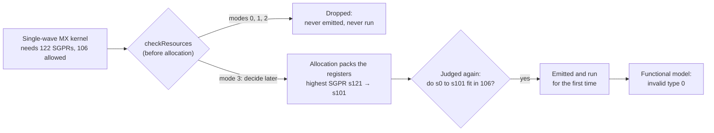
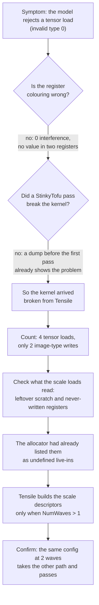
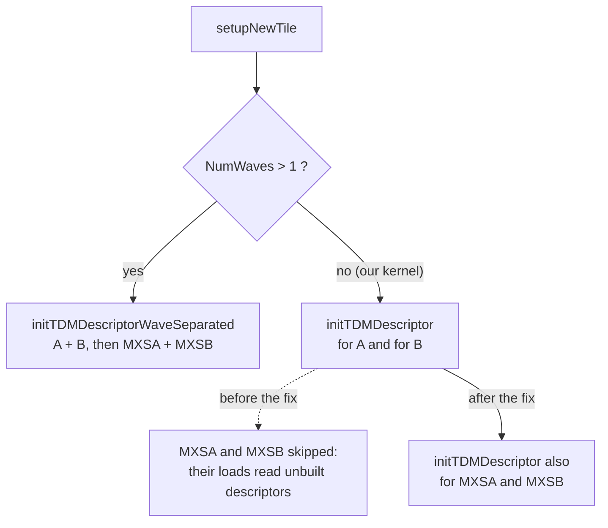

# Single-wave MX kernels on gfx1250: an SGPR overflow that hid a Tensile bug

This note follows one gfx1250 bug from start to finish. A group of kernels had always been dropped for using too many SGPRs. Forced register allocation finally let them run, and that first run exposed code in Tensile that had never been exercised and was incomplete.

## In short

- **What overflowed.** A single-wave MX GEMM kernel with TDM loads needs 122 SGPRs, and gfx1250 allows 106. Allocation modes 0, 1 and 2 always dropped these kernels, so they had never run.
- **What mode 3 changed.** With `StinkyTofuRegisterAllocation=3`, the SGPR check waits until allocation has run. Allocation packs the kernel into `s0` to `s101`, so it fits, and it runs for the first time.
- **What that exposed.** The first run stopped with `Tensor Load/Store invalid type 0`. The kernel loads four tensors (A, B, and their scale tensors MXSA and MXSB), each through its own TDM descriptor. Tensile's single-wave code only built the descriptors for A and B.
- **What the fix does.** Tensile now builds the two scale descriptors on the single-wave path, with the right shape and start address. It also rejects one shape that still fails: loading more than one scale K group at a time.
- **Who is affected.** Only single-wave MX kernels that use TDM. Every other kernel we compared is emitted byte for byte the same as before (section 7).

## Terms used in this note

| term | meaning |
|---|---|
| producer | The code that writes the kernel. Here, that is Tensile. |
| TDM descriptor | The SGPRs a `tensor_load_to_lds` instruction reads to know what to copy. Group 0 has 4 registers (global address, LDS address, type). Group 1 has 8 (sizes, tile, stride). The type field must be 2, "image". |
| MX scales (MXSA, MXSB) | Small tensors with one scale for every `MXBlock` data elements. This note uses E8 scales and `MXBlock=32`. Each scale tensor has its own descriptor, so an MX kernel loads four tensors: A, MXSA, B, MXSB. |
| single-wave / wave-separated | With one wave per workgroup, Tensile builds descriptors with `initTDMDescriptor`. With more waves, `initTDMDescriptorWaveSeparated` splits the work across the waves. |
| allocation mode | `StinkyTofuRegisterAllocation`: 0 off, 1 shadow (report only), 2 apply, 3 apply *and* let the allocator decide whether an over-budget kernel fits. |
| STIR | StinkyTofu IR, the text form of the kernel inside the StinkyTofu backend. One instruction per line: results on the left, `"st.<opcode>"(operands)` on the right. |
| live-in | A value the kernel reads before any of its own instructions has written it. A few are expected, because the hardware fills some registers at launch. The rest are registers nobody filled. |

## 1. Which configurations overflow

We ran the whole `stinky_sia4.yaml` suite with forced allocation:

```text
Tensile .../Tests/common/gemm/gfx12/stinky_sia4.yaml tensile_out -v \
    --global-parameters KeepBuildTmp=True StinkyTofuEnableRemarks=True StinkyTofuRegisterAllocation=3
```

Six MX benchmark steps hit the SGPR overflow, with two kernels each. Allocation made all twelve fit, and all twelve pass validation. The numbers below come from that run's `tensile_log.txt`.

| `stinky_sia4.yaml` section (line of its `ProblemType`) | benchmark step `Cijk_Alik_Bljk_<…>_BH_UserArgs_00` | kernels that overflow | SGPRs in the warning | highest SGPR, before → after allocation | result |
|---|---|---|---|---|---|
| MX F6, Block32, E8 (1163) | `F6SS_MXAE8B32_MXBE8B32` | 2 | 117 | s121 → s101 | PASSED |
| MX F6, Block16, E8 (1228) | `F6SS_MXAE8B16_MXBE8B16` | 2 | 117 | s121 → s101 | PASSED |
| MX A=F4, B=F6, Block32, E8 (1662) | `F4F6SS_MXAE8B32_MXBE8B32` | 2 | 117 | s121 → s101 | PASSED |
| MX A=F6, B=F4, Block32, E8 (1728) | `F6F4SS_MXAE8B32_MXBE8B32` | 2 | 117 | s121 → s101 | PASSED |
| MX A=F4, B=F6, Block16, E8 (1794) | `F4F6SS_MXAE8B16_MXBE8B16` | 2 | 117 | s121 → s101 | PASSED |
| MX A=F6, B=F4, Block32, E8/F8 scales (1859) | `F6F4SS_MXAE8B32_MXBF8B32` | 2 | 117 | s121 → s101 | PASSED |

The two SGPR columns measure different things:

- **SGPRs in the warning (117)** counts only the registers the kernel gives a name to.
- **Highest SGPR** is the largest register number the kernel's code actually uses. Before allocation it is `s121`, so the kernel really needs 122 registers, not 117. Section 2 explains the gap. After allocation, every kernel fits in `s0` to `s101`: 102 registers, under gfx1250's limit of 106.

### What these kernels have in common

All six sections fork the same parameters. From the MX F6 Block32 section:

```yaml
ForkParameters:
  - MatrixInstruction:
    - [16, 16, 128, 1,  1,  1, 1,  1, 1]   # one wave per workgroup
    - [16, 16, 128, 1,  1,  1, 1,  2, 2]   # four waves (2 x 2)
  - DepthU: [128, 256]
  - InitCIterWmma: [-1, 0]
  - ScheduleIterAlg: [4]
  - PrefetchGlobalRead: [2]
  - LocalReadVectorWidth: [32]
  - GlobalReadVectorWidthA: [32]
  - GlobalReadVectorWidthB: [32]
  - TransposeLDS: [1]
  - WavefrontSize: [32]
  - TDMInst: [3]
```

That gives 2 × 2 × 2 = 8 solutions per section, in three groups:

| MatrixInstruction | DepthU | InitCIterWmma | solutions | what happens |
|---|---|---|---|---|
| one wave (`MT16x16x128`, `WG16_2_1`) | 128 | -1, 0 | 2 | **SGPR overflow.** Allocation makes them fit, and they pass. |
| one wave | 256 | -1, 0 | 2 | Rejected by the new DepthU check (Change 4 in section 6). |
| four waves (`MT32x32`, `WG32_4_1`) | 128, 256 | -1, 0 | 4 | Fit without help, and pass. |

That is why every one of these steps reports `6 / 8 after SolutionStructs` and `6 / 6 after KernelWriter`.

The other MX sections do not overflow: the six MX-F4 sections (lines 534 to 896) and the MX F8×F4 section (line 1976). They only list multi-wave instructions. So in this suite, the overflow comes with one shape: **single-wave MX with TDM**, where a single wave sets up four TDM descriptors (A, MXSA, B, MXSB). It is not tied to F6 either. A stripped-down F8 single-wave variant, tried while writing the tests, needed 109 named SGPRs on its own.

### What the log shows for one kernel

```text
warning: Number of defined SGPRS (117) overflowed max SGPRS (106).
StinkyTofu module options: {... 'RegisterAllocation': 3, ...}
remark: LiftAsmRegistersToSSA: @: lifted 2383 SSA value(s) and 364 block argument(s)
analysis: RegisterAllocation: @: greedy-compact shadow: values=2383 v[peak=39 highest=46->45 waves=10->10] s[peak=101 highest=121->101] ...
remark: RegisterAllocation: @: coloured 2383 value(s) with greedy-compact
  found error code 0 with overflowed resources set to 0
```

Reading it from top to bottom:

1. Tensile prints the warning early in kernel generation, when its named SGPRs reach 117. The rest of the kernel then adds temporary registers, and by the end the pool holds 122. The resource check (`checkResources`) runs after the whole kernel is written and compares that 122 with the limit of 106. In modes 0 to 2, this is where the kernel is dropped.
2. Mode 3 hands the kernel to StinkyTofu anyway. The allocator turns the scalar registers into SSA values and colours them.
3. `s[peak=101 highest=121->101]`: before allocation, the code used SGPRs up to `s121`. Afterwards, the highest is `s101`, so the kernel fits in 102 registers. `peak=101` is the largest number of scalar values alive at the same time. No allocation can use fewer registers than that, so the result is within one register of the best possible.
4. The kernel is judged again, this time on the allocated count, and accepted: `error code 0 with overflowed resources set to 0`.

All twelve kernels show the same SGPR numbers.

### Run totals

- 30 benchmark steps, all `clientExit=0 (PASS)`.
- 12 kernels overflowed at the SGPR check. Allocation made all 12 fit, and none was rejected afterwards.
- 12 single-wave `DepthU=256` solutions were rejected by the new DepthU check: `single-wave MX scale TDM requires DepthU <= MatrixInstK (got 256 > 128)`.
- Validation rows: 101 `PASSED`, 2 `DID_NOT_SATISFY_ASSERTS`, 0 `FAILED`. The two skipped rows are the `K=136` problem in the two MX-F6 steps, which the yaml itself marks "expect rejection".

Three things to keep in mind when reading these results:

- **Only the winners are printed.** `stinky_sia4.yaml` sets `PrintWinnersOnly: True`. In all six steps, the single-wave kernel from the `InitCIterWmma: -1` fork (`ICIW1` in its name) won every problem. So its `PASSED` rows are in the log, and those of its `InitCIterWmma: 0` twin are not. The client's exit code still counts every failed validation, and all six steps exited 0.
- **Every scale is 1.0.** The yaml does not set `DataInitTypeMXSA/B`, so the client fills the scale tensors with ones (`mx-a init mode One`). That tests the data path, but it cannot show where the scales land (see "A validation trap" in section 4). Random scales (`DataInitTypeMXSA/B = 3`) were checked for the MX F6 Block32 shape during the investigation.
- **The verifier warnings are unrelated.** The log has 112 `[StinkyIRVerifier] Register width validation failed` lines. They are about the VGPR operand widths of the Block16 scale WMMA (`v_wmma_scale16_*`) and come from the Block16 MX steps. They have nothing to do with SGPRs or validation: those kernels build, and the steps pass.

## 2. Why the warning says 117 but the code reaches `s121`

The two numbers are measured at different times.

- **117 is an early snapshot.** Tensile prints the warning at the end of `defineVariableSgprs`, once every *named* SGPR has a register: kernel arguments, TDM descriptors, loop counters and so on. This happens near the start of kernel generation, before the main loop and the epilogue are written. At that point the pool holds `s0` to `s116`.
- **Temporary registers come later, from the same pool.** While writing the rest of the kernel, Tensile borrows short-lived scratch registers with `allocTmpSgpr`. Most of them fit into free gaps. When there is no free block of the right size and alignment, the pool grows at the end.

We traced every checkout that grows the pool while emitting the test kernel (`datamover_mx.yaml`, the same shape). Exactly one happens after the warning:

```text
computeStoreSrdStart_tmpSgprInfo   num=4 align=2 -> s[118:121]   pool 117 -> 122
```

`computeStoreSrdStart` is epilogue code that sets up the store addresses for C and D. On gfx1250 it asks for four scratch SGPRs (`4 if EnableXnackReplay else 3`), aligned to 2. No free, aligned block of four was left in `s0` to `s116`, so the pool grew. `s117` was skipped to keep the block even-aligned, and the block landed at `s118` to `s121`. In the STIR, these are the store-address temporaries:

```text
s120 = "st.s_mul_i32"(MT1, s3)                    wgMT1 = MT1 x WorkGroup1
s118 = "st.s_mul_i32"(s120, s60)                  64-bit row offset, low word
s119 = "st.s_mul_hi_u32"(s120, s60)               ...and high word
s[118:119], SCC0 = "st.s_lshl_b64"(s[118:119], s7)
s20, SCC0 = "st.s_add_u32"(s20, s118)             added to the store SRD base
```

The skipped `s117` did not stay empty. A later one-register temporary in the GSU / general-batch address code took it.

So the pool ends at 122 registers, `s0` to `s121`, and that is what every later measurement sees:

| what | value | when it is measured |
|---|---|---|
| Tensile's warning ("defined SGPRS") | 117 | after the named SGPRs, before the main loop and the epilogue |
| `checkResources` pool size | 122 | after the whole kernel is written |
| allocator `highest`, before allocation | `s121` | on the finished kernel |
| allocator `highest`, after allocation | `s101` | after StinkyTofu reassigns the registers |

In other words, the warning under-counts the real need by five registers. The resource check compares 122 with 106, not 117, and in modes 0 to 2 Tensile's rejection message reports `sgprs=122`.

## 3. What went wrong when the kernel first ran

The reproducer is [`stinky_sia4.overflow.yaml`](stinky_sia4.overflow.yaml), next to this note: an MX-F6 GEMM. Its single-wave variant (`MatrixInstruction [16,16,128,1,1,1,1,1,1]`, workgroup `WG16_2_1`) had always been dropped with the warning above. Under mode 3 it was emitted, and then the functional model stopped it at a tensor load, before it produced any result:

```text
FFM ASSERTION FAILURE called at .../jitcu_base/src/jitcu_execute_image.cpp:225
ASSERTION FAILED Root Cause:  Tensor Load/Store invalid type 0 (only 2 - image - allowed)
```

The two-wave variant of the same problem ran and passed.

### Why only mode 3 could see it



The SGPR check (`checkResources`) has to run before allocation, so it only sees the producer's own register numbers. Modes 0, 1 and 2 accept its verdict and drop the kernel. Mode 3 postpones the verdict (`resolveDeferredSgprOverflow`) until allocation is done, and then judges the number of registers allocation actually used.

| mode | SGPR verdict | does the kernel run? |
|---|---|---|
| 0 off | too many (122 over 106) | no |
| 1 shadow | too many | no |
| 2 apply | too many | no |
| 3 force | judged again after allocation: `s0` to `s101` fits | **yes** |

Mode 3 runs exactly the same passes as mode 2; the backend treats both as "apply". The only difference is *who decides* whether the kernel fits. So the first thing mode 3 finds is whatever was already wrong with kernels that had never run. That makes the producer the first suspect, not the allocator.

## 4. How we found the bug

There was no working mode to compare against, so we could not simply diff a good run against a bad one. Instead, we ruled things out one layer at a time, and then counted things that must always be true.



Steps 1, 2 and 7 were done on the reproducer. The STIR in steps 3 to 5 comes from the committed test config `datamover_mx.yaml` (a trimmed copy of the reproducer), emitted with the descriptor fix reverted, so you can regenerate it. "Reproducing the dumps" at the end of this section shows how.

### Step 1: Is the register colouring wrong? No.

`verify_colouring.py` (a local helper in `dev_st_ra/`, not in the repo) checks the allocator's result against the allocator's own liveness. It came back clean:

```text
values with two regs   : 0
interference violations: 0
```

### Step 2: Did a StinkyTofu pass break the kernel? No.

Dumping the module before the first pass runs (`StinkyTofuPrintBeforePass='RemoveDelayAluPass'`) shows exactly the same problem. The CFG rebuild, unreachable-block removal and allocation did not cause it. The kernel arrived that way from Tensile.

### Step 3: Count something that must be true

Every `tensor_load_to_lds` needs a descriptor whose type field is 2. Tensile sets that field with a single instruction: an OR of `0x80000000` into word 3 of Group 0. So we counted the loads, and counted those ORs.

The four loads, in the STIR before allocation (with Tensile's own register numbers):

```text
LDS0 = "st.tensor_load_to_lds"(s[28:31], s[64:71])      A      Group 0 is s28..s31
LDS0 = "st.tensor_load_to_lds"(s[72:75], s[76:83])      MXSA   Group 0 is s72..s75
LDS0 = "st.tensor_load_to_lds"(s[96:99], s[100:107])    MXSB   Group 0 is s96..s99
LDS0 = "st.tensor_load_to_lds"(s[84:87], s[88:95])      B      Group 0 is s84..s87
```

Every type-field write in the whole kernel:

```text
s31, SCC0 = "st.s_or_b32"(s31, 0x80000000)    A, word 3   (three times)
s87, SCC0 = "st.s_or_b32"(s87, 0x80000000)    B, word 3   (three times)
```

Four loads, but only two descriptors ever get the image type. `s75` (MXSA) and `s99` (MXSB) never do, which is exactly what the model complained about.

### Step 4: Look at what the scale loads actually read

The scale descriptors were not just missing one bit. We listed every write to the 24 scale-descriptor registers.

The only MXSA words that anything sets are `s72` and `s73`, at the very top of the kernel. There, the prologue decodes the workgroup-mapping argument (`sgprWGM` is `s12`) and happens to use these two registers as scratch:

```text
s72, SCC0 = "st.s_lshr_b32"(s12, 0x10)
s72 = "st.s_ff1_i32_b32"(s72)
s73, SCC0 = "st.s_lshr_b32"(s12, 0x16)
```

Some other words are only ever *updated*, never set. These instructions move the address forward and switch the LDS double buffer, but they apply that to values nothing ever set up:

```text
s98, SCC0 = "st.s_add_u32"(s98, s16)             address += tile offset
s99, SCC0 = "st.s_addc_u32"(s99, s17, SCC0)
s97, SCC0 = "st.s_xor_b32"(s97, 0x1000)          switch the LDS buffer
```

The rest have no writer at all:

| descriptor group | registers | only prologue scratch | only updated, never set | no writer at all |
|---|---|---|---|---|
| MXSA Group 0 | `s72..s75` | 2 (`s72 s73`) | 2 (`s74 s75`) | 0 |
| MXSA Group 1 | `s76..s83` | 0 | 2 (`s78 s79`) | 6 (`s76 s77 s80..s83`) |
| MXSB Group 0 | `s96..s99` | 0 | 3 (`s97 s98 s99`) | 1 (`s96`) |
| MXSB Group 1 | `s100..s107` | 0 | 2 (`s102 s103`) | 6 (`s100 s101 s104..s107`) |

None of the 24 registers was ever built. The MXSA load really did use leftover workgroup-mapping scratch as its first two descriptor words, and never-written registers for most of the rest.

### Step 5: The allocator had already reported it

The SSA dump makes this easy to see. In SSA, every value gets a number, and the entry block's arguments (`%1` to `%84` here) are values that exist before the first instruction. Nothing inside the kernel creates them.

Here is one real line from `kernel_ssa.stir`, the MXSA load:

```text
LDS0 = "st.tensor_load_to_lds"([%401:s, %402:s, %1188:s, %1191:s], [%65:s, %66:s, %67:s, %68:s, %69:s, %70:s, %71:s, %72:s])
```

And all four loads side by side (operands only, with `:s` dropped):

```text
^entry(%1:v, ..., %9:s, ..., %84:s):                              84 values that exist at entry

A    load: [%894, %929, %1179, %1182], [%928, %937, %945, %949, %951, %954, %926, %905]
MXSA load: [%401, %402, %1188, %1191], [%65,  %66,  %67,  %68,  %69,  %70,  %71,  %72 ]
MXSB load: [%73,  %74,  %1197, %1199], [%77,  %78,  %79,  %80,  %81,  %82,  %83,  %84 ]
B    load: [%987, %1039, %1204, %1206], [%1038, %1047, %1055, %1059, %1061, %1064, %1036, %998]
```

A and B read values that instructions produce. The MXSA load's whole Group 1 comes from entry values, and so do most of MXSB's words. `%401` and `%402` are the workgroup-mapping scratch from step 4.

The allocator had counted them too. With remarks on, every build prints this analysis line:

```text
analysis: RegisterAllocation: @: greedy-compact shadow: values=2191 ... s[peak=101 highest=121->101] ...
  undefinedLiveIn[48 %2=v5 %3=v6 %4=v7 %5=v8 %6=v9 %7=v10 %8=v11 %44=s35 +40 more]
```

`undefinedLiveIn` mixes two very different cases:

- **Defined on some paths but not on others.** This is normal, and SSA joins the paths with a phi. Kernel-argument registers work like this: they are preloaded on one path and loaded from memory on the other.
- **Defined nowhere.** The kernel reads a register that no instruction ever wrote. That is a producer bug, and allocation cannot fix it.

`scan_undefined_livein_defs.py` (another local helper in `dev_st_ra/`) tells the two apart by checking whether anything writes each register at all. On the unfixed dump, for MXSB's twelve words:

```text
no definition covers it at all          : 7 ['s96', 's100', 's101', 's104', 's105', 's106', 's107']
has a same-width (single-reg) definition: 5 ['s97', 's98', 's99', 's102', 's103']
```

The five "defined" ones are the update-only writes from step 4. The script counts a read-modify-write as a definition, so check the opcodes of anything it reports as defined.

### Step 6: Find the code



This is `KernelWriter.setupNewTile` before the fix:

```python
if tdmA and tdmB and kernel["NumWaves"] > 1 and not kernel["UseSubtileImpl"]:
  module.add(self.initTDMDescriptorWaveSeparated(kernel, tensorParametersA, tensorParametersB))
  if kernel["ProblemType"]["MXBlockA"] and kernel["ProblemType"]["MXBlockB"]:
    module.add(self.initTDMDescriptorWaveSeparated(kernel, tensorParametersA["MX"], tensorParametersB["MX"]))
  ...
  tdmInited = True

# Tile offset assignment A(MXSA)
#TODO: TDM handles MXSA and MXSB
if tdmA:
  if not tdmInited:
    module.add(self.initTDMDescriptor(kernel, tensorParametersA))
```

The single-wave fallback builds A and B only, and the `#TODO` right above it names the gap. Our kernel is `WG16_2_1`: 32 threads, which is one wave32. So it took the fallback.

### Step 7: Confirm with the other path

Widening the wave group to two (`[16,16,128,1,1,1,1,2,1]`, workgroup `WG32_2_1`) sends the same config down the wave-separated path:

| variant | waves | descriptor sets the loads use | sets built | result |
|---|---|---|---|---|
| `WG16_2_1` | 1 | 4: A, MXSA, B, MXSB | 2: A, B | model assert |
| `WG32_2_1` | 2 | 2: A+B, MXSA+MXSB | 2: both | **PASSED** |

### After the first fix: two more bugs, and a trap

Building the descriptors was not the end. Each fix revealed the next problem:

1. **`initTDMDescriptor` did not know the shape of a scale tensor.** Only the wave-separated builder had the scale geometry. Calling the old function on a scale tensor would have produced a descriptor with data-tensor sizes: a silent wrong answer instead of a loud assert. This is Change 2.
2. **The start address used the wrong axis for MXSA.** This is Change 3.
3. **A validation trap.** The scale tensors default to all 1.0 (`DataInitTypeMXSA/B = One`). When every scale is the same, putting scales in the wrong (but in-bounds) place still gives the right answer, so validation passes either way. Re-running with random scales (`DataInitTypeMXSA/B = 3`) over four shapes (`128x128x256`, `256x64x256`, `64x256x256`, `128x128x512`) is what really proved the placement. The single-wave kernel passes all four.

One shape still failed after all of this: a single-wave kernel that loads more than one scale K group at a time. That is Change 4.

### Reproducing the dumps

From `Tensile/Tests/unit/characterization/_codegen`, in an empty scratch directory:

```python
import config_harness as ch
ch.emit_kernels_from_config(
    ".../data/test_data/_designed/gfx1250/datamover_mx.yaml", limit=2, arch="gfx1250",
    global_params={"StinkyTofuRegisterAllocation": 3, "StinkyTofuEnableRemarks": True})
```

The backend writes `kernel_before_register_allocation.stir`, `kernel_ssa.stir`, `ssa_live_out.txt` and `kernel_after_register_allocation.stir` into the current directory, and the remarks print the `undefinedLiveIn` line. To see the unfixed kernel, revert the `KernelWriter.py` hunk first.

## 5. A side effect: undefined values also cost registers

A value nobody defines is still a value to the allocator, and its life starts at the kernel's first instruction. `ssa_live_out.txt` lists each value's live range as `[start, end)` stretches of instruction slots, where `d` means defined there and `u` means used there. What matters here is where the first stretch starts:

```text
before the fix
%65:s    [1d,822u) [828u,922u) [928u,2838u) [3012u,3403d)    MXSA Group 1 word: alive from slot 1, the kernel entry
%928:s   [1417d,2838u) [3012u,3401d)                         A Group 1 word: born at slot 1417, where A's descriptor is built

after the fix
%1040:s  [1637d,3242u) [3416u,3807d)                         MXSA Group 1 word: born at slot 1637, where it is now built
```

Drawn out (slot numbers from each dump):

```text
slot           1                           ~1400-1600                    end of kernel
               |                               |                               |
A    Group 1   ................................[============ in use ============]
MXSA Group 1   [===== held from entry, holding nothing =====][===== in use =====]   before
MXSA Group 1   ................................[============ in use ============]   after
```

So before the fix, each unbuilt scale word took up a register through the whole prologue while holding nothing useful. With the fix, the kernel's entry values drop from 84 to 70, and the allocator's `undefinedLiveIn` count drops from 48 to 34. The allocator counts SSA values, not registers, so these numbers do not map one-to-one onto the register table in step 4.

In this test config the SGPR peak is somewhere else, so allocation reaches `s101` either way. During the investigation, though, some single-wave MX kernels in `mxf6_tdm_gfx1250.yaml` had been rejected at `sgprs=122` even under mode 3. With the scale values defined where they are used, those kernels now fit.

## 6. What each change does

### Change 1: Build the scale descriptors on the single-wave path

`KernelWriter.setupNewTile` sets up the TDM descriptors in one of two ways. With several waves, the wave-separated branch builds all four (A with B, then MXSA with MXSB). With one wave, a fallback builds them one tensor at a time, and before the fix it only built A and B.

The fix adds each scale tensor to the fallback, right after its data tensor. This is the arm for A; B's arm gets the same lines for `tensorParametersB["MX"]`:

```python
module.add(self.initTDMDescriptor(kernel, tensorParametersA))
module.add(self.tdmGlobalOffset(kernel, tensorParametersA, useDescriptor=True))
# The scale loads from a descriptor of its own, and the wave-separated
# branch above is the only other place one gets built.
if kernel["ProblemType"]["MXBlockA"]:
  module.add(self.initTDMDescriptor(kernel, tensorParametersA["MX"]))
  module.add(self.tdmGlobalOffset(kernel, tensorParametersA["MX"], useDescriptor=True))
```

Each scale tensor gets its own descriptor and its own start address, the same way the wave-separated branch handles the pair. The `#TODO: TDM handles MXSA and MXSB` line is gone. After the fix, all four descriptors get the image type:

```text
s31, SCC0 = "st.s_or_b32"(s31, 0x80000000)    A
s75, SCC0 = "st.s_or_b32"(s75, 0x80000000)    MXSA   (new)
s87, SCC0 = "st.s_or_b32"(s87, 0x80000000)    B
s99, SCC0 = "st.s_or_b32"(s99, 0x80000000)    MXSB   (new)
```

There is one intentional difference from the wave-separated branch. That branch requires `MXBlockA and MXBlockB` together, while these checks look at each tensor on its own. Mixed MX (scales on only one operand) cannot produce a valid solution today, so the difference cannot be reached yet. Checking each tensor on its own stays correct if that ever changes.

### Change 2: Give the scale descriptor its own geometry

A scale descriptor is not a smaller data descriptor. It sees the scale tensor as a 2-D table:

- **one row per K group**, where a K group covers `MatrixInstK` elements of K;
- **each row holds `M × mxUnit` scale bytes**, where `mxUnit = MatrixInstK / MXBlock` is how many scales one row of M needs per K group.

```text
                  <---------------- dim0 = remaining M x mxUnit ---------------->
K group 0        | scales for rows 0 .. M-1, mxUnit per row                       |
K group 1        |                                                                |
   ...           |                                                                |
                  <-- tile0 = MT x mxUnit -->
                  one workgroup reads tile1 = numMxKGroups rows
dim1 = ceil(K / MatrixInstK) rows          row stride = M x mxUnit bytes
```

`initTDMDescriptor` now has an MX branch for each geometry field, ported from the wave-separated builder. The constants it emits match what the wave-separated kernels emit.

| field | formula | MXSA in the test config (`MXBlock=32`, `MatrixInstK=128`, `DepthU=128`, `MT=16`) |
|---|---|---|
| `mxUnit` | `MatrixInstK / MXBlock` | 4 |
| dim0 | remaining M × `mxUnit` (left shift) | (`SizeI` − 16·wg) × 4 |
| dim1 | ⌈K / `MatrixInstK`⌉ (right shift, rounded up) | ⌈`SizeL` / 128⌉ |
| stride | `SizeI` × `mxUnit` (left shift) | `SizeI` × 4 |
| tile0 | `MT` × `mxUnit` | 64 |
| tile1 | `numMxKGroups` = (`DepthU` / `MXBlock`) / `mxUnit` | 1 |

The fixed STIR follows that table closely (trimmed, in order):

```text
s76 = "st.s_mov_b32"(0)                          zero Group 1 (s76..s83)
s75, SCC0 = "st.s_or_b32"(s75, 0x80000000)       type field = 2 (image)
s[74:75] = "st.s_mov_b64"(s[38:39])              global address = AddressMXSA
s75, SCC0 = "st.s_or_b32"(s75, 0x80000000)       restore the type bits the address overwrote
s16 = "st.s_mul_i32"(16, s2)                     MT(16) x WorkGroup0
s16, SCC0 = "st.s_sub_i32"(s32, s16)             remaining M = SizeI - MT x wg
s17, SCC0 = "st.s_lshl_b32"(s16, 0x2)            dim0 = remaining M x mxUnit(4)
s79, SCC0 = "st.s_or_b32"(s79, 0x400000)         tile0 = 64
s80, SCC0 = "st.s_or_b32"(s80, 0x1)              tile1 = 1
s81, SCC0 = "st.s_lshl_b32"(s32, 0x2)            stride = SizeI x mxUnit
```

(`s2` is `WorkGroup0`, `s32` is `SizeI`, and `s[38:39]` is `AddressMXSA`.)

Three assertions protect assumptions the arithmetic relies on:

- **`mxUnit` is a positive power of two.** The descriptor shifts by `log2(mxUnit)`, so any other value would silently round the geometry. The check is `mxUnit & (mxUnit - 1) == 0` rather than a `log2` round trip, so a zero gets a clear message instead of a crash.
- **`applyMNEdge` holds.** The MX branch reads the clamped "remaining M" temporary, which only exists when the edge clamp is applied. That is always true today, because iterate mode is never set for scale tensors. If that ever changes, the code should fail loudly rather than read an uninitialized temporary.
- **`numComp == 1` and `numMxKGroups >= 1`.** The wave-separated builder has two tile layouts, depending on whether there are more K groups than wave components. This port keeps only the one-component layout, which is all a single wave needs.

### Change 3: Use the tensor's free axis, not the operand

`TensorDataMoverLoad.calculateStartAddr` chose the tile axis from the operand:

```text
tIdx = 0 if tp["isA"] else 1        becomes        tIdx = tp["idx"]
```

A scale tensor is neither `isA` nor `isB`, so MXSA fell into the `else` branch and got axis 1. That axis decides three things: which stride to use, which `WorkGroup` register, and which `MacroTile`. So A's scale was offset by B's workgroup and asked for `StrideMXSAJ`, on a tensor whose free axis is I. MXSB was right only by luck, because its correct axis is 1 anyway.

`tp["idx"]` comes from `ProblemType["Index{tensorIdx}"]`: 0 for A and MXSA, 1 for B and MXSB. **For the data tensors nothing changes. For MXSA it is a correction.** The wave-separated start-address code already used `tp["idx"]`.

### Change 4: Refuse more than one scale K group per load

In testing, a single-wave kernel whose unroll holds more than one scale K group fails validation. It fails even when every scale is 1.0, so the problem is not just scales in the wrong order. The exact cause is still open. Everything we can observe matches a wave-separated kernel that works: the same scale tile (`tile0=128, tile1=2`), dims, stride, padding, LDS sizes, buffer switches and per-iteration increments. Reusing the wave-separated builder is not an option either, because its wave partition has zero components at one wave and the builder divides by it. Wave-separated kernels split the K groups across waves and are not affected.

So for now, `Solution.py` rejects these shapes. In `DepthU` terms, the limit is `DepthU <= MatrixInstK`:

```python
if (state["TDMInst"] and state["EnableMatrixInstruction"]
    and state["NumWaves"] == 1 and not state.get("UseSubtileImpl")
    and (state["ProblemType"]["MXBlockA"] or state["ProblemType"]["MXBlockB"])
    and depthU > state["MatrixInstK"]):
  if reject(state, printRejectionReason,
            "single-wave MX scale TDM requires DepthU <= MatrixInstK (got %d > %d)"
            % (depthU, state["MatrixInstK"])):
    state["ValidDepthU"] = False
    return
```

Where the check lives matters. It sits in `Solution.depthUIteration`, not in `assignDerivedParameters`, for three reasons:

- **`DepthU` has its final value there.** Earlier on, it can still be `-1`, the marker for "search for a DepthU", and `-1 > MatrixInstK` is false. An earlier check would let every `DepthU: -1` config through, and the search would then pick 1024.
- **More specific errors still come first.** The TDMFuse and PAP checks reject and return before `depthUIteration` runs. When the check sat ahead of them, configs whose real problem was, for example, `TDMFuse=1 requires NumWaves > 1` got "requires DepthU <= MatrixInstK" instead. That broke three tests that check those messages.
- **The DepthU search can still find a legal size.** Setting `ValidDepthU = False` marks only this *candidate* as bad. With `DepthU: -1`, the search walks `[1024, 512, 256, 128, ...]` and stops at the first size with a single scale K group, instead of losing the kernel. The LDS-capacity check works the same way.

Two smaller details:

- **It respects `NoReject`.** With `NoReject` set, `reject()` records nothing, returns `False`, and leaves the solution valid. The first version returned anyway, which stopped the derivation before GRVW, LDS sizes and `LoopIters` were computed. The result was a "valid" solution with missing fields (`KeyError: 'LoopIters'`). The check now returns only when `reject()` really rejected.
- **It checks `EnableMatrixInstruction` first.** `NumWaves` and `MatrixInstK` only exist for matrix-instruction kernels. Without that check, a non-MI TDM kernel would raise `KeyError: 'NumWaves'`. It tests `NumWaves == 1` rather than the `math.prod(MIWaveGroup) <= 1` idiom used elsewhere, because the two disagree when `LocalSplitU > 1`, and `NumWaves` is exactly what `KernelWriter` tests when it picks the descriptor path.

### Change 5: Tests, and why they turn the allocator on

Writing the tests ran into the same wall the bug had hidden behind: **the code under test only runs when the scalar allocator is on.** Four descriptors at 12 SGPRs each are 48 registers that cannot be avoided. In a stripped-down variant (no batch dimension, no user arguments), the named SGPRs still came to 109. Every fork-parameter variant we tried that got as far as emitting stayed at 109. So the codegen test turns mode 3 on explicitly, through a new `global_params` argument on the config harness:

```python
emit_kernels_from_config(_CONFIG, ..., global_params={"StinkyTofuRegisterAllocation": 3})
```

Turning allocation on has two side effects:

- **Registers get renumbered.** Modes 2 and 3 compact the SGPRs, so `s[sgprtdmMXSAGroup1]` prints as `s24`. The harness helper `with_symbol_names` puts the names back, using the allocator's `s24 was sgprtdmMXSAGroup0+0` comments, and the assertions match against that view.
- **The pipeline writes debug files.** The allocation passes always write `kernel_*.stir` and `ssa_live_out.txt` into the current directory. The test fixture emits from a temporary directory, so these files do not land in the source tree.

Here is what the two suites check, and what each one catches. Every "fails when reverted" entry was confirmed by reverting that change and re-running:

| suite | cases | checks | fails when reverted |
|---|---|---|---|
| `test_r5_datamover_mx_char.py` | 9 | the kernel emits; both scale descriptors are written before the first load and take their own base address; scale tile0 and tile1; A/B data tiles unchanged; scale start addresses use their own axis; all four tensors load | Change 1: the built and tile checks. Change 3: the start-address check. |
| `test_tdm_mx_singlewave_guard.py` | 7 | `2x` and `4x MatrixInstK` rejected; `DepthU == MatrixInstK` accepted; `DepthU: -1` settles on `MatrixInstK`; wave-separated and non-MX stay valid; `NoReject` finishes the derivation | Change 4: both rejection checks. The old unconditional return: the `NoReject` check. |

The start-address check reads the instruction comments that survive emission. MXSA's GSU offset must be the only one scaled by `SizeI`, MXSB's the only one scaled by `SizeJ`, and the workgroup multiplies must be split evenly between `WorkGroup0` and `WorkGroup1`. With the old `tIdx`, MXSA moves to axis 1 and both of those break.

## 7. Which kernels the fix affects

Only **single-wave MX kernels that use TDM**. Each change is limited to them, either by an explicit condition or because the code it touches only runs for them:

- **Change 1** adds calls under `if not tdmInited:` in `setupNewTile`. The wave-separated branch sets `tdmInited` whenever `tdmA and tdmB and NumWaves > 1`, and `Solution.py` rejects any `TDMInst` other than 0 or 3, so `tdmA` and `tdmB` are always equal. The new calls therefore run only at one wave, and only when `MXBlockA` or `MXBlockB` is set.
- **Change 2** adds branches that only apply to scale tensors, and only Change 1's calls pass a scale tensor to `initTDMDescriptor`. The function also runs in multi-wave sparse kernels, for the metadata descriptor. There the new code has no effect: `duScale` and `mxUnit` are both 1, the MX assertions are skipped, and the old code only moved under `else:`.
- **Change 3** edits `calculateStartAddr`, which only the single-wave path calls. Multi-wave kernels use `calculateStartAddrWaveSeparated`, which already used `tp["idx"]`. Even at one wave, A and B get the same axis as before: `Index0` and `Index1` are the two free indices in ascending order, which is 0 and 1 in a GEMM. Sparse metadata is still remapped right after, as before. Only MXSA's axis changes.
- **Change 4** requires `NumWaves == 1` in its condition.
- **Change 5** is test code.

To check this, we emitted gfx1250 kernels from the code before and after the fix, at allocation modes 2 and 3, and compared the assembly byte for byte. The four-wave rows use copies of the committed configs with `MIWaveGroup` changed to `[2,2]`.

| kernels | waves | MX scales | before vs after |
|---|---|---|---|
| `datamover_mx.yaml` at four waves, `DepthU` 128 and 256 | 4 | yes | identical |
| `datamover.yaml` at four waves | 4 | no | identical |
| `datamover.yaml` | 1 | no | identical |
| `datamover_mx.yaml` | 1 | yes | **different**, as intended |

What the results show:

- **Multi-wave MX kernels are untouched, and still accepted.** The four-wave `DepthU=256` kernel still emits, so the new DepthU check leaves multi-wave kernels alone.
- **Change 3 is a no-op for data tensors.** The single-wave non-MX kernel's A and B start addresses go through the changed `tIdx` line, and not one byte changed.
- **In the single-wave MX kernel, the difference is the scale descriptor setup.** Before the fix, 12 instructions write MXSA's descriptor registers and 10 write MXSB's, and none of them sets the type field. They only adjust values in place: address offsets, LDS buffer switches and tail-loop masking. After the fix, 48 and 46 instructions write them, including the type field for both. A's and B's descriptors are written by the same 57 instructions each, before and after.
- **Mode 2 behaves as before.** Both versions drop the single-wave MX kernel with the same `117 ... overflowed max SGPRS (106)` warning.

## 8. Verification

On the committed fix:

- **Full unit suite:** 8825 passed, 41 failed, 246 skipped, 2 xfailed, 1 xpassed. Only one of the failures came from this fix, and its test is now updated (next bullet). The other 40 also fail without this fix:
  - 37 GL2-prefetch tests need the `hip` Python module to launch a GPU kernel (`'NoneType' object has no attribute 'hipInit'`).
  - 2 tests need the `filelock` module.
  - `test_streamk_multicast.py::TestEmit::test_broadcast_mask_value` fails on the code before this fix too.

  The xpassed test, `test_r3_streamk_tdmsplit_gfx1250_golden`, also xpasses before this fix.
- **The one failure this fix caused:** `test_setcover_gemm_char.py` pins the emit statuses of one `mxf6_tdm_gfx1250.yaml` problem group. The new DepthU check now rejects that group's single-wave `DepthU=256` solution before it reaches the emitter. At mode 2, that solution used to reach the emitter and fail there with an SGPR overflow. So the group now emits three kernels instead of four, `{0: 2, -2: 1}` instead of `{0: 2, -2: 2}`. The pin is updated, and the test passes.
- **The related suites** (`test_harness_smoke.py`, `test_r5_datamover_mx_char.py`, `test_tdm_mx_singlewave_guard.py`, `test_TDMFuse.py`, `test_r3_datamover_char.py` and `SolutionValidity/`): 165 passed, plus 1 expected failure. The expected failure is `test_tdmsplit_pap_mx_multiwave_accepts`, which is marked xfail because TDMSplit is currently disabled. It is unrelated to this fix.
- **The two new suites:** 16 passed. Every "fails when reverted" entry in the Change 5 table was confirmed by reverting that change and re-running, so those checks do not pass by accident.
- **The three tests that had been getting the wrong rejection message** (two in `test_TDMFuse.py`, one in `test_r4_tdmsplit_pap_mx_char.py`) pass with their own messages again.
- **STIR before and after, from `datamover_mx.yaml`:** with the fix, all four descriptors get the image type and all 24 scale-descriptor registers are written. Entry values drop from 84 to 70, and `undefinedLiveIn` drops from 48 to 34.
- **Byte-for-byte comparison:** only the single-wave MX kernel changes (section 7).

From the investigation:

- **Random-scale validation:** the single-wave kernel passes all four shapes with `DataInitTypeMXSA/B = 3`.
- **The 42-config gfx1250 sweep at mode 3:** 11,425 passing solutions and no failures with the DepthU check in place. Without it there were 48 failures, all of them the multi-K-group case. This sweep ran before two later revisions: moving the check into `depthUIteration`, and making it respect `NoReject`.

## 9. Files

| file | change |
|---|---|
| `Tensile/KernelWriter.py` | build the MXSA/MXSB descriptors on the single-wave path |
| `Tensile/KernelWriterAssembly.py` | scale geometry for dim0, dim1, tile0, tile1 and stride, plus three assertions |
| `Tensile/Components/TensorDataMover.py` | the start address uses the free axis, not the operand |
| `Tensile/SolutionStructs/Solution.py` | at most one scale K group per load at one wave; respects `NoReject` |
| `Tests/unit/characterization/_codegen/config_harness.py` | `global_params` argument for per-emit global overrides |
| `.../_designed/gfx1250/datamover_mx.yaml` | single-wave MX-F6 TDM config with `DepthU == MatrixInstK` |
| `.../_codegen/test_r5_datamover_mx_char.py` | descriptor, geometry and start-address checks |
| `Tests/unit/test_tdm_mx_singlewave_guard.py` | where the DepthU check starts and stops rejecting |
| `.../_codegen/test_setcover_gemm_char.py` | one `mxf6_tdm_gfx1250.yaml` group now emits three kernels, because the DepthU check rejects its single-wave `DepthU=256` solution |

## 10. Lessons

- **A mode that rescues rejected kernels finds old bugs first.** Mode 3 runs exactly the kernels every other mode threw away, so its first failures are likely to be upstream. Rule out the producer before reading the colouring.
- **The allocator's report already named the registers.** It took a model assert for us to go back and read it. A report that separated "undefined on some path" from "defined nowhere" would have turned the search into a one-line lookup. The allocator also recoloured the "defined nowhere" values without complaint; that is worth making loud.
- **When there is nothing to diff against, count.** Four loads need four built descriptors. Rules a kernel must follow on its own still work when there is no good run to compare with.
- **Check what the validator can see.** All-ones scales make every in-bounds arrangement give the same answer. When a fix is about *where* data lands, the test data has to vary along that dimension.
