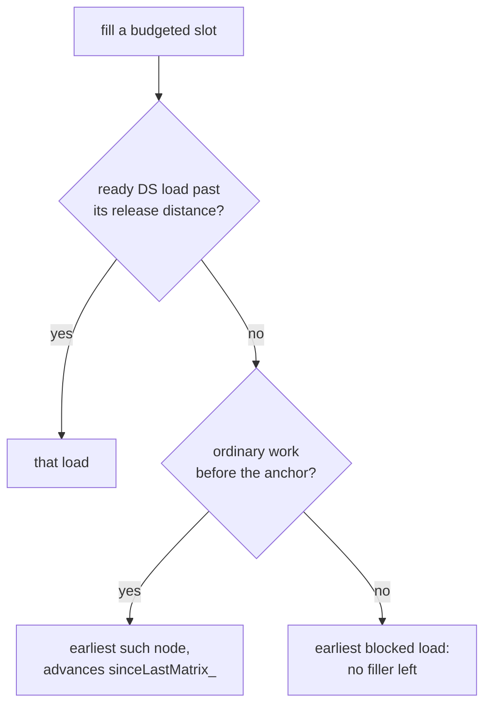

# Matrix-to-DS Gap Preservation

## Status

Implemented, inside `WaitAnchoredPickPolicy`. This is an add-on rule for the pass described in [Wait-Aware Schedule Repair Pass](wait-aware-schedule-repair-pass.md), so read that one first if terms like window, anchor, budget or carry are unfamiliar.

## The problem

The scheduler that runs before the repair often leaves a deliberate distance between a matrix instruction and the DS loads that follow it:

```text
v[26:41] = v_wmma_scale_f32_32x16x128_f4(...)
  ...                                          <- some ALU instructions
v[706:709] = ds_load_b128(v542, LDS0)
v[710:713] = ds_load_b128(v542, LDS0)
```

The repair reorders work inside each window, and it used to destroy that spacing. Here is a two-anchor segment whose input has a gap of three at both anchors:

| configuration | gap after WMMA_0 | gap after WMMA_1 |
|---------------|------------------|------------------|
| input IR | 3 | 3 |
| `kPreferMemProducerFirst = true`, no gap rule | 0 | 0 |
| `kPreferMemProducerFirst = false`, no gap rule | 3 | 4 |
| with the gap rule | 3 | 3 |

The collapse to zero came from the memory-first preference. It picks any ready producer ahead of ordinary work, so the loads got pulled up against the matrix instruction and every filler ended up behind them. The growth in the third row comes from carry, which has lower original IDs and therefore lands in front of the loads.

Collapse is the direction that matters. The spacing is there so that a DS instruction is not issued immediately behind a matrix instruction, and removing it throws away whatever the earlier scheduler was buying.

## What the rule guarantees

Every DS load ends up at least as far from the matrix instruction ahead of it as it was in the input.

That is a lower bound, not an exact match. A wider gap is harmless, and insisting on an exact match would mean throwing out work that genuinely belongs in front of the load — carried work above all. So the "grew to 4" row is fine.

The rule is a preference, not a correctness requirement. If it ever disagrees with the existing guarantee that no producer crosses an anchor, the anchor guarantee wins.

Distances are measured in schedulable instructions, so attached waits are not counted. They are pulled out of the DAG before scheduling and put back immediately in front of their anchor, which is after the loads, so a wait never sits inside a gap anyway.

The rule covers DS loads only, meaning `classifyMemOp(...) == CK_DS`. Producers on other counters are still held ahead of their anchor by the mandatory-producer rule, but they get no release distance of their own.

## Design

### Release distance

Every DS load carries a *release distance*: the number of instructions that must be emitted after the preceding matrix instruction before that load may be selected.

The important part is that the distance belongs to the *matrix interval*, not to the individual load. All DS loads between two matrix instructions share the input distance of the **first** load in that interval. One release point gates the whole run, so once it opens the loads stay clustered together.

```cpp
void buildDsReleaseDistances() {
    dsReleaseDistance_.assign(regionDAG_.nodes.size(), kNoGapConstraint);

    std::optional<unsigned> lastMatrixId;
    std::optional<unsigned> intervalDistance;
    for (unsigned id = 0; id < regionDAG_.nodes.size(); ++id) {
        const DAGNode& node = regionDAG_.nodes[id];
        if (isMatrixInstruction(*node.inst)) {
            lastMatrixId = id;
            intervalDistance.reset();
            continue;
        }
        if (!lastMatrixId.has_value()) continue;
        if (waitcnt::classifyMemOp(*node.inst) != waitcnt::CK_DS) continue;
        if (!intervalDistance.has_value()) intervalDistance = id - *lastMatrixId - 1;
        dsReleaseDistance_[id] = *intervalDistance;
    }
}
```

DAG IDs are dense and follow input order, so a distance is simply the difference between two IDs. Nothing else needs tracking.

Giving each load its own distance looks equivalent but is not, and that was the first version of this rule. Per-load distances rebuild the input's *internal* spacing between loads, which on a real kernel pushed scalars in between loads that the pass itself had placed back to back:

```text
  per-load distances        interval distance
  ------------------        -----------------
  WMMA                      WMMA
  ds_load 794               ds_load 794
  s_cmp                     ds_load 798
  s_mov                     s_cmp
  ds_load 798               s_mov
```

On one production kernel the per-load version broke up 12 of 179 adjacent load pairs. The interval version reproduces the original run-length distribution exactly.

### Runtime counter

`sinceLastMatrix_` records how far the schedule has moved past the last matrix instruction. It lives in `onPicked` rather than in the per-window handlers because it has to span windows: it must keep counting while no window is active, so that a load in the next window still measures from the matrix instruction that really precedes it.

```cpp
void onPicked(DAGNode& node, bool isWmma) {
    if (isWmma) {
        sinceLastMatrix_ = 0;
        onWmmaPicked(node);
    } else {
        reportShortGapIfAny(node);
        ++sinceLastMatrix_;
        onOtherPicked();
    }
}
```

`reportShortGapIfAny` is the single diagnostic. It sits here rather than inside the search so that it catches every route by which a load can be committed too early, including the mandatory-producer step, which never goes through the search at all.

A load is *released* once the schedule has moved far enough:

```cpp
bool matrixGapSatisfied(const DAGNode& node) const {
    if constexpr (!kPreserveMatrixToDsGap) return true;
    const unsigned required = dsReleaseDistance_[node.id];
    return required == kNoGapConstraint || sinceLastMatrix_ >= required;
}
```

The toggle guards this one predicate instead of each call site, which keeps a second condition out of the selection code. Turn it off and `findReadyReleasedMemProducer` collapses into the plain search, while the blocked branch below never runs.

### Selection

Only `findReadyOtherBeforeAnchor` changed behaviour. `findReadyMemProducerBeforeAnchor` still backs the mandatory-producer step, which is a correctness rule and has to outrank spacing. Both searches now share one helper, so the gap test is the only visible difference between them:

```cpp
template <typename Predicate>
DAGNode* findReadyBeforeAnchor(const OrderedReadyNodeSet& otherQueue, Predicate match) const {
    for (DAGNode* node : otherQueue) {
        if (node->id < window_.anchor->id && match(*node)) return node;
    }
    return nullptr;
}
```

```cpp
DAGNode* findReadyOtherBeforeAnchor(const OrderedReadyNodeSet& otherQueue) const {
    if (!window_.active()) return nullptr;
    if constexpr (kPreferMemProducerFirst) {
        if (DAGNode* node = findReadyReleasedMemProducer(otherQueue)) return node;
    }

    DAGNode* gapBlocked = nullptr;
    for (DAGNode* node : otherQueue) {
        if (node->id >= window_.anchor->id) continue;
        if (!matrixGapSatisfied(*node)) {
            if (gapBlocked == nullptr) gapBlocked = node;
            continue;
        }
        return node;
    }
    // Believed unreachable; kept so the queue always makes progress.
    return gapBlocked;
}
```

`matrixGapSatisfied` returns true for any node without a release distance, so the loop needs no separate producer check.

The rule is self-correcting, which is why it stays this small. Blocking a load makes the policy pick ordinary work instead; that pick advances `sinceLastMatrix_`; and as soon as the counter reaches the release distance the load becomes preferred again and is taken. The gap fills itself with exactly the work that filled it in the input, in the original order.



### Toggle

```cpp
constexpr bool kPreserveMatrixToDsGap = true;
```

## Worked example

This is the segment from the table above. Input IDs are on the left, and the wait in front of each anchor is left out because it is not a DAG node.

```text
  id  input                 release distance
  --  -----                 ----------------
   0  WMMA_0                 -
   1  s60                    -
   2  s61                    -
   3  s62                    -
   4  ds_load  v[100:103]    4 - 0 - 1 = 3   (first load in the interval)
   5  ds_load  v[104:107]    3               (shares the interval distance)
   6  s63                    -
   7  WMMA_1                 -
```

Window 1 has six nodes of its own and a budget of five:

| pick | `sinceLastMatrix_` | released? | selected |
|------|--------------------|-----------|----------|
| 1 | 0 | no, the interval needs 3 | s60 |
| 2 | 1 | no | s61 |
| 3 | 2 | no | s62 |
| 4 | 3 | both loads released (3 >= 3) | `ds_load v[100:103]` |
| 5 | 4 | still released | `ds_load v[104:107]` |

At that point the budget is spent, no producers are left, and the anchor is ready. `s63` is deferred as carry, exactly as it was before this rule existed. The original spacing is back and one slot still moves past the anchor. In the second window the carried `s63` is picked first because it has the lowest ID, and it counts toward the gap, so carry helps fill the spacing rather than pushing the loads out of place.

## How it fits with the existing rules

**Mandatory producers.** This step runs once the budget is spent and stops a producer crossing an anchor, which would change what the anchor's wait guarantees. It ignores release distances.

**Carry.** Counts toward `sinceLastMatrix_` like any other instruction.

**Budget.** Untouched. The rule only reorders within a window and never changes how many instructions end up on each side of an anchor, so `originalOtherCount`, `otherPickBudget` and the carry ledger all behave exactly as before.

**`kPreferMemProducerFirst`.** Now reads as "as early as the window allows, but never closer to the preceding matrix instruction than the input had it".

## When the gap can still shrink

The gap is a target rather than a promise. A load gets selected at whichever comes first: its release distance being reached, or the budget running out and the mandatory-producer step taking it anyway. That gives:

```text
gap achieved = min(releaseDistance, otherPickBudget)
```

So the gap survives whenever `otherPickBudget >= releaseDistance`. At the shipped value of one slot the budget is `originalOtherCount - 1`, which only falls below the release distance when the load sits right at the end of its window. The configurations at risk are the ones moving many slots past an anchor. Confirmed at `kSlotsToMovePastAnchor=3` on a five-node window: a release distance of three against a budget of two produces a gap of two, and `onPicked` reports `gap shortened for dagId=4 required=3 actual=2`.

Treat that formula as a lower bound on the achieved distance rather than an exact value. Steps 2 and 4 of the selection order also advance `sinceLastMatrix_`, so a load held back by both the budget and a dependency can finish further from its matrix instruction than `min` suggests. At `kSlotsToMovePastAnchor=5`, on a window whose load depends on an address computed in the same window, the budget is zero and yet the forced dependency-path pick still puts one instruction into the gap.

Readiness is a second possible cause: if no filler is ready, the last clause of `findReadyOtherBeforeAnchor` takes the blocked load instead of stalling. That branch looks unreachable in practice. The work that forms a gap sits between the load and the matrix instruction, so it has lower IDs and gets selected first, and instrumenting the branch across the whole filecheck suite at `kSlotsToMovePastAnchor` of 1, 2, 3, 4, 5 and 8 produced no hits at all. It stays in place so the queue always makes progress if that reasoning ever turns out to be wrong.

Whenever a load is committed short of its distance, by any route, `onPicked` emits a `PASS_DEBUG` line rather than asserting. The result is still legal; only the spacing is lost. Reporting at the commit point instead of inside the search is what makes the budget-limited case visible, because that one is taken by the mandatory-producer step and never reaches the search.

Reserving filler to close either hole would make `otherPickBudget` depend on where the loads are, tangling together two mechanisms that are currently independent. That is not worth it for something that only costs spacing.

## Validation

Two FileCheck cases, both covering the shipped configuration and both failing when `kPreserveMatrixToDsGap` is false:

- `wait_aware_schedule_repair_matrix_gap_test.stir` covers the shape from the table: the gap of three survives at both anchors while one slot still moves past each. Its second window receives the scalar deferred out of the first, so it also covers carried work counting toward a gap instead of displacing the loads. Its third window guards the interval rule, with loads at input distances 0 and 3 that must come out adjacent.
- `wait_aware_schedule_repair_matrix_gap_unconstrained_test.stir` covers the two kinds of node that get no release distance: a DS load with no matrix instruction ahead of it, and a producer on a different counter. Both stay unconstrained, which is what pins the DS-only scope. It also shows that the distance counts instructions rather than non-producers, so an unconstrained producer sitting in a gap counts toward it and the DS load behind it needs correspondingly fewer scalars.

Three more cases were written and then dropped as not critical. An all-loads window drains correctly but is insensitive to the rule, so it could never fail for the reason it claimed to test. A dedicated carry case turned out to be redundant with the second window above. A budget-limited case exercised `kSlotsToMovePastAnchor=3`, which the backend never sets — the shipped value is one, where the budget always reaches the release distance unless the load sits right at the end of its window. That last one is described under "When the gap can still shrink" instead, and should come back as a test if the slot count ever becomes tunable per kernel.

### Verified on a production kernel

Running the pass over a real GEMM kernel and comparing every matrix instruction against its next DS load:

| | gap histogram | sites differing from the input |
|---|---|---|
| input to the pass | 214 at 0, 2 at 1, 2 at 2 | — |
| output without the gap rule | 218 at 0 | 4 |
| output with the gap rule | 214 at 0, 2 at 1, 2 at 2 | 0 |

All 384 gaps match the input exactly, with none lost and none added. Without the rule the four non-zero gaps all collapsed to zero. The `ds_load` run-length distribution also matches the input exactly, at 40 singles and 179 pairs, where the earlier per-load version of the rule reported 64 singles and 167 pairs.

### No impact on pre-existing tests

Every pre-existing `wait_aware_schedule_repair_*` test passes unmodified. For a run of DS loads sitting immediately behind a matrix instruction at id `m`, the IDs are `m+1, m+2, ...`, so the first load's distance is zero and the whole run is released straight away — which is exactly what memory-first already did. Nothing moves. The full suite is 128 passing.
