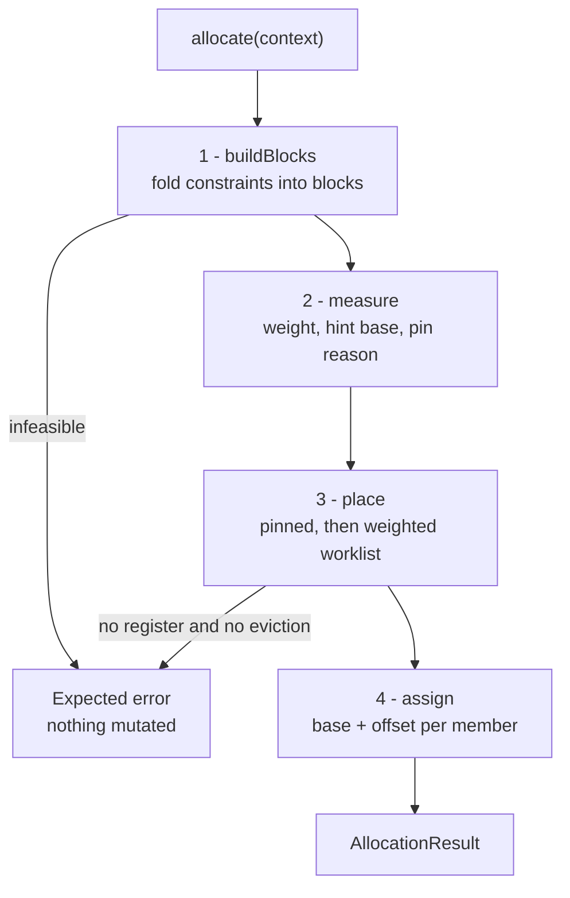

# The greedy allocator

Weighted first-fit with eviction. `greedy` and `greedy-compact` are one implementation with one flag between them.

- [Register allocation](register-allocation.md) — the framework this plugs into, including the region axis of `AllocationScope` (section 3)
- [SSA representation](ssa-representation.md) — values, use lists, `AllocationResult`
- [Lift Asm registers to SSA](lift-asm-registers-to-ssa-pass.md) — where the `PhysicalBinding` hints come from

## 1. Two names, one implementation

| Registered name | Class | `followHints` | Purpose |
|---|---|---|---|
| `greedy` | `GreedyAllocator` | true | prefer the register the producer chose; the default |
| `greedy-compact` | `CompactingGreedyAllocator` | false | pack from the bottom; the only variant that can lower the high-water mark |

Both are thin wrappers over one file-private `Greedy` class, and both report an empty `AllocatorCapabilities`:

- `mayRecolourMerges = false` — an affinity set keeps a merge and its incoming values on one register, so lowering never needs a copy on a merge edge;
- `maySpill = false` — no range is ever split, so there is nothing for scratch or waitcnt to integrate.

Both flags false is what makes the output applicable at all, so neither policy can be refused by the capability gate.

A function with no SSA values returns an empty `AllocationResult`, not an error.

## 2. Four phases



Every refusal is an `Expected` error naming the kernel. The driver mutates nothing on failure, so a refused greedy run is indistinguishable from one that never ran.

## 3. It places blocks, not values

Two constraints tie values together, and both must hold at once:

| Constraint | Requirement | Expressed as |
|---|---|---|
| `tupleRuns()` | unit *i* of an operand sits at `base + i` | `relate(first, unit_i, i)` |
| `affinitySets()` | a merge and its incoming values share one register | `relate(first, member_i, 0)` |

Both have the shape *b sits δ units from a*, so a single union-find that carries an offset to its root absorbs both. Each resulting class becomes a **block**: a contiguous span whose members sit at fixed offsets and which is placed as a unit.

Solving them together is required, not tidier, because tuple runs overlap in real code:

```text
v[4:7] = ds_load_b128(...)      run A: %2 %3 %4 %5 consecutive
ds_store_b64(..., v[4:5])       run B: %2 %3       consecutive
v4     = v_add_f32(...)         defines %6
ds_store_b128(..., v[4:7])      run C: %6 %3 %4 %5 consecutive
```

Runs A and C force `%2` and `%6` onto the *same* offset — a partial overwrite of a wide range must land where the original unit went. Honouring each run on its own would let a later placement silently break an earlier one.

After grouping, each block is normalised: its lowest offset becomes 0, `width` is `highest - lowest + 1`, members are sorted by `(offset, value)`, and the leader is the smallest member ID. Nothing downstream depends on which value happened to become the union-find root.

### 3.1. Rejected before any placement

| Check | Condition | Message |
|---|---|---|
| Offset contradiction | two runs imply different offsets for one pair | `operands disagree about where %6 sits relative to %2` |
| Merge vs operand | an affinity set needs δ 0 where a run needs δ ≠ 0 | `a merge needs %9 and %5 on one register, but an operand needs them apart` |
| Mixed class | members of one block are in different classes | `%3 is class s but is tied to %2 in class v` |
| Class not allocated | `indexCount(class) == 0` | `%2 is class a, which this target does not allocate` |
| Too wide | `width > indexCount(class)` | `values tied to %2 span 9 registers, more than the 8 v registers ...` |
| Same offset, both live | two members share an offset and their ranges overlap | `%2 and %6 are forced onto one register by their operands but are live at the same point` |

Two members sharing an offset is legal — it is the overlapping-run case above — and is sound exactly while their ranges are disjoint. The last check is what enforces that, before placement rather than during it.

## 4. Weight

Weight decides order, and order is most of the policy.

```text
weight(block) = Σ over members:  useCount × 10^min(depth, 4) / max(1, length)
```

| Term | Source |
|---|---|
| `useCount` | `StinkySSAValue::useCount()` |
| `depth` | how many loops in `AllocationContext::loops` contain the member's defining block |
| `length` | `LiveRange::length()` |

| Constant | Value | Role |
|---|---|---|
| `kLoopWeight` | 10.0 | multiplier per loop level |
| `kMaxLoopDepth` | 4 | depth stops growing here |
| `kMaxEvictionsPerBlock` | 2 | per-block eviction cap |

Depth enters as a *multiplier*, not a factor. Written literally as `useCount × depth / length` it would zero every value outside a loop. As it stands, a short range read often inside a loop outranks a long-lived value read once, which is the usual block-frequency intuition without a frequency analysis to draw on.

## 5. Order and candidates

```text
place every pinned block at its hint base          # refuses the function if it cannot
sort the rest by weight desc, then leader asc
while worklist:
    b = pop
    if b is already placed: continue
    if tryPlace(b): continue
    base = lowest evictable base for b
    if there is none, or the global budget is spent: refuse the function
    unbind every occupant at base, requeue it, then bind b
```

Pinned blocks go first, so a freely placed block sees the registers it cannot move as already taken.

| Pin reason | Trigger | Note |
|---|---|---|
| `a function live-in` | any member is `isPinned()` | holds in both policies; a compacting run may not trade it away |
| `in a class this run is not colouring` | class outside `AllocationScope::classes()` | this is how one class moves while the rest stay put |
| `outside the region this run is colouring` | live range not contained in `AllocationScope::regionCut()` | this is how `regionEnd` keeps the remainder byte-identical |

One pinned member fixes the whole block, since members sit at fixed offsets from each other. A pinned block that cannot take its base refuses the function, and the message says which of the three cases it is:

```text
@kernel: %1 is a function live-in, so it must keep its original register, but it has none recorded
@kernel: %1 is a function live-in, so it must keep its original register, but v20 is already taken
@kernel: %1 is a function live-in, so it must keep its original register, but v300 is not allocatable
```

`already taken` versus `not allocatable` is exactly the `availableAt` / `reachableAt` split below.

`tryPlace` tries two candidates, in order:

1. the block's **hint base**, when `followHints` is set and it is available;
2. **first fit**, scanning `base` up from 0 while `base + width` still fits the class.

A hint base exists only when every member has a `PhysicalBinding` in the block's class, each `idx` is at least its own offset, and all members agree on `idx - offset`. Any disagreement drops the hint entirely and the block goes to first fit.

Availability is asked in two separate steps:

| Test | Asks |
|---|---|
| `reachableAt` | does the run fit the class, and is every index allocatable — ignoring who holds it |
| `availableAt` | `reachableAt`, plus every member's range is conflict-free in the matrix |

Keeping them apart is what lets a refusal say whether a register is off limits or merely occupied.

## 6. Eviction

Eviction is what makes this greedy rather than linear assignment.

A base is evictable when it is `reachableAt`, has at least one occupant, and *every* occupant is:

- not pinned;
- **strictly** lighter than the arriving block;
- still under `kMaxEvictionsPerBlock`.

The lowest such base wins. Occupants are unbound, counted, and requeued.

Termination needs more than the weight ordering. Work only ever moves to a strictly lighter block, but a requeued block can displace a third one, so a per-block cap plus a global budget of `blocks × kMaxEvictionsPerBlock + 1` bounds the total number of evictions.

With no evictable base the function is refused — there is no splitting and no spilling:

```text
@kernel: no v register is free for %41 and the 3 register(s) tied to it;
         splitting and spilling are not implemented
```

## 7. Why the default reproduces the input

**Hint-following cannot lower the high-water mark.** The hint is the producer's own register, the producer's colouring is legal, and a legal colouring never puts two overlapping values on one register — so every block finds its hint free, first fit is never reached, and the output matches the input value for value.

A difference therefore means a hint was *unreachable*: an index past `indexCount`, or reserved. It never means the hint was contended.

That is the point of the default — a shadow comparison shows genuine pressure rather than churn. `greedy-compact` skips step 1 of `tryPlace` and packs from the bottom, which is the only way the number comes down, at the cost of renumbering everything: that obscures a shadow diff and hands the post-RA hazard passes a denser schedule.

Pinned blocks treat the hint as a requirement in **both** policies, since that is what pinned means.

## 8. Determinism

The same input yields the same colouring. Four things guarantee it:

- members sorted by `(offset, value)`;
- the leader is the smallest member ID, not the union-find root;
- equal-weight blocks ordered by leader;
- first fit and the evictable-base search both scan up from index 0.

`GreedyAllocatorTest.ColouringIsDeterministic` covers this, and `HintIsHonouredSoASimpleFunctionMatchesLegacy` covers section 7.
