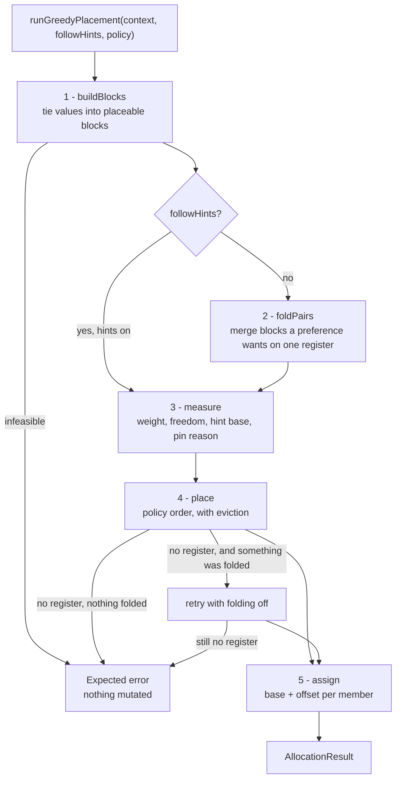
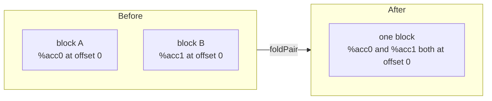

# The greedy allocator

Weighted first-fit with eviction. Three registered names share one implementation, differing only in two flags and a placement policy.

- [Register allocation](register-allocation.md) — the framework this plugs into, including the scope axes of `AllocationScope` (section 3) and the rules table (section 14)
- [SSA representation](ssa-representation.md) — values, use lists, `AllocationResult`
- [Lift Asm registers to SSA](lift-asm-registers-to-ssa-pass.md) — where the `PhysicalBinding` hints come from

## 1. Three names, one implementation

| Registered name | Class | Hints | Policy | Purpose |
|---|---|---|---|---|
| `greedy` | `GreedyAllocator` | follow | weight | prefer the register the producer chose; reproduces the input |
| `greedy-compact` | `CompactingGreedyAllocator` | ignore | weight | pack from the bottom, which is how the high-water mark comes down |
| `greedy-compact-freedom` | `FreedomOrderedGreedyAllocator` | ignore | freedom | the same, ordered by how boxed-in a block is rather than how hot |

All three are thin wrappers over one file-private `Greedy` class, reached through `runGreedyPlacement(context, followHints, policy)`. All three report an empty `AllocatorCapabilities`:

- `mayRecolourMerges = false` — an affinity set keeps a merge and its incoming values on one register, so lowering never needs a copy on a merge edge;
- `maySpill = false` — no range is ever split, so there is nothing for scratch or waitcnt to integrate.

Both flags false is what makes the output applicable at all, so no variant can be refused by the capability gate.

A policy never sees a rule and never sees an architecture. It queries `context.rules`, so every variant — and anything added later — is subject to every Active rule of whatever chip it runs on. Placement goes through `reachableAt`; preference goes through `pickBase`, shared by placement and eviction (section 6.1).

A function with no SSA values returns an empty `AllocationResult`, not an error.

## 2. Five phases



Every refusal is an `Expected` error naming the kernel. The driver mutates nothing on failure, so a refused greedy run is indistinguishable from one that never ran.

Two things about that diagram are worth saying out loud.

**Folding only happens with hints off.** Hint-following exists to reproduce the producer's numbering. Folding two blocks the producer kept apart leaves them with no hint they agree on, so the run would stop reproducing anything, which is the one thing it is for.

**A fold never decides whether a kernel colours.** Folding asks placement for one long run of registers where two shorter runs would have done. If that is what refused the colouring, the whole run is retried with folding off. A soft rule may make a colouring better; it may not make it impossible.

## 3. It places blocks, not values

Two constraints tie values together, and both must hold at once:

| Constraint | Requirement | Expressed as |
|---|---|---|
| `tupleRuns()` | unit *i* of an operand sits at `base + i` | `relate(first, unit_i, i)` |
| `affinitySets()` | a merge and its incoming values share one register | `relate(first, member_i, 0)` |

Both have the shape *b sits δ units from a*, so a single union-find that carries an offset to its root absorbs both. Each resulting class becomes a **block**: a contiguous span whose members sit at fixed offsets and which is placed as a unit.

Solving them together is required, not tidier, because tuple runs overlap in real code:

```text
v[4:7] = ds_load_b128(...)      run A: %2 %3 %4 %5 consecutive
ds_store_b64(..., v[4:5])       run B: %2 %3       consecutive
v4     = v_add_f32(...)         defines %6
ds_store_b128(..., v[4:7])      run C: %6 %3 %4 %5 consecutive
```

Runs A and C force `%2` and `%6` onto the *same* offset — a partial overwrite of a wide range must land where the original unit went. Honouring each run on its own would let a later placement silently break an earlier one.

After grouping, each block is normalised: its lowest offset becomes 0, `width` is `highest - lowest + 1`, members are sorted by `(offset, value)`, and the leader is the smallest member ID. Nothing downstream depends on which value happened to become the union-find root.

### 3.1. What a block carries

Beyond its members, a block records four things the policies read:

| Field | Meaning |
|---|---|
| `weight` | how hot the block is; see section 5 |
| `maxIndex` | the tightest ceiling any member is under, when an operand field cannot reach the whole file |
| `placementFreedom` | how many bases the block could legally take, ignoring who holds them |
| `preferences` | indexes into `constraints.preferences()` naming one of its members |

`placementFreedom` is one number for how boxed-in a block is. An unconstrained single register has the whole file; an 8-wide range restricted to even bases has about half of it; a 2-wide range capped to the first bank has an eighth. That single number is what lets the freedom policy replace a special case (section 5.1).

### 3.2. Rejected before any placement

| Check | Condition | Message |
|---|---|---|
| Offset contradiction | two runs imply different offsets for one pair | `operands disagree about where %6 sits relative to %2` |
| Merge vs operand | an affinity set needs δ 0 where a run needs δ ≠ 0 | `a merge needs %9 and %5 on one register, but an operand needs them apart` |
| Mixed class | members of one block are in different classes | `%3 is class s but is tied to %2 in class v` |
| Class not allocated | `indexCount(class) == 0` | `%2 is class a, which this target does not allocate` |
| Too wide | `width > indexCount(class)` | `values tied to %2 span 9 registers, more than the 8 v registers ...` |
| Same offset, both live | two members share an offset and their ranges overlap | `%2 and %6 are forced onto one register by their operands but are live at the same point` |
| No legal base | every index is forbidden by an Active `forbidsBase` rule | `no s base is legal for %2: rule ScalarTupleAlignment (...)` |

Two members sharing an offset is legal — it is the overlapping-run case above — and is sound exactly while their ranges are disjoint. The last-but-one check is what enforces that, before placement rather than during it. The last check is `checkFeasible` consulting the table so a block that can *never* be placed names the rule instead of exhausting every base and reporting "no register is free".

## 4. Folding a pairing

A pairing rule says two values would rather share a register (see [register allocation](register-allocation.md) section 14). There are two ways to grant that wish, and this is the stronger one: put both values in one block, so they share by construction rather than by luck of placement order.



`foldPairs()` walks every preference and tries `foldPair` on each. Folding is deliberately conservative — it declines in six cases, and every decline simply leaves the pairing to scoring instead:

| Declines when | Why |
|---|---|
| the rule does not want one register | asked as `satisfiedBy(k, k)`: would a single register satisfy you? A rule wanting its pair merely *near*, or *apart*, says no |
| the two are already in one block | nothing to do |
| either block is pinned | folding would drag the partner onto a fixed register, deciding the colouring instead of preferring one |
| the ceilings differ | a ceiling belongs to the one value whose field cannot reach past it; folding would apply it to every member, and one capped scale operand could confine a whole accumulator chain to the first bank |
| two members would land on one register while both live | that is a real conflict, not a preference |
| the folded block has no legal base | it could never be placed |

That first row is the neat part: because folding means "one register", asking a rule about a key against *itself* asks exactly the right question. Nothing in the allocator needs to know what any rule means.

Folding cannot produce a wrong colouring — two values are folded only when their ranges are disjoint at every register they would share. It can only ask more of placement, which is what the retry in section 2 is for.

## 5. Order: weight and freedom

Order is most of the policy, and a policy is three small decisions:

```cpp
struct PlacementPolicy {
    const char* name;
    bool (*placesEarly)(const Block&);                       // ahead of the queue
    bool (*placesBefore)(const Block& lhs, const Block& rhs); // order within it
    bool (*mayEvict)(const Block& evictor, const Block& occupant);
};
```

Function pointers rather than virtuals: a policy is three stateless decisions, and this way each lives entirely in its own file while the engine branches on none of it. Invariants that are *not* a matter of policy stay in the engine — it decides that a pinned block never moves and that nothing is evicted past `kMaxEvictionsPerBlock`; the policy only answers which of two blocks has the stronger claim.

Weight itself is the same in both policies:

```text
weight(block) = Σ over members:  useCount × 10^min(depth, 4) / max(1, length)
```

| Term | Source |
|---|---|
| `useCount` | `StinkySSAValue::useCount()` |
| `depth` | how many loops in `AllocationContext::loops` contain the member's defining block |
| `length` | `LiveRange::length()` |

| Constant | Value | Role |
|---|---|---|
| `kLoopWeight` | 10.0 | multiplier per loop level |
| `kMaxLoopDepth` | 4 | depth stops growing here |
| `kMaxEvictionsPerBlock` | 2 | per-block eviction cap |

Depth enters as a *multiplier*, not a factor. Written literally as `useCount × depth / length` it would zero every value outside a loop. As it stands, a short range read often inside a loop outranks a long-lived value read once, which is the usual block-frequency intuition without a frequency analysis to draw on.

### 5.1. The two policies compared

| | `weight` | `freedom` |
|---|---|---|
| `placesEarly` | blocks with a ceiling, in a phase ahead of the queue | nothing; the order already says it |
| `placesBefore` | heaviest first, ties by leader | fewest legal bases first, then weight among equals |
| `mayEvict` | a strictly heavier block, and never a capped occupant | a block with fewer places to go displaces one with more |

The difference is a special case versus a principle. A capped block is confined to one bank that every low-packing block competes for, and weight order reaches it far too late — so the weight policy needs a phase ahead of the queue, and has to refuse to evict a capped occupant as well, since evicting one returns it to the worklist where the same ordering failure happens again one block at a time.

The freedom policy needs neither. A ceiling is simply a small `placementFreedom`, so ordering by freedom says what the phase was saying. Weight still decides between blocks that are equally free, which is most of them: an unconstrained single register has the whole file, so singles tie and sort exactly as before.

## 6. Placement and candidates

```text
place every pinned block at its hint base          # refuses the function if it cannot
sort the rest by policy.placesBefore
while worklist:
    b = pop
    if b is already placed: continue
    if tryPlace(b): continue
    base = lowest base whose occupants policy.mayEvict allows
    if there is none, or the global budget is spent: refuse the function
    unbind every occupant at base, requeue it, then bind b
```

Pinned blocks go first, so a freely placed block sees the registers it cannot move as already taken.

| Pin reason | Trigger | Note |
|---|---|---|
| `a function live-in` | any member is `isPinned()` | holds in every policy; a compacting run may not trade it away |
| `in a class this run is not colouring` | class outside `AllocationScope::classes()` | this is how one class moves while the rest stay put |
| `outside the region this run is colouring` | live range not contained in `AllocationScope::regionCut()` | this is how `regionEnd` keeps the remainder byte-identical |
| `in a register this run is holding` | a register named by `pinRegisters` | keeps the value lifted into it and takes no other |
| `in a register an operand with no VGPR bank selector names` | `holdUnbankableOperands`, under `unbankable=hold` | the producer's choice is known reachable; under `unbankable=allocate` these are placed under a ceiling instead |

One pinned member fixes the whole block, since members sit at fixed offsets from each other. A pinned block that cannot take its base refuses the function, and the message says which case it is:

```text
@kernel: %1 is a function live-in, so it must keep its original register, but it has none recorded
@kernel: %1 is a function live-in, so it must keep its original register, but v20 is already taken
@kernel: %1 is a function live-in, so it must keep its original register, but v300 is not allocatable
```

`already taken` versus `not allocatable` is exactly the `availableAt` / `reachableAt` split below.

`tryPlace` tries two candidates, in order:

1. the block's **hint base**, when `followHints` is set and it is available;
2. **`pickBase`**, which is first fit when nothing prices the choice and cheapest-base otherwise.

A hint base exists only when every member has a `PhysicalBinding` in the block's class, each `idx` is at least its own offset, and all members agree on `idx - offset`. Any disagreement drops the hint entirely.

Availability is asked in two separate steps:

| Test | Asks |
|---|---|
| `reachableAt` | the run fits the class, every index is allocatable and under any ceiling, no Active `forbidsBase` veto, and a held register takes only the value lifted from it |
| `availableAt` | `reachableAt`, plus every member's range is conflict-free in the matrix |

Keeping them apart is what lets a refusal say whether a register is off limits or merely occupied.

### 6.1. `reachableAt` and `pickBase`

`reachableAt` is the single funnel every candidate base passes through — `availableAt`, the evictable-base search, and the pinned path all reach it — so one call subjects placement, eviction, and hint-following to an Active `forbidsBase` rule at once. A held register is the same funnel (`mayOccupy`): a value not lifted from that register cannot sit there, including during eviction.

When `place()` still has no register, the message names a rule that narrowed the search rather than blaming pressure alone: `no s register is free for %41 ... (rule ScalarTupleAlignment also forbids some bases)`.

`pickBase` is shared by `tryPlace` and the evictable-base search on purpose. A preference honoured in placement and ignored in eviction is worse than none: the allocator would spend an eviction to reach a base it was told to avoid.

It scores a base two ways, and both come from the rules table:

```text
costAt(block, base) = baseCost(class, base, width)            # an index that is legal but worse
                    + Σ benefit of each preference this base leaves unmet
```

Preferences are resolved once per `pickBase` call rather than per candidate, and only pairings whose partner is *already placed* count — a block whose partners are all still unplaced scores the same everywhere, so it takes the first-fit path instead of scanning to find that out.

Without an Active price and with no open pairing, `pickBase` is plain ascending first-fit, early exit included, so a chip with no preference keeps exactly today's colouring. With one it takes the cheapest acceptable base, ties going to the lower index so the result stays deterministic. Costs from several Active rules simply sum, so magnitude is load-bearing in a way a veto's is not — calibrate within one chip's table and never across two.

The scan stops as soon as a base costs nothing, since penalties are never negative and zero is the best any base can do. That early exit is why a preference's `benefit` must never be negative.

Two things deliberately *not* priced. A hint still wins outright when it is available and hints are on: following it reproduces the producer's numbering, which the whole shadow-comparison workflow rests on. And a price where the hardware wants a veto is the wrong channel: the compacting policies run with `followHints=false`, and a price binds only policies that ask; the policy most likely to break a placement rule is the one most likely to ignore a preference.

`forbidsBase` sees no instruction. Placement is decided per block of tied values, so a placement rule over-constrains every block of that class and width. [Register allocation](register-allocation.md) section 14.4 is why that is structural rather than an omission.

## 7. Eviction

Eviction is what makes this greedy rather than linear assignment.

A base is evictable when it is `reachableAt`, has at least one occupant, and *every* occupant is:

- not pinned;
- allowed by `policy.mayEvict` — strictly lighter under the weight policy, or less boxed-in under the freedom policy;
- still under `kMaxEvictionsPerBlock`.

The lowest such base wins. Occupants are unbound, counted, and requeued.

Termination needs more than the ordering. Work only ever moves to a block the policy ranks lower, but a requeued block can displace a third one, so a per-block cap plus a global budget of `blocks × kMaxEvictionsPerBlock + 1` bounds the total number of evictions.

With no evictable base the function is refused — there is no splitting and no spilling:

```text
@kernel: no v register is free for %41 and the 3 register(s) tied to it;
         splitting and spilling are not implemented
```

## 8. Why `greedy` reproduces the input

**Hint-following cannot lower the high-water mark.** The hint is the producer's own register, the producer's colouring is legal, and a legal colouring never puts two overlapping values on one register — so every block finds its hint free, `pickBase` is never reached, and the output matches the input value for value.

A difference therefore means a hint was *unreachable*: an index past `indexCount`, reserved, or past a ceiling. It never means the hint was contended.

That is the point of the default — a shadow comparison shows genuine pressure rather than churn. The compacting variants skip step 1 of `tryPlace` and pack from the bottom, which is the only way the number comes down, at the cost of renumbering everything: that obscures a shadow diff and hands the post-RA hazard passes a denser schedule.

Pinned blocks treat the hint as a requirement in **every** policy, since that is what pinned means.

## 9. Determinism

The same input yields the same colouring. Five things guarantee it:

- members sorted by `(offset, value)`;
- the leader is the smallest member ID, not the union-find root;
- blocks the policy ranks equally are ordered by leader;
- folding walks preferences in table order;
- first fit and the evictable-base search both scan up from index 0.

`GreedyAllocatorTest.ColouringIsDeterministic` covers this, and `HintIsHonouredSoASimpleFunctionMatchesLegacy` covers section 8. `AllocationRulesTest.APreferenceChangesPlacementWithoutForbiddingAnything` covers a `baseCost` that is not a mere function of the index, `PlacementBlocksEvictionToo` covers a veto that `reachableAt` applies to eviction as well as placement, and the folding tests cover a fold that widens a block, a fold that gives way rather than refusing, and the same chain folding under `greedy-compact-freedom`.
