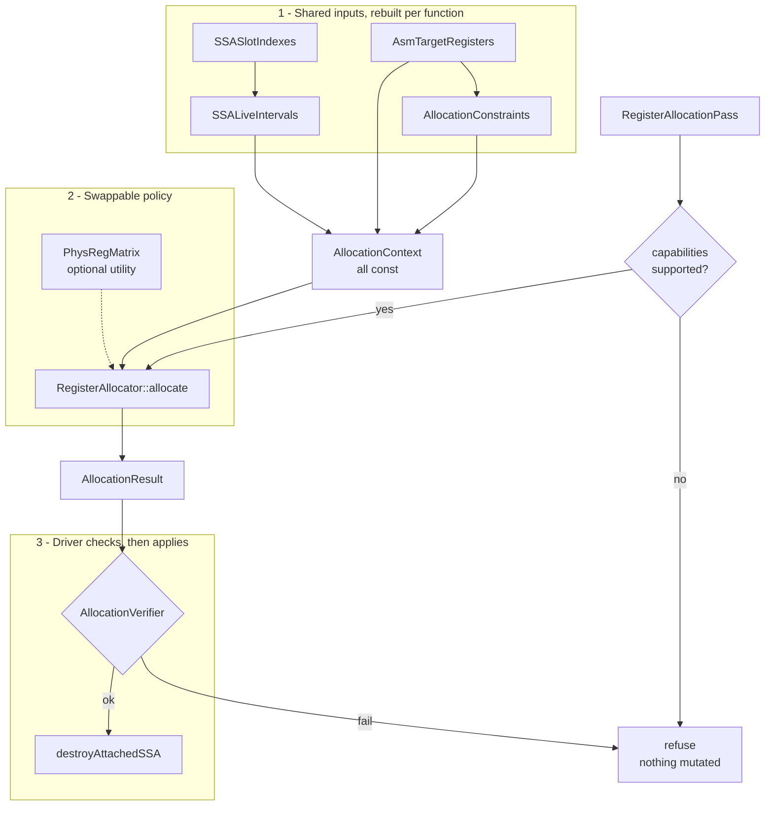
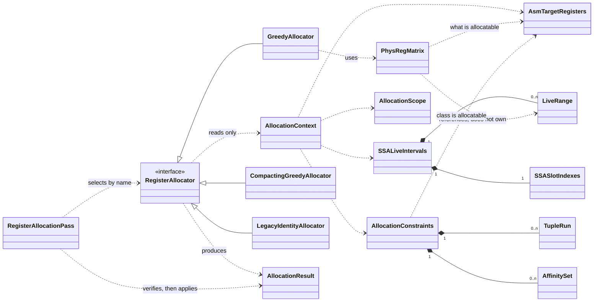
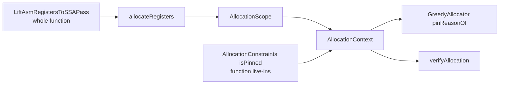
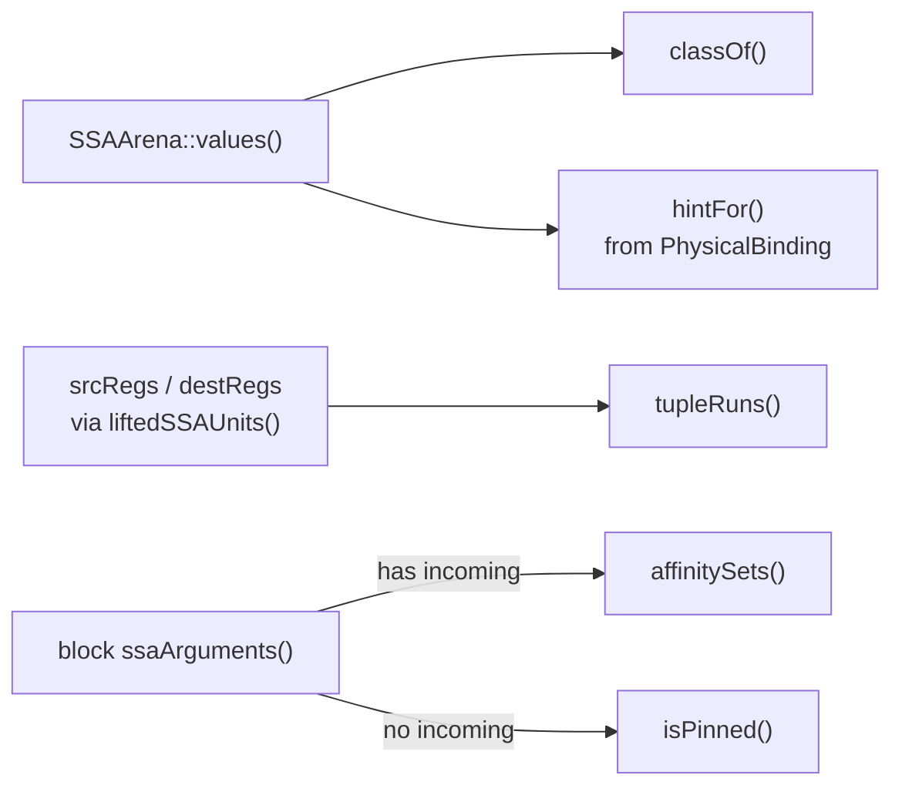
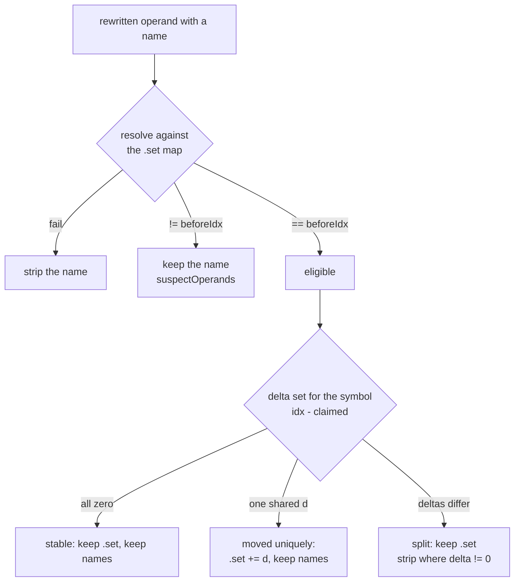

# Register allocation on attached SSA

How a colouring policy plugs in, what it may read, and what it must not touch.

- [SSA representation](ssa-representation.md) — values, use-lists, block arguments, `AllocationResult`, `destroyAttachedSSA`
- [Lift Asm registers to SSA](lift-asm-registers-to-ssa-pass.md) — how physical `RegKey`s become those values
- [The greedy allocator](register-allocation-GreedyAllocator.md) — `greedy` and `greedy-compact`, the policies behind this interface

## 1. The contract

Take a function carrying attached SSA, return an `AllocationResult`: every `StinkySSAValue` mapped to a physical `RegKey`.

Two terms recur throughout and mean one thing each:

| Term | Meaning |
|---|---|
| **the producer** | Whatever emitted the input assembly: TensileLite, through rocisa. Unusually for a compiler input, it has already assigned every physical register by hand. |
| **the producer's colouring** | Those original registers. Lifting records each one on its value as a `PhysicalBinding`, and `createLegacyColoring()` is the colouring that hands every value straight back the register the producer chose. |

The registers an input arrives with are therefore variable names and placement hints, not a final assignment — `hintFor()` offers them to a policy, which is free to place a value elsewhere.

Three rules hold for every policy.

| Rule | Consequence |
|---|---|
| `destroyAttachedSSA` is the only writer of `srcRegs` / `destRegs` | a policy never touches an operand, `setPhysicalBinding`, or a use-list |
| A refused colouring changes nothing | operands and attached SSA are left exactly as the lifter produced them |
| Every value must be assigned | a class a policy will not *move* is pinned to its original register, not skipped |

The third rule is easy to miss and shapes everything else: the verifier and destruction both demand a *total* colouring, so "leave this class alone" is expressed by assigning it the register it already had.

## 2. Framework

The policy is one replaceable object; everything around it is shared. A new policy is a class plus a registration line.



Two refusal points, and the driver owns both. A policy that never runs and a colouring that is rejected leave identical IR behind.

```cpp
/// Everything an allocator may read. Const on purpose: no allocator mutates IR.
struct AllocationContext {
    const Function& function;
    const SSALiveIntervals& intervals;
    const AsmTargetRegisters& target;
    const AllocationConstraints& constraints;
    const std::vector<Loop>& loops;
    AllocationScope scope;           // classes and optional slot prefix this run may move
};

/// What lowering must support for this allocator's output to be applicable.
struct AllocatorCapabilities {
    bool mayRecolourMerges = false;  // needs copy insertion on merge edges
    bool maySpill = false;           // needs scratch and waitcnt integration
};

class RegisterAllocator {
   public:
    virtual const char* name() const = 0;
    virtual AllocatorCapabilities capabilities() const = 0;
    virtual Expected<AllocationResult> allocate(const AllocationContext&) = 0;
};
```

Everything but `function` is rebuilt on each call, in this order — `constraints` keeps a reference to `target`, so the order is not free:

| Field | Built by |
|---|---|
| `intervals` | `computeSSALiveIntervals(function)` |
| `target` | `AsmTargetRegisters::forFunction(function)` |
| `constraints` | `AllocationConstraints::build(function, target)` |
| `loops` | `detectLoops(function)` |
| `scope` | `AllocationScope::wholeFunction`, or `upTo` when `regionEnd` is set |

A policy decides two things: which value to colour next, and which candidate to take when the first is occupied. It does not derive legality from operands, does not verify, and does not apply.

| Responsibility | Owner |
|---|---|
| program points, live ranges | `SSASlotIndexes`, `SSALiveIntervals` |
| which registers exist and may be handed out | `AsmTargetRegisters` |
| tuple runs, merge affinity, hints, pinning | `AllocationConstraints` |
| who occupies a register over which range | `PhysRegMatrix` (a utility, not part of the interface) |
| candidate choice and ordering | the policy |
| capability gate, verification, application | `RegisterAllocationPass` / `allocateRegisters` |

`AllocatorCapabilities` is the seam that stops a policy producing a colouring lowering cannot apply. `destroyAttachedSSA` rejects a merge whose inputs and result differ, and nothing implements spilling, so both flags must be false to be applicable.

How the types relate — solid is ownership, dashed is a reference:



`AllocationContext` reaches only the shared side, so a policy cannot see the IR it must not mutate.

Where all of it lives, under both `include/stinkytofu/` and `src/`:

| Directory | Contents |
|---|---|
| `ir/asm/ssa/` | the SSA data model, plus `AllocationResult`, the colouring a policy returns |
| `ir/asm/` | `SymbolicRegName` (the name grammar) and `AsmSetSymbolMap` (`.set` collection), both read by symbol sync in section 11.1 |
| `analysis/asm/ssa/` | `SSASlotIndexes`, `SSALiveIntervals`, `computeFunctionShape` |
| `transforms/asm/ra/` | this pass, the registry, the verifier, `AllocationConstraints`, `AllocationScope`, `PhysRegMatrix`, `RegisterSymbolSync`, `createLegacyColoring`, and the policies under `allocators/` — those are private to `src/`, since selection is by name |
| `transforms/asm/ssa/` | the lift pass and `destroyAttachedSSA`, the two ends of the SSA lifetime |

### 2.1. Selection

`AllocatorRegistry` maps a name to a factory, mirroring `BackendRegistry` including the `registerAllAllocators()` guard against dead-stripping in static builds. One pass serves every policy, and `stinkytofu-opt` exposes the options as a comma-separated list:

```text
--RegisterAllocationPass=allocator=greedy-compact,classes=v,regionEnd=C,apply,report
```

| Option | Meaning |
|---|---|
| `allocator=<name>` | `greedy` (default), `greedy-compact`, `legacy` |
| `classes=<vs>` | class axis of allocation scope; see section 3 |
| `regionEnd=<label>` | region axis: only values whose live range ends at or before this block may move (`^` prefix optional). Empty = whole function. See section 3.2 |
| `apply` | write the colouring through `destroyAttachedSSA`; without it the pass is a shadow colouring |
| `report` | emit peak / highest / `regionPeak` as an analysis remark (`--remarks`) |
| `emitRegisterMap` | with `apply`, insert a producer→allocated map as a TEXTBLOCK at the entry block; see section 11.3 |
| `emitSymbolBreadcrumbs` | with `apply`, note on each instruction whose operand lost a symbolic name; see section 11.3 |
| `noVerify` | skip the verifier — a testing hatch, not a production switch |

Conformance tests are parameterized over `registeredAllocatorNames()`, so registering a policy is what subscribes it to the suite.

## 3. Scope: what a run may relocate

Three answers, two of them on `AllocationScope` (this run's remit) and one on the
arena (what even exists as SSA). Remit is not folded into `isPinned()`: that
accessor is legality — a colourer that ignores it produces wrong code rather than
a slower kernel.

| | Lift | Allocation, class | Allocation, region |
|---|---|---|---|
| Where | `SSAArena::liftedClasses()` | `AllocationScope::classes()` | `AllocationScope::regionCut()` |
| Question | which classes became SSA values | which lifted classes may *move* | which of those values may *move* |
| Outside it | no values, never rewritten | original register | original register |
| Set by | `LiftAsmRegistersToSSAOptions::classes` | `RegisterAllocationOptions::allocate` | `RegisterAllocationOptions::regionEnd` |



Three reasons a value cannot move, in the order greedy reports them:

| Reason string | Source | Kind |
|---|---|---|
| `a function live-in` | `AllocationConstraints::isPinned()` | legality |
| `in a class this run is not colouring` | class axis of `AllocationScope` | remit |
| `outside the region this run is colouring` | region axis of `AllocationScope` | remit |

Pinned / immobile blocks are placed first and are never evictable. The verifier
checks both pin and scope, then still binds the occupant so a mobile value
overlapping that register is caught.

### 3.1. Class

Narrow the lift when a class should be invisible — cheaper, and nothing about it
is analysed. Narrow allocation when a class should be *measured but not moved*:
lift both classes and colour one, and the other's intervals and peak pressure
are still available.

The allocation set must be a subset of the lift, so a request for a class with
no values is reported rather than silently colouring nothing:

```text
@kernel: asked to allocate v but this function was lifted for s
```

The default is VGPRs alone. Scalar tuple alignment is not modelled and no ABI
range is reserved, so moving SGPRs needs an explicit opt-in:

```bash
--LiftAsmRegistersToSSAPass=classes=s \
--RegisterAllocationPass=allocator=greedy,classes=s,apply
```

### 3.2. Region

Lift the whole function, then relocate only values whose live range lies in a
slot prefix ending at a named block. The remainder keeps the producer's
registers. No copy insertion, no partial lift.

Because section 4 numbers the function in block-list order, a prefix of the
block list *is* a prefix of the slot space, and the region is one integer:

```text
entry → A → B → C → D → E
[--------- region R --------][-- remainder --]
                             cut = blockEnd(C)
```

`cut` is `intervals.slots().blockEnd(endBlock)`. The pass uses `ContainedIn`;
`DefinedIn` exists on `AllocationScope::upTo` for tests and custom drivers only.

| Containment | Test | Used by |
|---|---|---|
| `ContainedIn` (default) | `rangeOf(id).end() <= cut` | `RegisterAllocationPass` when `regionEnd` is set |
| `DefinedIn` | `rangeOf(id).start() < cut` | `AllocationScope::upTo(..., DefinedIn)` only |

| Value | Live range vs cut | Result |
|---|---|---|
| defined and used only in `R` | `end() <= cut` | may move |
| defined in `C`, used in `D` | range crosses the cut | immobile; `D` stays byte-identical |
| defined in `D` or `E` | range starts after the cut | immobile, but does not overlap `R`, so `R` may reuse those registers |
| live across a backedge `E → B` | range extends past the cut | immobile — no CFG-closure check needed |

No `s_mov` / `v_mov`. Every use is an SSA use, so `destroyAttachedSSA` rewrites
them consistently. A physical/SSA seam never exists inside the function.

`greedy` follows hints and reproduces the input, so a region is a no-op.
`legacy` assigns every hint. **`greedy-compact` is the policy that relocates.**

`regionPeak` is pressure over `[0, cut)`. `highest` still walks every assigned
value, including pinned tail values, so compacting `R` cannot lower the kernel's
declared count unless the function peak is inside `R`.

`PassContext` block filtering still refuses ("skip this block"): allocation
needs a total colouring. Region scope means *colour everything, relocate only
these*.

Not a partial lift, not copy insertion, not an occupancy tool unless
`regionPeak` shows the peak is inside `R`.

### 3.3. Use

```bash
# VGPRs whose live range ends at or before ^C; D and E stay as written.
stinkytofu-opt kernel.stir \
  --LiftAsmRegistersToSSAPass=classes=v \
  --RegisterAllocationPass=allocator=greedy-compact,classes=v,regionEnd=C,apply,report \
  --DumpStinkyModulePass=stdout \
  --remarks
```

```bash
# Same for SGPRs. Lift and allocate must name the same class.
stinkytofu-opt kernel.stir \
  --LiftAsmRegistersToSSAPass=classes=s \
  --RegisterAllocationPass=allocator=greedy-compact,classes=s,regionEnd=C,apply
```

`regionEnd=^C` and `regionEnd=C` are equivalent. Pick the label from a dump
(`^label:` lines). An unknown label refuses: `region end block 'X' was not found`.

```cpp
pm.addPass(createRegisterAllocationPass(RegisterAllocationOptions{
    .allocator = "greedy-compact",
    .allocate = RegClassSet::only(RegType::S),
    .regionEnd = "C",
    .applyToOperands = true,
    .report = true,
}));
```

The gfx1250 pipeline lifts and colours SGPRs when `kDumpRegionSSA` is true in
`src/pipeline/backend/Gfx1250Backend.cpp`: `greedy-compact` over a region ending
at `label_ArgType3_Routed_To_ArgType0`, applied, with breadcrumbs on. Clear
`.regionEnd` there to colour the whole function. Dumps next to the working
directory:

| File | What to check |
|---|---|
| `<module>_kernel_ssa.stir` | SSA form; pick `regionEnd` from `^label:` |
| `ssa_live_out.txt` | live ranges and function peak |
| `kernel_before_replay.stir` | physical IR before colouring |
| `kernel_after_replay.stir` | physical IR after `apply` |

Diff before vs after: blocks after the cut must be identical; blocks in the
region may change under `greedy-compact`. A miss names the reason (unknown
label, class mismatch, or `no s register is free for ...`).

```bash
./build/tests/unit_tests --gtest_filter="AllocationScopeTest.*:GreedyAllocatorTest.RegionScopeKeepsTailBlocksByteIdentical:RegisterAllocationPassTest.RefusesAnUnknownRegionEndBlock:RegisterAllocationPassTest.ShadowReportIncludesRegionPeak"
```

| Test | Asserts |
|---|---|
| `AllocationScopeTest.*` | class vs region, `ContainedIn` vs `DefinedIn`, backedge extends past the cut |
| `AllocationVerifierTest.CatchesARelocatedValueOutsideRegion` | region remit is machine-checked |
| `GreedyAllocatorTest.RegionScopeKeepsTailBlocksByteIdentical` | `entry→A→B→C→D→E`, `D`/`E` byte-identical, a region-only value compacted |
| `RegisterAllocationPassTest.RefusesAnUnknownRegionEndBlock` | missing label is an error |
| `RegisterAllocationPassTest.ShadowReportIncludesRegionPeak` | report contains `regionPeak=` |

## 4. Coordinates: slot indexes

`computeSSASlotIndexes()` numbers the function in block-list order, which is emission order. Each instruction gets **two** consecutive indexes; each block a leading pair.

| Index | Meaning |
|---|---|
| `blockStart(B)` | a value live into `B` starts here |
| `blockStart(B) + 1` | `B`'s arguments are defined here (`blockArgDef`) |
| `useSlot(I)` | `I` reads its operands |
| `useSlot(I) + 1` | `I` writes its results (`defSlot`) |
| `blockEnd(B)` | one past `B`'s last index |

Blocks tile the space with no gaps, so layout-adjacent blocks are numerically adjacent. Block `B` with two instructions, then `C` with one:

```text
        block B                     block C
slot    0u  1d │ 2u  3d │ 4u  5d ││ 6u  7d │ 8u  9d
        args   │   I0   │   I1   ││ args   │   I2
```

A dump tags each index with the half it names: `u` for the read point, `d` for the write point. The letter is a *position*, not a claim about a value — `d` does not mean "defined here". LLVM does the same with four sub-slots per instruction (`B`, `e`, `r`, `d`) where this has two.

Ranges are half-open, which gives two rules:

- a value defined by `I` starts at `I`'s `d` point;
- a value last read by `I` ends at `I`'s `d` point, so it is still live at `I`'s `u` point where the read happens.

**Why two slots per instruction matter.** At `v40 = wmma(..., v40)` the old value ends at the `d` point and the new one starts there: they touch without overlapping, so both can live in `v40`. Collapse the pair into one index and they would overlap, no policy could share the register, and even the identity colouring would fail verification.

No policy queries slot indexes directly; they are the coordinate system intervals are expressed in.

## 5. Live intervals

`computeSSALiveIntervals()` produces ranges over `StinkySSAValue`, which is what decides whether two values may share a register. A `LiveRange` is a sorted list of half-open segments.

| Query | Use |
|---|---|
| `rangeOf(id)` | the value's live range |
| `overlap(a, b)` | may `a` and `b` share a register |
| `LiveRange::length()` | denominator of a spill weight |
| `peakPressure(class)` | pressure floor per class |

Where a value's range starts:

- `Kind::Register`: at `defSlot(defOp())`; each entry in `uses()` is a read at `useSlot(owner())`.
- `Kind::BlockArgument`: at `blockArgDef()` of its block. Incoming values are consumed on the predecessor **edge** — live to the end of that predecessor, not inside the join — which is why a merge and its inputs can share one register.

```text
liveOut[B] = union of liveIn[successors] + values used on B's outgoing edges
liveIn[B]  = uses in B whose def is elsewhere + (liveOut[B] - defs in B)
```

A range is a *set* of segments rather than one span, because a value can be dead across a region and live again after it.

### 5.1. Worked example

`tests/filecheck/lift_asm_registers_to_ssa_diamond.stir`, dumped by `DumpStinkyModulePass` with `ssaLiveOut` set:

```text
^entry:  v9 = v_add_f32(v20, v21)      Successors: ^left, ^right
^left:   v5 = v_add_f32(v22, v23)      Successors: ^join
^right:  v5 = v_add_f32(v24, v25)      Successors: ^join
^join:   v6 = v_add_f32(v5, v9)
```

```text
slots=22 values=13
%1:v [1d,5d)     %2:v [1d,5d)     %3:v [1d,3d)     %4:v [1d,3d)
%5:v [1d,11d)    %6:v [1d,11d)    %7:v [1d,8u) [14u,17d)
%8:v [1d,8u) [14u,17d)            %9:v [19d,21d)   %10:v [3d,21d)
%11:v [17d,18u)  %12:v [11d,14u)  %13:v [21d,22u)
peak v=8
```

Four things to read off it:

| Observation | Why |
|---|---|
| `%3 [1d,3d)` is `v20` | born as an entry argument at 1, killed by the add that reads it at 2 |
| `%10 [3d,21d)` is `v9` | defined at 3, not read until the join at 20, so live across the diamond |
| `%7`, `%8` have a **hole** | `v24`/`v25` are read only by `^right`, but `^left` sits between in layout order; one span would hold two registers across a block that needs neither |
| `%9`, `%11`, `%12` never overlap | the merge starts at `19d`, each incoming ends at its own arm's end, so one register holds all three and no copy is needed |

`peak v=8` is measured at slot 1, where all eight live-ins are live at once.

Peak pressure comes off the same segments, so there is no separate pressure analysis. It is a *lower bound*: it ignores tuple fragmentation, so a peak of 40 DWORDs can still fail if 4-DWORD operands do not fit the free runs. It is also not occupancy — `getWavesPerSimd()` takes the final allocated count.

`SSALiveIntervalsAnalysis` caches the result and is deliberately absent from `preserveCFGAnalyses()`: reordering instructions or rewriting operands invalidates intervals even when the CFG is untouched.

## 6. Interference: the physreg matrix

`PhysRegMatrix` records which live ranges occupy each allocatable unit `(RegType, idx)`. Interference is asked of a *register*, not of a pair of values, so no interference graph exists.

Each unit holds a **list** of bindings, which is what lets several values share one register:

```text
class          index      bindings: value + range (borrowed from SSALiveIntervals)
V ──────────▶  v0    ──▶  (empty)
               v1    ──▶  %12 [11d,14u)   %31 [17d,21d)   ← disjoint, both legal here
               v2    ──▶  %7  [1d,8u) [14u,17d)
S ──────────▶  s0    ──▶  %40 [3d,9d)
```

Construction takes the class set from `target.allocatableClasses()` and sizes each class to `indexCount(class)`, so a class the target allows can never be silently skipped.

| Query | Purpose |
|---|---|
| `available(class, idx, range)` | allocatable, and nothing bound there is live where `range` is |
| `collectConflicts(class, idx, range, out)` | *who* the conflict is with — what an evicting policy needs |
| `runAvailable(class, base, width, range)` | every unit of `[base, base+width)` is free, and the run stays inside the class |
| `findFreeRun(class, width, range)` | lowest such base, scanning up from 0. First-fit, no alignment applied |
| `bind` / `unbind` | `unbind` is silent when the value does not hold the unit, so undoing a partial tuple needs no bookkeeping |
| `highestBound(class)` | the width a resource descriptor cares about, which is not the peak pressure |

`available()` is the whole legality test, and it is three checks:

1. the target calls `(class, idx)` allocatable — this is also what excludes reserved ranges;
2. the class has storage and `idx` is inside it;
3. no binding already on that unit has a range overlapping the candidate's.

Two consequences of the borrowed ranges. `SSALiveIntervals` must outlive the matrix, and `bind` deletes its rvalue overload, so passing a temporary range is a compile error rather than a dangling pointer — the query methods take temporaries safely, since they only read during the call.

Only allocatable classes have storage. EXEC, VCC, SCC, M0, literals, and memtokens are not values and never occupy a unit; VCC and EXEC are their own `RegType`, so colouring SGPRs cannot alias them by index.

The matrix is a utility rather than part of the interface: a linear-scan or graph-colouring policy may want a different structure and should not pay for this one.

## 7. Target registers

`AsmTargetRegisters` answers which registers may be handed out. It sits beside `ArchHelper` rather than under `analysis/`, because it derives nothing from the IR — it is architecture description. Every limit comes from the architecture's own `DEF_ARCH` block in `hardware/src/gfx/<Arch>/<Arch>Formats.def`:

| Field | Meaning |
|---|---|
| `.maxVGPR`, `.maxSGPR`, `.maxAGPR` | indexes an operand can encode → `indexCount(class)` |
| `.totalVgprPerSimd` | physical register file → `totalPerSimd(class)` |
| `.vgprAllocGranule` | step occupancy is measured in → `allocationGranule(class)` |

Nothing is keyed on an architecture, so supporting a target means editing that target's `.def`.

**`indexCount()` and `totalPerSimd()` are different numbers.** The first is what an operand can encode; the second is the physical file, which can be several times larger. Reaching the rest of that file needs high-register encoding, which is not modelled, so a kernel whose pressure exceeds the addressable range has no colouring here.

`forFunction()` reads `SSAArena::liftedClasses()`, so allocatable classes are exactly the lifted ones — a class the lifter cannot model and a class this lift left physical are both excluded. `allocatableClasses()` enumerates the set once, so a consumer cannot restate a shorter list and silently skip a class.

`reservedRanges()` starts empty. Which registers late passes and each ABI mode hold back is not encoded, so a caller that knows calls `reserve(class, first, count)` rather than reading a guess.

## 8. Constraints the colourer reads

`AllocationConstraints::build()` walks the function once. A policy reads the result; it never repeats the walk, so tuple and merge rules cannot drift between policies.

Three sources, five products:



Everything is stored per value ID, so every query is an array lookup. Only `isAllocatable()` defers to the target at query time, which is what makes a later `reserve()` visible.

| Constraint | Source | Rule |
|---|---|---|
| Consecutive range | operand + `liftedSSAUnits()` | `tupleRuns()`: one operand's slots occupy consecutive units, in operand order |
| Merge | `SSABlockArgument.incoming` | `affinitySets()`: the argument and every incoming value get one colour |
| Pinned | block argument with no incoming | `isPinned()`: must keep its original register |
| Hint | `PhysicalBinding` | `hintFor()`: first candidate, not an obligation |
| Class | `StinkySSAValue::type()` | `classOf()` / `isAllocatable()` |
| Tied / RMW | overlapping bindings on a src and a dest | may share a unit; intervals already make that legal |
| Ignored specials | not lifted | never in the matrix |
| Alignment | not modelled | see below |

Three things deliberately yield no constraint, which is as useful to know:

- a one-unit operand — a run needs two or more units, so single-DWORD operands are free;
- an affinity set that collapses to one member after sort and dedup, so a merge already agreeing with its incoming value adds nothing;
- a reserved hint — `isAllocatable()` is class-level and never consults `hintFor()`, so a value whose original register is reserved stays a candidate that simply cannot keep its hint.

**Pinning is legality, not policy.** A block argument with no incoming edges is a function live-in: its value arrives in a specific register that the dispatch filled before any instruction ran, so nothing in the function defines it and relocating it changes what the kernel reads. A policy that ignores `isPinned()` emits wrong code, not a slower kernel.

**Alignment is not modelled**, and neither the verifier nor `destroyAttachedSSA` checks it — both check consecutiveness alone. Multi-unit scalar operands have alignment requirements, so a policy must not relocate one until the rule is available from `DEF_ARCH` and enforced by the verifier.

Partial redefinition is already separate values, so no extra constraint is needed:

```text
v[20:27] = old
v[20:21] = ds_load_b64(...)     %new20, %new21 are new values
consume(v[20:27])               %old22..%old27 keep their reaching values
```

They constrain each other only when they appear together in one operand.

## 9. The shipped policies

| Name | Class | Summary |
|---|---|---|
| `greedy` | `GreedyAllocator` | weighted first-fit with eviction, preferring each value's original register. The default |
| `greedy-compact` | `CompactingGreedyAllocator` | the same, with hints off, so placement packs from the bottom |
| `legacy` | `LegacyIdentityAllocator` | hands every value straight back the producer's register, via `createLegacyColoring()` |

All three report empty `AllocatorCapabilities`, so none is refused by the gate in section 2.

[The greedy allocator](register-allocation-GreedyAllocator.md) covers the two greedy policies in full: how tuple runs and affinity sets fold into placeable blocks, how weight is computed, the eviction rule and why it terminates, and why hint-following reproduces the input.

## 10. Verifier

`verifyAllocation(function, result, context)` is independent of the colourer and runs on every result, including the identity colouring:

- `result.shape()` matches the arena, and the function has not changed since it was lifted
- every value is assigned a full-DWORD register of its own class
- that register is allocatable and not reserved
- a pinned value, and a value with a non-null `immobileReason`, keep their lifted register
- no two overlapping intervals share a unit
- every `tupleRuns()` entry is consecutive in operand order
- every `affinitySets()` entry shares one colour

Failure names the `valueId`, class, interval, and conflicting occupant. Because it runs on the identity colouring too, live intervals are computed even for a policy that only copies `PhysicalBinding`.

**The verifier is deliberately stricter than destruction, never looser.** Whatever it accepts, `destroyAttachedSSA` can lower — that one-directional guarantee is what makes `apply` safe, since a colouring cannot get past review and then fail at the last step. It requires the two check sets to stay aligned, so both reject a stale program shape *and* a colouring built under a different lift scope: two lifts of one program share a shape, because the shape hashes physical operands, but they number their values differently.

The identity colouring is not automatically legal. A producer that used a register outside the encodable range fails the allocatable check, since high-register encoding is not modelled:

```text
@kernel: %1 is assigned v300, which is not allocatable
```

That is the verifier being stricter than the raw lowering path underneath it. `destroyAttachedSSA` will happily write `v300` back, because it is putting back exactly what was there, so a kernel the producer wrote that way is still lowerable — reachable as `noVerify`, which is the only way past this check.

## 11. Applying a colouring

`applyToOperands` calls `destroyAttachedSSA` once the verifier passes. Only then does anything reach the operands, and only the register class and base index of each operand change: widths, modifiers, symbolic names, and the instruction stream are all preserved. Destruction plans every rewrite before performing any, so a rejection leaves the function exactly as the lifter produced it, attached SSA included.

Preserving the symbolic name is deliberate — some operands carry nothing else — but it is also why applying a colouring takes a second step. A preserved name and a rewritten index can now disagree, and the emitter believes the name. Section 11.1 is that step.

That contract is checked one kernel at a time: `register_allocation_legacy_identity.stir` and `register_allocation_sgpr_only.stir` re-print a coloured kernel through FileCheck, and the unit tests in `tests/unit/ra` drive each refusal path directly. There is no corpus-wide sweep.

When a kernel comes out uncoloured, the reason is one of these, which is more useful to know than a pass rate:

| Reason | Meaning |
|---|---|
| `no attached SSA` | the lift refused the function, so allocation never ran |
| `pinned live-in unplaceable` | a live-in's register is reserved or not encodable |
| `register not encodable` | the producer used a register past `indexCount` |
| `no free register` | pressure exceeds the class, and there is no splitting or spilling |
| `tuple not consecutive` / `affinity split` | a policy broke a constraint the verifier enforces |
| `capability refused` | the policy needs copy insertion or spilling |
| `scope mismatch` | the allocation class set is not a subset of the lift, or `regionEnd` names no block |
| `outside the region` | greedy-compact could not place a region value around the pinned remainder |

Comparing two policies on the same input is what the report in section 12.1 is for: it prints the pressure and high-water mark a colouring implies without applying it.

### 11.1. Symbolic names and the `.set` block

`StinkyRegister` carries two independent identities: a numeric one (`reg.idx`) and an optional name (`literalValue`). Nothing links the name to the `.set` directive that gives it a value — the producer simply writes the two consistently. Production emits with `useSymbolicNames = true`, and that path prints the name and **never prints `idx`**.

Rewriting `idx` alone is therefore not enough. A reallocated operand still prints the producer's name, the assembler resolves the producer's `.set`, and the colouring is silently discarded for that operand. It is not a mislabelled register; it is the wrong register.

Take this input, with the live-ins pinned and the temp moved to `s18` by `greedy-compact`:

```text
.set sgprWorkGroup0, 0
.set sgprTmp, 7
s_mul_i32  s[sgprTmp],        s[sgprWorkGroup1], s[sgprNumWorkGroups0]
s_sub_u32  s[sgprWorkGroup0], s[sgprWorkGroup0], s[sgprTmp]
```

| Operand | `idx` after apply | Printed | Assembler binds |
|---|---|---|---|
| `s[sgprTmp]`, dest of the mul | 18 | `s[sgprTmp]` | **s7** — wrong |
| `s[sgprWorkGroup0]`, src of the sub | 0 | `s[sgprWorkGroup0]` | s0 — correct, pinned |
| `s[sgprWorkGroup0]`, dest of the sub | 18 | `s[sgprWorkGroup0]` | **s0** — wrong |

Two different failures. `sgprTmp` moved wholesale, so its `.set` is merely out of date. `sgprWorkGroup0` **split**: one name would have to mean both `s0` and `s18`, which no single `.set` can express.

**Turning names off is not the fix.** Four combinations of (name valid) × (`idx` valid) all occur in real input:

| | `idx` | name | Where from | Correct emit |
|---|---|---|---|---|
| Q1 | valid | agrees | untouched operands, `greedy` | either |
| Q2 | valid | **stale** | operands this run moved | **numeric** |
| Q3 | **placeholder `0`** | valid | `makeSymbolicSgpr("sgprGSU")` | **symbolic** |
| Q4 | valid | malformed | legalization regex on a shape it does not handle | numeric |

Q2 and Q3 want opposite global settings: `makeSymbolicSgpr` builds `RegType::S, idx = 0` and puts the truth in the name, so `useSymbolicNames = false` would print those operands as `s0`. The repair has to be per operand, in the IR.

> **The invariant.** A register operand may keep its symbolic name only if the name's base symbol resolves to some `v` with `operand.idx == v + sum(offset terms)`. Otherwise the name is cleared and the operand prints numerically.
>
> **Exemption.** An operand this run did not rewrite is left exactly as the producer wrote it. That is what keeps Q3 printable.

`syncRegisterSymbols` restores the invariant, and runs only after a successful apply — no `apply`, no rewrite list, no sync:

```cpp
if (options.applyToOperands) {
    const SSADestructionResult destroyed = destroyAttachedSSA(function, *allocated);
    if (!destroyed.ok()) return Expected<AllocationResult>::Error(destroyed.toString());

    SymbolSyncOptions syncOptions;
    syncOptions.emitRegisterMap = options.emitRegisterMap;
    syncOptions.emitBreadcrumbs = options.emitSymbolBreadcrumbs;
    syncRegisterSymbols(function, destroyed.rewritten, syncOptions);
}
```

There is no window between `destroyAttachedSSA` and `clearAttachedSSA` — the clear is internal — so sync cannot read SSA. It reads `SSADestructionResult::rewritten`, the list destruction already built privately and now publishes:

```cpp
struct RewrittenOperand {
    StinkyInstruction* instruction = nullptr;
    bool isDestination = false;
    size_t operand = 0;
    RegType beforeType = RegType::UNKNOWN;
    uint32_t beforeIdx = 0;
    RegType afterType = RegType::UNKNOWN;
    uint32_t afterIdx = 0;
};
```

Both identities are load-bearing: `beforeIdx` says where the name used to be right, `afterIdx` says where the operand is now. A rejected destruction returns the list empty, so a refusal cannot half-strip a function.

`legacy` and `greedy` with `apply` still run sync. Every named use is still at its `.set` value, so every symbol classifies as stable and the assembly is byte-identical. `greedy-compact` is the policy that actually moves names.

### 11.2. How a symbol is classified

A name is only as good as the `.set` it resolves against, so sync reads both first. `collectAsmSetSymbolInfo` walks every block — Tensile does not keep its `.set` directives in the entry block — and records how many times each symbol is defined. A symbol defined twice is unresolvable, even though the flat map still holds the last value. `parseSymbolicRegName` handles the five shapes that appear in `literalValue`:

| Shape | Example | Resolves to |
|---|---|---|
| bare | `sgprGSU` | `v` |
| single offset | `vgprValuA_X0_I0+4` | `v + 4` |
| multi offset | `vgprFoo+1+2` | `v + 1 + 2` |
| negative / MSB | `vgprSerial-512` | `v - 512` |
| explicit range | `vgprFoo+0:vgprFoo+3` | start; `regNum` must match the operand width |

Anything that does not parse, or whose base is missing from the map, is unresolvable and loses its name.

**Per operand.** For each rewritten operand that still carries a name, resolve the name and compare against **`beforeIdx`** — where the operand was, not where it now is:

| Resolution vs `beforeIdx` | Meaning | Action |
|---|---|---|
| resolves, equal | an ordinary named operand | **eligible** to vote on its symbol |
| resolves, differs | name and index never agreed: a Q3 placeholder, or corruption | **keep the name**, record in `suspectOperands` |
| does not resolve | no usable `.set` | **strip** |

The middle row is what keeps `s[sgprGSU]` with `idx = 0` intact even if a scalar run does rewrite it.

**Per symbol.** One `.set` legitimately names several registers: `.set sgprSrdD, 20` covers `s[sgprSrdD+0]` at `s20` and `s[sgprSrdD+1]` at `s21`. Classifying on the raw index set would call that a split and strip `+1`, because `21 != 20`. So the decision is made on the **delta** between where an operand sits and where its own name claims it sits:

```text
delta = idx - resolveNamedIndex(fullName, setMap, regNum)
```

Offsets are part of the claim, so every member of an untouched tuple has delta `0`, and moving a tuple shifts every member by the *same* delta. That is exactly what makes one `.set` rewrite sufficient for a whole group.

| Case | Eligible deltas | `.set` | Eligible names |
|---|---|---|---|
| **stable** | all `0` | keep | keep |
| **moved uniquely** | all equal to one `d != 0` | rewrite to `old + d` | keep |
| **split** | two or more distinct | keep `old` | **strip** where `delta != 0` |
| **unresolvable** | base missing from the map, or defined more than once | keep | **strip** eligible uses |
| **out of scope** | no register operand names it (immediates, macros) | keep | n/a |



Only rewritten operands are ever stripped, and only rewritten operands vote. In practice every named operand in a lifted class is rewritten, identity or not, so a live-in that stayed put votes with delta `0`; the genuinely non-voting operands are those outside the lifted classes, and a symbol whose uses are all outside the lift is left completely alone. A region run (section 3.2) is the same story one level down: the immobile remainder is never rewritten, so nothing there is stripped and nothing there votes.

Two properties make this safe. Stripping is never wrong for a rewritten operand, because `idx` is the allocator's own output and the numeric form says exactly that. And rewriting a `.set` is only an optimisation so that ABI names survive compaction — every moved-uniquely case could legally have been handled as a split.

Applied to the example from section 11.1, with an `sgprSrdD` pair added to show the offset case:

| Symbol | Eligible uses | Deltas | Case | Result |
|---|---|---|---|---|
| `sgprWorkGroup1` | none, outside the lift | n/a | exempt | `.set` and name unchanged |
| `sgprTmp` | dest and src, both at 18, claiming 7 | `{+11}` | moved uniquely | `.set sgprTmp, 18`, names kept |
| `sgprWorkGroup0` | src at 0, dest at 18, both claiming 0 | `{0, +18}` | split | `.set` stays 0, the dest loses its name |
| `sgprSrdD` | `+0` at 20, `+1` at 21, claiming 20 and 21 | `{0}` | stable | `.set` stays 20, both names kept |

```text
.set sgprWorkGroup0, 0
.set sgprTmp, 18
.set sgprSrdD, 20
s_mul_i32  s[sgprTmp],        s[sgprWorkGroup1], s[sgprNumWorkGroups0]
s_sub_u32  s18,               s[sgprWorkGroup0], s[sgprTmp]
s_add_u32  s[sgprSrdD+0],     s[sgprSrdD+0],     s[sgprTmp]
s_addc_u32 s[sgprSrdD+1],     s[sgprSrdD+1],     0
```

Mutating an already-linked `.set` in place is new — no earlier transform did it — and the write walks every block for the same reason the collection does.

### 11.3. Debug output

Two mechanisms, both off by default, both gated at construction through `RegisterAllocationOptions`:

| Option | Effect |
|---|---|
| `emitRegisterMap` | one TEXTBLOCK at the front of the entry block |
| `emitSymbolBreadcrumbs` | a trailing `//` note on each instruction that lost a name |

The register map is attached to no instruction. The emitter writes TEXTBLOCK payloads verbatim and does not consult `emitComments`, so it exists only when asked for:

```text
// register-map: producer -> allocated
// sgprTmp  7 -> 18  moved, .set rewritten
// sgprWorkGroup0  0 -> 0, 18  SPLIT, name kept where it still resolves
```

This is the only artifact that can express a split, one name against several numbers. `ScopeAdaptor` erases TEXTBLOCK on its preserve path, so it is not a data channel between passes.

Breadcrumbs answer the opposite question — what *was* this operand:

```text
v_add_f32    v0, v[vgprSrd+0], v2   // v0 was vgprSrd+0 (split)
s_mul_i32    s1, s0, s4             // s1 was sgprTmp (unresolved .set), s0 was sgprWorkGroup0 (unresolved .set)
ds_load_b128 v[20:23], v1           // v[20:23] was vgprValuA+0:vgprValuA+3 (unresolved .set)
```

Every other outcome is legible in the assembly on its own: a kept name is visible, a rewritten `.set` is visible. A stripped operand is the one case that prints as a bare number with nothing recording that it was ever named, which is what makes the note worth turning on when reading a before/after diff, and why it stays off otherwise.

| Detail | Why |
|---|---|
| the reason in parentheses | `split` means the allocator moved one use of a shared name and the numeric operand is correct; `unresolved .set` means sync never saw the binding, so the directive is outside the processed region or defined more than once. Opposite remedies, so the note has to distinguish them |
| the whole register range | a 4-DWORD operand reads `v[20:23] was ...`, matching what the emitter prints beside it rather than naming only the first register |
| operand order, each fact once | notes are attached by walking the function, not the hash set of stripped operands, so two names lost on one instruction list in dest-then-src order on every run, and a dest and a src that shared both a register and a name state it once |

`CommentData` is effectively single-valued — `getModifier` returns the first match, so a second `addModifier<CommentData>` is silently dropped — so sync appends to any existing comment, which is how a producer comment and a note coexist. Reaching printed assembly then needs `emitComments`, which defaults to true, plus `--preserve-comments` under `stinkytofu-opt`.

Seeing any of this under `stinkytofu-opt` takes two **tool** flags that are not pass arguments: `--preserve-symbolic-regs` to print names at all, and `--preserve-comments` to keep the notes.

```bash
stinkytofu-opt --arch gfx1250 kernel.s \
  --from-label label_ASM_Start --to-label label_ASM_End \
  --LiftAsmRegistersToSSAPass=classes=s \
  --RegisterAllocationPass=allocator=greedy-compact,classes=s,apply,emitRegisterMap,emitSymbolBreadcrumbs \
  --preserve-symbolic-regs --preserve-comments
```

Without `--preserve-symbolic-regs` every operand prints numerically and there is nothing to compare; the `.set` block is rewritten either way, so the file still assembles correctly. `--emit-asm` is implied for a `.s` input and needed explicitly otherwise, because a `.stir` dump goes through `AsmPrinter`, which never prints names.

That last point is also why `physicalIR()` is useless for testing this. Every name assertion goes through `StinkyAsmEmitter` with `useSymbolicNames = true`, or through FileCheck with `--emit-asm --preserve-symbolic-regs`:

| Test | Pins |
|---|---|
| `tests/filecheck/register_symbol_sync_compact.s` | a moved temp keeps its name against a rewritten `.set` |
| `tests/filecheck/register_symbol_sync_offsets.s` | `v[vgprSrd+1]` never degrades to `v41` |
| `tests/filecheck/register_symbol_sync_strip_note.s` | breadcrumbs reach printed assembly, with the reason |
| `tests/unit/ra/RegisterSymbolSyncTest.cpp` | every classification branch, plus note order and range spelling |
| `tests/unit/ir/SymbolicRegNameTest.cpp` | all five name shapes |

### 11.4. Known gaps

| Gap | Consequence |
|---|---|
| `reg.offset` is stale the same way | destruction rewrites `type` and `idx` and leaves `offset`. On gfx1250 the rocisa converter bakes MSB (`msb * -256`) in before allocation, so moving a VGPR across a 256 boundary can mis-address |
| a `.set` outside the extracted region is invisible | under `--from-label` / `--to-label` the preamble is not part of the function, so a `.set` above the start label never reaches `collectAsmSetSymbolInfo`, and every name using it is stripped. Stripping is the safe direction, so this costs readability rather than correctness, and the backend path is unaffected because the `.set` block is inside the kernel body there. The name-keeping fixtures put their `.set` inside the region for this reason; `register_symbol_sync_strip_note.s` puts it outside on purpose, which is how it forces a strip |
| rewriting a `.set` moves non-register references too | the classifier only sees register operands, so a symbol that is both a register name and part of an immediate expression (`s_mov_b32 s0, sgprTmp*4`) would have that expression silently revalued. Not observed in Tensile output; treating such symbols as splits is the conservative fix |
| an unresolved `.set` right-hand side counts as resolved | `sgprBase+2` and `MT0*2` enter the map with `value = 0` when resolution fails, and sync trusts `definitionCount == 1` |
| `adjustSymbolicRegName` still uses a regex | the one in `LegalizationUtils.cpp` corrupts the range shape `vgprFoo+0:vgprFoo+3`; `parseSymbolicRegName` should replace it |
| a Q3 placeholder whose `.set` is `0` is indistinguishable | it looks like an ordinary agreeing operand. Harmless while `allocate` defaults to VGPR-only, since those references are scalar and never lifted; enabling scalar allocation needs an explicit "the name is the truth" marker |

`SymbolSyncReport::suspectOperands` records the middle row of the per-operand table, but nothing consumes it yet.

## 12. Pipeline placement

Scheduling and every pass that creates temporaries or reorders instructions run **before** lift, on physical IR. Allocation is kernel-scope and whole-function: attached SSA does not survive `ScopeAdaptor` splice-back.

```text
StinkyUnreachableBlockElimPass      every block must be reachable
  -> RemoveDefUseAnalysisPass       lifting rejects a leftover GFX::PHI
  -> LiftAsmRegistersToSSAPass      needs final instruction order
  -> RegisterAllocationPass         shadow mode stops here
  -> destroyAttachedSSA             via apply
  -> syncRegisterSymbols            via apply; symbolic names and the .set block
  -> InsertVgprMsbPass
  -> waitcnt / delay / hazard / emit
```

It must precede every consumer of physical numbers: `InsertVgprMsbPass`, `InsertWaitAluPass`, `InsertCoexecHazardPass`, `InsertDelayAluPass`, `SetMatrixReusePass`, `Gfx1250HazardPass`.

### 12.1. Reporting

`RegisterAllocationOptions::report` emits one line per kernel comparing the colouring against the producer's, as a `ShadowReport` analysis remark. `stinkytofu-opt` exposes it as `report` (needs `--remarks`):

```text
@kernel: greedy-compact shadow: values=230 v[peak=62 highest=65->65 regionPeak=40 waves=14->14] s[peak=5 highest=69->69]
```

`peak` is the pressure floor from the live intervals, `highest` is the high-water mark before and after, `regionPeak` is pressure over `[0, cut)` when `regionEnd` is set, and `waves` is `getWavesPerSimd()` on the VGPR count each implies. Occupancy moves in granule steps, so a lower index need not buy a wave. A region run cannot lower `highest` unless the function peak is inside the region — the pinned tail still contributes.

The report reads attached SSA, which destruction clears, so it is built before a colouring is applied and returned through an out-parameter.

Two ordering hazards:

- **Waitcnt.** Recolouring after wait insertion is unsound — a value moved into a register an outstanding load will land in has no wait. Rewriting therefore requires waitcnt insertion to run after destruction. Shadow mode is unaffected, because it never rewrites.
- **Calls.** `kernelHasCallSites()` keeps a call-connected kernel off this path: caller and callee agree on registers only through the convention the producer used, and nothing records it.

## 13. Vocabulary, for a reader arriving from LLVM

| LLVM RAGreedy | Here |
|---|---|
| virtreg | `StinkySSAValue` (`valueId()`) |
| `SlotIndex` | `SSASlotIndexes` |
| `LiveInterval` | `SSALiveIntervals`, keyed by `valueId` |
| `LiveRegMatrix` | `PhysRegMatrix` |
| `TargetRegisterInfo` | `AsmTargetRegisters` |
| `VirtRegMap` | `AllocationResult` |
| copy / preferred physreg | `PhysicalBinding` → `hintFor()` |
| `VirtRegRewriter` | `destroyAttachedSSA` |

Two deliberate differences. There is no `PHIElimination` before colouring: each `StinkySSAValue` is already a single-def range, and a merge plus its incoming values share one colour instead of being lowered to copies. And there is no interference graph — overlap on a unit is a matrix query.
