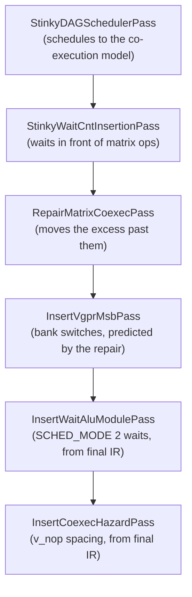

# Repair Matrix Co-execution Pass

## Overview

`RepairMatrixCoexecPass` runs in the gfx1250 backend whenever the scheduler has run. It moves ALU work around matrix ops so that the instructions inserted after scheduling do not delay them. It schedules with its own ready queue, `dag/MatrixCoexecReadyQueue.hpp`, and leaves the scheduler untouched.

## What it repairs

`StinkyDAGSchedulerPass` schedules against a hardware co-execution model (`CDNA5.hpp`). Later passes insert instructions into that schedule: `StinkyWaitCntInsertionPass` puts final waits immediately in front of the matrix ops that consume the loads, and `InsertVgprMsbPass` adds `s_set_vgpr_msb` bank switches. When that leaves more work in front of a matrix op than the window of the matrix op before it can hold, the excess delays the matrix op. That delay is what this pass repairs.

## The objective

What costs cycles depends on what the hardware does with a window, not on how full it is.

- **An empty window between independent matrix ops costs nothing.** Independent matrix ops back to back run at full matrix rate. On the production loops every empty window is of this kind: `emptyWindows=47 (dependent=0)` on `mxf8_tn_maf`, `50 (dependent=0)` on `coissue`. Moving work into such a window only churns the schedule.
- **Work that does not fit in front of a matrix op delays it.** A window has the matrix op's latency minus its issue cycles and any cycle the hardware takes for itself. For `v_wmma_scale_f32_16x16x128_f8f6f4` that is six cycles, with VALU co-execution only at cycles 3 and 6. The waits in front of the next matrix op and the bank switches spend those cycles too; a wait costs its issue cycle whether or not it stalls.
- **A dependent pair gets `v_nop` spacers.** When the second matrix op reads the first one's result as A or B, `InsertCoexecHazardPass` pads the gap, and VALU work placed there replaces a spacer.

So the pass keeps the scheduler's order with two exceptions: work that would delay a matrix op moves past it, and VALU work fills a dependent window.

## The queue

Matrix ops and everything else sit in two `ReadySetByDAGid`s ordered by original id, and `MatrixCoexecPickPolicy` chooses between them. The pass drains each segment with a plain Kahn loop. The queue reads only the register DAG and the pass's own ordering edges.

**Fixed and movable work.** The matrix/memory skeleton (matrix ops, memory ops and prefetch hints, chained by `addMatrixMemoryOrderEdges`) stays where the scheduler put it. Everything else is movable and keeps its order relative to other movable work.

**The plan.** At the start of each segment, `planCuts` decides for every window how much of its movable work goes past the matrix op that closes it, to start the next window. Nothing moves past more than one matrix op in a round, at most `kMaxCarried` instructions leave one window, and nothing a matrix op depends on moves past it. Because movable work keeps its order, what a window passes on is a tail of the movable sequence, and the window's time depends only on where that tail starts and where the previous window's did. The choice is therefore a small dynamic program over the windows that minimizes the segment's simulated time; ties keep work in place. A window's time counts:

- the matrix op's own timeline, from the shared `CoexecWindow`;
- the waits attached to the matrix op that closes the window, from the `WaitAnchorMap`;
- the bank switches `InsertVgprMsbPass` will insert, for fixed and movable work alike.

**Following the plan.** Work that stays goes in input order, lowest id first, which is always ready because every edge runs from a lower id to a higher one. The plan for the segment's next matrix op applies even before that op is ready: the op often still waits on fixed work of its own, such as the window's DS loads, and work planned past it must not slip in ahead meanwhile.

**Dependent windows.** When the next matrix op depends on the open one (`wmmaToWmmaCoexecOverlap`), VALU work from just after it is hoisted in front of it, if it fits and touches none of the open matrix op's registers.

**Across segments.** One queue spans the block, so a window and the bank state carry across segment boundaries. A label resets both, since control can arrive from elsewhere; a barrier closes the window, since every wave has to arrive first.

**Rounds.** `repairBlock` plans again against the order the last round left until a round changes nothing, which also makes the pass idempotent. A later round can find moves an earlier one could not: once work has left a window, the work in front of it can follow. Each round takes only what it scores strictly better. On the production loops the order settles after one to three rounds; `kMaxRepairRounds` is only a bound.

## Bank switches

`InsertVgprMsbPass` decides each switch through `vgprMsbInsertionsBefore` in `VgprMsbEncoding.hpp`, and the queue calls the same function to predict them. The prediction matches what the pass inserts exactly, block by block, on both production loops. One gap is known: labels inserted later by `InsertClusterBarrierPass` reset the bank state, and the repair cannot see them.

Most switches are out of this pass's reach. In the final `mxf8_tn_maf` loop, 302 of 571 switches step into non-matrix work, and 232 of those surround DS loads, which are fixed. What the repair can do is stop filling windows that those switches will overflow.

## Hazards

Moving ALU work can shorten the distance between a hazard's producer and its consumer. How much that matters:

- `WmmaVgprSrcToDsWrite` is counted in matrix ops between a matrix op and a later `ds_load`. Both ends and every matrix op between them are fixed, so this pass cannot change it.
- The two cycle-counted rules are stalls, not miscompiles. When nothing else can go, `CDNA5ReadyQueue` counts the hazard wait as elapsed time and emits the consumer anyway (`advanceTime(pickWait)`), so the scheduler's own output already has short gaps: on the `mxf8_tn_maf` and `coissue` loop dumps, `HazardGapAnalysisPass` finds 2 of 8 `SaluSgprToMemAddr` pairs and 8 of 20 `ValuVgprToVmemAddr` pairs below the rule. Under `SCHED_MODE` 2, `InsertWaitAluModulePass` re-derives `VA_VDST`/`VM_VSRC` waits from final IR after the repair.
- `Gfx1250HazardModulePass` covers XNACK-replay memory groups, not the rules in `kCdna5HazardRules`, so it does not catch them.

The pass guards the gaps anyway. `segmentsShorteningHazards` measures every pair with `measureHazardGaps`, shared with `HazardGapAnalysisPass`, on the input and on the new order. A segment that would leave a gap shorter than both the input's and the rule's distance keeps its input order, and the block is laid out again. Each round checks against its own input, so no gap ends up shorter than the original input's or the rule's. On the production loops the guard never fires, and the violation counts are identical before and after the repair.

## Correctness

- **Wait anchors.** Waits stay out of the DAG and are re-emitted immediately before the matrix op they were attached to, with immediates and modifiers untouched.
- **Counter-order edges** keep each wait immediate counting the operations it was computed for.
- **Skeleton-order edges** keep memory and matrix ops in input order. Without them a DS read could cross a matrix op whose wait carries no `dscnt`.
- **Segment boundaries and exec-mask bracketing** follow the scheduler's rule, plus barriers: moving a barrier in a double-buffered loop reorders one side of a handshake.
- **No new IR.** The queue emits no `v_nop` spacers; `InsertCoexecHazardPass` adds the spacing on final IR.

## Results

Measured offline on the saved loop region dumps of `mxf8_tn_maf` and `coissue`, after the repair, `InsertVgprMsbPass` and `InsertCoexecHazardPass`. `InsertWaitAluModulePass` and the cluster-barrier labels are not in the chain.

The issue bound comes from an in-order model used for these measurements and not kept in the tree. Every instruction pays its issue cycles in order, each matrix op waits out the previous one's latency, and the work between matrix ops follows the `CoexecWindow` timeline. It ignores memory stalls, so it is a lower bound. The matrix floor under it is 3065 cycles.

| | pass off | pass on |
|---|---|---|
| `mxf8_tn_maf` issue bound | 3190 | 3163 |
| `coissue` issue bound | 3193 | 3154 |
| instructions moved past a matrix op | — | 33 / 53 |
| `s_set_vgpr_msb` inserted | 634 / 571 | 630 / 567 |

The pass is idempotent on both: a second run leaves the order identical. Most moved instructions cross one matrix op, and none crosses more than three over all rounds.

## Limits

The loop is already close to matrix-throughput bound. In the final kernel assembly the in-order issue bound sits 3–5% above the matrix floor, and three quarters of that gap is `s_set_vgpr_msb`, mostly around fixed DS loads. That gap belongs to DS placement and register layout, not to this pass.

By design the pass neither moves work into independent windows nor reorders movable work among itself.

The bound is static and ignores memory stalls, which only hardware measurement can show.

## Naming

The name follows the AMDGPU backend, which calls this co-execution (`GCNHazardRecognizer::fixWMMACoexecutionHazards`) and keeps co-issue for two instructions sharing an issue slot (`SIInstrInfo::isNeverCoissue`). The `coIssueWindow` ISA field uses the other term.

## Open questions

**Should the plan see past its segment?** A segment's last window is planned without the work the next segment puts in the same window. Rounds make up for it and the guard keeps it safe, but a plan that saw the next segment's leading work could settle sooner.

**Should movable work reorder among itself?** Keeping its order is what makes the plan a one-dimensional dynamic program. A richer plan could find more moves; whether they pay off on hardware is unmeasured.
