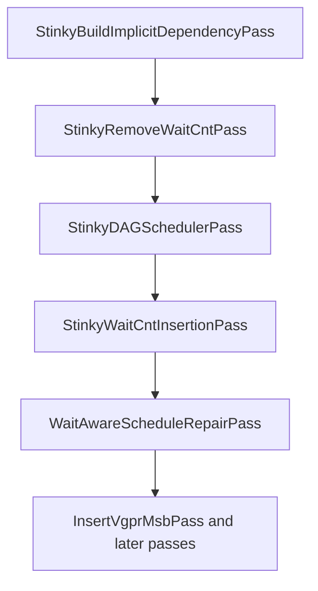
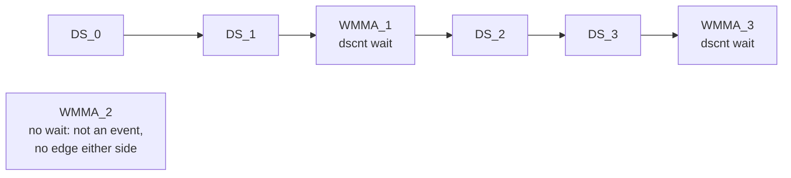
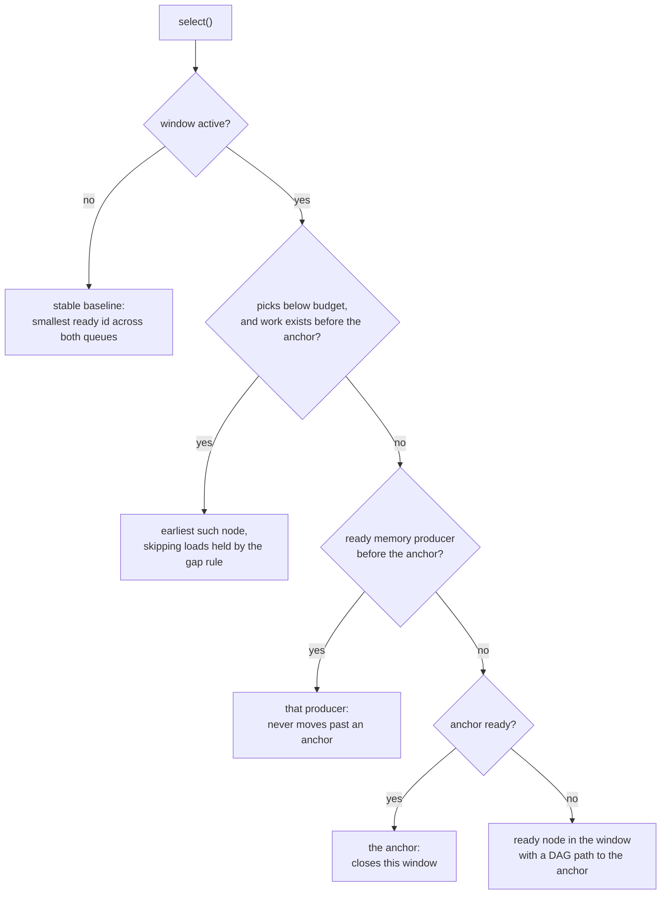
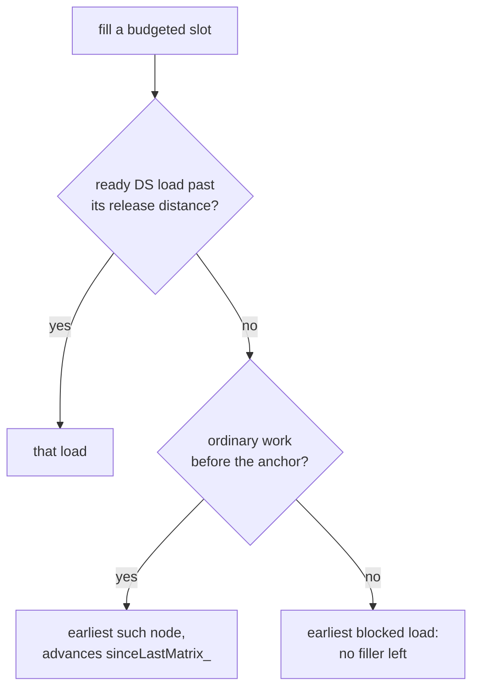
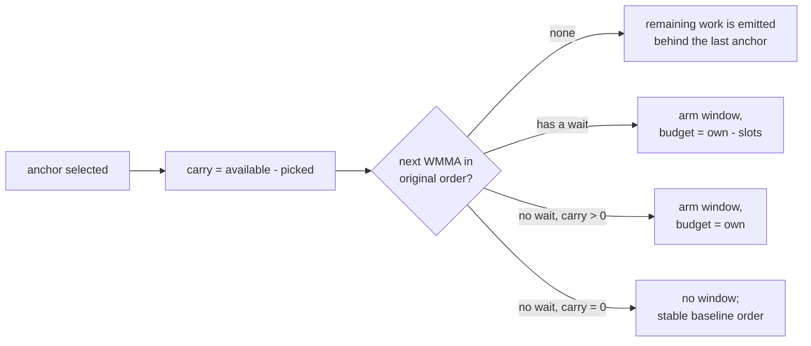

# Wait-Aware Schedule Repair Pass

## Status

This document describes the current implementation. It covers the pass itself and the two placement rules built on top of it: keeping the gap between a matrix instruction and the DS loads behind it, and keeping prefetch hints ahead of the matrix instruction that follows them.

`WaitAwareScheduleRepairPass` runs after final wait-count insertion. It rebuilds selected basic-block regions using a stable register DAG, and it shortens the instruction windows that end at a wait-anchored WMMA.

The pass does not model WMMA latency, co-issue masks, or wait stall cycles. Its only tuning rule is a count-based window budget.

### Build-time toggles

Three `constexpr bool` flags in `WaitAnchoredReadyQueue.hpp` turn the optional rules on and off:

| toggle | shipped value | what it does |
|---|---|---|
| `kPreferMemProducerFirst` | `false` | fills a window's budget with ready memory producers first, rather than in original order |
| `kPreserveMatrixToDsGap` | `true` | holds each DS load back until it is as far past the preceding matrix instruction as it was in the input |
| `kPinPrefetchToAnchor` | `true` | keeps each prefetch hint ahead of the matrix instruction that follows it |

`kPreferMemProducerFirst` was turned off by requirement, and that has a knock-on effect worth knowing up front. The gap rule exists to push back against memory-first pulling loads too early. With memory-first off there is nothing to push back against, so the gap rule cannot change anything, and a derived constant says so:

```cpp
constexpr bool kGapRuleActive = kPreserveMatrixToDsGap && kPreferMemProducerFirst;
```

That guards the two places the rule costs anything: building the release-distance table, and testing it during selection. Both compile away while memory-first is off. The rule is kept rather than deleted because it is what protects the gaps if memory-first is ever turned back on, and the constant turns it back on with it. [Why the rule currently has no effect](#why-the-rule-currently-has-no-effect) gives the argument and the measurements.

## Goals

The pass:

- keeps each original wait instruction object and immediate unchanged;
- keeps each attached wait group immediately before its original WMMA anchor;
- preserves RAW, WAR, and WAW register dependencies;
- preserves DS, load, KM, tensor, and async counter-event order;
- never moves an asynchronous memory producer past an anchor;
- never moves a prefetch hint past the matrix instruction that follows it;
- never brings a DS load closer to the matrix instruction ahead of it than the input had it;
- moves a configurable number of otherwise eligible non-WMMA instructions past a wait-anchored WMMA, and forwards that work through the anchors that follow;
- uses stable original DAG order whenever no wait-window policy applies.

It is a local repair pass, not a replacement for `StinkyDAGSchedulerPass`.

## Pipeline position



The backend adds the repair to the `loopWithPrefetch + noLoadLoopBody` region pipeline when scheduling is enabled, meaning any optimisation level above `O0`, and the `WaitRepairSlotsToMovePastAnchor` module option is positive.

It is not gated on wait-count insertion, even though repairing a schedule with no waits in it has nothing to do. That costs nothing: with no wait-anchored WMMA in a block, `repairBlock()` returns before building a DAG.

Nothing recomputes wait counts after the repair, so the pass treats the waits it is given as fixed correctness constraints. This is the reason for most of the design: the pass may reorder work around a wait, but it may never change what that wait guarantees.

## What the pass does

`StinkyWaitCntInsertionPass` places each final wait immediately before the WMMA that consumes the awaited loads. That leaves the WMMA with nothing behind it to issue while it runs. The repair moves the wait and its anchor earlier, so that work lands after the anchor instead:

```text
  before repair              after repair, one slot moved
  -------------              ----------------------------
  WMMA_0                     WMMA_0
  DS_0                       DS_0
  DS_1                       DS_1
  CMP                        CMP
  MOV                        MOV
  CSELECT                    WAIT_DSCNT   <- wait and anchor move up together
  WAIT_DSCNT                 WMMA_1
  WMMA_1                     CSELECT      <- now fills WMMA_1's issue shadow
```

Nothing about the wait itself changes. The same wait object, with the same immediate, still sits immediately before the same anchor.

### Window anatomy

The unit of work is a *window*: the stretch between one selected WMMA and the next WMMA in original order. Every term used later in this document maps onto it:

```text
  WMMA_0        <- window start, the previously selected anchor
  DS_0     \
  DS_1      |
  CMP       |   window interval, originalOtherCount = 5
  MOV       |
  CSELECT  /
  WAIT_DSCNT    <- attached wait group: metadata, never a DAG node
  WMMA_1        <- anchor: closes this window and starts the next
```

Instructions that a window does not select before its anchor become *carry*. They stay in the ready queue and get selected in a later window. `pendingCarry_` counts how many are in flight.

## Implementation layout

```text
include/stinkytofu/transforms/asm/WaitAwareScheduleRepairPass.hpp
src/transforms/asm/WaitAwareScheduleRepairPass.cpp
src/transforms/asm/dag/RegionDAG.hpp
src/transforms/asm/dag/RegionDAG.cpp
src/transforms/asm/dag/ReadyQueue.hpp
src/transforms/asm/dag/WaitAnchoredReadyQueue.hpp
tools/visualize_dag.py
```

The responsibilities split up as follows:

- `RegionDAG` builds shared register dependencies and owns the DAG utilities.
- `WaitAwareScheduleRepairPass` discovers waits, forms segments, and rewrites IR.
- `WaitAnchoredReadyQueue` stores ready nodes and performs stable Kahn selection.
- `WaitAnchoredPickPolicy` owns all wait-window state and tuning decisions.

## Wait anchors

### Metadata

Waits are metadata rather than schedulable DAG nodes:

```cpp
struct WaitAnchorInfo {
    StinkyInstruction* anchor = nullptr;
    std::vector<StinkyInstruction*> waits;
    waitcnt::WaitCountSpec spec;
};

using WaitAnchorMap =
    std::unordered_map<StinkyInstruction*, WaitAnchorInfo>;
```

`waits` stores the exact IR object pointers in original order. `spec` is a combined counter view, used only to classify dependencies.

### Discovery

`discoverWaitAnchors()` walks the block one run of consecutive `StinkyTofu` instructions at a time, restarting at every non-instruction IR node. Within a run it:

1. finds a maximal consecutive group of `IF_WaitCnt` or `IF_WaitTensorCnt` instructions;
2. looks at the instruction immediately after that group;
3. attaches the group only if that instruction is a matrix instruction;
4. decodes the DS, load, KM, tensor, and async values into a combined `WaitCountSpec`;
5. stores the exact waits under the matrix anchor pointer.

The adjacency requirement is strict. A wait followed by a non-matrix instruction, or a wait at the end of a run, is not attached and later becomes a segment boundary.

Runs are split in exactly the same places where `repairBlock()` splits segments. Without that, discovery could see a wait and a WMMA as adjacent across an intervening asm directive and bind them together. The rewrite would then re-emit the wait on the far side of a boundary it is not allowed to cross.

If a block contains no wait-anchored WMMA, `repairBlock()` returns immediately without building a DAG or rewriting anything.

## Repair segments

Attached waits are left out of the schedulable instruction vector. Their WMMA anchors stay in it.

A segment ends at:

- non-instruction IR;
- labels;
- waits that are not attached to a matrix anchor;
- branches, calls, stores, barriers, and anything else that `hasSideEffect()` classifies;
- exec-mask groups.

The pass never schedules across these boundaries, and never across basic blocks.

Dense DAG IDs are assigned after the attached waits are removed. A node's ID is therefore also its position in original order among the schedulable instructions of that segment. This is what lets the rest of the pass treat distances between instructions as simple ID arithmetic.

### Exec-masked spans

Each block is bracketed the same way `StinkyDAGSchedulerPass` brackets its own scheduling:

```text
collapseExecMaskedRegions(bb, builder, wavefrontSize)
  repairBlock(bb, ...)
expandExecMaskedGroups(bb)
```

Collapsing turns each span that runs from a narrow exec write through to a full-mask reset into a single opaque `ExecMaskGroup`, which `isHardBoundary()` then treats as a segment boundary.

The bracket is not optional. Without it, the span's instructions reach the repair as ordinary nodes, and the DAG does not model the exec mask at all: the window-shortening budget could then push the `exec` reset past the anchor and run the WMMA under a narrow mask. Collapse and expand run on every block, whether or not a wait anchor is found, so a group pseudo-instruction can never survive into the output.

## Region DAG

`buildRegisterDependencyDAG()` is shared between the primary scheduler and this pass. It creates:

```cpp
struct RegionDAG {
    DAGNodeList nodes;
    std::vector<std::unordered_set<unsigned>> graph;
    std::unordered_map<StinkyInstruction*, unsigned> instToId;
};
```

For each physical or pseudo register it adds:

- RAW edges from the latest writer to each reader;
- WAW edges from the latest writer to the next writer;
- WAR edges from outstanding readers to the next writer.

Pseudo registers take part exactly like physical registers, which is what preserves the memory-token ordering the IR represents.

`RegionDAG` also owns `addEdgeById()` and the deterministic node and edge dumping.

## Synthetic ordering edges

Register dependencies are not the only ordering this pass has to respect. Two more constraints exist that no register dependency expresses, and both are added to the DAG as extra edges before scheduling starts:

- **Counter order**, so that a wait immediate keeps counting the operations it was computed for. This is a correctness constraint.
- **Pinned work**, so that an instruction whose whole value is its position does not get deferred away from it. This is a performance constraint.

One call builds both, right after the register DAG:

```cpp
inline void addSyntheticOrderEdges(RegionDAG& dag,
                                   const std::vector<StinkyInstruction*>& instructions,
                                   const WaitAnchorMap& anchors) {
    addCounterOrderEdges(dag, instructions, anchors);
    addPinEdges(dag, instructions);
}
```

`repairSegment` calls that one line, so there is a single place to look for synthetic ordering and a single place to add more of it.

### The shared shape

Both constraints turn out to be the same operation: *add one edge from each instruction matching one test to the first later instruction matching another test*. So it is written once:

```cpp
template <typename PinPred, typename BarrierPred>
inline void addEdgesToFirstFollowing(RegionDAG& dag,
                                     const std::vector<StinkyInstruction*>& instructions,
                                     PinPred shouldPin, BarrierPred isBarrier) {
    for (unsigned i = 0; i < instructions.size(); ++i) {
        if (!shouldPin(instructions[i])) continue;
        for (unsigned j = i + 1; j < instructions.size(); ++j) {
            if (!isBarrier(instructions[j])) continue;
            addEdgeById(&dag.nodes[i], &dag.nodes[j], dag.graph);
            break;
        }
    }
}
```

Pinning uses two different tests: prefetches get pinned, matrix instructions act as barriers. Counter order uses the same test twice: every event of a counter is both a thing to pin and a barrier, so the edges chain each event to the next one and the chain stays in input order.

Two properties come from the fact that the scan only ever looks forward, and they hold for anything built on this helper. Edges always run from a lower ID to a higher one, so they can never form a cycle. And an instruction with no barrier after it gets no edge, which is the right answer: there is nothing left for it to stay ahead of.

The cost is better than the nested loop suggests. When both tests accept the same instructions, each inner scan stops at the next accepted instruction, so no two scans cover the same ground and the total work is linear. That is the counter-order case. When the tests accept different instructions, several scans can cross the same stretch, so the set of pinned instructions should stay small. Prefetches are rare and segments are single basic blocks, so this is fine in practice.

### Counter-order edges

The immediate in `s_wait_dscnt 55` refers to a position in the DS queue, not to a length of time. Register dependencies know nothing about that, so `addCounterOrderEdges()` builds one event chain per tracked counter:

```text
event[0] -> event[1] -> ... -> event[n]
```

An event is either an asynchronous producer that `waitcnt::classifyMemOp()` assigns to the counter, or a wait anchor whose combined `WaitCountSpec` names that counter.

The second half of that is easy to overlook: a WMMA is an event **only** if its own wait names the counter. A WMMA with no wait, or whose wait names a different counter, is skipped over entirely:



So even when `WMMA_1` has no register dependency on `DS_0` or `DS_1`, it cannot become ready until the chain reaches it. `WMMA_2` gets no such protection, which is why the pick policy has to hold producers in place itself. The same construction runs independently for each tracked counter: DS, load, KM, tensor, and async.

### Why producers never cross an anchor

No asynchronous memory producer is ever moved past an anchor. Only work that issues no memory operation fills the slots after an anchor.

Where the anchor's wait names the producer's counter, two separate mechanisms enforce this. The counter chain already puts a DAG edge from the last producer to the anchor, so no slot budget can free it. And the restriction is mandatory as long as immediates stay fixed, because `s_wait_dscnt N` means "at most `N` DS operations still outstanding", so what it guarantees depends on how many were issued before it. With `L1..L5` outstanding, `s_wait_dscnt 2` waits for `L1`, `L2`, and `L3`. Move `L5` past the wait and only four are outstanding, so the same immediate now waits for just `L1` and `L2`, and the anchor may read `L3` before it arrives.

Everywhere else there is no DAG edge to rely on. A DS producer is not an event in the chain of an anchor whose wait names only `kmcnt`, nor of an anchor with no wait at all. The pick policy covers those cases instead, by treating every ready producer before the anchor as mandatory once the slot budget is spent. There is nothing to gain from deferring a load past an anchor anyway: it only delays issuing the load and loses latency hiding.

Lifting the wait-named case would mean rewriting the immediate to `N - M` when `M` producers move past the anchor. That is exact, but it gives up the fixed-immediate invariant. It also needs more than dropping an edge: because the chain links only consecutive events, it has to re-point the chain edge at the `(K - M)`-th producer, which fixes `M` before scheduling rather than leaving it to the pick policy.

### Pinning prefetch hints

A prefetch hint is the clearest case of work whose only value is being issued early. `global_prefetch_b8` has no destination register, carries no waitcnt counter, and exists purely to buy lead time. Its instruction definition says as much:

```text
// Global data prefetch - used by gfx1250 PrefetchGL2 to prefetch data from global memory
// to L2 cache; no destination register. Not marked HasSideEffect: it is only a cache hint,
// so reordering it affects performance but not correctness.
```

That adds up to nothing holding it in place. It is not a segment boundary, because `hasSideEffect` is false. It is not a counter producer, because `classifyMemOp` returns `CK_Count`. It has no result register, so nothing reads it and no RAW edge pins it. The only thing ordering it at all is the RAW edge on its address operands.

The result is that it drifts straight past the anchor:

```text
  input                      output before this rule
  -----                      -----------------------
  WMMA                       WMMA
  ds_load                    ds_load
  s_mov                      s_mov
  global_prefetch_b8         s_wait_dscnt
  s_wait_dscnt               WMMA
  WMMA                       global_prefetch_b8   <- deferred past the anchor
```

On a production GEMM kernel this was not a one-slot slip. Counting how many matrix instructions precede each of the twelve prefetches inside the loop:

| | preceding-WMMA count |
|---|---|
| input to the pass | 13, 15, 17, 19, 140, 142, 144, 146, 268, 270, 272, 274 |
| memory-first on, no pin | 22, 65, 65, 65, 166, 193, 193, 193, 294, 321, 321, 321 |
| memory-first off, no pin | 13, 15, 17, 19, 140, 142, 145, 146, 268, 270, 273, 274 |

With memory-first on, prefetches slid past between 9 and 50 matrix instructions, and groups of three collapsed onto the same point. In a software-pipelined loop a prefetch is fetching data for a future iteration, so issuing it fifty WMMAs late throws away most or all of the lead time it was there to buy.

With memory-first off, which is how the pass ships, the drift is much milder: the budget is filled in original order, so a prefetch only loses its slot to work that genuinely came before it, and two prefetches out of twenty slip by a single anchor. That is the drift this rule removes today. The severe case is what it removes if memory-first is ever turned back on.

#### Why a preference is not enough

The obvious fix is to widen the mandatory-producer test, so that the step which already keeps memory producers ahead of the anchor keeps prefetches there too:

```cpp
static bool staysAheadOfAnchor(const DAGNode& node) {
    return isMemProducer(node) || isGlobalPrefetch(*node.inst);
}
```

That was prototyped and measured. It helps a lot, but it does not fix the problem:

| | preceding-WMMA count |
|---|---|
| input to the pass | 13, 15, 17, 19, 140, 142, 144, 146, 268, 270, 272, 274 |
| memory-first on, no pin | 22, 65, 65, 65, 166, 193, 193, 193, 294, 321, 321, 321 |
| preference prototype | 15, 17, 21, 37, 142, 149, 165, 193, 270, 277, 293, 321 |

Prefetches still ended up 2 to 47 matrix instructions later than they started. The cause is readiness. A selection step can only pick an instruction that is *ready*, and a prefetch is not ready until its address operands have been computed. In this kernel each prefetch reads a 64-bit address pair built by a chain of carry-propagating adds:

```text
v994, vcc_lo0 = v_add_co_u32(v994, s81)
v995, vcc_lo0 = v_add_co_ci_u32(v995, 0, vcc_lo0)
v996, vcc_lo0 = v_add_co_u32(v996, s82)
v997, vcc_lo0 = v_add_co_ci_u32(v997, 0, vcc_lo0)
...
global_prefetch_b8(v[996:997], off)
```

Those adds are ordinary work, so the budget is free to defer them. Once they are deferred the prefetch can never become ready, the anchor becomes ready first and gets selected, and the prefetch slips past it no matter how strongly it is preferred. Preferring the prefetch without a way to pull in its address chain just moves the problem down one level.

#### Why an edge works

An edge turns the prefetch from something the policy *wants* before the anchor into something the anchor cannot be scheduled without. That is exactly what the readiness problem needs:

- As a preference, an unready prefetch loses to a ready anchor. The anchor goes first, and the prefetch is already past it.
- As a predecessor, an unready prefetch leaves the anchor with an unsatisfied dependency, so the anchor is not in the ready queue at all. Step 4 of the pick policy then takes over: `findReadyAnchorPredecessor`, backed by `reachesActiveAnchor`, looks for ready work on a DAG path to the active anchor, and the address chain is on that path. The chain drains, the prefetch becomes ready, and it issues before the anchor.

So the address chain gets pulled in for free. The pass already knew how to say "schedule whatever is needed to unlock this anchor". Making the prefetch a predecessor of the anchor is enough to bring the chain inside that question, and `select()` needed no change at all.

An edge is also the better conceptual fit. Drifting past an anchor is an ordering problem, and the DAG is where this pass already expresses ordering it did not get from register dependencies.

#### The rule table

More instruction classes are likely to want this treatment, so the rule is declared in a table rather than written as its own function:

```cpp
/// One class of work that must not drift past a later instruction.
struct PinRule {
    bool enabled;
    bool (*shouldPin)(const StinkyInstruction&);
    bool (*isBarrier)(const StinkyInstruction&);
};

inline constexpr PinRule kPinRules[] = {
    {kPinPrefetchToAnchor, isPrefetchHint, isMatrixInstruction},
};
```

A rule reads as "keep every X ahead of the next Y". Adding a class of pinned work means one entry plus its two tests. The edge building is shared, each rule carries its own enable flag, and the selection policy never learns about individual rules.

The test for prefetches is:

```cpp
/// Hints whose only value is the lead time they get: no waitcnt counter and no
/// destination register, so nothing else in the DAG orders them.
inline bool isPrefetchHint(const StinkyInstruction& inst) {
    if (inst.getHwInstDesc() == nullptr) return false;
    return isGlobalPrefetch(inst);
}
```

The null check matters, and any new test added to the table needs the same thing. `StinkyInstruction::is()` dereferences `hwInstDesc` without checking it first, which is why `hasSideEffect` guards the pointer before asking about flags.

Only `global_prefetch_b8` is covered today. The instruction-cache prefetches, `s_prefetch_inst` and `s_prefetch_inst_pc_rel`, have the same shape of no counter and no destination register, but they are inserted by the `SwInstructionPrefetch*` passes, which run after this one, so they cannot reach the repair's input. Covering them would be a one-line change to this test if that order ever changes.

One more thing to know when adding a rule: the barrier should be something the policy already treats as a scheduling landmark. Pinning to an arbitrary instruction would constrain the schedule without giving the pass a reason it can act on.

#### What pinning does not change

The budget is untouched. The prefetch and its address chain were always going to be scheduled somewhere inside the window. The edge only stops them being pushed to the far side of the anchor, so the number of instructions crossing each anchor is the same as before.

Memory producers are untouched. They keep their own mandatory-producer rule, which exists for a correctness reason that pinning does not share.

Ordering among prefetches is untouched. They are selected in original ID order, like everything else.

## Ready queues

`WaitAnchoredReadyQueue` derives from `ReadyQueue` and keeps ready nodes in two ordered sets:

```cpp
OrderedReadyNodeSet wmmaQueue;
OrderedReadyNodeSet otherQueue;
```

Both sets are ordered by ascending `DAGNode::id`. The stable baseline is the smallest ID across their two fronts:

```text
min(wmmaQueue.front.id, otherQueue.front.id)
```

With no active wait window to override it, that reconstructs the original order of schedulable instructions.

The queue itself only inserts a ready node into the correct set, asks `WaitAnchoredPickPolicy` for an override, falls back to stable baseline order, removes the selected node, and reports the committed selection back to the policy.

## WaitAnchoredPickPolicy

All repair behaviour lives in `WaitAnchoredPickPolicy`.

### Window state

Related state is grouped in one object:

```cpp
struct WindowState {
    DAGNode* anchor = nullptr;
    const WaitAnchorInfo* anchorInfo = nullptr;  // null when the anchor has no wait
    unsigned startId = 0;
    unsigned originalOtherCount = 0;             // nodes originally in the interval
    unsigned availableOtherCount = 0;            // own nodes + work carried in
    unsigned otherPickBudget = 0;
    unsigned otherPicks = 0;
};
```

The policy arms this state after selecting a WMMA, for the next WMMA in original DAG order, when either that WMMA is a wait anchor, or the preceding window deferred work into it (`pendingCarry_ > 0`).

The second case matters because deferred work has to keep moving. Without it the work stops at the first anchor that has no wait, piling up in front of that anchor and leaving it with nothing behind it. A window armed without a wait has `anchorInfo == nullptr`, and therefore no mandatory counter producers.

### Tuning parameters

`kSlotsToMovePastAnchor` is a pass argument that defaults to one, and zero or less disables the pass. It can be set from two directions, and every level of the chain defaults to one, so leaving it alone everywhere gives the shipped behaviour.

Through the backend, `Gfx1250Backend` passes the `WaitRepairSlotsToMovePastAnchor` module option straight through to the pass argument. Like any other module option it comes from the options dict on the Python side. Tensile does not forward a kernel key into it today, so kernels built through Tensile get the default of one.

Through the tool, `stinkytofu-opt` accepts `--WaitAwareScheduleRepairPass=kSlotsToMovePastAnchor=<n>`. This path does not involve module options at all, and it is what the filecheck tests use.

`kPreferMemProducerFirst` decides only the order in which a window's budgeted slots are filled, not which side of the anchor an instruction ends up on. With it on, ready memory producers are taken before other work, so loads issue as early as the window allows and carried work follows them. With it off, which is how the pass ships, the budget is filled in strict original order.

The budget depends on whether the anchor carries a wait:

```text
originalOtherCount  = nodes originally in the interval
availableOtherCount = originalOtherCount + pendingCarry

wait anchor:      otherPickBudget = max(originalOtherCount - kSlotsToMovePastAnchor, 0)
wait-less anchor: otherPickBudget = originalOtherCount
```

Only a wait anchor gets shortened, because only it has a wait whose window needs protecting. At the shipped value of one, it selects one fewer ordinary instruction before the anchor.

A wait-less anchor has nothing to protect, so it keeps its own occupancy. Carried work is selected first, because it has the lowest original IDs, so spending a budget of `originalOtherCount` forwards exactly as many instructions as the window received and no more. Carry passes through such an anchor unchanged rather than growing.

Both budgets count from the original interval size rather than from current occupancy, so carried work consumes budget that would otherwise go to the window's own nodes.

The budget is a target, not a correctness limit. Mandatory memory producers and DAG predecessors can both force more selections before the anchor.

### Worked carry ledger

`tests/filecheck/wait_aware_schedule_repair_carry_test.stir` exercises both budget rules in one segment. Its three windows account as follows, with `kSlotsToMovePastAnchor = 1`:

| anchor | wait | own | carry in | available | budget | picked | carry out |
|--------|------|-----|----------|-----------|--------|--------|-----------|
| dagId 5  | yes | 4 | 0 | 4 | 3 | 3 | 1 |
| dagId 10 | yes | 4 | 1 | 5 | 3 | 3 | 2 |
| dagId 16 | no  | 5 | 2 | 7 | 5 | 5 | 2 |

The two wait anchors each give up one slot, so their carry grows. The wait-less anchor spends a budget equal to its own count and forwards exactly what it received: two in, two out. Pass `--debug-pass WaitAwareScheduleRepairPass` to print this ledger for any input.

### Selection order

While a window is active, `select()` applies this priority:

1. **Budgeted stable work**
   - While `otherPicks < otherPickBudget`, select the earliest ready non-WMMA node whose original ID is before the anchor.
   - This includes work carried over from the preceding window.
   - With `kPreferMemProducerFirst` on, a ready memory producer is taken ahead of other work.
   - While the gap rule is active, meaning `kGapRuleActive`, a DS load that has not yet reached its release distance is skipped over. See [Keeping the matrix-to-DS gap](#keeping-the-matrix-to-ds-gap).

2. **Mandatory memory producers**
   - Select the earliest ready node before the anchor that issues an asynchronous memory operation, whatever counter it belongs to.
   - These are selected even after the ordinary budget is spent, so no load is ever moved past an anchor.

3. **Ready anchor**
   - If the active anchor is ready, select it immediately.

4. **Dependency-path work**
   - Otherwise select the earliest ready node inside the original interval that has a DAG path to the anchor.
   - This unlocks mandatory producers that are not ready yet, and any other anchor dependency, including a pinned prefetch waiting on its address chain.

If the policy has no active window, or has no opinion, the queue uses stable baseline order.



Steps 2 and 4 are what make the budget a target rather than a limit, because both can select work after the budget is spent.

### Keeping the matrix-to-DS gap

#### The problem

The scheduler that runs before the repair often leaves a deliberate distance between a matrix instruction and the DS loads that follow it:

```text
v[26:41] = v_wmma_scale_f32_32x16x128_f4(...)
  ...                                          <- some ALU instructions
v[706:709] = ds_load_b128(v542, LDS0)
v[710:713] = ds_load_b128(v542, LDS0)
```

The repair reorders work inside each window, and it used to destroy that spacing. Here is a two-anchor segment whose input has a gap of three at both anchors:

| configuration | gap after WMMA_0 | gap after WMMA_1 |
|---------------|------------------|------------------|
| input IR | 3 | 3 |
| memory-first on, no gap rule | 0 | 0 |
| memory-first off, no gap rule | 3 | 4 |
| with the gap rule | 3 | 3 |

The collapse to zero came from memory-first. It picks any ready producer ahead of ordinary work, so the loads got pulled up against the matrix instruction and every filler ended up behind them. The growth to four in the third row comes from carry, which has lower original IDs and so lands in front of the loads.

Collapse is the direction that matters. The spacing is there so that a DS instruction is not issued immediately behind a matrix instruction, and removing it throws away whatever the earlier scheduler was buying.

#### What the rule guarantees

Every DS load ends up at least as far from the matrix instruction ahead of it as it was in the input.

That is a lower bound, not an exact match. A wider gap is harmless, and demanding an exact match would mean throwing out work that genuinely belongs in front of the load, carried work most of all. So the "grew to 4" row above is fine.

The rule is a preference, not a correctness requirement. If it ever disagrees with the guarantee that no producer crosses an anchor, the anchor guarantee wins.

Distances are counted in schedulable instructions, so attached waits do not count. They are pulled out of the DAG before scheduling and put back immediately in front of their anchor, which is after the loads, so a wait never sits inside a gap anyway.

The rule covers DS loads only, meaning `classifyMemOp(...) == CK_DS`. Producers on other counters are still held ahead of their anchor by the mandatory-producer rule, but they get no release distance of their own.

#### Release distance

Every DS load carries a *release distance*: how many instructions must be emitted after the preceding matrix instruction before that load may be selected.

The important part is that the distance belongs to the *matrix interval*, not to the individual load. All DS loads between two matrix instructions share the input distance of the **first** load in that interval. One release point gates the whole run, so once it opens the loads stay clustered together.

```cpp
void buildDsReleaseDistances() {
    dsReleaseDistance_.assign(regionDAG_.nodes.size(), kNoGapConstraint);

    std::optional<unsigned> lastMatrixId;
    std::optional<unsigned> intervalDistance;
    for (unsigned id = 0; id < regionDAG_.nodes.size(); ++id) {
        const DAGNode& node = regionDAG_.nodes[id];
        if (isMatrixInstruction(*node.inst)) {
            lastMatrixId = id;
            intervalDistance.reset();
            continue;
        }
        if (!lastMatrixId.has_value()) continue;
        if (waitcnt::classifyMemOp(*node.inst) != waitcnt::CK_DS) continue;
        if (!intervalDistance.has_value()) intervalDistance = id - *lastMatrixId - 1;
        dsReleaseDistance_[id] = *intervalDistance;
    }
}
```

DAG IDs are dense and follow input order, so a distance is just the difference between two IDs. Nothing else needs tracking.

Giving each load its own distance looks equivalent, and was the first version of this rule, but it is not. Per-load distances rebuild the input's spacing *between* loads, which on a real kernel drove scalars in between loads that the pass itself had placed back to back:

```text
  per-load distances        interval distance
  ------------------        -----------------
  WMMA                      WMMA
  ds_load 794               ds_load 794
  s_cmp                     ds_load 798
  s_mov                     s_cmp
  ds_load 798               s_mov
```

Both versions restore every non-zero matrix-to-DS gap, so they do equally well at the thing this rule exists for. They differ in what happens to the loads inside a run. On one production kernel the per-load version split 12 of the 179 adjacent load pairs that the schedule had already formed, turning them into 24 isolated loads. The interval version gates the whole run on a single release point, so the run stays together.

#### Runtime counter

`sinceLastMatrix_` records how far the schedule has moved past the last matrix instruction. It lives in `onPicked` rather than in the per-window handlers because it has to span windows: it must keep counting while no window is active, so that a load in the next window still measures from the matrix instruction that really precedes it.

```cpp
void onPicked(DAGNode& node, bool isWmma) {
    if (isWmma) {
        sinceLastMatrix_ = 0;
        onWmmaPicked(node);
    } else {
        reportShortGapIfAny(node);
        ++sinceLastMatrix_;
        onOtherPicked();
    }
}
```

`reportShortGapIfAny` is the only diagnostic. It sits here rather than inside the search so that it catches every route by which a load can be committed too early, including the mandatory-producer step, which never goes through the search at all.

A load is *released* once the schedule has moved far enough:

```cpp
bool matrixGapSatisfied(const DAGNode& node) const {
    if constexpr (!kGapRuleActive) return true;
    const unsigned required = dsReleaseDistance_[node.id];
    return required == kNoGapConstraint || sinceLastMatrix_ >= required;
}
```

Routing the toggle through this one predicate keeps a second condition out of the selection code. Turn the rule off and `findReadyReleasedMemProducer` collapses into the plain search, while the blocked branch below never runs. `kGapRuleActive` guards the constructor as well, so the release-distance table is not even built when the rule cannot act.

#### Selection

Only `findReadyOtherBeforeAnchor` changed behaviour. `findReadyMemProducerBeforeAnchor` still backs the mandatory-producer step, which is a correctness rule and has to outrank spacing. Both searches share one helper, so the gap test is the only visible difference between them:

```cpp
template <typename Predicate>
DAGNode* findReadyBeforeAnchor(const OrderedReadyNodeSet& otherQueue, Predicate match) const {
    for (DAGNode* node : otherQueue) {
        if (node->id < window_.anchor->id && match(*node)) return node;
    }
    return nullptr;
}
```

```cpp
DAGNode* findReadyOtherBeforeAnchor(const OrderedReadyNodeSet& otherQueue) const {
    if (!window_.active()) return nullptr;
    if constexpr (kPreferMemProducerFirst) {
        if (DAGNode* node = findReadyReleasedMemProducer(otherQueue)) return node;
    }

    DAGNode* gapBlocked = nullptr;
    for (DAGNode* node : otherQueue) {
        if (node->id >= window_.anchor->id) continue;
        if (!matrixGapSatisfied(*node)) {
            if (gapBlocked == nullptr) gapBlocked = node;
            continue;
        }
        return node;
    }
    // Believed unreachable; kept so the queue always makes progress.
    return gapBlocked;
}
```

`matrixGapSatisfied` returns true for any node without a release distance, so the loop needs no separate producer check.

The rule is self-correcting, which is why it stays this small. Blocking a load makes the policy pick ordinary work instead; that pick advances `sinceLastMatrix_`; and as soon as the counter reaches the release distance, the load becomes eligible again and is taken. The gap fills itself with exactly the work that filled it in the input, in the original order.



#### Worked example

This is the segment from the table above. Input IDs are on the left. The wait in front of each anchor is left out because it is not a DAG node.

```text
  id  input                 release distance
  --  -----                 ----------------
   0  WMMA_0                 -
   1  s60                    -
   2  s61                    -
   3  s62                    -
   4  ds_load  v[100:103]    4 - 0 - 1 = 3   (first load in the interval)
   5  ds_load  v[104:107]    3               (shares the interval distance)
   6  s63                    -
   7  WMMA_1                 -
```

Window 1 has six nodes of its own and a budget of five:

| pick | `sinceLastMatrix_` | released? | selected |
|------|--------------------|-----------|----------|
| 1 | 0 | no, the interval needs 3 | s60 |
| 2 | 1 | no | s61 |
| 3 | 2 | no | s62 |
| 4 | 3 | both loads released (3 >= 3) | `ds_load v[100:103]` |
| 5 | 4 | still released | `ds_load v[104:107]` |

At that point the budget is spent, no producers are left, and the anchor is ready. `s63` is deferred as carry, exactly as it was before this rule existed. The original spacing is back, and one slot still moves past the anchor. In the second window the carried `s63` is picked first because it has the lowest ID, and it counts toward the gap, so carry helps fill the spacing rather than pushing the loads out of place.

#### How it fits with the other rules

**Mandatory producers.** This step runs once the budget is spent, and stops a producer crossing an anchor, which would change what the anchor's wait guarantees. It ignores release distances.

**Carry.** Counts toward `sinceLastMatrix_` like any other instruction.

**Budget.** Untouched. The rule only reorders within a window and never changes how many instructions end up on each side of an anchor, so `originalOtherCount`, `otherPickBudget`, and the carry ledger all behave exactly as before.

**`kPreferMemProducerFirst`.** Reads as "as early as the window allows, but never closer to the preceding matrix instruction than the input had it".

#### When the gap can still shrink

The gap is a target rather than a promise. A load gets selected at whichever comes first: its release distance being reached, or the budget running out and the mandatory-producer step taking it anyway. That gives:

```text
gap achieved = min(releaseDistance, otherPickBudget)
```

So the gap survives whenever `otherPickBudget >= releaseDistance`. At the shipped value of one slot the budget is `originalOtherCount - 1`, which only falls below the release distance when the load sits right at the end of its window. The configurations at risk are the ones moving many slots past an anchor. Confirmed at `kSlotsToMovePastAnchor=3` on a five-node window: a release distance of three against a budget of two produces a gap of two, and `onPicked` reports `gap shortened for dagId=4 required=3 actual=2`.

Treat that formula as a lower bound on the distance achieved rather than an exact value. Steps 2 and 4 of the selection order also advance `sinceLastMatrix_`, so a load held back by both the budget and a dependency can finish further from its matrix instruction than `min` suggests. At `kSlotsToMovePastAnchor=5`, on a window whose load depends on an address computed in the same window, the budget is zero and yet the forced dependency-path pick still puts one instruction into the gap.

Readiness is a second possible cause. If no filler is ready, the last clause of `findReadyOtherBeforeAnchor` takes the blocked load instead of stalling. That branch looks unreachable in practice: the work that forms a gap sits between the load and the matrix instruction, so it has lower IDs and gets selected first, and instrumenting the branch across the whole filecheck suite at `kSlotsToMovePastAnchor` of 1, 2, 3, 4, 5 and 8 produced no hits at all. It stays in place so the queue always makes progress if that reasoning ever turns out to be wrong.

Whenever a load is committed short of its distance, by any route, `onPicked` emits a `PASS_DEBUG` line rather than asserting. The result is still legal; only the spacing is lost. Reporting at the commit point rather than inside the search is what makes the budget-limited case visible, because that one is taken by the mandatory-producer step and never reaches the search.

Reserving filler to close either hole would make `otherPickBudget` depend on where the loads are, tangling together two mechanisms that are independent today. That is not worth it for something that only costs spacing.

#### Why the rule currently has no effect

With `kPreferMemProducerFirst` off, this rule never changes anything. Flipping `kPreserveMatrixToDsGap` leaves the whole filecheck suite passing and the production kernel's output byte-identical, at every value of `kSlotsToMovePastAnchor` from 1 to 8, with the `gap shortened` diagnostic never firing.

That is structural rather than lucky, and the argument is short. A DS load is a mandatory memory producer, so it never crosses an anchor and is always selected inside its own matrix interval. With memory-first off, step 1 fills the budget in strict DAG-ID order, which is input order. So by the time a load is the lowest-ID candidate, every lower-ID instruction in its interval has already been emitted — and that count is exactly the load's release distance, which is just `loadId - matrixId - 1`. The counter has already reached the requirement at the moment the load is considered.

Because the rule provably cannot act, `kGapRuleActive` skips its machinery rather than running it to no effect. That was checked as dead-code elimination over all four combinations of the two toggles: output is byte-identical to the unguarded version in every one, at slot counts 1, 3, and 8, with no change to the suite. The one thing to watch is the precondition. The argument above rests on step 1 being the only thing that pulls a load forward, so a new selection path with that power would break it and would need adding to the constant.

It comes out exactly tight. In the worked example above the load needs a distance of three, and strict order emits `s60`, `s61`, and `s62` first, so `sinceLastMatrix_` is three when the load is reached: satisfied with no slack, every time. Carried work only helps, because it has lower IDs still and is picked first, so it adds to the count.

The same argument shows why the rule does matter with memory-first on. That preference pulls the load to the front of the window, where `sinceLastMatrix_` is zero and a requirement of three is unmet, so the rule is what holds the load back until the scalars have gone.

The two rules were designed as a pair and only really make sense together. Memory-first pulls loads as early as the window allows; the gap rule stops that going too far. Turning memory-first off removes the force the gap rule was built to oppose. What is left is gaps that are moderately too *wide* rather than exactly right — 28 of 384 sites on that kernel, by up to four slots — and widening is the one direction this rule cannot correct, in either configuration, because steps 2 and 4 of the selection order never consult it.

If those wider gaps ever matter, the fix is not this rule. It is either turning memory-first back on, which brings this rule back into play with it, or extending the rule with an upper bound as well, which would be a separate change with its own cost.

### State transitions

After a committed non-WMMA selection, the policy increments `otherPicks`.

After a committed WMMA selection:

1. If it is the active anchor, record `pendingCarry_` as everything the window had available but did not pick, then close and reset the window.
2. Find the next WMMA in original DAG order.
3. Arm a new window for it when it has attached waits, or when `pendingCarry_ > 0`.

Only the active anchor may close an active window.



## Scheduling

`scheduleWithWaitAnchoredReadyQueue()` performs ordinary Kahn scheduling:

1. Push every DAG node with no unsatisfied dependencies.
2. Pick one node from `WaitAnchoredReadyQueue`.
3. Append its instruction to the output.
4. Decrement each successor's in-degree.
5. Push newly ready successors.
6. Repeat until both ready sets are empty.

The scheduled vector must contain every non-wait segment instruction exactly once.

## Rewrite

The scheduled vector contains no attached waits. Reconstruction emits the exact wait objects immediately before their original anchors:

```cpp
for (StinkyInstruction* inst : scheduled) {
    if (auto it = anchors.find(inst); it != anchors.end()) {
        for (StinkyInstruction* wait : it->second.waits)
            output.push_back(wait);
    }
    output.push_back(inst);
}
```

The block is then rebuilt in the resulting order.

Required invariants:

- every original IR object appears exactly once;
- every attached wait stays immediately before its original anchor;
- wait objects, modifiers, immediates, and relative order are unchanged;
- non-target boundaries are not crossed;
- the total IR object count is unchanged.

## Example

Input, with six schedulable instructions between the WMMAs:

```text
WMMA_0
DS_0
DS_1
DS_2
CMP
MOV
CSELECT
WAIT_DSCNT
WMMA_1
```

With `kSlotsToMovePastAnchor = 1`, the ordinary budget is five. The policy picks:

```text
DS_0, DS_1, DS_2, CMP, MOV
```

The DS producers are mandatory counter events. After five non-WMMA picks, and once the anchor becomes ready, the reconstructed output is:

```text
WMMA_0
DS_0
DS_1
DS_2
CMP
MOV
WAIT_DSCNT
WMMA_1
CSELECT
```

For the next window, `CSELECT` is carried work. It raises that window's occupancy but not its budget, and it is selected before that window's own nodes, so it takes a slot one of them would otherwise have had.

## Correctness

**Register dependencies.** RAW, WAR, and WAW edges stop register-conflicting instructions being reordered illegally.

**Wait placement.** Waits are kept as exact metadata and emitted immediately before the same anchor pointer.

**Counter meaning.** Counter-event chains stop an anchor crossing producers on any counter its final wait names. Anchors outside those chains are covered instead by the mandatory-producer rule in the pick policy, so no producer crosses any anchor by either route.

**Boundaries.** Repair scheduling never crosses unsupported waits, side effects, exec groups, non-instruction IR, or basic-block boundaries.

**Stable fallback.** The smallest ready original ID is selected whenever no policy override applies.

The two placement rules are both performance rules and neither can break correctness. Pinning only adds DAG edges, which can constrain the schedule but never relax it. The gap rule only ever delays a load, and it yields to the mandatory-producer rule when the two disagree.

## Measurements on a production kernel

All figures below come from one real GEMM kernel, 2485 instructions with 384 matrix instructions, run with `kSlotsToMovePastAnchor = 1`. The instruction count is unchanged in every configuration.

**Prefetch positions**, counted as the number of matrix instructions preceding each of the 20 prefetches:

| configuration | preceding-WMMA count |
|---|---|
| input to the pass | 0 ×8, 13, 15, 17, 19, 140, 142, 144, 146, 268, 270, 272, 274 |
| memory-first on, no pin | 0 ×8, 22, 65, 65, 65, 166, 193, 193, 193, 294, 321, 321, 321 |
| memory-first off, no pin | 0 ×8, 13, 15, 17, 19, 140, 142, 145, 146, 268, 270, 273, 274 |
| with the pin, either setting | 0 ×8, 13, 15, 17, 19, 140, 142, 144, 146, 268, 270, 272, 274 |

The pin recovers the input positions exactly, in both settings of memory-first.

**Matrix-to-DS gaps**, comparing every matrix instruction against the next DS load:

| configuration | gap histogram | sites differing from the input |
|---|---|---|
| input to the pass | 214 at 0, 2 at 1, 2 at 2 | — |
| memory-first on, no gap rule | 218 at 0 | 4, all narrower |
| memory-first on, gap rule | 214 at 0, 2 at 1, 2 at 2 | 0 |
| memory-first off, gap rule or not | 190 at 0, 10 at 1, 6 at 2, 7 at 3, 3 at 4, 2 at 5 | 28, all wider |

With memory-first on, the gap rule does its job completely, and without it the four non-zero gaps all collapse to zero. With memory-first off, the last two rows are identical because the rule never binds; see [Why the rule currently has no effect](#why-the-rule-currently-has-no-effect).

In the shipping configuration the pin slightly improves gap fidelity, taking the differing sites from 30 down to 28. Holding a prefetch in place keeps it out of a gap it would otherwise widen.

**Load clustering**, as the run-length distribution of adjacent `ds_load` instructions:

| configuration | singles | pairs |
|---|---|---|
| input to the pass | 64 | 167 |
| memory-first on, with or without the gap rule | 40 | 179 |
| memory-first off, with or without the gap rule | 60 | 169 |

Neither the gap rule nor the pin changes clustering at all, so restoring the gaps costs nothing in how tightly loads issue together. Neither configuration reproduces the input's distribution, and that is deliberate: the gap rule reproduces the input's distance from a matrix instruction to the *first* load after it, not the spacing between loads within a run.

**Work ahead of each anchor**, as non-matrix instructions per window:

| configuration | windows | total | mean | max |
|---|---|---|---|---|
| input to the pass | 383 | 590 | 1.54 | 8 |
| memory-first on, no pin | 383 | 590 | 1.54 | 14 |
| with the pin, either setting | 383 | 590 | 1.54 | 8 |

The worry with pinning was that forcing each prefetch's address chain ahead of the anchor would crowd out other work. It does not. The totals are identical, as expected from the budget being untouched, and with memory-first on the maximum actually improves: holding each prefetch and its chain in place stops a cluster of deferred prefetches building up in one window, which brings the worst-case window back to the input's 8 from 14.

The `gap shortened` diagnostic never fires in any configuration, so the gap rule is never given up on to make room for a pinned prefetch.

## Tests

All under `tests/filecheck/`. The suite is 129 passing.

**The pass itself.** `wait_aware_schedule_repair_test.stir` covers the basic shape, with waits attached to their anchors and one slot moving past each. `wait_aware_schedule_repair_carry_test.stir` is the carry ledger above: the key property is that the last WMMA has no wait of its own but still receives carried work, so a wait-less interval has to be considered for repair as well. `wait_aware_schedule_repair_dependency_flush_test.stir` covers carry that stops drifting because an anchor depends on it: two `v_add` results accumulate across windows with no budget to place them, then get flushed in front of the WMMA that reads them.

**The gap rule.** `wait_aware_schedule_repair_matrix_gap_test.stir` covers three windows: a gap of three surviving at both anchors, carried work counting toward a gap instead of displacing the loads, and loads at different input distances from their anchor. `wait_aware_schedule_repair_matrix_gap_unconstrained_test.stir` covers the two kinds of node that get no release distance, a DS load with no matrix instruction ahead of it and a producer on a different counter, which is what pins down the DS-only scope.

Both gap tests check the distances the shipped configuration produces, but with memory-first off they no longer depend on the gap rule: nothing pulls the loads forward, so the distances come out of the input order on their own.

**The pin rule.** `wait_aware_schedule_repair_prefetch_pin_test.stir` has a window whose last non-WMMA instruction is a prefetch, which must stay ahead of the anchor. It fails with `kPinPrefetchToAnchor` off, and passes with memory-first either on or off.

The address-chain case has no test. That is the case a preference cannot handle, so it is the one that justifies using an edge, and what backs it today is the prototype measurement above rather than a FileCheck case. Such a test needs a prefetch whose address comes from a carry chain, plus a budget tight enough to defer that chain, which means running with `kSlotsToMovePastAnchor=3`. Worth adding if the pin rule is ever reworked.

**Toggle sensitivity.** Five of these tests had their expectations updated when `kPreferMemProducerFirst` was switched off, because they encode which instruction fills each slot. If memory-first is ever turned back on, they will need updating again. `wait_aware_schedule_repair_dependency_flush_test.stir` is the exception: it was rebuilt so that its property holds regardless of how the budget is filled, and it passes either way.

Three gap cases were written and then dropped as not critical. An all-loads window drains correctly but is insensitive to the rule, so it could never fail for the reason it claimed to test. A dedicated carry case turned out to be redundant with the second window of the main gap test. A budget-limited case exercised `kSlotsToMovePastAnchor=3`, which the backend never sets; it is described under [When the gap can still shrink](#when-the-gap-can-still-shrink) instead, and should come back as a test if the slot count ever becomes tunable per kernel.

## DAG inspection

`dumpDAGGraph()` emits deterministic node and edge sections:

```text
DAG nodes:
0: <instruction>
1: <instruction>
DAG edges:
0 -> 1
```

`tools/visualize_dag.py` turns this dump into a standalone HTML/SVG viewer. Nodes are arranged by ascending DAG index, and all dependency edges are routed through lanes on the left.
