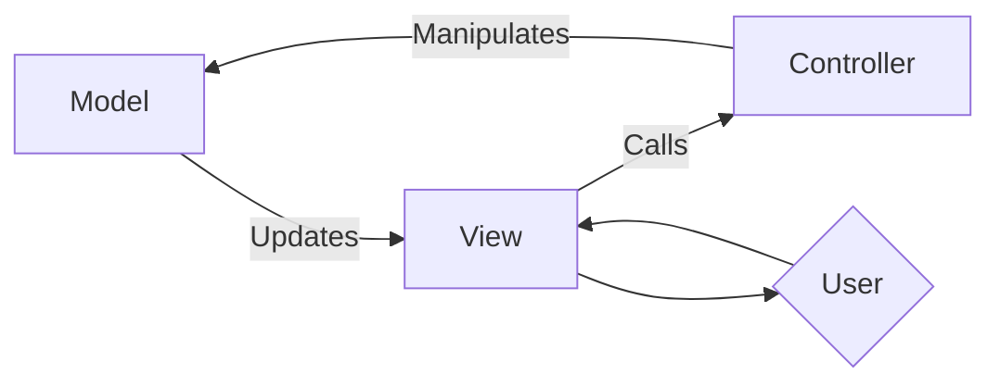
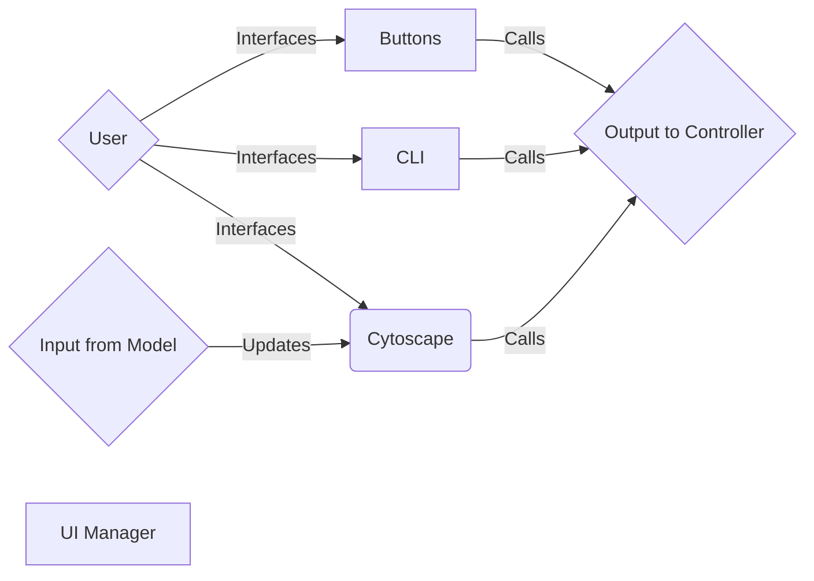
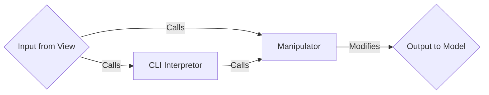
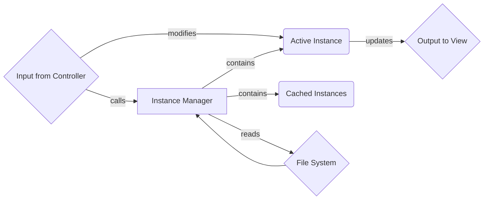

# Graupel Graph Visualizer

rocRoller's graph visualization tool.

## Setup

From up-to-date Docker container, run

1. `cd utils/graupel`
1. `npm install`, if that fails try `npm install --save-dev`

The script `utils/graupel/install-node` should work to install node on an existing container, although you may need to update your `$PATH`.

## Usage

### Running the tool

1. Change directory to `utils/graupel/` (the following paths are relative to this)
2. Run `npm start`, a port will become availible for the graph visualizer
   - If the port is in-use, use `npm start [port]`
3. Run `new <filepath>` in the textbox, e.g. `new kernels/sample.s`
4. Open your browser's console and spam the "Help Me" button ([raw prompts](src/controller/specialManipulators/help.ts)).
5. Basic commands can be ran in the form of `commandName [arg] ...`, e.g. `highlight .control`.
6. Useful commands:
   - `idselect .coo[rdinate]15` and `idselect .con[trol]16` to select coordinate and control graph node 15 respectively (only first three letters of subgraph are needed to distinguish betweem them)
7. Special CLI features:
   - Prefixing with a \`(backtick) is code injection, e.g. `` `console.log(1 + 2); cy.$(".control-computeindex").difference("#control1529").addClass("highlight")``.
   - Code injection beginning with `cy.` can be abbreviated to `.`, e.g. `.$(".control-computeindex").difference("#control1529").addClass("highlight")`.

### (Optional) Getting *All* Kernels as Inputs

1. In `build/`, run `ROCROLLER_SAVE_ASSEMBLY=1 ../scripts/rrperf run` to generate the assembly (`.s`) files which contain the metadata (at the end of the file) as the input for this tool (this may take a while)
1. Change directory to `utils/graupel/` (the following paths are relative to this)
1. Run `./kernels/getKernels.py -v` (this copies the above-generated `.s` files to `kernels/`). A file called `kernels.txt` is also generated, where each line is a `<filepath>` that can later be used for `new <filepath>` in the tool.

## Development

- `npm run dev` will also auto-refresh on `*.ts` file save

## Tests

in `utils/graupel/` run `npm test`

## Architecture

### Overall

### View

### Controller

### Model

Unlabeled arrow is transfer of data.
Rounded boxes are abstract (no respective file).
